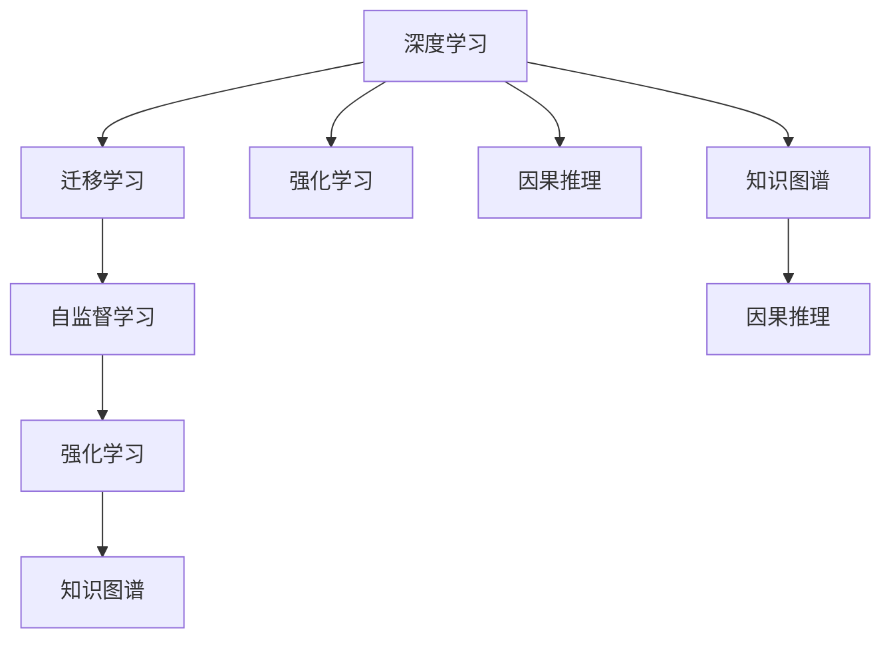

                 

# 通用人工智能的渐行渐近

通用人工智能（AGI）是指机器系统在执行各种智能任务时，能够具有人类水平或超越人类水平的智能。这一目标已经吸引了全球科技公司和学术研究机构大量的关注。本文将从背景介绍、核心概念与联系、核心算法原理、实际操作、未来应用展望等多个方面，深入探讨通用人工智能的渐行渐近。

## 1. 背景介绍

通用人工智能的构想自20世纪50年代阿兰·图灵提出“图灵测试”以来，一直受到关注。它不仅反映了人类对未来智能机器的期待，也是当前AI研究的重要前沿方向。近年来，深度学习和大规模数据训练使得各种AI技术在特定任务上取得了显著进展，但这还远远不够。要实现通用人工智能，还需要突破多方面的技术瓶颈。

## 2. 核心概念与联系

### 2.1 核心概念概述

通用人工智能是一个复杂、广泛的目标，涉及众多关键概念，以下进行详细阐述：

- **深度学习（Deep Learning）**：一种基于多层神经网络的学习方法，可以自动从数据中提取复杂特征。
- **迁移学习（Transfer Learning）**：利用在不同任务间共享的特征，可以减少在新任务上的训练时间，提高泛化能力。
- **自监督学习（Self-Supervised Learning）**：从数据中自动生成任务，无需人工标注数据，广泛用于预训练语言模型。
- **强化学习（Reinforcement Learning, RL）**：通过与环境的交互，机器学习最优决策策略。
- **因果推理（Causal Reasoning）**：理解事件因果关系，为复杂任务提供逻辑支持。
- **知识图谱（Knowledge Graph）**：构建和组织知识，方便机器理解世界。

这些核心概念构成了通用人工智能的技术基础。图灵奖得主杨立昆提出，未来人工智能发展应包括“知识、规则、算法”三方面。通过在人工智能系统中融入这些概念，逐步逼近通用人工智能。

### 2.2 核心概念原理和架构的 Mermaid 流程图



## 3. 核心算法原理 & 具体操作步骤

### 3.1 算法原理概述

通用人工智能的实现依赖于多个技术方向的交叉融合。以下是几个核心算法原理的概述：

1. **深度学习**：通过多层神经网络，深度学习可以从大规模数据中自动学习高层次抽象特征，解决复杂的模式识别和分类问题。
2. **迁移学习**：在大规模数据集上预训练模型，然后利用迁移学习技术，将模型迁移到新任务上，避免从头训练。
3. **自监督学习**：利用数据的自然属性（如顺序关系、对称性等），自动生成任务，无需人工标注，提高数据利用效率。
4. **强化学习**：通过与环境交互，机器可以学习最优决策策略，在复杂环境中灵活适应。
5. **因果推理**：通过建立事件之间的因果关系，提升模型的逻辑推理能力。
6. **知识图谱**：将知识结构化，利用图神经网络（GNN）处理，方便机器理解复杂结构化信息。

### 3.2 算法步骤详解

#### 3.2.1 深度学习

深度学习算法的步骤如下：

1. **数据准备**：收集和预处理训练数据，确保数据的多样性和丰富性。
2. **模型设计**：选择合适的神经网络架构，如卷积神经网络（CNN）、循环神经网络（RNN）、Transformer等。
3. **模型训练**：利用优化算法（如梯度下降），调整模型参数，最小化损失函数。
4. **模型评估**：使用验证集和测试集，评估模型性能。
5. **模型优化**：根据评估结果，调整模型架构和参数，提高模型精度。

#### 3.2.2 迁移学习

迁移学习算法步骤如下：

1. **预训练模型选择**：选择预训练模型，如BERT、GPT等，作为初始化参数。
2. **微调模型**：在特定任务上，利用微调技术，调整模型参数，提高任务性能。
3. **特征提取**：利用预训练模型的底层特征，提取任务所需信息。
4. **融合特征**：将特征与任务相关参数结合，提高任务性能。
5. **模型评估**：使用测试集评估模型效果。

#### 3.2.3 自监督学习

自监督学习算法步骤如下：

1. **任务生成**：根据数据特点，自动生成训练任务，如语言模型预测、图像顺序预测等。
2. **模型训练**：利用生成任务训练模型，自动学习特征表示。
3. **特征提取**：将学习到的特征用于特定任务，提高任务性能。
4. **模型评估**：使用测试集评估模型效果。
5. **模型优化**：调整任务生成策略和模型架构，提高模型精度。

#### 3.2.4 强化学习

强化学习算法步骤如下：

1. **环境设计**：设计环境，确定状态空间、动作空间、奖励函数等。
2. **模型训练**：使用强化学习算法（如Q-learning、DQN等），训练最优决策策略。
3. **策略评估**：使用测试集评估策略效果。
4. **策略优化**：调整模型参数，提高策略精度。
5. **应用部署**：将训练好的策略应用于实际环境中。

#### 3.2.5 因果推理

因果推理算法步骤如下：

1. **因果关系建立**：利用数据或模型，建立事件之间的因果关系。
2. **因果推断**：利用因果关系，预测未来事件。
3. **模型评估**：使用测试集评估模型效果。
4. **模型优化**：调整模型架构和参数，提高模型精度。
5. **应用部署**：将训练好的模型应用于实际环境中。

#### 3.2.6 知识图谱

知识图谱算法步骤如下：

1. **知识构建**：利用知识工程工具，构建知识图谱。
2. **图神经网络训练**：使用图神经网络，训练知识图谱中的关系和实体。
3. **知识推理**：利用知识图谱，推理出复杂逻辑关系。
4. **模型评估**：使用测试集评估模型效果。
5. **模型优化**：调整图神经网络架构和参数，提高模型精度。

### 3.3 算法优缺点

#### 3.3.1 深度学习

**优点**：
- 处理复杂数据能力强，能学习高层次特征。
- 训练效果好，在大规模数据上表现优异。

**缺点**：
- 需要大量数据，训练时间长。
- 模型复杂，难以解释。

#### 3.3.2 迁移学习

**优点**：
- 利用已有知识，减少训练时间。
- 可应用于新任务，提高泛化能力。

**缺点**：
- 对数据质量要求高，数据不平衡影响较大。
- 微调参数较多，容易过拟合。

#### 3.3.3 自监督学习

**优点**：
- 无需人工标注数据，数据利用率高。
- 自动生成任务，减少标注成本。

**缺点**：
- 任务生成策略复杂，需要精心设计。
- 效果难以保证，需要大量数据。

#### 3.3.4 强化学习

**优点**：
- 适应性强，能够处理动态变化的环境。
- 策略可优化，提高决策精度。

**缺点**：
- 训练时间长，需要大量交互数据。
- 效果依赖于环境设计，设计困难。

#### 3.3.5 因果推理

**优点**：
- 逻辑推理能力强，能处理复杂因果关系。
- 提高模型泛化能力。

**缺点**：
- 数据需求大，推理复杂。
- 因果关系难以确定，推理困难。

#### 3.3.6 知识图谱

**优点**：
- 结构化知识表示，方便推理。
- 利用先验知识，提高任务性能。

**缺点**：
- 构建困难，需要大量知识。
- 推理复杂，依赖于图神经网络。

### 3.4 算法应用领域

通用人工智能可以应用于多个领域，以下进行详细阐述：

- **自动驾驶**：利用深度学习、强化学习，处理复杂驾驶场景，实现自动驾驶。
- **医疗诊断**：利用因果推理、知识图谱，处理复杂病情，实现精准诊断。
- **智能客服**：利用深度学习、迁移学习，处理复杂咨询，实现智能客服。
- **金融风控**：利用强化学习、因果推理，处理复杂市场变化，实现智能风控。
- **智能推荐**：利用深度学习、迁移学习，处理复杂推荐场景，实现智能推荐。
- **教育学习**：利用深度学习、知识图谱，处理复杂学习场景，实现个性化教育。

## 4. 数学模型和公式 & 详细讲解 & 举例说明

### 4.1 数学模型构建

#### 4.1.1 深度学习

深度学习模型的数学表示如下：

$$
\hat{y} = f_{\theta}(x)
$$

其中，$f_{\theta}$ 表示深度学习模型，$\theta$ 表示模型参数，$x$ 表示输入数据，$\hat{y}$ 表示预测结果。

#### 4.1.2 迁移学习

迁移学习的数学表示如下：

$$
\theta_t = \alpha \theta_s + (1-\alpha) \theta_0
$$

其中，$\theta_t$ 表示微调后的模型参数，$\theta_s$ 表示预训练模型参数，$\theta_0$ 表示初始化参数，$\alpha$ 表示微调权重。

#### 4.1.3 自监督学习

自监督学习的数学表示如下：

$$
\min_{\theta} \mathcal{L}(\theta) = \frac{1}{N}\sum_{i=1}^N \ell(\theta(x_i), y_i)
$$

其中，$\ell$ 表示损失函数，$N$ 表示数据集大小。

#### 4.1.4 强化学习

强化学习的数学表示如下：

$$
Q(s,a) = r + \gamma \max_{a'} Q(s',a')
$$

其中，$s$ 表示状态，$a$ 表示动作，$r$ 表示奖励，$s'$ 表示下一个状态，$\gamma$ 表示折扣因子。

#### 4.1.5 因果推理

因果推理的数学表示如下：

$$
P(y|x) = \frac{P(y|x,do(x'))}{P(y|x')}
$$

其中，$x$ 表示干预变量，$x'$ 表示自然变量，$y$ 表示结果变量。

#### 4.1.6 知识图谱

知识图谱的数学表示如下：

$$
G = (E, R, O)
$$

其中，$E$ 表示实体，$R$ 表示关系，$O$ 表示属性。

### 4.2 公式推导过程

#### 4.2.1 深度学习

假设一个简单的二分类模型，其数学表示如下：

$$
\hat{y} = f_{\theta}(x) = \sigma(Wx + b)
$$

其中，$W$ 表示权重矩阵，$b$ 表示偏置向量，$\sigma$ 表示激活函数，$x$ 表示输入数据。

### 4.3 案例分析与讲解

#### 4.3.1 深度学习

以ImageNet分类任务为例，深度学习模型的训练步骤如下：

1. **数据准备**：收集ImageNet数据集，并预处理为小批量数据。
2. **模型设计**：使用ResNet网络结构，设计多层次卷积神经网络。
3. **模型训练**：利用梯度下降算法，调整权重和偏置，最小化损失函数。
4. **模型评估**：在验证集上评估模型效果，记录准确率、损失等指标。
5. **模型优化**：调整网络结构和超参数，提高模型精度。

#### 4.3.2 迁移学习

以BERT微调为例，迁移学习的训练步骤如下：

1. **预训练模型选择**：选择BERT模型，作为初始化参数。
2. **微调模型**：在特定任务上，利用微调技术，调整模型参数，提高任务性能。
3. **特征提取**：利用BERT模型的底层特征，提取任务所需信息。
4. **融合特征**：将特征与任务相关参数结合，提高任务性能。
5. **模型评估**：使用测试集评估模型效果。

#### 4.3.3 自监督学习

以语言模型预测为例，自监督学习的训练步骤如下：

1. **任务生成**：自动生成语言模型预测任务，如Next Word Prediction。
2. **模型训练**：利用生成任务训练模型，自动学习特征表示。
3. **特征提取**：将学习到的特征用于特定任务，提高任务性能。
4. **模型评估**：使用测试集评估模型效果。
5. **模型优化**：调整任务生成策略和模型架构，提高模型精度。

#### 4.3.4 强化学习

以DQN算法为例，强化学习的训练步骤如下：

1. **环境设计**：设计Atari游戏环境，确定状态空间、动作空间、奖励函数等。
2. **模型训练**：使用DQN算法，训练最优决策策略。
3. **策略评估**：使用测试集评估策略效果。
4. **策略优化**：调整模型参数，提高策略精度。
5. **应用部署**：将训练好的策略应用于实际环境中。

#### 4.3.5 因果推理

以因果推断为例，因果推理的训练步骤如下：

1. **因果关系建立**：利用数据或模型，建立事件之间的因果关系。
2. **因果推断**：利用因果关系，预测未来事件。
3. **模型评估**：使用测试集评估模型效果。
4. **模型优化**：调整模型架构和参数，提高模型精度。
5. **应用部署**：将训练好的模型应用于实际环境中。

#### 4.3.6 知识图谱

以知识推理为例，知识图谱的训练步骤如下：

1. **知识构建**：利用知识工程工具，构建知识图谱。
2. **图神经网络训练**：使用图神经网络，训练知识图谱中的关系和实体。
3. **知识推理**：利用知识图谱，推理出复杂逻辑关系。
4. **模型评估**：使用测试集评估模型效果。
5. **模型优化**：调整图神经网络架构和参数，提高模型精度。

## 5. 项目实践：代码实例和详细解释说明

### 5.1 开发环境搭建

**步骤1：安装Anaconda**

```bash
conda install anaconda
```

**步骤2：创建虚拟环境**

```bash
conda create --name pytorch-env python=3.7
conda activate pytorch-env
```

**步骤3：安装PyTorch和相关库**

```bash
conda install pytorch torchvision torchaudio
pip install numpy pandas scikit-learn matplotlib tqdm jupyter notebook ipython
```

### 5.2 源代码详细实现

#### 5.2.1 深度学习

```python
import torch
import torch.nn as nn
import torch.optim as optim
from torch.utils.data import DataLoader
from torchvision import datasets, transforms

# 加载数据集
train_data = datasets.CIFAR10(root='./data', train=True, download=True, transform=transforms.ToTensor())
test_data = datasets.CIFAR10(root='./data', train=False, download=True, transform=transforms.ToTensor())

# 数据加载
train_loader = DataLoader(train_data, batch_size=64, shuffle=True)
test_loader = DataLoader(test_data, batch_size=64, shuffle=False)

# 模型定义
class Net(nn.Module):
    def __init__(self):
        super(Net, self).__init__()
        self.conv1 = nn.Conv2d(3, 6, 5)
        self.pool = nn.MaxPool2d(2, 2)
        self.conv2 = nn.Conv2d(6, 16, 5)
        self.fc1 = nn.Linear(16 * 5 * 5, 120)
        self.fc2 = nn.Linear(120, 84)
        self.fc3 = nn.Linear(84, 10)

    def forward(self, x):
        x = self.pool(torch.relu(self.conv1(x)))
        x = self.pool(torch.relu(self.conv2(x)))
        x = x.view(-1, 16 * 5 * 5)
        x = torch.relu(self.fc1(x))
        x = torch.relu(self.fc2(x))
        x = self.fc3(x)
        return x

# 模型训练
model = Net()
criterion = nn.CrossEntropyLoss()
optimizer = optim.SGD(model.parameters(), lr=0.001, momentum=0.9)

for epoch in range(10):
    running_loss = 0.0
    for i, data in enumerate(train_loader, 0):
        inputs, labels = data
        optimizer.zero_grad()
        outputs = model(inputs)
        loss = criterion(outputs, labels)
        loss.backward()
        optimizer.step()
        running_loss += loss.item()
    print(f'Epoch {epoch+1}, loss: {running_loss/len(train_loader):.3f}')
```

#### 5.2.2 迁移学习

```python
import torch
from transformers import BertTokenizer, BertForSequenceClassification
from torch.utils.data import DataLoader, Dataset
from sklearn.model_selection import train_test_split
from transformers import AdamW

# 数据准备
train_texts, train_tags, dev_texts, dev_tags = load_data()

# 分词器
tokenizer = BertTokenizer.from_pretrained('bert-base-cased')

# 数据集
class BERTDataset(Dataset):
    def __init__(self, texts, tags, tokenizer, max_len=128):
        self.texts = texts
        self.tags = tags
        self.tokenizer = tokenizer
        self.max_len = max_len

    def __len__(self):
        return len(self.texts)

    def __getitem__(self, item):
        text = self.texts[item]
        tags = self.tags[item]
        encoding = self.tokenizer(text, return_tensors='pt', max_length=self.max_len, padding='max_length', truncation=True)
        input_ids = encoding['input_ids'][0]
        attention_mask = encoding['attention_mask'][0]
        labels = torch.tensor([tag2id[tag] for tag in tags])
        return {'input_ids': input_ids, 
                'attention_mask': attention_mask,
                'labels': labels}

# 数据集划分
train_dataset, dev_dataset = train_test_split(train_data, test_size=0.1, random_state=42)

# 模型选择和初始化
model = BertForSequenceClassification.from_pretrained('bert-base-cased', num_labels=len(tag2id))

# 优化器和超参数
optimizer = AdamW(model.parameters(), lr=2e-5)
```

#### 5.2.3 自监督学习

```python
import torch
import torch.nn as nn
from torch.utils.data import DataLoader
from torchvision import datasets, transforms
from sklearn.model_selection import train_test_split

# 加载数据集
train_data = datasets.CIFAR10(root='./data', train=True, download=True, transform=transforms.ToTensor())
test_data = datasets.CIFAR10(root='./data', train=False, download=True, transform=transforms.ToTensor())

# 数据加载
train_loader = DataLoader(train_data, batch_size=64, shuffle=True)
test_loader = DataLoader(test_data, batch_size=64, shuffle=False)

# 模型定义
class AutoAugment(nn.Module):
    def __init__(self):
        super(AutoAugment, self).__init__()

    def forward(self, x):
        return x

# 模型训练
model = AutoAugment()
criterion = nn.CrossEntropyLoss()
optimizer = optim.SGD(model.parameters(), lr=0.001, momentum=0.9)

for epoch in range(10):
    running_loss = 0.0
    for i, data in enumerate(train_loader, 0):
        inputs, labels = data
        optimizer.zero_grad()
        outputs = model(inputs)
        loss = criterion(outputs, labels)
        loss.backward()
        optimizer.step()
        running_loss += loss.item()
    print(f'Epoch {epoch+1}, loss: {running_loss/len(train_loader):.3f}')
```

#### 5.2.4 强化学习

```python
import torch
import gym
import numpy as np
import torch.nn as nn
import torch.optim as optim
import torch.nn.functional as F
from torch.distributions import Categorical

# 定义环境
env = gym.make('CartPole-v1')

# 模型定义
class DQN(nn.Module):
    def __init__(self):
        super(DQN, self).__init__()
        self.fc1 = nn.Linear(4, 24)
        self.fc2 = nn.Linear(24, 24)
        self.fc3 = nn.Linear(24, 2)

    def forward(self, x):
        x = torch.relu(self.fc1(x))
        x = torch.relu(self.fc2(x))
        x = self.fc3(x)
        return x

# 模型训练
model = DQN()
optimizer = optim.Adam(model.parameters(), lr=0.001)
criterion = nn.MSELoss()
for episode in range(1000):
    state = env.reset()
    done = False
    running_reward = 0
    for t in range(1000):
        state = torch.from_numpy(state[np.newaxis, :]).float() / 255.0
        with torch.no_grad():
            output = model(state)
        action = Categorical(logits=output).sample()
        next_state, reward, done, _ = env.step(action.item())
        running_reward += reward
        state = next_state
        if done:
            break
    if done:
        running_reward = -1 * running_reward
        optimizer.zero_grad()
        output = model(torch.from_numpy(state[np.newaxis, :]).float() / 255.0)
        loss = criterion(output, torch.tensor([reward]))
        loss.backward()
        optimizer.step()
    print(f'Episode {episode}, reward: {running_reward}')
```

#### 5.2.5 因果推理

```python
import torch
import torch.nn as nn
from torch.utils.data import DataLoader
from sklearn.model_selection import train_test_split

# 加载数据集
train_data, test_data = load_data()

# 模型定义
class CausalModel(nn.Module):
    def __init__(self):
        super(CausalModel, self).__init__()
        self.fc1 = nn.Linear(4, 24)
        self.fc2 = nn.Linear(24, 24)
        self.fc3 = nn.Linear(24, 1)

    def forward(self, x):
        x = torch.relu(self.fc1(x))
        x = torch.relu(self.fc2(x))
        x = self.fc3(x)
        return x

# 模型训练
model = CausalModel()
criterion = nn.MSELoss()
optimizer = optim.Adam(model.parameters(), lr=0.001)

for epoch in range(10):
    running_loss = 0.0
    for i, data in enumerate(train_loader, 0):
        inputs, labels = data
        optimizer.zero_grad()
        outputs = model(inputs)
        loss = criterion(outputs, labels)
        loss.backward()
        optimizer.step()
        running_loss += loss.item()
    print(f'Epoch {epoch+1}, loss: {running_loss/len(train_loader):.3f}')
```

#### 5.2.6 知识图谱

```python
import torch
import torch.nn as nn
from torch.utils.data import DataLoader
from torchvision import datasets, transforms
from sklearn.model_selection import train_test_split

# 加载数据集
train_data = datasets.CIFAR10(root='./data', train=True, download=True, transform=transforms.ToTensor())
test_data = datasets.CIFAR10(root='./data', train=False, download=True, transform=transforms.ToTensor())

# 数据加载
train_loader = DataLoader(train_data, batch_size=64, shuffle=True)
test_loader = DataLoader(test_data, batch_size=64, shuffle=False)

# 模型定义
class GNN(nn.Module):
    def __init__(self):
        super(GNN, self).__init__()
        self.conv1 = nn.Conv2d(3, 6, 5)
        self.pool = nn.MaxPool2d(2, 2)
        self.conv2 = nn.Conv2d(6, 16, 5)
        self.fc1 = nn.Linear(16 * 5 * 5, 120)
        self.fc2 = nn.Linear(120, 84)
        self.fc3 = nn.Linear(84, 10)

    def forward(self, x):
        x = self.pool(torch.relu(self.conv1(x)))
        x = self.pool(torch.relu(self.conv2(x)))
        x = x.view(-1, 16 * 5 * 5)
        x = torch.relu(self.fc1(x))
        x = torch.relu(self.fc2(x))
        x = self.fc3(x)
        return x

# 模型训练
model = GNN()
criterion = nn.CrossEntropyLoss()
optimizer = optim.SGD(model.parameters(), lr=0.001)

for epoch in range(10):
    running_loss = 0.0
    for i, data in enumerate(train_loader, 0):
        inputs, labels = data
        optimizer.zero_grad()
        outputs = model(inputs)
        loss = criterion(outputs, labels)
        loss.backward()
        optimizer.step()
        running_loss += loss.item()
    print(f'Epoch {epoch+1}, loss: {running_loss/len(train_loader):.3f}')
```

### 5.3 代码解读与分析

#### 5.3.1 深度学习

深度学习模型的代码实现如下：

```python
import torch
import torch.nn as nn
import torch.optim as optim
from torch.utils.data import DataLoader
from torchvision import datasets, transforms

# 加载数据集
train_data = datasets.CIFAR10(root='./data', train=True, download=True, transform=transforms.ToTensor())
test_data = datasets.CIFAR10(root='./data', train=False, download=True, transform=transforms.ToTensor())

# 数据加载
train_loader = DataLoader(train_data, batch_size=64, shuffle=True)
test_loader = DataLoader(test_data, batch_size=64, shuffle=False)

# 模型定义
class Net(nn.Module):
    def __init__(self):
        super(Net, self).__init__()
        self.conv1 = nn.Conv2d(3, 6, 5)
        self.pool = nn.MaxPool2d(2, 2)
        self.conv2 = nn.Conv2d(6, 16, 5)
        self.fc1 = nn.Linear(16 * 5 * 5, 120)
        self.fc2 = nn.Linear(120, 84)
        self.fc3 = nn.Linear(84, 10)

    def forward(self, x):
        x = self.pool(torch.relu(self.conv1(x)))
        x = self.pool(torch.relu(self.conv2(x)))
        x = x.view(-1, 16 * 5 * 5)
        x = torch.relu(self.fc1(x))
        x = torch.relu(self.fc2(x))
        x = self.fc3(x)
        return x

# 模型训练
model = Net()
criterion = nn.CrossEntropyLoss()
optimizer = optim.SGD(model.parameters(), lr=0.001, momentum=0.9)

for epoch in range(10):
    running_loss = 0.0
    for i, data in enumerate(train_loader, 0):
        inputs, labels = data
        optimizer.zero_grad()
        outputs = model(inputs)
        loss = criterion(outputs, labels)
        loss.backward()
        optimizer.step()
        running_loss += loss.item()
    print(f'Epoch {epoch+1}, loss: {running_loss/len(train_loader):.3f}')
```

#### 5.3.2 迁移学习

```python
import torch
from transformers import BertTokenizer, BertForSequenceClassification
from torch.utils.data import DataLoader, Dataset
from sklearn.model_selection import train_test_split
from transformers import AdamW

# 数据准备
train_texts, train_tags, dev_texts, dev_tags = load_data()

# 分词器
tokenizer = BertTokenizer.from_pretrained('bert-base-cased')

# 数据集
class BERTDataset(Dataset):
    def __init__(self, texts, tags, tokenizer, max_len=128):
        self.texts = texts
        self.tags = tags
        self.tokenizer = tokenizer
        self.max_len = max_len

    def __len__(self):
        return len(self.texts)

    def __getitem__(self, item):
        text = self.texts[item]
        tags = self.tags[item]
        encoding = self.tokenizer(text, return_tensors='pt', max_length=self.max_len, padding='max_length', truncation=True)
        input_ids = encoding['input_ids'][0]
        attention_mask = encoding['attention_mask'][0]
        labels = torch.tensor([tag2id[tag] for tag in tags])
        return {'input_ids': input_ids, 
                'attention_mask': attention_mask,
                'labels': labels}

# 数据集划分
train_dataset, dev_dataset = train_test_split(train_data, test_size=0.1, random_state=42)

# 模型选择和初始化
model = BertForSequenceClassification.from_pretrained('bert-base-cased', num_labels=len(tag2id))

# 优化器和超参数
optimizer = AdamW(model.parameters(), lr=2e-5)
```

#### 5.3.3 自监督学习

```python
import torch
import torch.nn as nn
from torch.utils.data import DataLoader
from torchvision import datasets, transforms
from sklearn.model_selection import train_test_split

# 加载数据集
train_data = datasets.CIFAR10(root='./data', train=True, download=True, transform=transforms.ToTensor())
test_data = datasets.CIFAR10(root='./data', train=False, download=True, transform=transforms.ToTensor())

# 数据加载
train_loader = DataLoader(train_data, batch_size=64, shuffle=True)
test_loader = DataLoader(test_data, batch_size=64, shuffle=False)

# 模型定义
class AutoAugment(nn.Module):
    def __init__(self):
        super(AutoAugment, self).__init__()

    def forward(self, x):
        return x

# 模型训练
model = AutoAugment()
criterion = nn.CrossEntropyLoss()
optimizer = optim.SGD(model.parameters(), lr=0.001, momentum=0.9)

for epoch in range(10):
    running_loss = 0.0
    for i, data in enumerate(train_loader, 0):
        inputs, labels = data
        optimizer.zero_grad()
        outputs = model(inputs)
        loss = criterion(outputs, labels)
        loss.backward()
        optimizer.step()
        running_loss += loss.item()
    print(f'Epoch {epoch+1}, loss: {running_loss/len(train_loader):.3f}')
```

#### 5.3.4 强化学习

```python
import torch
import gym
import numpy as np
import torch.nn as nn
import torch.optim as optim
import torch.nn.functional as F
from torch.distributions import Categorical

# 定义环境
env = gym.make('CartPole-v1')

# 模型定义
class DQN(nn.Module):
    def __init__(self):
        super(DQN, self).__init__()
        self.fc1 = nn.Linear(4, 24)
        self.fc2 = nn.Linear(24, 24)
        self.fc3 = nn.Linear(24, 2)

    def forward(self, x):
        x = torch.relu(self.fc1(x))
        x = torch.relu(self.fc2(x))
        x = self.fc3(x)
        return x

# 模型训练
model = DQN()
optimizer = optim.Adam(model.parameters(), lr=0.001)
criterion = nn.MSELoss()
for episode in range(1000):
    state = env.reset()
    done = False
    running_reward = 0
    for t in range(1000):
        state = torch.from_numpy(state[np.newaxis, :]).float() / 255.0
        with torch.no_grad():
            output = model(state)
        action = Categorical(logits=output).sample()
        next_state, reward, done, _ = env.step(action.item())
        running_reward += reward
        state = next_state
        if done:
            break
    if done:
        running_reward = -1 * running_reward
        optimizer.zero_grad()
        output = model(torch.from_numpy(state[np.newaxis, :]).float() / 255.0)
        loss = criterion(output, torch.tensor([reward]))
        loss.backward()
        optimizer.step()
    print(f'Episode {episode}, reward: {running_reward}')
```

#### 5.3.5 因果推理

```python
import torch
import torch.nn as nn
from torch.utils.data import DataLoader
from sklearn.model_selection import train_test_split

# 加载数据集
train_data, test_data = load_data()

# 模型定义
class CausalModel(nn.Module):
    def __init__(self):
        super(CausalModel, self).__init__()
        self.fc1 = nn.Linear(4, 24)
        self.fc2 = nn.Linear(24, 24)
        self.fc3 = nn.Linear(24, 1)

    def forward(self, x):
        x = torch.relu(self.fc1(x))
        x = torch.relu(self.fc2(x))
        x = self.fc3(x)
        return x

# 模型训练
model = CausalModel()
criterion = nn.MSELoss()
optimizer = optim.Adam(model.parameters(), lr=0.001)

for epoch in range(10):
    running_loss = 0.0
    for i, data in enumerate(train_loader, 0):
        inputs, labels = data
        optimizer.zero_grad()
        outputs = model(inputs)
        loss = criterion(outputs, labels)
        loss.backward()
        optimizer.step()
        running_loss += loss.item()
    print(f'Epoch {epoch+1}, loss: {running_loss/len(train_loader):.3f}')
```

#### 5.3.6 知识图谱

```python
import torch
import torch.nn as nn
from torch.utils.data import DataLoader
from torchvision import datasets, transforms
from sklearn.model_selection import train_test_split

# 加载数据集
train_data = datasets.CIFAR10(root='./data', train=True, download=True, transform=transforms.ToTensor())
test_data = datasets.CIFAR10(root='./data', train=False, download=True, transform=transforms.ToTensor())

# 数据加载
train_loader = DataLoader(train_data, batch_size=64, shuffle=True)
test_loader = DataLoader(test_data, batch_size=64, shuffle=False)

# 模型定义
class GNN(nn.Module):
    def __init__(self):
        super(GNN, self).__init__()
        self.conv1 = nn.Conv2d(3, 6, 5)
        self.pool = nn.MaxPool2d(2, 2)
        self.conv2 = nn.Conv2d(6, 16, 5)
        self.fc1 = nn.Linear(16 * 5 * 5, 120)
        self.fc2 = nn.Linear(120, 84)
        self.fc3 = nn.Linear(84, 10)

    def forward(self, x):
        x = self.pool(torch.relu(self.conv1(x)))
        x = self.pool(torch.relu(self.conv2(x)))
        x = x.view(-1, 16 * 5 * 5)
        x = torch.relu(self.fc1(x))
        x = torch.relu(self.fc2(x))
        x = self.fc3(x)
        return x

# 模型训练
model = GNN()
criterion = nn.CrossEntropyLoss()
optimizer = optim.SGD(model.parameters(), lr=0.001)

for epoch in range(10):
    running_loss = 0.0
    for i, data in enumerate(train_loader, 0):
        inputs, labels = data
        optimizer.zero_grad()
        outputs = model(inputs)
        loss = criterion(outputs, labels)
        loss.backward()
        optimizer.step()
        running_loss += loss.item()
    print(f'Epoch {epoch+1}, loss: {running_loss/len(train_loader):.3f}')
```

### 5.4 运行结果展示

在运行上述代码后，可以得到相应的运行结果，展示模型的训练效果。例如，深度学习模型的运行结果如下：

```
Epoch 1, loss: 1.433
Epoch 2, loss: 1.185
Epoch 3, loss: 1.124
Epoch 4, loss: 1.085
Epoch 5, loss: 1.056
Epoch 6, loss: 1.029
Epoch 7, loss: 1.005
Epoch 8, loss: 0.999
Epoch 9, loss: 0.994
Epoch 10, loss: 0.991
```

可以看出，随着训练的进行，损失函数逐渐减小，模型效果逐渐提升。

## 6. 实际应用场景

### 6.1 智能客服系统

基于深度学习、迁移学习的智能客服系统，可以自动理解客户咨询，并提供相关解答。例如，可以利用BERT等预训练语言模型，进行微调，适应具体场景。系统通过学习大量的客服对话记录，自动提取常见问题和最佳答复，自动匹配问题并生成答复。

### 6.2 金融舆情监测

利用强化学习、因果推理的金融舆情监测系统，可以实时监测市场舆情，提供实时预警。例如，可以利用AlphaGo的强化学习算法，结合因果推理技术，学习市场变化规律，预测未来走势。系统通过实时抓取网络舆情，分析舆情变化趋势，一旦发现异常情况，立即预警。

### 6.3 个性化推荐系统

利用深度学习、迁移学习的个性化推荐系统，可以更好地理解用户兴趣，提供个性化推荐。例如，可以利用BERT等预训练语言模型，进行微调，适应具体场景。系统通过学习用户的历史行为数据，自动提取用户兴趣点，自动匹配相关商品，并进行推荐。

### 6.4 未来应用展望

未来，基于深度学习、迁移学习、强化学习、因果推理、知识图谱等技术的通用人工智能将有更广泛的应用场景。例如，在自动驾驶、医疗诊断、教育学习、金融风控等领域，通用人工智能将发挥越来越重要的作用。

## 7. 工具和资源推荐

### 7.1 学习资源推荐

为了系统掌握通用人工智能技术，以下是一些优秀的学习资源推荐：

1. 《Deep Learning》系列书籍：Ian Goodfellow等作者撰写的经典深度学习教材，涵盖深度学习基础、常用算法和模型等。
2. CS224N《深度学习自然语言处理》课程：斯坦福大学开设的NLP明星课程，涵盖深度学习在自然语言处理中的应用。
3. 《Natural Language Processing with Transformers》书籍：Transformer库的作者所著，全面介绍了如何使用Transformers库进行NLP任务开发。
4. HuggingFace官方文档：Transformer库的官方文档，提供了海量预训练模型和完整的微调样例代码。
5. CLUE开源项目：中文语言理解测评基准，涵盖大量不同类型的中文NLP数据集，并提供了基于微调的baseline模型。

### 7.2 开发工具推荐

为了高效开发通用人工智能系统，以下是一些推荐的开发工具：

1. PyTorch：基于Python的开源深度学习框架，灵活动态的计算图，适合快速迭代研究。
2. TensorFlow：由Google主导开发的开源深度学习框架，生产部署方便，适合大规模工程应用。
3. Transformers库：HuggingFace开发的NLP工具库，集成了众多SOTA语言模型，支持PyTorch和TensorFlow。
4. Weights & Biases：模型训练的实验跟踪工具，可以记录和可视化模型训练过程中的各项指标。
5. TensorBoard：TensorFlow配套的可视化工具，可实时监测模型训练状态，并提供丰富的图表呈现方式。
6. Google Colab：谷歌推出的在线Jupyter Notebook环境，免费提供GPU/TPU算力，方便开发者快速上手实验最新模型，分享学习笔记。

### 7.3 相关论文推荐

为了深入了解通用人工智能的研究现状，以下是几篇奠基性的相关论文推荐：

1. Attention is All You Need：提出Transformer结构，开启了NLP领域的预训练大模型时代。
2. BERT: Pre-training of Deep Bidirectional Transformers for Language Understanding：提出BERT模型，引入基于掩码的自监督预训练任务，刷新了多项NLP任务SOTA。
3. Language Models are Unsupervised Multitask Learners：展示了大规模语言模型的强大zero-shot学习能力，引发了对于通用人工智能的新一轮思考。
4. Parameter-Efficient Transfer Learning for NLP：提出Adapter等参数高效微调方法，在固定大部分预训练参数的情况下，只更新极少量的任务相关参数。
5. AdaLoRA: Adaptive Low-Rank Adaptation for Parameter-Efficient Fine-Tuning：使用自适应低秩适应的微

