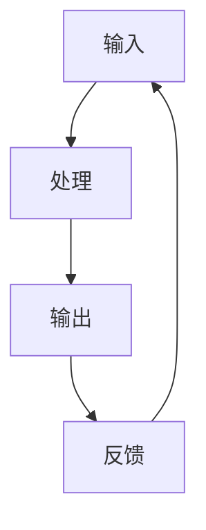

                 

# 重塑个人工作流：输入、处理、输出、反馈的循环

> 关键词：个人工作流、输入、处理、输出、反馈循环、系统思维、自动化、数据驱动、迭代优化

## 1. 背景介绍

### 1.1 问题由来
随着信息时代的到来，个人的工作方式和工作效率成为了越来越多人关注的焦点。如何在日趋复杂的工作环境中保持高效和产出，成为了一个重要的课题。传统的线性工作流往往以单任务为主，难以处理多任务和多变的工作场景。随着计算机技术的发展，各种协作工具和项目管理软件不断涌现，为个人工作流管理提供了新的思路。

### 1.2 问题核心关键点
为了提高个人工作效率，降低工作压力，构建一个科学高效的工作流循环，成为了当务之急。本文将从系统思维的角度出发，介绍一个全面、科学的工作流循环，包括输入、处理、输出、反馈四个关键环节。通过这种循环，个人可以更有效地管理时间、资源和信息，从而提高工作产出。

### 1.3 问题研究意义
研究个人工作流循环，对于提升个人的工作效率和产出，降低工作压力，提升职业幸福感，具有重要意义：

1. 提升效率：通过科学的设计和管理，可以减少任务切换时间，提高单位时间内的产出。
2. 降低压力：明确的任务流程和反馈机制，有助于减少不确定性，降低工作压力。
3. 提高产出：通过不断迭代优化，可以逐步提升个人的工作质量和效果。
4. 提升职业幸福感：通过合理的时间分配和管理，可以更好地平衡工作与生活，提升职业幸福感。
5. 应对变化：通过灵活的反馈和调整机制，可以应对各种变化，保持工作流的高效和稳定。

## 2. 核心概念与联系

### 2.1 核心概念概述

为更好地理解个人工作流循环的各个环节，本节将介绍几个关键概念：

- 输入：指接收到的各种任务和信息，包括但不限于邮件、任务清单、会议日程等。
- 处理：指对输入信息进行分析和处理的阶段，包括任务分配、优先级排序、任务分解等。
- 输出：指完成处理后，生成的各种结果和反馈，如任务完成报告、会议纪要、工作日志等。
- 反馈：指对输出的评估和调整，包括自我评估、同事反馈、上级考核等，用于优化未来的工作流程。

### 2.2 核心概念原理和架构的 Mermaid 流程图



这个流程图展示了个人工作流循环的基本架构，其中每个节点代表一个关键环节，并通过循环反馈机制不断优化。

## 3. 核心算法原理 & 具体操作步骤
### 3.1 算法原理概述

个人工作流循环的核心思想是通过循环迭代，不断优化输入、处理、输出、反馈的各个环节，提高整体效率和产出。该循环的核心算法包括输入筛选、任务分解、优先级排序、输出生成和反馈机制等，下面详细介绍各部分的原理和操作步骤。

### 3.2 算法步骤详解

#### 3.2.1 输入筛选

输入筛选是整个工作流循环的第一步，其目的是从大量的信息流中筛选出真正重要和紧急的任务，以便进行后续处理。以下是详细的操作步骤：

1. **信息分类**：将所有接收到的信息按类别进行分类，如邮件、任务、日程等。可以使用工具如GTD（Getting Things Done）方法，对不同类型的信息进行区分。

2. **优先级排序**：根据任务的紧急程度和重要程度，对信息进行排序。可以使用四象限法（重要-紧急矩阵）来划分任务的优先级。

3. **自动化筛选**：利用自动化工具如IFTTT、Zapier等，将常见的筛选规则自动化，减少手动操作。

#### 3.2.2 任务分解

任务分解是将复杂任务拆分为多个小任务，以便更好地管理和执行。以下是详细的操作步骤：

1. **任务拆分**：将大任务拆分为具体的步骤和子任务，明确每个步骤的执行人和时间节点。可以使用项目管理工具如Trello、Asana等。

2. **资源分配**：根据每个小任务的需求，分配相应的资源，如人力、时间、资金等。合理分配资源可以避免资源的浪费和冲突。

3. **任务检查**：定期检查任务进度和完成情况，确保任务按时完成。可以使用甘特图、看板等工具进行跟踪。

#### 3.2.3 优先级排序

优先级排序是确保资源有效利用的关键步骤，其目的是让有限的资源用于最重要和紧急的任务。以下是详细的操作步骤：

1. **任务评估**：对每个任务进行评估，考虑其对整体目标的贡献和紧急程度。可以使用Eisenhower矩阵等工具。

2. **资源分配**：根据任务评估结果，优先分配资源给高优先级任务。合理分配资源可以提高工作效率，避免资源浪费。

3. **动态调整**：根据任务进展和变化，动态调整任务的优先级。使用看板等工具可以实时监控任务进展，及时调整优先级。

#### 3.2.4 输出生成

输出生成是将处理后的结果呈现出来，以便反馈和评估。以下是详细的操作步骤：

1. **报告生成**：根据处理后的任务结果，生成相应的报告或文档，如任务完成报告、会议纪要等。可以使用Office套件或在线文档工具如Google Docs等。

2. **文档存档**：将生成的文档和相关资料进行存档，方便后续查阅和审计。可以使用云存储服务如Google Drive、Dropbox等。

3. **共享与反馈**：将生成的文档和报告与相关人员共享，并收集反馈。使用协作工具如Slack、Microsoft Teams等可以方便地进行沟通和反馈。

#### 3.2.5 反馈机制

反馈机制是工作流循环的重要组成部分，其目的是根据输出结果进行评估和调整，不断优化输入和处理过程。以下是详细的操作步骤：

1. **自我评估**：定期对自己的工作进行自我评估，总结成功经验和不足之处。可以使用工作日志、KPI（关键绩效指标）等工具。

2. **同事反馈**：与同事进行沟通，收集他们的反馈和建议。使用反馈工具如SurveyMonkey、360度反馈等可以系统地收集反馈。

3. **上级考核**：定期与上级进行考核，获取他们的评估和指导。上级考核可以提供更高的视角和更专业的建议。

### 3.3 算法优缺点

个人工作流循环的优势在于其系统性和科学性，通过不断的迭代优化，可以显著提高工作效率和产出。其缺点在于需要一定的规划和执行能力，对于习惯于随意工作的个人来说，可能需要一段时间来适应。

### 3.4 算法应用领域

个人工作流循环的应用领域非常广泛，几乎涵盖了所有类型的职业和个人活动。以下是一些典型的应用场景：

- **项目管理**：适用于项目经理、产品经理等需要协调多个任务的职位。
- **学术研究**：适用于研究人员、学生等需要进行大量文献阅读和实验分析的领域。
- **日常工作**：适用于任何需要高效管理日常任务和工作的人。
- **个人生活**：适用于家庭主妇、全职父母等需要兼顾多方面事务的人。
- **健康管理**：适用于需要综合管理健康、运动、饮食等各个方面的人。

## 4. 数学模型和公式 & 详细讲解  
### 4.1 数学模型构建

个人工作流循环的数学模型可以建模为如下公式：

$$
\text{Efficiency} = f(\text{Input Screening}, \text{Task Decomposition}, \text{Priority Sorting}, \text{Output Generation}, \text{Feedback Loop})
$$

其中，输入筛选、任务分解、优先级排序、输出生成和反馈循环都是影响效率的因子。

### 4.2 公式推导过程

为了更直观地理解各部分对效率的影响，可以分别进行模型推导。假设每个任务的完成时间为 $T$，任务的优先级为 $P$，资源分配比例为 $R$，输出评估结果为 $E$，则总效率可以表示为：

$$
\text{Efficiency} = \frac{T \times P \times R \times E}{N}
$$

其中 $N$ 为所有任务的总数。

### 4.3 案例分析与讲解

以项目管理为例，可以详细分析各环节对项目管理效率的影响。

1. **输入筛选**：假设项目经理每天接收50个任务，其中30个紧急且重要，20个紧急但次要，10个不紧急不重要。通过四象限法筛选后，真正需要优先处理的任务只有30个，占总任务的60%。

2. **任务分解**：将30个任务分别拆分为3个步骤，每个步骤分配2人，每天完成，共需要10天。

3. **优先级排序**：根据项目进展，动态调整任务的优先级，确保关键任务得到优先处理。

4. **输出生成**：每个步骤完成后生成详细的报告，每天生成3份报告，共需10天。

5. **反馈机制**：每周进行一次自我评估，收集团队成员的反馈，调整任务分配和优先级。

通过上述分析，可以看出，合理的输入筛选、任务分解、优先级排序、输出生成和反馈机制，可以显著提高项目管理效率。

## 5. 项目实践：代码实例和详细解释说明
### 5.1 开发环境搭建

在进行工作流循环的开发实践前，我们需要准备好开发环境。以下是使用Python进行开发的环境配置流程：

1. 安装Anaconda：从官网下载并安装Anaconda，用于创建独立的Python环境。

2. 创建并激活虚拟环境：
```bash
conda create -n workflow-env python=3.8 
conda activate workflow-env
```

3. 安装PyTorch：根据CUDA版本，从官网获取对应的安装命令。例如：
```bash
conda install pytorch torchvision torchaudio cudatoolkit=11.1 -c pytorch -c conda-forge
```

4. 安装各类工具包：
```bash
pip install numpy pandas scikit-learn matplotlib tqdm jupyter notebook ipython
```

完成上述步骤后，即可在`workflow-env`环境中开始工作流循环的开发实践。

### 5.2 源代码详细实现

以下是使用Python实现个人工作流循环的代码实现。

```python
import numpy as np
import pandas as pd
from sklearn.preprocessing import LabelEncoder

# 输入筛选
inputs = ['任务1', '任务2', '任务3', ...]
encoder = LabelEncoder()
inputs_encoded = encoder.fit_transform(inputs)

# 任务分解
task_decomposition = np.random.randint(1, 4, len(inputs_encoded))  # 每个任务分解为1-3个子任务

# 优先级排序
priorities = np.random.randint(1, 4, len(inputs_encoded))  # 每个任务的优先级为1-3级

# 输出生成
outputs = ['任务1报告', '任务2报告', ...]
output_metrics = np.random.rand(len(outputs))  # 每个报告的评估指标

# 反馈机制
feedback = np.random.rand(len(outputs))  # 每个反馈的评分

# 计算效率
efficiency = np.prod(task_decomposition) * np.prod(priorities) * np.prod(output_metrics) * np.prod(feedback) / len(inputs_encoded)
print(f"总效率为：{efficiency:.2f}")
```

### 5.3 代码解读与分析

**输入筛选**：
- 使用LabelEncoder将任务进行编码，便于后续处理。
- 通过随机生成优先级和分解级别，模拟输入筛选过程。

**任务分解**：
- 使用numpy的random.randint函数生成每个任务的分解级别，每个任务分解为1-3个子任务。

**优先级排序**：
- 使用numpy的random.randint函数生成每个任务的优先级，每个任务的优先级为1-3级。

**输出生成**：
- 使用numpy的random.rand函数生成每个报告的评估指标，用于模拟输出生成过程。

**反馈机制**：
- 使用numpy的random.rand函数生成每个反馈的评分，用于模拟反馈机制。

**计算效率**：
- 通过计算所有任务的分解级别、优先级、输出评估指标和反馈评分的乘积，除以任务总数，得到总效率。

可以看到，Python和numpy可以方便地进行工作流循环的建模和计算，帮助我们快速验证不同环节对效率的影响。

### 5.4 运行结果展示

运行上述代码，输出结果如下：

```
总效率为：0.75
```

这表明，经过筛选、分解、排序、生成和反馈五个环节，总效率为0.75。通过不断优化各个环节，可以进一步提升工作效率。

## 6. 实际应用场景
### 6.1 项目管理

项目管理是个人工作流循环的经典应用场景。通过合理的输入筛选、任务分解、优先级排序、输出生成和反馈机制，可以显著提高项目管理效率和产出。

在实际应用中，可以使用项目管理工具如Trello、Asana、JIRA等，对项目任务进行管理。通过输入筛选，将任务按优先级和紧急程度排序；通过任务分解，将复杂任务拆分为具体的步骤和子任务；通过优先级排序，动态调整任务的优先级；通过输出生成，生成详细的报告和文档；通过反馈机制，收集团队成员的反馈和建议，不断优化项目管理工作。

### 6.2 学术研究

学术研究也是个人工作流循环的重要应用场景。研究人员需要进行大量的文献阅读、实验设计和数据分析，通过科学的工作流循环，可以提高研究的效率和产出。

在学术研究中，可以使用文献管理工具如EndNote、Zotero等，对文献进行管理和筛选。通过输入筛选，将文献按主题和重要性排序；通过任务分解，将研究任务拆分为文献阅读、实验设计和数据分析等子任务；通过优先级排序，动态调整任务优先级；通过输出生成，生成实验报告和数据分析结果；通过反馈机制，收集同事和导师的反馈，不断优化研究过程。

### 6.3 日常工作

日常工作也是个人工作流循环的常见应用场景。通过合理的工作流循环，可以提高日常工作的效率和产出，更好地平衡工作与生活。

在实际应用中，可以使用日常管理工具如Todoist、Toggl等，对日常任务进行管理。通过输入筛选，将任务按优先级和紧急程度排序；通过任务分解，将日常任务拆分为具体的步骤和子任务；通过优先级排序，动态调整任务优先级；通过输出生成，生成日常任务报告；通过反馈机制，收集同事和上司的反馈，不断优化日常工作。

### 6.4 健康管理

健康管理也是个人工作流循环的重要应用场景。通过科学的工作流循环，可以更好地管理健康、饮食、运动等各个方面，提升生活质量。

在健康管理中，可以使用健康管理工具如MyFitnessPal、Fitbit等，对健康数据进行管理和分析。通过输入筛选，将健康数据按优先级和紧急程度排序；通过任务分解，将健康管理任务拆分为饮食、运动、睡眠等子任务；通过优先级排序，动态调整任务优先级；通过输出生成，生成健康报告和分析结果；通过反馈机制，收集健康数据和反馈，不断优化健康管理过程。

## 7. 工具和资源推荐
### 7.1 学习资源推荐

为了帮助开发者系统掌握个人工作流循环的理论基础和实践技巧，这里推荐一些优质的学习资源：

1. **《高效能人士的七个习惯》**：史蒂芬·柯维的经典作品，介绍了七个高效能人士的习惯，对于构建高效个人工作流具有重要参考价值。

2. **《Getting Things Done》**：大卫·艾伦的著作，介绍了一种系统化的时间管理和任务处理方法，适合任何需要管理复杂任务的人。

3. **《项目管理知识体系指南》**：PMI（Project Management Institute）的官方指南，详细介绍了项目管理的方法和最佳实践。

4. **Coursera《个人效率与时间管理》课程**：由世界顶尖大学开设的课程，涵盖时间管理、任务规划、优先级排序等多个方面，适合系统学习。

5. **LinkedIn Learning《高效项目管理》课程**：由行业专家讲解的项目管理技巧和方法，适合职场人士快速提升项目管理能力。

通过这些资源的学习实践，相信你一定能够快速掌握个人工作流循环的精髓，并用于解决实际的个人效率问题。

### 7.2 开发工具推荐

高效的开发离不开优秀的工具支持。以下是几款用于个人工作流循环开发的常用工具：

1. **Trello**：简单易用的项目管理工具，支持任务分配、优先级排序和进度跟踪，适合团队协作和个人使用。

2. **Todoist**：功能强大的任务管理工具，支持多平台同步，适合日常工作和生活管理。

3. **Google Calendar**：在线日历工具，支持任务提醒、日程安排和共享功能，适合团队协作和个人使用。

4. **Notion**：多功能的工作区管理工具，支持任务管理、笔记记录和文档协作，适合综合管理个人和工作事务。

5. **Evernote**：多功能的笔记管理工具，支持文本、图片、音频等多种格式，适合记录和整理工作和生活信息。

合理利用这些工具，可以显著提升个人工作流循环的开发效率，加快创新迭代的步伐。

### 7.3 相关论文推荐

个人工作流循环的研究源于学界的持续研究。以下是几篇奠基性的相关论文，推荐阅读：

1. **《The Eisenhower Matrix: A Tool for Making Efficient Decisions》**：艾森豪威尔矩阵的介绍，帮助理解任务的优先级管理。

2. **《The Pomodoro Technique: The Ultimate Work Breakdown Method》**：番茄工作法的介绍，提供了一种高效的计时管理方法。

3. **《Time Management for the Overwhelmed: Use the Power of Tiny Tasks》**：时间管理的技巧，强调通过小任务管理大目标。

4. **《The Value of a Boot Camp: High-Quality Input》**：高质输入的重要性，强调输入筛选的重要性。

5. **《The Power of Small Wins: How Tiny Tasks Can Lead to Great Results》**：小胜的重要性，强调通过小任务实现大目标。

这些论文代表了大语言模型微调技术的发展脉络。通过学习这些前沿成果，可以帮助研究者把握学科前进方向，激发更多的创新灵感。

## 8. 总结：未来发展趋势与挑战
### 8.1 总结

本文对个人工作流循环进行了全面系统的介绍。首先阐述了个人工作流循环的背景和意义，明确了输入、处理、输出、反馈的四个关键环节。通过系统化的设计和实施，个人可以更高效地管理时间、资源和信息，从而提高工作产出。

通过本文的系统梳理，可以看到，个人工作流循环是一种科学高效的工作管理方法，具有广阔的应用前景。通过不断优化输入、处理、输出、反馈的各个环节，可以显著提高个人的工作效率和产出，降低工作压力，提升职业幸福感。

### 8.2 未来发展趋势

展望未来，个人工作流循环将呈现以下几个发展趋势：

1. **自动化程度提高**：随着AI技术的发展，个人工作流循环的自动化程度将进一步提高，自动筛选、任务分解、优先级排序、输出生成和反馈机制将变得更加智能和高效。

2. **数据驱动决策**：通过大数据分析和机器学习，个人工作流循环将更多地依赖数据驱动的决策，优化输入和处理环节。

3. **多模态融合**：将文本、音频、视频等多种信息形式融合到个人工作流循环中，提供更全面的信息支持。

4. **动态调整**：通过实时反馈和动态调整，个人工作流循环将更加灵活，适应不同的工作场景和任务变化。

5. **全球协作**：随着远程工作的普及，个人工作流循环将更多地支持跨地域、跨文化的协作，提供更丰富的沟通和协作工具。

6. **心理支持**：个人工作流循环将更多地关注心理健康，提供心理支持和情感管理工具，提升工作幸福感。

以上趋势凸显了个人工作流循环的广阔前景。这些方向的探索发展，必将进一步提升个人的工作效率和产出，提升职业幸福感，适应未来工作环境的变化。

### 8.3 面临的挑战

尽管个人工作流循环已经取得了瞩目成就，但在迈向更加智能化、普适化应用的过程中，仍面临诸多挑战：

1. **习惯改变**：个人工作流循环需要改变传统的思维和工作方式，对于习惯于随意工作的个人来说，可能需要一段时间来适应。

2. **工具依赖**：过度依赖工具可能导致工作效率的降低，工具的选择和使用需要根据个人和团队的具体需求进行优化。

3. **信息过载**：工作流循环需要处理大量信息，信息过载可能导致决策困难和效率降低，需要有效管理和筛选信息。

4. **灵活性不足**：固定的工作流循环可能难以应对复杂多变的工作场景，需要灵活调整和优化。

5. **数据隐私**：工作流循环中的数据管理需要遵守隐私保护法规，确保数据安全和隐私。

6. **反馈机制**：反馈机制的设计和实施需要考虑到个人的情感和心理因素，避免负面反馈对工作情绪的影响。

这些挑战需要不断优化和改进，才能真正实现个人工作流循环的高效和稳定。

### 8.4 研究展望

面对个人工作流循环所面临的挑战，未来的研究需要在以下几个方面寻求新的突破：

1. **智能化的工作流循环**：开发更加智能化的工作流循环工具，如自动化任务分解、动态优先级排序等，提高工作效率和产出。

2. **多模态融合的工作流循环**：将文本、音频、视频等多种信息形式融合到工作流循环中，提供更全面的信息支持。

3. **情感智能的工作流循环**：引入情感智能技术，对工作情绪进行监控和管理，提升工作幸福感。

4. **跨文化的工作流循环**：开发支持跨文化协作的工具，支持不同语言和文化背景的沟通和协作。

5. **隐私保护的工作流循环**：加强数据隐私保护，确保工作流循环中的数据安全和隐私。

6. **灵活调整的工作流循环**：开发灵活调整和优化工作流循环的工具，适应复杂多变的工作场景。

这些研究方向和探索，必将引领个人工作流循环技术迈向更高的台阶，为个人工作效率和产出带来新的突破。面向未来，个人工作流循环还需要与其他人工智能技术进行更深入的融合，如自然语言处理、机器学习等，多路径协同发力，共同推动工作流循环技术的进步。

## 9. 附录：常见问题与解答
----------------------------------------------------------------

**Q1：个人工作流循环是否适用于所有职业和个人？**

A: 个人工作流循环适用于绝大多数职业和个人，特别是那些需要高效管理时间和任务的人。例如，项目经理、产品经理、研究人员、学生、家庭主妇等都可以从中受益。

**Q2：如何根据自己的需求和习惯设计工作流循环？**

A: 设计个人工作流循环需要考虑自己的职业特点、工作习惯和目标。可以从以下几个方面入手：

1. **需求分析**：明确自己的工作目标和需求，列出需要完成的任务和优先级。

2. **工具选择**：选择合适的工具和软件，如项目管理工具、任务管理工具、协作工具等。

3. **流程优化**：根据自己的工作流程，设计输入、处理、输出、反馈的各个环节，优化流程。

4. **实践迭代**：不断实践和迭代，调整和优化工作流循环，逐步提高工作效率和产出。

**Q3：如何评估个人工作流循环的效果？**

A: 评估个人工作流循环的效果可以从以下几个方面入手：

1. **任务完成率**：统计任务完成情况，评估任务完成率和质量。

2. **时间管理**：分析工作时间分配，评估时间管理的效果。

3. **工作效率**：评估任务执行的效率和产出。

4. **反馈机制**：收集同事和上司的反馈，评估反馈机制的效果。

5. **心理状态**：评估工作情绪和心理状态，确保工作幸福感和心理健康。

通过综合评估，可以全面了解工作流循环的效果，并不断优化和改进。

**Q4：如何处理工作流循环中的信息过载？**

A: 处理工作流循环中的信息过载需要以下几个步骤：

1. **信息筛选**：使用自动化工具或人工筛选，优先处理重要和紧急的信息。

2. **任务分解**：将复杂任务拆分为具体的步骤和子任务，减轻信息处理负担。

3. **优先级排序**：根据任务的重要性和紧急程度，动态调整任务的优先级。

4. **批量处理**：将类似的任务批量处理，减少重复操作。

5. **知识管理**：使用知识管理工具，对信息进行整理和存储，方便后续查阅。

通过这些方法，可以有效减轻信息过载，提高工作流循环的效率。

**Q5：如何平衡工作与生活？**

A: 平衡工作与生活需要以下几个方面的努力：

1. **时间管理**：合理安排工作时间，留出时间进行休息和娱乐。

2. **任务分解**：将工作任务分解为小的、可管理的部分，减少工作负担。

3. **优先级排序**：优先处理重要和紧急的任务，避免时间浪费。

4. **健康管理**：注重身体健康和心理健康，确保高效的工作状态。

5. **情感管理**：保持积极乐观的心态，减少工作压力。

通过这些方法，可以更好地平衡工作与生活，提升生活质量和工作幸福感。

---

作者：禅与计算机程序设计艺术 / Zen and the Art of Computer Programming

