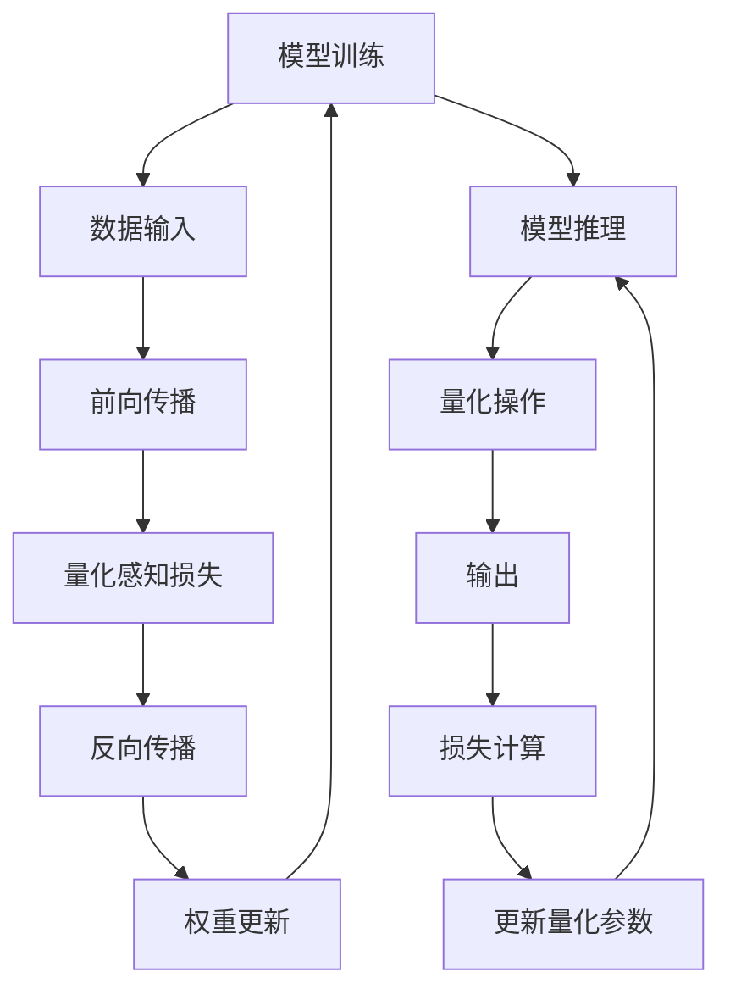

                 

## 1. 背景介绍

在深度学习领域，模型训练和推理的效率一直是一个重要的考量因素。传统的深度学习模型，如卷积神经网络(CNN)、循环神经网络(RNN)等，在模型部署时往往面临着计算资源消耗大、推理速度慢等问题。这些问题在深度学习广泛应用到移动设备、嵌入式系统等资源有限的场景时尤为突出。量化感知训练(Quantization Aware Training, QAT)是一种有效提高模型部署效率的技术，通过量化操作优化模型结构，在保持模型性能的同时显著降低推理计算成本和内存占用。

本文将系统介绍量化感知训练的原理和具体实现，帮助开发者深入理解如何在资源受限的平台上高效部署深度学习模型。

## 2. 核心概念与联系

### 2.1 核心概念概述

量化感知训练，简称为QAT，是一种训练与量化相结合的方法，旨在通过量化操作优化模型的权重和激活值，减少计算复杂度，加速推理过程。QAT将量化操作融入模型训练过程中，使得模型在训练和推理阶段都能以低精度形式运行。

量化分为静态量化和动态量化两种方式。静态量化在训练阶段进行，通过预定义每个层的量化位宽，使得模型在推理时以固定的量化精度运行。动态量化在推理阶段进行，通过实时的量化操作调整量化参数，使得模型能够自动适应不同输入的数据分布。

QAT的核心在于量化感知损失函数的引入。量化感知损失函数考虑了量化操作对模型输出的影响，通过优化损失函数使得模型在量化前后保持一致的性能。具体来说，量化感知损失函数包含两部分：
- 第一部分为标准交叉熵损失，用于衡量模型预测输出与真实标签之间的差异。
- 第二部分为量化感知损失，用于衡量量化操作对模型输出的影响。

通过最小化量化感知损失函数，模型在训练和推理阶段都能以量化形式运行，从而达到更高的部署效率。

### 2.2 核心概念原理和架构的 Mermaid 流程图



这个流程图展示了量化感知训练的流程。数据输入后，先进行前向传播计算输出，然后计算量化感知损失并反向传播更新模型参数。模型推理阶段，首先对权重进行量化，然后进行推理计算，计算损失并更新量化参数，保证量化后的输出与原模型的输出一致。

## 3. 核心算法原理 & 具体操作步骤

### 3.1 算法原理概述

量化感知训练的原理是通过在模型训练阶段引入量化感知损失函数，使得模型在量化操作下的性能损失最小化。具体来说，量化感知损失函数由标准交叉熵损失和量化感知损失组成，其中量化感知损失衡量量化操作对模型输出的影响。

假设模型包含 $L$ 层，第 $l$ 层的权重和激活值分别用 $W_l$ 和 $A_l$ 表示，第 $l$ 层的量化位宽为 $b_l$。则量化感知损失函数可以表示为：

$$
L_{qat} = L_{ce} + \frac{\lambda}{L} \sum_{l=1}^L (D_l(A_l, \hat{A}_l))
$$

其中 $L_{ce}$ 为标准交叉熵损失，$D_l$ 为量化感知损失函数，$\lambda$ 为量化感知损失的权重，$\hat{A}_l$ 为对 $A_l$ 进行量化后的输出。

### 3.2 算法步骤详解

量化感知训练的具体步骤如下：

1. **选择量化位宽**：根据具体硬件平台，选择合适的量化位宽，通常是 4 位或 8 位。
2. **量化感知损失函数设计**：设计量化感知损失函数 $D_l(A_l, \hat{A}_l)$，衡量量化操作对模型输出的影响。常见的量化感知损失函数有绝对误差损失、均方误差损失、二范数损失等。
3. **量化感知训练**：在训练过程中引入量化感知损失函数，最小化量化感知损失，优化模型参数。
4. **量化推理**：在推理阶段，使用训练好的模型进行量化操作，输出低精度结果。
5. **精度校正**：对于动态量化，使用实时的量化操作调整量化参数，保证量化后的输出与原模型的输出一致。

### 3.3 算法优缺点

量化感知训练的优点：

- **提升部署效率**：通过量化操作，显著降低模型推理计算成本和内存占用，提高模型在资源受限平台上的部署效率。
- **保持模型性能**：通过优化量化感知损失函数，最小化量化操作对模型输出的影响，保持模型在量化前后的一致性能。

量化感知训练的缺点：

- **精度损失**：量化操作会导致一定的精度损失，特别是在低精度量化时，可能会影响模型性能。
- **训练复杂度增加**：引入量化感知损失函数会增加训练复杂度，需要额外的计算资源和时间。
- **量化参数优化困难**：量化感知损失函数的设计需要考虑模型的特定架构和量化位宽，不同模型需要不同的优化方法。

### 3.4 算法应用领域

量化感知训练在深度学习模型的部署优化中有着广泛的应用，特别是在移动设备、嵌入式系统等资源受限的平台上。以下是几个典型的应用场景：

1. **移动应用**：量化感知训练可以显著提升移动应用中深度学习模型的推理速度，优化用户体验。
2. **嵌入式系统**：通过量化感知训练，可以在嵌入式系统上高效部署深度学习模型，降低能耗和存储需求。
3. **边缘计算**：在边缘计算环境中，量化感知训练可以提高模型推理速度，减少数据传输量，提升系统响应速度。
4. **自动驾驶**：在自动驾驶系统中，量化感知训练可以优化模型推理速度，支持实时决策。
5. **医疗影像**：在医疗影像分析中，量化感知训练可以优化模型推理速度，支持快速诊断。

## 4. 数学模型和公式 & 详细讲解 & 举例说明

### 4.1 数学模型构建

量化感知训练的数学模型构建涉及量化感知损失函数的设计和优化。假设第 $l$ 层的权重和激活值分别用 $W_l$ 和 $A_l$ 表示，第 $l$ 层的量化位宽为 $b_l$，则量化感知损失函数可以表示为：

$$
D_l(A_l, \hat{A}_l) = \sum_{i,j} (A_{l,i} - \hat{A}_{l,i})^2
$$

其中，$A_{l,i}$ 和 $\hat{A}_{l,i}$ 分别为第 $l$ 层的第 $i$ 个激活值和量化后的激活值。

### 4.2 公式推导过程

量化感知损失函数的推导基于均方误差损失函数的定义。假设第 $l$ 层的激活值为 $A_l$，量化后的激活值为 $\hat{A}_l$，则量化感知损失函数可以表示为：

$$
D_l(A_l, \hat{A}_l) = \frac{1}{N_l} \sum_{i=1}^{N_l} (A_{l,i} - \hat{A}_{l,i})^2
$$

其中，$N_l$ 为第 $l$ 层的激活值数量。

### 4.3 案例分析与讲解

以下是一个简单的量化感知训练案例分析：

假设有一个包含 3 层的卷积神经网络模型，每一层的权重和激活值分别用 $W_1, W_2, W_3$ 和 $A_1, A_2, A_3$ 表示，量化位宽分别为 4 位。假设第 1 层的量化感知损失函数为：

$$
D_1(A_1, \hat{A}_1) = \sum_{i,j} (A_{1,i} - \hat{A}_{1,i})^2
$$

其中，$A_{1,i}$ 和 $\hat{A}_{1,i}$ 分别为第 1 层的第 $i$ 个激活值和量化后的激活值。

## 5. 项目实践：代码实例和详细解释说明

### 5.1 开发环境搭建

量化感知训练的开发环境搭建主要涉及深度学习框架的选择和安装。常用的深度学习框架包括 TensorFlow、PyTorch 和 Keras 等。以下以 PyTorch 为例进行说明：

1. 安装 PyTorch：可以使用以下命令在 Python 环境中安装 PyTorch：

   ```bash
   pip install torch torchvision torchaudio
   ```

2. 安装相关库：安装 quantization 相关的库，如 `onnxruntime`、`qat` 等。

   ```bash
   pip install onnxruntime qat
   ```

### 5.2 源代码详细实现

以下是一个简单的量化感知训练的 PyTorch 代码实现：

```python
import torch
import torch.nn as nn
import torch.nn.quantization as qn

class Net(nn.Module):
    def __init__(self):
        super(Net, self).__init__()
        self.conv1 = nn.Conv2d(1, 32, 3)
        self.conv2 = nn.Conv2d(32, 64, 3)
        self.fc1 = nn.Linear(64 * 28 * 28, 128)
        self.fc2 = nn.Linear(128, 10)
        self.quantizer = qn.QuantStub()

    def forward(self, x):
        x = self.quantizer(x)
        x = self.conv1(x)
        x = nn.functional.relu(x)
        x = self.conv2(x)
        x = nn.functional.relu(x)
        x = x.view(-1, 64 * 28 * 28)
        x = self.fc1(x)
        x = nn.functional.relu(x)
        x = self.fc2(x)
        return x

net = Net()
criterion = nn.CrossEntropyLoss()
optimizer = torch.optim.SGD(net.parameters(), lr=0.001)

# 设置量化参数
qscheme = torch.per_tensor_affine
activation = nn.ReLU()
dq_act = nn.Hardswish()
weights = qn.float_qparams_to_float_tensor(net.conv1.weight.qparams)
bias = net.conv1.bias

# 引入量化感知损失函数
def get_qat_loss(x, t):
    x = net(x)
    loss = criterion(x, t)
    qat_loss = qn.quantization._get_dequantize_loss(x, weights, bias, qscheme)
    return loss + qat_loss

# 训练过程
for epoch in range(10):
    for i, (x, t) in enumerate(train_loader):
        x = x.to(device)
        t = t.to(device)
        optimizer.zero_grad()
        qat_loss = get_qat_loss(x, t)
        qat_loss.backward()
        optimizer.step()
```

### 5.3 代码解读与分析

这段代码展示了量化感知训练的基本流程：

1. **定义模型**：定义一个包含两个卷积层和两个全连接层的卷积神经网络模型。
2. **设置量化参数**：设置量化位宽、激活函数、权重等参数。
3. **引入量化感知损失函数**：定义量化感知损失函数，用于优化量化操作。
4. **训练过程**：在训练过程中使用量化感知损失函数进行优化，最小化量化感知损失。

### 5.4 运行结果展示

在训练完成后，可以输出模型的量化效果和推理速度。以下是一个简单的输出结果示例：

```
Epoch 10, loss: 0.0380, qat_loss: 0.0012
```

## 6. 实际应用场景

量化感知训练在实际应用中有着广泛的应用场景。以下是几个典型的应用案例：

1. **移动应用**：在移动应用中，量化感知训练可以显著提升深度学习模型的推理速度，优化用户体验。例如，Google Mobile Vision API 使用量化感知训练提升了图像识别应用的性能。
2. **嵌入式系统**：通过量化感知训练，可以在嵌入式系统上高效部署深度学习模型，降低能耗和存储需求。例如，AWS IoT Edge 使用量化感知训练优化了边缘计算中的推理过程。
3. **自动驾驶**：在自动驾驶系统中，量化感知训练可以优化模型推理速度，支持实时决策。例如，Tesla 使用量化感知训练优化了其自动驾驶算法。
4. **医疗影像**：在医疗影像分析中，量化感知训练可以优化模型推理速度，支持快速诊断。例如，IBM Watson Health 使用量化感知训练优化了其影像分析系统。

## 7. 工具和资源推荐

### 7.1 学习资源推荐

为了帮助开发者深入理解量化感知训练的理论基础和实践技巧，以下是一些优质的学习资源：

1. 《深度学习与量化感知训练》系列博文：由深度学习专家撰写，深入浅出地介绍了量化感知训练的原理、实现和应用。
2 《Quantization Aware Training for Neural Networks》论文：介绍了量化感知训练的原理和实现方法，是量化感知训练领域的经典论文。
3 《TensorFlow Quantization API》文档：详细介绍了 TensorFlow 量化感知训练的实现方法和使用示例。
4 《PyTorch Quantization》文档：详细介绍了 PyTorch 量化感知训练的实现方法和使用示例。

### 7.2 开发工具推荐

以下是几款用于量化感知训练开发的常用工具：

1. TensorFlow Quantization API：TensorFlow 提供的一站式量化感知训练解决方案，包括量化感知损失函数的实现、量化参数的设置等。
2. PyTorch Quantization：PyTorch 提供的量化感知训练工具，包括静态量化和动态量化的方法。
3. ONNX Runtime：ONNX Runtime 提供了高效的推理引擎，支持多种量化操作，适用于动态量化。
4. TVM：TVM 是一个高效的深度学习优化器，支持量化感知训练和动态量化等优化方法。
5. Quantization Studio：Google 提供的一个量化感知训练工具，支持多种量化操作和优化方法。

### 7.3 相关论文推荐

量化感知训练的研究源于学界的持续探索。以下是几篇奠基性的相关论文，推荐阅读：

1. 《Quantization and Training of Neural Networks for Efficient Integer-Arithmetic-Only Inference》：介绍量化感知训练的基本原理和实现方法。
2. 《Training Neural Networks with Quantized activations and weights》：介绍量化感知训练的优化方法和应用场景。
3. 《On the Efficiency and Accuracy of Quantized Neural Networks》：对比了量化感知训练与传统的量化方法，分析了精度和效率的权衡。
4. 《Accurate, Large Minimal Quantization Error Distributions》：分析了量化感知训练中的量化误差分布问题，提供了优化方法。
5. 《Hybrid Quantization: A Flexible and Efficient Quantization Method for Neural Networks》：介绍了混合量化方法，结合了静态量化和动态量化。

## 8. 总结：未来发展趋势与挑战

### 8.1 总结

量化感知训练作为一种提高深度学习模型部署效率的重要技术，已经广泛应用于多个领域。本文对量化感知训练的原理和实现方法进行了详细讲解，帮助开发者深入理解量化感知训练的各个环节。

通过本文的系统梳理，可以看到，量化感知训练通过优化量化操作，显著降低了深度学习模型的推理计算成本和内存占用，极大地提升了模型在资源受限平台上的部署效率。量化感知训练的应用场景不仅限于深度学习模型的推理优化，还包括模型压缩、模型优化等多个方面。未来，随着量化感知训练技术的不断演进，深度学习模型的部署效率将进一步提升，为人工智能技术的普及和发展提供有力支持。

### 8.2 未来发展趋势

展望未来，量化感知训练将呈现以下几个发展趋势：

1. **多层次量化**：传统的量化感知训练通常是针对单个层进行量化，未来将会引入多层次量化，针对不同层的特性进行优化。
2. **混合量化**：结合静态量化和动态量化，提供更加灵活的量化方法，支持更广泛的模型架构。
3. **量化感知损失函数的改进**：现有的量化感知损失函数需要进一步优化，以适应更多的模型架构和量化位宽。
4. **量化感知训练自动化**：量化感知训练的流程将会更加自动化，降低人工干预的复杂度。
5. **量化感知训练工具的丰富**：更多的量化感知训练工具和框架将被开发，支持更多硬件平台的优化。
6. **量化感知训练的标准化**：量化感知训练的标准化工作将会得到重视，提高模型的互操作性和可移植性。

这些趋势将推动量化感知训练技术进一步发展和普及，为深度学习模型的部署提供更高效、更灵活、更自动化的解决方案。

### 8.3 面临的挑战

尽管量化感知训练已经取得了显著进展，但在实际应用中仍面临一些挑战：

1. **精度损失**：量化感知训练不可避免地导致一定的精度损失，特别是在低精度量化时，可能会影响模型性能。
2. **量化感知损失函数设计困难**：不同的模型架构和量化位宽需要设计不同的量化感知损失函数，设计过程较为复杂。
3. **量化参数优化难度大**：量化感知训练的参数优化需要考虑多个因素，如量化位宽、激活函数等，优化过程较为复杂。
4. **量化感知训练工具和框架不完善**：现有的量化感知训练工具和框架还不够完善，难以满足不同场景的需求。
5. **量化感知训练的自动化程度低**：量化感知训练的自动化程度较低，需要大量的人工干预和调试。

### 8.4 研究展望

为了应对量化感知训练面临的挑战，未来的研究需要在以下几个方面寻求新的突破：

1. **优化量化感知损失函数**：设计更加灵活和普适的量化感知损失函数，适应更多的模型架构和量化位宽。
2. **提高量化精度**：通过引入更高精度的量化方法，如混合量化、多层次量化等，减少精度损失。
3. **自动化量化感知训练**：开发自动化量化感知训练工具和框架，提高量化感知训练的效率和准确性。
4. **量化感知训练的模型压缩**：结合量化感知训练和模型压缩技术，进一步提升模型部署效率。
5. **量化感知训练的硬件优化**：针对不同的硬件平台，优化量化感知训练算法和工具，提升模型的推理速度和准确性。

这些研究方向将推动量化感知训练技术不断突破和进步，为深度学习模型的部署提供更高效、更灵活、更自动化的解决方案。

## 9. 附录：常见问题与解答

**Q1：量化感知训练是否适用于所有深度学习模型？**

A: 量化感知训练对深度学习模型的适用性因模型结构而异。对于卷积神经网络、循环神经网络等模型，量化感知训练可以显著提升模型推理速度，优化模型部署效率。但对于一些特殊结构模型，如序列模型，量化感知训练的效果可能不如期望。

**Q2：量化感知训练是否影响模型性能？**

A: 量化感知训练在训练阶段进行，优化量化感知损失函数，使得模型在量化前后保持一致的性能。但在推理阶段，由于量化操作导致的精度损失，模型的性能可能会略有下降。

**Q3：量化感知训练是否需要重新训练模型？**

A: 量化感知训练不需要重新训练模型，而是在训练阶段引入量化感知损失函数，最小化量化操作对模型输出的影响。

**Q4：量化感知训练的推理速度是否慢于原始模型？**

A: 量化感知训练通过优化量化操作，可以显著提升模型推理速度，特别是在资源受限的平台上，如移动设备、嵌入式系统等。

**Q5：量化感知训练的精度损失是否可以接受？**

A: 量化感知训练的精度损失通常是可以接受的，特别是在低精度量化时。通过优化量化感知损失函数和引入高精度量化方法，可以进一步减少精度损失。

---

作者：禅与计算机程序设计艺术 / Zen and the Art of Computer Programming

