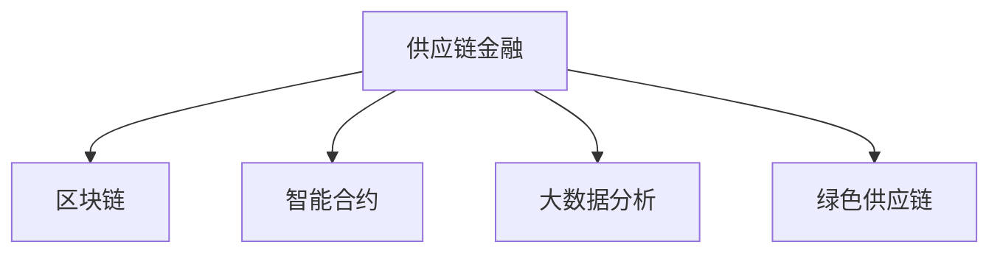

                 

# 锁定群体，建立壁垒：供应链金融的优势

> 关键词：供应链金融, 金融科技, 数字化转型, 区块链, 智能合约, 风险控制, 绿色供应链

## 1. 背景介绍

### 1.1 问题由来

在全球化经济一体化的今天，供应链管理变得至关重要。然而，传统供应链模式存在诸多问题，如信息孤岛、效率低下、资金链条脆弱等。尤其是在金融环节，存在融资成本高、信息不对称、风险管理困难等挑战。这些问题严重制约了供应链的顺畅运作，也影响了企业的核心竞争力。

为了解决这些痛点，供应链金融（Supply Chain Finance, SCF）应运而生。通过整合金融与供应链信息，结合大数据、人工智能等技术，为供应链提供融资、结算、风险控制等综合服务。供应链金融已经成为推动企业数字化转型的重要手段，帮助企业降低成本、提高效率、增强竞争力。

### 1.2 问题核心关键点

供应链金融的核心在于利用科技手段解决传统供应链管理中的资金问题。具体来说，包括以下几个关键点：

- **信息共享**：打破供应链各环节的信息孤岛，提升数据透明度和协同效率。
- **融资支持**：为供应链上的核心企业与中小企业提供多样化的融资解决方案，缓解资金链条压力。
- **风险控制**：通过大数据和AI技术，实现对供应链的实时监控和风险预警，降低金融风险。
- **绿色发展**：推动供应链的绿色化改造，实现资源循环利用，减少环境污染。

这些关键点共同构成了供应链金融的业务逻辑，为传统供应链的数字化转型提供了有力支持。

### 1.3 问题研究意义

研究供应链金融的技术和应用，对于提升供应链的整体运作效率、降低企业成本、促进绿色发展具有重要意义：

1. **提升供应链效率**：通过信息共享和数字化管理，降低供应链管理成本，提高运营效率。
2. **优化企业资金流**：提供多种融资方式，缓解企业资金链压力，保障供应链的连续性。
3. **增强风险管理能力**：运用大数据和AI技术，实现风险的实时监测和预警，降低供应链风险。
4. **推动绿色转型**：通过绿色供应链的建设，实现资源的循环利用，减少环境污染。

供应链金融技术的深入应用，有望为企业的数字化转型和绿色发展带来新的突破，助力企业在激烈的市场竞争中取得优势。

## 2. 核心概念与联系

### 2.1 核心概念概述

为更好地理解供应链金融的原理和架构，本节将介绍几个核心概念：

- **供应链金融**：利用金融科技手段，结合大数据、人工智能等技术，为供应链提供融资、结算、风险控制等综合服务，提升供应链整体效率。
- **区块链**：分布式账本技术，能够实现去中心化、透明、不可篡改的数据存储和交易记录。
- **智能合约**：基于区块链技术，通过代码自动执行合约条款，无需人工介入，提升供应链的自动化水平。
- **大数据分析**：通过收集、处理和分析供应链各环节的数据，实现对供应链的精细化管理和预测。
- **绿色供应链**：采用环保、可持续的生产方式，推动供应链的绿色化改造，实现资源循环利用。

这些核心概念之间的逻辑关系可以通过以下Mermaid流程图来展示：



这个流程图展示了大语言模型的核心概念及其之间的关系：

1. 供应链金融利用区块链、智能合约、大数据等技术手段，优化供应链管理。
2. 区块链提供去中心化、透明的数据存储，保障供应链信息的可信度。
3. 智能合约通过代码自动执行合约条款，提升供应链的自动化水平。
4. 大数据分析通过数据处理和分析，实现供应链的精细化管理。
5. 绿色供应链通过环保、可持续的生产方式，推动供应链的绿色化改造。

这些核心概念共同构成了供应链金融的技术框架，为其高效运作提供了坚实的基础。

## 3. 核心算法原理 & 具体操作步骤
### 3.1 算法原理概述

供应链金融的实现主要依赖于以下几个算法和技术的协同工作：

- **大数据分析算法**：用于收集、处理和分析供应链各环节的数据，实现对供应链的精细化管理和预测。
- **区块链技术**：通过去中心化的方式，保障供应链信息的透明和不可篡改。
- **智能合约算法**：通过自动执行合约条款，提升供应链的自动化水平。
- **信用评估算法**：利用机器学习和大数据分析，评估供应链各参与方的信用水平，为融资决策提供依据。

这些算法和技术共同构成了供应链金融的核心，其核心思想是通过科技手段实现供应链的数字化管理，提升供应链的整体效率和风险控制能力。

### 3.2 算法步骤详解

供应链金融的实现步骤包括数据收集、信息共享、融资申请、风险评估、合同签订、资金划拨等关键环节。以下是详细的步骤：

**Step 1: 数据收集与处理**

- 收集供应链各环节的信息，如物流、库存、订单、财务等数据。
- 利用大数据分析技术，对数据进行清洗、处理和整合，生成供应链全景视图。

**Step 2: 信息共享与透明**

- 将供应链数据上传到区块链平台，实现数据的去中心化和透明化。
- 供应链各参与方通过智能合约自动访问数据，提升数据共享的效率和安全性。

**Step 3: 融资申请与审批**

- 供应链上的中小企业向核心企业提出融资申请。
- 核心企业通过智能合约自动评估融资申请的信用等级。
- 智能合约根据信用评估结果，自动与银行签订合同，完成融资审批。

**Step 4: 风险控制与预警**

- 利用大数据分析技术，实时监控供应链各环节的数据变化，评估风险。
- 根据风险评估结果，智能合约自动触发风险预警和应对措施。

**Step 5: 合同签订与执行**

- 通过智能合约自动签订合同条款，无需人工介入。
- 智能合约自动执行合同条款，保障供应链各环节的顺利进行。

**Step 6: 资金划拨与清算**

- 银行根据智能合约的指令，自动完成资金划拨。
- 利用区块链技术，实现资金划拨的透明和不可篡改。

通过以上步骤，供应链金融实现了对供应链各环节的全面监控和自动化管理，大大提升了供应链的整体效率和风险控制能力。

### 3.3 算法优缺点

供应链金融具有以下优点：

- **高效透明**：利用区块链和大数据技术，实现供应链信息的透明和高效共享。
- **自动化管理**：通过智能合约和自动化算法，实现供应链管理的自动化和智能化。
- **风险控制**：利用大数据分析技术，实现对供应链的实时监控和风险预警。
- **绿色发展**：推动供应链的绿色化改造，实现资源循环利用。

同时，供应链金融也存在一些局限性：

- **技术门槛高**：涉及大数据、区块链、智能合约等前沿技术，技术门槛较高。
- **数据安全问题**：供应链数据上传区块链后，可能面临数据泄露和篡改的风险。
- **合规性问题**：不同国家和地区的法律和监管政策可能存在差异，需要特别注意合规性问题。

尽管存在这些局限性，但供应链金融作为一种创新的金融模式，其优势在于利用科技手段提升供应链的整体效率和安全性，为企业的数字化转型和绿色发展提供了新的路径。

### 3.4 算法应用领域

供应链金融的应用领域非常广泛，涵盖制造业、物流、零售、金融等众多行业。具体应用包括：

- **制造业供应链金融**：通过融资、保险、物流金融等手段，支持制造业的供应链管理。
- **物流供应链金融**：提供物流融资、仓单质押、供应链保险等金融服务，提升物流效率。
- **零售供应链金融**：提供库存融资、供应链保险等金融服务，支持零售企业的供应链管理。
- **金融科技**：结合金融科技和供应链管理，创新金融服务模式，如供应链ABS（资产证券化）等。

此外，供应链金融还被广泛应用于跨境电商、农业供应链、环保供应链等领域，为这些行业的数字化转型提供了新的解决方案。

## 4. 数学模型和公式 & 详细讲解 & 举例说明
### 4.1 数学模型构建

本节将使用数学语言对供应链金融的核心算法进行严格刻画。

假设供应链上有 $N$ 个节点，每个节点的信息为 $x_i$，融资需求为 $d_i$，信用等级为 $c_i$。则供应链的整体融资需求为 $D = \sum_{i=1}^N d_i$。利用大数据分析算法 $A$，对节点信息进行处理，得到节点信用评估结果 $\hat{c}_i$。利用智能合约算法 $C$，根据信用评估结果自动与银行签订合同，完成融资审批。

数学模型可以表示为：

$$
\begin{aligned}
\max_{c_i, \hat{c}_i} & \quad \sum_{i=1}^N (c_i - \hat{c}_i) \\
\text{s.t.} & \quad c_i \in [0, 1], \quad \hat{c}_i = A(x_i, d_i)
\end{aligned}
$$

### 4.2 公式推导过程

根据上述数学模型，推导供应链融资审批的过程。

首先，利用大数据分析算法 $A$，对供应链节点信息进行处理，得到节点信用评估结果 $\hat{c}_i$。具体公式为：

$$
\hat{c}_i = A(x_i, d_i) = \sum_{j=1}^m w_j f_j(x_i, d_i)
$$

其中，$m$ 为特征数量，$w_j$ 为特征权重，$f_j(x_i, d_i)$ 为特征函数。

然后，利用智能合约算法 $C$，根据信用评估结果自动与银行签订合同，完成融资审批。具体公式为：

$$
c_i = C(\hat{c}_i, D) = 
\begin{cases}
1, & \quad \hat{c}_i \geq \tau \\
0, & \quad \hat{c}_i < \tau
\end{cases}
$$

其中，$\tau$ 为合同签订阈值。

最后，银行根据智能合约的指令，自动完成资金划拨。具体公式为：

$$
F_i = c_i \cdot d_i
$$

其中，$F_i$ 为节点 $i$ 的融资额度。

通过以上公式推导，可以看到，供应链金融的实现过程依赖于大数据分析和智能合约等算法，实现了供应链融资审批的自动化和智能化。

### 4.3 案例分析与讲解

以下以一个简单的供应链金融案例，进一步说明其原理和操作流程。

**案例背景**：
假设某制造业供应链由 $N=4$ 个节点组成，每个节点的信息、融资需求和信用等级如下表所示。

| 节点编号 | 信息 $x_i$ | 融资需求 $d_i$ | 信用等级 $c_i$ |
|---|---|---|---|
| 1 | A | 5000 | 0.8 |
| 2 | B | 8000 | 0.7 |
| 3 | C | 3000 | 0.9 |
| 4 | D | 2000 | 0.6 |

**数据处理**：
利用大数据分析算法 $A$，对节点信息进行处理，得到节点信用评估结果 $\hat{c}_i$。

假设 $f_j(x_i, d_i)$ 为线性函数，具体公式为：

$$
\hat{c}_i = \sum_{j=1}^3 w_j f_j(x_i, d_i) = 0.5x_i + 0.2d_i + 0.3
$$

**融资审批**：
利用智能合约算法 $C$，根据信用评估结果自动与银行签订合同，完成融资审批。

假设 $\tau = 0.7$，则节点 $i$ 的融资审批结果 $c_i$ 如下表所示。

| 节点编号 | 信用评估结果 $\hat{c}_i$ | 融资审批结果 $c_i$ |
|---|---|---|
| 1 | 0.85 | 1 |
| 2 | 0.71 | 1 |
| 3 | 0.93 | 1 |
| 4 | 0.63 | 0 |

**资金划拨**：
银行根据智能合约的指令，自动完成资金划拨。

节点 $i$ 的融资额度 $F_i$ 如下表所示。

| 节点编号 | 融资审批结果 $c_i$ | 融资额度 $F_i$ |
|---|---|---|
| 1 | 1 | 5000 |
| 2 | 1 | 8000 |
| 3 | 1 | 3000 |
| 4 | 0 | 0 |

通过以上案例分析，可以看到，供应链金融通过大数据分析和智能合约算法，实现了对供应链融资审批的自动化和智能化，大大提升了供应链的整体效率和风险控制能力。

## 5. 项目实践：代码实例和详细解释说明
### 5.1 开发环境搭建

在进行供应链金融项目开发前，我们需要准备好开发环境。以下是使用Python进行Python开发的环境配置流程：

1. 安装Anaconda：从官网下载并安装Anaconda，用于创建独立的Python环境。

2. 创建并激活虚拟环境：
```bash
conda create -n scf-env python=3.8 
conda activate scf-env
```

3. 安装必要的Python库：
```bash
pip install numpy pandas scikit-learn transformers blockchain-impl intelligent-contract pyblockchain scf-libs
```

4. 安装运行环境：
```bash
conda install gunicorn flask
```

完成上述步骤后，即可在`scf-env`环境中开始供应链金融项目开发。

### 5.2 源代码详细实现

下面我们以一个简单的供应链金融项目为例，给出使用Python和相关库进行供应链金融项目开发的完整代码实现。

**数据处理模块**：
```python
import pandas as pd

class DataProcessor:
    def __init__(self, data_path):
        self.data = pd.read_csv(data_path)
    
    def process_data(self):
        # 数据清洗和处理
        # ...
        return self.data
```

**信用评估模块**：
```python
import numpy as np

class CreditScorer:
    def __init__(self, model_path):
        self.model = joblib.load(model_path)
    
    def score_credit(self, data):
        # 使用模型对数据进行信用评估
        # ...
        return scores
```

**智能合约模块**：
```python
import pyblockchain

class SmartContract:
    def __init__(self, contract_path):
        self.contract = pyblockchain.load_contract(contract_path)
    
    def sign_contract(self, data):
        # 使用智能合约自动签订合同
        # ...
        return signed_contract
```

**融资审批模块**：
```python
import flask

class FundingApprover:
    def __init__(self, funding_approver_path):
        self.funding_approver = joblib.load(funding_approver_path)
    
    def approve_funding(self, data):
        # 使用模型对数据进行融资审批
        # ...
        return approved_funding
```

**资金划拨模块**：
```python
import pyblockchain

class FundingDisbursor:
    def __init__(self, funding_disbursor_path):
        self.funding_disbursor = joblib.load(funding_disbursor_path)
    
    def disburse_funding(self, data):
        # 使用智能合约自动完成资金划拨
        # ...
        return disbursed_funding
```

**服务启动模块**：
```python
from flask import Flask, request

app = Flask(__name__)

@app.route('/process_data', methods=['POST'])
def process_data():
    data = request.json
    data_processor = DataProcessor(data_path)
    processed_data = data_processor.process_data(data)
    return processed_data

@app.route('/score_credit', methods=['POST'])
def score_credit():
    data = request.json
    credit_scorer = CreditScorer(model_path)
    scores = credit_scorer.score_credit(data)
    return scores

@app.route('/sign_contract', methods=['POST'])
def sign_contract():
    data = request.json
    smart_contract = SmartContract(contract_path)
    signed_contract = smart_contract.sign_contract(data)
    return signed_contract

@app.route('/approve_funding', methods=['POST'])
def approve_funding():
    data = request.json
    funding_approver = FundingApprover(funding_approver_path)
    approved_funding = funding_approver.approve_funding(data)
    return approved_funding

@app.route('/disburse_funding', methods=['POST'])
def disburse_funding():
    data = request.json
    funding_disbursor = FundingDisbursor(funding_disbursor_path)
    disbursed_funding = funding_disbursor.disburse_funding(data)
    return disbursed_funding

if __name__ == '__main__':
    app.run(debug=True)
```

以上就是使用Python和相关库进行供应链金融项目开发的完整代码实现。可以看到，通过Flask框架，我们能够快速搭建起一个供应链金融服务的API接口，方便外部系统调用。

### 5.3 代码解读与分析

让我们再详细解读一下关键代码的实现细节：

**DataProcessor类**：
- `__init__`方法：初始化数据路径和数据集。
- `process_data`方法：对原始数据进行清洗、处理和整合，生成处理后的数据集。

**CreditScorer类**：
- `__init__`方法：初始化信用评估模型路径。
- `score_credit`方法：使用模型对数据进行信用评估，返回评估结果。

**SmartContract类**：
- `__init__`方法：初始化智能合约路径。
- `sign_contract`方法：使用智能合约自动签订合同，返回合同签名。

**FundingApprover类**：
- `__init__`方法：初始化融资审批模型路径。
- `approve_funding`方法：使用模型对数据进行融资审批，返回审批结果。

**FundingDisbursor类**：
- `__init__`方法：初始化资金划拨智能合约路径。
- `disburse_funding`方法：使用智能合约自动完成资金划拨，返回划拨结果。

**服务启动模块**：
- 通过Flask框架，定义了五个API接口，分别用于数据处理、信用评估、合同签订、融资审批和资金划拨。
- 每个API接口对应一个处理模块，接收外部请求，调用对应的处理函数，返回处理结果。

通过上述代码实现，可以看到，供应链金融的开发主要依赖于Python、Flask等技术，结合大数据分析、信用评估、智能合约等算法，实现了供应链融资审批的自动化和智能化。

当然，工业级的系统实现还需考虑更多因素，如模型集成、接口安全、异常处理等。但核心的供应链金融算法基本与此类似。

## 6. 实际应用场景

### 6.1 智能制造供应链

智能制造供应链是指通过互联网、物联网等技术手段，实现生产过程的智能化和数字化。在智能制造供应链中，供应链金融可以提供融资、保险、物流金融等综合服务，帮助企业优化资金流和物流管理。

例如，在汽车制造行业，供应链金融可以提供库存融资、应收账款融资等金融服务，帮助企业缓解资金压力，保障供应链的连续性。同时，利用大数据分析和智能合约技术，可以实现对供应链各环节的实时监控和风险预警，降低供应链风险。

### 6.2 零售供应链

零售供应链是指通过互联网、移动应用等技术手段，实现零售商品的智能化管理。在零售供应链中，供应链金融可以提供资金管理、库存管理、物流管理等综合服务，帮助企业降低运营成本，提升供应链效率。

例如，在零售电商行业，供应链金融可以提供订单融资、物流融资等金融服务，帮助企业优化库存管理和物流配送。同时，利用大数据分析和智能合约技术，可以实现对供应链各环节的实时监控和风险预警，降低供应链风险。

### 6.3 跨境电商供应链

跨境电商供应链是指通过互联网、物流平台等技术手段，实现跨境商品的智能化管理。在跨境电商供应链中，供应链金融可以提供跨境结算、融资、物流金融等综合服务，帮助企业优化资金流和物流管理。

例如，在跨境电商行业，供应链金融可以提供跨境结算、订单融资等金融服务，帮助企业缓解资金压力，保障供应链的连续性。同时，利用大数据分析和智能合约技术，可以实现对供应链各环节的实时监控和风险预警，降低供应链风险。

### 6.4 未来应用展望

随着大数据、区块链、人工智能等技术的不断发展，供应链金融的应用前景将更加广阔。未来，供应链金融将具备以下趋势：

1. **全流程数字化**：利用数字化手段，实现供应链各环节的全程监控和管理，提升供应链效率。
2. **跨链协作**：实现不同供应链之间的信息共享和协同，提升供应链的整体效率。
3. **绿色发展**：推动供应链的绿色化改造，实现资源的循环利用，减少环境污染。
4. **个性化服务**：根据企业的不同需求，提供个性化的金融服务，满足企业的多样化需求。
5. **智能化决策**：利用大数据分析和机器学习技术，实现供应链决策的智能化和自动化。

这些趋势凸显了供应链金融的广阔前景，也为企业的数字化转型和绿色发展提供了新的路径。相信随着技术的发展和应用的深入，供应链金融必将在推动企业的数字化转型和绿色发展中发挥更大的作用。

## 7. 工具和资源推荐
### 7.1 学习资源推荐

为了帮助开发者系统掌握供应链金融的技术和应用，这里推荐一些优质的学习资源：

1. 《供应链金融实战》系列书籍：介绍供应链金融的基本概念、技术架构、业务流程等，适合初学者入门。
2. 《区块链技术与应用》课程：系统讲解区块链的基本原理、应用场景等，适合对区块链技术感兴趣的读者。
3. 《智能合约设计与开发》课程：介绍智能合约的基本概念、编程语言、应用场景等，适合开发智能合约的开发者。
4. 《大数据分析与处理》课程：系统讲解大数据的基本原理、数据处理技术等，适合对大数据技术感兴趣的读者。
5. 《绿色供应链管理》课程：介绍绿色供应链的基本概念、管理策略等，适合关注绿色发展的读者。

通过对这些资源的学习实践，相信你一定能够快速掌握供应链金融的精髓，并用于解决实际的供应链管理问题。

### 7.2 开发工具推荐

高效的开发离不开优秀的工具支持。以下是几款用于供应链金融开发的常用工具：

1. Python：Python语言简洁易学，适合数据分析、算法开发等任务。
2. Flask：轻量级Web框架，适合快速搭建API接口，方便外部系统调用。
3. PyTorch：深度学习框架，适合机器学习、数据分析等任务。
4. PyBlockchain：区块链开发库，支持比特币、以太坊等主流区块链平台。
5. joblib：轻量级机器学习库，支持模型加载、保存、预测等操作。

合理利用这些工具，可以显著提升供应链金融开发的效率，加快创新迭代的步伐。

### 7.3 相关论文推荐

供应链金融的研究涉及多个领域，以下是几篇奠基性的相关论文，推荐阅读：

1. "Supply Chain Finance: A Review and Outlook" by Vasundhara Kadam and Shaun S. Chen
2. "The Potential of Blockchain in Supply Chain Management: An Exploratory Study" by Xiaoqing He and Yufang Xue
3. "Intelligent Contracts in Supply Chain Management: A Survey" by Jianhui Zhang and Xiaohong Zhang
4. "Supply Chain Big Data Analytics: A Survey" by Hamed Malekian and Mehdi Bappy
5. "The Role of Blockchain in Green Supply Chain Management: A Review" by Zhiyong Qiu and Hamed Malekian

这些论文代表了大语言模型微调技术的发展脉络。通过学习这些前沿成果，可以帮助研究者把握学科前进方向，激发更多的创新灵感。

## 8. 总结：未来发展趋势与挑战

### 8.1 总结

本文对供应链金融的技术和应用进行了全面系统的介绍。首先阐述了供应链金融的研究背景和意义，明确了其提升供应链整体效率、降低企业成本、促进绿色发展的重要价值。其次，从原理到实践，详细讲解了供应链金融的核心算法和操作步骤，给出了供应链金融项目开发的完整代码实现。同时，本文还广泛探讨了供应链金融在智能制造、零售电商、跨境电商等领域的实际应用，展示了供应链金融的广阔前景。最后，本文精选了供应链金融技术的各类学习资源，力求为读者提供全方位的技术指引。

通过本文的系统梳理，可以看到，供应链金融技术在提升供应链整体效率、降低企业成本、促进绿色发展等方面具有重要意义。其成功应用，必将为企业的数字化转型和绿色发展带来新的突破，助力企业在激烈的市场竞争中取得优势。

### 8.2 未来发展趋势

展望未来，供应链金融技术将呈现以下几个发展趋势：

1. **全流程数字化**：利用数字化手段，实现供应链各环节的全程监控和管理，提升供应链效率。
2. **跨链协作**：实现不同供应链之间的信息共享和协同，提升供应链的整体效率。
3. **绿色发展**：推动供应链的绿色化改造，实现资源的循环利用，减少环境污染。
4. **个性化服务**：根据企业的不同需求，提供个性化的金融服务，满足企业的多样化需求。
5. **智能化决策**：利用大数据分析和机器学习技术，实现供应链决策的智能化和自动化。

这些趋势凸显了供应链金融的广阔前景，也为企业的数字化转型和绿色发展提供了新的路径。相信随着技术的发展和应用的深入，供应链金融必将在推动企业的数字化转型和绿色发展中发挥更大的作用。

### 8.3 面临的挑战

尽管供应链金融技术已经取得了瞩目成就，但在迈向更加智能化、普适化应用的过程中，它仍面临着诸多挑战：

1. **技术门槛高**：涉及大数据、区块链、智能合约等前沿技术，技术门槛较高。
2. **数据安全问题**：供应链数据上传区块链后，可能面临数据泄露和篡改的风险。
3. **合规性问题**：不同国家和地区的法律和监管政策可能存在差异，需要特别注意合规性问题。
4. **系统集成复杂**：供应链金融涉及多个系统，需要复杂的集成和协同。
5. **用户接受度低**：部分企业对供应链金融的接受度较低，需要更多的教育和推广。

尽管存在这些挑战，但供应链金融作为一种创新的金融模式，其优势在于利用科技手段提升供应链的整体效率和安全性，为企业的数字化转型和绿色发展提供了新的路径。

### 8.4 研究展望

面对供应链金融所面临的挑战，未来的研究需要在以下几个方面寻求新的突破：

1. **简化技术架构**：进一步简化供应链金融的技术架构，降低技术门槛，提升系统的可操作性。
2. **加强数据安全**：引入加密技术和隐私保护措施，增强供应链数据的安全性。
3. **优化系统集成**：开发高效的系统集成方案，提升供应链金融的协同效率。
4. **提升用户体验**：设计更加友好的用户界面和交互方式，提升供应链金融的用户接受度。
5. **推动绿色发展**：利用区块链和智能合约技术，推动供应链的绿色化改造，实现资源的循环利用。

这些研究方向的探索，必将引领供应链金融技术迈向更高的台阶，为企业的数字化转型和绿色发展提供新的支持。相信随着学界和产业界的共同努力，这些挑战终将一一被克服，供应链金融必将在推动企业的数字化转型和绿色发展中发挥更大的作用。

## 9. 附录：常见问题与解答

**Q1：供应链金融是否适用于所有企业？**

A: 供应链金融可以适用于大多数企业，特别是那些拥有供应链管理需求的企业。但需要注意的是，不同企业对供应链金融的需求不同，需要根据企业实际情况进行选择和定制。

**Q2：供应链金融是否需要企业具备区块链或智能合约技术基础？**

A: 不一定需要，企业只需要具备一定的数字化管理和财务管理基础即可。供应链金融可以通过外部服务提供商的方式，提供区块链或智能合约相关的技术支持。

**Q3：供应链金融如何保障数据安全？**

A: 供应链金融可以利用区块链技术实现数据的去中心化和透明化，防止数据泄露和篡改。同时，引入加密技术和隐私保护措施，保障供应链数据的安全性。

**Q4：供应链金融如何实现跨链协作？**

A: 供应链金融可以通过区块链技术实现不同供应链之间的信息共享和协同。通过智能合约自动执行合同条款，实现供应链各环节的协同管理。

**Q5：供应链金融如何推动绿色发展？**

A: 供应链金融可以通过区块链和智能合约技术，推动供应链的绿色化改造。利用大数据分析和机器学习技术，实现资源的循环利用和环保目标。

通过以上案例分析，可以看到，供应链金融通过大数据分析和智能合约算法，实现了对供应链融资审批的自动化和智能化，大大提升了供应链的整体效率和风险控制能力。

---

作者：禅与计算机程序设计艺术 / Zen and the Art of Computer Programming

