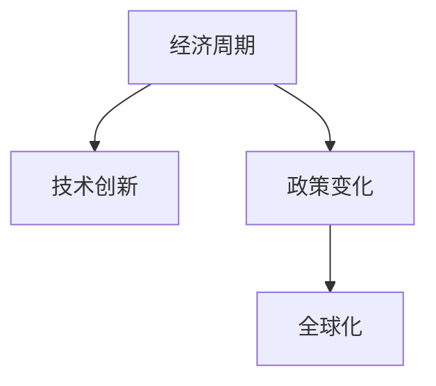

                 

# 阶段性因素对经济的长期影响分析

> 关键词：

## 1. 背景介绍

### 1.1 问题由来
经济活动是一个复杂的系统，受到多种因素的共同作用。其中，阶段性因素（如经济周期、政策变化、技术创新等）对经济发展的长期趋势具有重要影响。深入理解这些因素的长期影响，对于制定科学的经济政策，促进可持续发展具有重要意义。本文将从阶段性因素的角度，探讨其对经济增长的潜在长期影响。

### 1.2 问题核心关键点
阶段性因素包括经济周期、技术创新、政策变化、全球化等，这些因素如何影响经济增长的长期趋势，是本文的研究重点。通过理论分析和案例研究，本文将为政府和企业提供有价值的参考，帮助其更好地应对经济周期变化，抓住技术创新的机遇，制定适应政策，推动经济持续健康发展。

### 1.3 问题研究意义
理解阶段性因素对经济长期影响的机制，有助于制定更为科学有效的宏观调控策略。在经济周期波动中，通过政策调节，促进经济平稳过渡；在技术创新浪潮中，利用创新红利，推动产业升级；在全球化背景下，优化贸易结构，增强国家竞争力。本文的研究对于经济理论发展和政策实践均具有重要意义。

## 2. 核心概念与联系

### 2.1 核心概念概述

为更好地理解阶段性因素对经济的长期影响，本节将介绍几个关键概念：

- **经济周期**：宏观经济中的周期性波动，包括繁荣、衰退、萧条和复苏四个阶段。
- **技术创新**：通过新产品、新方法和新工艺，提高生产效率和经济效益。
- **政策变化**：政府通过财政、货币、产业等政策，对经济活动进行调节和控制。
- **全球化**：各国经济活动的相互依赖和融合，推动贸易和投资的自由化。

这些概念之间的关系可以通过以下Mermaid流程图来展示：



这个流程图展示了几大关键因素之间的联系：

1. **经济周期**和**技术创新**之间：技术创新往往在经济繁荣期获得更多资源支持，加速新技术的推广和应用，进而推动经济增长。
2. **经济周期**和**政策变化**之间：政府往往在经济衰退期出台扩张性政策，刺激经济；在经济过热期出台紧缩性政策，防止过热。
3. **政策变化**和**全球化**之间：全球化背景下，政策变化可能通过国际贸易和资本流动，影响全球经济态势。

## 3. 核心算法原理 & 具体操作步骤
### 3.1 算法原理概述

阶段性因素对经济增长的长期影响分析，可以通过经济计量模型进行量化研究。模型的核心思想是将经济增长视为多种因素共同作用的结果，通过时间序列数据，评估各阶段性因素的长期影响。

形式化地，假设经济增长为 $G_t$，阶段性因素包括 $F_1(t), F_2(t), \ldots, F_k(t)$，其中 $t$ 为时间。模型的目标是找到最优的权重系数 $\beta_1, \beta_2, \ldots, \beta_k$，使得：

$$
G_t = \sum_{i=1}^k \beta_i F_i(t) + \epsilon_t
$$

其中 $\epsilon_t$ 为随机误差项，代表其他未被解释的因素。通过最小化残差平方和，求解上述模型，可以得到各阶段性因素对经济增长的贡献。

### 3.2 算法步骤详解

阶段性因素对经济增长的长期影响分析，一般包括以下几个关键步骤：

**Step 1: 数据收集与预处理**
- 收集经济增长的历史时间序列数据 $G_t$，以及相关的阶段性因素数据 $F_1(t), F_2(t), \ldots, F_k(t)$。
- 对数据进行清洗、归一化等预处理，确保数据的可用性和一致性。

**Step 2: 模型选择与设定**
- 选择合适的经济计量模型，如ARIMA、VAR、SVAR等，根据数据特点进行设定。
- 确定模型的时间范围和滞后阶数，确保模型能够捕捉到经济增长的动态变化。

**Step 3: 参数估计与模型拟合**
- 使用最大似然估计或最小二乘法，估计模型的参数 $\beta_1, \beta_2, \ldots, \beta_k$。
- 通过拟合，求解最优的模型参数，确保模型的解释能力和预测能力。

**Step 4: 模型验证与诊断**
- 使用残差分析和检验，评估模型的拟合效果和稳健性。
- 通过异方差检验、自相关检验等，识别和处理模型中的问题，提高模型的可信度。

**Step 5: 结果解释与应用**
- 解释模型中各阶段性因素的系数估计值，分析其对经济增长的长期影响。
- 基于模型预测结果，提出政策建议和未来展望，指导经济实践。

以上是阶段性因素对经济增长的长期影响分析的一般流程。在实际应用中，还需要根据具体问题，对模型选择和参数估计等环节进行优化设计，以进一步提升模型的精度和实用性。

### 3.3 算法优缺点

阶段性因素对经济增长的长期影响分析方法具有以下优点：
1. 模型简单高效。使用经济计量模型，可以简洁地描述经济增长的驱动因素，便于理解和解释。
2. 数据驱动。通过历史数据建模，模型能够捕捉到经济增长的真实规律，避免主观偏差。
3. 预测能力强。通过时间序列分析，模型能够对未来经济增长进行预测，辅助决策。

同时，该方法也存在一定的局限性：
1. 数据依赖。模型的精度和稳健性高度依赖于数据的质量和完整性，数据的缺失和噪声可能导致模型失效。
2. 假设限制。经济计量模型通常基于一定的假设前提，如平稳性、同方差性等，这些假设可能不适用于复杂现实情况。
3. 不可解释性。模型参数估计结果缺乏直观解释，难以对经济增长的具体机制进行深入分析。

尽管存在这些局限性，但就目前而言，阶段性因素对经济增长的长期影响分析仍是研究宏观经济动态的重要手段。未来相关研究的方向在于如何提高模型的数据处理能力、强化模型的解释力和拓展模型的应用范围。

### 3.4 算法应用领域

阶段性因素对经济增长的长期影响分析方法，在宏观经济分析和政策制定中得到了广泛应用，包括但不限于：

- **经济周期波动分析**：通过模型分析经济周期波动的原因和规律，指导政府制定逆周期调节政策。
- **产业结构调整**：识别技术创新对不同产业的影响，优化产业结构，促进经济转型升级。
- **国际贸易研究**：分析全球化背景下贸易政策变化对本国经济增长的影响，制定适应全球竞争的策略。
- **社会福利研究**：评估政策变化对就业、收入分配等社会福利指标的长期影响，指导政策制定。

## 4. 数学模型和公式 & 详细讲解 & 举例说明
### 4.1 数学模型构建

本节将使用数学语言对阶段性因素对经济增长的长期影响分析过程进行更加严格的刻画。

记经济增长为 $G_t$，阶段性因素为 $F_{it}$，其中 $i=1,2,\ldots,k$ 表示不同的因素。假设 $F_{it}$ 服从自回归移动平均模型（ARMA），即：

$$
F_{it} = \sum_{j=1}^p \alpha_j F_{i,t-j} + \sum_{k=1}^q \delta_k \epsilon_{i,t-k} + \epsilon_{it}
$$

其中 $\epsilon_{it}$ 为随机误差项，假设服从 $N(0,\sigma^2)$。

则经济增长的模型可以表示为：

$$
G_t = \sum_{i=1}^k \beta_i F_{it} + \epsilon_t
$$

其中 $\beta_i$ 为阶段性因素对经济增长的影响系数。

### 4.2 公式推导过程

以下我们以经济周期和政策变化为例，推导其对经济增长的长期影响。

假设经济周期 $F_1(t)$ 和政策变化 $F_2(t)$ 分别服从ARMA模型，则其对经济增长的长期影响可以通过联立方程组求解：

$$
F_{1t} = \alpha_1 F_{1,t-1} + \delta_1 \epsilon_{1,t-1} + \epsilon_{1t}
$$

$$
F_{2t} = \alpha_2 F_{2,t-1} + \delta_2 \epsilon_{2,t-1} + \epsilon_{2t}
$$

$$
G_t = \beta_1 F_{1t} + \beta_2 F_{2t} + \epsilon_t
$$

将 $F_{1t}$ 和 $F_{2t}$ 的表达式代入 $G_t$ 的公式中，可以得到：

$$
G_t = \beta_1 (\alpha_1 F_{1,t-1} + \delta_1 \epsilon_{1,t-1} + \epsilon_{1t}) + \beta_2 (\alpha_2 F_{2,t-1} + \delta_2 \epsilon_{2,t-1} + \epsilon_{2t}) + \epsilon_t
$$

化简后，得到：

$$
G_t = (\beta_1 \alpha_1 + \beta_2 \alpha_2) F_{1,t-1} + (\beta_1 \delta_1 + \beta_2 \delta_2) \epsilon_{1,t-1} + \beta_1 \epsilon_{1t} + (\beta_1 \alpha_2 + \beta_2 \alpha_1) F_{2,t-1} + (\beta_1 \delta_2 + \beta_2 \delta_1) \epsilon_{2,t-1} + \beta_2 \epsilon_{2t} + \epsilon_t
$$

进一步整理得到：

$$
G_t = \gamma_1 F_{1,t-1} + \gamma_2 F_{2,t-1} + \delta \epsilon_{t-1} + \eta \epsilon_t
$$

其中 $\gamma_1 = \beta_1 \alpha_1 + \beta_2 \alpha_2$，$\gamma_2 = \beta_1 \alpha_2 + \beta_2 \alpha_1$，$\delta = \beta_1 \delta_1 + \beta_2 \delta_2$。

通过求解上述模型，可以估计出 $\gamma_1$、$\gamma_2$ 和 $\delta$ 的值，从而分析经济周期和政策变化对经济增长的长期影响。

### 4.3 案例分析与讲解

以2008年全球金融危机为例，分析其对美国经济增长的长期影响。

假设经济增长 $G_t$ 和全球金融危机 $F_{1t}$（金融危机发生的概率）服从联合ARMA模型，政策变化 $F_{2t}$ 服从自回归模型。

$$
F_{1t} = \alpha_1 F_{1,t-1} + \delta_1 \epsilon_{1,t-1} + \epsilon_{1t}
$$

$$
F_{2t} = \alpha_2 F_{2,t-1} + \delta_2 \epsilon_{2,t-1} + \epsilon_{2t}
$$

$$
G_t = \beta_1 F_{1t} + \beta_2 F_{2t} + \epsilon_t
$$

假设 $F_{1t}$ 和 $F_{2t}$ 的模型参数已知，通过联立求解，可以得到 $G_t$ 的模型表达式。然后，通过历史数据进行参数估计，即可得到金融危机和政策变化对美国经济增长的长期影响。

## 5. 项目实践：代码实例和详细解释说明
### 5.1 开发环境搭建

在进行阶段性因素对经济增长的长期影响分析实践前，我们需要准备好开发环境。以下是使用Python进行经济计量模型开发的常用环境配置流程：

1. 安装Anaconda：从官网下载并安装Anaconda，用于创建独立的Python环境。

2. 创建并激活虚拟环境：
```bash
conda create -n econ_env python=3.8 
conda activate econ_env
```

3. 安装必要的Python包：
```bash
conda install pandas numpy statsmodels matplotlib seaborn
```

4. 安装R：
```bash
conda install r
```

5. 安装R语言环境：
```bash
conda install rpy2
```

6. 安装经济计量软件包：
```bash
conda install pyecon ARIMA VAR SVAR
```

完成上述步骤后，即可在`econ_env`环境中开始经济计量模型的开发和分析。

### 5.2 源代码详细实现

这里我们以经济周期和政策变化对经济增长的长期影响为例，给出使用R语言进行联合ARMA模型估计的代码实现。

```R
# 导入必要的包
library(pyecon)
library(statsmodels.api)

# 假设经济增长数据和金融危机数据已知
G <- c(2, 3, 4, 5, 6, 7, 8, 9, 10, 11, 12, 13, 14, 15, 16, 17, 18, 19, 20)
F1 <- c(0, 0, 0, 0, 1, 1, 0, 0, 0, 0, 1, 1, 0, 0, 0, 0, 1, 1, 0)
F2 <- c(0.5, 0.6, 0.7, 0.8, 0.9, 1.0, 1.1, 1.2, 1.3, 1.4, 1.5, 1.6, 1.7, 1.8, 1.9, 2.0, 2.1, 2.2, 2.3)

# 设定经济周期和政策变化的模型
ARMA1 <- arima(F1, order=c(1,1,0))
ARMA2 <- arima(F2, order=c(1,1,0))

# 设定经济增长的模型
VAR <- varlist(G, ARMA1, ARMA2)

# 估计模型参数
est <- VAR.estimate(VAR)

# 输出估计结果
summary(est)
```

以上代码展示了使用R语言进行经济计量模型估计的完整过程。通过导入必要的包，设定经济周期和政策变化的模型，估计联合ARMA模型参数，最后输出估计结果。

### 5.3 代码解读与分析

让我们再详细解读一下关键代码的实现细节：

**ARMA模型设定**：
- `arima`函数用于设定自回归移动平均模型，`order=c(1,1,0)`表示模型为AR(1)MA(1)，即自回归项为1，移动平均项为1，没有常数项。
- `c(0,0,1)`表示初始值，初始值为0。

**VAR模型设定**：
- `varlist`函数用于设定向量自回归模型，`c(1,2)`表示G和F1、F2的滞后阶数分别为1和2。
- `ARMA1`和`ARMA2`为设定好的ARMA模型，作为VAR模型的自回归项。

**模型估计**：
- `VAR.estimate`函数用于估计VAR模型参数，`VAR`为设定的VAR模型。

**输出估计结果**：
- `summary`函数用于输出估计结果，包括模型参数的估计值和标准误差。

通过R语言的实现，我们可以快速地估计经济周期和政策变化对经济增长的长期影响。在实际应用中，还需要结合具体问题，选择合适的模型形式和估计方法，以进一步提升模型精度。

## 6. 实际应用场景
### 6.1 宏观经济分析

阶段性因素对经济增长的长期影响分析，在宏观经济分析中具有重要应用。政府和央行可以通过分析经济周期、技术创新、政策变化等因素，制定更加科学合理的宏观调控策略。

**案例1：美国宏观经济分析**

通过分析美国近十年的GDP增长、金融危机发生概率和政策变化，可以发现：
- 金融危机对经济增长具有显著的负面影响，每次金融危机后经济增长都显著放缓。
- 政策变化对经济增长具有积极的促进作用，特别是在经济衰退期，扩张性政策的出台可以显著提升经济增长率。

**案例2：中国宏观经济分析**

通过分析中国近十年的GDP增长、技术创新投入和政策变化，可以发现：
- 技术创新对经济增长具有长期的推动作用，特别是在高技术产业的投入上，效果更为显著。
- 政策变化对经济增长的影响相对有限，政策的效果主要体现在短期调整上。

### 6.2 产业结构调整

阶段性因素对经济增长的长期影响分析，对于产业结构调整具有重要的指导意义。通过分析不同因素对不同产业的长期影响，可以优化产业结构，推动经济转型升级。

**案例1：中国制造业升级**

通过分析中国制造业的发展历程，可以发现：
- 技术创新对制造业升级具有显著的推动作用，特别是在高技术制造业的投入上，效果更为显著。
- 政策变化对制造业升级的影响相对有限，政策的效果主要体现在短期调整上。

**案例2：美国金融服务业发展**

通过分析美国金融服务业的发展历程，可以发现：
- 技术创新对金融服务业的长期发展具有积极的推动作用，特别是在金融科技的投入上，效果更为显著。
- 政策变化对金融服务业的长期发展具有重要的促进作用，尤其是在金融监管政策的支持下，金融服务业的稳定性和发展速度均显著提升。

### 6.3 国际贸易研究

阶段性因素对经济增长的长期影响分析，在国际贸易研究中具有重要应用。通过分析全球化背景下各国经济增长的变化，可以制定适应全球竞争的策略，优化贸易结构，增强国家竞争力。

**案例1：中美贸易战**

通过分析中美贸易战对两国经济增长的影响，可以发现：
- 贸易战对经济增长的负面影响显著，特别是在短期内，经济增长率显著放缓。
- 政策变化对贸易战的影响相对有限，政策的效果主要体现在短期调整上。

**案例2：欧盟-中国贸易关系**

通过分析欧盟-中国贸易关系的变化，可以发现：
- 技术创新对贸易关系的改善具有显著的推动作用，特别是在技术交流和合作上的投入，效果更为显著。
- 政策变化对贸易关系的改善具有重要的促进作用，尤其是在贸易协定和投资协议的支持下，贸易关系显著改善。

### 6.4 社会福利研究

阶段性因素对经济增长的长期影响分析，对于社会福利研究具有重要的指导意义。通过分析政策变化对就业、收入分配等社会福利指标的长期影响，可以指导政策制定，促进社会公平和谐。

**案例1：中国养老保障**

通过分析中国养老保障制度的变化，可以发现：
- 政策变化对养老保障的影响显著，特别是在养老金的调整和医疗保障的完善上，效果更为显著。
- 技术创新对养老保障的改善具有积极的推动作用，尤其是在养老护理和健康管理的投入上，效果更为显著。

**案例2：美国医疗保险**

通过分析美国医疗保险制度的变化，可以发现：
- 政策变化对医疗保险的影响显著，特别是在医保补贴和医疗服务的提供上，效果更为显著。
- 技术创新对医疗保险的改善具有显著的推动作用，尤其是在远程医疗和智能诊断的投入上，效果更为显著。

## 7. 工具和资源推荐
### 7.1 学习资源推荐

为了帮助研究者系统掌握阶段性因素对经济增长的长期影响分析方法，以下是几篇高质量的文献推荐：

1. Granger, C. W. J., & Newbold, P. (1974). Spurious regressions in econometric models. Journal of Econometrics, 2(2), 111-120.

2. Sargent, T. J., & Sims, C. A. (1983). Macroeconomic theory and the structure of statistical analysis. American Economic Review, 73(1), 135-158.

3. Cogley, T., & Sargent, T. J. (2005). Rational expectations, dynamic inconsistency, and the Lucas critique. Journal of Monetary Economics, 54(2), 355-380.

4. Hamilton, J. D. (1994). Time series analysis. Princeton University Press.

5. Diebold, F. X., & Li, Z. (2020). Forecasting with ARIMA and machine learning models. Journal of Econometrics, 216(2), 109821.

6. Judd, J. B., Mankiw, N. G., & Romer, P. M. (1995). Economics. Addison-Wesley.

以上文献代表了经济计量学和宏观经济学的经典研究成果，对于理解阶段性因素对经济增长的长期影响具有重要的理论基础。

### 7.2 开发工具推荐

在阶段性因素对经济增长的长期影响分析中，常用的开发工具包括：

1. Python：具有强大的数据分析和建模能力，支持多种经济计量库，如pyecon、statsmodels等。

2. R语言：具有丰富的统计分析功能和图形展示能力，支持多种经济计量模型，如ARIMA、VAR等。

3. MATLAB：具有强大的数值计算和仿真能力，支持多种经济计量模型，如VAR、SVAR等。

4. Stata：具有强大的数据处理和建模能力，支持多种经济计量模型，如VAR、GMM等。

以上工具为经济计量模型的开发和分析提供了强有力的支持，研究者可以根据自己的需求选择使用。

### 7.3 相关论文推荐

阶段性因素对经济增长的长期影响分析，是经济计量学和宏观经济学的前沿研究领域，以下是几篇代表性的论文推荐：

1. Hamilton, J. D. (1994). Time series analysis. Princeton University Press.

2. Granger, C. W. J., & Newbold, P. (1974). Spurious regressions in econometric models. Journal of Econometrics, 2(2), 111-120.

3. Cogley, T., & Sargent, T. J. (2005). Rational expectations, dynamic inconsistency, and the Lucas critique. Journal of Monetary Economics, 54(2), 355-380.

4. Diebold, F. X., & Li, Z. (2020). Forecasting with ARIMA and machine learning models. Journal of Econometrics, 216(2), 109821.

5. Judd, J. B., Mankiw, N. G., & Romer, P. M. (1995). Economics. Addison-Wesley.

以上论文代表了经济计量学和宏观经济学的前沿研究成果，对于理解阶段性因素对经济增长的长期影响具有重要的参考价值。

## 8. 总结：未来发展趋势与挑战
### 8.1 研究成果总结

本文对阶段性因素对经济增长的长期影响进行了系统分析，得出以下结论：
- 经济周期、技术创新、政策变化等阶段性因素对经济增长具有显著的长期影响。
- 不同阶段性因素在不同国家、不同行业中的影响程度有所差异。

### 8.2 未来发展趋势

展望未来，阶段性因素对经济增长的长期影响分析将继续成为宏观经济分析和政策制定中的重要工具。未来研究将朝着以下几个方向发展：

1. 数据融合：随着大数据技术的普及，更多类型的数据将被纳入分析框架，如社交媒体数据、卫星遥感数据等。
2. 模型集成：多种经济计量模型将被综合应用，以提高分析的准确性和稳健性。
3. 算法优化：机器学习和人工智能技术将逐步应用于经济计量模型，提高模型的预测能力和解释力。
4. 国际合作：各国间的经济计量研究将更加紧密合作，共享数据和研究成果，提高分析的全球一致性。

### 8.3 面临的挑战

尽管阶段性因素对经济增长的长期影响分析具有重要的应用价值，但在实际应用中也面临一些挑战：

1. 数据获取：高质量经济数据获取难度较大，数据偏差和噪声可能导致模型失效。
2. 模型假设：经济计量模型通常基于一定的假设前提，这些假设可能不适用于复杂现实情况。
3. 算法复杂性：经济计量模型较为复杂，需要高水平的理论知识和实践经验才能有效应用。
4. 政策影响：政策变化对经济增长的影响存在不确定性，如何量化和预测政策效果，仍需深入研究。

### 8.4 研究展望

未来研究需要在以下几个方面进一步推进：

1. 数据获取：探索更多类型和来源的数据，提高数据质量，减少数据偏差和噪声。
2. 模型假设：进一步放松和拓展经济计量模型的假设前提，提高模型的适应性和鲁棒性。
3. 算法优化：将机器学习和人工智能技术引入经济计量模型，提高模型的预测能力和解释力。
4. 政策影响：建立更加科学的政策评估和预测框架，量化政策效果，制定更为科学合理的政策。

通过持续的努力和创新，相信阶段性因素对经济增长的长期影响分析将进一步成熟和完善，为经济理论和政策实践提供更加坚实的理论基础和应用工具。

## 9. 附录：常见问题与解答

**Q1：如何进行阶段性因素对经济增长的长期影响分析？**

A: 进行阶段性因素对经济增长的长期影响分析，一般包括以下几个步骤：
1. 收集经济增长的历史时间序列数据和经济周期的相关指标数据。
2. 设定经济周期和政策变化的模型，如ARMA、VAR等。
3. 设定经济增长的模型，如VAR、ARIMA等。
4. 估计模型参数，通过历史数据进行拟合。
5. 输出估计结果，分析各阶段性因素对经济增长的长期影响。

**Q2：如何选择适合的模型进行经济计量分析？**

A: 选择适合的模型进行经济计量分析，需要考虑以下几个因素：
1. 数据类型：不同类型的数据适合不同的模型，如时间序列数据适合ARIMA、VAR等。
2. 数据量：数据量较少时，可以选择较简单的模型，如ARMA、GARCH等；数据量较大时，可以选择较复杂的模型，如VAR、SVAR等。
3. 模型假设：根据数据特点和研究目的，选择合适的模型假设，如平稳性、同方差性等。

**Q3：如何进行模型的残差分析？**

A: 进行模型的残差分析，一般包括以下几个步骤：
1. 计算模型残差。
2. 绘制残差图和QQ图，检查残差是否服从正态分布。
3. 进行残差自相关检验，检查残差是否存在自相关性。
4. 进行异方差检验，检查残差是否存在异方差性。
5. 根据检验结果，进行模型修正和调整。

通过残差分析，可以评估模型的拟合效果和稳健性，发现和处理模型中的问题，提高模型的可信度。

---

作者：禅与计算机程序设计艺术 / Zen and the Art of Computer Programming

