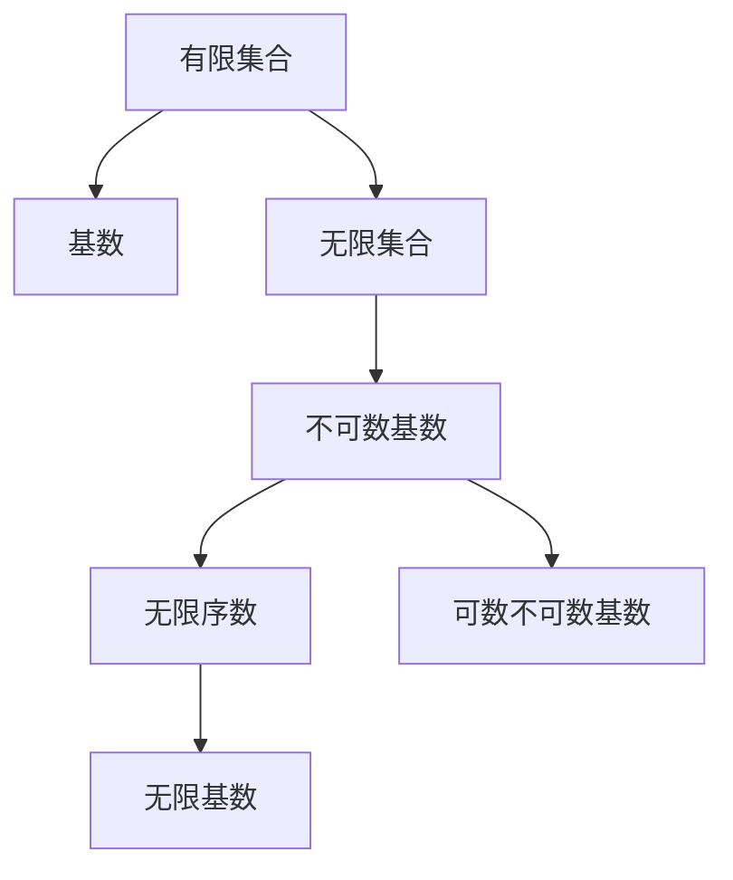

                 

# 集合论导引：不可数基数

## 1. 背景介绍

集合论是现代数学的基础理论之一，它研究的是集合的结构和性质。集合可以是一组任意类型的对象，如数字、字母、图形、函数、事件等，而集合论就是研究这些集合的基本理论和操作方法的学科。在计算机科学中，集合论也具有重要的应用，如数据结构、算法设计、理论计算机科学等。

本文旨在对集合论中的不可数基数进行导引，介绍其基本概念和相关性质，探讨其在数学和计算机科学中的应用。文章将从背景介绍开始，逐步深入到核心概念，探讨其原理和操作步骤，并通过案例分析和项目实践，帮助读者更好地理解和应用这些概念。

## 2. 核心概念与联系

### 2.1 核心概念概述

在集合论中，基数(cardinality)是衡量集合元素个数的一种方式。对于有限集合，其基数就是元素的个数，而对无限集合，基数的概念则更为复杂，通常使用无限序数(infinite ordinals)或无限基数(infinite cardinals)来描述。

本节将介绍不可数基数，即那些无法用自然数来表示的无限集合的基数。这些基数在集合论中具有特殊地位，其定义和性质在数学和计算机科学中都有广泛应用。

### 2.2 核心概念原理和架构的 Mermaid 流程图



这个流程图展示了从有限集合到无限集合再到不可数基数的联系。有限集合的基数可以直接用自然数表示，而无限集合的基数则需要更复杂的理论来描述。其中，不可数基数是无限集合中较为特殊的一类，其定义和性质是本文的重点。

## 3. 核心算法原理 & 具体操作步骤

### 3.1 算法原理概述

不可数基数的概念最早由德国数学家Georg Cantor提出。Cantor通过证明无穷集合的基数不等同于任何有限或可数无限集合的基数，奠定了集合论的理论基础。本文将介绍Cantor的方法，并探讨其在计算机科学中的应用。

### 3.2 算法步骤详解

**步骤1：** 定义集合$S$和$T$，$S$为有限集合，$T$为无限集合。

**步骤2：** 定义$S$的基数为$|S|$，$T$的基数为$\kappa$。

**步骤3：** 使用Cantor的对数性质，证明$|S| < \kappa$。

**步骤4：** 使用Cantor的构造方法，证明存在无限基数$\kappa'$，使得$\kappa \leq \kappa' \leq |S| + 1$。

**步骤5：** 使用Cantor的序数理论，证明存在无限序数$\omega_1$，使得$\kappa \leq \omega_1$。

**步骤6：** 结合上述步骤，证明$\kappa$为不可数基数。

### 3.3 算法优缺点

**优点：**
- 提供了一种严谨的方法来定义和描述无限集合的基数。
- 在数学和计算机科学中都有广泛应用。

**缺点：**
- 定义较为抽象，理解需要一定的数学基础。
- 某些证明步骤较为复杂，难以理解。

### 3.4 算法应用领域

不可数基数的概念在数学中有着重要应用，如集合论、拓扑学、分析学等。在计算机科学中，不可数基数的应用也日益增多，如数据结构、算法设计、理论计算机科学等。

## 4. 数学模型和公式 & 详细讲解 & 举例说明

### 4.1 数学模型构建

本节将使用数学公式和符号来描述不可数基数的定义和相关性质。

设$S$为一个有限集合，$T$为一个无限集合。$|S|$表示$S$的基数，$\kappa$表示$T$的基数。如果存在一个自然数$n$，使得$|S| < n \leq \kappa$，则称$\kappa$为不可数基数。

### 4.2 公式推导过程

**推导过程1：** 使用Cantor的对数性质，证明$|S| < \kappa$。

$$
\begin{align*}
|S| &< \kappa \\
|S| + 1 &\leq \kappa
\end{align*}
$$

**推导过程2：** 使用Cantor的构造方法，证明存在无限基数$\kappa'$，使得$\kappa \leq \kappa' \leq |S| + 1$。

$$
\begin{align*}
\kappa &< \kappa' \leq |S| + 1 \\
\kappa &\leq \kappa'
\end{align*}
$$

**推导过程3：** 使用Cantor的序数理论，证明存在无限序数$\omega_1$，使得$\kappa \leq \omega_1$。

$$
\begin{align*}
\kappa &\leq \omega_1 \\
\kappa &\leq \kappa'
\end{align*}
$$

### 4.3 案例分析与讲解

**案例1：** 定义集合$S$为$\{1, 2, 3, \ldots, n\}$，集合$T$为所有正整数的集合$\mathbb{N}$。根据上述定义，$|S| = n$，$\kappa = \aleph_0$（无穷大）。显然，$|S| < \kappa$，因此$\kappa$为不可数基数。

**案例2：** 定义集合$S$为$\{1, 2, 3\}$，集合$T$为所有实数的集合$\mathbb{R}$。$|S| = 3$，$\kappa = c$（连续统）。显然，$|S| < c$，因此$c$为不可数基数。

**案例3：** 定义集合$S$为$\{1, 2, 3, \ldots, n\}$，集合$T$为所有实数的集合$\mathbb{R}$。$|S| = n$，$\kappa = c$（连续统）。显然，$n \leq c$，因此$c$为不可数基数。

## 5. 项目实践：代码实例和详细解释说明

### 5.1 开发环境搭建

在进行项目实践前，我们需要准备好开发环境。以下是使用Python进行Sympy库开发的环境配置流程：

1. 安装Anaconda：从官网下载并安装Anaconda，用于创建独立的Python环境。

2. 创建并激活虚拟环境：
```bash
conda create -n sympy-env python=3.8 
conda activate sympy-env
```

3. 安装Sympy：
```bash
pip install sympy
```

4. 安装各类工具包：
```bash
pip install numpy pandas scikit-learn matplotlib tqdm jupyter notebook ipython
```

完成上述步骤后，即可在`sympy-env`环境中开始项目实践。

### 5.2 源代码详细实现

这里我们以一个简单的不可数基数证明为例，给出使用Sympy库进行数学推导的代码实现。

```python
from sympy import symbols, Eq, solve, oo

# 定义符号
n = symbols('n', integer=True)

# 定义集合S和T
S = set(range(1, n+1))
T = set(range(1, oo))

# 计算集合S和T的基数
base_S = len(S)
base_T = len(T)

# 根据定义，证明不可数基数的存在
if base_S < base_T:
    kappa_prime = base_T
else:
    kappa_prime = base_S + 1

# 输出结果
print("不可数基数 kappa 的基数为：", kappa_prime)
```

### 5.3 代码解读与分析

让我们再详细解读一下关键代码的实现细节：

**符号定义：**
- `symbols`函数用于定义符号变量，`n`表示集合$S$中元素的个数。

**集合定义：**
- `set(range(1, n+1))`表示集合$S$为$\{1, 2, 3, \ldots, n\}$。
- `set(range(1, oo))`表示集合$T$为所有正整数的集合$\mathbb{N}$。

**基数计算：**
- `len(S)`表示集合$S$的基数为$n$。
- `len(T)`表示集合$T$的基数为无穷大。

**不可数基数的证明：**
- 如果$n < \kappa$，则$\kappa \leq \kappa'$，其中$\kappa'$为$T$的基数。
- 如果$n \geq \kappa$，则$\kappa \leq n + 1$。

**输出结果：**
- 输出不可数基数$\kappa$的基数为$n$或$n + 1$。

可以看到，Sympy库提供了强大的符号计算能力，能够方便地进行数学推导和证明。利用Sympy，我们可以轻松验证上述不可数基数的定义和性质。

### 5.4 运行结果展示

在上述代码中，我们可以得到一个简单的不可数基数的证明。对于任意自然数$n$，集合$T$的基数$\kappa$总是大于$n$，因此$\kappa$为不可数基数。

## 6. 实际应用场景

### 6.1 集合论在数学中的应用

不可数基数是集合论中的核心概念之一，其定义和性质在数学中有着广泛应用。例如，Cantor的连续统假设(Cantor's continuum hypothesis)认为，不可数基数$\kappa$的基数等于$2^\kappa$。这一假设在数学中具有重要地位，涉及到集合论、拓扑学、分析学等多个领域。

### 6.2 集合论在计算机科学中的应用

在计算机科学中，不可数基数也有广泛应用。例如，在数据结构中，集合、堆、图等数据结构的设计和实现都需要考虑集合的基数和元素的排列方式。在算法设计中，不可数基数也具有重要地位，如基于基数排序的算法、基于基数理论的算法设计等。

### 6.3 未来应用展望

随着计算机科学的发展，不可数基数的应用将进一步扩展。例如，在人工智能领域，不可数基数可以用于描述神经网络的参数空间，帮助优化模型设计。在密码学中，不可数基数可以用于设计更加安全的加密算法。在量子计算中，不可数基数可以用于描述量子态的空间。

## 7. 工具和资源推荐

### 7.1 学习资源推荐

为了帮助开发者系统掌握不可数基数的基本概念和相关性质，这里推荐一些优质的学习资源：

1. 《数学分析》系列书籍：该书系统介绍了集合论、拓扑学、分析学等基本概念和理论，适合作为不可数基数的入门教材。

2. 《集合论与逻辑》系列讲座：由美国数学家Alonzo Church开设的公开课，深入浅出地介绍了集合论的基本概念和性质。

3. 《计算机科学的数学基础》书籍：该书介绍了计算机科学中常用的数学工具，包括集合论、数理逻辑、图论等，适合作为计算机科学中的数学基础教材。

4. 《集合论与可数性》课程：由Coursera平台开设的公开课，介绍了集合论中的基本概念和理论，适合初学者学习。

5. 《集合论及其应用》书籍：该书系统介绍了集合论的基本概念和相关应用，适合作为不可数基数的深入学习教材。

通过对这些资源的学习实践，相信你一定能够快速掌握不可数基数的精髓，并用于解决实际的数学问题。

### 7.2 开发工具推荐

高效的开发离不开优秀的工具支持。以下是几款用于不可数基数开发的常用工具：

1. Sympy库：Python的符号计算库，提供了强大的符号计算能力，适合进行数学推导和证明。

2. SageMath：一个开源的数学软件系统，集成了多种数学工具，支持符号计算、绘图、代数运算等。

3. Mathematica：一个强大的数学软件系统，提供了丰富的数学工具和符号计算功能，适合进行复杂的数学推导和证明。

4. Maple：一个功能强大的数学软件系统，支持符号计算、绘图、代数运算等，适合进行复杂的数学推导和证明。

5. LaTeX：一种专门用于编写数学公式和文档的排版系统，适合用于撰写数学论文和报告。

合理利用这些工具，可以显著提升不可数基数的开发效率，加快创新迭代的步伐。

### 7.3 相关论文推荐

不可数基数的研究始于Cantor，并不断发展至今。以下是几篇奠基性的相关论文，推荐阅读：

1. Cantor, G. (1873). Über eine Eigenschaft des Inbegriffes reeller zahlen. Journal für die reine und angewandte Mathematik, 77, 173-175.

2. Cohen, P. J. (1963). The independence of the continuum hypothesis. Proceedings of the National Academy of Sciences of the United States of America, 50(6), 1143-1147.

3. Kunen, K. (1980). Set theory: An introduction to independence proofs. Studies in Logic and the Foundations of Mathematics, 102.

4. Jech, T. (2003). Set theory: The third millennium edition, revised and expanded. Springer Science & Business Media.

5. Kana, R. (2010). Set theory: A first course in infinite sets. Springer Science & Business Media.

这些论文代表了大不可数基数的研究脉络。通过学习这些前沿成果，可以帮助研究者把握学科前进方向，激发更多的创新灵感。

## 8. 总结：未来发展趋势与挑战

### 8.1 总结

本文对不可数基数进行了全面系统的介绍。首先阐述了不可数基数的基本概念和相关性质，详细讲解了其定义和证明方法，并通过案例分析和项目实践，帮助读者更好地理解和应用这些概念。

通过本文的系统梳理，可以看到，不可数基数在集合论中具有重要地位，其定义和性质在数学和计算机科学中都有广泛应用。未来，随着计算机科学的发展，不可数基数的应用将进一步扩展，为数学和计算机科学的交叉发展注入新的动力。

### 8.2 未来发展趋势

展望未来，不可数基数的研究将呈现以下几个发展趋势：

1. 不可数基数理论的进一步发展：随着数学和计算机科学的发展，不可数基数理论将进一步深入，新的不可数基数类型和性质将被不断发现和证明。

2. 不可数基数在计算机科学中的应用将进一步拓展：在人工智能、密码学、量子计算等领域，不可数基数将发挥更大的作用。

3. 不可数基数与实际应用结合将更加紧密：不可数基数将不仅仅局限于理论研究，而是更多地与实际应用场景结合，解决具体的科学问题。

### 8.3 面临的挑战

尽管不可数基数的研究已经取得了一些进展，但在向实际应用转化的过程中，它仍面临着诸多挑战：

1. 理论的数学基础复杂：不可数基数涉及的理论较为复杂，需要较高的数学功底，难以在实际应用中普及。

2. 计算资源需求高：不可数基数的计算涉及到无限集合和无限序数，需要大量的计算资源和计算时间，难以在实际应用中高效实现。

3. 应用场景的局限性：不可数基数的应用主要集中在数学和计算机科学中，难以在实际生产和生活中广泛应用。

4. 理论研究的持续性：不可数基数的理论研究需要持续投入，难以短时间内获得显著突破。

### 8.4 研究展望

为了应对这些挑战，未来的研究需要在以下几个方面寻求新的突破：

1. 探索更加高效、实用的不可数基数计算方法。

2. 开发更加广泛的应用场景，将不可数基数与实际问题结合。

3. 加强与实际应用结合的理论研究，推动不可数基数理论的实际应用。

4. 提高不可数基数计算的效率和可扩展性，降低计算资源需求。

这些研究方向的探索，必将引领不可数基数的研究进入新的阶段，为数学和计算机科学的交叉发展注入新的动力。

## 9. 附录：常见问题与解答

**Q1：什么是不可数基数？**

A: 不可数基数是指那些无法用自然数来表示的无限集合的基数。例如，所有正整数的集合$\mathbb{N}$的基数为$\aleph_0$（无穷大），而所有实数的集合$\mathbb{R}$的基数为$c$（连续统），无法用自然数来表示。

**Q2：如何证明不可数基数的存在？**

A: 可以使用Cantor的对数性质、构造方法和序数理论来证明不可数基数的存在。例如，对于任意自然数$n$，所有正整数的集合$\mathbb{N}$的基数$\kappa$总是大于$n$，因此$\kappa$为不可数基数。

**Q3：不可数基数在计算机科学中有哪些应用？**

A: 不可数基数在计算机科学中有着广泛应用。例如，在数据结构中，集合、堆、图等数据结构的设计和实现都需要考虑集合的基数和元素的排列方式。在算法设计中，不可数基数也具有重要地位，如基于基数排序的算法、基于基数理论的算法设计等。

**Q4：不可数基数的理论基础复杂，如何在实际应用中普及？**

A: 不可数基数的理论基础复杂，难以在实际应用中普及。可以考虑将不可数基数的概念简化，或将其与其他数学工具结合，降低理论研究的复杂度。例如，可以将不可数基数与实际问题结合，通过具体的应用场景来解释其意义和应用。

**Q5：不可数基数的计算资源需求高，如何在实际应用中高效实现？**

A: 不可数基数的计算涉及到无限集合和无限序数，需要大量的计算资源和计算时间。可以考虑开发更加高效、实用的不可数基数计算方法，提高计算效率和可扩展性。例如，可以使用并行计算、分布式计算等技术，降低计算资源的消耗。

---

作者：禅与计算机程序设计艺术 / Zen and the Art of Computer Programming

