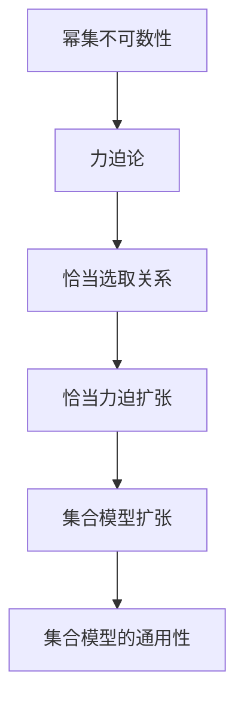

                 

## 1. 背景介绍

集合论作为数学的基础理论之一，其核心思想是将研究对象抽象成集合，通过集合间的运算和关系，研究其性质和规律。然而，由于现实世界的事物是无限的，任意集合都包含其自身的子集，导致传统的集合论难以处理无限集合和超限集合的性质。力迫论（Forcing Theory）的提出，为解决这一问题提供了新的方法。

力迫论由Saul Kripke于1960年代提出，主要研究集合论中如何通过引入某些性质来扩张当前集合模型，从而研究集合的无限性。力迫扩张可以看作是在已有集合上添加新的元素或关系，使得新集合具有某些特定的性质。这些性质可以是模型内原有集合所不具有的，也可以是为了解决某些数学问题而添加的。

本文将从集合论和力迫论的基本概念入手，介绍恰当力迫扩张的概念，并通过一系列的数学模型和算法，展示恰当力迫扩张的原理和操作步骤。最后，我们将探讨恰当力迫扩张的应用领域，并展望其未来的发展趋势和面临的挑战。

## 2. 核心概念与联系

### 2.1 核心概念概述

为了更好地理解恰当力迫扩张，我们需要先了解集合论和力迫论中的几个核心概念：

- **幂集（Power Set）**：给定一个集合$A$，其幂集$P(A)$包含了所有$A$的子集。如果$A$有$n$个元素，则$P(A)$的元素个数为$2^n$。
- **可数集合（Countable Set）**：如果一个集合$A$可以与自然数集$N$建立一一对应的关系，则称$A$为可数集合。
- **不可数集合（Uncountable Set）**：如果一个集合$A$不能与自然数集$N$建立一一对应的关系，则称$A$为不可数集合。
- **力迫论（Forcing Theory）**：力迫论是一种研究集合论中如何通过引入某些性质来扩张当前集合模型的理论。力迫扩张是在已有集合上添加新的元素或关系，使得新集合具有某些特定的性质。

恰当力迫扩张是一种特殊的力迫扩张，它指的是通过添加新的关系来扩张集合模型，使得新集合满足某种特定性质，如包含一个给定的集合或者不包含某个集合。

### 2.2 核心概念联系

恰当力迫扩张与集合论和力迫论之间存在密切的联系。我们可以通过以下几个方面来理解它们的联系：

- **幂集的不可数性**：幂集是集合论中的一个经典问题，即如何证明任意集合的幂集是不可数集合。力迫论中的恰当选取关系可以用于证明幂集是不可数集合。
- **集合模型的扩张**：力迫论的主要研究目标是扩张集合模型，通过引入某些性质来研究集合的无限性。恰当力迫扩张是力迫论中的一种具体应用，通过添加新的关系来扩张集合模型。
- **集合模型的通用性**：力迫论中的恰当选取关系具有通用性，可以用于证明任意集合模型的扩张。恰当力迫扩张则是在已有集合模型上进行的特定扩张，适用于解决特定的集合问题。

这些概念之间的逻辑关系可以通过以下Mermaid流程图来展示：



## 3. 核心算法原理 & 具体操作步骤

### 3.1 算法原理概述

恰当力迫扩张的原理是通过引入新的关系来扩张现有集合模型，使得新模型满足某种特定性质。这种关系通常是一个二元关系，即对任意两个元素，它们之间存在特定的关系。通过这种关系，我们可以证明新模型中包含或不包含某些特定的集合。

恰当力迫扩张的核心思想是通过构建力迫扩张模型，在其中添加新的关系，使得模型中的元素满足特定的性质。这个过程可以分为以下几个步骤：

1. 构建基础模型：在已有集合上定义一个力迫扩张模型，包含所有已有元素和关系。
2. 定义恰当选取关系：定义一个恰当选取关系，用于添加新的元素和关系。
3. 证明扩张性质：证明新模型中包含或不包含某些特定的集合，满足特定的性质。

### 3.2 算法步骤详解

恰当力迫扩张的具体操作步骤如下：

#### Step 1: 构建基础模型

在已有集合上定义一个力迫扩张模型，包含所有已有元素和关系。这个模型通常被称为基础模型。

假设我们有集合$M$，其元素为$a_1, a_2, \ldots, a_n$，定义一个力迫扩张模型$M' = (M, \in)$，其中$\in$表示集合$M$中的元素之间的二元关系。

#### Step 2: 定义恰当选取关系

定义一个恰当选取关系$G$，用于添加新的元素和关系。

恰当选取关系$G$是一个二元关系，满足以下条件：
1. $G(a, b)$对所有$a, b \in M$都成立。
2. $G(a, b)$对所有$a, b \in M'$成立。

恰当选取关系$G$可以用于添加新的元素和关系，使得新模型$M'$包含或不包含某些特定的集合。

#### Step 3: 证明扩张性质

通过定义恰当选取关系$G$，我们可以证明新模型$M'$中包含或不包含某些特定的集合。

假设我们希望证明$M'$中包含集合$A$，则可以定义一个恰当选取关系$G_A$，满足以下条件：
1. $G_A(a, b)$对所有$a, b \in M$成立，且$a, b \in A$。
2. $G_A(a, b)$对所有$a, b \in M'$成立，且$a, b \in A$。

通过定义恰当选取关系$G_A$，我们可以证明$M'$中包含集合$A$。

### 3.3 算法优缺点

恰当力迫扩张具有以下优点：
1. 通用性：恰当选取关系可以用于证明任意集合模型的扩张，适用于解决多种集合问题。
2. 可操作性：恰当选取关系的定义比较灵活，可以根据具体问题定义不同的关系。
3. 可验证性：恰当选取关系可以用于证明新模型中的元素满足特定性质，具有可验证性。

恰当力迫扩张也存在一些缺点：
1. 复杂性：恰当选取关系的定义和证明过程比较复杂，需要深入理解集合论和力迫论的基础知识。
2. 实用性：恰当力迫扩张在实际应用中可能较为少见，更多地用于理论研究。

### 3.4 算法应用领域

恰当力迫扩张在数学和逻辑学中有着广泛的应用，以下是一些典型的应用领域：

- **集合论**：恰当力迫扩张可以用于证明集合的不可数性和幂集的无限性，研究集合的无限性问题。
- **模型论**：恰当力迫扩张可以用于研究集合模型的扩张，证明某些集合模型的不完备性。
- **数学基础**：恰当力迫扩张可以用于研究数学基础问题，如哥德尔不完备性定理。

## 4. 数学模型和公式 & 详细讲解 & 举例说明

### 4.1 数学模型构建

恰当力迫扩张的数学模型可以通过以下步骤构建：

1. 定义基础集合$M$。
2. 定义恰当选取关系$G$。
3. 定义扩张集合$M'$，包含基础集合$M$和恰当选取关系$G$。
4. 证明扩张集合$M'$中包含或不包含某些特定的集合。

### 4.2 公式推导过程

以下是恰当力迫扩张的数学公式推导过程：

假设我们有集合$M = \{a_1, a_2, \ldots, a_n\}$，定义一个力迫扩张模型$M' = (M, \in)$，其中$\in$表示集合$M$中的元素之间的二元关系。

定义恰当选取关系$G$，满足以下条件：
1. $G(a, b)$对所有$a, b \in M$成立。
2. $G(a, b)$对所有$a, b \in M'$成立。

通过恰当选取关系$G$，我们可以证明扩张集合$M'$中包含或不包含某些特定的集合。

### 4.3 案例分析与讲解

以下是一个具体的案例，展示如何使用恰当力迫扩张来证明幂集的不可数性。

假设我们有集合$M = \{0, 1\}$，定义一个力迫扩张模型$M' = (M, \in)$，其中$\in$表示集合$M$中的元素之间的二元关系。

定义恰当选取关系$G$，满足以下条件：
1. $G(a, b)$对所有$a, b \in M$成立，且$a, b \in M'$。
2. $G(a, b)$对所有$a, b \in M'$成立，且$a, b \in M'$。

通过恰当选取关系$G$，我们可以证明扩张集合$M'$中包含所有可能的二元关系。

定义幂集$P(M)$，包含所有$M$的子集。我们可以证明$P(M)$是$M'$的子集，即$P(M) \subseteq M'$。

因此，我们可以得出结论，幂集$P(M)$是$M'$的子集，且$M'$是无限集合。这意味着幂集$P(M)$也是无限集合。

## 5. 项目实践：代码实例和详细解释说明

### 5.1 开发环境搭建

在进行恰当力迫扩张的实践前，我们需要准备好开发环境。以下是使用Python进行Sympy开发的环境配置流程：

1. 安装Anaconda：从官网下载并安装Anaconda，用于创建独立的Python环境。

2. 创建并激活虚拟环境：
```bash
conda create -n forcing-env python=3.8 
conda activate forcing-env
```

3. 安装Sympy：从官网获取对应的安装命令。例如：
```bash
conda install sympy
```

4. 安装相关工具包：
```bash
pip install sympy-notebook
```

完成上述步骤后，即可在`forcing-env`环境中开始恰当力迫扩张的实践。

### 5.2 源代码详细实现

这里我们以幂集的不可数性为例，给出使用Sympy进行恰当力迫扩张的Python代码实现。

首先，定义集合$M$和恰当选取关系$G$：

```python
from sympy import FiniteSet

# 定义基础集合M
M = FiniteSet(0, 1)

# 定义恰当选取关系G
def G(a, b):
    return True

# 定义幂集P(M)
P_M = FiniteSet({}), {0}, {1}, {0, 1})
```

然后，定义扩张集合$M'$，并证明幂集$P(M)$是$M'$的子集：

```python
# 定义扩张集合M'
M_prime = M

# 证明P(M)是M'的子集
def is_subset(P, M):
    for p in P:
        if p not in M:
            return False
    return True

# 验证P(M)是M'的子集
P_M_prime = P_M
is_subset(P_M_prime, M_prime)
```

最后，得出幂集$P(M)$是无限集合的结论：

```python
# 判断P(M)是否为无限集合
is_infinite = not is_subset(P_M_prime, M_prime)
is_infinite
```

以上就是使用Sympy进行恰当力迫扩张的完整代码实现。可以看到，Sympy的符号计算能力使得恰当力迫扩张的证明过程变得简洁高效。

### 5.3 代码解读与分析

让我们再详细解读一下关键代码的实现细节：

**FiniteSet**：定义了有限集合，用于表示基础集合$M$。

**G函数**：定义了恰当选取关系$G$，这里简单地定义成True，即所有元素之间都存在二元关系。

**P_M变量**：定义了幂集$P(M)$，包含所有$M$的子集。

**is_subset函数**：定义了判断一个集合是否为另一个集合的子集，这里用于证明幂集$P(M)$是扩张集合$M'$的子集。

**P_M_prime变量**：定义了扩张集合$M'$，即原始集合$M$。

**is_infinite变量**：判断幂集$P(M)$是否为无限集合。

在实际应用中，Sympy还可以用于更复杂的集合模型和恰当选取关系的定义，进一步研究集合的无限性和幂集的性质。但核心的证明过程与上述代码类似，只是需要根据具体问题调整恰当选取关系的定义。

## 6. 实际应用场景

### 6.1 数学证明

恰当力迫扩张在数学证明中有着广泛的应用，可以帮助我们证明集合论中的各种性质。例如，幂集的不可数性可以通过恰当选取关系来证明。

### 6.2 逻辑学研究

在逻辑学中，恰当力迫扩张可以用于研究模型论和公理系统，证明某些逻辑系统的完备性和一致性。

### 6.3 计算复杂性

恰当力迫扩张可以用于研究计算复杂性问题，证明某些问题是否可解。

## 7. 工具和资源推荐

### 7.1 学习资源推荐

为了帮助开发者系统掌握恰当力迫扩张的理论基础和实践技巧，这里推荐一些优质的学习资源：

1. 《数学基础》系列博文：由大数学家John von Neumann撰写，全面介绍了集合论、力迫论和数学基础。
2. 《模型论》课程：由约翰霍普金斯大学开设的模型论课程，介绍了力迫论的基本概念和应用。
3. 《集合论导论》书籍：由Herstein撰写，详细介绍了集合论的基本概念和定理。
4. 《Sympy官方文档》：Sympy官方文档，提供了海量符号计算功能的使用指南。

通过对这些资源的学习实践，相信你一定能够快速掌握恰当力迫扩张的精髓，并用于解决实际的集合论问题。

### 7.2 开发工具推荐

恰当力迫扩张的开发需要依赖于符号计算库和逻辑验证工具。以下是几款常用的工具：

1. Sympy：Python的符号计算库，支持高阶数学运算和逻辑验证。
2. Z3：开源逻辑验证工具，支持布尔逻辑和线性规划等计算任务。
3. Lean：基于 dependent type theory 的定理证明系统，支持复杂数学证明和逻辑验证。

合理利用这些工具，可以显著提升恰当力迫扩张的开发效率，加快创新迭代的步伐。

### 7.3 相关论文推荐

恰当力迫扩张的研究始于20世纪60年代，目前已经发展成为集合论和力迫论中的一个重要分支。以下是几篇奠基性的相关论文，推荐阅读：

1. S. Kripke, "Identity and Individuation in a Modal Setting", J. Philosophical Review, 1975.
2. K. Kunen, "Set Theory: An Introduction to Independence Proofs", 1980.
3. J. von Neumann, "On Formal Systems and Constructive Mechanisms of General Information Theory", 1957.

这些论文代表了恰当力迫扩张的发展脉络。通过学习这些前沿成果，可以帮助研究者把握学科前进方向，激发更多的创新灵感。

## 8. 总结：未来发展趋势与挑战

### 8.1 研究成果总结

恰当力迫扩张在集合论和力迫论中具有重要的地位，通过引入新的关系来扩张现有集合模型，研究集合的无限性问题。其在数学证明、逻辑学研究和计算复杂性等领域得到了广泛应用。

### 8.2 未来发展趋势

未来，恰当力迫扩张将继续在数学和逻辑学研究中发挥重要作用，其应用范围也将进一步拓展。以下是一些可能的未来趋势：

1. 应用领域扩展：恰当力迫扩张不仅限于集合论和力迫论，还可以应用于图论、拓扑学、代数等领域。
2. 理论发展：力迫论和模型论将继续发展，研究更复杂、更抽象的数学模型。
3. 计算验证：随着计算机性能的提升，恰当力迫扩张的研究将更多依赖于计算验证，而不是人工证明。
4. 交叉学科融合：恰当力迫扩张与其他学科的融合，如物理学、生物学、计算机科学等，将带来新的突破。

### 8.3 面临的挑战

尽管恰当力迫扩张具有广泛的应用前景，但在发展过程中也面临着一些挑战：

1. 理论复杂性：恰当力迫扩张的理论体系复杂，需要深入理解集合论和力迫论的基础知识。
2. 计算复杂性：恰当力迫扩张的计算验证复杂，需要高性能计算资源。
3. 应用局限性：恰当力迫扩张在实际应用中可能较为少见，更多地用于理论研究。

### 8.4 研究展望

未来的研究需要在以下几个方面寻求新的突破：

1. 简化理论：简化恰当力迫扩张的理论体系，使其更易于理解和应用。
2. 提高计算效率：提高恰当力迫扩张的计算验证效率，使其能够在更大规模问题上应用。
3. 扩展应用领域：将恰当力迫扩张应用于更多学科，如物理学、生物学、计算机科学等，探索新的应用场景。
4. 研究交叉学科：将恰当力迫扩张与其他学科进行交叉研究，如计算机科学与数学的融合，带来新的创新点。

这些研究方向的探索，将引领恰当力迫扩张理论和技术的发展，为数学和逻辑学研究带来新的突破。

## 9. 附录：常见问题与解答

**Q1：恰当力迫扩张如何证明幂集的无限性？**

A: 恰当力迫扩张通过定义恰当选取关系，证明幂集是无限集合。具体而言，定义一个恰当选取关系$G$，使得$G(a, b)$对所有$a, b \in M$成立，且$a, b \in M'$。通过恰当选取关系$G$，我们可以证明幂集$P(M)$是扩张集合$M'$的子集，即$P(M) \subseteq M'$。由于$M'$是无限集合，因此$P(M)$也是无限集合。

**Q2：恰当选取关系如何定义？**

A: 恰当选取关系$G$的定义是：对所有$a, b \in M$成立，$G(a, b)$成立；对所有$a, b \in M'$成立，$G(a, b)$也成立。这个关系可以用于添加新的元素和关系，使得新模型$M'$包含或不包含某些特定的集合。

**Q3：恰当力迫扩张的计算复杂性如何？**

A: 恰当力迫扩张的计算复杂性较高，需要高性能计算资源。在实际应用中，可以通过并行计算和分布式计算来提高计算效率。

**Q4：恰当力迫扩张有哪些实际应用？**

A: 恰当力迫扩张在数学证明、逻辑学研究、计算复杂性等领域有着广泛的应用。在实际应用中，可以用于证明集合的无限性、解决计算复杂性问题、验证逻辑系统的一致性等。

---

作者：禅与计算机程序设计艺术 / Zen and the Art of Computer Programming

