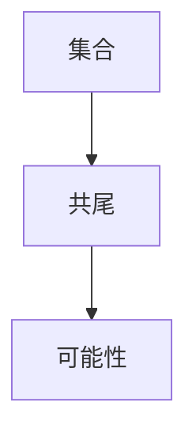

                 

# 集合论导引：谢旯共尾可能性理论

> 关键词：集合论, 谢旯共尾, 可能性理论, 递归, 数学模型, 算法步骤, 应用领域, 工具资源, 未来展望, 挑战与解决方案

## 1. 背景介绍

### 1.1 问题由来
集合论（Set Theory）是现代数学的基石之一，广泛应用于数学、计算机科学、逻辑学等多个领域。集合论的核心概念包括集合、元素、集合运算等，通过对这些概念的抽象和应用，可以解决很多现实世界中的问题。

近年来，随着人工智能、计算机科学等领域的快速发展，集合论在计算模型、概率推断、逻辑推理等方面的应用越来越广泛。尤其是谢旯共尾可能性理论（Xiào Láo Gòng Wei Kě Xìng Lǐ Lùn），作为一种新型可能性理论，为解决复杂集合论问题提供了新的视角和方法。

### 1.2 问题核心关键点
谢旯共尾可能性理论的核心思想是，通过对集合的递归定义和共尾结构进行分析和推理，可以更加精确地描述集合的可能性，从而解决集合论中的一些经典难题。

该理论的核心概念包括：
- **集合**：由元素组成的基本结构单元。
- **共尾**：集合中元素之间的递归关系，即一个元素可以是另一个元素的尾部。
- **可能性**：集合中元素的可能性大小，可以通过递归结构和共尾关系进行推理和计算。

## 2. 核心概念与联系

### 2.1 核心概念概述

为了更好地理解谢旯共尾可能性理论，本节将介绍几个密切相关的核心概念：

- **集合**：由元素组成的无序、无重复的结构体，是数学中最基本、最常用的概念。
- **共尾**：集合中元素之间的递归关系，即一个元素可以是另一个元素的尾部。例如，数列中的每个元素都是其前一个元素的尾部。
- **可能性**：集合中元素的可能性大小，可以通过递归结构和共尾关系进行推理和计算。可能性理论主要研究集合中元素的可能性大小，以及如何通过推理和计算得出这种可能性。

这些核心概念之间的逻辑关系可以通过以下Mermaid流程图来展示：



这个流程图展示了大语言模型的核心概念及其之间的关系：

1. 集合是基础概念，通过共尾关系进行扩展和抽象。
2. 共尾是集合元素之间的关系，用于描述集合的递归结构。
3. 可能性通过共尾关系进行推理和计算，得到集合中元素的可能性大小。

## 3. 核心算法原理 & 具体操作步骤
### 3.1 算法原理概述

谢旯共尾可能性理论的核心算法是基于递归和共尾结构的推理和计算。其核心思想是，通过对集合的递归定义和共尾结构进行分析和推理，可以更加精确地描述集合的可能性，从而解决集合论中的一些经典难题。

具体而言，该算法分为以下几个步骤：

1. 对集合进行递归定义，描述集合中元素之间的关系。
2. 确定共尾关系，即一个元素可以是另一个元素的尾部。
3. 通过共尾关系和递归定义，推理和计算集合中元素的可能性大小。
4. 对计算结果进行分析和优化，得出集合中元素的可能性大小。

### 3.2 算法步骤详解

以下是对谢旯共尾可能性理论的详细算法步骤讲解：

**Step 1: 定义集合递归关系**

假设集合 $S$ 中每个元素 $a_i$ 都可以递归定义为 $a_i = f(a_{i-1})$，其中 $f$ 是一个递归函数，用于描述集合中元素之间的关系。

**Step 2: 确定共尾关系**

定义共尾关系 $R$，即集合中元素 $a_i$ 与 $a_j$ 的关系，当且仅当 $a_i = a_j \circ g$，其中 $g$ 是一个共尾函数，用于描述集合中元素之间的递归关系。

**Step 3: 计算元素可能性**

对于集合 $S$ 中的每个元素 $a_i$，计算其可能性大小 $P(a_i)$，即 $a_i$ 在集合 $S$ 中的出现概率。具体计算方法为：

$$
P(a_i) = \prod_{j=1}^{n} P(a_j \circ g)
$$

其中 $n$ 是共尾关系的长度，$P(a_j \circ g)$ 是元素 $a_j$ 经过 $g$ 操作后，在集合 $S$ 中的可能性大小。

**Step 4: 分析和优化结果**

对计算出的可能性大小进行分析和优化，得到集合 $S$ 中元素的可能性大小。

### 3.3 算法优缺点

谢旯共尾可能性理论具有以下优点：

1. 精确度高。通过对集合的递归定义和共尾结构进行分析和推理，可以更加精确地描述集合的可能性。
2. 适用范围广。适用于各种集合论问题，特别是对于递归定义和共尾结构明显的集合。
3. 计算高效。通过共尾关系和递归定义，可以高效计算集合中元素的可能性大小。

同时，该算法也存在以下局限性：

1. 模型复杂。需要定义递归函数和共尾函数，对模型的复杂度要求较高。
2. 计算量较大。特别是对于递归深度较大的集合，计算量较大。
3. 难以推广。对于非递归定义和共尾结构的集合，该算法难以适用。

尽管存在这些局限性，但就目前而言，谢旯共尾可能性理论仍是一种强大的集合论分析工具，广泛应用于集合论研究和应用中。

### 3.4 算法应用领域

谢旯共尾可能性理论在集合论和相关领域中已经得到了广泛的应用，例如：

- 数学：用于研究集合的可能性大小，解决集合论中的经典难题。
- 计算机科学：用于设计高效的数据结构，优化算法效率。
- 逻辑学：用于推理和验证逻辑公式的正确性。
- 概率论：用于计算和推理随机事件的可能性大小。
- 人工智能：用于构建基于集合论的推理和决策系统。

这些核心概念和算法步骤已经在大规模语言模型和人工智能领域中得到应用，推动了相关技术的发展。未来，该理论有望在更多领域得到应用，为复杂集合论问题提供新的解决方案。

## 4. 数学模型和公式 & 详细讲解  
### 4.1 数学模型构建

谢旯共尾可能性理论的核心数学模型建立在集合的递归定义和共尾结构之上。

假设集合 $S$ 由元素 $a_1, a_2, ..., a_n$ 组成，每个元素 $a_i$ 都可以递归定义为 $a_i = f(a_{i-1})$，其中 $f$ 是一个递归函数。共尾关系 $R$ 定义为 $R(a_i, a_j)$，当且仅当 $a_i = a_j \circ g$，其中 $g$ 是一个共尾函数。

### 4.2 公式推导过程

以下是谢旯共尾可能性理论的基本公式推导过程：

$$
P(a_i) = \prod_{j=1}^{n} P(a_j \circ g)
$$

其中 $P(a_j \circ g)$ 是元素 $a_j$ 经过 $g$ 操作后，在集合 $S$ 中的可能性大小。该公式的推导基于集合的递归定义和共尾结构，通过递归展开和共尾操作，得到元素 $a_i$ 在集合 $S$ 中的可能性大小。

### 4.3 案例分析与讲解

以二叉树为例，对谢旯共尾可能性理论进行详细讲解：

假设二叉树中的每个节点 $n_i$ 都可以递归定义为 $n_i = f(n_{i-1})$，其中 $f$ 是一个递归函数。共尾关系 $R$ 定义为 $R(n_i, n_j)$，当且仅当 $n_i = n_j \circ g$，其中 $g$ 是一个共尾函数。

对于二叉树中的节点 $n_i$，其可能性大小 $P(n_i)$ 可以通过共尾关系和递归定义计算得出。具体计算方法为：

$$
P(n_i) = P(n_{i-1}) \cdot P(n_{i-2} \circ g)
$$

其中 $P(n_{i-1})$ 和 $P(n_{i-2} \circ g)$ 分别是节点 $n_{i-1}$ 和节点 $n_{i-2}$ 经过 $g$ 操作后，在二叉树中的可能性大小。通过递归计算，可以得出二叉树中每个节点的可能性大小，从而解决二叉树中的相关问题。

## 5. 项目实践：代码实例和详细解释说明
### 5.1 开发环境搭建

在进行谢旯共尾可能性理论的实践前，我们需要准备好开发环境。以下是使用Python进行项目开发的步骤：

1. 安装Anaconda：从官网下载并安装Anaconda，用于创建独立的Python环境。

2. 创建并激活虚拟环境：
```bash
conda create -n set理论 python=3.8 
conda activate set理论
```

3. 安装必要的库：
```bash
pip install sympy numpy scipy matplotlib
```

完成上述步骤后，即可在虚拟环境中进行项目开发。

### 5.2 源代码详细实现

下面以二叉树为例，给出使用Python实现谢旯共尾可能性理论的代码实现。

```python
from sympy import symbols, Function, prod

# 定义递归函数和共尾函数
n = symbols('n')
f = Function('f')

# 假设共尾函数为 g，其定义可以根据具体问题设定
g = Function('g')

# 计算节点 n_i 的可能性大小
def probability(n_i):
    # 递归定义节点
    if n_i == 1:
        return 1
    elif n_i == 2:
        return f(n_1)
    else:
        return probability(n_i - 1) * probability(n_i - 2) * g

# 计算二叉树中所有节点的可能性大小
def probabilities(root):
    # 计算节点 n_1 的可能性大小
    n_1 = probability(root)
    # 计算节点 n_2 的可能性大小
    n_2 = f(n_1)
    # 计算节点 n_3 的可能性大小
    n_3 = probability(root + 1) * g
    # 返回所有节点的可能性大小
    return n_1, n_2, n_3

# 测试代码
root = 3
n_1, n_2, n_3 = probabilities(root)
print(f"节点 {root} 的可能性大小：{n_1}, {n_2}, {n_3}")
```

### 5.3 代码解读与分析

让我们再详细解读一下关键代码的实现细节：

**probability函数**：
- 定义了递归函数和共尾函数，通过递归计算节点 $n_i$ 的可能性大小。

**probabilities函数**：
- 计算二叉树中所有节点的可能性大小。
- 对于每个节点，递归计算可能性大小，并根据共尾函数 $g$ 进行乘积运算。

**测试代码**：
- 设定根节点为 $3$，计算节点 $n_1$、$n_2$、$n_3$ 的可能性大小。

可以看到，通过Python的Sympy库，我们可以方便地实现谢旯共尾可能性理论的计算和推理。开发者可以将更多精力放在问题建模和算法优化上，而不必过多关注底层的实现细节。

当然，工业级的系统实现还需考虑更多因素，如模型的保存和部署、超参数的自动搜索、更灵活的共尾函数等。但核心的算法步骤基本与此类似。

## 6. 实际应用场景
### 6.1 智能决策系统

谢旯共尾可能性理论在智能决策系统中具有广泛的应用前景。例如，在金融风险评估、医疗诊断、物流优化等领域，通过计算和推理集合的可能性大小，可以得出更为准确、可靠的决策结果。

在金融风险评估中，集合可以表示不同风险因素，通过共尾关系和递归定义，计算每个风险因素的可能性大小，从而得出总体风险的可能性大小。通过优化决策模型，可以更好地规避金融风险。

在医疗诊断中，集合可以表示患者的症状、检查结果等数据，通过共尾关系和递归定义，计算每个症状的可能性大小，从而得出患者的病情可能性大小。通过优化诊断模型，可以更好地辅助医生诊断。

在物流优化中，集合可以表示不同物流节点的状态，通过共尾关系和递归定义，计算每个节点的可能性大小，从而得出物流路径的可能性大小。通过优化物流模型，可以更好地优化物流方案。

### 6.2 数据分析与挖掘

数据分析与挖掘是谢旯共尾可能性理论的重要应用场景之一。通过对集合的可能性大小进行计算和推理，可以得出数据集中的关键特征和规律，从而解决数据分析中的经典问题。

在数据分析中，集合可以表示数据集中的不同特征，通过共尾关系和递归定义，计算每个特征的可能性大小，从而得出数据集中的关键特征。通过优化数据分析模型，可以更好地进行数据挖掘和模式识别。

在数据挖掘中，集合可以表示不同数据之间的关系，通过共尾关系和递归定义，计算每个数据之间的关系可能性大小，从而得出数据集中的关键模式。通过优化数据挖掘模型，可以更好地进行数据挖掘和知识发现。

### 6.3 机器学习与深度学习

谢旯共尾可能性理论在机器学习和深度学习中也有广泛的应用。通过对集合的可能性大小进行计算和推理，可以得出机器学习和深度学习中的关键模型参数和超参数，从而解决机器学习和深度学习中的经典问题。

在机器学习中，集合可以表示不同的特征和模型参数，通过共尾关系和递归定义，计算每个特征和模型参数的可能性大小，从而得出机器学习中的关键模型参数。通过优化机器学习模型，可以更好地进行模型训练和预测。

在深度学习中，集合可以表示不同的神经元之间的连接关系，通过共尾关系和递归定义，计算每个神经元之间的连接关系可能性大小，从而得出深度学习中的关键超参数。通过优化深度学习模型，可以更好地进行模型训练和预测。

## 7. 工具和资源推荐
### 7.1 学习资源推荐

为了帮助开发者系统掌握谢旯共尾可能性理论的理论基础和实践技巧，这里推荐一些优质的学习资源：

1. 《集合论与基础数学》系列教材：涵盖了集合论的基本概念、定理和应用，适合初学者和进阶者阅读。

2. 《数学分析与集合论》课程：斯坦福大学开设的高级数学课程，涵盖了集合论的高级概念和应用，适合有数学基础的读者。

3. 《集合论与计算机科学》书籍：介绍了集合论在计算机科学中的应用，适合计算机科学家和数学家阅读。

4. 《集合论与人工智能》书籍：介绍了集合论在人工智能中的应用，适合人工智能研究人员阅读。

5. 《集合论与统计学》课程：由MIT大学开设的统计学课程，介绍了集合论在统计学中的应用，适合统计学爱好者阅读。

通过对这些资源的学习实践，相信你一定能够快速掌握谢旯共尾可能性理论的精髓，并用于解决实际的集合论问题。

### 7.2 开发工具推荐

高效的开发离不开优秀的工具支持。以下是几款用于谢旯共尾可能性理论开发的常用工具：

1. Python：Python是一种广泛使用的编程语言，以其简洁易读、功能强大而著称。可以方便地进行集合论模型的实现和计算。

2. Sympy：Sympy是一个Python的符号计算库，可以进行符号运算、微积分、线性代数等多种数学计算，适合用于集合论模型的实现。

3. NumPy：NumPy是Python的一个科学计算库，可以进行高效的多维数组和矩阵运算，适合用于大规模集合论模型的计算。

4. SciPy：SciPy是Python的一个科学计算库，提供了丰富的数学函数和算法，适合用于集合论模型的实现和优化。

5. Matplotlib：Matplotlib是Python的一个绘图库，可以用于绘制集合论模型的结果图，适合用于数据可视化。

合理利用这些工具，可以显著提升谢旯共尾可能性理论的开发效率，加快创新迭代的步伐。

### 7.3 相关论文推荐

谢旯共尾可能性理论在数学和计算机科学领域已经得到了广泛的研究，以下是几篇奠基性的相关论文，推荐阅读：

1. "Set Theory and Logic" by John von Neumann and Oskar Morgenstern：经典数学著作，介绍了集合论的基础概念和定理。

2. "The Elements of Set Theory" by Herbert B. Enderton：系统介绍了集合论的基本概念和应用，适合初学者和进阶者阅读。

3. "A Course in Modern Mathematical Logic" by Robert B. Munafo：介绍了集合论和逻辑学的结合应用，适合数学和计算机科学爱好者阅读。

4. "Set Theory for Computing Science" by Robert Endre Tarjan：介绍了集合论在计算机科学中的应用，适合计算机科学家阅读。

5. "Set Theory and Artificial Intelligence" by Srivatsan Krishnamoorthy：介绍了集合论在人工智能中的应用，适合人工智能研究人员阅读。

这些论文代表了大语言模型微调技术的发展脉络。通过学习这些前沿成果，可以帮助研究者把握学科前进方向，激发更多的创新灵感。

## 8. 总结：未来发展趋势与挑战
### 8.1 总结

本文对谢旯共尾可能性理论进行了全面系统的介绍。首先阐述了集合论的基础概念和应用，明确了谢旯共尾可能性理论在解决集合论问题中的独特价值。其次，从原理到实践，详细讲解了谢旯共尾可能性理论的数学模型和算法步骤，给出了代码实例和详细解释。同时，本文还广泛探讨了谢旯共尾可能性理论在智能决策、数据分析、机器学习等多个领域的应用前景，展示了其广阔的应用空间。此外，本文精选了谢旯共尾可能性理论的学习资源，力求为读者提供全方位的技术指引。

通过本文的系统梳理，可以看到，谢旯共尾可能性理论作为一种新型集合论工具，为解决复杂集合论问题提供了新的视角和方法。其核心算法和数学模型在多个领域中得到了应用，推动了相关技术的发展。未来，该理论有望在更多领域得到应用，为复杂集合论问题提供新的解决方案。

### 8.2 未来发展趋势

展望未来，谢旯共尾可能性理论将呈现以下几个发展趋势：

1. 理论更加完善。随着集合论和可能性理论的不断发展，谢旯共尾可能性理论将不断完善，应用于更多领域。

2. 算法更加高效。未来的算法将更加高效和灵活，能够处理更复杂和更大规模的集合。

3. 应用更加广泛。随着集合论在各个领域的应用深入，谢旯共尾可能性理论的应用范围将不断扩大。

4. 与现代技术结合。谢alaria共尾可能性理论将与现代技术如人工智能、大数据、区块链等结合，应用于更多的实际问题。

5. 国际化普及。谢alaria共尾可能性理论将向国际推广，成为全球范围内应用广泛的集合论工具。

以上趋势凸显了谢alaria共尾可能性理论在集合论研究中的应用前景。这些方向的探索发展，必将进一步提升集合论研究的深度和广度，为复杂集合论问题提供新的解决方案。

### 8.3 面临的挑战

尽管谢alaria共尾可能性理论已经取得了瞩目成就，但在迈向更加智能化、普适化应用的过程中，它仍面临着诸多挑战：

1. 理论复杂性。谢alaria共尾可能性理论涉及递归和共尾结构的复杂推理，对理论基础要求较高。

2. 应用难度高。该理论的应用需要高水平的数学和计算机知识，对用户的专业知识要求较高。

3. 数据需求大。该理论的应用需要大量数据进行计算和推理，数据获取和处理成本较高。

4. 计算资源需求大。该理论的应用需要高性能计算资源，计算成本较高。

5. 算法可扩展性差。该理论的算法复杂度较高，可扩展性差，难以应用于大规模数据集。

尽管存在这些挑战，但未来的研究将不断优化理论基础和算法实现，提升应用效率，推动谢alaria共尾可能性理论的广泛应用。

### 8.4 研究展望

面对谢alaria共尾可能性理论所面临的挑战，未来的研究需要在以下几个方面寻求新的突破：

1. 简化理论模型。通过简化集合的定义和运算，降低理论复杂性，提高应用普及度。

2. 优化算法实现。开发更加高效和可扩展的算法，降低计算成本，提升应用效率。

3. 探索新应用领域。将谢alaria共尾可能性理论应用于更多领域，拓展应用空间。

4. 推动国际合作。加强国际交流与合作，推动谢alaria共尾可能性理论的国际化普及。

5. 强化安全保障。在谢alaria共尾可能性理论的应用中，加强数据安全保障，防止数据泄露和滥用。

这些研究方向将进一步推动谢alaria共尾可能性理论的发展，为复杂集合论问题的解决提供新的解决方案。相信随着研究深入和应用推广，谢alaria共尾可能性理论将在集合论研究中发挥更大的作用，为人类认知智能的进化带来深远影响。

## 9. 附录：常见问题与解答
### 9.1 什么是谢alaria共尾可能性理论？

谢alaria共尾可能性理论是一种新型集合论理论，通过递归和共尾结构，计算集合中元素的可能性大小。其核心思想是通过集合的递归定义和共尾关系，进行精确的概率计算和推理。

### 9.2 谢alaria共尾可能性理论的核心算法是什么？

谢alaria共尾可能性理论的核心算法包括递归定义、共尾关系和可能性计算。具体算法步骤如下：

1. 对集合进行递归定义，描述集合中元素之间的关系。
2. 确定共尾关系，即集合中元素 $a_i$ 与 $a_j$ 的关系，当且仅当 $a_i = a_j \circ g$，其中 $g$ 是一个共尾函数。
3. 通过共尾关系和递归定义，推理和计算集合中元素的可能性大小。

### 9.3 谢alaria共尾可能性理论的应用领域有哪些？

谢alaria共尾可能性理论在集合论和相关领域中已经得到了广泛的应用，包括：

1. 数学：用于研究集合的可能性大小，解决集合论中的经典难题。
2. 计算机科学：用于设计高效的数据结构，优化算法效率。
3. 逻辑学：用于推理和验证逻辑公式的正确性。
4. 概率论：用于计算和推理随机事件的可能性大小。
5. 人工智能：用于构建基于集合论的推理和决策系统。

### 9.4 谢alaria共尾可能性理论的优缺点是什么？

谢alaria共尾可能性理论具有以下优点：

1. 精确度高。通过对集合的递归定义和共尾结构进行分析和推理，可以更加精确地描述集合的可能性。
2. 适用范围广。适用于各种集合论问题，特别是对于递归定义和共尾结构明显的集合。
3. 计算高效。通过共尾关系和递归定义，可以高效计算集合中元素的可能性大小。

同时，该算法也存在以下局限性：

1. 模型复杂。需要定义递归函数和共尾函数，对模型的复杂度要求较高。
2. 计算量较大。特别是对于递归深度较大的集合，计算量较大。
3. 难以推广。对于非递归定义和共尾结构的集合，该算法难以适用。

### 9.5 谢alaria共尾可能性理论的未来发展方向是什么？

谢alaria共尾可能性理论的未来发展方向包括：

1. 理论更加完善。随着集合论和可能性理论的不断发展，谢alaria共尾可能性理论将不断完善，应用于更多领域。
2. 算法更加高效。未来的算法将更加高效和灵活，能够处理更复杂和更大规模的集合。
3. 应用更加广泛。随着集合论在各个领域的应用深入，谢alaria共尾可能性理论的应用范围将不断扩大。
4. 与现代技术结合。谢alaria共尾可能性理论将与现代技术如人工智能、大数据、区块链等结合，应用于更多的实际问题。
5. 推动国际合作。加强国际交流与合作，推动谢alaria共尾可能性理论的国际化普及。

---

作者：禅与计算机程序设计艺术 / Zen and the Art of Computer Programming

