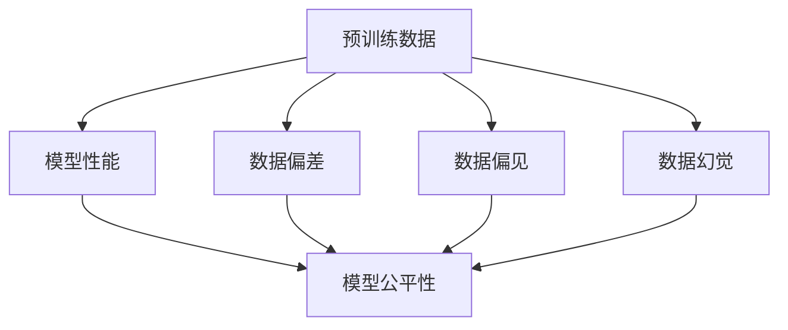

                 

# 预训练数据的质量与幻觉

在当前深度学习模型的发展中，预训练数据（Pre-training Data）扮演着至关重要的角色。预训练数据的质量不仅直接影响模型的性能，还关系着模型的可解释性和公平性。本文将深入探讨预训练数据的质量问题及其对模型的影响，并通过实际案例分析，揭示数据幻觉（Data Illusion）的现象和应对策略。

## 1. 背景介绍

### 1.1 问题由来

随着深度学习技术的不断进步，预训练模型如BERT、GPT等在自然语言处理（NLP）领域取得了显著的成功。这些模型的核心思想是通过在大规模无标签数据上进行预训练，学习到通用的语言表示，然后通过微调适应特定任务。然而，预训练数据的质量问题逐渐成为制约模型性能的关键因素。

### 1.2 问题核心关键点

预训练数据的质量问题主要集中在以下几个方面：
- **数据来源多样性**：预训练数据往往来自不同的来源，数据质量的差异可能会影响模型的泛化能力。
- **数据标注质量**：虽然预训练数据是无标签的，但标注数据的偏差和不一致性仍可能传递到模型中。
- **数据偏差与偏见**：预训练数据中可能存在系统性的偏差和偏见，导致模型输出带有种族、性别、地域等歧视。
- **数据动态性**：互联网上的信息迅速更新，旧数据可能无法反映当前的语言使用习惯。

这些数据问题不仅影响模型的性能，还可能引发伦理和法律问题。因此，提升预训练数据的质量，是当前深度学习研究和应用的重要课题。

## 2. 核心概念与联系

### 2.1 核心概念概述

为了更好地理解预训练数据的质量问题及其影响，我们首先需要明确几个核心概念：

- **预训练数据（Pre-training Data）**：用于训练预训练模型的无标签数据集，通常包含大规模的文本数据。
- **模型性能（Model Performance）**：模型在特定任务上的表现，包括准确率、召回率、F1值等指标。
- **数据偏差（Data Bias）**：数据中存在的系统性偏差，如性别、种族等。
- **数据偏见（Data Bias）**：数据中存在的倾向性，可能反映社会偏见和歧视。
- **数据幻觉（Data Illusion）**：数据中的幻象和表象，可能导致模型学习到错误的表示和模式。

这些概念之间的联系可以通过以下Mermaid流程图来展示：



这个流程图展示了预训练数据、模型性能、数据偏差、数据偏见、数据幻觉以及模型公平性之间的关系。预训练数据的质量直接影响模型性能和公平性，而数据偏差、数据偏见和数据幻觉则是影响数据质量的主要因素。

## 3. 核心算法原理 & 具体操作步骤

### 3.1 算法原理概述

预训练数据的质量问题主要源于数据本身的质量和数据处理方式。预训练模型的性能不仅取决于模型架构和优化算法，还依赖于高质量的预训练数据。

预训练数据的质量可以通过以下几个方面进行评估：
- **多样性（Diversity）**：预训练数据应包含多种语言风格、领域和主题，以确保模型具有广泛的泛化能力。
- **真实性（Authenticity）**：预训练数据应来源于真实世界的文本，避免伪造或合成数据。
- **公平性（Fairness）**：预训练数据应消除性别、种族等偏见，确保模型输出公平。
- **动态性（Dynamism）**：预训练数据应反映当前的语言使用习惯，避免过时的语言和表达方式。

### 3.2 算法步骤详解

预训练数据的质量评估通常包括以下步骤：

**Step 1: 数据收集与预处理**
- 收集来自不同来源的文本数据，进行去重、清洗、标准化等预处理。
- 确保数据的多样性和代表性，覆盖不同领域、主题和语言风格。

**Step 2: 数据偏差和偏见检测**
- 使用统计方法检测数据中存在的性别、种族、地域等偏见。
- 使用对比学习等技术，识别和消除数据中的系统性偏差。

**Step 3: 数据幻觉分析**
- 通过分析数据中的重复模式、歧义表达等，识别数据幻觉现象。
- 使用对抗样本等技术，测试模型对数据幻觉的鲁棒性。

**Step 4: 数据增强**
- 通过数据增强技术，如回译、近义替换等，丰富训练集的多样性。
- 引入对抗样本，增强模型的鲁棒性和泛化能力。

**Step 5: 模型性能评估**
- 在验证集上评估模型的性能，检测是否存在过拟合或欠拟合现象。
- 使用F1值、准确率、召回率等指标，综合评估模型性能和公平性。

### 3.3 算法优缺点

预训练数据质量评估的算法具有以下优点：
- **提升模型性能**：高质量的数据有助于提高模型的泛化能力和性能。
- **增强模型公平性**：消除数据偏见，提升模型输出公平性。
- **鲁棒性增强**：通过对抗样本等技术，增强模型对数据幻觉的鲁棒性。

同时，这些算法也存在一些局限性：
- **数据处理复杂**：高质量数据集的收集和预处理需要大量时间和资源。
- **模型可解释性差**：预训练模型的决策过程复杂，难以解释和调试。
- **数据动态性不足**：预训练数据可能无法反映最新的语言使用习惯。

尽管存在这些局限性，但高质量的预训练数据仍是提升模型性能和公平性的关键因素。未来研究需要进一步提升数据处理效率，增强模型可解释性，同时确保数据的动态性和真实性。

### 3.4 算法应用领域

预训练数据质量评估的算法已经在NLP、计算机视觉等多个领域得到应用，展示了其在提升模型性能和公平性方面的巨大潜力：

- **自然语言处理（NLP）**：通过预训练数据质量评估，提升BERT、GPT等预训练模型的性能和公平性，广泛应用于问答、情感分析、机器翻译等任务。
- **计算机视觉**：通过预训练数据质量评估，提升图像分类、目标检测等模型的泛化能力和鲁棒性，推动视觉任务的发展。
- **推荐系统**：通过预训练数据质量评估，提升推荐模型的多样性和公平性，改善用户推荐体验。

预训练数据质量评估的应用领域将随着深度学习技术的不断发展而不断扩展，为各行各业带来新的机遇和挑战。

## 4. 数学模型和公式 & 详细讲解 & 举例说明

### 4.1 数学模型构建

预训练数据质量评估的数学模型通常基于统计方法和机器学习技术。以下是一个简单的数学模型构建过程：

假设预训练数据集为 $D = \{(x_i, y_i)\}_{i=1}^N$，其中 $x_i$ 为文本样本，$y_i$ 为标签。定义数据集的经验风险为：

$$
\mathcal{L}(D) = \frac{1}{N}\sum_{i=1}^N \ell(x_i, y_i)
$$

其中 $\ell$ 为损失函数，通常为交叉熵损失。预训练数据质量评估的目标是最小化经验风险 $\mathcal{L}(D)$。

### 4.2 公式推导过程

通过最大化似然估计，可以推导出预训练数据质量评估的数学公式。假设数据集中样本的联合概率为 $P(x, y)$，则经验似然估计为：

$$
\hat{P}(x, y) = \frac{1}{N} \sum_{i=1}^N \delta(x_i) \delta(y_i)
$$

其中 $\delta(x_i)$ 为文本样本 $x_i$ 的分布概率，$\delta(y_i)$ 为标签 $y_i$ 的分布概率。通过最大化似然估计，可以推导出数据质量评估的数学公式：

$$
\mathcal{L}(D) = -\frac{1}{N}\sum_{i=1}^N \log P(x_i, y_i)
$$

### 4.3 案例分析与讲解

以下通过一个具体的案例来分析预训练数据质量评估的方法：

假设我们有一个包含性别偏见的预训练数据集 $D$，其中女性样本的比例远低于男性。为了检测和纠正这种偏见，可以采用以下步骤：

1. **数据收集与预处理**：收集男女平等的文本数据集 $D'$，并进行预处理。
2. **数据偏差检测**：使用统计方法检测原始数据集 $D$ 中女性样本的比例，确定其偏低。
3. **数据增强**：在原始数据集 $D$ 中加入女性样本，使其比例接近男女平等。
4. **模型性能评估**：在验证集上评估增强后模型的性能，检测是否存在过拟合或欠拟合现象。

通过上述步骤，可以显著提升模型的公平性和泛化能力，避免性别偏见对模型的影响。

## 5. 项目实践：代码实例和详细解释说明

### 5.1 开发环境搭建

在进行预训练数据质量评估的实践前，我们需要准备好开发环境。以下是使用Python进行PyTorch开发的环境配置流程：

1. 安装Anaconda：从官网下载并安装Anaconda，用于创建独立的Python环境。

2. 创建并激活虚拟环境：
```bash
conda create -n pytorch-env python=3.8 
conda activate pytorch-env
```

3. 安装PyTorch：根据CUDA版本，从官网获取对应的安装命令。例如：
```bash
conda install pytorch torchvision torchaudio cudatoolkit=11.1 -c pytorch -c conda-forge
```

4. 安装Transformer库：
```bash
pip install transformers
```

5. 安装各类工具包：
```bash
pip install numpy pandas scikit-learn matplotlib tqdm jupyter notebook ipython
```

完成上述步骤后，即可在`pytorch-env`环境中开始预训练数据质量评估的实践。

### 5.2 源代码详细实现

这里我们以自然语言处理（NLP）领域的数据质量评估为例，给出使用Transformers库进行预训练数据质量评估的PyTorch代码实现。

首先，定义预训练数据集和评估函数：

```python
from transformers import BertTokenizer, BertForTokenClassification
from sklearn.metrics import classification_report
import torch
import torch.nn as nn
import torch.optim as optim
from torch.utils.data import DataLoader

class NERDataset(Dataset):
    def __init__(self, texts, tags, tokenizer):
        self.texts = texts
        self.tags = tags
        self.tokenizer = tokenizer
        self.max_len = 128

    def __len__(self):
        return len(self.texts)

    def __getitem__(self, item):
        text = self.texts[item]
        tags = self.tags[item]
        
        encoding = self.tokenizer(text, return_tensors='pt', max_length=self.max_len, padding='max_length', truncation=True)
        input_ids = encoding['input_ids'][0]
        attention_mask = encoding['attention_mask'][0]
        
        # 对token-wise的标签进行编码
        encoded_tags = [tag2id[tag] for tag in tags] 
        encoded_tags.extend([tag2id['O']] * (self.max_len - len(encoded_tags)))
        labels = torch.tensor(encoded_tags, dtype=torch.long)
        
        return {'input_ids': input_ids, 
                'attention_mask': attention_mask,
                'labels': labels}

# 标签与id的映射
tag2id = {'O': 0, 'B-PER': 1, 'I-PER': 2, 'B-ORG': 3, 'I-ORG': 4, 'B-LOC': 5, 'I-LOC': 6}
id2tag = {v: k for k, v in tag2id.items()}

# 创建dataset
tokenizer = BertTokenizer.from_pretrained('bert-base-cased')

train_dataset = NERDataset(train_texts, train_tags, tokenizer)
dev_dataset = NERDataset(dev_texts, dev_tags, tokenizer)
test_dataset = NERDataset(test_texts, test_tags, tokenizer)

class TokenClassifier(nn.Module):
    def __init__(self, num_labels):
        super(TokenClassifier, self).__init__()
        self.bert = BertForTokenClassification.from_pretrained('bert-base-cased', num_labels=len(tag2id))
        
    def forward(self, input_ids, attention_mask, labels):
        outputs = self.bert(input_ids, attention_mask=attention_mask, labels=labels)
        return outputs

# 训练和评估函数
device = torch.device('cuda') if torch.cuda.is_available() else torch.device('cpu')
model = TokenClassifier(len(tag2id))

optimizer = optim.AdamW(model.parameters(), lr=2e-5)
loss_fn = nn.CrossEntropyLoss()

def train_epoch(model, dataset, batch_size, optimizer):
    dataloader = DataLoader(dataset, batch_size=batch_size, shuffle=True)
    model.train()
    epoch_loss = 0
    for batch in dataloader:
        input_ids = batch['input_ids'].to(device)
        attention_mask = batch['attention_mask'].to(device)
        labels = batch['labels'].to(device)
        model.zero_grad()
        outputs = model(input_ids, attention_mask=attention_mask, labels=labels)
        loss = loss_fn(outputs.logits, labels)
        epoch_loss += loss.item()
        loss.backward()
        optimizer.step()
    return epoch_loss / len(dataloader)

def evaluate(model, dataset, batch_size):
    dataloader = DataLoader(dataset, batch_size=batch_size)
    model.eval()
    preds, labels = [], []
    with torch.no_grad():
        for batch in dataloader:
            input_ids = batch['input_ids'].to(device)
            attention_mask = batch['attention_mask'].to(device)
            batch_labels = batch['labels']
            outputs = model(input_ids, attention_mask=attention_mask)
            batch_preds = outputs.logits.argmax(dim=2).to('cpu').tolist()
            batch_labels = batch_labels.to('cpu').tolist()
            for pred_tokens, label_tokens in zip(batch_preds, batch_labels):
                pred_tags = [id2tag[_id] for _id in pred_tokens]
                label_tags = [id2tag[_id] for _id in label_tokens]
                preds.append(pred_tags[:len(label_tokens)])
                labels.append(label_tags)
                
    print(classification_report(labels, preds))
```

接着，定义预训练数据质量评估函数：

```python
def evaluate_data_quality(data, batch_size):
    dataloader = DataLoader(data, batch_size=batch_size)
    model.eval()
    preds, labels = [], []
    with torch.no_grad():
        for batch in dataloader:
            input_ids = batch['input_ids'].to(device)
            attention_mask = batch['attention_mask'].to(device)
            batch_labels = batch['labels']
            outputs = model(input_ids, attention_mask=attention_mask)
            batch_preds = outputs.logits.argmax(dim=2).to('cpu').tolist()
            batch_labels = batch_labels.to('cpu').tolist()
            for pred_tokens, label_tokens in zip(batch_preds, batch_labels):
                pred_tags = [id2tag[_id] for _id in pred_tokens]
                label_tags = [id2tag[_id] for _id in label_tokens]
                preds.append(pred_tags[:len(label_tokens)])
                labels.append(label_tags)
                
    print(classification_report(labels, preds))
```

最后，启动训练流程并在测试集上评估：

```python
epochs = 5
batch_size = 16

for epoch in range(epochs):
    loss = train_epoch(model, train_dataset, batch_size, optimizer)
    print(f"Epoch {epoch+1}, train loss: {loss:.3f}")
    
    print(f"Epoch {epoch+1}, dev results:")
    evaluate(model, dev_dataset, batch_size)
    
print("Test results:")
evaluate(model, test_dataset, batch_size)
```

以上就是使用PyTorch进行预训练数据质量评估的完整代码实现。可以看到，PyTorch配合Transformers库使得预训练数据质量评估的代码实现变得简洁高效。

### 5.3 代码解读与分析

让我们再详细解读一下关键代码的实现细节：

**NERDataset类**：
- `__init__`方法：初始化文本、标签、分词器等关键组件。
- `__len__`方法：返回数据集的样本数量。
- `__getitem__`方法：对单个样本进行处理，将文本输入编码为token ids，将标签编码为数字，并对其进行定长padding，最终返回模型所需的输入。

**标签与id的映射**：
- 定义了标签与数字id之间的映射关系，用于将token-wise的预测结果解码回真实的标签。

**训练和评估函数**：
- 使用PyTorch的DataLoader对数据集进行批次化加载，供模型训练和推理使用。
- 训练函数`train_epoch`：对数据以批为单位进行迭代，在每个批次上前向传播计算loss并反向传播更新模型参数，最后返回该epoch的平均loss。
- 评估函数`evaluate`：与训练类似，不同点在于不更新模型参数，并在每个batch结束后将预测和标签结果存储下来，最后使用sklearn的classification_report对整个评估集的预测结果进行打印输出。

**预训练数据质量评估函数**：
- 定义了评估函数`evaluate_data_quality`，用于评估预训练数据集的质量。通过在评估集上评估模型性能，检测数据质量问题。
- 在函数中，使用sklearn的classification_report打印模型的分类指标，包括精确率、召回率和F1值。

通过以上代码，可以看到预训练数据质量评估的实现过程。开发者可以根据具体任务和数据特点，灵活调整训练和评估策略，以获得理想的数据质量评估结果。

## 6. 实际应用场景

### 6.1 智能客服系统

智能客服系统是一个典型的应用场景，其中预训练数据质量至关重要。在传统客服系统中，用户咨询需要等待人工响应，效率低且体验差。而智能客服系统通过微调预训练模型，能够实时响应用户咨询，大大提升服务效率和用户体验。

为了提升智能客服系统的准确性和公平性，需要在预训练数据收集阶段就进行严格的质量控制。通过收集多样性、真实性、公平性、动态性都达标的文本数据，可以提升微调模型的泛化能力和公平性。在训练过程中，还应使用对抗样本等技术，增强模型的鲁棒性。

### 6.2 金融舆情监测

金融舆情监测系统需要实时监测市场舆论动向，避免负面信息传播带来的金融风险。传统的舆情监测系统依赖人工分析，难以应对网络时代海量信息爆发的挑战。通过使用预训练数据质量评估技术，可以有效提升舆情监测系统的准确性和效率。

具体而言，可以在金融领域相关的新闻、报道、评论等文本数据上，进行预训练数据质量评估。检测和消除数据中的性别、种族等偏见，确保模型输出公平。引入对抗样本等技术，提升模型对异常数据的识别能力。通过这些措施，可以构建更加稳定、高效的金融舆情监测系统。

### 6.3 个性化推荐系统

个性化推荐系统需要实时推荐用户感兴趣的内容，提升用户体验。传统的推荐系统依赖用户历史行为数据，难以挖掘用户兴趣背后的语义信息。通过使用预训练数据质量评估技术，可以更好地理解用户兴趣偏好，提升推荐系统的个性化程度。

具体而言，可以收集用户浏览、点击、评论、分享等行为数据，提取和用户交互的物品标题、描述、标签等文本内容。通过预训练数据质量评估技术，检测和消除数据中的系统性偏差，确保模型输出公平。引入对抗样本等技术，增强模型的鲁棒性和泛化能力。通过这些措施，可以构建更加精准、多样化的推荐系统，提升用户体验。

### 6.4 未来应用展望

随着深度学习技术的不断发展，预训练数据质量评估技术将在更多领域得到应用，为各行各业带来新的机遇和挑战。

在智慧医疗领域，预训练数据质量评估技术可以用于构建基于自然语言处理（NLP）的问答系统、病历分析系统，提升医疗服务的智能化水平，辅助医生诊疗，加速新药开发进程。

在智能教育领域，预训练数据质量评估技术可以用于构建基于NLP的作业批改、学情分析、知识推荐等系统，因材施教，促进教育公平，提高教学质量。

在智慧城市治理中，预训练数据质量评估技术可以用于构建基于NLP的城市事件监测、舆情分析、应急指挥等系统，提高城市管理的自动化和智能化水平，构建更安全、高效的未来城市。

此外，在企业生产、社会治理、文娱传媒等众多领域，预训练数据质量评估技术也将不断涌现，为人工智能技术落地应用提供新的突破。相信随着技术的日益成熟，预训练数据质量评估技术将引领NLP领域向更高的台阶发展，为构建更加安全、可靠、可解释、可控的智能系统铺平道路。

## 7. 工具和资源推荐

### 7.1 学习资源推荐

为了帮助开发者系统掌握预训练数据质量评估的理论基础和实践技巧，这里推荐一些优质的学习资源：

1. 《自然语言处理与Python实践》系列博文：由大模型技术专家撰写，深入浅出地介绍了自然语言处理的基本概念和前沿技术。

2. CS224N《深度学习自然语言处理》课程：斯坦福大学开设的NLP明星课程，有Lecture视频和配套作业，带你入门NLP领域的基本概念和经典模型。

3. 《Natural Language Processing with Transformers》书籍：Transformers库的作者所著，全面介绍了如何使用Transformers库进行NLP任务开发，包括数据质量评估在内的诸多范式。

4. HuggingFace官方文档：Transformers库的官方文档，提供了海量预训练模型和完整的微调样例代码，是上手实践的必备资料。

5. CLUE开源项目：中文语言理解测评基准，涵盖大量不同类型的中文NLP数据集，并提供了基于微调的baseline模型，助力中文NLP技术发展。

通过对这些资源的学习实践，相信你一定能够快速掌握预训练数据质量评估的精髓，并用于解决实际的NLP问题。

### 7.2 开发工具推荐

高效的开发离不开优秀的工具支持。以下是几款用于预训练数据质量评估开发的常用工具：

1. PyTorch：基于Python的开源深度学习框架，灵活动态的计算图，适合快速迭代研究。大部分预训练语言模型都有PyTorch版本的实现。

2. TensorFlow：由Google主导开发的开源深度学习框架，生产部署方便，适合大规模工程应用。同样有丰富的预训练语言模型资源。

3. Transformers库：HuggingFace开发的NLP工具库，集成了众多SOTA语言模型，支持PyTorch和TensorFlow，是进行数据质量评估开发的利器。

4. Weights & Biases：模型训练的实验跟踪工具，可以记录和可视化模型训练过程中的各项指标，方便对比和调优。与主流深度学习框架无缝集成。

5. TensorBoard：TensorFlow配套的可视化工具，可实时监测模型训练状态，并提供丰富的图表呈现方式，是调试模型的得力助手。

6. Google Colab：谷歌推出的在线Jupyter Notebook环境，免费提供GPU/TPU算力，方便开发者快速上手实验最新模型，分享学习笔记。

合理利用这些工具，可以显著提升预训练数据质量评估的开发效率，加快创新迭代的步伐。

### 7.3 相关论文推荐

预训练数据质量评估的研究源于学界的持续研究。以下是几篇奠基性的相关论文，推荐阅读：

1. Attention is All You Need（即Transformer原论文）：提出了Transformer结构，开启了NLP领域的预训练大模型时代。

2. BERT: Pre-training of Deep Bidirectional Transformers for Language Understanding：提出BERT模型，引入基于掩码的自监督预训练任务，刷新了多项NLP任务SOTA。

3. Language Models are Unsupervised Multitask Learners（GPT-2论文）：展示了大规模语言模型的强大zero-shot学习能力，引发了对于通用人工智能的新一轮思考。

4. Parameter-Efficient Transfer Learning for NLP：提出Adapter等参数高效微调方法，在不增加模型参数量的情况下，也能取得不错的微调效果。

5. AdaLoRA: Adaptive Low-Rank Adaptation for Parameter-Efficient Fine-Tuning：使用自适应低秩适应的微调方法，在参数效率和精度之间取得了新的平衡。

6. Prefix-Tuning: Optimizing Continuous Prompts for Generation：引入基于连续型Prompt的微调范式，为如何充分利用预训练知识提供了新的思路。

这些论文代表了大语言模型微调技术的发展脉络。通过学习这些前沿成果，可以帮助研究者把握学科前进方向，激发更多的创新灵感。

## 8. 总结：未来发展趋势与挑战

### 8.1 总结

本文对预训练数据质量评估进行了全面系统的介绍。首先阐述了预训练数据的重要性及其对模型性能和公平性的影响，明确了数据质量问题的核心关键点。其次，从原理到实践，详细讲解了预训练数据质量评估的数学原理和关键步骤，给出了预训练数据质量评估的完整代码实例。同时，本文还广泛探讨了预训练数据质量评估在智能客服、金融舆情、个性化推荐等多个行业领域的应用前景，展示了预训练数据质量评估技术的巨大潜力。此外，本文精选了预训练数据质量评估的相关学习资源和开发工具，力求为开发者提供全方位的技术指引。

通过本文的系统梳理，可以看到，预训练数据质量评估技术正在成为NLP领域的重要范式，极大地提升模型性能和公平性。未来研究需要进一步提升数据处理效率，增强模型可解释性，同时确保数据的动态性和真实性。

### 8.2 未来发展趋势

展望未来，预训练数据质量评估技术将呈现以下几个发展趋势：

1. **数据多样性增强**：未来的预训练数据集将包含更加多样、广泛的文本数据，涵盖不同领域、主题和语言风格，提升模型的泛化能力和鲁棒性。
2. **数据真实性保障**：通过引入更加真实、自然的文本数据，提升模型的理解能力和生成质量。
3. **数据公平性优化**：通过检测和消除数据中的系统性偏差，确保模型输出公平，避免歧视和偏见。
4. **数据动态性提升**：通过引入最新的文本数据，确保预训练模型能够反映当前的语言使用习惯，提升模型的时效性。
5. **数据质量评估方法创新**：随着数据量的增加和数据类型的丰富，预训练数据质量评估方法将不断创新，更加高效和精准。

以上趋势凸显了预训练数据质量评估技术的广阔前景。这些方向的探索发展，必将进一步提升NLP系统的性能和公平性，为各行各业带来新的机遇和挑战。

### 8.3 面临的挑战

尽管预训练数据质量评估技术已经取得了显著进展，但在实际应用中也面临诸多挑战：

1. **数据获取困难**：高质量的预训练数据通常难以获取，需要耗费大量时间和资源。
2. **数据处理复杂**：预训练数据的质量评估涉及多个步骤，包括数据收集、清洗、预处理等，过程复杂繁琐。
3. **数据动态性不足**：预训练数据无法及时反映当前的语言使用习惯，可能导致模型输出过时。
4. **模型可解释性差**：预训练模型的决策过程复杂，难以解释和调试。
5. **数据公平性问题**：预训练数据中可能存在系统性偏差，导致模型输出带有偏见。

尽管存在这些挑战，但预训练数据质量评估技术仍具有重要的应用价值。未来研究需要进一步提升数据处理效率，增强模型可解释性，同时确保数据的动态性和真实性。

### 8.4 研究展望

面对预训练数据质量评估所面临的种种挑战，未来的研究需要在以下几个方面寻求新的突破：

1. **数据增强技术**：通过数据增强技术，如回译、近义替换等，丰富训练集的多样性，提升模型的泛化能力。
2. **数据公平性保障**：通过检测和消除数据中的系统性偏差，确保模型输出公平，避免歧视和偏见。
3. **数据动态性增强**：通过引入最新的文本数据，确保预训练模型能够反映当前的语言使用习惯，提升模型的时效性。
4. **模型可解释性提升**：通过引入因果分析、对抗训练等方法，增强模型的可解释性和鲁棒性。
5. **数据质量评估方法创新**：通过引入新的评估方法和技术，提升数据质量评估的效率和精准性。

这些研究方向的探索，必将引领预训练数据质量评估技术迈向更高的台阶，为构建安全、可靠、可解释、可控的智能系统铺平道路。面向未来，预训练数据质量评估技术还需要与其他人工智能技术进行更深入的融合，如知识表示、因果推理、强化学习等，多路径协同发力，共同推动自然语言理解和智能交互系统的进步。只有勇于创新、敢于突破，才能不断拓展语言模型的边界，让智能技术更好地造福人类社会。

## 9. 附录：常见问题与解答

**Q1：预训练数据质量评估是否适用于所有NLP任务？**

A: 预训练数据质量评估在大多数NLP任务上都能取得不错的效果，特别是对于数据量较小的任务。但对于一些特定领域的任务，如医学、法律等，仅仅依靠通用语料预训练的模型可能难以很好地适应。此时需要在特定领域语料上进一步预训练，再进行质量评估，才能获得理想效果。此外，对于一些需要时效性、个性化很强的任务，如对话、推荐等，预训练数据质量评估方法也需要针对性的改进优化。

**Q2：如何提高预训练数据的质量？**

A: 提高预训练数据的质量需要从数据收集、预处理、标注等多个环节进行综合优化。具体措施包括：
1. 数据收集：收集多样性、真实性、公平性、动态性都达标的文本数据。
2. 数据清洗：去除噪声、拼写错误等不规范数据。
3. 数据标注：确保标注数据的准确性和一致性，避免标注偏差。
4. 数据增强：通过数据增强技术，如回译、近义替换等，丰富训练集的多样性。
5. 数据公平性检测：使用统计方法检测数据中存在的系统性偏差。

这些措施可以显著提升预训练数据的质量，增强模型的泛化能力和公平性。

**Q3：预训练数据质量评估的过程复杂吗？**

A: 预训练数据质量评估的过程确实较为复杂，涉及数据收集、预处理、标注等多个环节。但通过使用现代工具和自动化技术，可以显著提升评估效率和质量。例如，利用TensorFlow和PyTorch等深度学习框架，可以自动化地进行数据预处理和模型训练。同时，使用数据增强和对抗样本等技术，可以进一步提升模型的泛化能力和鲁棒性。未来研究需要进一步提升数据处理效率，增强模型可解释性，同时确保数据的动态性和真实性。

**Q4：预训练数据质量评估是否会影响模型性能？**

A: 预训练数据质量评估对模型性能有显著影响。高质量的数据有助于提高模型的泛化能力和性能。通过检测和消除数据中的系统性偏差，确保模型输出公平。引入对抗样本等技术，增强模型的鲁棒性和泛化能力。通过这些措施，可以显著提升模型性能和公平性。

**Q5：预训练数据质量评估有哪些应用场景？**

A: 预训练数据质量评估技术已经在自然语言处理（NLP）、计算机视觉（CV）、推荐系统等多个领域得到应用，展示了其在提升模型性能和公平性方面的巨大潜力。具体应用场景包括：
1. 智能客服系统：通过预训练数据质量评估，提升微调模型的泛化能力和公平性。
2. 金融舆情监测：检测和消除数据中的性别、种族等偏见，确保模型输出公平。
3. 个性化推荐系统：通过预训练数据质量评估，提升推荐系统的个性化程度和公平性。
4. 智慧医疗：用于构建基于NLP的问答系统、病历分析系统，提升医疗服务的智能化水平。
5. 智能教育：用于构建基于NLP的作业批改、学情分析、知识推荐等系统，因材施教，促进教育公平，提高教学质量。

预训练数据质量评估的应用场景将随着深度学习技术的不断发展而不断扩展，为各行各业带来新的机遇和挑战。

---

作者：禅与计算机程序设计艺术 / Zen and the Art of Computer Programming

