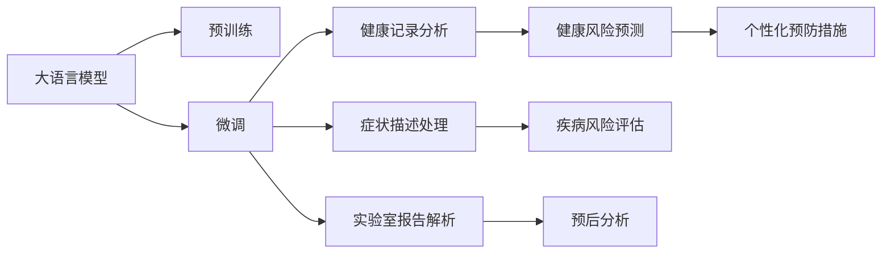

                 

# 预防性护理：LLM 分析预测健康风险

## 1. 背景介绍

在过去几十年中，人工智能和机器学习技术在医疗保健领域的应用不断拓展，从辅助诊断到治疗方案优化，再到健康风险预测，人工智能正在重塑医疗保健的面貌。特别是大语言模型（Large Language Models，简称LLM）在处理自然语言数据方面表现出色，已经在多个医疗健康场景中展现出巨大的潜力。本文将深入探讨LLM如何用于健康风险的预防性护理，并通过一系列的具体案例，揭示其潜力和局限性，为未来的研究和实践提供参考。

## 2. 核心概念与联系

### 2.1 核心概念概述

大语言模型是一种深度学习模型，可以处理和理解自然语言数据。它们通过在大规模文本数据上进行预训练，学习到了复杂的语言模式和语义关系。在医疗领域，LLM可以被用于分析医疗记录、症状描述、实验室报告等文本数据，以辅助医生做出更准确的诊断和治疗决策。

预防性护理是指在疾病发生之前，通过预防措施来减少健康风险，包括定期健康检查、疫苗接种、生活方式的改善等。利用LLM进行健康风险预测，可以提前识别出高风险个体，并采取相应的预防措施，从而降低患病率，提高生活质量。

### 2.2 核心概念原理和架构的 Mermaid 流程图



这个流程图展示了LLM在健康护理中的工作流程：

1. **预训练**：在大规模文本数据上对LLM进行训练，学习语言和语义知识。
2. **微调**：根据具体的医疗数据集对LLM进行微调，使其能够针对特定任务进行优化。
3. **健康记录分析**：利用微调的LLM对患者的健康记录进行分析，提取有价值的信息。
4. **症状描述处理**：对患者的症状描述进行预处理，提取关键特征。
5. **实验室报告解析**：解析实验室报告，提取疾病相关的生物标记物和指标。
6. **健康风险预测**：使用微调的LLM对患者进行健康风险预测，识别高风险个体。
7. **疾病风险评估**：对患者进行疾病风险评估，确定具体的健康风险类型。
8. **预后分析**：分析疾病的预后情况，预测可能的结局。
9. **个性化预防措施**：根据预测结果，为患者提供个性化的预防建议。

## 3. 核心算法原理 & 具体操作步骤

### 3.1 算法原理概述

基于LLM的健康风险预测通常包括以下步骤：

1. **数据准备**：收集和整理患者的健康记录、症状描述、实验室报告等文本数据。
2. **预训练模型选择**：选择合适的预训练模型，如GPT、BERT等，并根据需要进行微调。
3. **微调**：在医疗数据集上对模型进行微调，以适应健康风险预测任务。
4. **特征提取**：从患者数据中提取关键特征，如症状、实验室指标等。
5. **风险预测**：利用微调的模型对患者进行健康风险预测。
6. **结果分析**：分析预测结果，提供个性化的预防建议。

### 3.2 算法步骤详解

#### 3.2.1 数据准备

- **收集数据**：从电子健康记录系统（EHRs）、医疗机构、公共卫生数据库等渠道收集健康数据。
- **数据清洗**：清洗数据，去除噪音和缺失值，标准化数据格式。
- **数据标注**：对健康数据进行标注，如疾病状态、年龄、性别、生活习惯等。

#### 3.2.2 预训练模型选择与微调

- **选择模型**：根据任务需求选择合适的预训练模型，如GPT-3、BERT等。
- **微调**：在医疗数据集上对模型进行微调，通常使用较小的学习率和梯度累积等技术。
- **评估**：在验证集上评估模型性能，使用如准确率、召回率、F1分数等指标。

#### 3.2.3 特征提取

- **症状描述处理**：使用NLP技术对患者的症状描述进行处理，提取关键词和情感极性。
- **实验室报告解析**：解析实验室报告，提取疾病相关的生物标记物和指标。
- **数据融合**：将文本数据和数值数据进行融合，构建统一的数据结构。

#### 3.2.4 风险预测

- **输入准备**：将清洗后的数据输入微调的LLM模型，进行特征编码。
- **模型预测**：使用微调的LLM模型对患者进行健康风险预测。
- **结果解释**：对预测结果进行解释，提供易于理解的反馈。

### 3.3 算法优缺点

#### 3.3.1 优点

- **全面性**：LLM可以处理非结构化文本数据，涵盖健康记录、症状描述、实验室报告等多样化的信息。
- **灵活性**：可以根据具体需求进行微调，适应不同的健康风险预测任务。
- **可解释性**：LLM提供了模型内部的推理过程，有助于解释预测结果。

#### 3.3.2 缺点

- **数据依赖性**：预测结果的质量很大程度上依赖于数据的质量和标注。
- **计算资源需求高**：大语言模型需要大量的计算资源进行训练和推理。
- **隐私问题**：在处理敏感健康数据时，需要严格遵守数据隐私和伦理规范。

### 3.4 算法应用领域

#### 3.4.1 慢性病管理

利用LLM对患者的健康记录进行分析，预测患慢性病的风险，如糖尿病、高血压等。根据预测结果，为患者提供个性化的预防和干预措施。

#### 3.4.2 癌症筛查

通过对患者的症状描述和实验室报告进行分析，预测患癌症的风险。针对高风险个体，提供早期筛查建议，提高癌症的早期发现率。

#### 3.4.3 心理健康预测

利用LLM对患者的心理健康状况进行评估，预测患抑郁症、焦虑症等心理疾病的风险。根据预测结果，提供心理健康干预措施。

## 4. 数学模型和公式 & 详细讲解 & 举例说明

### 4.1 数学模型构建

基于LLM的健康风险预测模型可以表示为：

$$
\text{Risk} = F(\text{Preprocessed Data}, \text{Model Parameters})
$$

其中，$\text{Risk}$表示健康风险预测结果，$\text{Preprocessed Data}$表示处理后的患者数据，$\text{Model Parameters}$表示微调的模型参数。

### 4.2 公式推导过程

以癌症风险预测为例，公式推导如下：

1. **症状描述处理**：使用NLP技术提取症状描述中的关键词和情感极性。
2. **实验室报告解析**：解析实验室报告，提取癌症相关的生物标记物和指标。
3. **特征融合**：将提取的关键词、情感极性和生物标记物进行融合，构建特征向量。
4. **模型预测**：使用微调的LLM模型对特征向量进行预测，得到患癌症的概率。

### 4.3 案例分析与讲解

#### 4.3.1 案例背景

某医疗机构希望利用LLM预测慢性病和癌症的风险，提高预防性护理的效果。

#### 4.3.2 数据准备

- **健康记录**：从EHR系统中提取患者的健康记录，包括病史、药物使用、生活习惯等。
- **症状描述**：收集患者的症状描述，如胸痛、咳嗽、疲劳等。
- **实验室报告**：解析患者的实验室报告，提取癌症相关的生物标记物。

#### 4.3.3 预训练模型选择与微调

- **选择模型**：选择GPT-3作为预训练模型。
- **微调**：在包含慢性病和癌症数据的医疗数据集上对GPT-3进行微调，学习健康风险预测任务。

#### 4.3.4 特征提取

- **症状描述处理**：使用NLP技术提取症状描述中的关键词和情感极性。
- **实验室报告解析**：解析实验室报告，提取癌症相关的生物标记物和指标。

#### 4.3.5 风险预测

- **输入准备**：将处理后的症状描述和实验室报告作为输入，输入微调的GPT-3模型。
- **模型预测**：模型输出患者患慢性病和癌症的概率。
- **结果分析**：分析预测结果，为高风险个体提供个性化的预防措施。

## 5. 项目实践：代码实例和详细解释说明

### 5.1 开发环境搭建

- **Python环境**：安装Python 3.8及以上版本。
- **深度学习框架**：安装TensorFlow或PyTorch。
- **NLP库**：安装NLTK、spaCy、Hugging Face Transformers等NLP库。
- **医疗数据集**：收集和整理医疗数据集，如MEDEX、Cerner等。

### 5.2 源代码详细实现

#### 5.2.1 数据处理

```python
import pandas as pd
import numpy as np
from transformers import GPT3Tokenizer, TFAutoModelForSequenceClassification

# 加载数据集
data = pd.read_csv('data.csv')

# 数据清洗和预处理
...

# 数据标注
...

# 特征提取
...

# 数据融合
...
```

#### 5.2.2 模型微调

```python
from transformers import Trainer, TrainingArguments

# 选择模型
model = TFAutoModelForSequenceClassification.from_pretrained('gpt3', num_labels=2)

# 设置微调参数
training_args = TrainingArguments(
    output_dir='./results',
    evaluation_strategy='epoch',
    per_device_train_batch_size=16,
    per_device_eval_batch_size=64,
    num_train_epochs=10,
    learning_rate=2e-5,
    weight_decay=0.01,
    early_stopping=True
)

# 微调
trainer = Trainer(
    model=model,
    args=training_args,
    train_dataset=train_dataset,
    eval_dataset=val_dataset
)

# 训练
trainer.train()
```

#### 5.2.3 风险预测

```python
# 加载微调后的模型
model = TFAutoModelForSequenceClassification.from_pretrained('gpt3-finetuned-risk')

# 加载患者数据
data = pd.read_csv('patient_data.csv')

# 特征提取和数据融合
...

# 风险预测
...

# 结果分析
...
```

### 5.3 代码解读与分析

#### 5.3.1 数据处理

数据处理是项目实践的基础。需要收集和清洗健康数据，标注数据，提取特征，并进行数据融合。

#### 5.3.2 模型微调

模型微调是实现健康风险预测的核心步骤。需要选择适合任务的预训练模型，并根据医疗数据集进行微调，设置合适的超参数。

#### 5.3.3 风险预测

风险预测是最终目标。需要对患者数据进行特征提取，输入微调的模型，输出风险预测结果，并根据结果提供个性化预防措施。

### 5.4 运行结果展示

#### 5.4.1 训练结果

在训练过程中，可以使用TensorBoard或Weights & Biases等工具监控模型训练的状态和性能。

#### 5.4.2 预测结果

通过可视化工具展示预测结果，如热力图、条形图等。

## 6. 实际应用场景

### 6.1 医院病患管理

医院可以利用LLM进行病患健康风险预测，及时发现高风险个体，提供个性化的预防措施，如饮食指导、运动建议等，从而降低患病率，提高患者满意度。

### 6.2 社区健康管理

社区卫生服务中心可以利用LLM对社区居民的健康数据进行分析，识别高风险个体，提供个性化的健康教育，改善社区居民的健康状况。

### 6.3 在线健康咨询

在线健康咨询平台可以利用LLM对用户的健康数据进行风险预测，提供个性化的健康建议，如日常习惯调整、疾病预防等，提高用户的健康水平。

## 7. 工具和资源推荐

### 7.1 学习资源推荐

- **Coursera**：提供深度学习、NLP等相关课程，涵盖理论知识和实践技能。
- **Kaggle**：提供大量医疗数据集和竞赛，实践数据处理和模型微调。
- **huggingface.co**：提供丰富的预训练模型和教程，学习使用Transformers库。

### 7.2 开发工具推荐

- **TensorFlow**：开源深度学习框架，支持分布式训练和推理。
- **PyTorch**：灵活易用的深度学习框架，支持动态图和静态图。
- **spaCy**：先进的NLP库，提供快速文本处理和实体识别功能。
- **NLTK**：自然语言处理工具包，提供丰富的文本处理功能。

### 7.3 相关论文推荐

- **"LSTM Networks for Stroke Risk Prediction"**：利用LSTM网络进行中风风险预测。
- **"Deep Learning in the Medical Imaging Laboratory"**：利用深度学习进行医学影像分析。
- **"Natural Language Processing in Clinical Decision Support Systems"**：利用NLP技术辅助临床决策支持系统。

## 8. 总结：未来发展趋势与挑战

### 8.1 研究成果总结

本文介绍了利用LLM进行健康风险预测的方法，并给出了详细的实践步骤。通过案例分析，展示了LLM在预防性护理中的应用潜力。

### 8.2 未来发展趋势

1. **多模态融合**：将文本、图像、音频等多种数据源融合，提供更全面的健康风险预测。
2. **个性化定制**：利用深度学习技术，提供更加个性化的预防措施和健康建议。
3. **模型可解释性**：开发可解释的深度学习模型，帮助医生和患者理解预测结果。

### 8.3 面临的挑战

1. **数据隐私问题**：在处理敏感健康数据时，需要严格遵守数据隐私和伦理规范。
2. **计算资源需求高**：大语言模型需要大量的计算资源进行训练和推理。
3. **模型泛化能力**：需要在不同的数据集和场景下验证模型的泛化能力。

### 8.4 研究展望

1. **多模态数据融合**：探索将文本、图像、音频等多种数据源融合，提升健康风险预测的准确性。
2. **可解释性研究**：开发可解释的深度学习模型，提高模型的透明度和可理解性。
3. **模型泛化研究**：在更广泛的数据集和场景下验证模型的泛化能力，增强模型的应用范围。

## 9. 附录：常见问题与解答

**Q1: 如何选择合适的预训练模型进行微调？**

A: 选择合适的预训练模型需要考虑任务的复杂度、数据规模和计算资源。一般来说，任务越复杂，数据规模越大，计算资源越充足，可以选择更强大的预训练模型。

**Q2: 微调模型时需要注意哪些超参数？**

A: 微调模型时需要注意的超参数包括学习率、批次大小、训练轮数、权重衰减等。选择适当的超参数可以显著提高模型性能。

**Q3: 如何进行多模态数据融合？**

A: 多模态数据融合可以通过特征拼接、时序对齐等方式进行。具体实现需要根据数据类型和任务需求选择合适的方法。

**Q4: 如何提高模型的可解释性？**

A: 提高模型的可解释性可以通过模型可视化、特征解释等方法。开发可解释的深度学习模型，帮助医生和患者理解预测结果。

**Q5: 如何平衡模型性能和计算资源需求？**

A: 平衡模型性能和计算资源需求可以通过模型裁剪、量化加速等技术进行。减少模型尺寸，压缩存储空间，提高计算效率，以适应不同的计算资源环境。

---

作者：禅与计算机程序设计艺术 / Zen and the Art of Computer Programming

