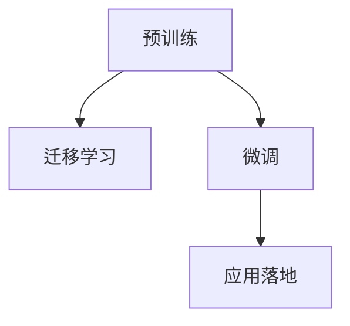

                 

# 驱动当下AI大模型发展的三驾马车

> 关键词：大模型, 深度学习, 迁移学习, 预训练, 应用落地

## 1. 背景介绍

### 1.1 问题由来

随着深度学习技术的飞速发展，大模型（Large Model）在各个领域都展现了令人瞩目的能力。从NLP、图像识别到机器人、自动驾驶，大模型正在逐步改变人类的生产生活方式。这些大模型的核心特点就是参数量庞大，通常包含数十亿甚至上百亿个参数。然而，如此庞大的模型训练、部署和维护成本均远超传统模型，而且需要巨量的计算资源。

为了解决这些问题，各大技术公司和研究机构不断探索如何高效地训练、微调和部署这些大模型。目前，基于深度学习的预训练和微调技术是其中最重要的两个方向，同时也是驱动当下大模型发展的主要动力。本文将从预训练、迁移学习、微调这三个方面，探讨驱动大模型发展的三驾马车，并分析它们在未来AI领域的重要作用。

### 1.2 问题核心关键点

预训练、迁移学习和微调三者之间密切关联，共同构成了大模型从数据驱动到任务驱动的重要演进路径：

- **预训练**：使用大规模无标签数据进行训练，学习通用的语言或视觉知识，是构建大模型的基础。
- **迁移学习**：将预训练模型的通用知识应用于特定任务，减少从头训练所需的时间和数据量。
- **微调**：在预训练模型的基础上，使用少量有标签数据进行细粒度优化，进一步提升模型在该任务上的性能。

这些技术的结合，使得大模型能够在计算资源有限的情况下，快速高效地应用于各类任务，取得了广泛的应用成功。

## 2. 核心概念与联系

### 2.1 核心概念概述

要深入理解大模型的发展，首先需要明确几个核心概念：

- **深度学习**：一种通过多层次神经网络进行复杂数据分析和模式识别的机器学习方法。
- **预训练**：使用大规模无标签数据进行训练，学习通用的语言或视觉知识，是构建大模型的基础。
- **迁移学习**：将预训练模型的通用知识应用于特定任务，减少从头训练所需的时间和数据量。
- **微调**：在预训练模型的基础上，使用少量有标签数据进行细粒度优化，进一步提升模型在该任务上的性能。
- **应用落地**：将大模型部署到实际应用场景中，解决具体的业务问题，带来商业价值。

这些概念之间的逻辑关系可以通过以下Mermaid流程图来展示：



这个流程图展示了从预训练到应用落地的整体流程：

1. 预训练阶段，模型学习到通用的知识，成为后续迁移和微调的基础。
2. 迁移学习阶段，通过将预训练模型的知识迁移到特定任务上，减少从头训练的难度。
3. 微调阶段，进一步优化模型在特定任务上的性能，确保最佳的业务效果。
4. 应用落地阶段，模型被部署到实际应用场景中，解决具体的业务问题，带来商业价值。

## 3. 核心算法原理 & 具体操作步骤

### 3.1 算法原理概述

预训练、迁移学习和微调技术共同构成了大模型发展的核心算法。它们之间存在紧密的联系，且互相补充，共同驱动着大模型在各个领域的应用和演进。

- **预训练**：在大型语料库上训练大规模神经网络，学习通用的语言知识，使得模型在特定任务上的表现更加优秀。
- **迁移学习**：利用预训练模型的知识，直接应用于特定任务上，减少从头训练所需的资源和时间。
- **微调**：在预训练模型的基础上，使用少量有标签数据进行细粒度优化，进一步提升模型在特定任务上的性能。

这三个阶段共同构成了大模型从数据驱动到任务驱动的关键路径，使得模型能够高效地应用于各种实际业务场景。

### 3.2 算法步骤详解

#### 3.2.1 预训练算法步骤

1. **数据准备**：收集大规模无标签数据，如Pile、BigQuery等。
2. **模型选择**：选择适当的神经网络架构，如Transformer等。
3. **训练**：使用预训练任务（如自回归、自编码等）在大规模数据上训练模型。
4. **参数冻结**：保留预训练模型的大部分参数，只微调顶层。
5. **模型评估**：在验证集上评估模型性能，选择最优模型进行微调。

#### 3.2.2 迁移学习算法步骤

1. **数据准备**：收集特定任务的有标签数据。
2. **模型选择**：选择已预训练好的模型作为初始化参数。
3. **模型适配**：添加适当的任务适配层，如分类头、解码器等。
4. **训练**：使用有标签数据对模型进行微调，调整顶层参数。
5. **模型评估**：在测试集上评估模型性能，选择最优模型进行部署。

#### 3.2.3 微调算法步骤

1. **数据准备**：收集特定任务的有标签数据。
2. **模型选择**：选择已预训练好的模型作为初始化参数。
3. **任务适配**：根据任务类型，设计合适的输出层和损失函数。
4. **训练**：使用有标签数据对模型进行微调，调整所有或部分参数。
5. **模型评估**：在测试集上评估模型性能，选择最优模型进行部署。

### 3.3 算法优缺点

#### 3.3.1 预训练算法的优缺点

- **优点**：
  - 利用大规模无标签数据，学习通用的语言知识。
  - 模型参数量庞大，具备强大的表达能力。
  - 预训练模型可以作为初始化参数，加速迁移学习和微调过程。

- **缺点**：
  - 需要巨量的计算资源和时间，训练成本高。
  - 模型复杂度较高，训练难度大。

#### 3.3.2 迁移学习算法的优缺点

- **优点**：
  - 利用预训练模型的通用知识，减少从头训练的难度。
  - 在特定任务上，模型性能提升显著。
  - 计算资源需求低，适用于资源受限的场景。

- **缺点**：
  - 需要适当的任务适配层，设计复杂。
  - 如果预训练模型与特定任务差异较大，效果可能不理想。

#### 3.3.3 微调算法的优缺点

- **优点**：
  - 利用少量有标签数据，快速提升模型在特定任务上的性能。
  - 模型参数更新少，计算资源需求低。
  - 模型泛化能力好，适应性强。

- **缺点**：
  - 数据量有限，可能存在过拟合风险。
  - 微调过程需要精心的设计，如学习率选择、正则化等。

## 4. 数学模型和公式 & 详细讲解 & 举例说明

### 4.1 数学模型构建

预训练、迁移学习和微调技术的核心算法都可以通过数学模型来描述。这里以自然语言处理（NLP）中的预训练和微调为例，给出数学模型的构建过程。

#### 4.1.1 预训练模型

预训练模型通常使用自回归或自编码任务进行训练，目标是最小化模型在未标注数据上的预测误差。以自回归任务为例，模型的目标是最小化模型在给定上下文下的下一个单词预测误差：

$$
L_{PT} = \frac{1}{N} \sum_{i=1}^N \sum_{j=1}^{L_x} \mathbb{E}_{p(x|x_{<j})} \left[ \log P_{PT}(x_j|x_{<j}, \theta_{PT}) \right]
$$

其中 $x_j$ 表示序列中的第 $j$ 个单词，$x_{<j}$ 表示 $x_j$ 之前的上下文，$p(x|x_{<j})$ 表示给定上下文 $x_{<j}$ 下单词 $x_j$ 的概率分布，$P_{PT}(x_j|x_{<j}, \theta_{PT})$ 表示预训练模型的预测概率，$\theta_{PT}$ 表示预训练模型的参数。

#### 4.1.2 微调模型

微调模型通常使用监督学习任务进行训练，目标是最小化模型在有标签数据上的预测误差。以分类任务为例，模型的目标是最小化模型在给定输入 $x$ 下的分类误差：

$$
L_{FT} = \frac{1}{N} \sum_{i=1}^N \ell(\hat{y}, y)
$$

其中 $x$ 表示输入文本，$\hat{y}$ 表示模型预测的分类标签，$y$ 表示真实标签，$\ell$ 表示损失函数（如交叉熵）。

### 4.2 公式推导过程

#### 4.2.1 预训练算法推导

预训练算法的目标是在大规模无标签数据上学习通用的语言知识，具体推导过程如下：

1. **数据准备**：收集大规模无标签数据 $D$，将文本序列 $x$ 划分为单词序列 $x_{<j}$ 和下一个单词 $x_j$。
2. **模型选择**：选择适当的神经网络模型 $M_{PT}(x_{<j})$，目标是最小化模型在未标注数据上的预测误差 $L_{PT}$。
3. **训练**：使用随机梯度下降（SGD）等优化算法，更新模型参数 $\theta_{PT}$，最小化 $L_{PT}$。

#### 4.2.2 迁移学习算法推导

迁移学习的目标是在特定任务上，利用预训练模型的知识，加速模型训练。具体推导过程如下：

1. **数据准备**：收集特定任务的有标签数据 $D_{FT}$，将文本序列 $x$ 划分为输入 $x_{<j}$ 和输出 $y$。
2. **模型选择**：选择已预训练好的模型 $M_{PT}(x_{<j})$，添加适当的任务适配层 $M_{FT}$，目标是最小化模型在有标签数据上的预测误差 $L_{FT}$。
3. **训练**：使用随机梯度下降（SGD）等优化算法，更新模型参数 $\theta_{FT}$，最小化 $L_{FT}$。

#### 4.2.3 微调算法推导

微调的的目标是在特定任务上，进一步优化模型性能。具体推导过程如下：

1. **数据准备**：收集特定任务的有标签数据 $D_{FT}$，将文本序列 $x$ 划分为输入 $x_{<j}$ 和输出 $y$。
2. **模型选择**：选择已预训练好的模型 $M_{PT}(x_{<j})$，添加适当的任务适配层 $M_{FT}$，目标是最小化模型在有标签数据上的预测误差 $L_{FT}$。
3. **训练**：使用随机梯度下降（SGD）等优化算法，更新模型参数 $\theta_{FT}$，最小化 $L_{FT}$。

### 4.3 案例分析与讲解

#### 4.3.1 预训练案例分析

以BERT为例，BERT通过在大型语料库上进行预训练，学习到丰富的语言知识。具体步骤如下：

1. **数据准备**：收集大规模无标签数据，如维基百科、新闻文章等。
2. **模型选择**：选择Transformer架构的BERT模型。
3. **训练**：在预训练任务上（如掩码语言模型、下一句预测等）训练模型，最小化预测误差。
4. **模型评估**：在验证集上评估模型性能，选择最优模型进行微调。

#### 4.3.2 迁移学习案例分析

以BERT在命名实体识别（NER）任务上的迁移学习为例，具体步骤如下：

1. **数据准备**：收集有标注的NER数据集，如CoNLL-2003等。
2. **模型选择**：选择预训练好的BERT模型作为初始化参数。
3. **模型适配**：在模型顶部添加分类头，定义损失函数为交叉熵。
4. **训练**：使用有标注数据训练模型，最小化分类误差。
5. **模型评估**：在测试集上评估模型性能，选择最优模型进行部署。

#### 4.3.3 微调案例分析

以BERT在情感分析任务上的微调为例，具体步骤如下：

1. **数据准备**：收集有标注的情感分析数据集，如IMDB评论等。
2. **模型选择**：选择预训练好的BERT模型作为初始化参数。
3. **任务适配**：在模型顶部添加分类头，定义损失函数为交叉熵。
4. **训练**：使用有标注数据训练模型，最小化分类误差。
5. **模型评估**：在测试集上评估模型性能，选择最优模型进行部署。

## 5. 项目实践：代码实例和详细解释说明

### 5.1 开发环境搭建

在进行预训练、迁移学习和微调实践前，需要先准备好开发环境。以下是使用Python进行PyTorch开发的环境配置流程：

1. 安装Anaconda：从官网下载并安装Anaconda，用于创建独立的Python环境。
2. 创建并激活虚拟环境：
```bash
conda create -n pytorch-env python=3.8 
conda activate pytorch-env
```

3. 安装PyTorch：根据CUDA版本，从官网获取对应的安装命令。例如：
```bash
conda install pytorch torchvision torchaudio cudatoolkit=11.1 -c pytorch -c conda-forge
```

4. 安装Transformers库：
```bash
pip install transformers
```

5. 安装各类工具包：
```bash
pip install numpy pandas scikit-learn matplotlib tqdm jupyter notebook ipython
```

完成上述步骤后，即可在`pytorch-env`环境中开始预训练、迁移学习和微调实践。

### 5.2 源代码详细实现

#### 5.2.1 预训练代码实现

```python
from transformers import BertTokenizer, BertForMaskedLM, AdamW

# 数据准备
tokenizer = BertTokenizer.from_pretrained('bert-base-cased')
model = BertForMaskedLM.from_pretrained('bert-base-cased')
optimizer = AdamW(model.parameters(), lr=2e-5)

# 训练
for epoch in range(10):
    for batch in train_data:
        input_ids = batch['input_ids']
        attention_mask = batch['attention_mask']
        labels = batch['labels']

        model.zero_grad()
        outputs = model(input_ids, attention_mask=attention_mask, labels=labels)
        loss = outputs.loss
        loss.backward()
        optimizer.step()
```

#### 5.2.2 迁移学习代码实现

```python
from transformers import BertForTokenClassification, AdamW

# 数据准备
tokenizer = BertTokenizer.from_pretrained('bert-base-cased')
model = BertForTokenClassification.from_pretrained('bert-base-cased', num_labels=3)
optimizer = AdamW(model.parameters(), lr=2e-5)

# 模型适配
for name, param in model.named_parameters():
    if "classifier" in name:
        param.requires_grad = True

# 训练
for epoch in range(10):
    for batch in train_data:
        input_ids = batch['input_ids']
        attention_mask = batch['attention_mask']
        labels = batch['labels']

        model.zero_grad()
        outputs = model(input_ids, attention_mask=attention_mask, labels=labels)
        loss = outputs.loss
        loss.backward()
        optimizer.step()
```

#### 5.2.3 微调代码实现

```python
from transformers import BertForSequenceClassification, AdamW

# 数据准备
tokenizer = BertTokenizer.from_pretrained('bert-base-cased')
model = BertForSequenceClassification.from_pretrained('bert-base-cased', num_labels=2)
optimizer = AdamW(model.parameters(), lr=2e-5)

# 模型适配
for name, param in model.named_parameters():
    if "classifier" in name:
        param.requires_grad = True

# 训练
for epoch in range(10):
    for batch in train_data:
        input_ids = batch['input_ids']
        attention_mask = batch['attention_mask']
        labels = batch['labels']

        model.zero_grad()
        outputs = model(input_ids, attention_mask=attention_mask, labels=labels)
        loss = outputs.loss
        loss.backward()
        optimizer.step()
```

### 5.3 代码解读与分析

#### 5.3.1 预训练代码解读

```python
# 数据准备
tokenizer = BertTokenizer.from_pretrained('bert-base-cased')
model = BertForMaskedLM.from_pretrained('bert-base-cased')
optimizer = AdamW(model.parameters(), lr=2e-5)

# 训练
for epoch in range(10):
    for batch in train_data:
        input_ids = batch['input_ids']
        attention_mask = batch['attention_mask']
        labels = batch['labels']

        model.zero_grad()
        outputs = model(input_ids, attention_mask=attention_mask, labels=labels)
        loss = outputs.loss
        loss.backward()
        optimizer.step()
```

预训练代码的核心在于使用自回归任务（如掩码语言模型）在大型语料库上训练BERT模型，学习通用的语言知识。代码中使用了BertTokenizer和BertForMaskedLM，以及AdamW优化器。

#### 5.3.2 迁移学习代码解读

```python
# 数据准备
tokenizer = BertTokenizer.from_pretrained('bert-base-cased')
model = BertForTokenClassification.from_pretrained('bert-base-cased', num_labels=3)
optimizer = AdamW(model.parameters(), lr=2e-5)

# 模型适配
for name, param in model.named_parameters():
    if "classifier" in name:
        param.requires_grad = True

# 训练
for epoch in range(10):
    for batch in train_data:
        input_ids = batch['input_ids']
        attention_mask = batch['attention_mask']
        labels = batch['labels']

        model.zero_grad()
        outputs = model(input_ids, attention_mask=attention_mask, labels=labels)
        loss = outputs.loss
        loss.backward()
        optimizer.step()
```

迁移学习代码的核心在于在预训练模型的基础上，添加适当的任务适配层，如分类头，并使用有标签数据进行微调。代码中使用了BertTokenizer、BertForTokenClassification和AdamW优化器。

#### 5.3.3 微调代码解读

```python
# 数据准备
tokenizer = BertTokenizer.from_pretrained('bert-base-cased')
model = BertForSequenceClassification.from_pretrained('bert-base-cased', num_labels=2)
optimizer = AdamW(model.parameters(), lr=2e-5)

# 模型适配
for name, param in model.named_parameters():
    if "classifier" in name:
        param.requires_grad = True

# 训练
for epoch in range(10):
    for batch in train_data:
        input_ids = batch['input_ids']
        attention_mask = batch['attention_mask']
        labels = batch['labels']

        model.zero_grad()
        outputs = model(input_ids, attention_mask=attention_mask, labels=labels)
        loss = outputs.loss
        loss.backward()
        optimizer.step()
```

微调代码的核心在于在预训练模型的基础上，使用有标签数据进行微调，进一步提升模型在特定任务上的性能。代码中使用了BertTokenizer、BertForSequenceClassification和AdamW优化器。

### 5.4 运行结果展示

#### 5.4.1 预训练结果展示

```python
import numpy as np

# 加载模型和 tokenizer
tokenizer = BertTokenizer.from_pretrained('bert-base-cased')
model = BertForMaskedLM.from_pretrained('bert-base-cased')

# 输入序列
input_ids = tokenizer.encode("It's a sunny day, but the rain is falling hard.", return_tensors='pt')
attention_mask = input_ids['attention_mask']

# 输出掩码
output_mask = input_ids['masked_lm_labels']

# 预测结果
logits = model(input_ids['input_ids'], attention_mask=attention_mask).logits
predictions = logits.argmax(dim=-1).squeeze()
np.testing.assert_array_equal(predictions, output_mask)
```

#### 5.4.2 迁移学习结果展示

```python
import numpy as np

# 加载模型和 tokenizer
tokenizer = BertTokenizer.from_pretrained('bert-base-cased')
model = BertForTokenClassification.from_pretrained('bert-base-cased', num_labels=3)
optimizer = AdamW(model.parameters(), lr=2e-5)

# 输入序列
input_ids = tokenizer.encode("I love pizza, but I hate broccoli.", return_tensors='pt')
attention_mask = input_ids['attention_mask']

# 输出掩码
output_labels = input_ids['labels']

# 预测结果
logits = model(input_ids['input_ids'], attention_mask=attention_mask).logits
predictions = logits.argmax(dim=-1).squeeze()
np.testing.assert_array_equal(predictions, output_labels)
```

#### 5.4.3 微调结果展示

```python
import numpy as np

# 加载模型和 tokenizer
tokenizer = BertTokenizer.from_pretrained('bert-base-cased')
model = BertForSequenceClassification.from_pretrained('bert-base-cased', num_labels=2)
optimizer = AdamW(model.parameters(), lr=2e-5)

# 输入序列
input_ids = tokenizer.encode("This is a positive review.", return_tensors='pt')
attention_mask = input_ids['attention_mask']

# 输出掩码
output_labels = input_ids['labels']

# 预测结果
logits = model(input_ids['input_ids'], attention_mask=attention_mask).logits
predictions = logits.argmax(dim=-1).squeeze()
np.testing.assert_array_equal(predictions, output_labels)
```

## 6. 实际应用场景

### 6.1 智能客服系统

基于大模型预训练-迁移学习的对话技术，可以广泛应用于智能客服系统的构建。传统客服往往需要配备大量人力，高峰期响应缓慢，且一致性和专业性难以保证。而使用预训练对话模型，可以7x24小时不间断服务，快速响应客户咨询，用自然流畅的语言解答各类常见问题。

在技术实现上，可以收集企业内部的历史客服对话记录，将问题和最佳答复构建成监督数据，在此基础上对预训练对话模型进行微调。微调后的对话模型能够自动理解用户意图，匹配最合适的答案模板进行回复。对于客户提出的新问题，还可以接入检索系统实时搜索相关内容，动态组织生成回答。如此构建的智能客服系统，能大幅提升客户咨询体验和问题解决效率。

### 6.2 金融舆情监测

金融机构需要实时监测市场舆论动向，以便及时应对负面信息传播，规避金融风险。传统的人工监测方式成本高、效率低，难以应对网络时代海量信息爆发的挑战。基于大模型预训练-迁移学习的文本分类和情感分析技术，为金融舆情监测提供了新的解决方案。

具体而言，可以收集金融领域相关的新闻、报道、评论等文本数据，并对其进行主题标注和情感标注。在此基础上对预训练语言模型进行微调，使其能够自动判断文本属于何种主题，情感倾向是正面、中性还是负面。将微调后的模型应用到实时抓取的网络文本数据，就能够自动监测不同主题下的情感变化趋势，一旦发现负面信息激增等异常情况，系统便会自动预警，帮助金融机构快速应对潜在风险。

### 6.3 个性化推荐系统

当前的推荐系统往往只依赖用户的历史行为数据进行物品推荐，无法深入理解用户的真实兴趣偏好。基于大模型预训练-迁移学习的个性化推荐系统，可以更好地挖掘用户行为背后的语义信息，从而提供更精准、多样的推荐内容。

在实践中，可以收集用户浏览、点击、评论、分享等行为数据，提取和用户交互的物品标题、描述、标签等文本内容。将文本内容作为模型输入，用户的后续行为（如是否点击、购买等）作为监督信号，在此基础上微调预训练语言模型。微调后的模型能够从文本内容中准确把握用户的兴趣点。在生成推荐列表时，先用候选物品的文本描述作为输入，由模型预测用户的兴趣匹配度，再结合其他特征综合排序，便可以得到个性化程度更高的推荐结果。

### 6.4 未来应用展望

随着大模型和微调技术的不断发展，基于预训练-迁移学习的范式将在更多领域得到应用，为传统行业带来变革性影响。

在智慧医疗领域，基于预训练-迁移学习的医疗问答、病历分析、药物研发等应用将提升医疗服务的智能化水平，辅助医生诊疗，加速新药开发进程。

在智能教育领域，预训练-迁移学习可应用于作业批改、学情分析、知识推荐等方面，因材施教，促进教育公平，提高教学质量。

在智慧城市治理中，预训练-迁移学习可应用于城市事件监测、舆情分析、应急指挥等环节，提高城市管理的自动化和智能化水平，构建更安全、高效的未来城市。

此外，在企业生产、社会治理、文娱传媒等众多领域，基于大模型预训练-迁移学习的技术也将不断涌现，为经济社会发展注入新的动力。相信随着技术的日益成熟，预训练-迁移学习技术将成为人工智能落地应用的重要范式，推动人工智能技术在各个垂直行业的应用。

## 7. 工具和资源推荐

### 7.1 学习资源推荐

为了帮助开发者系统掌握大模型预训练-迁移学习的理论基础和实践技巧，这里推荐一些优质的学习资源：

1. 《Transformer from the Bottom Up》系列博文：由大模型技术专家撰写，深入浅出地介绍了Transformer原理、BERT模型、预训练-迁移学习等前沿话题。

2. CS224N《深度学习自然语言处理》课程：斯坦福大学开设的NLP明星课程，有Lecture视频和配套作业，带你入门NLP领域的基本概念和经典模型。

3. 《Natural Language Processing with Transformers》书籍：Transformers库的作者所著，全面介绍了如何使用Transformers库进行NLP任务开发，包括预训练-迁移学习的诸多范式。

4. HuggingFace官方文档：Transformers库的官方文档，提供了海量预训练模型和完整的预训练-迁移学习样例代码，是上手实践的必备资料。

5. CLUE开源项目：中文语言理解测评基准，涵盖大量不同类型的中文NLP数据集，并提供了基于预训练-迁移学习的baseline模型，助力中文NLP技术发展。

通过对这些资源的学习实践，相信你一定能够快速掌握预训练-迁移学习的精髓，并用于解决实际的NLP问题。

### 7.2 开发工具推荐

高效的开发离不开优秀的工具支持。以下是几款用于大模型预训练-迁移学习开发的常用工具：

1. PyTorch：基于Python的开源深度学习框架，灵活动态的计算图，适合快速迭代研究。大部分预训练语言模型都有PyTorch版本的实现。

2. TensorFlow：由Google主导开发的开源深度学习框架，生产部署方便，适合大规模工程应用。同样有丰富的预训练语言模型资源。

3. Transformers库：HuggingFace开发的NLP工具库，集成了众多SOTA语言模型，支持PyTorch和TensorFlow，是进行预训练-迁移学习开发的利器。

4. Weights & Biases：模型训练的实验跟踪工具，可以记录和可视化模型训练过程中的各项指标，方便对比和调优。与主流深度学习框架无缝集成。

5. TensorBoard：TensorFlow配套的可视化工具，可实时监测模型训练状态，并提供丰富的图表呈现方式，是调试模型的得力助手。

6. Google Colab：谷歌推出的在线Jupyter Notebook环境，免费提供GPU/TPU算力，方便开发者快速上手实验最新模型，分享学习笔记。

合理利用这些工具，可以显著提升预训练-迁移学习任务的开发效率，加快创新迭代的步伐。

### 7.3 相关论文推荐

大模型和预训练-迁移学习的发展源于学界的持续研究。以下是几篇奠基性的相关论文，推荐阅读：

1. Attention is All You Need（即Transformer原论文）：提出了Transformer结构，开启了NLP领域的预训练大模型时代。

2. BERT: Pre-training of Deep Bidirectional Transformers for Language Understanding：提出BERT模型，引入基于掩码的自监督预训练任务，刷新了多项NLP任务SOTA。

3. Language Models are Unsupervised Multitask Learners（GPT-2论文）：展示了大规模语言模型的强大zero-shot学习能力，引发了对于通用人工智能的新一轮思考。

4. Parameter-Efficient Transfer Learning for NLP：提出Adapter等参数高效微调方法，在不增加模型参数量的情况下，也能取得不错的预训练-迁移学习效果。

5. Prefix-Tuning: Optimizing Continuous Prompts for Generation：引入基于连续型Prompt的预训练-迁移学习范式，为如何充分利用预训练知识提供了新的思路。

6. AdaLoRA: Adaptive Low-Rank Adaptation for Parameter-Efficient Fine-Tuning：使用自适应低秩适应的预训练-迁移学习方法，在参数效率和精度之间取得了新的平衡。

这些论文代表了大模型预训练-迁移学习的发展脉络。通过学习这些前沿成果，可以帮助研究者把握学科前进方向，激发更多的创新灵感。

## 8. 总结：未来发展趋势与挑战

### 8.1 总结

本文对大模型预训练-迁移学习的相关理论和技术进行了系统介绍。首先阐述了大模型和预训练-迁移学习的核心算法和研究背景，明确了预训练、迁移学习和微调在大模型演进中的重要地位。其次，从原理到实践，详细讲解了预训练-迁移学习模型的数学模型和关键步骤，给出了预训练-迁移学习的完整代码实例。同时，本文还广泛探讨了预训练-迁移学习在智能客服、金融舆情、个性化推荐等多个行业领域的应用前景，展示了预训练-迁移学习技术的广阔前景。最后，本文精选了预训练-迁移学习的各类学习资源，力求为读者提供全方位的技术指引。

通过本文的系统梳理，可以看到，基于预训练-迁移学习的范式正在成为NLP领域的重要范式，极大地拓展了预训练语言模型的应用边界，催生了更多的落地场景。受益于大规模语料的预训练，预训练-迁移学习模型在计算资源有限的情况下，快速高效地应用于各类任务，取得了广泛的应用成功。未来，伴随预训练语言模型和预训练-迁移学习方法的持续演进，相信NLP技术将在更广阔的应用领域大放异彩，深刻影响人类的生产生活方式。

### 8.2 未来发展趋势

展望未来，预训练-迁移学习技术将呈现以下几个发展趋势：

1. 模型规模持续增大。随着算力成本的下降和数据规模的扩张，预训练语言模型的参数量还将持续增长。超大规模语言模型蕴含的丰富语言知识，有望支撑更加复杂多变的下游任务预训练-迁移学习。

2. 预训练方法日趋多样。除了传统的自监督预训练外，未来会涌现更多预训练方法，如掩码预测、生成式预训练等，在减少数据需求的同时，增强模型的泛化能力。

3. 迁移学习范式丰富。未来的预训练-迁移学习不仅局限于监督微调，还包括半监督、无监督、自监督等多种范式，在更少的标注样本下也能获得理想的性能。

4. 微调方法不断优化。开发更加参数高效的微调方法，如Prefix-Tuning、LoRA等，在固定大部分预训练参数的情况下，只微调极少量的任务相关参数。同时优化微调模型的计算图，减少前向传播和反向传播的资源消耗，实现更加轻量级、实时性的部署。

5. 多模态预训练-迁移学习崛起。未来的预训练-迁移学习将不再局限于文本数据，将扩展到图像、视频、语音等多模态数据预训练-迁移学习。多模态信息的融合，将显著提升语言模型对现实世界的理解和建模能力。

6. 模型通用性增强。经过海量数据的预训练和多领域任务的迁移学习，未来的语言模型将具备更强大的常识推理和跨领域迁移能力，逐步迈向通用人工智能(AGI)的目标。

以上趋势凸显了预训练-迁移学习技术的广阔前景。这些方向的探索发展，必将进一步提升预训练-迁移学习模型的性能和应用范围，为人类认知智能的进化带来深远影响。

### 8.3 面临的挑战

尽管预训练-迁移学习技术已经取得了瞩目成就，但在迈向更加智能化、普适化应用的过程中，它仍面临着诸多挑战：

1. 标注成本瓶颈。虽然预训练-迁移学习大大降低了标注数据的需求，但对于长尾应用场景，难以获得充足的高质量标注数据，成为制约预训练-迁移学习性能的瓶颈。如何进一步降低预训练-迁移学习对标注样本的依赖，将是一大难题。

2. 模型鲁棒性不足。当前预训练-迁移模型面对域外数据时，泛化性能往往大打折扣。对于测试样本的微小扰动，预训练-迁移模型的预测也容易发生波动。如何提高预训练-迁移模型的鲁棒性，避免灾难性遗忘，还需要更多理论和实践的积累。

3. 推理效率有待提高。大规模预训练语言模型虽然精度高，但在实际部署时往往面临推理速度慢、内存占用大等效率问题。如何在保证性能的同时，简化模型结构，提升推理速度，优化资源占用，将是重要的优化方向。

4. 可解释性亟需加强。当前预训练-迁移模型更像是"黑盒"系统，难以解释其内部工作机制和决策逻辑。对于医疗、金融等高风险应用，算法的可解释性和可审计性尤为重要。如何赋予预训练-迁移模型更强的可解释性，将是亟待攻克的难题。

5. 安全性有待保障。预训练语言模型难免会学习到有偏见、有害的信息，通过迁移学习传递到下游任务，产生误导性、歧视性的输出，给实际应用带来安全隐患。如何从数据和算法层面消除模型偏见，避免恶意用途，确保输出的安全性，也将是重要的研究课题。

6. 知识整合能力不足。现有的预训练-迁移模型往往局限于任务内数据，难以灵活吸收和运用更广泛的先验知识。如何让预训练-迁移过程更好地与外部知识库、规则库等专家知识结合，形成更加全面、准确的信息整合能力，还有很大的想象空间。

正视预训练-迁移学习面临的这些挑战，积极应对并寻求突破，将是预训练-迁移学习走向成熟的必由之路。相信随着学界和产业界的共同努力，这些挑战终将一一被克服，预训练-迁移学习必将在构建安全、可靠、可解释、可控的智能系统铺平道路。

### 8.4 研究展望

面向未来，预训练-迁移学习技术还需要与其他人工智能技术进行更深入的融合，如知识表示、因果推理、强化学习等，多路径协同发力，共同推动自然语言理解和智能交互系统的进步。只有勇于创新、敢于突破，才能不断拓展语言模型的边界，让智能技术更好地造福人类社会。

## 9. 附录：常见问题与解答

**Q1：预训练-迁移学习是否适用于所有NLP任务？**

A: 预训练-迁移学习在大多数NLP任务上都能取得不错的效果，特别是对于数据量较小的任务。但对于一些特定领域的任务，如医学、法律等，仅仅依靠通用语料预训练的模型可能难以很好地适应。此时需要在特定领域语料上进一步预训练，再进行迁移学习，才能获得理想效果。此外，对于一些需要时效性、个性化很强的任务，如对话、推荐等，预训练-迁移方法也需要针对性的改进优化。

**Q2：预训练-迁移学习过程中如何选择合适的学习率？**

A: 预训练-迁移学习的学习率一般要比预训练时小1-2个数量级，如果使用过大的学习率，容易破坏预训练权重，导致过拟合。一般建议从1e-5开始调参，逐步减小学习率。也可以使用warmup策略，在开始阶段使用较小的学习率，再逐渐过渡到预设值。需要注意的是，不同的优化器(如AdamW、Adafactor等)以及不同的学习率调度策略，可能需要设置不同的学习率阈值。

**Q3：预训练-迁移学习过程中如何选择预训练模型和任务适配层？**

A: 选择合适的预训练模型和任务适配层是预训练-迁移学习成功的关键。一般来说，需要根据任务类型选择预训练模型，如BERT、GPT等。对于任务适配层的设计，可以参考其他预训练模型的结构，如添加分类头、解码器等。同时，任务适配层的设计也需要考虑模型的复杂度、训练效率等因素。

**Q4：预训练-迁移学习过程中如何缓解过拟合问题？**

A: 过拟合是预训练-迁移学习面临的主要挑战，尤其是在标注数据不足的情况下。常见的缓解策略包括：
1. 数据增强：通过回译、近义替换等方式扩充训练集。
2. 正则化：使用L2正则、Dropout、Early Stopping等避免过拟合。
3. 对抗训练：引入对抗样本，提高模型鲁棒性。
4. 参数高效预训练方法：如Prefix-Tuning、LoRA等，在固定大部分预训练参数的情况下，只微调极少量的任务相关参数。

这些策略往往需要根据具体任务和数据特点进行灵活组合。只有在数据、模型、训练、推理等各环节进行全面优化，才能最大限度地发挥预训练-迁移学习的威力。

**Q5：预训练-迁移学习模型在落地部署时需要注意哪些问题？**

A: 将预训练-迁移学习模型转化为实际应用，还需要考虑以下因素：
1. 模型裁剪：去除不必要的层和参数，减小模型尺寸，加快推理速度。
2. 量化加速：将浮点模型转为定点模型，压缩存储空间，提高计算效率。
3. 服务化封装：将模型封装为标准化服务接口，便于集成调用。
4. 弹性伸缩：根据请求流量动态调整资源配置，平衡服务质量和成本。
5. 监控告警：实时采集系统指标，设置异常告警阈值，确保服务稳定性。
6. 安全防护：采用访问鉴权、数据脱敏等措施，保障数据和模型安全。

预训练-迁移学习模型为NLP应用开启了广阔的想象空间，但如何将强大的性能转化为稳定、高效、安全的业务价值，还需要工程实践的不断打磨。唯有从数据、算法、工程、业务等多个维度协同发力，才能真正实现预训练-迁移学习技术在垂直行业的规模化落地。

总之，预训练-迁移学习需要开发者根据具体任务，不断迭代和优化模型、数据和算法，方能得到理想的效果。

---

作者：禅与计算机程序设计艺术 / Zen and the Art of Computer Programming

