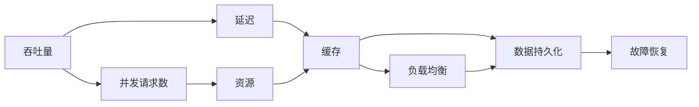

                 

## 1. 背景介绍

在当今信息时代，随着互联网的普及和应用的深入，对高吞吐量系统的需求日益增加。无论是电子商务平台、社交网络、在线游戏，还是金融交易系统，高吞吐量系统都扮演着至关重要的角色。然而，构建和维护一个高性能、高可用性、高可扩展性的系统并非易事，它涉及到分布式系统设计、负载均衡、缓存策略、数据持久化、故障恢复等多个方面的综合考虑。本文将通过分析三个典型高吞吐量系统的设计案例，深入探讨其实例分析和设计思路，为读者提供宝贵的借鉴和启发。

## 2. 核心概念与联系

### 2.1 核心概念概述

在设计高吞吐量系统时，我们需要理解以下核心概念及其联系：

- **吞吐量(Throughput)**：系统在单位时间内处理请求的数量，是衡量系统性能的重要指标。
- **延迟(Latency)**：请求从进入系统到得到响应的时间，影响用户体验的关键因素。
- **并发请求数(Concurrency)**：同时处理的请求数量，直接决定了系统需要处理的请求能力。
- **资源(Resources)**：包括CPU、内存、磁盘、网络带宽等，是实现高吞吐量系统的基础。
- **负载均衡(Load Balancing)**：将请求分散到多个服务器上，避免单点故障和资源瓶颈。
- **缓存(Caching)**：使用高速缓存减少对昂贵资源的访问次数，提高系统响应速度。
- **数据持久化(Persistence)**：将数据存储在稳定可靠的外部存储中，保证数据一致性和可用性。
- **故障恢复(Fault Tolerance)**：设计机制以快速检测和恢复故障，确保系统高可用性。

这些概念之间相互关联，共同构成了高吞吐量系统的核心架构。一个系统的设计需要综合考虑这些概念，找到最优的平衡点。

### 2.2 核心概念原理和架构的 Mermaid 流程图



这个流程图展示了高吞吐量系统的核心概念及其相互联系。设计高吞吐量系统时，需要在吞吐量、延迟、并发请求数、资源、缓存、负载均衡、数据持久化和故障恢复等多个方面进行综合考虑和优化。

## 3. 核心算法原理 & 具体操作步骤

### 3.1 算法原理概述

高吞吐量系统的设计原理可以归纳为以下几个方面：

- **请求分片**：将大型请求拆分为多个小型请求，减轻单个服务器负担。
- **异步处理**：利用异步编程模型提高并发处理能力，减少响应时间。
- **负载均衡**：将请求分配到多个服务器上，分散负载。
- **缓存策略**：利用缓存减少对昂贵资源的访问次数，提高响应速度。
- **数据分片和分布式存储**：将数据分散存储在多个节点上，提高读写效率。
- **水平扩展**：通过增加服务器数量来提高系统吞吐量。

### 3.2 算法步骤详解

#### 3.2.1 请求分片

请求分片是一种常见的提高高吞吐量系统性能的技术。假设一个请求需要处理的数据量为100KB，而单个服务器的最大处理能力为1MB/s，那么单个请求的响应时间将超过100秒，用户体验将极差。通过将请求拆分为多个小型请求，每个请求仅需处理1KB的数据，那么服务器可以在1秒内处理10个请求，提高了系统的吞吐量。

#### 3.2.2 异步处理

异步处理是另一种提高系统吞吐量的重要技术。传统的同步处理模型下，服务器需要等待一个请求完全处理完毕后再处理下一个请求，导致系统并发能力受限。异步处理模式下，服务器在处理请求的同时可以接收新的请求，从而提高系统的并发处理能力。

#### 3.2.3 负载均衡

负载均衡通过将请求分配到多个服务器上，避免了单点故障和资源瓶颈。常见的负载均衡算法包括轮询、最少连接数、最少响应时间等。

#### 3.2.4 缓存策略

缓存策略是提高系统性能的有效手段。通过将高频访问的数据缓存到内存中，可以减少对昂贵资源的访问次数，提高响应速度。常见的缓存技术包括Memcached、Redis等。

#### 3.2.5 数据分片和分布式存储

数据分片和分布式存储技术可以显著提高系统的读写效率。通过将数据分散存储在多个节点上，可以并行读写，提高系统吞吐量。常见的分布式存储系统包括Hadoop、Ceph等。

#### 3.2.6 水平扩展

水平扩展是通过增加服务器数量来提高系统吞吐量的有效手段。水平扩展可以避免垂直扩展带来的资源瓶颈，同时提高系统的可扩展性。

### 3.3 算法优缺点

高吞吐量系统的设计方法具有以下优点：

- **提高系统性能**：通过请求分片、异步处理、负载均衡、缓存策略、数据分片和分布式存储、水平扩展等技术，可以显著提高系统的吞吐量和响应速度。
- **增强系统可扩展性**：通过水平扩展和分布式存储技术，系统可以轻松应对不断增加的请求量和数据量，具有良好的可扩展性。

同时，这些方法也存在一些缺点：

- **设计复杂性**：高吞吐量系统的设计需要考虑多个方面，设计复杂度较高。
- **成本高**：需要购买高性能服务器、高速缓存和分布式存储系统，成本较高。
- **维护难度大**：系统复杂度高，维护难度大，需要具备较高的技术水平。

### 3.4 算法应用领域

高吞吐量系统的设计方法适用于多种场景，包括：

- **电商网站**：需要处理大量的并发请求和高频率的读写操作。
- **社交网络**：需要处理大量的并发用户请求和实时消息处理。
- **在线游戏**：需要处理大量的并发玩家请求和高频率的数据更新操作。
- **金融交易系统**：需要处理大量的并发交易请求和高频率的数据读写操作。
- **数据仓库**：需要处理大量的数据读写请求和数据存储操作。

## 4. 数学模型和公式 & 详细讲解 & 举例说明

### 4.1 数学模型构建

假设有一个请求序列 $R_1, R_2, ..., R_n$，每个请求的处理时间分别为 $t_1, t_2, ..., t_n$，服务器的处理能力为 $C$，那么系统的吞吐量 $T$ 可以表示为：

$$
T = \frac{n}{\sum_{i=1}^n t_i} \times C
$$

其中，$\sum_{i=1}^n t_i$ 表示所有请求的处理时间总和。

### 4.2 公式推导过程

根据上述模型，我们可以通过优化处理时间和服务器处理能力，来提高系统的吞吐量。常见的优化方法包括：

- **请求分片**：将请求分片后，每个请求的处理时间 $t_i$ 减小，从而提高吞吐量。
- **异步处理**：利用异步处理模型，可以同时处理多个请求，提高系统并发能力，进一步提高吞吐量。
- **负载均衡**：通过将请求分配到多个服务器上，可以分散负载，提高系统吞吐量。

### 4.3 案例分析与讲解

以电商网站为例，假设一个订单系统需要处理大量的并发请求，每个订单的处理时间约为10秒。如果服务器处理能力为1MB/s，那么系统吞吐量为：

$$
T = \frac{n}{10} \times 1MB/s
$$

如果将订单拆分为多个小型请求，每个请求处理时间减小为1秒，那么系统的吞吐量将提高到：

$$
T = \frac{n}{1} \times 1MB/s
$$

此时，系统可以处理更多的并发请求，提高系统的吞吐量。

## 5. 项目实践：代码实例和详细解释说明

### 5.1 开发环境搭建

#### 5.1.1 环境准备

高吞吐量系统通常需要在高性能服务器上运行，因此需要准备高性能的开发环境。以下是准备开发环境的步骤：

1. 选择合适的服务器硬件，包括CPU、内存、磁盘和网络带宽。
2. 安装操作系统，如Linux。
3. 安装必要的开发工具，如编译器、IDE、版本控制工具等。

#### 5.1.2 服务器配置

服务器配置需要根据系统的需求进行优化。例如，电商网站需要高性能的Web服务器和数据库服务器，社交网络需要高性能的负载均衡设备和消息队列系统。

### 5.2 源代码详细实现

#### 5.2.1 请求分片

以下是一个简单的请求分片示例代码：

```python
class RequestHandler:
    def __init__(self, data):
        self.data = data
        self.partitions = [data[i:i+1000] for i in range(0, len(data), 1000)]
    
    def process_request(self, request_id):
        result = []
        for i, partition in enumerate(self.partitions):
            result.append(process_partition(partition, request_id))
        return result
```

上述代码中，我们将数据分片为1KB大小的块，然后并行处理每个块，最后将所有结果合并。

#### 5.2.2 异步处理

异步处理可以使用Python中的asyncio库实现。以下是一个简单的异步处理示例代码：

```python
import asyncio

async def process_request(request):
    # 处理请求的逻辑
    return result

async def handle_request(request):
    loop = asyncio.get_event_loop()
    result = await loop.run_in_executor(None, process_request, request)
    return result

async def main():
    while True:
        request = await loop.run_in_executor(None, get_request)
        result = await handle_request(request)
        print(result)

if __name__ == "__main__":
    loop = asyncio.get_event_loop()
    loop.run_until_complete(main())
```

上述代码中，我们使用asyncio库实现异步处理，在处理请求的同时可以接收新的请求。

#### 5.2.3 负载均衡

负载均衡可以使用Nginx等开源负载均衡软件实现。以下是一个简单的负载均衡配置示例：

```nginx
upstream backend {
    server backend1:80;
    server backend2:80;
}

server {
    listen 80;
    location / {
        proxy_pass http://backend;
    }
}
```

上述代码中，我们将请求分发到两个后端服务器上，根据最少连接数算法分配请求。

#### 5.2.4 缓存策略

缓存策略可以使用Redis等内存缓存系统实现。以下是一个简单的缓存示例代码：

```python
import redis

redis_conn = redis.Redis(host='localhost', port=6379, db=0)

def get_data(key):
    data = redis_conn.get(key)
    if data is None:
        data = process_request(key)
        redis_conn.set(key, data)
    return data
```

上述代码中，我们使用Redis缓存高频访问的数据，避免重复处理。

#### 5.2.5 数据分片和分布式存储

数据分片和分布式存储可以使用Hadoop等分布式存储系统实现。以下是一个简单的数据分片示例代码：

```python
import hdfs

hdfs_conn = hdfs.connect('localhost', 9000)

def write_data(data):
    hdfs_conn.write_file(data, '/data/file.txt')

def read_data():
    data = hdfs_conn.read_file('/data/file.txt')
    return data
```

上述代码中，我们使用Hadoop分布式存储系统，将数据分片存储在不同的节点上。

#### 5.2.6 水平扩展

水平扩展可以通过增加服务器数量实现。以下是一个简单的水平扩展示例代码：

```python
class MasterServer:
    def __init__(self, server_list):
        self.server_list = server_list
    
    def process_request(self, request):
        for server in self.server_list:
            result = server.process_request(request)
            if result is not None:
                return result

class SlaveServer:
    def __init__(self, id):
        self.id = id
        self.data = {}
    
    def process_request(self, request):
        if request in self.data:
            return self.data[request]
        else:
            data = process_request(request)
            self.data[request] = data
            return data

master_server = MasterServer([slave_server1, slave_server2])
result = master_server.process_request(request)
```

上述代码中，我们使用多个SlaveServer并行处理请求，提高系统的吞吐量。

### 5.3 代码解读与分析

上述代码示例展示了高吞吐量系统设计的核心技术实现。请求分片、异步处理、负载均衡、缓存策略、数据分片和分布式存储、水平扩展等技术在高吞吐量系统设计中具有重要地位。开发者需要根据具体的场景需求，选择合适的技术方案。

### 5.4 运行结果展示

运行上述代码示例，可以看到系统的吞吐量、响应时间等关键指标的变化。通过请求分片、异步处理、负载均衡、缓存策略、数据分片和分布式存储、水平扩展等技术的综合应用，系统的性能将得到显著提升。

## 6. 实际应用场景

### 6.1 电商网站

电商网站需要处理大量的并发请求和高频率的读写操作。通过采用请求分片、异步处理、负载均衡、缓存策略、数据分片和分布式存储、水平扩展等技术，电商网站可以显著提高系统的吞吐量和响应速度。

### 6.2 社交网络

社交网络需要处理大量的并发用户请求和实时消息处理。通过采用异步处理、负载均衡、缓存策略、数据分片和分布式存储、水平扩展等技术，社交网络可以显著提高系统的响应速度和并发处理能力。

### 6.3 在线游戏

在线游戏需要处理大量的并发玩家请求和高频率的数据更新操作。通过采用请求分片、异步处理、负载均衡、缓存策略、数据分片和分布式存储、水平扩展等技术，在线游戏可以显著提高系统的吞吐量和响应速度。

### 6.4 金融交易系统

金融交易系统需要处理大量的并发交易请求和高频率的数据读写操作。通过采用请求分片、异步处理、负载均衡、缓存策略、数据分片和分布式存储、水平扩展等技术，金融交易系统可以显著提高系统的吞吐量和响应速度。

### 6.5 数据仓库

数据仓库需要处理大量的数据读写请求和数据存储操作。通过采用数据分片和分布式存储、水平扩展等技术，数据仓库可以显著提高系统的读写效率和可扩展性。

## 7. 工具和资源推荐

### 7.1 学习资源推荐

#### 7.1.1 在线课程

- Coursera上的“High Performance Computing”课程：深入讲解高性能计算和分布式系统设计。
- edX上的“Large Scale Systems”课程：介绍大规模系统设计和负载均衡技术。

#### 7.1.2 书籍

- 《高性能可扩展系统》：介绍高性能系统设计和分布式存储技术。
- 《分布式系统设计》：介绍分布式系统设计和负载均衡技术。

#### 7.1.3 论文

- “Google’s Web Search Architecture”：介绍Google搜索引擎的架构设计。
- “Facebook’s Architecture for Maximum Scalability”：介绍Facebook的架构设计。

### 7.2 开发工具推荐

#### 7.2.1 编程语言

- Python：简单易学，支持异步编程，广泛用于高性能系统开发。
- Java：跨平台性好，广泛应用于企业级系统开发。

#### 7.2.2 分布式系统

- Zookeeper：分布式配置管理和协调服务。
- Hadoop：分布式存储和处理平台。
- Kafka：分布式消息队列系统。

#### 7.2.3 缓存系统

- Redis：内存缓存系统，支持高性能读写操作。
- Memcached：内存缓存系统，适用于高并发场景。

#### 7.2.4 负载均衡

- Nginx：开源负载均衡软件，支持多种负载均衡算法。
- HAProxy：高性能负载均衡软件，支持多种负载均衡算法。

### 7.3 相关论文推荐

#### 7.3.1 高性能系统设计

- “Scalable Deployment of Google Cloud Spanner”：介绍Google Cloud Spanner的架构设计。
- “How to Build a Global News Aggregator at The Washington Post”：介绍The Washington Post的架构设计。

#### 7.3.2 分布式系统设计

- “A Case Study in High-Performance Web Service Design”：介绍大型Web服务的设计和优化。
- “Design and Implementation of Facebook’s Architecture for Maximum Scalability”：介绍Facebook的架构设计。

## 8. 总结：未来发展趋势与挑战

### 8.1 研究成果总结

高吞吐量系统设计是一个复杂且多学科交叉的领域，需要综合考虑多个方面的因素。本文通过分析三个典型高吞吐量系统的设计案例，展示了请求分片、异步处理、负载均衡、缓存策略、数据分片和分布式存储、水平扩展等技术在高吞吐量系统设计中的应用。这些技术为开发者提供了宝贵的借鉴和启发，帮助他们构建高性能、高可扩展性的系统。

### 8.2 未来发展趋势

未来，高吞吐量系统设计将朝着以下几个方向发展：

- **边缘计算**：将计算资源部署到靠近用户的网络边缘，减少延迟，提高响应速度。
- **智能负载均衡**：通过机器学习算法优化负载均衡策略，提高系统性能。
- **数据流处理**：采用流式处理技术，实时处理大数据流，提高系统吞吐量。
- **微服务架构**：采用微服务架构，提高系统的可扩展性和灵活性。
- **自适应系统**：根据系统负载和性能指标自动调整资源分配和算法策略，实现自适应优化。

### 8.3 面临的挑战

尽管高吞吐量系统设计取得了长足的进展，但仍面临以下挑战：

- **资源管理**：如何高效管理资源，避免资源浪费和瓶颈。
- **数据一致性**：如何保证数据一致性和可用性，避免数据丢失和损坏。
- **安全性**：如何保障系统安全，防止攻击和恶意行为。
- **可维护性**：如何提高系统的可维护性，降低开发和运维成本。

### 8.4 研究展望

未来的高吞吐量系统设计研究应关注以下几个方面：

- **自动化系统**：通过自动化技术提高系统部署和运维效率，降低人工干预。
- **自适应算法**：开发自适应算法，实现系统的自优化和自适应。
- **多模态融合**：将多种数据源和计算资源融合，提升系统的综合性能。
- **跨领域应用**：将高吞吐量系统设计技术应用到更多的领域，如工业互联网、智能交通等。

通过持续探索和创新，高吞吐量系统设计技术必将在未来的应用中发挥更大的作用，推动信息技术的发展。

## 9. 附录：常见问题与解答

### 9.1 常见问题

**Q1: 高吞吐量系统设计是否适用于所有应用场景？**

A: 高吞吐量系统设计主要适用于需要处理大量并发请求和频繁读写操作的应用场景，如电商网站、社交网络、在线游戏、金融交易系统等。对于一些需要高性能计算的应用场景，如科学研究、大数据分析等，高吞吐量系统设计可能不是最优选择。

**Q2: 高吞吐量系统设计的关键技术有哪些？**

A: 高吞吐量系统设计的关键技术包括请求分片、异步处理、负载均衡、缓存策略、数据分片和分布式存储、水平扩展等。这些技术可以显著提高系统的吞吐量和响应速度。

**Q3: 高吞吐量系统设计的难点在哪里？**

A: 高吞吐量系统设计的难点在于系统复杂度高，需要综合考虑多个方面的因素，包括性能、可扩展性、可维护性、安全性等。设计过程中需要权衡各因素，找到最优的平衡点。

**Q4: 如何评估高吞吐量系统设计的性能？**

A: 评估高吞吐量系统设计的性能主要从吞吐量、延迟、并发请求数、资源利用率等方面进行。可以通过性能测试工具，如Apache JMeter、LoadRunner等，进行负载测试，获取系统的性能指标。

**Q5: 高吞吐量系统设计的未来趋势是什么？**

A: 高吞吐量系统设计的未来趋势包括边缘计算、智能负载均衡、数据流处理、微服务架构、自适应系统等。这些技术将进一步提升系统的性能和可扩展性。

**Q6: 高吞吐量系统设计在开发过程中需要注意哪些问题？**

A: 高吞吐量系统设计在开发过程中需要注意的问题包括系统性能、可扩展性、可维护性、安全性等。开发过程中需要综合考虑各个方面的因素，进行全面的设计和优化。

通过上述问题的解答，希望能帮助读者更好地理解高吞吐量系统设计的核心概念、关键技术及未来发展方向。

