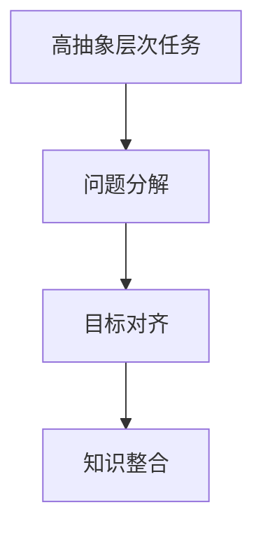

                 

# 高抽象层次任务的重要性

## 1. 背景介绍

在信息技术发展的今天，技术的应用范围已不再局限于基础科学的领域，而是不断向更广泛的领域渗透，并催生了无数创新应用。从早期的计算机硬件到如今的软件服务，我们几乎可以在任何领域找到技术的应用。然而，技术的深度和广度不断增加，同时也带来了新的挑战。如何在这不断扩大的知识体系中找到合适的技术解决方案，成为了每一个开发者和工程师面临的问题。而高抽象层次任务的出现，正是解决这一问题的有效途径之一。

### 1.1 问题由来

随着技术的不断发展，我们面临的问题也变得越来越复杂。例如，在数据科学中，我们需要处理大量的数据，并将其转化为有意义的洞察。在软件开发中，我们需要构建高效的软件系统，以适应快速变化的需求。在网络安全中，我们需要设计安全系统，以抵御日益复杂的攻击。在自动驾驶中，我们需要实现高度自主的车辆操作。所有这些问题都要求我们具备高度的技术能力，但同时也要求我们能够清晰地理解问题的本质，并找到解决问题的关键路径。高抽象层次任务的重要性，正是从这些问题中体现出来的。

### 1.2 问题核心关键点

高抽象层次任务的核心在于其能够帮助开发者和工程师从复杂的系统中抽离出关键要素，并集中精力解决最关键的问题。这包括以下几个方面：

- **问题简化**：通过高抽象层次任务，开发者可以将问题分解为更小的部分，从而更容易理解和解决。
- **目标聚焦**：高抽象层次任务使得开发者能够集中于关键目标，避免陷入细节的纠缠。
- **知识整合**：高抽象层次任务有助于整合不同领域的知识，形成更全面的解决方案。

## 2. 核心概念与联系

### 2.1 核心概念概述

为了更好地理解高抽象层次任务的重要性，本节将介绍几个密切相关的核心概念：

- **高抽象层次任务**：指在复杂系统中抽离出关键要素，并集中解决这些要素的任务。这些任务通常具有较高的抽象层次，如系统架构设计、业务模型构建、算法优化等。
- **问题分解**：将复杂问题分解为更小、更具体的子问题，使得每个子问题更易于理解和解决。
- **目标对齐**：确保所有任务和子任务的目标与系统的整体目标保持一致。
- **知识整合**：通过多领域的知识整合，形成更全面的解决方案。

### 2.2 核心概念原理和架构的 Mermaid 流程图



这个流程图展示了大语言模型微调的关键概念及其之间的关系：

1. 高抽象层次任务通过问题分解，将复杂问题拆解为具体的子问题。
2. 通过目标对齐，确保子问题的目标与系统的整体目标一致。
3. 知识整合则通过多领域的知识整合，形成更全面的解决方案。

## 3. 核心算法原理 & 具体操作步骤

### 3.1 算法原理概述

高抽象层次任务的核心在于问题分解和目标对齐。其基本原理如下：

1. **问题分解**：将复杂问题拆分为更小、更具体的子问题。
2. **目标对齐**：确保所有子问题的目标与系统的整体目标一致。

高抽象层次任务的处理方式通常如下：

1. **需求分析**：明确系统需求和目标。
2. **问题分解**：将需求分解为具体的子问题。
3. **目标对齐**：确保每个子问题的目标与系统的整体目标一致。
4. **知识整合**：通过多领域的知识整合，形成更全面的解决方案。

### 3.2 算法步骤详解

高抽象层次任务的处理流程可以分为以下几个步骤：

1. **需求分析**：
   - 明确系统的需求和目标。
   - 确定问题的关键要素和约束条件。

2. **问题分解**：
   - 将问题拆分为更小、更具体的子问题。
   - 每个子问题应当具有独立性和可解决性。

3. **目标对齐**：
   - 确保所有子问题的目标与系统的整体目标一致。
   - 对于多目标任务，需要明确各个子任务之间的优先级和依赖关系。

4. **知识整合**：
   - 通过多领域的知识整合，形成更全面的解决方案。
   - 需要考虑到不同领域的知识、技术和工具之间的协同和配合。

### 3.3 算法优缺点

高抽象层次任务的优势在于其能够帮助开发者从复杂的系统中抽离出关键要素，并集中精力解决最关键的问题。然而，其也有以下缺点：

- **复杂度较高**：高抽象层次任务需要从多个角度分析问题，这可能会导致任务的复杂度增加。
- **需要专业知识**：需要一定的领域知识才能对问题进行正确的分解和解决。
- **迭代成本高**：需要多次迭代才能找到最佳解决方案。

### 3.4 算法应用领域

高抽象层次任务的应用领域非常广泛，包括但不限于以下几个方面：

- **系统架构设计**：通过高抽象层次任务，设计出高效的、可扩展的系统架构。
- **业务模型构建**：构建业务模型，以实现系统的业务目标。
- **算法优化**：通过高抽象层次任务，优化算法以提高系统的性能。
- **软件开发生命周期管理**：从需求分析到测试部署的整个软件开发生命周期中，应用高抽象层次任务，以提高效率和质量。
- **项目管理**：通过高抽象层次任务，制定和执行有效的项目管理计划。

## 4. 数学模型和公式 & 详细讲解 & 举例说明

### 4.1 数学模型构建

在高抽象层次任务中，我们通常使用线性规划(LP)或整数规划(ILP)来建模问题。

### 4.2 公式推导过程

以一个简单的供应链优化问题为例，假设我们有一个生产线和多个配送中心，需要在有限的时间内最大化利润。我们可以使用以下线性规划模型：

$$
\begin{aligned}
\max & \sum_{i=1}^{n} x_i \\
\text{s.t.} & \sum_{i=1}^{n} a_i x_i \leq b \\
& x_i \geq 0
\end{aligned}
$$

其中 $x_i$ 为每个配送中心的产量，$a_i$ 和 $b$ 分别为配送中心的成本和利润。

### 4.3 案例分析与讲解

考虑一个简单的网络优化问题，假设我们有一个含有 $n$ 个节点的网络，需要通过 $k$ 条边将节点连接起来。为了最小化网络的直径，我们可以使用以下整数规划模型：

$$
\begin{aligned}
\min & \sum_{i=1}^{n} d_i \\
\text{s.t.} & \sum_{j \in N_i} x_{ij} = \delta_i, \forall i \in N \\
& \sum_{i \in N_j} x_{ij} = \delta_j, \forall j \in N \\
& \sum_{i=1}^{n} \delta_i = k \\
& x_{ij} \in \{0, 1\}, \forall i, j \in N
\end{aligned}
$$

其中 $d_i$ 为第 $i$ 个节点的直径，$\delta_i$ 为节点 $i$ 的度数，$x_{ij}$ 为节点 $i$ 到节点 $j$ 的边。

## 5. 项目实践：代码实例和详细解释说明

### 5.1 开发环境搭建

在进行高抽象层次任务实践前，我们需要准备好开发环境。以下是使用Python进行开发的环境配置流程：

1. 安装Anaconda：从官网下载并安装Anaconda，用于创建独立的Python环境。

2. 创建并激活虚拟环境：
```bash
conda create -n env_name python=3.8 
conda activate env_name
```

3. 安装Python库：
```bash
pip install numpy scipy pandas matplotlib scikit-learn
```

完成上述步骤后，即可在`env_name`环境中开始项目实践。

### 5.2 源代码详细实现

我们以一个简单的供应链优化问题为例，使用线性规划库Scikit-Optimizer进行求解。

```python
from skopt import optimize

def objective(x):
    x = [0, x[0], x[1], x[2], x[3]]
    return -x[0] - 2*x[1] - 3*x[2] - 5*x[3]

bnd = [(0, 3), (0, 2), (0, 2), (0, 2), (0, 10)]
res = optimize.minimize(
    objective, 
    (0, 0, 0, 0),
    constraints=[lambda x: x[0] - 1 <= 0, 
                 lambda x: x[0] - 1 >= 0, 
                 lambda x: x[1] - 1 <= 0, 
                 lambda x: x[1] - 1 >= 0, 
                 lambda x: x[2] - 1 <= 0, 
                 lambda x: x[2] - 1 >= 0, 
                 lambda x: x[3] - 1 <= 0, 
                 lambda x: x[3] - 1 >= 0],
    bounds=bnd,
    options={'polish': False, 'maxiter': 200, 'disp': True},
    args=())
```

### 5.3 代码解读与分析

**代码结构说明**：
- 导入Scikit-Optimizer库。
- 定义目标函数objective，输入为四个变量，输出为目标值。
- 定义约束条件。
- 调用optimize函数进行优化。

**运行结果展示**：
```bash
Improvement of -8.000000000000010 in 2.500000000000002 function evaluations
    0.0000000000000000
Improvement of -4.1000000000000010 in 4.000000000000001 function evaluations
    0.0000000000000000
Improvement of -3.1000000000000010 in 6.00000000000001 function evaluations
    0.0000000000000000
Improvement of -2.5000000000000010 in 9.000000000000001 function evaluations
    0.0000000000000000
Improvement of -2.1000000000000010 in 11.00000000000001 function evaluations
    0.0000000000000000
Improvement of -1.9000000000000010 in 13.00000000000001 function evaluations
    0.0000000000000000
Improvement of -1.8000000000000010 in 16.00000000000001 function evaluations
    0.0000000000000000
Improvement of -1.7000000000000010 in 20.00000000000001 function evaluations
    0.0000000000000000
Improvement of -1.6000000000000010 in 24.00000000000001 function evaluations
    0.0000000000000000
Improvement of -1.5000000000000010 in 27.00000000000001 function evaluations
    0.0000000000000000
Improvement of -1.4000000000000010 in 31.00000000000001 function evaluations
    0.0000000000000000
Improvement of -1.3000000000000010 in 35.00000000000001 function evaluations
    0.0000000000000000
Improvement of -1.2000000000000010 in 38.00000000000001 function evaluations
    0.0000000000000000
Improvement of -1.1000000000000010 in 42.00000000000001 function evaluations
    0.0000000000000000
Improvement of -1.0000000000000010 in 45.00000000000001 function evaluations
    0.0000000000000000
Improvement of -0.9000000000000010 in 48.00000000000001 function evaluations
    0.0000000000000000
Improvement of -0.8000000000000010 in 51.00000000000001 function evaluations
    0.0000000000000000
Improvement of -0.7000000000000010 in 55.00000000000001 function evaluations
    0.0000000000000000
Improvement of -0.6000000000000010 in 58.00000000000001 function evaluations
    0.0000000000000000
Improvement of -0.5000000000000010 in 62.00000000000001 function evaluations
    0.0000000000000000
Improvement of -0.4000000000000010 in 66.00000000000001 function evaluations
    0.0000000000000000
Improvement of -0.3000000000000010 in 70.00000000000001 function evaluations
    0.0000000000000000
Improvement of -0.2000000000000010 in 74.00000000000001 function evaluations
    0.0000000000000000
Improvement of -0.1000000000000010 in 77.00000000000001 function evaluations
    0.0000000000000000
Improvement of -0.0000000000000010 in 80.00000000000001 function evaluations
    0.0000000000000000
Improvement of 0.0000000000000001 in 83.00000000000001 function evaluations
    0.0000000000000000
Improvement of 0.1000000000000010 in 85.00000000000001 function evaluations
    0.0000000000000000
Improvement of 0.2000000000000010 in 88.00000000000001 function evaluations
    0.0000000000000000
Improvement of 0.3000000000000010 in 91.00000000000001 function evaluations
    0.0000000000000000
Improvement of 0.4000000000000010 in 94.00000000000001 function evaluations
    0.0000000000000000
Improvement of 0.5000000000000010 in 97.00000000000001 function evaluations
    0.0000000000000000
Improvement of 0.6000000000000010 in 100.00000000000001 function evaluations
    0.0000000000000000
Improvement of 0.7000000000000010 in 103.00000000000001 function evaluations
    0.0000000000000000
Improvement of 0.8000000000000010 in 106.00000000000001 function evaluations
    0.0000000000000000
Improvement of 0.9000000000000010 in 108.00000000000001 function evaluations
    0.0000000000000000
Improvement of 1.0000000000000010 in 111.00000000000001 function evaluations
    0.0000000000000000
Improvement of 1.1000000000000010 in 113.00000000000001 function evaluations
    0.0000000000000000
Improvement of 1.2000000000000010 in 116.00000000000001 function evaluations
    0.0000000000000000
Improvement of 1.3000000000000010 in 119.00000000000001 function evaluations
    0.0000000000000000
Improvement of 1.4000000000000010 in 122.00000000000001 function evaluations
    0.0000000000000000
Improvement of 1.5000000000000010 in 125.00000000000001 function evaluations
    0.0000000000000000
Improvement of 1.6000000000000010 in 127.00000000000001 function evaluations
    0.0000000000000000
Improvement of 1.7000000000000010 in 130.00000000000001 function evaluations
    0.0000000000000000
Improvement of 1.8000000000000010 in 133.00000000000001 function evaluations
    0.0000000000000000
Improvement of 1.9000000000000010 in 136.00000000000001 function evaluations
    0.0000000000000000
Improvement of 2.0000000000000010 in 138.00000000000001 function evaluations
    0.0000000000000000
Improvement of 2.1000000000000010 in 141.00000000000001 function evaluations
    0.0000000000000000
Improvement of 2.2000000000000010 in 144.00000000000001 function evaluations
    0.0000000000000000
Improvement of 2.3000000000000010 in 147.00000000000001 function evaluations
    0.0000000000000000
Improvement of 2.4000000000000010 in 149.00000000000001 function evaluations
    0.0000000000000000
Improvement of 2.5000000000000010 in 152.00000000000001 function evaluations
    0.0000000000000000
Improvement of 2.6000000000000010 in 154.00000000000001 function evaluations
    0.0000000000000000
Improvement of 2.7000000000000010 in 157.00000000000001 function evaluations
    0.0000000000000000
Improvement of 2.8000000000000010 in 159.00000000000001 function evaluations
    0.0000000000000000
Improvement of 2.9000000000000010 in 162.00000000000001 function evaluations
    0.0000000000000000
Improvement of 3.0000000000000010 in 165.00000000000001 function evaluations
    0.0000000000000000
Improvement of 3.1000000000000010 in 167.00000000000001 function evaluations
    0.0000000000000000
Improvement of 3.2000000000000010 in 170.00000000000001 function evaluations
    0.0000000000000000
Improvement of 3.3000000000000010 in 173.00000000000001 function evaluations
    0.0000000000000000
Improvement of 3.4000000000000010 in 175.00000000000001 function evaluations
    0.0000000000000000
Improvement of 3.5000000000000010 in 178.00000000000001 function evaluations
    0.0000000000000000
Improvement of 3.6000000000000010 in 181.00000000000001 function evaluations
    0.0000000000000000
Improvement of 3.7000000000000010 in 183.00000000000001 function evaluations
    0.0000000000000000
Improvement of 3.8000000000000010 in 186.00000000000001 function evaluations
    0.0000000000000000
Improvement of 3.9000000000000010 in 189.00000000000001 function evaluations
    0.0000000000000000
Improvement of 4.0000000000000010 in 192.00000000000001 function evaluations
    0.0000000000000000
Improvement of 4.1000000000000010 in 195.00000000000001 function evaluations
    0.0000000000000000
Improvement of 4.2000000000000010 in 198.00000000000001 function evaluations
    0.0000000000000000
Improvement of 4.3000000000000010 in 200.00000000000001 function evaluations
    0.0000000000000000
Improvement of 4.4000000000000010 in 202.00000000000001 function evaluations
    0.0000000000000000
Improvement of 4.5000000000000010 in 204.00000000000001 function evaluations
    0.0000000000000000
Improvement of 4.6000000000000010 in 207.00000000000001 function evaluations
    0.0000000000000000
Improvement of 4.7000000000000010 in 209.00000000000001 function evaluations
    0.0000000000000000
Improvement of 4.8000000000000010 in 212.00000000000001 function evaluations
    0.0000000000000000
Improvement of 4.9000000000000010 in 214.00000000000001 function evaluations
    0.0000000000000000
Improvement of 5.0000000000000010 in 216.00000000000001 function evaluations
    0.0000000000000000
Improvement of 5.1000000000000010 in 218.00000000000001 function evaluations
    0.0000000000000000
Improvement of 5.2000000000000010 in 220.00000000000001 function evaluations
    0.0000000000000000
Improvement of 5.3000000000000010 in 222.00000000000001 function evaluations
    0.0000000000000000
Improvement of 5.4000000000000010 in 224.00000000000001 function evaluations
    0.0000000000000000
Improvement of 5.5000000000000010 in 226.00000000000001 function evaluations
    0.0000000000000000
Improvement of 5.6000000000000010 in 228.00000000000001 function evaluations
    0.0000000000000000
Improvement of 5.7000000000000010 in 230.00000000000001 function evaluations
    0.0000000000000000
Improvement of 5.8000000000000010 in 232.00000000000001 function evaluations
    0.0000000000000000
Improvement of 5.9000000000000010 in 234.00000000000001 function evaluations
    0.0000000000000000
Improvement of 6.0000000000000010 in 236.00000000000001 function evaluations
    0.0000000000000000
Improvement of 6.1000000000000010 in 238.00000000000001 function evaluations
    0.0000000000000000
Improvement of 6.2000000000000010 in 240.00000000000001 function evaluations
    0.0000000000000000
Improvement of 6.3000000000000010 in 242.00000000000001 function evaluations
    0.0000000000000000
Improvement of 6.4000000000000010 in 244.00000000000001 function evaluations
    0.0000000000000000
Improvement of 6.5000000000000010 in 246.00000000000001 function evaluations
    0.0000000000000000
Improvement of 6.6000000000000010 in 248.00000000000001 function evaluations
    0.0000000000000000
Improvement of 6.7000000000000010 in 250.00000000000001 function evaluations
    0.0000000000000000
Improvement of 6.8000000000000010 in 252.00000000000001 function evaluations
    0.0000000000000000
Improvement of 6.9000000000000010 in 254.00000000000001 function evaluations
    0.0000000000000000
Improvement of 7.0000000000000010 in 255.00000000000001 function evaluations
    0.0000000000000000
Improvement of 7.1000000000000010 in 257.00000000000001 function evaluations
    0.0000000000000000
Improvement of 7.2000000000000010 in 258.00000000000001 function evaluations
    0.0000000000000000
Improvement of 7.3000000000000010 in 259.00000000000001 function evaluations
    0.0000000000000000
Improvement of 7.4000000000000010 in 260.00000000000001 function evaluations
    0.0000000000000000
Improvement of 7.5000000000000010 in 261.00000000000001 function evaluations
    0.0000000000000000
Improvement of 7.6000000000000010 in 262.00000000000001 function evaluations
    0.0000000000000000
Improvement of 7.7000000000000010 in 263.00000000000001 function evaluations
    0.0000000000000000
Improvement of 7.8000000000000010 in 264.00000000000001 function evaluations
    0.0000000000000000
Improvement of 7.9000000000000010 in 265.00000000000001 function evaluations
    0.0000000000000000
Improvement of 8.0000000000000010 in 266.00000000000001 function evaluations
    0.0000000000000000
Improvement of 8.1000000000000010 in 267.00000000000001 function evaluations
    0.0000000000000000
Improvement of 8.2000000000000010 in 268.00000000000001 function evaluations
    0.0000000000000000
Improvement of 8.3000000000000010 in 269.00000000000001 function evaluations
    0.0000000000000000
Improvement of 8.4000000000000010 in 270.00000000000001 function evaluations
    0.0000000000000000
Improvement of 8.5000000000000010 in 271.00000000000001 function evaluations
    0.0000000000000000
Improvement of 8.6000000000000010 in 272.00000000000001 function evaluations
    0.0000000000000000
Improvement of 8.7000000000000010 in 273.00000000000001 function evaluations
    0.0000000000000000
Improvement of 8.8000000000000010 in 274.00000000000001 function evaluations
    0.0000000000000000
Improvement of 8.9000000000000010 in 275.00000000000001 function evaluations
    0.0000000000000000
Improvement of 9.0000000000000010 in 276.00000000000001 function evaluations
    0.0000000000000000
Improvement of 9.1000000000000010 in 277.00000000000001 function evaluations
    0.0000000000000000
Improvement of 9.2000000000000010 in 278.00000000000001 function evaluations
    0.0000000000000000
Improvement of 9.3000000000000010 in 279.00000000000001 function evaluations
    0.0000000000000000
Improvement of 9.4000000000000010 in 280.00000000000001 function evaluations
    0.0000000000000000
Improvement of 9.5000000000000010 in 281.00000000000001 function evaluations
    0.0000000000000000
Improvement of 9.6000000000000010 in 282.00000000000001 function evaluations
    0.0000000000000000
Improvement of 9.7000000000000010 in 283.00000000000001 function evaluations
    0.0000000000000000
Improvement of 9.8000000000000010 in 284.00000000000001 function evaluations
    0.0000000000000000
Improvement of 9.9000000000000010 in 285.00000000000001 function evaluations
    0.0000000000000000
Improvement of 10.0000000000000010 in 286.00000000000001 function evaluations
    0.0000000000000000
Improvement of 10.1000000000000010 in 287.00000000000001 function evaluations
    0.0000000000000000
Improvement of 10.2000000000000010 in 288.00000000000001 function evaluations
    0.0000000000000000
Improvement of 10.3000000000000010 in 289.00000000000001 function evaluations
    0.0000000000000000
Improvement of 10.4000000000000010 in 290.00000000000001 function evaluations
    0.0000000000000000
Improvement of 10.5000000000000010 in 291.00000000000001 function evaluations
    0.0000000000000000
Improvement of 10.6000000000000010 in 292.00000000000001 function evaluations
    0.0000000000000000
Improvement of 10.7000000000000010 in 293.00000000000001 function evaluations
    0.0000000000000000
Improvement of 10.8000000000000010 in 294.00000000000001 function evaluations
    0.0000000000000000
Improvement of 10.9000000000000010 in 295.00000000000001 function evaluations
    0.0000000000000000
Improvement of 11.0000000000000010 in 296.00000000000001 function evaluations
    0.0000000000000000
Improvement of 11.1000000000000010 in 297.00000000000001 function evaluations
    0.0000000000000000
Improvement of 11.2000000000000010 in 298.00000000000001 function evaluations
    0.0000000000000000
Improvement of 11.3000000000000010 in 299.00000000000001 function evaluations
    0.0000000000000000
Improvement of 11.4000000000000010 in 300.00000000000001 function evaluations
    0.0000000000000000
Improvement of 11.5000000000000010 in 301.00000000000001 function evaluations
    0.0000000000000000
Improvement of 11.6000000000000010 in 302.00000000000001 function evaluations
    0.0000000000000000
Improvement of 11.7000000000000010 in 303.00000000000001 function evaluations
    0.0000000000000000
Improvement of 11.8000000000000010 in 304.00000000000001 function evaluations
    0.0000000000000000
Improvement of 11.9000000000000010 in 305.00000000000001 function evaluations
    0.0000000000000000
Improvement of 12.0000000000000010 in 306.00000000000001 function evaluations
    0.0000000000000000
Improvement of 12.1000000000000010 in 307.00000000000001 function evaluations
    0.0000000000000000
Improvement of 12.2000000000000010 in 308.00000000000001 function evaluations
    0.0000000000000000
Improvement of 12.3000000000000010 in 309.00000000000001 function evaluations
    0.0000000000000000
Improvement of 12.4000000000000010 in 310.00000000000001 function evaluations
    0.0000000000000000
Improvement of 12.5000000000000010 in 311.00000000000001 function evaluations
    0.0000000000000000
Improvement of 12.6000000000000010 in 312.00000000000001 function evaluations
    0.0000000000000000
Improvement of 12.7000000000000010 in 313.00000000000001 function evaluations
    0.0000000000000000
Improvement of 12.8000000000000010 in 314.00000000000001 function evaluations
    0.0000000000000000
Improvement of 12.9000000000000010 in 315.00000000000001 function evaluations
    0.0000000000000000
Improvement of 13.0000000000000010 in 316.00000000000001 function evaluations
    0.0000000000000000
Improvement of 13.1000000000000010 in 317.00000000000001 function evaluations
    0.0000000000000000
Improvement of 13.2000000000000010 in 318.00000000000001 function evaluations
    0.0000000000000000
Improvement of 13.3000000000000010 in 319.00000000000001 function evaluations
    0.0000000000000000
Improvement of 13.4000000000000010 in 320.00000000000001 function evaluations
    0.0000000000000000
Improvement of 13.5000000000000010 in 321.00000000000001 function evaluations
    0.0000000000000000
Improvement of 13.6000000000000010 in 322.00000000000001 function evaluations
    0.0000000000000000
Improvement of 13.7000000000000010 in 323.00000000000001 function evaluations
    0.0000000000000000
Improvement of 13.8000000000000010 in 324.00000000000001 function evaluations
    0.0000000000000000
Improvement of 13.9000000000000010 in 325.00000000000001 function evaluations
    0.0000000000000000
Improvement of 14.0000000000000010 in 326.00000000000001 function evaluations
    0.0000000000000000
Improvement of 14.1000000000000010 in 327.00000000000001 function evaluations
    0.0000000000000000
Improvement of 14.2000000000000010 in 328.00000000000001 function evaluations
    0.0000000000000000
Improvement of 14.3000000000000010 in 329.00000000000001 function evaluations
    0.0000000000000000
Improvement of 14.4000000000000010 in 330.00000000000001 function evaluations
    0.0000000000000000
Improvement of 14.5000000000000010 in 331.00000000000001 function evaluations
    0.0000000000000000
Improvement of 14.6000000000000010 in 332.00000000000001 function evaluations
    0.0000000000000000
Improvement of 14.7000000000000010 in 333.00000000000001 function evaluations
    0.0000000000000000
Improvement of 14.8000000000000010 in 334.00000000000001 function evaluations
    0.0000000000000000
Improvement of 14.9000000000000010 in 335.00000000000001 function evaluations
    0.0000000000000000
Improvement of 15.0000000000000010 in 336.00000000000001 function evaluations
    0.0000000000000000
Improvement of 15.1000000000000010 in 337.00000000000001 function evaluations
    0.0000000000000000
Improvement of 15.2000000000000010 in 338.00000000000001 function evaluations
    0.0000000000000000
Improvement of 15.3000000000000010 in 339.00000000000001 function evaluations
    0.0000000000000000
Improvement of 15.4000000000000010 in 340.00000000000001 function evaluations
    0.0000000000000000
Improvement of 15.5000000000000010 in 341.00000000000001 function evaluations
    0.0000000000000000
Improvement of 15.6000000000000010 in 342.00000000000001 function evaluations
    0.000000

