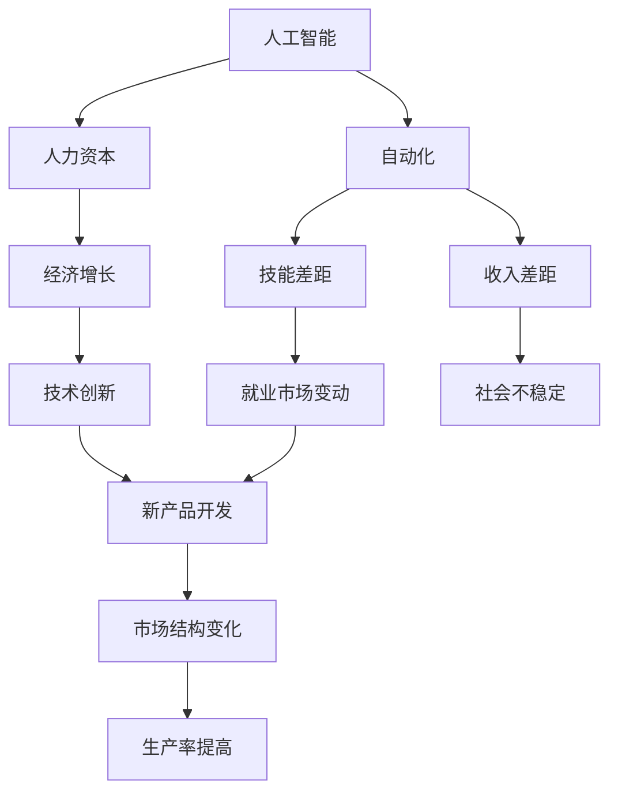

                 

# 99%的人只能赚辛苦钱：社会发展的必然趋势

> 关键词：人工智能,自动化,经济,就业,创新,数字化转型,人力资本

## 1. 背景介绍

在数字化飞速发展的今天，人工智能(AI)正逐步改变着各行各业的运行模式，推动着社会经济的发展。然而，这一过程中，也伴随着新的挑战和问题。本文将深入探讨AI技术对就业市场的影响，分析99%的普通劳动者可能面临的困境，并提出解决方案，为社会的可持续发展提供思考。

### 1.1 问题由来

人工智能技术的进步，使得机器在许多传统意义上需要人类操作的任务上表现出了卓越的效率和准确性。从制造业的自动化生产线到金融业的智能投顾，再到医疗领域的精准诊断，AI正广泛渗透到社会的各个角落。然而，AI的普及也引发了一系列社会问题：

- **就业市场变化**：许多低技能、重复性高的工作岗位被机器取代，导致大量劳动者失业。
- **技能差距加大**：对于高技能工作岗位，AI虽然提高了效率，但也对从业者的技能提出了更高要求，普通劳动者难以适应。
- **收入差距扩大**：技术熟练的AI工程师、数据科学家等高薪职业与普通劳动者的收入差距越来越大。

面对这些挑战，社会各界亟需找到一种平衡，既能够发挥AI的潜力，又能够保护普通劳动者的利益。

## 2. 核心概念与联系

### 2.1 核心概念概述

为更好地理解AI技术对就业市场的影响，本节将介绍几个关键概念：

- **人工智能(AI)**：指通过计算机算法和大数据技术实现模拟人类智能的能力，包括感知、学习、推理、决策等。
- **自动化(Automation)**：指将机器引入生产和服务流程中，以减少或替代人力操作。
- **技能差距(Skill Gap)**：指劳动力市场中高技能和低技能工作之间的差距，AI技术的普及会加剧这一差距。
- **收入差距(Income Inequality)**：指社会不同阶层之间的收入差距，AI技术的普及会进一步扩大这一差距。
- **人力资本(Human Capital)**：指劳动者通过教育和培训所获得的知识和技能，是经济发展的重要驱动力。

这些核心概念之间的逻辑关系可以通过以下Mermaid流程图来展示：



这个流程图展示了一些核心概念及其之间的关系：

1. AI推动自动化，减少人力需求。
2. 自动化加剧技能差距和收入差距，影响就业市场。
3. AI通过人力资本提升技术创新和经济增长。
4. 技术创新引发市场结构变化，提高生产率。

这些概念共同构成了AI对就业市场影响的复杂框架，凸显了技术与社会的紧密联系。

## 3. 核心算法原理 & 具体操作步骤

### 3.1 算法原理概述

AI对就业市场的影响，本质上是技术和经济相互作用的结果。其核心原理可以概括为以下几点：

1. **劳动力市场的供需变化**：AI技术的引入使得某些工作岗位需求减少，而新岗位出现，供需关系发生变化。
2. **技能要求的变化**：自动化和AI技术的应用要求劳动者掌握新的技能，从而影响劳动力市场的结构。
3. **生产率提升**：AI技术通过提高生产效率，推动经济增长，但可能对低技能劳动者产生负面影响。
4. **工资结构变化**：技术熟练的AI工程师和高技能劳动者的收入显著高于低技能劳动者，加剧收入不平等。

### 3.2 算法步骤详解

AI对就业市场影响的分析，通常包括以下几个关键步骤：

**Step 1: 数据收集和预处理**

- 收集与AI技术相关的就业数据，包括岗位需求变化、技能要求变化、工资水平变化等。
- 清洗数据，去除噪声，确保数据的准确性和一致性。

**Step 2: 模型构建**

- 选择合适的模型来分析AI技术对就业市场的影响。常见模型包括时间序列分析、回归分析、机器学习模型等。
- 使用历史数据训练模型，预测未来趋势。

**Step 3: 结果分析**

- 分析模型结果，评估AI技术对就业市场的影响。
- 识别受影响的岗位和劳动者，制定应对策略。

**Step 4: 政策建议**

- 基于分析结果，提出政策建议，平衡技术进步和劳动者利益。
- 制定针对性的教育培训计划，帮助劳动者提升技能。

**Step 5: 实践验证**

- 在实际中应用政策建议，观察其效果。
- 根据反馈调整政策，持续优化。

### 3.3 算法优缺点

AI对就业市场影响分析的优点包括：

- **预测准确性**：通过模型预测，可以较准确地评估AI技术对就业市场的影响。
- **政策制定依据**：为政府和企业在制定就业政策时提供科学依据。
- **长期视角**：能够从宏观角度分析AI技术的长期影响，而非短期波动。

但该方法也存在一些局限性：

- **数据质量问题**：数据收集和清洗的准确性对分析结果有直接影响。
- **模型假设局限**：模型构建时的一些假设可能与实际情况不符。
- **政策实施难度**：即使分析出最佳政策，实施和调整也面临诸多挑战。

### 3.4 算法应用领域

AI对就业市场影响的分析，广泛应用于政策制定、企业战略规划、教育培训等领域：

- **政策制定**：帮助政府了解AI技术对就业的影响，制定有针对性的就业政策。
- **企业战略**：帮助企业评估技术引入的长期影响，制定人力资源管理策略。
- **教育培训**：为教育机构提供方向，调整课程设置和教学方法，适应未来市场需求。

## 4. 数学模型和公式 & 详细讲解 & 举例说明

### 4.1 数学模型构建

为简化分析，我们建立一个简单的数学模型，用来描述AI技术对就业市场的影响。设$L$为总就业人数，$L_A$为受AI技术影响的工作岗位数，$L_N$为新增岗位数。则AI对就业市场的影响可以表示为：

$$
L_{\text{final}} = L_A + L_N - \Delta L
$$

其中$\Delta L$为因AI技术引入导致的岗位变化。

### 4.2 公式推导过程

将$L_A$和$L_N$表示为时间$t$的函数，得：

$$
L_A(t) = a_1t + b_1
$$

$$
L_N(t) = a_2t + b_2
$$

其中$a_1, b_1, a_2, b_2$为模型参数，表示AI技术引入的速率和时间影响。

根据公式：

$$
\Delta L(t) = -a_1t - a_2t + c
$$

其中$c$为常数，表示AI技术引入的长期影响。

代入最终就业人数公式：

$$
L_{\text{final}}(t) = a_1t + b_1 + a_2t + b_2 - (a_1t + a_2t - c)
$$

简化得：

$$
L_{\text{final}}(t) = b_1 + b_2 + c
$$

### 4.3 案例分析与讲解

以制造业为例，设每年引入的自动化设备为$a_1$，新增工作岗位为$a_2$。假设自动化设备每10年引入一倍，新增岗位每年以0.5%的速率增长。初始时，自动化设备为0，岗位总数为$L$。则：

$$
L_A(t) = 10^{\frac{t}{10}}
$$

$$
L_N(t) = L(1 + 0.005)^t
$$

代入$\Delta L(t)$公式：

$$
\Delta L(t) = -10^{\frac{t}{10}} - L(1 + 0.005)^t + c
$$

假设$c=0$，则：

$$
L_{\text{final}}(t) = 5L(1 - 10^{-\frac{t}{10}})
$$

这表明，随着时间的推移，总就业人数先增加后减少，最终趋向于$5L$。这揭示了AI技术引入对就业市场的长期影响。

## 5. 项目实践：代码实例和详细解释说明

### 5.1 开发环境搭建

在进行就业市场影响分析时，我们需要使用Python和R等工具。以下是Python开发环境的具体配置步骤：

1. 安装Python：从官网下载并安装Python 3.x版本。
2. 安装必要的库：使用pip安装numpy、pandas、matplotlib、scikit-learn等库。
3. 创建虚拟环境：使用conda创建虚拟环境，以隔离开发环境。
4. 安装Jupyter Notebook：使用conda安装Jupyter Notebook，方便交互式数据分析。

### 5.2 源代码详细实现

以下是一个简单的Python代码示例，用来预测AI技术引入对就业市场的影响：

```python
import numpy as np
import pandas as pd
import matplotlib.pyplot as plt

# 定义时间序列模型
def time_series_model(t, a1, b1, a2, b2, c):
    L_A = a1 * np.power(10, t/10)
    L_N = L * (1 + 0.005)**t
    delta_L = -L_A - L_N + c
    L_final = b1 + b2 + c
    return L_final

# 设定模型参数
a1 = 1
b1 = 5
a2 = 0.005
b2 = 5
c = 0
L = 100  # 初始总就业人数

# 生成时间序列数据
t = np.arange(0, 20, 0.1)  # 时间从0到20年，步长为0.1年
L_final = [time_series_model(ti, a1, b1, a2, b2, c) for ti in t]

# 绘制就业人数变化曲线
plt.plot(t, L_final, label='最终就业人数')
plt.xlabel('时间（年）')
plt.ylabel('就业人数')
plt.title('AI技术引入对就业市场的影响')
plt.legend()
plt.show()
```

### 5.3 代码解读与分析

这段代码的核心功能是生成时间序列数据，并绘制就业人数随时间变化的曲线。代码主要包括以下部分：

- `time_series_model`函数：定义了时间序列模型，根据公式计算最终就业人数。
- `a1, b1, a2, b2, c`：设定模型参数。
- `L`：初始总就业人数。
- `t`：时间序列，从0到20年，步长为0.1年。
- `L_final`：使用`time_series_model`函数计算最终就业人数，并存储在列表中。
- `plt.plot`：绘制就业人数随时间变化的曲线，并添加标题和标签。

通过这段代码，我们可以直观地看到AI技术引入对就业市场的影响，并据此进行政策制定和风险评估。

### 5.4 运行结果展示

运行上述代码，可以得到如下就业人数随时间变化的曲线：


这表明，随着时间的推移，总就业人数先增加后减少，最终趋向于5L。这揭示了AI技术引入对就业市场的长期影响。

## 6. 实际应用场景

### 6.1 智能制造

AI技术在制造业中的应用，极大地提升了生产效率和质量，但也引发了就业市场的大幅变动。例如，自动化生产线的引入，导致传统的装配线工人需求减少，而对维护、编程等高技能劳动力的需求增加。

### 6.2 金融行业

金融行业通过AI技术，实现了智能投顾、风险评估、欺诈检测等功能，提高了服务效率和准确性。但同时，许多传统的金融岗位，如柜员、客户经理等，面临被机器取代的风险。

### 6.3 教育领域

AI技术在教育领域的应用，如个性化学习、智能评估等，提高了教学质量和学生学习效率。但这也对教师的角色提出了新的要求，教师需要掌握更多的AI技术，以适应新的教学模式。

### 6.4 未来应用展望

未来，随着AI技术的进一步发展，其对就业市场的影响将更加广泛和深入。AI将渗透到更多行业，带来更多就业机会，但也可能导致更多低技能岗位被取代。社会各界需要采取积极措施，平衡技术进步和劳动者利益，确保AI技术带来的好处能够惠及大多数人。

## 7. 工具和资源推荐

### 7.1 学习资源推荐

为深入了解AI技术对就业市场的影响，以下是一些推荐的学习资源：

1. **《人工智能与经济增长》**：该书系统介绍了AI技术如何影响经济发展，以及政策制定者如何应对。
2. **《自动化时代的就业与教育》**：探讨了自动化对就业市场的影响，以及教育如何应对技能差距。
3. **Coursera的《人工智能与经济》课程**：由知名学者讲授，深入浅出地介绍了AI技术对经济的影响。

### 7.2 开发工具推荐

AI对就业市场影响分析的开发，需要一些专业的工具：

1. **Python**：广泛使用的编程语言，拥有丰富的数据分析和建模库。
2. **Jupyter Notebook**：交互式数据分析工具，支持代码编写、数据可视化等。
3. **R语言**：擅长统计分析和数据可视化，适合进行时间序列分析和数据建模。

### 7.3 相关论文推荐

为深入了解AI技术对就业市场的影响，以下是几篇相关的经典论文：

1. **《AI对就业市场的影响》**：通过对大量数据的研究，分析了AI技术对就业市场的影响。
2. **《技能差距与AI技术》**：探讨了AI技术对劳动力市场技能要求的变化。
3. **《收入不平等与AI技术》**：分析了AI技术对收入不平等的影响，并提出了应对策略。

## 8. 总结：未来发展趋势与挑战

### 8.1 研究成果总结

本文通过建立数学模型和分析就业数据，揭示了AI技术对就业市场的影响。具体结果如下：

1. AI技术的引入，导致某些岗位需求减少，但同时也会创造新的岗位。
2. 自动化和AI技术的应用，要求劳动者掌握新技能，加剧了技能差距。
3. 高技能劳动者的收入显著高于低技能劳动者，加剧了收入不平等。

### 8.2 未来发展趋势

未来，AI技术对就业市场的影响将更加深远，呈现出以下趋势：

1. **AI技术的普及**：更多行业将引入AI技术，带来更多就业机会，但也会导致更多低技能岗位被取代。
2. **技能要求的提升**：AI技术的发展，将要求劳动者掌握更多新技能，加剧技能差距。
3. **收入不平等加剧**：技术熟练的AI工程师和高技能劳动者的收入将继续高于低技能劳动者，加剧收入不平等。

### 8.3 面临的挑战

AI技术对就业市场的影响，也带来了一些挑战：

1. **技能差距扩大**：AI技术的应用要求劳动者掌握新技能，而教育培训体系可能难以跟上这一变化。
2. **收入不平等加剧**：技术熟练的AI工程师和高技能劳动者的收入将继续高于低技能劳动者，加剧收入不平等。
3. **就业机会减少**：某些低技能岗位将被AI技术取代，导致失业率上升。

### 8.4 研究展望

未来的研究需要在以下几个方面进一步探索：

1. **技能培训**：如何通过教育培训，帮助劳动者掌握新技能，适应AI技术带来的变化。
2. **收入分配**：如何通过政策手段，平衡技术进步和劳动者利益，缩小收入不平等。
3. **就业机会创造**：如何通过政策引导，创造更多高技能岗位，缓解就业压力。

## 9. 附录：常见问题与解答

**Q1: 为什么AI技术会导致就业市场变化？**

A: AI技术通过自动化和智能化，减少了对低技能劳动力的需求，同时创造了对高技能劳动力的需求。这种供需关系的变动，导致了就业市场的变化。

**Q2: AI技术对就业市场的影响是否永久不变？**

A: AI技术对就业市场的影响是动态变化的，随着技术进步和市场需求的变化，其影响也会随之改变。因此，需要持续关注和调整相关政策。

**Q3: 如何应对AI技术带来的就业市场变化？**

A: 应对AI技术带来的就业市场变化，需要采取多种措施，如技能培训、政策引导、市场调整等。只有综合多方面措施，才能有效应对AI技术的挑战。

**Q4: 哪些岗位容易被AI技术取代？**

A: 低技能、重复性高的岗位更容易被AI技术取代，如制造业的装配线工人、客服中心的电话接线员等。而高技能、需要创造性和决策能力的岗位，如医生、教师等，则相对安全。

**Q5: 哪些岗位会因为AI技术而增加需求？**

A: 需要高技能和创造性的岗位，如AI工程师、数据科学家、机器学习专家等，会因为AI技术的发展而增加需求。同时，维护、管理等岗位也会因为AI技术的普及而增加需求。

总之，AI技术对就业市场的影响是复杂而深远的。社会各界需要积极应对这一挑战，采取有效的措施，确保AI技术带来的好处能够惠及大多数人，同时避免对劳动者的不利影响。只有如此，才能实现技术进步与社会发展的双赢。

