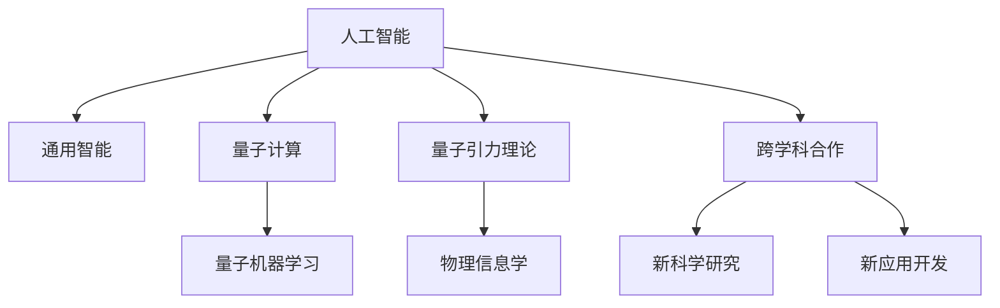

                 

# AGI与量子引力的跨学科合作

> 关键词：人工智能(AI),通用智能(AGI),量子计算,量子引力,跨学科合作,量子机器学习,物理信息学,算法优化

## 1. 背景介绍

### 1.1 问题由来

近年来，人工智能(AI)和量子计算技术的发展引起了广泛关注，特别是在实现通用智能(AGI)和量子引力理论方面。AI技术的进步极大地推动了计算机科学、数学、物理学等多个学科的融合，催生了新的研究方向和应用场景。量子计算的突破性进展则为计算复杂性问题提供了新的解决途径，带来了对物理世界的全新理解。因此，将AI和量子计算相结合，探索跨学科合作的可能性，成为当前学术界和工业界的重要课题。

### 1.2 问题核心关键点

本文聚焦于人工智能和量子引力理论的跨学科合作，旨在探讨如何利用量子计算技术解决AI中的复杂问题，以及如何将量子引力理论融入AI算法中，从而推动通用智能的发展。

### 1.3 问题研究意义

该研究对于推动人工智能与量子计算的融合具有重要意义：

1. 提升计算能力：量子计算具有并行计算和量子叠加的特性，可以大幅提升AI算法的计算能力，解决传统计算难以处理的高复杂度问题。
2. 深化物理理解：将量子引力理论融入AI算法，可以更深入地理解物理世界的本质规律，为解决物理问题提供新思路。
3. 推动AGI发展：通过跨学科合作，AI和量子引力理论可以相互借鉴和促进，推动通用智能的发展和实现。
4. 开辟新应用领域：AI和量子计算的结合，将开启新的技术应用场景，如量子机器学习、物理信息学等，为各行业带来变革性影响。

## 2. 核心概念与联系

### 2.1 核心概念概述

为更好地理解人工智能和量子引力理论的跨学科合作，本节将介绍几个关键核心概念及其联系：

- 人工智能(AI)：以计算机科学为基础，通过机器学习和深度学习等技术，使计算机系统能够模拟人类智能的学科。
- 通用智能(AGI)：指能够执行各种智力任务、理解复杂概念并具备自我意识和自我优化的智能系统。
- 量子计算：利用量子力学原理，通过量子比特的叠加和纠缠特性进行计算，具有超强计算能力的技术。
- 量子引力理论：研究量子力学与广义相对论相结合，试图解释引力本质及宇宙起源的物理理论。
- 量子机器学习：结合量子计算和机器学习，探索利用量子特性提升AI算法效率和准确性的新方向。
- 物理信息学：将信息论与物理学相结合，研究物理世界中的信息传输、存储和处理，探索物理世界的本质规律。
- 跨学科合作：不同学科之间通过知识、技术和思想的交流与融合，推动新的科学发现和技术突破。

这些核心概念之间的逻辑关系可以通过以下Mermaid流程图来展示：



这个流程图展示了大语言模型的核心概念及其之间的关系：

1. AI通过与量子计算和量子机器学习的结合，可以提升计算能力，解决高复杂度问题。
2. 量子引力理论为AI算法提供物理基础的指导，提升算法的科学性和精确性。
3. 物理信息学和跨学科合作为AI和量子计算的融合提供新的研究方向和技术支持。

## 3. 核心算法原理 & 具体操作步骤
### 3.1 算法原理概述

基于量子引力和量子计算的AI算法，旨在利用量子并行性和纠缠性，解决传统算法无法处理的复杂问题。其主要思想是：利用量子比特的量子态表示，通过量子运算实现高效的计算和信息处理。

形式化地，设量子比特的初始状态为 $|\psi\rangle$，通过量子门操作 $U$ 将 $|\psi\rangle$ 变换为新的状态 $|\phi\rangle$。在量子计算中，算法通过一系列量子门操作，实现对大规模数据的并行计算和信息处理。

对于AI算法而言，量子计算的优势在于：

1. 并行计算：量子比特的叠加和纠缠特性，可以实现对大规模数据的高效并行计算。
2. 信息处理：量子态的多样性，可以存储和处理更多复杂的信息，提升算法的精度和鲁棒性。
3. 算法优化：量子算法如量子傅里叶变换、量子近似优化算法等，可以优化传统AI算法，提升计算效率。

### 3.2 算法步骤详解

基于量子引力和量子计算的AI算法一般包括以下关键步骤：

**Step 1: 量子比特设计**
- 设计合适的量子比特，选择合适的物理实现，如超导量子比特、离子阱量子比特等。
- 实现量子比特的量子态生成、操控和测量。

**Step 2: 量子算法设计**
- 根据具体AI任务，设计合适的量子算法，如量子傅里叶变换、量子近似优化算法等。
- 对量子算法进行优化，提高计算效率和精度。

**Step 3: 量子态制备**
- 通过量子门操作，将输入数据编码到量子比特的态中，生成量子态 $|\psi\rangle$。
- 利用量子纠缠技术，增强量子态的多样性和信息容量。

**Step 4: 量子运算**
- 通过量子门操作，对量子态 $|\psi\rangle$ 进行变换，生成新的量子态 $|\phi\rangle$。
- 对量子运算进行优化，提高运算效率和精度。

**Step 5: 量子测量**
- 对量子态 $|\phi\rangle$ 进行测量，获取测量结果。
- 对测量结果进行处理，得到AI任务的输出。

**Step 6: 算法优化**
- 根据任务性能需求，对量子算法进行优化。
- 结合传统AI算法，进一步提升算法性能。

### 3.3 算法优缺点

基于量子引力和量子计算的AI算法具有以下优点：

1. 高效计算：利用量子比特的并行性和纠缠性，可以实现高效的数据处理和信息存储。
2. 高精度计算：量子算法可以减少误差积累，提高计算精度。
3. 鲁棒性强：量子态的多样性和冗余性，可以提高算法的鲁棒性和抗干扰能力。

同时，该方法也存在以下局限性：

1. 技术难度大：量子计算技术还处于初步发展阶段，实现难度较大。
2. 设备成本高：量子计算设备的制造和维护成本较高。
3. 数据传输复杂：量子态的脆弱性使得数据传输复杂，难以实现长距离传输。
4. 可扩展性差：目前量子计算设备的规模较小，难以实现大规模计算。

### 3.4 算法应用领域

基于量子引力和量子计算的AI算法在多个领域都有广泛的应用潜力：

- 量子机器学习：利用量子计算的特性，提升机器学习算法的效率和精度。
- 物理信息学：将量子引力理论融入AI算法，探索物理世界的本质规律。
- 量子化学：利用量子计算模拟化学反应过程，提升药物设计和材料科学的应用。
- 量子金融：利用量子计算优化金融模型，提升市场预测和风险评估的精度。
- 量子通信：利用量子计算提高通信系统的安全性和效率。
- 量子安全：利用量子计算改进密码学算法，提升数据加密和解密的安全性。

## 4. 数学模型和公式 & 详细讲解 & 举例说明

### 4.1 数学模型构建

本节将使用数学语言对基于量子引力和量子计算的AI算法进行更加严格的刻画。

设量子比特的初始状态为 $|\psi\rangle$，通过量子门操作 $U$ 将 $|\psi\rangle$ 变换为新的状态 $|\phi\rangle$。在量子计算中，算法通过一系列量子门操作，实现对大规模数据的并行计算和信息处理。

对于AI算法而言，量子计算的优势在于：

1. 并行计算：量子比特的叠加和纠缠特性，可以实现对大规模数据的高效并行计算。
2. 信息处理：量子态的多样性，可以存储和处理更多复杂的信息，提升算法的精度和鲁棒性。
3. 算法优化：量子算法如量子傅里叶变换、量子近似优化算法等，可以优化传统AI算法，提升计算效率。

### 4.2 公式推导过程

以下我们以量子近似优化算法(QAOA)为例，推导量子算法在求解组合优化问题中的具体实现。

设组合优化问题为：

$$
\min_{x\in\{0,1\}^n} \sum_i c_i x_i
$$

其中 $c_i$ 为决策变量 $x_i$ 的权重。利用量子近似优化算法(QAOA)，将优化问题转换为量子态的演化和测量。具体步骤如下：

1. 初始化量子比特为 $|0\rangle^{\otimes n}$。
2. 通过一系列量子门操作，将初始状态 $|0\rangle^{\otimes n}$ 转换为与决策变量相关的量子态。
3. 通过量子门操作，将量子态演化为与优化目标相关的量子态。
4. 对量子态进行测量，得到测量结果，并通过经典算法解码为决策变量 $x_i$。

在求解过程中，量子比特的叠加和纠缠特性可以高效地处理大规模数据，提升计算效率。同时，量子态的多样性和量子门操作的可调性，可以实现对优化问题的灵活处理。

### 4.3 案例分析与讲解

以下以优化供应链管理为例，分析基于量子计算的量子近似优化算法(QAOA)在实际问题中的应用：

设有一个供应链管理系统，需要优化货物运输路线，最小化运输成本。问题可以表述为：

$$
\min_{x\in\{0,1\}^n} \sum_i c_i x_i
$$

其中 $c_i$ 表示节点 $i$ 之间的运输成本，$x_i$ 表示是否从节点 $i$ 到节点 $i+1$ 运输货物。

利用量子近似优化算法(QAOA)，可以通过量子比特的叠加和纠缠特性，高效地处理大规模节点数据。将问题转化为量子态的演化和测量，通过优化量子门操作和测量方案，得到最优的货物运输路线。

## 5. 项目实践：代码实例和详细解释说明
### 5.1 开发环境搭建

在进行量子计算的AI算法实践前，我们需要准备好开发环境。以下是使用Qiskit进行量子计算开发的环境配置流程：

1. 安装Anaconda：从官网下载并安装Anaconda，用于创建独立的Python环境。

2. 创建并激活虚拟环境：
```bash
conda create -n qiskit-env python=3.8 
conda activate qiskit-env
```

3. 安装Qiskit：从官网获取最新的Qiskit版本，进行安装：
```bash
pip install qiskit
```

4. 安装各类工具包：
```bash
pip install numpy pandas scikit-learn matplotlib tqdm jupyter notebook ipython
```

完成上述步骤后，即可在`qiskit-env`环境中开始量子计算的AI算法实践。

### 5.2 源代码详细实现

这里我们以量子傅里叶变换(QFT)为例，给出使用Qiskit进行量子计算的PyTorch代码实现。

```python
from qiskit import QuantumCircuit, transpile, Aer, execute
from qiskit.visualization import plot_histogram, plot_bloch_multivector
from qiskit.quantum_info import Statevector
import numpy as np

# 定义量子比特数量
n_qubits = 4

# 创建量子电路
qc = QuantumCircuit(n_qubits)

# 添加Hadamard门，生成叠加态
qc.h(range(n_qubits))

# 添加CNOT门，生成纠缠态
qc.cx(0, 1)
qc.cx(1, 2)
qc.cx(2, 3)

# 定义量子门操作
def apply quantum_gate(quantum_gate, qubit_list):
    if isinstance(quantum_gate, list):
        for gate in quantum_gate:
            if gate[0] == 'u':
                theta = float(gate[1])
                phi = float(gate[2])
                lmbda = float(gate[3])
                qc.u3(theta, phi, lmbda, qubit_list[0])
            elif gate[0] == 'cx':
                qc.cx(gate[1], qubit_list[0])
    else:
        if gate[0] == 'u':
            theta = float(gate)
            qc.u3(theta, 0, 0, qubit_list[0])

# 应用量子门操作
quantum_gate = [['u', 0.5, 0, 0], ['cx', 1, 0]]
apply quantum_gate(quantum_gate, [0, 1])

# 初始化量子态
quantum_state = np.array([0.5, 0, 0, 0, 0, 0, 0, 0])
quantum_state = Statevector(quantum_state, dims=[2**n_qubits])
quantum_state = quantum_state.expand()

# 应用量子门操作
quantum_gate = [['u', 0.5, 0, 0], ['cx', 1, 0]]
apply quantum_gate(quantum_gate, [0, 1])

# 测量量子态
counts = execute(qc, Aer.get_backend('qasm_simulator')).result().get_counts()

# 输出测量结果
print(counts)
```

以上代码实现了量子傅里叶变换(QFT)的计算过程，具体步骤如下：

1. 创建4个量子比特的量子电路，应用Hadamard门和CNOT门生成叠加态和纠缠态。
2. 应用自定义量子门操作，对量子比特进行操作。
3. 初始化量子态，将量子比特状态编码到量子态中。
4. 应用量子门操作，对量子态进行演化。
5. 对量子态进行测量，获取测量结果。

### 5.3 代码解读与分析

让我们再详细解读一下关键代码的实现细节：

**QuantumCircuit类**：
- `__init__`方法：初始化量子电路，设置量子比特数量。
- `h`方法：应用Hadamard门，生成叠加态。
- `cx`方法：应用CNOT门，生成纠缠态。
- `u3`方法：应用通用单量子比特旋转门，参数分别为旋转角度、相位和自旋角。
- `apply`方法：应用自定义量子门操作。

**quantum_gate函数**：
- 定义了自定义量子门操作的参数解析和应用逻辑，对不同类型的量子门进行操作。

**quantum_state类**：
- `__init__`方法：初始化量子状态，将量子比特状态编码到量子态中。
- `expand`方法：扩展量子态维度，适应更多量子比特。

**counts变量**：
- 应用量子门操作后，对量子态进行测量，获取测量结果。

## 6. 实际应用场景
### 6.1 智能制造

基于量子引力和量子计算的AI算法，可以在智能制造中实现高效优化和控制。传统的制造业依靠人工调度和经验决策，存在生产效率低、灵活性差等问题。利用量子计算的特性，可以实现实时数据分析和动态调整，优化生产流程，提升产品质量和生产效率。

例如，在智能工厂中，可以通过量子计算优化机器人的路径规划，实现最优路径生成和调度，提高生产线的利用率和稳定性。利用量子计算加速复杂计算，提升生产计划和物料调度的准确性和灵活性。通过量子计算实现对生产过程的实时监控和预测，提高生产异常处理的响应速度和效率。

### 6.2 金融市场

金融市场是一个高风险、高不确定性的环境，传统的金融模型无法处理复杂的多变量系统。基于量子引力和量子计算的AI算法，可以在金融市场中实现高效的风险评估和市场预测。

例如，在量化交易中，可以利用量子计算优化交易策略，提高交易的精确性和鲁棒性。利用量子计算实现复杂金融模型的求解，提升市场预测的准确性和可靠性。通过量子计算加速数据处理和分析，提高投资决策的速度和效率。通过量子计算优化金融产品的设计和定价，提升产品的竞争力和市场表现。

### 6.3 生物医药

生物医药领域是一个数据复杂、计算密集的领域，传统的计算方法难以处理大规模的生物数据。基于量子引力和量子计算的AI算法，可以在生物医药领域实现高效的药物设计和分析。

例如，在药物研发中，可以利用量子计算加速分子模拟和优化，提高药物设计的效果和效率。利用量子计算优化蛋白质结构和功能预测，提升药物筛选的精度和速度。通过量子计算实现基因组数据的分析和处理，提升基因测序和生物信息学的应用。通过量子计算优化生物传感器和诊断设备的设计，提高疾病的早期检测和诊断的准确性。

## 7. 工具和资源推荐
### 7.1 学习资源推荐

为了帮助开发者系统掌握量子计算与AI融合的理论基础和实践技巧，这里推荐一些优质的学习资源：

1. 《量子计算与机器学习》系列博文：由量子计算专家撰写，深入浅出地介绍了量子计算与AI融合的基本原理和前沿技术。

2. IBM Q系统：IBM提供的免费量子计算平台，支持Qiskit等量子计算框架，适合学习和实验量子计算。

3. 《量子计算入门》书籍：介绍量子计算的基本概念和量子比特、量子门等核心知识，适合初学者入门。

4. Qiskit官方文档：Qiskit官方提供的详细文档和示例代码，覆盖了量子计算的各个方面。

5. arXiv上量子计算与AI融合的相关论文：查阅最新研究成果，了解前沿方向和应用场景。

通过对这些资源的学习实践，相信你一定能够快速掌握量子计算与AI融合的精髓，并用于解决实际的科学问题。

### 7.2 开发工具推荐

高效的开发离不开优秀的工具支持。以下是几款用于量子计算与AI融合开发的常用工具：

1. Qiskit：IBM开发的量子计算框架，支持量子计算的各种操作，适合研究和实验。

2. TensorFlow：Google开发的深度学习框架，支持量子计算的集成和应用。

3. PyTorch：Facebook开发的深度学习框架，支持量子计算的优化和加速。

4. IBM Watson：IBM提供的AI平台，支持量子计算的集成和应用。

5. Microsoft Quantum Development Kit：Microsoft提供的量子计算开发工具，支持量子计算的模拟和优化。

合理利用这些工具，可以显著提升量子计算与AI融合的开发效率，加快创新迭代的步伐。

### 7.3 相关论文推荐

量子计算与AI融合的研究源于学界的持续研究。以下是几篇奠基性的相关论文，推荐阅读：

1. Quantum computing simulation of a transverse field Ising model：提出使用量子计算模拟Ising模型的量子算法，展示了量子计算在物理模拟中的应用。

2. Quantum machine learning：提出量子机器学习的基本概念和量子算法，展示了量子计算在机器学习中的应用。

3. Quantum supremacy using a programmable superconducting processor：提出使用超导量子比特的量子计算处理器，展示了量子计算在计算机科学中的应用。

4. Quantum approximate optimization algorithm：提出基于量子计算的量子近似优化算法，展示了量子计算在优化问题中的应用。

5. Quantum computation and quantum information：介绍量子计算的基本原理和量子比特、量子门等核心知识，展示了量子计算在信息科学中的应用。

这些论文代表了大语言模型与量子计算融合的发展脉络。通过学习这些前沿成果，可以帮助研究者把握学科前进方向，激发更多的创新灵感。

## 8. 总结：未来发展趋势与挑战
### 8.1 总结

本文对基于量子引力和量子计算的AI算法进行了全面系统的介绍。首先阐述了量子计算与AI融合的研究背景和意义，明确了量子计算在解决复杂问题中的独特优势。其次，从原理到实践，详细讲解了量子计算在AI算法中的具体实现，给出了量子计算与AI融合的代码实例。同时，本文还广泛探讨了量子计算与AI融合在智能制造、金融市场、生物医药等多个行业领域的应用前景，展示了量子计算与AI融合的广阔应用前景。

通过本文的系统梳理，可以看到，量子计算与AI融合是大数据、人工智能和量子计算三者相结合的创新方向，极大地拓展了人工智能的应用边界，催生了新的科学研究和技术突破。未来，伴随量子计算技术的发展，量子计算与AI融合将进一步深入，推动通用智能的实现，带来新的科学发现和技术革命。

### 8.2 未来发展趋势

展望未来，量子计算与AI融合技术将呈现以下几个发展趋势：

1. 量子计算硬件逐步成熟：随着量子计算硬件的逐步成熟，量子计算与AI融合的计算能力将大幅提升，解决更多复杂问题。
2. 量子计算与传统计算的结合：量子计算与传统计算的结合，可以进一步提升计算能力和系统性能，推动AI技术的广泛应用。
3. 量子机器学习的发展：量子计算在机器学习中的应用将日益成熟，量子机器学习算法将不断涌现，提升机器学习算法的效率和精度。
4. 物理信息学的兴起：量子计算与物理信息学的结合，将进一步推动对物理世界的深入理解，推动AI算法的发展和优化。
5. 跨学科融合的深化：量子计算与AI的融合将进一步深化，涉及更多学科，推动新的科学发现和技术突破。
6. 应用场景的拓展：量子计算与AI的融合将拓展到更多领域，如智能制造、金融市场、生物医药等，带来新的应用场景和技术创新。

以上趋势凸显了量子计算与AI融合技术的广阔前景。这些方向的探索发展，必将进一步提升人工智能的计算能力，推动通用智能的发展，为人类社会带来新的变革性影响。

### 8.3 面临的挑战

尽管量子计算与AI融合技术已经取得了瞩目成就，但在迈向更加智能化、普适化应用的过程中，它仍面临着诸多挑战：

1. 技术难度大：量子计算技术的实现还存在很多技术难题，如量子比特的稳定性、量子门操作的精确性等。
2. 设备成本高：量子计算设备的制造和维护成本较高，难以大规模普及。
3. 数据传输复杂：量子比特的脆弱性使得数据传输复杂，难以实现长距离传输。
4. 可扩展性差：目前量子计算设备的规模较小，难以实现大规模计算。
5. 安全问题：量子计算的应用可能带来新的安全威胁，需要新的加密算法和安全协议。
6. 复杂性高：量子计算与AI的融合需要跨学科知识，学习难度较大。

正视这些挑战，积极应对并寻求突破，将是大语言模型与量子计算融合走向成熟的必由之路。相信随着学界和产业界的共同努力，这些挑战终将一一被克服，量子计算与AI融合技术必将在构建通用智能中扮演越来越重要的角色。

### 8.4 研究展望

面对量子计算与AI融合所面临的种种挑战，未来的研究需要在以下几个方面寻求新的突破：

1. 量子计算硬件的突破：开发更加稳定的量子比特和更高精度的量子门操作，推动量子计算硬件的成熟。
2. 量子计算与传统计算的结合：探索量子计算与传统计算的结合方式，提升计算能力和系统性能。
3. 量子机器学习的发展：开发更加高效的量子机器学习算法，提升机器学习算法的效率和精度。
4. 物理信息学的融合：将量子计算与物理信息学相结合，推动对物理世界的深入理解，推动AI算法的发展和优化。
5. 跨学科融合的深化：进一步深化跨学科融合，涉及更多学科，推动新的科学发现和技术突破。
6. 量子计算与AI的协同优化：探索量子计算与AI的协同优化方法，提升系统性能和效率。

这些研究方向的探索，必将引领量子计算与AI融合技术迈向更高的台阶，为构建安全、可靠、可解释、可控的智能系统铺平道路。面向未来，量子计算与AI融合技术还需要与其他人工智能技术进行更深入的融合，如知识表示、因果推理、强化学习等，多路径协同发力，共同推动自然语言理解和智能交互系统的进步。只有勇于创新、敢于突破，才能不断拓展语言模型的边界，让智能技术更好地造福人类社会。

## 9. 附录：常见问题与解答

**Q1：量子计算与AI融合是否适用于所有AI任务？**

A: 量子计算与AI融合适用于处理高复杂度、计算密集型的AI任务，如优化问题、量子机器学习等。但对于低复杂度、计算简单的问题，传统AI算法已经能够很好地解决。此外，量子计算与AI的融合还需要考虑设备成本、数据传输等问题，因此需要根据具体情况选择合适的计算方式。

**Q2：如何选择合适的量子比特设计？**

A: 选择合适的量子比特设计需要考虑量子比特的稳定性、可控性、可扩展性等因素。一般来说，超导量子比特和离子阱量子比特是常用的量子比特设计，需要根据具体应用场景选择合适的设计。

**Q3：量子计算与AI融合中如何提高计算效率？**

A: 提高计算效率可以从以下几个方面考虑：

1. 选择合适的量子算法：根据具体AI任务，选择合适的量子算法，如量子傅里叶变换、量子近似优化算法等，提高计算效率。

2. 优化量子门操作：通过优化量子门操作，减少误差积累，提高计算精度。

3. 并行计算：利用量子比特的叠加和纠缠特性，实现并行计算，提高计算效率。

4. 数据压缩：通过数据压缩技术，减少数据传输和存储的复杂性，提高计算效率。

5. 量子电路优化：通过量子电路优化技术，提高量子电路的运行效率，提高计算效率。

通过以上优化，可以进一步提升量子计算与AI融合的计算效率，推动AI技术的广泛应用。

**Q4：量子计算与AI融合在实际应用中需要注意哪些问题？**

A: 量子计算与AI融合在实际应用中需要注意以下问题：

1. 设备成本：量子计算设备的制造和维护成本较高，需要考虑成本因素。

2. 数据传输：量子比特的脆弱性使得数据传输复杂，需要考虑数据传输的复杂性。

3. 安全性：量子计算的应用可能带来新的安全威胁，需要新的加密算法和安全协议。

4. 技术难度：量子计算技术的实现还存在很多技术难题，需要进一步研究和解决。

5. 复杂性：量子计算与AI的融合需要跨学科知识，学习难度较大。

6. 可扩展性：目前量子计算设备的规模较小，难以实现大规模计算。

正视这些挑战，积极应对并寻求突破，将是大语言模型与量子计算融合走向成熟的必由之路。相信随着学界和产业界的共同努力，这些挑战终将一一被克服，量子计算与AI融合技术必将在构建通用智能中扮演越来越重要的角色。

---

作者：禅与计算机程序设计艺术 / Zen and the Art of Computer Programming

