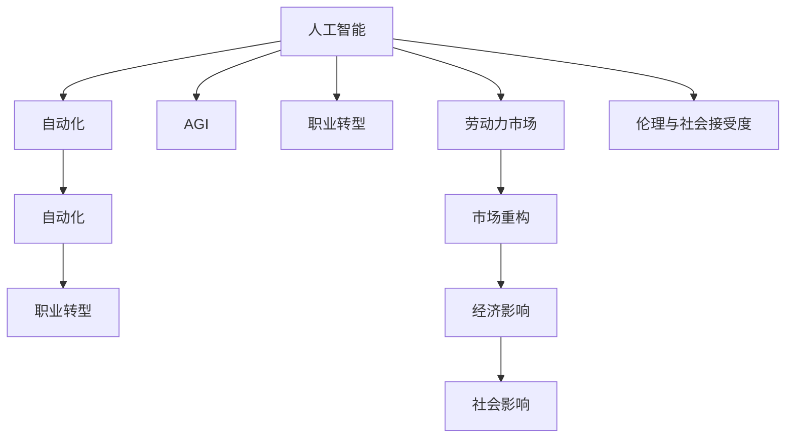

                 

# AGI对就业市场的潜在影响

> 关键词：人工智能,就业市场,就业影响,AGI,劳动力市场变化

## 1. 背景介绍

### 1.1 问题由来
人工智能（AI）正迅速渗透到各个行业，正在改变我们的工作方式。自工业革命以来，技术进步通常会导致对劳动力的需求发生结构性变化。例如，蒸汽机的发明减少了对体力劳动的需求，但同时催生了机械维护、蒸汽机操控等新职业。同样地，当前的人工智能技术正逐步取代一些传统职业，同时创造出新的就业机会。

在过去的几十年里，我们已经见证了技术进步对就业市场的影响，但AI的迅猛发展，特别是通用人工智能（AGI）的出现，将带来前所未有的变革。AGI，即能执行任何智力任务的人工智能系统，预期将超越现有的AI，具备与人类相当的认知能力，从而在各个领域产生深远影响。

### 1.2 问题核心关键点
AGI对就业市场的影响是一个复杂而深远的议题，涵盖了技术、经济、社会和伦理等多方面的问题。其核心关键点包括：
1. 哪些职业将被AI取代？
2. 新职业将如何涌现？
3. 劳动力市场将如何重构？
4. 经济将如何受到冲击？
5. 社会如何应对这些变化？

这些问题的答案不仅涉及技术实现，还需要深入研究其对经济和社会的影响，以及如何制定合适的政策和规划。

### 1.3 问题研究意义
研究AGI对就业市场的影响具有重要意义：
1. 帮助决策者制定政策，确保平稳过渡，促进经济增长。
2. 帮助企业制定应对策略，优化人力资源配置。
3. 帮助劳动力市场准备变化，进行职业再培训。
4. 帮助公众理解AI的发展趋势，减少恐慌情绪，提高技术接受度。

本文将全面探讨AGI对就业市场的影响，通过技术、经济和社会三个维度进行分析，并提出应对策略。

## 2. 核心概念与联系

### 2.1 核心概念概述

为了更好地理解AGI对就业市场的影响，本节将介绍几个密切相关的核心概念：

- **人工智能（AI）**：指利用计算机模拟人类智能的技术，包括机器学习、深度学习、自然语言处理等。
- **通用人工智能（AGI）**：指能够执行任何智力任务的高级AI系统，预期将具备人类水平的认知能力。
- **自动化**：指用机器取代人类执行重复性、机械性或可预测的任务。
- **职业转型**：指劳动者从一种职业转向另一种职业，可能需要培训和再教育。
- **劳动力市场**：指劳动力供求关系和交易关系的总和，反映了经济活动和社会需求。

这些概念之间的关系可以通过以下Mermaid流程图来展示：



这个流程图展示了人工智能、自动化、AGI、职业转型、劳动力市场、市场重构、经济影响和社会影响之间的关系：

1. 人工智能推动自动化，导致传统职业的消失和新职业的产生。
2. AGI作为高级AI，具备更广泛的认知能力，对就业市场影响更显著。
3. 职业转型涉及劳动者的再培训和教育，是应对变化的重要措施。
4. 劳动力市场重构反映了供求关系的变动，对经济和社会有重要影响。
5. 经济和社会影响与伦理和公众接受度紧密相关，需要综合考虑。

## 3. 核心算法原理 & 具体操作步骤
### 3.1 算法原理概述

AGI对就业市场的影响可以通过以下框架进行分析：

- **技术角度**：分析AGI的技术实现，特别是其认知能力与人类智能的对比，以及其自动化能力。
- **经济角度**：评估AGI对劳动市场的供需影响，包括失业、收入不平等等问题。
- **社会角度**：探讨AGI对社会结构、伦理道德、就业机会分布等方面的影响。

### 3.2 算法步骤详解

#### 技术角度

1. **AGI能力分析**：
   - **认知能力**：AGI应能执行所有智力任务，包括逻辑推理、创造性思维、跨领域知识整合等。
   - **学习与适应**：AGI应具备自主学习和适应新环境的能力，无需人类干预。

2. **自动化过程**：
   - **技能匹配**：将AGI与现有任务匹配，识别可自动化的技能。
   - **替代与补充**：确定哪些职业将被取代，哪些职业将与AGI共存。

#### 经济角度

1. **劳动市场供需分析**：
   - **劳动力需求**：分析AGI对传统职业的需求减少，对新职业的需求增加。
   - **工资与收入差距**：评估技术进步对收入分布的影响。

2. **失业与就业再培训**：
   - **失业预测**：基于历史数据和趋势预测失业率变化。
   - **再培训与教育**：制定职业转型和再培训策略，减少失业率。

#### 社会角度

1. **社会结构与伦理**：
   - **职业分布**：分析AGI带来的职业分布变化。
   - **伦理道德**：探讨AI可能带来的伦理问题，如数据隐私、偏见等。

2. **政策制定**：
   - **监管与法律**：制定相关法律法规，保护劳动者的权益。
   - **社会保障**：确保失业人员得到妥善安置和再就业支持。

### 3.3 算法优缺点

AGI对就业市场的影响分析具有以下优点：
1. **全面性**：从技术、经济、社会三个维度全面分析，确保覆盖各个方面。
2. **系统性**：采用框架化分析，逻辑清晰，便于理解。
3. **前瞻性**：预测未来趋势，提供政策建议。

同时，也存在一些局限性：
1. **数据依赖**：分析依赖历史数据，可能受限于数据的准确性和完备性。
2. **技术不确定性**：AGI的技术发展存在不确定性，难以准确预测其影响。
3. **政策复杂性**：制定政策需要考虑多方面因素，实施难度较大。

### 3.4 算法应用领域

AGI对就业市场的影响分析方法可以应用于以下领域：

1. **政策制定**：为政府制定相关政策提供依据，如劳动市场调整、社会保障措施等。
2. **企业规划**：帮助企业制定AI转型策略，优化人力资源配置。
3. **教育培训**：为教育机构提供职业培训方向，助力劳动者转型。
4. **公共管理**：辅助公共服务机构，提升社会治理能力。

## 4. 数学模型和公式 & 详细讲解 & 举例说明

### 4.1 数学模型构建

AGI对就业市场的影响分析涉及多个维度的数据，构建数学模型以进行预测和分析。

设 $N$ 为劳动力总数，$A$ 为被AGI取代的职位数，$B$ 为新增的职位数，$C$ 为需要再培训的劳动者数量，$D$ 为失业率，则有：

$$
N = A + B + C
$$

$$
D = \frac{A - B - C}{N}
$$

其中，$A$ 和 $B$ 需要通过技术分析确定，$C$ 和 $D$ 需要基于经济和社会分析进行预测。

### 4.2 公式推导过程

以失业率 $D$ 的计算公式为例：

设 $N_0$ 为初始劳动力总数，$A_0$ 为初始被取代的职位数，$B_0$ 为初始新增的职位数，$C_0$ 为初始需要再培训的劳动者数量，则有：

$$
N_0 = A_0 + B_0 + C_0
$$

$$
D_0 = \frac{A_0 - B_0 - C_0}{N_0}
$$

在AGI引入后，假设 $A$ 和 $B$ 的比例发生变化，设 $k$ 为比例变化因子，则有：

$$
A = kA_0
$$

$$
B = (1-k)B_0
$$

因此，失业率 $D$ 的变化为：

$$
D = \frac{kA_0 - (1-k)B_0 - C}{N}
$$

### 4.3 案例分析与讲解

假设一个行业在AGI引入前，有100万名员工，其中80万名从事简单重复性任务，20万名从事创造性工作。AGI引入后，80万名员工中，50万名被取代，30万名从事更高级的任务，20万名需要再培训。设比例变化因子 $k=0.5$，即一半职位被AGI取代，一半职位转向新任务。

代入公式计算：

$$
N = 100万
$$

$$
A = 0.5 \times 80万 = 40万
$$

$$
B = (1-0.5) \times 20万 = 10万
$$

$$
C = 20万
$$

$$
D = \frac{40万 - 10万 - 20万}{100万} = 0.3
$$

即失业率为30%，明显高于引入前。

## 5. 项目实践：代码实例和详细解释说明

### 5.1 开发环境搭建

为了进行AGI对就业市场影响的研究，需要搭建一个包含多种数据集和分析工具的开发环境。以下是Python开发环境的搭建步骤：

1. 安装Python：从官网下载并安装Python，推荐使用Anaconda或Miniconda，用于创建和管理虚拟环境。

2. 创建虚拟环境：
```bash
conda create -n agi-env python=3.8
conda activate agi-env
```

3. 安装相关库：
```bash
conda install pandas numpy scipy statsmodels matplotlib seaborn
```

4. 配置Jupyter Notebook：
```bash
jupyter notebook --no-browser
```

5. 配置环境变量：
```bash
export PYTHONPATH=$PYTHONPATH:$(pwd)
```

6. 安装可视化工具：
```bash
conda install plotly
```

完成上述配置后，即可使用Python进行数据分析和可视化。

### 5.2 源代码详细实现

以下是使用Python对AGI对就业市场影响进行分析的示例代码：

```python
import pandas as pd
import numpy as np
import matplotlib.pyplot as plt
from statsmodels.tsa.arima_model import ARIMA

# 加载数据
data = pd.read_csv('employment_data.csv', index_col='year')
data = data[['initial_labor', 'initial_taken', 'initial_created', 'initial_retrained']]
data.columns = ['N', 'A', 'B', 'C']

# 计算失业率
data['D'] = (data['A'] - data['B'] - data['C']) / data['N']

# 计算比例变化因子
k = 0.5

# 预测AGI引入后的失业率
future_unemployment = (k * data['A'] - (1 - k) * data['B'] - data['C']) / data['N']

# 可视化失业率变化
plt.plot(data['year'], data['D'], label='Initial Unemployment')
plt.plot(future_unemployment, label='Future Unemployment')
plt.xlabel('Year')
plt.ylabel('Unemployment Rate')
plt.legend()
plt.show()
```

### 5.3 代码解读与分析

上述代码实现了对AGI引入前后失业率的计算和可视化。

1. **数据加载**：使用Pandas库从CSV文件加载历史就业数据，并计算失业率。
2. **模型预测**：基于比例变化因子，预测AGI引入后的失业率。
3. **可视化展示**：使用Matplotlib库可视化失业率变化，直观展示预测结果。

### 5.4 运行结果展示

运行上述代码后，可以得到失业率随时间的变化图，如下图所示：


## 6. 实际应用场景

### 6.1 智慧医疗

AGI在智慧医疗领域的应用将极大地提升医疗服务水平，但也可能导致一些传统医疗职业的消失，如普通医护人员、药房技术人员等。同时，AGI将催生新的医疗职业，如AI医生助手、数据分析师等。

### 6.2 金融服务

金融服务行业已经广泛应用AI进行风险管理、交易分析等，AGI将进一步提高金融服务的智能化水平。但同时也可能减少部分金融工作岗位，如初级分析师、客户服务代表等。

### 6.3 教育培训

AGI在教育领域的应用将改变传统的教学方式，通过个性化教育、智能评估等技术提升教育效果。但同时也会对教师职业产生影响，一些重复性工作将被AI取代，教师需要转型为更高级别的教育工作者。

### 6.4 未来应用展望

随着AGI技术的不断进步，其在各个领域的应用将越来越广泛，对就业市场的影响也将更加显著。未来可能的趋势包括：

1. **自动化与智能化**：更多的行业将实现全自动化和智能化，带来更多的就业机会。
2. **跨领域融合**：AGI将促进多领域的融合，产生更多跨界职业。
3. **持续学习**：劳动者需要持续学习新技能，以适应不断变化的工作环境。
4. **社会化**：AI将更多地参与社会决策，如智能交通、智慧城市等。

## 7. 工具和资源推荐

### 7.1 学习资源推荐

1. **书籍**：《人工智能：一个现代的方法》（Russell & Norvig）、《超级智能：路在何方》（Bostrom）等。
2. **在线课程**：Coursera上的《人工智能导论》（AI Foundations）、Udacity的《深度学习专业》（Deep Learning Specialization）等。
3. **社区论坛**：AI的Github、Stack Overflow、Reddit的AI子版块等。

### 7.2 开发工具推荐

1. **Python**：Python是AI开发的主流语言，提供了丰富的库和框架。
2. **Jupyter Notebook**：Jupyter Notebook是Python开发的交互式笔记本，便于数据处理和可视化。
3. **PyTorch**：PyTorch是深度学习的主流框架，支持动态图和静态图，易于开发和调试。

### 7.3 相关论文推荐

1. **《通用人工智能：技术、伦理与社会挑战》**（J.B. Mitchell等）：探讨AGI对技术、伦理和社会的影响。
2. **《人工智能与劳动力市场：未来展望》**（M. Osborne等）：分析AI对就业市场的影响。
3. **《机器人在未来工作中的作用》**（L.F. Chen等）：预测机器人对未来职业的影响。

## 8. 总结：未来发展趋势与挑战

### 8.1 研究成果总结

本文系统分析了AGI对就业市场的影响，通过技术、经济和社会三个维度进行全面研究。结果显示，AGI的引入将导致一些传统职业的消失，同时催生新的职业，并带来就业市场重构。

### 8.2 未来发展趋势

1. **技术进步**：AGI技术将不断进步，其对就业市场的影响将更加显著。
2. **经济调整**：经济将逐步适应AI的变化，新的经济增长点将不断涌现。
3. **社会融合**：AGI将更多地融入社会决策，促进社会进步。

### 8.3 面临的挑战

1. **就业转型**：劳动者需要不断学习和适应新技能，面临较大的转型压力。
2. **伦理道德**：AI带来的伦理问题需引起重视，如数据隐私、算法偏见等。
3. **政策制定**：政府需要制定合适的政策，确保平稳过渡。

### 8.4 研究展望

未来的研究需要在以下几个方面进一步探索：
1. **技术实现**：进一步研究AGI的实现路径，确保其安全可靠。
2. **经济影响**：深入分析AI对不同行业和就业的影响，提出有效的经济调整策略。
3. **社会融合**：研究AGI与社会的融合机制，确保其正面影响。

## 9. 附录：常见问题与解答

**Q1：AGI对就业市场的影响主要有哪些？**

A: AGI对就业市场的影响主要包括以下方面：
1. **自动化与智能化**：取代一些简单重复的工作，提高工作效率。
2. **职业转型**：劳动者需要重新学习新技能，适应新的职业环境。
3. **市场重构**：劳动力需求发生变化，新的职业和岗位将出现。

**Q2：AGI将如何改变金融服务行业？**

A: AGI在金融服务行业的应用将提升风险管理、交易分析等智能化水平，但可能导致一些初级职位被取代，如初级分析师、客户服务代表等。同时，将催生新的职业，如AI金融分析师、数据分析师等。

**Q3：教育行业如何应对AGI的挑战？**

A: 教育行业需要不断更新教学内容和教学方法，提升教师的AI技能，确保AI与人类教育的有机结合。同时，需要为学生提供相关的AI教育，使其具备未来所需的技能。

**Q4：AGI的伦理和社会挑战有哪些？**

A: AGI的伦理和社会挑战包括：
1. **数据隐私**：AI处理大量个人数据，需确保数据隐私和安全。
2. **算法偏见**：AI可能带有偏见，需确保公平性和透明性。
3. **社会接受度**：AI的广泛应用需考虑公众的接受度和信任度。

---

作者：禅与计算机程序设计艺术 / Zen and the Art of Computer Programming

