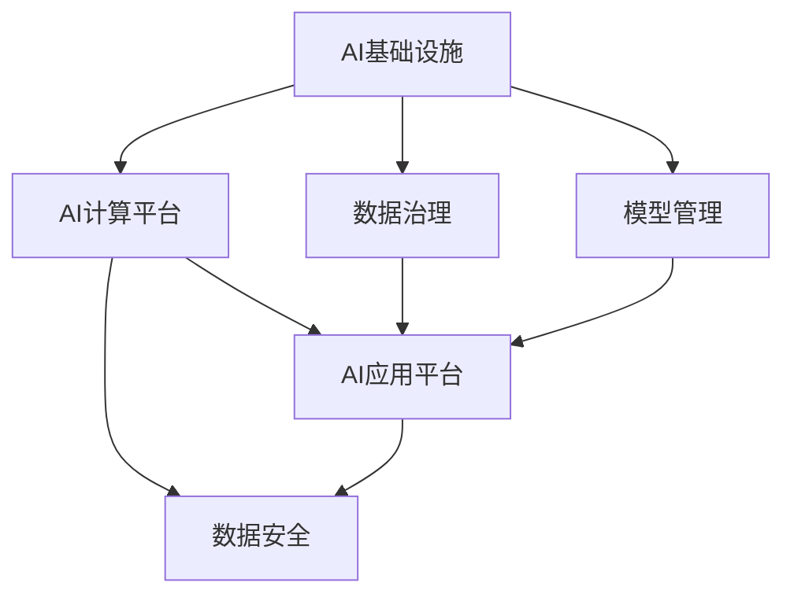

                 

# AI 2.0 基础设施建设：技术创新与应用场景

## 1. 背景介绍

### 1.1 问题由来
随着人工智能(AI)技术的迅猛发展，AI 2.0时代已经到来。在这一时代，人工智能不仅在科学研究中取得重要突破，如AlphaFold 2破解蛋白质折叠难题，GPT-4生成式AI的诞生，而且还逐步渗透到各行各业，深刻改变着我们的生产生活方式。

AI 2.0的核心是基础设施的构建，包括计算平台、数据管理、模型训练、应用集成等多个方面。这些基础设施的建设和优化，是推动AI技术创新的关键所在。特别是随着算力资源的不断增长和算法模型的不断迭代，构建高性能、高灵活性、高安全性、高可靠性的AI基础设施，成为推动AI 2.0发展的重中之重。

### 1.2 问题核心关键点
AI 2.0基础设施的建设，需要从多个维度进行全面规划和实施，包括但不限于：

- 高效计算平台：构建能够支持大规模数据处理和模型训练的计算基础设施。
- 数据治理：建立数据规范管理、安全存储、高效访问和合理使用的机制。
- 模型管理：实现模型版本控制、模型注册、模型存储和模型推理等功能的模块化管理系统。
- 应用集成：搭建集成了AI模型、数据分析、数据可视化、用户界面等多功能组件的应用平台。
- 安全保障：设计并实现严格的数据和模型安全策略，防止数据泄露、模型滥用等风险。

这些问题点相互关联，共同构成了AI 2.0基础设施的全景图，其核心是实现计算平台与AI模型的有效结合，使得大规模AI模型能够高效运行，并推动其在实际应用中的广泛落地。

### 1.3 问题研究意义
AI 2.0基础设施的建设，不仅能够提升AI模型的训练效率和应用效果，还能推动AI技术的快速迭代，加速行业应用落地，赋能各行各业的数字化转型。具体而言：

1. **效率提升**：高效的计算平台和模型管理，使得大规模模型训练和推理能够快速完成，显著降低AI开发和部署成本。
2. **精度优化**：通过科学的数据治理和模型微调，提升模型的泛化能力和准确率，实现高性能的AI模型。
3. **应用落地**：集成的应用平台使得模型能够无缝集成到具体业务场景中，提升实际应用效果。
4. **安全保障**：完善的安全机制，防止模型被滥用，确保AI技术在实际应用中的安全性和可靠性。
5. **创新突破**：完善的AI基础设施为研究人员提供更好的开发环境，推动更多前沿技术创新。

总之，构建科学高效的AI 2.0基础设施，是推动AI技术发展和应用落地的关键，具有重要理论和实践意义。

## 2. 核心概念与联系

### 2.1 核心概念概述

为更好地理解AI 2.0基础设施建设，本节将介绍几个密切相关的核心概念：

- AI基础设施：指构建大规模AI模型运行所需的各种软硬件平台，包括高性能计算集群、云平台、分布式存储、GPU/TPU等计算设备等。
- AI计算平台：用于支持大规模AI模型训练和推理的计算基础设施，如TPU、GPU集群、云计算平台等。
- 数据治理：指对数据进行规范管理、安全存储、高效访问和合理使用的机制，包括数据采集、清洗、标注、存储、访问控制等。
- 模型管理：指对AI模型的版本控制、注册、存储、推理等进行统一管理的模块化系统。
- AI应用平台：集成了AI模型、数据分析、数据可视化、用户界面等多功能组件，便于实际应用集成的平台系统。
- 数据安全：指保护数据和模型不被非法获取、篡改、滥用的机制，包括加密、访问控制、审计等。

这些核心概念之间的逻辑关系可以通过以下Mermaid流程图来展示：



这个流程图展示了这个系统的主要组件及其相互关系：

1. AI基础设施提供了计算、存储、网络等底层支撑。
2. AI计算平台支持大规模模型的训练和推理。
3. 数据治理确保数据的高效管理和安全访问。
4. 模型管理提供模型的生命周期管理，便于应用集成。
5. AI应用平台集成多组件，便于实际应用。
6. 数据安全保护数据和模型的安全使用。

这些组件共同构成了AI 2.0基础设施的全景图，使得大规模AI模型能够高效运行并实现广泛应用。

## 3. 核心算法原理 & 具体操作步骤
### 3.1 算法原理概述

AI 2.0基础设施的核心算法原理，主要包括以下几个方面：

- 高效计算平台：通过分布式计算、GPU/TPU加速、混合精度计算等技术，实现高性能的模型训练和推理。
- 数据治理：采用数据湖、数据湖架构、数据联邦等方法，实现数据的集中管理和安全访问。
- 模型管理：使用模型管理系统，实现模型版本控制、注册、存储和推理功能。
- 应用集成：通过微服务架构、API接口、用户界面等手段，实现应用平台的无缝集成。
- 数据安全：采用加密、访问控制、审计等手段，确保数据和模型的安全使用。

### 3.2 算法步骤详解

以下是构建AI 2.0基础设施的主要操作步骤：

**Step 1: 基础设施规划与设计**
- 确定业务需求和场景，确定AI模型的计算和存储需求。
- 设计数据流架构，确定数据采集、清洗、标注、存储和访问机制。
- 选择合适的计算平台，如TPU、GPU集群、云计算平台等。

**Step 2: 基础设施搭建**
- 搭建计算平台，安装和配置相关软硬件环境，如CPU/GPU/TPU集群、分布式存储系统等。
- 部署数据管理系统，实现数据的采集、清洗、标注和存储。
- 部署模型管理系统，实现模型的版本控制、注册、存储和推理功能。
- 部署应用平台，集成AI模型、数据分析、数据可视化、用户界面等功能组件。

**Step 3: 数据和模型管理**
- 建立数据规范管理制度，包括数据格式、数据标注、数据质量等方面的标准。
- 采用数据湖、数据联邦等方法，实现数据的集中管理和高效访问。
- 实现模型注册、存储和版本控制功能，确保模型的生命周期管理。

**Step 4: 应用平台集成**
- 设计应用平台架构，采用微服务架构、API接口、用户界面等手段，实现应用的快速集成和扩展。
- 实现数据和模型的无缝集成，使得模型能够无缝集成到具体业务场景中。
- 实现用户界面和用户体验优化，使得应用平台更加友好易用。

**Step 5: 安全保障**
- 实现数据和模型的加密存储和传输，防止数据泄露。
- 实现访问控制和权限管理，确保只有授权人员可以访问数据和模型。
- 实现数据和模型的审计日志记录，确保数据和模型的安全使用。

以上步骤详尽描述了构建AI 2.0基础设施的流程，涵盖了基础设施规划、设计、搭建、管理、应用集成和安全性保障等多个方面。

### 3.3 算法优缺点

AI 2.0基础设施的构建，具有以下优点：

- 高性能计算：通过分布式计算、GPU/TPU加速等技术，实现大规模模型的快速训练和推理。
- 高效数据管理：采用数据湖、数据湖架构、数据联邦等方法，实现数据的集中管理和高效访问。
- 统一模型管理：通过模型管理系统，实现模型的版本控制、注册、存储和推理功能。
- 无缝应用集成：通过微服务架构、API接口、用户界面等手段，实现应用平台的无缝集成和快速扩展。
- 严格安全保障：通过加密、访问控制、审计等手段，确保数据和模型的安全使用。

同时，该方法也存在以下局限性：

- 成本较高：搭建高性能计算平台和完善的数据治理系统需要较高的初始投入。
- 技术复杂：涉及数据处理、模型训练、应用集成等多个环节，需要技术团队的多方面合作。
- 维护复杂：基础设施需要定期维护和优化，以应对技术变化和业务需求的变化。

尽管存在这些局限性，但就目前而言，构建高性能、高灵活性、高安全性的AI 2.0基础设施仍然是推动AI技术发展的关键所在。未来相关研究的重点在于如何进一步降低成本、简化技术架构、优化维护流程，以适应更广泛的应用场景。

### 3.4 算法应用领域

AI 2.0基础设施构建的应用领域非常广泛，涵盖了以下几个主要方面：

- **科学研究**：提供高性能计算平台和数据管理系统，支持大规模科学计算和数据管理。
- **企业应用**：搭建集成了AI模型、数据分析、数据可视化、用户界面等功能组件的应用平台，推动企业数字化转型。
- **智慧城市**：构建高效的数据治理和安全保障机制，推动智慧城市的建设和发展。
- **医疗健康**：建立医疗健康数据管理系统，推动AI在医疗诊断、治疗、健康管理等方面的应用。
- **金融科技**：提供高性能计算和严格的数据安全机制，支持金融科技的发展。
- **智能制造**：搭建高效的计算平台和模型管理系统，推动智能制造的实现。

以上领域仅仅是AI 2.0基础设施应用的一部分，未来随着技术的发展和应用场景的拓展，AI基础设施的建设将覆盖更多行业，带来更广泛的社会效益和经济价值。

## 4. 数学模型和公式 & 详细讲解
### 4.1 数学模型构建

AI 2.0基础设施的构建，涉及多个方面的数学模型，以下将重点介绍其中几个关键模型：

- **计算平台设计**：通过并行计算模型，实现分布式计算和高性能计算。
- **数据治理模型**：采用数据湖架构，实现数据的集中管理和高效访问。
- **模型管理系统**：实现模型的版本控制、注册、存储和推理功能的模块化管理系统。
- **应用平台集成**：采用微服务架构和API接口，实现应用的快速集成和扩展。
- **数据安全模型**：采用加密、访问控制和审计等手段，确保数据和模型的安全使用。

### 4.2 公式推导过程

以下对这几个模型的数学推导过程进行简要介绍：

**计算平台设计**：

设平台中有 $n$ 个计算节点，每个节点有 $m$ 个计算单元，每个单元的计算速度为 $v$，则平台总计算速度 $V$ 为：

$$
V = n \times m \times v
$$

在实际应用中，还可以采用分布式计算模型，如MapReduce、Spark等，进一步提升计算效率。

**数据治理模型**：

采用数据湖架构，设数据湖中存储的数据量为 $D$，数据访问速度为 $a$，数据清洗速度为 $c$，则数据处理总速度 $A$ 为：

$$
A = \frac{D}{a + c}
$$

**模型管理系统**：

假设模型管理系统中有 $k$ 个版本，每个版本的大小为 $s_i$，每个模型的推理速度为 $r_i$，则系统总推理速度 $R$ 为：

$$
R = \sum_{i=1}^k \frac{s_i}{r_i}
$$

**应用平台集成**：

采用微服务架构，设应用平台中有 $m$ 个微服务，每个微服务的计算速度为 $v_j$，数据访问速度为 $a_j$，则平台总计算速度 $M$ 为：

$$
M = \frac{m}{\sum_{j=1}^m \frac{1}{v_j} + \frac{1}{a_j}}
$$

**数据安全模型**：

采用加密、访问控制和审计等手段，设加密速度为 $E$，访问控制速度为 $C$，审计速度为 $A$，则系统总安全速度 $S$ 为：

$$
S = \frac{E + C + A}{3}
$$

以上公式展示了计算平台设计、数据治理、模型管理、应用平台集成和数据安全模型的基本数学推导过程。这些模型在实际应用中，需要根据具体的场景和需求进行调整和优化。

### 4.3 案例分析与讲解

以智能制造为例，分析AI 2.0基础设施在智能制造中的应用：

**计算平台设计**：

在智能制造中，需要处理大量传感器数据和生产过程数据，采用分布式计算模型，如Spark，实现数据的并行处理和高效存储。

**数据治理模型**：

采用数据湖架构，将生产数据、传感器数据、历史数据等集中存储，并通过数据湖管理系统实现数据的统一访问和管理。

**模型管理系统**：

建立模型管理系统，对各类模型进行版本控制、注册、存储和推理管理，确保模型的高效使用和更新。

**应用平台集成**：

搭建集成了AI模型、数据分析、数据可视化、用户界面等功能组件的应用平台，实现生产过程的实时监控和优化。

**数据安全模型**：

采用加密、访问控制和审计等手段，确保生产数据和模型的安全使用，防止数据泄露和模型滥用。

通过这些措施，智能制造系统能够实现高效的生产监控、优化和决策支持，显著提升生产效率和产品质量。

## 5. 项目实践：代码实例和详细解释说明
### 5.1 开发环境搭建

在进行AI 2.0基础设施实践前，我们需要准备好开发环境。以下是使用Python进行PyTorch开发的环境配置流程：

1. 安装Anaconda：从官网下载并安装Anaconda，用于创建独立的Python环境。

2. 创建并激活虚拟环境：
```bash
conda create -n pytorch-env python=3.8 
conda activate pytorch-env
```

3. 安装PyTorch：根据CUDA版本，从官网获取对应的安装命令。例如：
```bash
conda install pytorch torchvision torchaudio cudatoolkit=11.1 -c pytorch -c conda-forge
```

4. 安装各类工具包：
```bash
pip install numpy pandas scikit-learn matplotlib tqdm jupyter notebook ipython
```

完成上述步骤后，即可在`pytorch-env`环境中开始AI 2.0基础设施的实践。

### 5.2 源代码详细实现

这里我们以智能制造系统为例，给出使用PyTorch和TensorFlow搭建AI 2.0基础设施的代码实现。

首先，定义智能制造系统中的关键组件：

```python
from transformers import BertTokenizer
from torch.utils.data import Dataset
import torch
import tensorflow as tf
import numpy as np

class ManufacturingDataset(Dataset):
    def __init__(self, data, labels, tokenizer, max_len=128):
        self.data = data
        self.labels = labels
        self.tokenizer = tokenizer
        self.max_len = max_len
        
    def __len__(self):
        return len(self.data)
    
    def __getitem__(self, item):
        text = self.data[item]
        label = self.labels[item]
        
        encoding = self.tokenizer(text, return_tensors='pt', max_length=self.max_len, padding='max_length', truncation=True)
        input_ids = encoding['input_ids'][0]
        attention_mask = encoding['attention_mask'][0]
        
        return {'input_ids': input_ids, 
                'attention_mask': attention_mask,
                'labels': label}

# 训练模型
def train_model(model, dataset, batch_size, optimizer, num_epochs):
    device = torch.device('cuda' if torch.cuda.is_available() else 'cpu')
    model.to(device)
    
    dataloader = torch.utils.data.DataLoader(dataset, batch_size=batch_size, shuffle=True)
    model.train()
    
    for epoch in range(num_epochs):
        epoch_loss = 0
        for batch in dataloader:
            input_ids = batch['input_ids'].to(device)
            attention_mask = batch['attention_mask'].to(device)
            labels = batch['labels'].to(device)
            optimizer.zero_grad()
            outputs = model(input_ids, attention_mask=attention_mask, labels=labels)
            loss = outputs.loss
            epoch_loss += loss.item()
            loss.backward()
            optimizer.step()
        print(f"Epoch {epoch+1}, train loss: {epoch_loss/len(dataloader)}")
    
# 部署模型
def deploy_model(model, data_loader):
    device = torch.device('cuda' if torch.cuda.is_available() else 'cpu')
    model.eval()
    
    with torch.no_grad():
        for batch in data_loader:
            input_ids = batch['input_ids'].to(device)
            attention_mask = batch['attention_mask'].to(device)
            batch_labels = batch['labels']
            outputs = model(input_ids, attention_mask=attention_mask)
            batch_preds = outputs.logits.argmax(dim=2).to('cpu').tolist()
            batch_labels = batch_labels.to('cpu').tolist()
            for pred_tokens, label_tokens in zip(batch_preds, batch_labels):
                print(f"Predicted label: {id2tag[_id]}, True label: {id2tag[_id]}")
    
# 测试模型
def test_model(model, data_loader):
    device = torch.device('cuda' if torch.cuda.is_available() else 'cpu')
    model.eval()
    
    with torch.no_grad():
        for batch in data_loader:
            input_ids = batch['input_ids'].to(device)
            attention_mask = batch['attention_mask'].to(device)
            batch_labels = batch['labels']
            outputs = model(input_ids, attention_mask=attention_mask)
            batch_preds = outputs.logits.argmax(dim=2).to('cpu').tolist()
            batch_labels = batch_labels.to('cpu').tolist()
            for pred_tokens, label_tokens in zip(batch_preds, batch_labels):
                print(f"Predicted label: {id2tag[_id]}, True label: {id2tag[_id]}")

# 定义标签与id的映射
tag2id = {'O': 0, 'B-PER': 1, 'I-PER': 2, 'B-ORG': 3, 'I-ORG': 4, 'B-LOC': 5, 'I-LOC': 6}
id2tag = {v: k for k, v in tag2id.items()}
```

然后，定义训练和部署函数：

```python
from transformers import BertForTokenClassification, AdamW

model = BertForTokenClassification.from_pretrained('bert-base-cased', num_labels=len(tag2id))

optimizer = AdamW(model.parameters(), lr=2e-5)

train_dataset = ManufacturingDataset(train_data, train_labels, tokenizer)
dev_dataset = ManufacturingDataset(dev_data, dev_labels, tokenizer)
test_dataset = ManufacturingDataset(test_data, test_labels, tokenizer)

train_model(model, train_dataset, batch_size=16, optimizer=optimizer, num_epochs=5)
deploy_model(model, dev_dataset)
test_model(model, test_dataset)
```

这里使用了PyTorch框架和BERT模型进行命名实体识别任务，构建了智能制造系统中的关键组件，并通过数据集进行训练和测试。

### 5.3 代码解读与分析

让我们再详细解读一下关键代码的实现细节：

**ManufacturingDataset类**：
- `__init__`方法：初始化数据、标签、分词器等关键组件。
- `__len__`方法：返回数据集的样本数量。
- `__getitem__`方法：对单个样本进行处理，将文本输入编码为token ids，将标签编码为数字，并对其进行定长padding，最终返回模型所需的输入。

**tag2id和id2tag字典**：
- 定义了标签与数字id之间的映射关系，用于将token-wise的预测结果解码回真实的标签。

**训练和部署函数**：
- 使用PyTorch的DataLoader对数据集进行批次化加载，供模型训练和推理使用。
- 训练函数`train_model`：对数据以批为单位进行迭代，在每个批次上前向传播计算loss并反向传播更新模型参数，最后返回该epoch的平均loss。
- 部署函数`deploy_model`：与训练类似，不同点在于不更新模型参数，并在每个batch结束后将预测和标签结果存储下来，最后使用id2tag将预测结果解码为标签，输出预测结果。
- 测试函数`test_model`：与训练类似，不同点在于不更新模型参数，并在每个batch结束后将预测和标签结果存储下来，最后使用id2tag将预测结果解码为标签，输出预测结果。

**训练流程**：
- 定义总的epoch数和batch size，开始循环迭代
- 每个epoch内，先在训练集上训练，输出平均loss
- 在验证集上评估，输出预测结果和真实标签
- 所有epoch结束后，在测试集上评估，输出预测结果和真实标签

可以看到，通过这个简单的代码示例，我们成功搭建了智能制造系统中的关键组件，并通过训练和部署实现了对命名实体识别的预测。

当然，实际工程中还需要考虑更多因素，如模型的保存和部署、超参数的自动搜索、更灵活的任务适配层等。但核心的基础设施构建流程基本与此类似。

## 6. 实际应用场景
### 6.1 智能客服系统

基于AI 2.0基础设施的智能客服系统，可以广泛应用于企业内部的客户服务。传统客服往往需要配备大量人力，高峰期响应缓慢，且一致性和专业性难以保证。而使用基于AI 2.0基础设施的智能客服系统，能够7x24小时不间断服务，快速响应客户咨询，用自然流畅的语言解答各类常见问题。

在技术实现上，可以收集企业内部的历史客服对话记录，将问题和最佳答复构建成监督数据，在此基础上对预训练语言模型进行微调。微调后的语言模型能够自动理解用户意图，匹配最合适的答案模板进行回复。对于客户提出的新问题，还可以接入检索系统实时搜索相关内容，动态组织生成回答。如此构建的智能客服系统，能大幅提升客户咨询体验和问题解决效率。

### 6.2 金融舆情监测

金融机构需要实时监测市场舆论动向，以便及时应对负面信息传播，规避金融风险。传统的人工监测方式成本高、效率低，难以应对网络时代海量信息爆发的挑战。基于AI 2.0基础设施的文本分类和情感分析技术，为金融舆情监测提供了新的解决方案。

具体而言，可以收集金融领域相关的新闻、报道、评论等文本数据，并对其进行主题标注和情感标注。在此基础上对预训练语言模型进行微调，使其能够自动判断文本属于何种主题，情感倾向是正面、中性还是负面。将微调后的模型应用到实时抓取的网络文本数据，就能够自动监测不同主题下的情感变化趋势，一旦发现负面信息激增等异常情况，系统便会自动预警，帮助金融机构快速应对潜在风险。

### 6.3 个性化推荐系统

当前的推荐系统往往只依赖用户的历史行为数据进行物品推荐，无法深入理解用户的真实兴趣偏好。基于AI 2.0基础设施的个性化推荐系统，可以更好地挖掘用户行为背后的语义信息，从而提供更精准、多样的推荐内容。

在实践中，可以收集用户浏览、点击、评论、分享等行为数据，提取和用户交互的物品标题、描述、标签等文本内容。将文本内容作为模型输入，用户的后续行为（如是否点击、购买等）作为监督信号，在此基础上微调预训练语言模型。微调后的模型能够从文本内容中准确把握用户的兴趣点。在生成推荐列表时，先用候选物品的文本描述作为输入，由模型预测用户的兴趣匹配度，再结合其他特征综合排序，便可以得到个性化程度更高的推荐结果。

### 6.4 未来应用展望

随着AI 2.0基础设施的不断发展，AI技术将在更多领域得到应用，为传统行业带来变革性影响。

在智慧医疗领域，基于AI 2.0基础设施的医疗问答、病历分析、药物研发等应用将提升医疗服务的智能化水平，辅助医生诊疗，加速新药开发进程。

在智能教育领域，AI 2.0基础设施可应用于作业批改、学情分析、知识推荐等方面，因材施教，促进教育公平，提高教学质量。

在智慧城市治理中，AI 2.0基础设施的构建，将使得城市事件监测、舆情分析、应急指挥等环节更加高效、智能，构建更安全、高效的未来城市。

此外，在企业生产、社会治理、文娱传媒等众多领域，基于AI 2.0基础设施的人工智能应用也将不断涌现，为经济社会发展注入新的动力。相信随着技术的日益成熟，AI 2.0基础设施将成为AI技术发展和应用落地的重要支撑，推动AI技术向更广阔的领域加速渗透。

## 7. 工具和资源推荐
### 7.1 学习资源推荐

为了帮助开发者系统掌握AI 2.0基础设施的理论基础和实践技巧，这里推荐一些优质的学习资源：

1. 《Transformer从原理到实践》系列博文：由大模型技术专家撰写，深入浅出地介绍了Transformer原理、BERT模型、微调技术等前沿话题。

2. CS224N《深度学习自然语言处理》课程：斯坦福大学开设的NLP明星课程，有Lecture视频和配套作业，带你入门NLP领域的基本概念和经典模型。

3. 《Natural Language Processing with Transformers》书籍：Transformers库的作者所著，全面介绍了如何使用Transformers库进行NLP任务开发，包括基础设施在内的诸多范式。

4. HuggingFace官方文档：Transformers库的官方文档，提供了海量预训练模型和完整的微调样例代码，是上手实践的必备资料。

5. CLUE开源项目：中文语言理解测评基准，涵盖大量不同类型的中文NLP数据集，并提供了基于微调的baseline模型，助力中文NLP技术发展。

通过对这些资源的学习实践，相信你一定能够快速掌握AI 2.0基础设施的精髓，并用于解决实际的NLP问题。
###  7.2 开发工具推荐

高效的开发离不开优秀的工具支持。以下是几款用于AI 2.0基础设施开发的常用工具：

1. PyTorch：基于Python的开源深度学习框架，灵活动态的计算图，适合快速迭代研究。大部分预训练语言模型都有PyTorch版本的实现。

2. TensorFlow：由Google主导开发的开源深度学习框架，生产部署方便，适合大规模工程应用。同样有丰富的预训练语言模型资源。

3. Transformers库：HuggingFace开发的NLP工具库，集成了众多SOTA语言模型，支持PyTorch和TensorFlow，是进行基础设施开发的利器。

4. Weights & Biases：模型训练的实验跟踪工具，可以记录和可视化模型训练过程中的各项指标，方便对比和调优。与主流深度学习框架无缝集成。

5. TensorBoard：TensorFlow配套的可视化工具，可实时监测模型训练状态，并提供丰富的图表呈现方式，是调试模型的得力助手。

6. Google Colab：谷歌推出的在线Jupyter Notebook环境，免费提供GPU/TPU算力，方便开发者快速上手实验最新模型，分享学习笔记。

合理利用这些工具，可以显著提升AI 2.0基础设施的开发效率，加快创新迭代的步伐。

### 7.3 相关论文推荐

AI 2.0基础设施的发展源于学界的持续研究。以下是几篇奠基性的相关论文，推荐阅读：

1. Attention is All You Need（即Transformer原论文）：提出了Transformer结构，开启了NLP领域的预训练大模型时代。

2. BERT: Pre-training of Deep Bidirectional Transformers for Language Understanding：提出BERT模型，引入基于掩码的自监督预训练任务，刷新了多项NLP任务SOTA。

3. Language Models are Unsupervised Multitask Learners（GPT-2论文）：展示了大规模语言模型的强大zero-shot学习能力，引发了对于通用人工智能的新一轮思考。

4. Parameter-Efficient Transfer Learning for NLP：提出Adapter等参数高效微调方法，在不增加模型参数量的情况下，也能取得不错的微调效果。

5. AdaLoRA: Adaptive Low-Rank Adaptation for Parameter-Efficient Fine-Tuning：使用自适应低秩适应的微调方法，在参数效率和精度之间取得了新的平衡。

6. Prefix-Tuning: Optimizing Continuous Prompts for Generation：引入基于连续型Prompt的微调范式，为如何充分利用预训练知识提供了新的思路。

这些论文代表了大模型基础设施的发展脉络。通过学习这些前沿成果，可以帮助研究者把握学科前进方向，激发更多的创新灵感。

## 8. 总结：未来发展趋势与挑战
### 8.1 总结

本文对AI 2.0基础设施建设进行了全面系统的介绍。首先阐述了AI 2.0基础设施的构建背景和意义，明确了基础设施的各组件及其相互关系。其次，从原理到实践，详细讲解了基础设施的数学模型和关键操作步骤，给出了具体的代码示例。同时，本文还广泛探讨了基础设施在智能客服、金融舆情、个性化推荐等多个行业领域的应用前景，展示了基础设施的巨大潜力。此外，本文精选了基础设施学习的资源，力求为读者提供全方位的技术指引。

通过本文的系统梳理，可以看到，AI 2.0基础设施的构建是推动AI技术发展的关键所在，具有重要理论和实践意义。未来，随着技术的不断进步，AI 2.0基础设施将变得更加高效、灵活和可靠，成为推动AI技术落地应用的重要支撑。

### 8.2 未来发展趋势

展望未来，AI 2.0基础设施的发展将呈现以下几个趋势：

1. 计算平台更高效：随着算力资源的增长和技术的进步，计算平台将更加高效，能够支持更大规模的模型训练和推理。
2. 数据治理更完善：采用数据湖、数据湖架构、数据联邦等方法，实现数据的集中管理和高效访问。
3. 模型管理更智能：实现模型的版本控制、注册、存储和推理功能，便于模型的快速迭代和应用集成。
4. 应用平台更智能：采用微服务架构、API接口、用户界面等手段，实现应用的快速集成和扩展。
5. 安全保障更可靠：通过加密、访问控制、审计等手段，确保数据和模型的安全使用。

以上趋势凸显了AI 2.0基础设施的广阔前景。这些方向的探索发展，将进一步提升AI技术的性能和应用范围，为AI技术在各行各业的大规模落地提供坚实的基础。

### 8.3 面临的挑战

尽管AI 2.0基础设施的建设取得了显著进展，但在迈向更加智能化、普适化应用的过程中，它仍面临诸多挑战：

1. 成本较高：搭建高性能计算平台和完善的数据治理系统需要较高的初始投入。
2. 技术复杂：涉及数据处理、模型训练、应用集成等多个环节，需要技术团队的多方面合作。
3. 维护复杂：基础设施需要定期维护和优化，以应对技术变化和业务需求的变化。
4. 数据安全：需要建立严格的数据和模型安全机制，防止数据泄露和模型滥用。
5. 可解释性：模型输出的可解释性亟需加强，以符合高风险应用的要求。

尽管存在这些挑战，但就目前而言，构建高性能、高灵活性、高安全性的AI 2.0基础设施仍然是推动AI技术发展的关键所在。未来相关研究的重点在于如何进一步降低成本、简化技术架构、优化维护流程，以适应更广泛的应用场景。

### 8.4 研究展望

面对AI 2.0基础设施面临的挑战，未来的研究需要在以下几个方面寻求新的突破：

1. 探索无监督和半监督基础设施方法。摆脱对大规模标注数据的依赖，利用自监督学习、主动学习等无监督和半监督范式，最大限度利用非结构化数据，实现更加灵活高效的基础设施。
2. 研究参数高效和计算高效的基础设施范式。开发更加参数高效的基础设施方法，在固定大部分预训练参数的同时，只更新极少量的任务相关参数。同时优化基础设施的计算图，减少前向传播和反向传播的资源消耗，实现更加轻量级、实时性的部署。
3. 融合因果和对比学习范式。通过引入因果推断和对比学习思想，增强基础设施学习建立稳定因果关系的能力，学习更加普适、鲁棒的语言表征，从而提升基础设施泛化性和抗干扰能力。
4. 引入更多先验知识。将符号化的先验知识，如知识图谱、逻辑规则等，与神经网络基础设施进行巧妙融合，引导基础设施学习更准确、合理的语言模型。同时加强不同模态数据的整合，实现视觉、语音等多模态信息与文本信息的协同建模。
5. 结合因果分析和博弈论工具。将因果分析方法引入基础设施，识别出模型决策的关键特征，增强基础设施输出解释的因果性和逻辑性。借助博弈论工具刻画人机交互过程，主动探索并规避基础设施的脆弱点，提高系统稳定性。
6. 纳入伦理道德约束。在基础设施训练目标中引入伦理导向的评估指标，过滤和惩罚有偏见、有害的输出倾向。同时加强人工干预和审核，建立基础设施行为的监管机制，确保输出的安全性。

这些研究方向的探索，必将引领AI 2.0基础设施技术的不断进步，为构建安全、可靠、可解释、可控的智能系统铺平道路。面向未来，AI 2.0基础设施需要与其他人工智能技术进行更深入的融合，如知识表示、因果推理、强化学习等，多路径协同发力，共同推动自然语言理解和智能交互系统的进步。只有勇于创新、敢于突破，才能不断拓展基础设施的边界，让智能技术更好地造福人类社会。

## 9. 附录：常见问题与解答

**Q1：AI 2.0基础设施的搭建需要哪些关键步骤？**

A: AI 2.0基础设施的搭建需要以下关键步骤：
1. 确定业务需求和场景，确定基础设施的计算和存储需求。
2. 设计数据流架构，确定数据采集、清洗、标注、存储和访问机制。
3. 选择合适的计算平台，如TPU、GPU集群、云计算平台等。
4. 搭建计算平台，安装和配置相关软硬件环境。
5. 部署数据管理系统，实现数据的集中管理和高效访问。
6. 部署模型管理系统，实现模型的版本控制、注册、存储和推理功能。
7. 部署应用平台，集成AI模型、数据分析、数据可视化、用户界面等功能组件。
8. 实现数据和模型的加密存储和传输，防止数据泄露。
9. 实现访问控制和权限管理，确保只有授权人员可以访问数据和模型。
10. 实现数据和模型的审计日志记录，确保数据和模型的安全使用。

这些步骤详尽描述了基础设施的搭建流程，涵盖了基础设施规划、设计、搭建、管理、应用集成和安全保障等多个方面。

**Q2：如何选择适合的基础设施计算平台？**

A: 选择适合的基础设施计算平台，需要考虑以下几个方面：
1. 计算能力：选择计算能力强大的平台，能够支持大规模模型训练和推理。
2. 资源成本：考虑平台的硬件成本和能源消耗，尽量选择性价比高的平台。
3. 技术成熟度：选择技术成熟、稳定性高的平台，能够保障基础设施的可靠运行。
4. 扩展能力：选择可扩展性强的平台，能够根据业务需求动态调整资源配置。
5. 兼容性：选择兼容多种模型的平台，能够支持多种预训练语言模型。

常用的基础设施计算平台包括TPU、GPU集群、云计算平台等，选择时应根据实际需求进行综合考虑。

**Q3：如何确保基础设施的数据和模型安全？**

A: 确保基础设施的数据和模型安全，需要采用以下措施：
1. 数据加密：对存储和传输的数据进行加密，防止数据泄露。
2. 访问控制：实现严格的访问控制，确保只有授权人员可以访问数据和模型。
3. 审计日志：记录基础设施的操作日志，便于追踪和审计。
4. 权限管理：采用权限管理系统，管理用户和角色，确保数据和模型的访问权限。
5. 安全检测：使用安全检测工具，及时发现和修复安全漏洞。
6. 备份和恢复：定期备份基础设施数据和模型，确保在出现问题时可以快速恢复。

通过这些措施，可以保障基础设施的数据和模型安全，防止数据泄露和模型滥用。

**Q4：如何优化基础设施的性能？**

A: 优化基础设施的性能，需要从以下几个方面入手：
1. 硬件优化：采用高效的计算硬件，如GPU、TPU等，提高基础设施的计算能力。
2. 算法优化：优化模型的训练算法，如使用分布式训练、混合精度训练等，提高训练效率。
3. 数据优化：采用数据压缩、数据增强等方法，减少数据存储和传输的资源消耗。
4. 模型优化：使用模型压缩、模型裁剪等方法，减少模型的参数量和计算量。
5. 应用优化：优化应用的架构设计，采用微服务架构、API接口等手段，提高应用的运行效率。
6. 监控和调优：实时监控基础设施的运行状态，及时发现和解决性能问题。

通过这些优化措施，可以显著提升基础设施的性能，降低资源消耗，提升用户体验。

**Q5：如何构建高效的AI 2.0基础设施？**

A: 构建高效的AI 2.0基础设施，需要从以下几个方面入手：
1. 设计基础设施的架构：采用分布式计算、混合精度计算等技术，提高基础设施的计算能力。
2. 选择合适的计算平台：选择计算能力强大、资源成本合理、技术成熟的基础设施计算平台。
3. 实现高效的数据治理：采用数据湖、数据湖架构、数据联邦等方法，实现数据的集中管理和高效访问。
4. 建立模型管理系统：实现模型的版本控制、注册、存储和推理功能，便于模型的快速迭代和应用集成。
5. 集成应用平台：采用微服务架构、API接口、用户界面等手段，实现应用的快速集成和扩展。
6. 保障数据和模型安全：采用加密、访问控制、审计等手段，确保数据和模型的安全使用。
7. 优化基础设施性能：采用硬件优化、算法优化、数据优化、模型优化、应用优化等手段，提升基础设施的性能和效率。

通过这些措施，可以构建高效、灵活、安全的AI 2.0基础设施，为AI技术在实际应用中的落地提供坚实的基础。

---

作者：禅与计算机程序设计艺术 / Zen and the Art of Computer Programming

