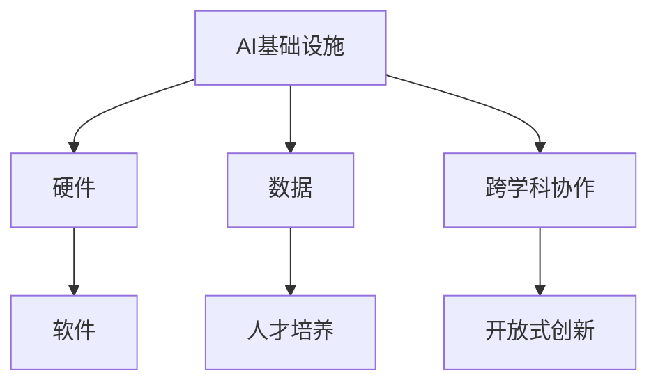

                 

# AI 2.0 时代的人才基础设施

## 1. 背景介绍

随着人工智能技术的飞速发展，我们已经进入了AI 2.0时代。在这个时代，人工智能不仅是科学家和技术人员的工具，更成为了各行各业的核心基础设施。这使得对AI人才的需求急剧增加，同时也带来了人才基础设施建设的巨大挑战。本文将系统探讨AI 2.0时代的人才基础设施，探讨其在学术研究、企业应用、教育培训等方面的重要性和关键环节。

## 2. 核心概念与联系

### 2.1 核心概念概述

在AI 2.0时代，人工智能不再仅仅是一种技术手段，而是一种全方位的基础设施。这一概念涉及以下核心概念：

- **AI基础设施**：指由硬件、软件、数据和人才等组成的基础设施体系，用于支持AI技术的应用和创新。
- **人才基础设施**：指用于培养和吸引AI领域人才的教育体系、培训计划、研究机构、企业环境等。
- **跨学科协作**：AI涉及计算机科学、数学、统计学、医学、心理学等多个学科，需要跨学科的合作与交流。
- **开放式创新**：AI技术的快速发展离不开开源社区和全球协作，开放式创新是推动AI发展的关键。

这些核心概念之间存在紧密的联系，共同构成了AI 2.0时代的人才基础设施体系。

### 2.2 核心概念原理和架构的 Mermaid 流程图



## 3. 核心算法原理 & 具体操作步骤

### 3.1 算法原理概述

AI 2.0时代的人才基础设施建设，涉及到多方面的算法原理和技术手段。以下将从教育、研究、企业应用三个层面，详细探讨核心算法原理。

### 3.2 算法步骤详解

#### 3.2.1 教育领域

在教育领域，AI 2.0时代的人才基础设施建设包括以下关键步骤：

1. **课程设计**：设计和开发针对AI的课程，涵盖机器学习、深度学习、自然语言处理、计算机视觉等核心技术。
2. **教学资源**：开发和共享高质量的教学资源，如课程讲义、实验数据集、教学视频等。
3. **实践机会**：提供实践机会，如实习、实验室、竞赛等，让学生在实际项目中应用所学知识。
4. **评估体系**：建立科学的评估体系，评估学生的学习效果和应用能力。

#### 3.2.2 研究领域

在研究领域，AI 2.0时代的人才基础设施建设包括以下关键步骤：

1. **跨学科团队**：组建跨学科的研究团队，融合不同领域的知识和方法。
2. **研究项目**：发起和参与国际性的大型AI研究项目，如AI Grand Challenges、AI for Good等。
3. **论文发表**：在顶级AI期刊和会议上发表论文，分享研究成果和经验。
4. **开源软件**：推动开源AI软件的发展，提高AI技术的可访问性和可复用性。

#### 3.2.3 企业应用

在企业应用领域，AI 2.0时代的人才基础设施建设包括以下关键步骤：

1. **数据管理**：建立数据管理系统，确保数据的安全、完整和有效。
2. **技术栈构建**：选择合适的AI技术栈，如TensorFlow、PyTorch等，构建AI应用框架。
3. **人才招聘**：通过猎头、招聘网站、学术会议等多种渠道，吸引和招聘AI人才。
4. **职业发展**：为AI人才提供职业发展路径，如技术专家、数据科学家、AI产品经理等。

### 3.3 算法优缺点

#### 3.3.1 优点

1. **跨学科协作**：AI 2.0时代的人才基础设施促进了跨学科的合作，加速了技术的突破和创新。
2. **开放式创新**：开源社区和全球协作为AI技术的进步提供了强大动力。
3. **人才多样化**：多样化的AI人才带来了丰富的视角和方法，提高了AI系统的创新性和鲁棒性。
4. **教育创新**：创新的教育模式和资源，提高了学生的学习效果和应用能力。

#### 3.3.2 缺点

1. **资源需求高**：建设AI 2.0时代的人才基础设施需要大量资源，如资金、设备、数据等。
2. **知识更新快**：AI技术更新迅速，需要不断更新和升级教育内容、技术栈等。
3. **应用门槛高**：AI技术的复杂性要求高水平的人才和基础设施，应用门槛较高。
4. **伦理和法律问题**：AI技术的应用涉及伦理和法律问题，需要建立相应的规范和标准。

### 3.4 算法应用领域

AI 2.0时代的人才基础设施应用广泛，涵盖学术研究、企业应用、教育培训等多个领域。以下列举几个典型的应用场景：

- **学术研究**：在AI Grand Challenges、AI for Good等项目中，全球顶尖研究机构和科学家共同合作，推动AI技术的发展。
- **企业应用**：谷歌、微软、亚马逊等大型企业，通过构建AI基础设施，实现业务智能化升级。
- **教育培训**：MIT、斯坦福、清华大学等大学，通过设立AI专业和课程，培养大量的AI人才。
- **开源社区**：TensorFlow、PyTorch等开源项目，吸引了全球AI爱好者的参与，推动了AI技术的普及和创新。

## 4. 数学模型和公式 & 详细讲解 & 举例说明

### 4.1 数学模型构建

在AI 2.0时代，数学模型和公式是人才基础设施的重要组成部分。以下以深度学习模型为例，探讨其数学模型构建过程。

#### 4.1.1 神经网络模型

深度学习模型通常由多个神经网络层组成，每个层包含多个神经元。神经元之间的连接权重和偏置是模型的关键参数。

#### 4.1.2 损失函数

在深度学习中，常用的损失函数包括交叉熵损失、均方误差损失等。以交叉熵损失为例，其公式如下：

$$
L(x, y) = -\frac{1}{N}\sum_{i=1}^N y_i \log(x_i) + (1-y_i) \log(1-x_i)
$$

其中，$x_i$ 表示模型对样本的真实标签$y_i$的概率预测，$N$表示样本数量。

#### 4.1.3 优化算法

深度学习的优化算法主要包括梯度下降、Adam、RMSprop等。以梯度下降为例，其更新公式如下：

$$
w_{t+1} = w_t - \eta \nabla L(w)
$$

其中，$w$表示模型参数，$\nabla L(w)$表示损失函数对参数$w$的梯度，$\eta$表示学习率。

### 4.2 公式推导过程

#### 4.2.1 神经网络模型的推导

神经网络模型由多个神经元组成，每个神经元接收输入，经过激活函数处理后输出。以一个简单的神经网络为例，其推导过程如下：

1. 输入层：接收原始输入数据$x$。
2. 隐藏层：将输入数据经过多个神经元的处理，得到中间特征表示$h$。
3. 输出层：将中间特征表示经过激活函数处理，输出最终预测结果$\hat{y}$。

### 4.3 案例分析与讲解

#### 4.3.1 图像识别任务

在图像识别任务中，使用卷积神经网络（CNN）进行模型构建和训练。以LeNet模型为例，其网络结构如下：

```
  +---+   +---+   +---+   +---+   +---+
  |   |   |   |   |   |   |   |   |   |
  |   |   |   |   |   |   |   |   |   |
  |   |   |   |   |   |   |   |   |   |
  |   |   |   |   |   |   |   |   |   |
  +---+   +---+   +---+   +---+   +---+
        |   |   |   |   |   |   |   |   |
        |   |   |   |   |   |   |   |   |
        |   |   |   |   |   |   |   |   |
        |   |   |   |   |   |   |   |   |
        +---+   +---+   +---+   +---+
```

其中，每一层由多个卷积核和池化层组成，用于提取和压缩图像特征。

#### 4.3.2 自然语言处理任务

在自然语言处理任务中，使用循环神经网络（RNN）或Transformer进行模型构建和训练。以Transformer为例，其网络结构如下：

```
  +---+   +---+   +---+   +---+   +---+
  |   |   |   |   |   |   |   |   |   |
  |   |   |   |   |   |   |   |   |   |
  |   |   |   |   |   |   |   |   |   |
  |   |   |   |   |   |   |   |   |   |
  +---+   +---+   +---+   +---+   +---+
        |   |   |   |   |   |   |   |   |
        |   |   |   |   |   |   |   |   |
        |   |   |   |   |   |   |   |   |
        |   |   |   |   |   |   |   |   |
        +---+   +---+   +---+   +---+
```

其中，每一层由多个多头自注意力机制组成，用于处理输入序列和上下文信息。

## 5. 项目实践：代码实例和详细解释说明

### 5.1 开发环境搭建

在AI 2.0时代，开发环境搭建是人才基础设施建设的重要环节。以下以深度学习为例，详细介绍开发环境搭建流程：

#### 5.1.1 选择开发环境

在选择开发环境时，需要考虑以下因素：

- **操作系统**：常用的操作系统包括Linux、Windows、macOS等。
- **硬件配置**：推荐使用GPU和TPU等高性能设备，以支持大规模深度学习模型的训练和推理。
- **开发工具**：常用的开发工具包括PyTorch、TensorFlow等。

#### 5.1.2 安装开发工具

以PyTorch为例，安装开发工具的流程如下：

```bash
# 安装PyTorch
pip install torch torchvision torchaudio

# 安装TensorFlow
pip install tensorflow

# 安装Python科学计算库
pip install numpy scipy matplotlib scikit-learn
```

### 5.2 源代码详细实现

#### 5.2.1 深度学习模型

以一个简单的卷积神经网络（CNN）为例，介绍深度学习模型的源代码实现。

```python
import torch
import torch.nn as nn
import torch.optim as optim

class CNN(nn.Module):
    def __init__(self):
        super(CNN, self).__init__()
        self.conv1 = nn.Conv2d(3, 32, kernel_size=3, stride=1, padding=1)
        self.relu = nn.ReLU()
        self.pool = nn.MaxPool2d(kernel_size=2, stride=2)
        self.fc = nn.Linear(32 * 4 * 4, 10)

    def forward(self, x):
        x = self.conv1(x)
        x = self.relu(x)
        x = self.pool(x)
        x = x.view(-1, 32 * 4 * 4)
        x = self.fc(x)
        return x

model = CNN()
criterion = nn.CrossEntropyLoss()
optimizer = optim.SGD(model.parameters(), lr=0.01)
```

#### 5.2.2 自然语言处理模型

以一个简单的Transformer为例，介绍自然语言处理模型的源代码实现。

```python
import torch
import torch.nn as nn
import torch.nn.functional as F

class Transformer(nn.Module):
    def __init__(self, d_model, nhead, num_encoder_layers, num_decoder_layers, d_ff, dropout):
        super(Transformer, self).__init__()
        self.encoder = nn.TransformerEncoderLayer(d_model, nhead, d_ff, dropout)
        self.decoder = nn.TransformerEncoderLayer(d_model, nhead, d_ff, dropout)
        self.fc = nn.Linear(d_model, 10)

    def forward(self, src, tgt):
        src = self.encoder(src)
        tgt = self.decoder(tgt)
        out = self.fc(tgt)
        return out

model = Transformer(d_model=512, nhead=8, num_encoder_layers=6, num_decoder_layers=6, d_ff=2048, dropout=0.1)
criterion = nn.CrossEntropyLoss()
optimizer = optim.Adam(model.parameters(), lr=0.0001)
```

### 5.3 代码解读与分析

#### 5.3.1 深度学习模型

在上述代码中，定义了一个简单的卷积神经网络（CNN）模型。其主要包括卷积层、ReLU激活函数、池化层和全连接层。

- **卷积层**：使用`nn.Conv2d`定义一个3x3的卷积核，步长为1，填充为1。
- **ReLU激活函数**：使用`nn.ReLU`激活函数，增强模型的非线性特性。
- **池化层**：使用`nn.MaxPool2d`池化层，对卷积层的输出进行降维处理。
- **全连接层**：使用`nn.Linear`全连接层，将池化层的输出转换为分类结果。

#### 5.3.2 自然语言处理模型

在上述代码中，定义了一个简单的Transformer模型。其主要包括Transformer编码器层和解码器层。

- **Transformer编码器层**：使用`nn.TransformerEncoderLayer`定义编码器层，包含自注意力机制、前馈神经网络、残差连接等。
- **Transformer解码器层**：使用`nn.TransformerEncoderLayer`定义解码器层，同样包含自注意力机制、前馈神经网络、残差连接等。
- **全连接层**：使用`nn.Linear`全连接层，将Transformer解码器层的输出转换为分类结果。

### 5.4 运行结果展示

#### 5.4.1 深度学习模型

在训练和测试深度学习模型时，可以使用以下代码：

```python
# 定义训练数据和标签
train_data = ...
train_labels = ...

# 定义测试数据和标签
test_data = ...
test_labels = ...

# 训练模型
for epoch in range(10):
    optimizer.zero_grad()
    outputs = model(train_data)
    loss = criterion(outputs, train_labels)
    loss.backward()
    optimizer.step()

# 测试模型
test_outputs = model(test_data)
test_loss = criterion(test_outputs, test_labels)
print('Test Loss:', test_loss)
```

#### 5.4.2 自然语言处理模型

在训练和测试自然语言处理模型时，可以使用以下代码：

```python
# 定义训练数据和标签
train_data = ...
train_labels = ...

# 定义测试数据和标签
test_data = ...
test_labels = ...

# 训练模型
for epoch in range(10):
    optimizer.zero_grad()
    outputs = model(train_data, train_data)
    loss = criterion(outputs, train_labels)
    loss.backward()
    optimizer.step()

# 测试模型
test_outputs = model(test_data, test_data)
test_loss = criterion(test_outputs, test_labels)
print('Test Loss:', test_loss)
```

## 6. 实际应用场景

### 6.1 智能客服系统

在智能客服系统中，使用AI 2.0时代的人才基础设施可以显著提升系统的智能水平和用户体验。

#### 6.1.1 智能问答

智能问答系统使用AI 2.0时代的深度学习模型和自然语言处理技术，能够理解用户的查询意图，提供准确的回答。

#### 6.1.2 对话生成

对话生成系统使用AI 2.0时代的生成模型，能够根据用户的输入生成自然的对话回复。

#### 6.1.3 知识图谱

知识图谱系统使用AI 2.0时代的数据管理系统和知识表示方法，能够构建大规模的知识图谱，提升系统的知识储备和推理能力。

### 6.2 金融风险管理

在金融风险管理领域，使用AI 2.0时代的人才基础设施可以大幅提升风险识别的准确性和效率。

#### 6.2.1 信用评分

信用评分系统使用AI 2.0时代的机器学习模型和数据管理系统，能够根据用户的历史行为数据进行信用评分。

#### 6.2.2 欺诈检测

欺诈检测系统使用AI 2.0时代的异常检测技术，能够实时监控交易数据，识别和防范欺诈行为。

#### 6.2.3 风险预警

风险预警系统使用AI 2.0时代的预测模型和数据管理系统，能够预测市场风险，提前采取应对措施。

### 6.3 医疗诊断系统

在医疗诊断领域，使用AI 2.0时代的人才基础设施可以大幅提升诊断的准确性和效率。

#### 6.3.1 影像诊断

影像诊断系统使用AI 2.0时代的深度学习模型和数据管理系统，能够自动分析医学影像，提供诊断建议。

#### 6.3.2 病历分析

病历分析系统使用AI 2.0时代的自然语言处理技术，能够自动分析患者的病历数据，提供诊断和治疗建议。

#### 6.3.3 药物研发

药物研发系统使用AI 2.0时代的数据管理系统和模拟技术，能够加速新药的研发过程，降低研发成本。

## 7. 工具和资源推荐

### 7.1 学习资源推荐

#### 7.1.1 在线课程

- Coursera：提供大量高质量的AI课程，涵盖深度学习、计算机视觉、自然语言处理等多个领域。
- edX：提供全球顶尖大学的AI课程，涵盖课程设计、教学资源、评估体系等多个方面。

#### 7.1.2 学术论文

- arXiv：提供大量的AI学术论文，涵盖前沿技术和研究方向。
- JMLR：提供顶尖的AI学术期刊，涵盖算法原理、优化方法等多个方面。

### 7.2 开发工具推荐

#### 7.2.1 深度学习框架

- PyTorch：灵活的动态计算图，适用于科研和工程应用。
- TensorFlow：生产部署方便，适用于大规模工程应用。

#### 7.2.2 数据管理系统

- Hadoop：大规模数据处理和存储系统，适用于海量数据的管理和分析。
- Spark：快速的分布式计算框架，适用于大规模数据的处理和分析。

### 7.3 相关论文推荐

#### 7.3.1 深度学习

- "Deep Learning" by Ian Goodfellow, Yoshua Bengio, Aaron Courville：全面介绍了深度学习的基本概念和算法。
- "Convolutional Neural Networks for Visual Recognition" by A. Krizhevsky, I. Sutskever, G. E. Hinton：介绍了卷积神经网络在图像识别任务中的应用。

#### 7.3.2 自然语言处理

- "Attention is All You Need" by Ashish Vaswani et al.：介绍了Transformer模型在自然语言处理任务中的应用。
- "Neural Machine Translation by Jointly Learning to Align and Translate" by D. Bahdanau, K. Cho, Y. Bengio：介绍了注意力机制在机器翻译任务中的应用。

## 8. 总结：未来发展趋势与挑战

### 8.1 研究成果总结

在AI 2.0时代，人才基础设施建设已经取得了显著进展，涵盖了教育、研究、企业应用等多个领域。以下是对当前研究成果的总结：

- **教育方面**：越来越多的大学开设了AI专业和课程，培养了大批AI人才。
- **研究方面**：全球顶尖研究机构和科学家在AI Grand Challenges等项目中合作，推动了AI技术的突破。
- **企业应用方面**：大型企业通过构建AI基础设施，实现了业务智能化升级。

### 8.2 未来发展趋势

#### 8.2.1 教育体系创新

未来的教育体系将更加注重跨学科的融合和开放式创新，培养更多具有创新能力的AI人才。

#### 8.2.2 研究项目多样化

未来的研究项目将更加注重跨领域的合作，推动AI技术的全面突破。

#### 8.2.3 企业应用深化

未来的企业应用将更加注重AI基础设施的建设，提升系统的智能化水平和效率。

#### 8.2.4 开源社区发展

未来的开源社区将更加注重多样性和包容性，推动AI技术的普及和创新。

### 8.3 面临的挑战

#### 8.3.1 资源需求高

建设AI 2.0时代的人才基础设施需要大量资源，如资金、设备、数据等。

#### 8.3.2 技术更新快

AI技术更新迅速，需要不断更新和升级教育内容、技术栈等。

#### 8.3.3 应用门槛高

AI技术的复杂性要求高水平的人才和基础设施，应用门槛较高。

#### 8.3.4 伦理和法律问题

AI技术的应用涉及伦理和法律问题，需要建立相应的规范和标准。

### 8.4 研究展望

未来的研究需要在以下几个方面寻求新的突破：

- **教育资源共享**：建立全球教育资源共享平台，提升教育资源的可访问性和可复用性。
- **研究项目开放**：推动全球AI研究项目的开放合作，促进科学研究的交流与合作。
- **企业应用创新**：推动企业AI应用创新，提升系统的智能化水平和效率。
- **技术规范制定**：制定AI技术的伦理和法律规范，保障AI技术的健康发展。

## 9. 附录：常见问题与解答

### 9.1 Q1：AI 2.0时代的人才基础设施为何重要？

A：AI 2.0时代的人才基础设施是推动AI技术发展的基础，它不仅能够培养和吸引大量的AI人才，还能够提供高质量的教育资源、研究项目和企业应用平台。这些基础设施是AI技术普及和应用的基础，也是推动AI技术不断进步的重要保障。

### 9.2 Q2：建设AI 2.0时代的人才基础设施需要哪些资源？

A：建设AI 2.0时代的人才基础设施需要大量资源，如资金、设备、数据等。具体来说，需要高性能的计算设备、大规模的数据集、高质量的教育资源等。同时，还需要跨学科的合作和全球协作，推动AI技术的全面发展。

### 9.3 Q3：如何评估AI 2.0时代的人才基础设施建设效果？

A：评估AI 2.0时代的人才基础设施建设效果，可以从以下几个方面进行：

- **教育效果**：通过评估学生的学习效果和就业情况，衡量教育体系的效果。
- **研究成果**：通过评估研究成果的数量和质量，衡量研究机构的效果。
- **企业应用**：通过评估企业AI应用的效果，衡量企业应用平台的效果。

### 9.4 Q4：建设AI 2.0时代的人才基础设施面临哪些挑战？

A：建设AI 2.0时代的人才基础设施面临以下挑战：

- **资源需求高**：需要大量资金、设备、数据等资源，资源投入较大。
- **技术更新快**：AI技术更新迅速，需要不断更新和升级教育内容、技术栈等。
- **应用门槛高**：AI技术的复杂性要求高水平的人才和基础设施，应用门槛较高。
- **伦理和法律问题**：AI技术的应用涉及伦理和法律问题，需要建立相应的规范和标准。

### 9.5 Q5：未来AI 2.0时代的人才基础设施有哪些发展方向？

A：未来AI 2.0时代的人才基础设施的发展方向包括以下几个方面：

- **教育体系创新**：注重跨学科的融合和开放式创新，培养更多具有创新能力的AI人才。
- **研究项目多样化**：推动跨领域的合作，推动AI技术的全面突破。
- **企业应用深化**：推动企业AI应用创新，提升系统的智能化水平和效率。
- **开源社区发展**：推动多样性和包容性，推动AI技术的普及和创新。

作者：禅与计算机程序设计艺术 / Zen and the Art of Computer Programming

