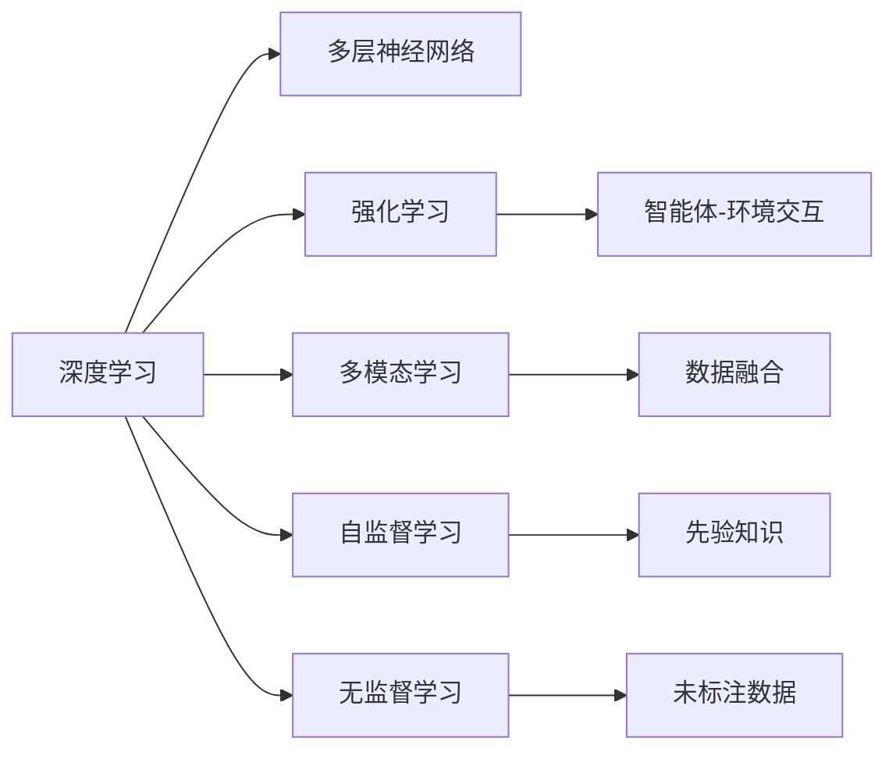

                 

## 1. 背景介绍

### 1.1 问题由来

在过去的十年中，人工智能（AI）领域取得了令人瞩目的突破，尤其在机器学习和深度学习领域。然而，随着技术的不断演进，新的挑战和机遇也在不断涌现。当前，AI 2.0 时代的到来，为人工智能技术的发展带来了新的发展方向和应用范式。

### 1.2 问题核心关键点

AI 2.0 时代的主要特点包括：

- **自动化决策**：利用深度学习和强化学习技术，实现更加智能化的决策过程。
- **多模态融合**：将视觉、听觉、文本等多种数据源进行融合，提升对复杂场景的理解能力。
- **自主学习**：通过无监督学习和自我监督学习，实现模型的自主学习和知识迁移。
- **伦理与可解释性**：重视模型的可解释性和伦理考量，确保模型的决策过程透明和可追溯。

## 2. 核心概念与联系

### 2.1 核心概念概述

为了更好地理解 AI 2.0 时代的创新与发展，我们需要理解以下几个核心概念：

- **深度学习**：利用多层神经网络进行数据表示学习和模式识别。
- **强化学习**：通过智能体与环境交互，不断优化策略，以实现特定目标。
- **多模态学习**：将视觉、文本、语音等多种数据源进行综合处理和分析。
- **自监督学习**：利用未标注数据进行学习，从而获得先验知识。
- **无监督学习**：从未标注数据中学习模式和结构，用于模型初始化或数据预处理。

### 2.2 核心概念原理和架构的 Mermaid 流程图



## 3. 核心算法原理 & 具体操作步骤

### 3.1 算法原理概述

AI 2.0 时代的创新主要集中在以下几个方面：

- **自动化决策**：利用深度学习和强化学习技术，构建能够自主决策的系统。
- **多模态融合**：通过将视觉、文本、语音等多种数据源进行融合，提升模型的感知能力。
- **自主学习**：通过自监督学习和无监督学习，实现模型的自主学习和知识迁移。
- **可解释性**：利用可解释性技术，提升模型的透明性和可解释性。

### 3.2 算法步骤详解

以下是对 AI 2.0 时代核心算法的详细步骤讲解：

1. **自动化决策**：
    - 收集大量标记数据，构建训练集。
    - 选择适当的神经网络结构，如卷积神经网络（CNN）或循环神经网络（RNN）。
    - 训练神经网络，调整网络参数以最小化损失函数。
    - 使用训练好的神经网络进行预测，并根据预测结果进行决策。

2. **多模态融合**：
    - 收集不同模态的数据源，如文本、图像、音频等。
    - 对不同模态的数据进行预处理，如文本分词、图像预处理等。
    - 选择适当的融合算法，如特征融合、特征向量拼接等。
    - 训练多模态模型，并使用模型进行预测和决策。

3. **自主学习**：
    - 收集未标注数据，构建自监督学习任务。
    - 选择适当的自监督学习算法，如自回归语言模型（LM）或自编码器（AE）。
    - 训练自监督模型，获取先验知识。
    - 将先验知识与有监督学习任务相结合，进行迁移学习。

4. **可解释性**：
    - 收集训练数据，并标记输入输出关系。
    - 选择适当的可解释性算法，如LIME、SHAP等。
    - 训练可解释性模型，生成可解释的特征或规则。
    - 使用可解释性模型辅助决策过程，提高决策透明度。

### 3.3 算法优缺点

AI 2.0 时代的核心算法具有以下优点：

- **高效性**：自动化决策和自主学习能够高效地处理大量数据。
- **鲁棒性**：多模态融合提高了模型的泛化能力。
- **透明性**：可解释性提升了模型的透明度和可信度。

同时，这些算法也存在以下缺点：

- **高计算资源需求**：深度学习和强化学习需要大量计算资源。
- **数据依赖**：无监督学习需要大量未标注数据。
- **复杂性**：多模态融合和自主学习算法复杂，实现难度较大。

### 3.4 算法应用领域

AI 2.0 时代的算法主要应用于以下几个领域：

- **自动驾驶**：利用多模态融合和自主学习，实现车辆自主决策。
- **医疗诊断**：利用深度学习和自监督学习，提升诊断精度。
- **金融预测**：利用多模态融合和自动化决策，实现市场预测。
- **智能推荐**：利用自监督学习和无监督学习，实现个性化推荐。
- **安防监控**：利用多模态融合和可解释性，提升安全检测能力。

## 4. 数学模型和公式 & 详细讲解 & 举例说明

### 4.1 数学模型构建

在 AI 2.0 时代，我们常常使用以下数学模型：

- **卷积神经网络（CNN）**：
  $$
  f(x) = \sum_{i=1}^{n} w_i h_i(x) + b
  $$
  其中 $x$ 为输入特征，$h_i(x)$ 为卷积核，$w_i$ 为卷积核权重，$b$ 为偏置。

- **循环神经网络（RNN）**：
  $$
  h_t = \tanh(W h_{t-1} + U x_t + b)
  $$
  其中 $h_t$ 为隐藏状态，$W$ 和 $U$ 为权重矩阵，$b$ 为偏置。

- **自监督学习（自回归语言模型）**：
  $$
  P(x_1,...,x_n) = \prod_{t=1}^n P(x_t | x_1,...,x_{t-1})
  $$
  其中 $x_t$ 为输入序列，$P(x_t | x_1,...,x_{t-1})$ 为条件概率。

### 4.2 公式推导过程

对于卷积神经网络（CNN），其激活函数的推导过程如下：

$$
f(x) = \sum_{i=1}^{n} w_i h_i(x) + b
$$

假设激活函数为 ReLU，则有：

$$
h_i(x) = max(0, x * W_i + b_i)
$$

其中 $W_i$ 和 $b_i$ 分别为卷积核和偏置。

### 4.3 案例分析与讲解

以自监督学习中的自回归语言模型为例，其基本思想是通过预测文本中的下一个词，来学习文本的语法和语义。

假设输入序列为 $x_1,...,x_n$，则模型的预测概率为：

$$
P(x_1,...,x_n) = \prod_{t=1}^n P(x_t | x_1,...,x_{t-1})
$$

其中 $P(x_t | x_1,...,x_{t-1})$ 表示在给定前 $t-1$ 个词的情况下，预测第 $t$ 个词的概率。

## 5. 项目实践：代码实例和详细解释说明

### 5.1 开发环境搭建

1. **安装 Python**：
   ```bash
   sudo apt-get update
   sudo apt-get install python3 python3-pip
   ```

2. **安装 TensorFlow**：
   ```bash
   pip install tensorflow
   ```

3. **安装 Keras**：
   ```bash
   pip install keras
   ```

### 5.2 源代码详细实现

以下是一个简单的多模态融合示例代码：

```python
import tensorflow as tf
from tensorflow.keras.layers import Input, Conv2D, MaxPooling2D, Flatten, Dense, Dropout, concatenate

# 定义输入
input_text = Input(shape=(None,))
input_image = Input(shape=(150, 150, 3))

# 定义卷积层
conv_text = Conv2D(32, 3, activation='relu')(input_text)
pool_text = MaxPooling2D(pool_size=(2, 2))(conv_text)
flatten_text = Flatten()(pool_text)

conv_image = Conv2D(32, 3, activation='relu')(input_image)
pool_image = MaxPooling2D(pool_size=(2, 2))(conv_image)
flatten_image = Flatten()(pool_image)

# 定义全连接层
dense_text = Dense(64, activation='relu')(flatten_text)
dense_image = Dense(64, activation='relu')(flatten_image)

# 定义输出层
output = concatenate([dense_text, dense_image])
output = Dense(10, activation='softmax')(output)

# 定义模型
model = tf.keras.Model(inputs=[input_text, input_image], outputs=output)
model.compile(optimizer='adam', loss='categorical_crossentropy', metrics=['accuracy'])

# 训练模型
model.fit([train_text, train_image], train_labels, epochs=10, batch_size=32)

# 预测
test_output = model.predict([test_text, test_image])
```

### 5.3 代码解读与分析

该代码实现了一个简单的多模态融合模型，结合了文本和图像数据进行分类。

- `Input`：定义输入层。
- `Conv2D`：定义卷积层，用于提取文本和图像特征。
- `MaxPooling2D`：定义池化层，用于减小特征图的尺寸。
- `Flatten`：定义展平层，将池化层输出的特征图展平为一维向量。
- `Dense`：定义全连接层，用于学习特征映射。
- `concatenate`：定义连接层，将文本和图像的全连接层输出连接起来。
- `Model`：定义模型，将输入和输出连接起来。
- `compile`：编译模型，指定优化器和损失函数。
- `fit`：训练模型，指定训练数据和标签。
- `predict`：预测，对测试数据进行分类。

## 6. 实际应用场景

### 6.1 自动驾驶

自动驾驶是 AI 2.0 时代的典型应用之一，通过将多模态融合和自主学习技术应用于汽车驾驶，实现车辆的自主决策和导航。

### 6.2 医疗诊断

在医疗领域，利用深度学习和自监督学习技术，可以提升医疗诊断的精度和效率。例如，利用图像数据进行疾病预测和分类。

### 6.3 金融预测

金融领域中，利用多模态融合和自动化决策技术，可以进行市场预测和风险评估。例如，结合股票价格、交易量、新闻等多种数据源进行股票预测。

### 6.4 智能推荐

在电商领域，利用自监督学习和无监督学习技术，可以实现个性化推荐。例如，根据用户浏览历史和行为数据，推荐相关商品。

### 6.5 安防监控

在安防领域，利用多模态融合和可解释性技术，可以提升安全检测能力。例如，结合视频和音频数据进行异常行为检测。

## 7. 工具和资源推荐

### 7.1 学习资源推荐

1. **Coursera**：提供深度学习和人工智能相关的课程，涵盖从基础到高级的内容。
2. **DeepLearning.AI**：提供深度学习相关的课程，包括深度学习框架、模型构建、优化算法等。
3. **Kaggle**：提供数据科学和机器学习竞赛，帮助学习者实践和提高技能。

### 7.2 开发工具推荐

1. **TensorFlow**：开源深度学习框架，支持多设备、多语言和多种模型。
2. **PyTorch**：开源深度学习框架，支持动态计算图和快速迭代。
3. **Keras**：高级神经网络API，易于上手，支持多种深度学习框架。

### 7.3 相关论文推荐

1. **Deep Learning**：Goodfellow 等著，全面介绍了深度学习的基本概念、算法和应用。
2. **Reinforcement Learning**：Sutton 和 Barto 著，介绍了强化学习的基本原理和应用。
3. **Multimodal Learning**：Pal 和 Mohan 著，介绍了多模态学习的最新进展和应用。

## 8. 总结：未来发展趋势与挑战

### 8.1 研究成果总结

AI 2.0 时代的创新与发展，主要体现在以下几个方面：

- **自动化决策**：通过深度学习和强化学习技术，实现更加智能化的决策过程。
- **多模态融合**：将视觉、文本、语音等多种数据源进行融合，提升模型的感知能力。
- **自主学习**：通过自监督学习和无监督学习，实现模型的自主学习和知识迁移。
- **可解释性**：利用可解释性技术，提升模型的透明度和可信度。

### 8.2 未来发展趋势

AI 2.0 时代的未来发展趋势包括：

- **更大规模的模型**：随着计算资源的增加，模型的参数量将进一步增大，模型的性能也将不断提高。
- **更广泛的应用**：AI 2.0 技术将应用到更多领域，如医疗、金融、安防等。
- **更加智能的系统**：通过结合多种 AI 技术，构建更加智能、自主的系统。
- **更高的伦理和可解释性**：AI 2.0 技术将更加注重伦理和可解释性，确保模型的透明性和可信度。

### 8.3 面临的挑战

AI 2.0 技术在发展过程中，仍面临以下挑战：

- **高计算资源需求**：深度学习和强化学习需要大量计算资源。
- **数据依赖**：无监督学习需要大量未标注数据。
- **复杂性**：多模态融合和自主学习算法复杂，实现难度较大。
- **伦理和可解释性**：AI 2.0 技术需要注重伦理和可解释性，确保模型的透明性和可信度。

### 8.4 研究展望

未来 AI 2.0 技术的研究方向包括：

- **高效计算**：开发更加高效的计算框架和算法，降低计算资源需求。
- **数据增强**：通过数据增强技术，提升模型对未标注数据的利用效率。
- **模型压缩**：通过模型压缩技术，减小模型尺寸，提高计算效率。
- **可解释性增强**：开发更加可解释的模型，提高模型的透明度和可信度。
- **伦理和安全性**：研究 AI 技术的伦理和安全问题，确保模型的透明性和可信度。

## 9. 附录：常见问题与解答

**Q1: AI 2.0 时代的主要特点是什么？**

A: AI 2.0 时代的主要特点包括自动化决策、多模态融合、自主学习和可解释性。

**Q2: 如何构建多模态融合模型？**

A: 多模态融合模型的构建包括以下步骤：

1. 收集不同模态的数据源。
2. 对不同模态的数据进行预处理。
3. 选择适当的融合算法。
4. 训练多模态模型。

**Q3: AI 2.0 时代如何提升模型的可解释性？**

A: 提升模型可解释性的方法包括：

1. 选择适当的可解释性算法。
2. 训练可解释性模型。
3. 使用可解释性模型辅助决策过程。

**Q4: 什么是自监督学习？**

A: 自监督学习是一种通过利用未标注数据进行学习的方法，从数据中学习模式和结构。

**Q5: 如何实现自动驾驶中的多模态融合？**

A: 实现自动驾驶中的多模态融合，可以采用以下方法：

1. 收集多模态数据，如雷达、摄像头和GPS数据。
2. 对不同模态的数据进行预处理。
3. 选择适当的融合算法，如特征融合和深度融合。
4. 训练多模态模型，并进行融合预测。

---

作者：禅与计算机程序设计艺术 / Zen and the Art of Computer Programming

