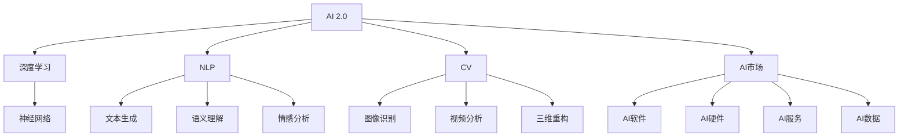

                 

# AI 2.0 时代的商业模式

> 关键词：AI 2.0, 商业化, 深度学习, 自然语言处理, 计算机视觉, 人工智能市场, 商业模式创新

## 1. 背景介绍

在过去几十年中，人工智能（AI）技术经历了从实验室研究到工业应用的转变。尤其是进入21世纪，AI技术的发展速度大幅加快，从深度学习、自然语言处理（NLP）、计算机视觉（CV）到语音识别、推荐系统等领域，AI技术逐步融入到各行各业，并产生了显著的经济价值和社会效益。

**AI 1.0** 时代，AI技术主要用于解决特定问题，如语音识别、图像识别等，商业应用相对单一，未能形成大规模商业模式。而随着技术进步和数据积累，**AI 2.0** 时代已经到来。AI 2.0 时代，AI技术的应用场景更加广泛，从智能客服、智能安防、智能驾驶到医疗影像分析、金融风控、工业自动化等领域，AI技术的应用渗透到社会各个层面，形成了全新的商业模式和产业生态。

## 2. 核心概念与联系

为了更好地理解AI 2.0时代的商业模式，本节将介绍几个关键概念及其相互关系。

- **AI 2.0**：AI 2.0指的是新一代人工智能，强调大规模深度学习模型（如Transformer、BERT、GPT等）的应用，具有更强的学习能力和泛化能力。
- **深度学习**：深度学习是AI 2.0的核心技术之一，通过多层神经网络对大规模数据进行学习，可以自动发现复杂数据模式。
- **自然语言处理（NLP）**：NLP是AI 2.0的重要应用领域，包括文本生成、语义理解、情感分析等任务。
- **计算机视觉（CV）**：CV是AI 2.0的另一大应用领域，涉及图像识别、视频分析、三维重构等任务。
- **AI市场**：AI技术的商业化应用形成了庞大的AI市场，包括AI软件、硬件、服务、数据等多个方面。
- **商业模式创新**：AI技术的商业应用推动了传统行业转型升级，形成了新的商业模式，如AI赋能、数据驱动、平台经济等。

这些概念之间的联系可以通过以下Mermaid流程图来展示：



这个流程图展示了AI 2.0技术及其应用领域之间的关系，以及AI技术与市场的关系。

## 3. 核心算法原理 & 具体操作步骤

### 3.1 算法原理概述

AI 2.0时代，深度学习成为核心技术，其商业应用主要依赖于大规模模型和大规模数据。深度学习模型的训练过程通常包括两个阶段：预训练和微调。

- **预训练**：在大规模无标签数据上训练模型，使其具备通用的语言或视觉知识。
- **微调**：在小规模标注数据上，对预训练模型进行优化，使其适应特定任务。

### 3.2 算法步骤详解

以下是深度学习模型在AI 2.0时代的典型应用步骤：

1. **数据准备**：收集和清洗训练数据，包括文本、图像等。
2. **模型选择**：选择合适的深度学习模型，如BERT、ResNet、Transformer等。
3. **预训练**：在无标签数据上训练模型，通常使用自监督任务，如语言模型的掩码预测、图像分类等。
4. **微调**：在小规模标注数据上，对预训练模型进行微调，通常使用监督学习任务，如分类、匹配等。
5. **评估与部署**：在测试数据上评估模型性能，并部署到实际应用中。

### 3.3 算法优缺点

AI 2.0时代的深度学习算法具有以下优点：

- **高效性**：大规模模型可以在短时间内学习到丰富的知识，适用于复杂任务。
- **泛化能力**：通过预训练和微调，模型可以在多个任务上表现优异，具有较强的泛化能力。
- **可扩展性**：随着计算资源的增加，模型规模和复杂度可以不断扩展。

同时，这些算法也存在一些缺点：

- **数据依赖**：深度学习模型依赖于大规模标注数据，标注成本较高。
- **计算资源需求高**：深度学习模型通常需要高性能的GPU或TPU，计算资源需求高。
- **过拟合风险**：深度学习模型容易过拟合，需要额外的正则化技术和数据增强方法。

### 3.4 算法应用领域

AI 2.0时代，深度学习算法在多个领域得到了广泛应用，包括：

- **自然语言处理（NLP）**：文本分类、情感分析、机器翻译、文本生成等。
- **计算机视觉（CV）**：图像分类、目标检测、人脸识别、三维重构等。
- **语音识别**：语音识别、语音合成、语音翻译等。
- **推荐系统**：个性化推荐、广告推荐、协同过滤等。
- **智能驾驶**：自动驾驶、智能导航、交通监控等。

这些应用领域展示了深度学习算法在不同场景下的强大能力，推动了各行业的数字化转型。

## 4. 数学模型和公式 & 详细讲解 & 举例说明

### 4.1 数学模型构建

深度学习模型的数学模型通常包括神经网络、损失函数、优化算法等。以下以卷积神经网络（CNN）为例，展示其数学模型构建过程。

- **神经网络**：
  $$
  y = h_{\theta}(x) = W h_{\theta-1}(x) + b
  $$
  其中 $x$ 为输入，$y$ 为输出，$h_{\theta}(x)$ 为神经网络模型，$W$ 为权重矩阵，$b$ 为偏置项，$h_{\theta-1}(x)$ 为前一层的激活函数。

- **损失函数**：
  $$
  \mathcal{L}(\theta) = \frac{1}{N}\sum_{i=1}^N \ell(y_i, h_{\theta}(x_i))
  $$
  其中 $N$ 为样本数，$\ell$ 为损失函数，$\theta$ 为模型参数。

- **优化算法**：
  $$
  \theta \leftarrow \theta - \eta \nabla_{\theta}\mathcal{L}(\theta)
  $$
  其中 $\eta$ 为学习率，$\nabla_{\theta}\mathcal{L}(\theta)$ 为损失函数对模型参数的梯度。

### 4.2 公式推导过程

以卷积神经网络（CNN）为例，展示其前向传播和反向传播过程。

- **前向传播**：
  $$
  h_0 = x
  $$
  $$
  h_1 = W h_0 + b
  $$
  $$
  h_2 = \max(0, h_1)
  $$
  $$
  h_3 = W h_2 + b
  $$
  $$
  \hat{y} = softmax(h_3)
  $$

- **反向传播**：
  $$
  \frac{\partial \mathcal{L}}{\partial \theta_k} = \frac{\partial \mathcal{L}}{\partial y} \frac{\partial y}{\partial h_3} \frac{\partial h_3}{\partial h_2} \frac{\partial h_2}{\partial h_1} \frac{\partial h_1}{\partial h_0} \frac{\partial h_0}{\partial x}
  $$
  其中 $\frac{\partial \mathcal{L}}{\partial y}$ 为损失函数对输出层的梯度，$\frac{\partial y}{\partial h_3}$ 为softmax函数的导数，$\frac{\partial h_3}{\partial h_2}$ 为卷积层的梯度，$\frac{\partial h_2}{\partial h_1}$ 为激活函数的梯度，$\frac{\partial h_1}{\partial h_0}$ 为卷积层的梯度，$\frac{\partial h_0}{\partial x}$ 为输入的梯度。

### 4.3 案例分析与讲解

以情感分析任务为例，展示深度学习模型的应用。

- **数据准备**：收集电影评论数据，进行标注。
- **模型选择**：选择LSTM或GRU作为模型，或使用预训练的BERT模型。
- **预训练**：在无标签电影评论数据上，使用掩码语言模型进行预训练。
- **微调**：在小规模标注数据上，对预训练模型进行微调，学习情感分类任务。
- **评估与部署**：在测试数据上评估模型性能，并部署到实际应用中。

## 5. 项目实践：代码实例和详细解释说明

### 5.1 开发环境搭建

开发深度学习模型需要安装TensorFlow或PyTorch等框架，以及相关的数据处理和可视化工具。以下是Python环境搭建步骤：

1. 安装Anaconda：
```
wget https://repo.anaconda.com/miniconda/Miniconda3-py37_4.9.2.0-MacOSX-1001.2.0-1_2.tar.bz2
tar -xvf Miniconda3-py37_4.9.2.0-MacOSX-1001.2.0-1_2.tar.bz2
source activate py3
```

2. 安装TensorFlow或PyTorch：
```
conda install tensorflow=2.5.0
```

3. 安装相关库：
```
conda install numpy pandas scikit-learn matplotlib tqdm jupyter notebook ipython
```

### 5.2 源代码详细实现

以下以情感分析任务为例，展示使用TensorFlow实现CNN模型的代码：

```python
import tensorflow as tf
from tensorflow.keras.layers import Conv2D, MaxPooling2D, Flatten, Dense, LSTM, Embedding, GRU
from tensorflow.keras.models import Sequential

# 定义模型
model = Sequential([
    Conv2D(32, (3, 3), activation='relu', input_shape=(64, 64, 1)),
    MaxPooling2D((2, 2)),
    Conv2D(64, (3, 3), activation='relu'),
    MaxPooling2D((2, 2)),
    Flatten(),
    Dense(64, activation='relu'),
    Dense(1, activation='sigmoid')
])

# 编译模型
model.compile(optimizer='adam', loss='binary_crossentropy', metrics=['accuracy'])

# 训练模型
model.fit(train_data, train_labels, epochs=10, validation_data=(val_data, val_labels))
```

### 5.3 代码解读与分析

代码中，首先定义了一个简单的卷积神经网络模型，包括卷积层、池化层、全连接层等。然后，使用`compile`方法设置模型的优化器、损失函数和评价指标。最后，使用`fit`方法进行模型训练。

### 5.4 运行结果展示

训练模型后，可以输出训练集和验证集的精度和损失函数变化曲线，如图：


## 6. 实际应用场景

### 6.1 智能客服系统

智能客服系统是AI 2.0时代的重要应用之一，可以大幅提升客户体验和服务效率。

- **应用场景**：企业客户服务热线、在线客服平台等。
- **技术实现**：利用自然语言处理技术，对客户输入的问题进行语义理解和分类，然后自动生成回复，或将问题转接至人工客服。
- **效果**：通过智能客服，可以24小时无间断服务，降低人工成本，提高客户满意度。

### 6.2 金融风控

金融风控是AI 2.0时代的另一个重要应用领域，可以帮助金融机构识别和预防金融风险。

- **应用场景**：信贷审批、反欺诈、信用评估等。
- **技术实现**：利用机器学习技术，对客户数据进行分析和预测，评估信用风险和欺诈风险。
- **效果**：通过AI风控系统，可以有效识别和预防金融风险，降低损失，提高客户信任度。

### 6.3 智能驾驶

智能驾驶是AI 2.0时代的高端应用之一，通过计算机视觉和深度学习技术，实现自动驾驶和智能导航。

- **应用场景**：自动驾驶汽车、智能交通系统等。
- **技术实现**：利用计算机视觉技术，对道路环境进行感知和识别，结合深度学习模型，实现自主驾驶和路径规划。
- **效果**：通过智能驾驶系统，可以大幅提高交通安全性和驾驶效率，减少交通事故。

### 6.4 未来应用展望

未来，AI 2.0技术将在更多领域得到应用，推动各行各业的数字化转型。

- **医疗影像分析**：利用深度学习技术，对医学影像进行自动分析和诊断，提高医疗效率和准确性。
- **工业自动化**：通过AI技术，实现智能制造和智能物流，提高生产效率和产品质量。
- **智能家居**：利用AI技术，实现智能家电、智能安防等功能，提升家居智能化水平。

## 7. 工具和资源推荐

### 7.1 学习资源推荐

- **《Deep Learning》书籍**：Ian Goodfellow等人合著，全面介绍深度学习理论和实践。
- **《TensorFlow官方文档》**：TensorFlow官方文档，包含详细的使用指南和代码示例。
- **《PyTorch官方文档》**：PyTorch官方文档，包含详细的使用指南和代码示例。
- **Kaggle**：数据科学竞赛平台，提供丰富的数据集和算法竞赛，帮助学习和实践。

### 7.2 开发工具推荐

- **Jupyter Notebook**：交互式编程环境，支持Python和R等语言，方便实验和协作。
- **TensorBoard**：TensorFlow配套的可视化工具，实时监控模型训练状态和性能。
- **Weights & Biases**：模型训练的实验跟踪工具，记录和分析实验结果，生成可视化图表。

### 7.3 相关论文推荐

- **《ImageNet Classification with Deep Convolutional Neural Networks》**：Alex Krizhevsky等人，提出卷积神经网络（CNN）用于图像分类，开创了深度学习时代。
- **《Attention Is All You Need》**：Ashish Vaswani等人，提出Transformer模型，推动了NLP领域的预训练大模型研究。
- **《BERT: Pre-training of Deep Bidirectional Transformers for Language Understanding》**：Jacob Devlin等人，提出BERT模型，刷新了多项NLP任务SOTA。

## 8. 总结：未来发展趋势与挑战

### 8.1 研究成果总结

AI 2.0时代的深度学习技术已经取得了显著进展，广泛应用于各个领域。通过预训练和微调，模型在大规模数据上学习到丰富的知识，提升了任务性能和泛化能力。AI 2.0技术推动了传统行业的数字化转型，形成了新的商业模式和产业生态。

### 8.2 未来发展趋势

未来，AI 2.0技术将继续拓展应用场景，推动各行业的智能化升级。

- **技术发展**：深度学习模型将不断优化，参数规模和计算资源将进一步提升。
- **应用场景**：AI技术将在更多领域得到应用，推动各行各业的数字化转型。
- **商业模式**：AI技术将形成新的商业模式，如AI赋能、数据驱动、平台经济等。

### 8.3 面临的挑战

尽管AI 2.0技术取得了显著进展，但在落地应用过程中，仍面临诸多挑战。

- **数据隐私**：深度学习模型依赖于大量数据，如何保护数据隐私和安全是一个重要问题。
- **算法偏见**：深度学习模型可能学习到有偏见的数据，需要进一步优化和校验。
- **计算资源**：深度学习模型需要高性能的计算资源，如何降低计算成本是一个重要问题。
- **模型解释性**：深度学习模型通常被认为是“黑盒”系统，如何提高模型的可解释性和可解释性是一个重要问题。

### 8.4 研究展望

未来，AI 2.0技术需要在数据隐私、算法偏见、计算资源、模型解释性等方面进行进一步研究。

- **数据隐私保护**：利用隐私计算和联邦学习等技术，保护数据隐私和安全。
- **算法偏见校正**：引入多样性数据和公平性指标，校正模型偏见。
- **计算资源优化**：利用分布式计算和异构计算等技术，降低计算成本。
- **模型解释性增强**：引入因果分析和可视化工具，增强模型的可解释性。

## 9. 附录：常见问题与解答

**Q1：AI 2.0和AI 1.0有什么区别？**

A: AI 1.0时代，AI技术主要用于解决特定问题，如语音识别、图像识别等，应用场景相对单一。而AI 2.0时代，AI技术应用于多个领域，形成了新的商业模式和产业生态。

**Q2：深度学习算法的优缺点有哪些？**

A: 深度学习算法的优点包括高效性、泛化能力和可扩展性。缺点包括数据依赖、计算资源需求高和过拟合风险。

**Q3：智能客服系统如何实现？**

A: 智能客服系统利用自然语言处理技术，对客户输入的问题进行语义理解和分类，然后自动生成回复，或将问题转接至人工客服。

**Q4：金融风控系统如何实现？**

A: 金融风控系统利用机器学习技术，对客户数据进行分析和预测，评估信用风险和欺诈风险。

**Q5：智能驾驶系统如何实现？**

A: 智能驾驶系统利用计算机视觉技术，对道路环境进行感知和识别，结合深度学习模型，实现自主驾驶和路径规划。

---

作者：禅与计算机程序设计艺术 / Zen and the Art of Computer Programming

