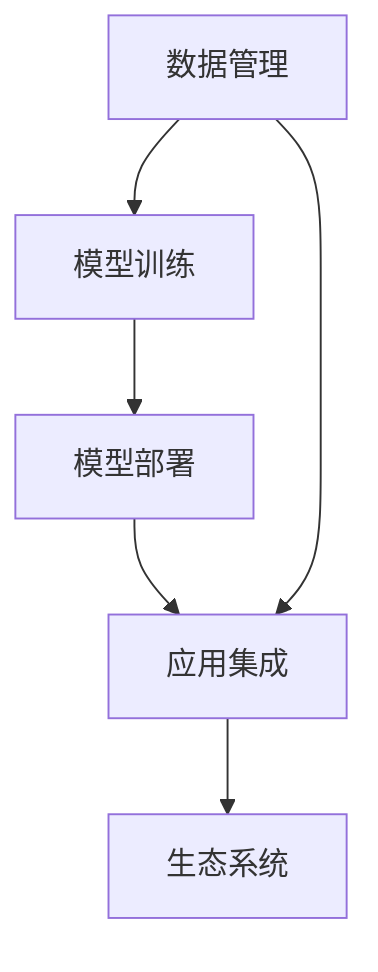

                 

# AI 2.0 时代的基础设施建设：支撑快速发展的关键要素

## 1. 背景介绍

### 1.1 问题由来
随着人工智能（AI）技术的飞速发展，AI 2.0时代已经到来。这一时代，AI技术将从学术研究走向各行各业，从单一功能模块集成到复杂系统构建，从通用工具到定制解决方案，AI技术正逐渐成为各行各业的基础设施。因此，建设一套高效、灵活、可扩展的基础设施，支撑AI技术的高效发展成为当务之急。

在AI 2.0时代，数据、算法、模型、算力、应用场景等关键要素都发生了重大变化。传统的数据中心、云计算平台、开发框架等基础设施已经难以满足AI技术发展的需求。为此，本文旨在探讨AI 2.0时代的基础设施建设，包括数据管理、模型训练、应用部署等关键要素，为企业和开发者提供参考。

### 1.2 问题核心关键点
AI 2.0时代的基础设施建设需要关注以下几个关键点：
1. **数据管理**：如何高效收集、存储、处理和标注海量数据。
2. **模型训练**：如何构建高效、可扩展、可复用的模型训练体系。
3. **模型部署**：如何实现模型的快速部署、监控和优化。
4. **应用集成**：如何将AI模型集成到实际应用场景中，实现智能化的业务价值。
5. **生态系统**：如何构建一个开放的AI生态系统，促进技术的共享和创新。

## 2. 核心概念与联系

### 2.1 核心概念概述

AI 2.0时代的基础设施建设涉及多个核心概念，这些概念之间相互联系，共同构成了AI技术的生态体系。

- **数据管理**：指数据从收集、存储、处理到标注的全生命周期管理。包括数据湖、数据仓库、数据标注平台等技术。
- **模型训练**：指构建高效、可扩展、可复用的模型训练体系。包括分布式训练框架、自动化训练平台等技术。
- **模型部署**：指将训练好的模型部署到生产环境中，实现实时推理和优化。包括模型服务、容器化部署、自动弹性伸缩等技术。
- **应用集成**：指将AI模型集成到实际应用场景中，实现智能化业务价值。包括API接口、中台集成、微服务架构等技术。
- **生态系统**：指构建一个开放的AI生态系统，促进技术的共享和创新。包括开源社区、API市场、云计算服务等。

这些概念之间的联系可以用以下Mermaid流程图来展示：



这个流程图展示了大规模AI应用所需的关键环节及其相互关系：

1. **数据管理**：提供基础的数据支持，是模型训练的前提。
2. **模型训练**：利用数据进行模型训练，获得高性能的模型。
3. **模型部署**：将模型部署到生产环境，实现实时推理。
4. **应用集成**：将模型集成到实际应用场景中，实现智能化业务价值。
5. **生态系统**：促进技术的共享和创新，推动AI技术的快速发展和应用。

## 3. 核心算法原理 & 具体操作步骤
### 3.1 算法原理概述

AI 2.0时代的基础设施建设涉及多个关键算法的原理和步骤，本节将详细介绍这些核心算法及其应用。

- **数据管理**：采用分布式存储和处理技术，如Hadoop、Spark等，高效管理海量数据。
- **模型训练**：利用分布式训练框架，如TensorFlow、PyTorch等，实现高效的模型训练。
- **模型部署**：采用容器化部署技术，如Docker、Kubernetes等，实现模型的快速部署和弹性伸缩。
- **应用集成**：采用API接口、微服务架构等技术，实现AI模型的集成和应用。
- **生态系统**：利用开源社区、API市场等技术，促进技术的共享和创新。

### 3.2 算法步骤详解

AI 2.0时代的基础设施建设可以分为以下几个步骤：

**Step 1: 数据管理**
- 选择合适的数据管理工具，如Hadoop、Spark等。
- 收集和存储数据，建立数据仓库和数据湖。
- 处理数据，进行数据清洗、转换、标注等操作。

**Step 2: 模型训练**
- 选择合适的分布式训练框架，如TensorFlow、PyTorch等。
- 设计模型架构，选择合适的优化算法。
- 进行模型训练，监控训练进度和性能。
- 保存和备份训练好的模型。

**Step 3: 模型部署**
- 选择合适的容器化部署工具，如Docker、Kubernetes等。
- 编写部署脚本，将模型部署到生产环境。
- 实现弹性伸缩，根据负载自动调整资源。
- 监控模型性能，及时发现和解决问题。

**Step 4: 应用集成**
- 选择合适的API接口、微服务架构等技术。
- 实现API接口，提供模型服务。
- 集成到应用中，实现业务智能化。
- 持续优化和迭代，提升应用性能。

**Step 5: 生态系统构建**
- 选择合适的开源社区和API市场。
- 发布模型和工具，促进技术共享。
- 引入第三方工具和组件，提升技术水平。
- 建立合作伙伴关系，共同推动技术发展。

### 3.3 算法优缺点

AI 2.0时代的基础设施建设具有以下优点：
1. 高效性：采用分布式存储和处理技术，高效管理海量数据。
2. 可扩展性：采用分布式训练框架，实现高效、可扩展的模型训练。
3. 快速部署：采用容器化部署技术，实现模型的快速部署和弹性伸缩。
4. 集成方便：采用API接口、微服务架构等技术，实现AI模型的集成和应用。
5. 开放性：构建开放的生态系统，促进技术的共享和创新。

同时，也存在一些缺点：
1. 复杂度：基础设施建设涉及多个环节，技术难度较高。
2. 成本：建设和维护基础设施需要投入大量人力和财力。
3. 安全性：基础设施需要保证数据和模型的安全性，面临诸多挑战。

尽管如此，AI 2.0时代的基础设施建设仍然是不可或缺的一环，对于推动AI技术的快速发展具有重要意义。

### 3.4 算法应用领域

AI 2.0时代的基础设施建设涉及多个应用领域，包括但不限于以下几个方面：

1. **医疗健康**：利用AI模型进行疾病诊断、基因分析、药物研发等。
2. **金融科技**：利用AI模型进行风险评估、智能投顾、欺诈检测等。
3. **智能制造**：利用AI模型进行质量控制、设备维护、生产优化等。
4. **智慧城市**：利用AI模型进行交通管理、环境保护、公共安全等。
5. **零售电商**：利用AI模型进行客户分析、个性化推荐、库存管理等。

这些应用领域涵盖了各行各业，展示了AI基础设施建设的广阔前景和巨大价值。

## 4. 数学模型和公式 & 详细讲解 & 举例说明（备注：数学公式请使用latex格式，latex嵌入文中独立段落使用 $$，段落内使用 $)
### 4.1 数学模型构建

AI 2.0时代的基础设施建设涉及多个数学模型，本节将详细介绍这些核心模型及其应用。

- **数据管理模型**：采用分布式存储和处理技术，如Hadoop、Spark等，建立数据仓库和数据湖。
- **模型训练模型**：采用分布式训练框架，如TensorFlow、PyTorch等，实现高效的模型训练。
- **模型部署模型**：采用容器化部署技术，如Docker、Kubernetes等，实现模型的快速部署和弹性伸缩。
- **应用集成模型**：采用API接口、微服务架构等技术，实现AI模型的集成和应用。
- **生态系统模型**：利用开源社区、API市场等技术，促进技术的共享和创新。

### 4.2 公式推导过程

以下我们以分布式训练框架为例，推导TensorFlow分布式训练的计算图。

在TensorFlow中，分布式训练通常通过构建计算图来实现。假设我们有一个计算图 $G(V,E)$，其中 $V$ 是节点集合，$E$ 是边集合。对于分布式训练，我们通常需要构建一个计算图 $G'(V',E')$，其中 $V'$ 是分布式节点集合，$E'$ 是分布式边集合。

假设我们有一个计算图 $G(V,E)$，其中 $V=\{v_1,v_2,\ldots,v_n\}$，$E=\{e_1,e_2,\ldots,e_m\}$。我们将其划分为 $k$ 个分布式节点，每个节点 $i$ 只处理一部分计算任务。对于节点 $i$，我们需要定义其计算能力，如CPU个数、内存大小等。

根据上述定义，我们可以构建一个新的计算图 $G'(V',E')$，其中 $V'=\{v'_1,v'_2,\ldots,v'_k\}$，$E'=\{e'_1,e'_2,\ldots,e'_m\}$。对于节点 $i$，我们可以将其计算任务 $e_j$ 分配到 $v'_i$，然后将其并行处理。

根据上述推导，我们可以写出TensorFlow分布式训练的计算图公式：

$$
G' = \{v'_1, v'_2, \ldots, v'_k\}, E' = \{e'_1, e'_2, \ldots, e'_m\}
$$

其中，$v'_i$ 表示分布式节点 $i$，$e'_j$ 表示分布式节点 $i$ 处理的计算任务 $e_j$。

### 4.3 案例分析与讲解

以TensorFlow为例，其分布式训练过程可以分为以下几个步骤：

1. 定义分布式环境：使用TensorFlow的`tf.distribute.Strategy`定义分布式环境。
2. 构建计算图：使用TensorFlow的计算图API定义计算图。
3. 分布式训练：在分布式环境中，将计算图并行处理。
4. 结果汇总：将分布式节点的计算结果汇总，得到最终的训练结果。

以下是一个简单的TensorFlow分布式训练示例：

```python
import tensorflow as tf

# 定义分布式环境
strategy = tf.distribute.Strategy(
    tf.distribute.MirroredStrategy(devices=['/device:CPU:0', '/device:CPU:1']))

# 定义计算图
with strategy.scope():
    model = tf.keras.Sequential([
        tf.keras.layers.Dense(64, activation='relu'),
        tf.keras.layers.Dense(10, activation='softmax')
    ])

# 分布式训练
dataset = tf.data.Dataset.range(10)
strategy.run(lambda x: model.train_on_batch(x, x))

# 结果汇总
result = strategy.reduce(tf.distribute.ReduceOp.SUM, model.loss(x), axis=None)
```

在上述示例中，我们使用`tf.distribute.MirroredStrategy`定义了两个CPU节点的分布式环境，并使用计算图API构建了一个简单的模型。然后，我们在分布式环境中进行模型训练，并使用`strategy.reduce`将计算结果汇总。

通过上述示例，可以看到TensorFlow分布式训练的流程和实现方法。这为我们构建高效的分布式训练体系提供了有力的支持。

## 5. 项目实践：代码实例和详细解释说明
### 5.1 开发环境搭建

在进行AI 2.0时代基础设施建设的项目实践前，我们需要准备好开发环境。以下是使用Python进行TensorFlow开发的环境配置流程：

1. 安装Anaconda：从官网下载并安装Anaconda，用于创建独立的Python环境。

2. 创建并激活虚拟环境：
```bash
conda create -n tensorflow-env python=3.8 
conda activate tensorflow-env
```

3. 安装TensorFlow：根据CUDA版本，从官网获取对应的安装命令。例如：
```bash
conda install tensorflow -c tf -c conda-forge
```

4. 安装各类工具包：
```bash
pip install numpy pandas scikit-learn matplotlib tqdm jupyter notebook ipython
```

完成上述步骤后，即可在`tensorflow-env`环境中开始项目实践。

### 5.2 源代码详细实现

下面我们以TensorFlow分布式训练为例，给出使用TensorFlow进行分布式训练的PyTorch代码实现。

首先，定义分布式环境：

```python
import tensorflow as tf

strategy = tf.distribute.Strategy(
    tf.distribute.MirroredStrategy(devices=['/device:CPU:0', '/device:CPU:1']))
```

然后，定义计算图和模型：

```python
with strategy.scope():
    model = tf.keras.Sequential([
        tf.keras.layers.Dense(64, activation='relu'),
        tf.keras.layers.Dense(10, activation='softmax')
    ])
```

接着，定义训练函数：

```python
def train_epoch(model, dataset):
    for batch in dataset:
        inputs, labels = strategy.experimental_run(lambda x: (x['input'], x['label']))
        with tf.GradientTape() as tape:
            outputs = model(inputs, training=True)
            loss = tf.reduce_mean(tf.keras.losses.sparse_categorical_crossentropy(labels, outputs))
        gradients = tape.gradient(loss, model.trainable_variables)
        strategy.run(lambda: model.optimizer.apply_gradients(zip(gradients, model.trainable_variables)))
```

最后，启动训练流程：

```python
dataset = tf.data.Dataset.range(10).repeat().batch(2)

model.compile(optimizer=tf.keras.optimizers.SGD(learning_rate=0.01), loss=tf.keras.losses.SparseCategoricalCrossentropy(), metrics=['accuracy'])
model.fit(dataset, epochs=10)
```

以上就是使用TensorFlow进行分布式训练的完整代码实现。可以看到，利用TensorFlow的分布式策略和计算图API，我们可以轻松构建分布式训练体系，实现高效模型训练。

### 5.3 代码解读与分析

让我们再详细解读一下关键代码的实现细节：

**分布式环境定义**：
- 使用`tf.distribute.Strategy`定义分布式环境，通过`tf.distribute.MirroredStrategy`指定多个CPU节点。

**计算图和模型定义**：
- 在分布式环境中定义计算图和模型，使用`with strategy.scope()`将变量分配到多个节点。

**训练函数实现**：
- 定义训练函数`train_epoch`，使用`strategy.experimental_run`将计算图并行处理。
- 在每个批次上前向传播计算输出，计算损失函数，反向传播计算梯度，并使用`strategy.run`更新模型参数。

**训练流程启动**：
- 定义训练数据集，调用`model.compile`初始化模型，调用`model.fit`进行模型训练。

通过上述示例，可以看到TensorFlow分布式训练的实现流程和代码细节。这为我们构建高效的分布式训练体系提供了有力的支持。

## 6. 实际应用场景
### 6.1 医疗健康

在医疗健康领域，AI 2.0时代的基础设施建设可以应用于疾病诊断、基因分析、药物研发等方面。

- **疾病诊断**：利用AI模型对医疗影像、病历等数据进行分析和诊断。例如，通过深度学习模型对X光片进行肿瘤检测，提升诊断精度和效率。
- **基因分析**：利用AI模型对基因组数据进行分析，发现基因突变与疾病之间的关系。例如，通过深度学习模型预测基因突变对癌症发展的潜在影响。
- **药物研发**：利用AI模型对药物分子进行模拟和预测，加速新药研发进程。例如，通过深度学习模型模拟药物分子与受体结合的过程，预测药物效果和副作用。

### 6.2 金融科技

在金融科技领域，AI 2.0时代的基础设施建设可以应用于风险评估、智能投顾、欺诈检测等方面。

- **风险评估**：利用AI模型对客户数据进行分析，评估其信用风险和市场风险。例如，通过深度学习模型分析客户的交易行为和信用记录，预测其违约概率。
- **智能投顾**：利用AI模型对市场数据进行分析，提供个性化的投资建议。例如，通过深度学习模型分析股票市场趋势和公司财务数据，推荐投资组合。
- **欺诈检测**：利用AI模型对交易数据进行分析，检测和预防欺诈行为。例如，通过深度学习模型分析交易金额、时间、地点等信息，识别异常交易行为。

### 6.3 智能制造

在智能制造领域，AI 2.0时代的基础设施建设可以应用于质量控制、设备维护、生产优化等方面。

- **质量控制**：利用AI模型对生产过程中的数据进行分析和预测，提高产品质量。例如，通过深度学习模型分析生产设备的运行状态和历史数据，预测设备故障和维护需求。
- **设备维护**：利用AI模型对设备数据进行分析，优化设备维护策略。例如，通过深度学习模型分析设备运行数据和维护记录，预测设备故障和维护需求。
- **生产优化**：利用AI模型对生产数据进行分析，优化生产流程和资源配置。例如，通过深度学习模型分析生产数据和市场需求，优化生产计划和库存管理。

### 6.4 未来应用展望

随着AI 2.0时代的基础设施建设不断发展，未来在更多领域都将得到应用，为各行各业带来变革性影响。

- **智慧城市**：利用AI模型进行交通管理、环境保护、公共安全等。例如，通过深度学习模型分析交通流量和车辆行为，优化交通信号灯控制。
- **零售电商**：利用AI模型进行客户分析、个性化推荐、库存管理等。例如，通过深度学习模型分析客户行为和交易记录，推荐个性化产品和服务。
- **智能制造**：利用AI模型进行质量控制、设备维护、生产优化等。例如，通过深度学习模型分析生产数据和设备运行状态，优化生产流程和设备维护策略。

## 7. 工具和资源推荐
### 7.1 学习资源推荐

为了帮助开发者系统掌握AI 2.0时代基础设施建设的技术基础，这里推荐一些优质的学习资源：

1. **《深度学习》书籍**：由Ian Goodfellow、Yoshua Bengio和Aaron Courville合著，系统介绍了深度学习的基本概念和核心技术。
2. **《TensorFlow实战》书籍**：由Cahill Coffey和John Hugo合著，详细介绍了TensorFlow的各个模块和应用场景。
3. **《分布式系统》课程**：斯坦福大学提供的在线课程，讲解了分布式系统的基础原理和设计原则。
4. **Kaggle竞赛平台**：一个数据科学和机器学习竞赛平台，提供海量数据集和模型评测，帮助开发者提升实战技能。
5. **GitHub开源项目**：GitHub是一个开放的代码托管平台，汇集了大量高质量的AI基础设施项目，供开发者参考和学习。

通过对这些资源的学习实践，相信你一定能够快速掌握AI 2.0时代基础设施建设的核心技术，并用于解决实际问题。

### 7.2 开发工具推荐

高效的开发离不开优秀的工具支持。以下是几款用于AI 2.0时代基础设施开发的常用工具：

1. **Jupyter Notebook**：一个开源的Jupyter笔记本平台，支持多种编程语言和数据格式，适合数据处理和模型训练。
2. **TensorFlow**：由Google开发的开源深度学习框架，支持分布式训练和推理。
3. **PyTorch**：由Facebook开发的开源深度学习框架，支持动态计算图和分布式训练。
4. **Keras**：一个高级深度学习API，可以运行在TensorFlow、PyTorch等后端上。
5. **Docker**：一个开源的容器化平台，可以方便地部署和管理应用。
6. **Kubernetes**：一个开源的容器编排平台，可以自动管理容器集群。

合理利用这些工具，可以显著提升AI 2.0时代基础设施建设的开发效率，加快创新迭代的步伐。

### 7.3 相关论文推荐

AI 2.0时代基础设施建设的快速发展离不开学界的持续研究。以下是几篇奠基性的相关论文，推荐阅读：

1. **《TensorFlow: A System for Large-Scale Machine Learning》**：由Google Brain团队发表，介绍了TensorFlow的架构和设计原则。
2. **《分布式深度学习框架的设计与实现》**：由Facebook AI团队发表，讲解了分布式深度学习框架的设计和优化。
3. **《Keras: Deep Learning for Humans》**：由Raghu Ramakrishnan和Vincent Vanhoucke合著，介绍了Keras的各个模块和应用场景。
4. **《Docker: The Definitive Guide》**：由Juan� Novello和Claudia Paulo合著，详细介绍了Docker的使用和最佳实践。
5. **《Kubernetes: The Definitive Guide》**：由Hisham H. Farid和Mario Franceschi合著，讲解了Kubernetes的各个模块和应用场景。

这些论文代表了大规模AI基础设施建设的发展脉络。通过学习这些前沿成果，可以帮助研究者把握学科前进方向，激发更多的创新灵感。

## 8. 总结：未来发展趋势与挑战
### 8.1 研究成果总结

AI 2.0时代的基础设施建设涉及多个关键技术的开发和应用，已经在医疗健康、金融科技、智能制造等领域取得显著成果。

- **数据管理**：采用分布式存储和处理技术，高效管理海量数据。
- **模型训练**：利用分布式训练框架，实现高效的模型训练。
- **模型部署**：采用容器化部署技术，实现模型的快速部署和弹性伸缩。
- **应用集成**：采用API接口、微服务架构等技术，实现AI模型的集成和应用。
- **生态系统**：利用开源社区、API市场等技术，促进技术的共享和创新。

这些技术的开发和应用，极大地推动了AI技术的快速发展和应用，为各行各业带来了巨大的价值。

### 8.2 未来发展趋势

AI 2.0时代的基础设施建设将呈现以下几个发展趋势：

1. **分布式计算**：随着大规模计算任务的不断增加，分布式计算将成为基础设施建设的重要方向。
2. **自动化的训练和部署**：利用自动化技术，自动完成模型的训练、部署和优化，减少人力成本。
3. **数据和模型的安全性**：数据和模型的安全性将成为基础设施建设的重要关注点，需要加强加密、备份和监控。
4. **智能化的监控和管理**：利用AI技术，实现智能化的监控和管理，提升基础设施的运行效率。
5. **开放的生态系统**：构建开放的生态系统，促进技术的共享和创新，推动AI技术的快速发展。

### 8.3 面临的挑战

尽管AI 2.0时代的基础设施建设取得了显著成果，但在迈向更加智能化、普适化应用的过程中，仍面临诸多挑战：

1. **复杂度**：基础设施建设涉及多个环节，技术难度较高。
2. **成本**：建设和维护基础设施需要投入大量人力和财力。
3. **安全性**：基础设施需要保证数据和模型的安全性，面临诸多挑战。
4. **可扩展性**：如何实现高效的分布式计算和存储，是一个重要挑战。
5. **智能化水平**：如何利用AI技术实现智能化的监控和管理，提升基础设施的运行效率。

### 8.4 研究展望

面对AI 2.0时代基础设施建设的诸多挑战，未来的研究需要在以下几个方面寻求新的突破：

1. **分布式计算**：开发更高效的分布式计算技术，提升基础设施的计算能力。
2. **自动化技术**：利用自动化技术，自动完成模型的训练、部署和优化，减少人力成本。
3. **安全性**：加强数据和模型的安全性，确保基础设施的安全可靠。
4. **智能化监控**：利用AI技术，实现智能化的监控和管理，提升基础设施的运行效率。
5. **开放生态**：构建开放的生态系统，促进技术的共享和创新，推动AI技术的快速发展。

这些研究方向的探索，必将引领AI 2.0时代基础设施建设的持续进步，为各行各业带来更加高效、灵活、安全的基础设施支持。

## 9. 附录：常见问题与解答

**Q1：如何高效管理海量数据？**

A: 采用分布式存储和处理技术，如Hadoop、Spark等，可以实现高效的数据管理。分布式存储可以将数据分布在多个节点上，利用多台计算资源的并行处理能力，实现大规模数据的存储和处理。

**Q2：如何选择分布式训练框架？**

A: 选择合适的分布式训练框架，如TensorFlow、PyTorch等，需要考虑多个因素，如模型规模、计算资源、编程语言等。TensorFlow和PyTorch都是非常流行的分布式训练框架，具有丰富的社区支持和大量应用案例。

**Q3：如何实现模型的快速部署和弹性伸缩？**

A: 采用容器化部署技术，如Docker、Kubernetes等，可以实现模型的快速部署和弹性伸缩。容器化部署可以将模型封装在容器中，方便部署和管理。Kubernetes是一个开源的容器编排平台，可以自动管理容器集群，实现弹性伸缩。

**Q4：如何构建开放的生态系统？**

A: 构建开放的生态系统，需要选择合适的开源社区和API市场，发布模型和工具，促进技术的共享和创新。同时，引入第三方工具和组件，提升技术水平，建立合作伙伴关系，共同推动技术发展。

通过上述分析，我们可以看到，AI 2.0时代的基础设施建设涉及多个关键技术，这些技术的发展和应用将极大地推动AI技术的快速发展和应用。未来，随着技术的不断进步和创新，AI 2.0时代的基础设施建设将变得更加高效、灵活、安全，为各行各业带来更加广阔的发展前景。

---

作者：禅与计算机程序设计艺术 / Zen and the Art of Computer Programming

