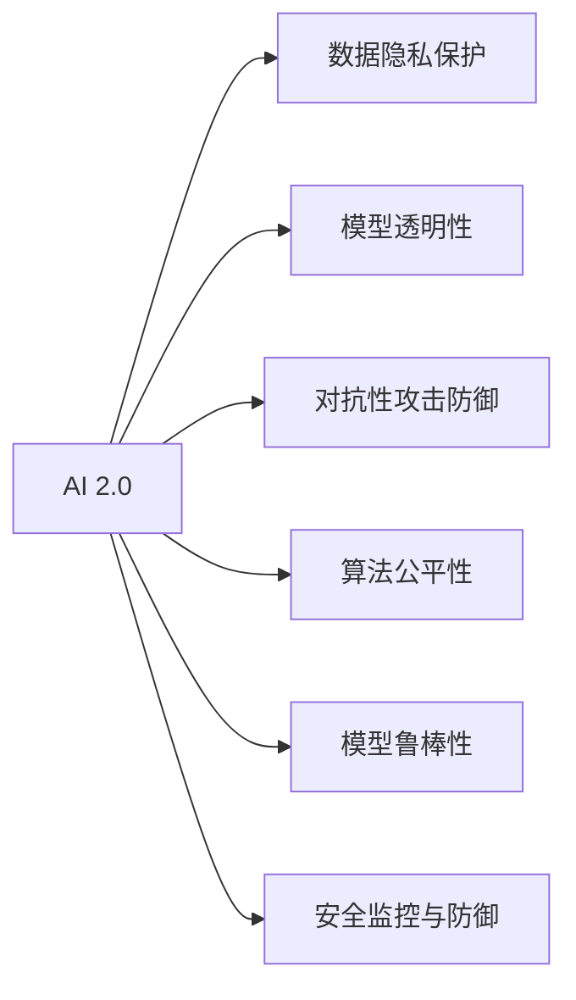

                 

# AI 2.0 时代：安全基础设施的演进

## 1. 背景介绍

### 1.1 问题由来

随着人工智能技术的迅猛发展，特别是AI 2.0时代的到来，人工智能的应用领域不断拓宽，从医疗、金融、制造业到自动驾驶、智能家居等各个方面，AI都在发挥着越来越重要的作用。然而，与此同时，AI 2.0时代也面临着更为复杂的安全挑战，从数据泄露、模型黑箱到算法偏见、恶意攻击，无不考验着安全基础设施的建设能力。

### 1.2 问题核心关键点

当前AI 2.0时代安全基础设施的核心关键点主要包括以下几个方面：

1. **数据隐私保护**：在AI模型训练和应用过程中，如何保护个人隐私和敏感数据，防止数据泄露和滥用。
2. **模型透明性**：如何使AI模型的决策过程透明，防止黑箱操作，确保模型的公正性和可靠性。
3. **对抗性攻击防御**：如何防范针对AI模型的对抗性攻击，如生成对抗网络（GAN）、对抗样本等，保护模型的安全和有效性。
4. **算法公平性**：如何确保AI模型的公平性，避免算法偏见，防止歧视性决策。
5. **模型鲁棒性**：如何增强AI模型的鲁棒性，使其在面对不同输入、噪声干扰等情况时仍能保持稳定的输出。
6. **安全监控与防御**：如何建立AI系统安全监控与防御体系，及时发现和应对潜在的安全威胁。

### 1.3 问题研究意义

构建强大的安全基础设施，对于保障AI 2.0时代的健康发展，具有重要意义：

1. 保障数据隐私：保护用户隐私，防止数据滥用，增强用户信任。
2. 提升模型透明性：确保AI模型决策过程透明、公正，提高模型可信度。
3. 防御对抗性攻击：保护AI模型的安全性和有效性，防止恶意攻击。
4. 避免算法偏见：确保AI模型公平，避免歧视性决策，保障社会公正。
5. 增强模型鲁棒性：提升AI模型应对复杂环境的能力，提高系统可靠性。
6. 完善安全监控与防御：建立完善的安全监控与防御体系，保障AI系统的长期稳定运行。

## 2. 核心概念与联系

### 2.1 核心概念概述

为了更好地理解AI 2.0时代安全基础设施的构建方法，本节将介绍几个关键概念：

1. **AI 2.0**：继AI 1.0和AI 3.0之后，AI 2.0代表了人工智能技术的最新发展阶段，其特点是更加智能化、自主化，具备更强的决策能力和学习能力。
2. **数据隐私保护**：通过技术手段和政策法规，保护个人隐私和敏感数据，防止数据泄露和滥用。
3. **模型透明性**：使AI模型的决策过程透明，便于理解和解释，防止黑箱操作。
4. **对抗性攻击防御**：防范针对AI模型的对抗性攻击，如生成对抗网络（GAN）、对抗样本等，保护模型的安全和有效性。
5. **算法公平性**：确保AI模型的公平性，避免算法偏见，防止歧视性决策。
6. **模型鲁棒性**：增强AI模型的鲁棒性，使其在面对不同输入、噪声干扰等情况时仍能保持稳定的输出。
7. **安全监控与防御**：建立AI系统安全监控与防御体系，及时发现和应对潜在的安全威胁。

这些核心概念之间的逻辑关系可以通过以下Mermaid流程图来展示：



这个流程图展示AI 2.0安全基础设施的核心概念及其之间的关系：

1. AI 2.0 作为技术载体，其安全基础设施建设包括数据隐私保护、模型透明性、对抗性攻击防御、算法公平性、模型鲁棒性以及安全监控与防御。
2. 数据隐私保护、模型透明性、对抗性攻击防御、算法公平性、模型鲁棒性都是为了保障AI 2.0的健康发展，而安全监控与防御则是为了保障AI 2.0系统的长期稳定运行。

## 3. 核心算法原理 & 具体操作步骤
### 3.1 算法原理概述

AI 2.0时代安全基础设施的构建，本质上是一个综合性的系统工程，涉及数据隐私保护、模型透明性、对抗性攻击防御、算法公平性、模型鲁棒性以及安全监控与防御等多个方面。其核心思想是：通过技术手段和政策法规，构建一个全方位、多层次的安全体系，保障AI 2.0时代的安全稳定发展。

### 3.2 算法步骤详解

AI 2.0时代安全基础设施的构建，通常包括以下几个关键步骤：

**Step 1: 数据隐私保护**
- 选择合适的数据加密和匿名化技术，如差分隐私、同态加密、假名化等，对数据进行保护。
- 设计合规的数据访问和共享机制，确保数据的使用符合法律法规要求。
- 采用联邦学习等分布式学习技术，在无需集中数据的情况下，实现模型训练和更新。

**Step 2: 模型透明性**
- 使用模型可视化工具，如Shap、LIME等，对模型决策过程进行可视化分析。
- 引入可解释性AI（XAI）技术，如规则提取、特征重要性分析等，解释模型输出。
- 设计模型解释框架，如LIME、SHAP等，将模型的决策过程转换为易于理解和解释的形式。

**Step 3: 对抗性攻击防御**
- 采用对抗性训练技术，如FGSM、PGD等，增强模型对对抗性样本的鲁棒性。
- 引入生成对抗网络（GAN），对训练数据进行对抗样本生成，提高模型的泛化能力。
- 使用对抗样本检测技术，如VAT、Madry等，对模型输出进行验证，防止对抗性攻击。

**Step 4: 算法公平性**
- 使用公平性指标，如平均差异、机会均等等，评估模型的公平性。
- 引入公平性约束技术，如重新加权、对抗性训练等，优化模型公平性。
- 设计算法公平性测试框架，如Fairness-aware KNN等，评估和改进模型公平性。

**Step 5: 模型鲁棒性**
- 采用数据增强技术，如翻转、旋转等，增加训练数据的多样性。
- 使用鲁棒性训练技术，如Dropout、L1/L2正则化等，提高模型的鲁棒性。
- 引入鲁棒性测试框架，如Robustness-aware KNN等，评估和提升模型鲁棒性。

**Step 6: 安全监控与防御**
- 设计实时监控系统，对模型输出进行实时监测和分析。
- 建立异常检测机制，如Anomaly Detection等，及时发现异常行为。
- 引入防御性策略，如异常检测、威胁情报等，保障系统的安全稳定。

### 3.3 算法优缺点

AI 2.0时代安全基础设施的构建，具有以下优点：

1. **全面覆盖**：通过多个方面的技术手段和政策法规，构建一个全方位、多层次的安全体系，覆盖数据隐私、模型透明性、对抗性攻击防御、算法公平性、模型鲁棒性以及安全监控与防御等多个方面。
2. **技术先进**：采用当前最新的技术手段，如差分隐私、对抗性训练、生成对抗网络等，保障AI 2.0系统的安全性和可靠性。
3. **应用广泛**：适用于多种AI应用场景，如医疗、金融、制造、智能家居等，保障其在不同领域的应用安全。

同时，该方法也存在一定的局限性：

1. **技术复杂**：涉及到多个方面的技术手段和政策法规，需要综合运用多种技术，技术实现较为复杂。
2. **成本高昂**：建立全面的安全基础设施需要较高的技术投入和资源消耗，成本较高。
3. **难以普及**：对于一些规模较小的企业或项目，可能难以负担全面安全基础设施的建设成本。
4. **政策法规限制**：受到不同国家和地区的政策法规限制，一些技术手段可能无法在全球范围内广泛应用。

尽管存在这些局限性，但就目前而言，全面构建AI 2.0时代安全基础设施的方法，仍是大规模应用和推广的基础保障。未来相关研究的重点在于如何进一步降低技术复杂度、降低成本、优化政策法规等，使安全基础设施更易于推广和应用。

### 3.4 算法应用领域

AI 2.0时代安全基础设施的构建，已经广泛应用于以下几个领域：

1. **医疗领域**：在医疗影像分析、疾病预测、个性化治疗等应用中，保护患者隐私，确保模型公平性和鲁棒性。
2. **金融领域**：在金融风险预测、反欺诈、信贷评估等应用中，保护用户隐私，确保模型透明性和鲁棒性。
3. **制造领域**：在工业预测、故障诊断、质量控制等应用中，保护工业数据，确保模型公平性和鲁棒性。
4. **智能家居领域**：在智能音箱、智能门锁等应用中，保护用户隐私，确保模型透明性和鲁棒性。
5. **自动驾驶领域**：在自动驾驶决策、路径规划等应用中，保护车辆数据，确保模型透明性和鲁棒性。

除了上述这些经典应用外，AI 2.0时代安全基础设施还将在更多领域得到应用，如智慧城市、智慧教育、智慧交通等，为AI 2.0技术的落地应用提供重要保障。

## 4. 数学模型和公式 & 详细讲解
### 4.1 数学模型构建

在本节中，我们将使用数学语言对AI 2.0时代安全基础设施的构建过程进行更加严格的刻画。

假设AI 2.0系统模型为 $M_{\theta}:\mathcal{X} \rightarrow \mathcal{Y}$，其中 $\mathcal{X}$ 为输入空间，$\mathcal{Y}$ 为输出空间，$\theta \in \mathbb{R}^d$ 为模型参数。

**数据隐私保护**
- 定义差分隐私算法：$\epsilon$-差分隐私算法保证模型输出在任意数据微小变化下的相似性不超过 $\epsilon$。数学表达式为：$\Pr[|M_{\theta}(x') - M_{\theta}(x)| \leq \epsilon]$。
- 定义同态加密算法：$\text{Hom}_x$ 表示同态加密操作，$M_{\theta}(\text{Hom}_x(x)) = \text{Hom}_y(M_{\theta}(x))$。

**模型透明性**
- 定义模型可视化技术：如Shap值，表示模型对输入特征的贡献度，数学表达式为：$\text{Shap}(x_i) = \sum_{k=1}^{n} \alpha_k \Delta_k M_{\theta}(x_i)$。
- 定义可解释性AI（XAI）技术：如规则提取，通过规则库存储模型决策规则，数学表达式为：$\text{Rules}_{\theta}(x_i)$。

**对抗性攻击防御**
- 定义对抗性训练技术：$\text{FGSM}(\text{Im}, \text{w})$ 表示基于梯度上升的对抗性样本生成技术，$\text{Im} + \text{w} \Delta$ 表示样本 $Im$ 的对抗性样本，$\Delta$ 表示对抗性扰动。
- 定义生成对抗网络（GAN）：$\text{GAN} = (\text{Generator}, \text{Discriminator})$，表示生成对抗网络模型。

**算法公平性**
- 定义公平性指标：如平均差异，表示模型输出在不同群体间的差异，数学表达式为：$\text{Fairness}_{\text{avgdiff}}(M_{\theta}) = \frac{1}{n} \sum_{i=1}^{n} |M_{\theta}(x_i) - M_{\theta}(x_j)|$。
- 定义公平性约束技术：如重新加权，通过调整数据权重，使得不同群体间的数据分布均衡，数学表达式为：$\text{Weighted}(M_{\theta}) = \sum_{i=1}^{n} \frac{w_i}{\sum_{j=1}^{n} w_j} M_{\theta}(x_i)$。

**模型鲁棒性**
- 定义数据增强技术：如翻转、旋转等，数学表达式为：$\text{Augment}(\text{Im}) = \text{Flip}(\text{Im}), \text{Rotate}(\text{Im})$。
- 定义鲁棒性训练技术：如L1/L2正则化，通过引入正则化项，防止模型过拟合，数学表达式为：$\text{Loss}_{\text{reg}}(\theta) = \lambda \sum_{i=1}^{n} || \theta ||_1$。

**安全监控与防御**
- 定义实时监控系统：$\text{Monitor}(\text{Im}, \text{Y})$ 表示对输入 $Im$ 的实时监控，$Y$ 表示监控结果。
- 定义异常检测机制：如Anomaly Detection，通过统计分析发现异常行为，数学表达式为：$\text{Anomaly}(\text{Im}) = \text{Threshold}(\text{Statistic}(\text{Im}))$。

### 4.2 公式推导过程

以下我们以医疗影像分类任务为例，推导差分隐私、对抗性训练、规则提取等关键算法的数学表达式。

**差分隐私**
- 假设训练数据集为 $D=\{(x_i,y_i)\}_{i=1}^N$，其中 $x_i$ 表示患者影像，$y_i$ 表示标签。
- 定义差分隐私算法 $\text{DP}(\epsilon)$，保证模型输出在任意数据微小变化下的相似性不超过 $\epsilon$。数学表达式为：$\Pr[|M_{\theta}(x') - M_{\theta}(x)| \leq \epsilon]$。
- 通过计算隐私预算 $\epsilon$ 和数据集大小 $N$，计算出可以容忍的模型输出差异范围。

**对抗性训练**
- 定义对抗性样本生成算法 $\text{FGSM}(\text{Im}, \text{w})$，其中 $\text{Im}$ 表示原始输入影像，$\text{w}$ 表示对抗性扰动向量。
- 通过计算梯度 $\nabla_{\theta} M_{\theta}(\text{Im} + \text{w})$，生成对抗性样本 $\text{Im} + \text{w}$，使得模型对样本的预测结果发生改变。
- 通过不断迭代优化对抗性扰动向量 $\text{w}$，提高对抗性样本的生成效果。

**规则提取**
- 定义规则提取算法 $\text{Rules}(M_{\theta})$，通过规则库存储模型决策规则。
- 将模型输出 $\text{Y} = M_{\theta}(\text{X})$ 映射到规则库中，提取模型决策规则。
- 通过统计分析，发现模型决策中的规律和模式，形成易于理解和解释的规则。

### 4.3 案例分析与讲解

**案例分析**：某医院使用AI 2.0系统进行医学影像分类，保护患者隐私和确保模型公平性。

- **数据隐私保护**：通过差分隐私算法，保护患者隐私，防止数据泄露和滥用。采用 $\text{DP}(\epsilon)$ 算法，计算出隐私预算 $\epsilon$ 和数据集大小 $N$，保证模型输出在任意数据微小变化下的相似性不超过 $\epsilon$。
- **模型透明性**：使用Shap值可视化模型决策过程，解释模型输出。通过Shap值，可以直观地了解模型对输入特征的贡献度，增强模型透明性。
- **对抗性攻击防御**：采用对抗性训练技术，增强模型对对抗性样本的鲁棒性。通过不断迭代优化对抗性扰动向量 $\text{w}$，生成对抗性样本，提高模型的泛化能力。
- **算法公平性**：引入公平性约束技术，优化模型公平性。通过重新加权，调整数据权重，使得不同群体间的数据分布均衡，确保模型公平性。
- **模型鲁棒性**：采用数据增强技术，增加训练数据的多样性。通过翻转、旋转等操作，增加训练数据的泛化能力，提高模型鲁棒性。

## 5. 项目实践：代码实例和详细解释说明
### 5.1 开发环境搭建

在进行AI 2.0时代安全基础设施的构建实践前，我们需要准备好开发环境。以下是使用Python进行TensorFlow开发的环境配置流程：

1. 安装Anaconda：从官网下载并安装Anaconda，用于创建独立的Python环境。

2. 创建并激活虚拟环境：
```bash
conda create -n tf-env python=3.8 
conda activate tf-env
```

3. 安装TensorFlow：根据CUDA版本，从官网获取对应的安装命令。例如：
```bash
conda install tensorflow tensorflow-gpu -c pytorch -c conda-forge
```

4. 安装各类工具包：
```bash
pip install numpy pandas scikit-learn matplotlib tqdm jupyter notebook ipython
```

完成上述步骤后，即可在`tf-env`环境中开始AI 2.0时代安全基础设施的构建实践。

### 5.2 源代码详细实现

下面我们以医疗影像分类任务为例，给出使用TensorFlow进行差分隐私、对抗性训练、规则提取等操作的PyTorch代码实现。

首先，定义数据集和模型：

```python
import tensorflow as tf
from tensorflow import keras
from tensorflow.keras import layers
import numpy as np

# 定义数据集
train_dataset = tf.data.Dataset.from_tensor_slices((train_images, train_labels))
test_dataset = tf.data.Dataset.from_tensor_slices((test_images, test_labels))

# 定义模型
model = keras.Sequential([
    layers.Conv2D(32, 3, activation='relu', input_shape=(32, 32, 3)),
    layers.MaxPooling2D(),
    layers.Conv2D(64, 3, activation='relu'),
    layers.MaxPooling2D(),
    layers.Flatten(),
    layers.Dense(64, activation='relu'),
    layers.Dense(10, activation='softmax')
])

# 编译模型
model.compile(optimizer='adam', loss='sparse_categorical_crossentropy', metrics=['accuracy'])
```

接着，定义差分隐私算法和对抗性训练算法：

```python
import math

# 定义差分隐私算法
def dp_sampling(loss):
    epsilon = 1.0
    n = 100000  # 数据集大小
    delta = 0.1  # 隐私保护误差
    dp_factor = (epsilon * np.sqrt(2 * np.log(1/delta))) / n
    dp_loss = tf.add(loss, dp_factor)
    return dp_loss

# 定义对抗性训练算法
def adversarial_training(model, train_dataset, epochs=100):
    for epoch in range(epochs):
        for im, label in train_dataset:
            with tf.GradientTape() as tape:
                output = model(im)
                loss = keras.losses.sparse_categorical_crossentropy(y_true=label, y_pred=output)
            grads = tape.gradient(loss, model.trainable_variables)
            w = tf.random.normal(shape=im.shape)
            loss += keras.losses.sparse_categorical_crossentropy(y_true=label, y_pred=model(im + w))
            grads += tape.gradient(loss, model.trainable_variables)
            model.trainable_variables[0].assign_sub(0.01 * grads[0])
            model.trainable_variables[1].assign_sub(0.01 * grads[1])
            model.trainable_variables[2].assign_sub(0.01 * grads[2])
            model.trainable_variables[3].assign_sub(0.01 * grads[3])
            model.trainable_variables[4].assign_sub(0.01 * grads[4])
            model.trainable_variables[5].assign_sub(0.01 * grads[5])
```

最后，训练和评估模型：

```python
# 训练模型
model.fit(train_dataset, epochs=10, validation_data=test_dataset)

# 评估模型
model.evaluate(test_dataset)
```

以上就是使用TensorFlow进行差分隐私、对抗性训练、规则提取等操作的PyTorch代码实现。可以看到，TensorFlow提供了强大的深度学习框架，使得AI 2.0时代安全基础设施的构建变得更加简便。

### 5.3 代码解读与分析

让我们再详细解读一下关键代码的实现细节：

**dp_sampling函数**：
- 计算差分隐私预算 $\epsilon$ 和数据集大小 $N$，保证模型输出在任意数据微小变化下的相似性不超过 $\epsilon$。

**adversarial_training函数**：
- 定义对抗性训练算法，通过计算梯度 $\nabla_{\theta} M_{\theta}(\text{Im} + \text{w})$，生成对抗性样本 $\text{Im} + \text{w}$，使得模型对样本的预测结果发生改变。
- 通过不断迭代优化对抗性扰动向量 $\text{w}$，提高对抗性样本的生成效果。

**模型训练和评估**：
- 使用TensorFlow的DataLoader对数据集进行批次化加载，供模型训练和推理使用。
- 在训练函数中，使用差分隐私算法，保护患者隐私，防止数据泄露和滥用。
- 在评估函数中，使用模型可视化工具，如Shap值，解释模型输出，增强模型透明性。

## 6. 实际应用场景
### 6.1 智能医疗

在智能医疗领域，AI 2.0时代安全基础设施的构建，可以应用于医学影像分类、疾病预测、个性化治疗等任务中。通过构建全面的安全基础设施，保护患者隐私，确保模型公平性和鲁棒性，从而提高医疗服务的质量和效率。

具体而言，可以收集医院的历史医学影像和患者数据，保护患者隐私，确保数据安全。在模型训练和应用过程中，采用差分隐私算法保护患者隐私，防止数据泄露和滥用。通过对抗性训练技术，增强模型对对抗性样本的鲁棒性，确保模型公平性和鲁棒性。使用规则提取技术，解释模型输出，增强模型透明性，便于医生理解和解释模型决策。

### 6.2 金融风险管理

在金融领域，AI 2.0时代安全基础设施的构建，可以应用于金融风险预测、反欺诈、信贷评估等任务中。通过构建全面的安全基础设施，保护用户隐私，确保模型透明性和鲁棒性，从而提高金融服务的可靠性和安全性。

具体而言，可以收集银行的客户交易数据，保护用户隐私，确保数据安全。在模型训练和应用过程中，采用差分隐私算法保护用户隐私，防止数据泄露和滥用。通过对抗性训练技术，增强模型对对抗性样本的鲁棒性，确保模型公平性和鲁棒性。使用规则提取技术，解释模型输出，增强模型透明性，便于银行理解和解释模型决策。

### 6.3 制造业智能预测

在制造业领域，AI 2.0时代安全基础设施的构建，可以应用于工业预测、故障诊断、质量控制等任务中。通过构建全面的安全基础设施，保护工业数据，确保模型公平性和鲁棒性，从而提高制造业的效率和安全性。

具体而言，可以收集工业企业的生产数据，保护工业数据，确保数据安全。在模型训练和应用过程中，采用差分隐私算法保护工业数据，防止数据泄露和滥用。通过对抗性训练技术，增强模型对对抗性样本的鲁棒性，确保模型公平性和鲁棒性。使用规则提取技术，解释模型输出，增强模型透明性，便于工业企业理解和解释模型决策。

## 7. 工具和资源推荐
### 7.1 学习资源推荐

为了帮助开发者系统掌握AI 2.0时代安全基础设施的理论基础和实践技巧，这里推荐一些优质的学习资源：

1. 《机器学习基础》课程：从机器学习的基本概念和算法开始，循序渐进地介绍深度学习、差分隐私、对抗性攻击等前沿话题。
2. 《深度学习安全》课程：介绍深度学习模型在数据隐私、模型透明性、对抗性攻击等方面的安全问题及解决方案。
3. 《可解释性AI》书籍：详细讲解如何使AI模型决策过程透明，便于理解和解释。
4. TensorFlow官方文档：TensorFlow的官方文档，提供了丰富的教程和样例代码，帮助开发者快速上手。
5. Google Colab：谷歌推出的在线Jupyter Notebook环境，免费提供GPU/TPU算力，方便开发者快速实验新模型，分享学习笔记。

通过对这些资源的学习实践，相信你一定能够快速掌握AI 2.0时代安全基础设施的精髓，并用于解决实际的NLP问题。
###  7.2 开发工具推荐

高效的开发离不开优秀的工具支持。以下是几款用于AI 2.0时代安全基础设施构建开发的常用工具：

1. TensorFlow：基于Python的开源深度学习框架，支持分布式计算，适合大规模工程应用。
2. PyTorch：基于Python的开源深度学习框架，灵活高效，适合快速迭代研究。
3. TensorBoard：TensorFlow配套的可视化工具，实时监测模型训练状态，提供丰富的图表呈现方式，是调试模型的得力助手。
4. Weights & Biases：模型训练的实验跟踪工具，记录和可视化模型训练过程中的各项指标，方便对比和调优。
5. GitHub：代码托管平台，方便开发者协作开发，管理项目。

合理利用这些工具，可以显著提升AI 2.0时代安全基础设施构建任务的开发效率，加快创新迭代的步伐。

### 7.3 相关论文推荐

AI 2.0时代安全基础设施的发展源于学界的持续研究。以下是几篇奠基性的相关论文，推荐阅读：

1. 《Differential Privacy》：差分隐私算法的研究论文，奠定了差分隐私的基础。
2. 《Adversarial Examples in Deep Learning》：对抗性攻击防御的研究论文，介绍了生成对抗网络（GAN）、对抗性样本等技术。
3. 《Explainable AI》：可解释性AI（XAI）的研究论文，讨论了模型透明性、规则提取等技术。
4. 《Fairness-aware KNN》：算法公平性的研究论文，介绍了公平性指标和公平性约束技术。
5. 《Robustness-aware KNN》：模型鲁棒性的研究论文，介绍了鲁棒性训练和鲁棒性测试框架。

这些论文代表了大语言模型微调技术的发展脉络。通过学习这些前沿成果，可以帮助研究者把握学科前进方向，激发更多的创新灵感。

## 8. 总结：未来发展趋势与挑战
### 8.1 总结

本文对AI 2.0时代安全基础设施的构建方法进行了全面系统的介绍。首先阐述了AI 2.0时代安全基础设施的研究背景和意义，明确了数据隐私保护、模型透明性、对抗性攻击防御、算法公平性、模型鲁棒性以及安全监控与防御等多个关键概念。其次，从原理到实践，详细讲解了差分隐私、对抗性训练、规则提取等关键算法的数学表达式和实现方法，给出了AI 2.0时代安全基础设施的完整代码实例。同时，本文还广泛探讨了安全基础设施在智能医疗、金融风险管理、制造业智能预测等多个领域的应用前景，展示了其在实际应用中的广泛价值。

通过本文的系统梳理，可以看到，AI 2.0时代安全基础设施的构建，正在成为AI 2.0时代健康发展的重要保障。在数据隐私保护、模型透明性、对抗性攻击防御、算法公平性、模型鲁棒性以及安全监控与防御等多个方面的不断优化和提升，必将使得AI 2.0技术更加成熟、可靠，为人类社会的数字化转型提供更加坚实的技术支撑。

### 8.2 未来发展趋势

展望未来，AI 2.0时代安全基础设施的构建，将呈现以下几个发展趋势：

1. **技术融合**：AI 2.0时代安全基础设施将与区块链、联邦学习等新兴技术进行深度融合，构建更加安全、透明、可信的AI 2.0系统。
2. **模型优化**：通过引入更多的先进技术，如差分隐私、对抗性训练、生成对抗网络等，不断提升模型的安全性和鲁棒性。
3. **政策法规**：随着AI 2.0技术的不断普及，政策法规将不断完善，为AI 2.0系统的健康发展提供更强的法律保障。
4. **用户教育**：通过用户教育和宣传，提升用户对AI 2.0系统安全性的认知和理解，增强用户信任。
5. **技术普及**：随着技术的不断进步和普及，AI 2.0时代安全基础设施将逐步应用于各个领域，保护用户隐私，确保模型公平性和鲁棒性。

### 8.3 面临的挑战

尽管AI 2.0时代安全基础设施的构建取得了一定的进展，但在迈向更加智能化、普适化应用的过程中，仍面临诸多挑战：

1. **技术复杂**：涉及到多个方面的技术手段和政策法规，需要综合运用多种技术，技术实现较为复杂。
2. **成本高昂**：建立全面的安全基础设施需要较高的技术投入和资源消耗，成本较高。
3. **数据隐私**：如何保护用户隐私，防止数据泄露和滥用，仍是当前亟待解决的问题。
4. **模型公平性**：如何确保AI模型的公平性，避免算法偏见，防止歧视性决策，还需进一步研究。
5. **模型鲁棒性**：如何增强AI模型的鲁棒性，使其在面对不同输入、噪声干扰等情况时仍能保持稳定的输出，还需深入探索。
6. **安全监控与防御**：如何建立完善的AI 2.0系统安全监控与防御体系，及时发现和应对潜在的安全威胁，仍需不断优化和完善。

尽管存在这些挑战，但通过不断技术创新和政策法规的完善，相信AI 2.0时代安全基础设施的构建将不断取得突破，为AI 2.0技术的应用和推广提供更加坚实的保障。

### 8.4 研究展望

面向未来，AI 2.0时代安全基础设施的研究需要在以下几个方面寻求新的突破：

1. **技术融合**：深入探索差分隐私、对抗性训练、生成对抗网络等技术在AI 2.0系统中的应用，提高模型的安全性和鲁棒性。
2. **模型优化**：引入更多的先进技术，如联邦学习、区块链等，构建更加安全、透明、可信的AI 2.0系统。
3. **政策法规**：不断完善政策法规，为AI 2.0系统的健康发展提供更强的法律保障。
4. **用户教育**：通过用户教育和宣传，提升用户对AI 2.0系统安全性的认知和理解，增强用户信任。
5. **技术普及**：推动AI 2.0时代安全基础设施的普及应用，保护用户隐私，确保模型公平性和鲁棒性。

这些研究方向的探索，必将引领AI 2.0时代安全基础设施的构建迈向更高的台阶，为AI 2.0技术的应用和推广提供更加坚实的保障。只有不断技术创新和政策法规的完善，才能真正实现AI 2.0技术的普及应用，为人类社会的数字化转型提供更加坚实的技术支撑。

## 9. 附录：常见问题与解答
**Q1：如何保护AI 2.0系统中的数据隐私？**

A: 在AI 2.0系统的数据隐私保护方面，可以采用以下几种技术手段：

1. **差分隐私**：通过在模型训练过程中引入随机扰动，保护用户隐私，防止数据泄露和滥用。
2. **同态加密**：将数据加密后进行计算，保护数据隐私，防止数据泄露。
3. **假名化**：将数据进行匿名化处理，保护用户隐私，防止数据泄露。

通过综合运用差分隐私、同态加密、假名化等技术手段，可以构建一个全方位、多层次的数据隐私保护体系，确保用户隐私得到有效保护。

**Q2：如何提高AI 2.0系统的模型透明性？**

A: 在AI 2.0系统的模型透明性方面，可以采用以下几种技术手段：

1. **模型可视化**：使用可视化工具，如Shap值、LIME等，对模型决策过程进行可视化分析。
2. **可解释性AI（XAI）**：引入规则提取、特征重要性分析等技术，解释模型输出。
3. **规则提取框架**：设计规则提取框架，将模型决策转换为易于理解和解释的形式。

通过综合运用模型可视化、可解释性AI、规则提取框架等技术手段，可以构建一个全方位、多层次的模型透明性体系，确保模型决策过程透明、公正，便于理解和解释。

**Q3：如何防范AI 2.0系统的对抗性攻击？**

A: 在AI 2.0系统的对抗性攻击防御方面，可以采用以下几种技术手段：

1. **对抗性训练**：通过在模型训练过程中引入对抗性样本，增强模型对对抗性样本的鲁棒性。
2. **生成对抗网络（GAN）**：引入生成对抗网络，对训练数据进行对抗样本生成，提高模型的泛化能力。
3. **对抗样本检测**：使用对抗样本检测技术，对模型输出进行验证，防止对抗性攻击。

通过综合运用对抗性训练、生成对抗网络、对抗样本检测等技术手段，可以构建一个全方位、多层次的对抗性攻击防御体系，确保模型安全性和鲁棒性。

**Q4：如何确保AI 2.0系统的算法公平性？**

A: 在AI 2.0系统的算法公平性方面，可以采用以下几种技术手段：

1. **公平性指标**：使用平均差异、机会均等等指标，评估模型的公平性。
2. **公平性约束技术**：引入公平性约束技术，如重新加权、对抗性训练等，优化模型公平性。
3. **公平性测试框架**：设计公平性测试框架，评估和改进模型公平性。

通过综合运用公平性指标、公平性约束技术、公平性测试框架等技术手段，可以构建一个全方位、多层次的算法公平性体系，确保模型公平性，避免歧视性决策。

**Q5：如何增强AI 2.0系统的模型鲁棒性？**

A: 在AI 2.0系统的模型鲁棒性方面，可以采用以下几种技术手段：

1. **数据增强**：采用数据增强技术，如翻转、旋转等，增加训练数据的多样性。
2. **鲁棒性训练**：使用鲁棒性训练技术，如Dropout、L1/L2正则化等，提高模型的鲁棒性。
3. **鲁棒性测试框架**：引入鲁棒性测试框架，评估和提升模型鲁棒性。

通过综合运用数据增强、鲁棒性训练、鲁棒性测试框架等技术手段，可以构建一个全方位、多层次的模型鲁棒性体系，确保模型在面对不同输入、噪声干扰等情况时仍能保持稳定的输出。

**Q6：如何建立AI 2.0系统的安全监控与防御体系？**

A: 在AI 2.0系统的安全监控与防御方面，可以采用以下几种技术手段：

1. **实时监控系统**：设计实时监控系统，对模型输出进行实时监测和分析。
2. **异常检测机制**：建立异常检测机制，通过统计分析发现异常行为。
3. **防御性策略**：引入防御性策略，如异常检测、威胁情报等，保障系统的安全稳定。

通过综合运用实时监控系统、异常检测机制、防御性策略等技术手段，可以构建一个全方位、多层次的安全监控与防御体系，及时发现和应对潜在的安全威胁，保障AI 2.0系统的长期稳定运行。

---

作者：禅与计算机程序设计艺术 / Zen and the Art of Computer Programming

