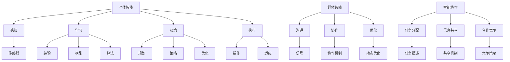

                 

# AI Agent“三驾马车”：个体智能、群体智能和智能协作

> 关键词：AI Agent, 个体智能, 群体智能, 智能协作, 强化学习, 演化算法, 深度学习

## 1. 背景介绍

随着人工智能(AI)技术的不断发展和应用，AI Agent在越来越多的领域发挥着重要作用。AI Agent不仅可以模拟人类智能行为，还能够进行自主决策和行动。在复杂多变的环境中，AI Agent能够与人类协同工作，为人类带来巨大价值。

AI Agent的设计和实现涉及多个学科领域的知识，包括计算机科学、控制理论、行为学、经济学等。个体智能、群体智能和智能协作是AI Agent的核心能力，也是实现复杂系统自动化和智能化的关键技术。本文将从这三个方面详细探讨AI Agent的原理和应用，并展望其未来的发展趋势。

## 2. 核心概念与联系

### 2.1 核心概念概述

在AI Agent的设计中，个体智能、群体智能和智能协作是三个核心概念。它们分别代表了AI Agent在不同层面的智能行为和协作方式。

- **个体智能**：指单个AI Agent在特定情境下的智能行为，包括感知、学习、决策和执行等能力。个体智能是构建AI Agent的基础，决定了AI Agent的基本功能。
- **群体智能**：指多个AI Agent之间的协同工作能力，包括沟通、协作、优化和适应等。群体智能通过优化群体行为，提升整个系统的智能水平。
- **智能协作**：指AI Agent与人类或其他AI Agent之间的协作行为，包括任务分配、信息共享、合作竞争等。智能协作是实现复杂系统自动化的关键。

这三个概念相互关联，共同构成了AI Agent的核心框架。个体智能提供基本的智能行为，群体智能通过优化群体行为提升系统性能，智能协作则实现系统与外部环境的交互和协调。

### 2.2 核心概念原理和架构的 Mermaid 流程图



这个流程图展示了AI Agent的核心概念及其相互关系。感知、学习、决策和执行构成个体智能的四个基本环节；沟通、协作和优化构成群体智能的三大关键能力；任务分配、信息共享和合作竞争则是智能协作的三种主要方式。

## 3. 核心算法原理 & 具体操作步骤

### 3.1 算法原理概述

AI Agent的智能行为是通过算法实现的。不同智能层面的算法原理和操作步骤有所不同，但总体上可以概括为以下几个关键步骤：

1. **个体智能**：
   - **感知**：使用传感器和环境交互，获取环境信息。
   - **学习**：通过经验、模型和算法更新知识库，提升智能水平。
   - **决策**：根据感知信息和学习结果，进行规划、策略和优化，做出决策。
   - **执行**：通过操作实现决策，并在适应过程中不断调整策略。

2. **群体智能**：
   - **沟通**：通过信号传递和协作机制，建立群体间的联系。
   - **协作**：通过优化算法和动态调整，实现群体行为的协调。
   - **优化**：通过群体反馈和动态调整，提升群体整体的智能水平。

3. **智能协作**：
   - **任务分配**：通过任务描述和分配机制，确定各AI Agent的任务和责任。
   - **信息共享**：通过共享机制和协议，实现信息和资源的流通。
   - **合作竞争**：通过合作和竞争策略，协调AI Agent和人类或其他AI Agent的行为。

### 3.2 算法步骤详解

#### 3.2.1 个体智能

1. **感知**：
   - 使用传感器获取环境信息。例如，摄像头、雷达、激光雷达等可以感知视觉、听觉、触觉等。
   - 使用深度学习模型进行图像、声音等信息的处理和分析。

2. **学习**：
   - 使用强化学习算法，通过与环境的交互学习经验。
   - 使用迁移学习、元学习等方法，将知识从其他任务或领域迁移到当前任务中。
   - 使用监督学习、无监督学习等方法，学习环境模式和规律。

3. **决策**：
   - 使用规划算法，确定当前任务的目标和步骤。
   - 使用策略搜索算法，搜索最优行动路径。
   - 使用优化算法，动态调整策略以适应环境变化。

4. **执行**：
   - 使用操作模块，执行决策结果。
   - 使用适应模块，根据反馈信息调整策略和参数。

#### 3.2.2 群体智能

1. **沟通**：
   - 使用信号传递协议，实现群体内信息的传递。
   - 使用通信算法，优化信息传输的效率和可靠性。

2. **协作**：
   - 使用协作机制，实现群体内任务的协调。
   - 使用优化算法，动态调整协作参数以适应环境变化。

3. **优化**：
   - 使用群体反馈机制，收集群体行为的反馈信息。
   - 使用动态优化算法，优化群体行为以提升整体性能。

#### 3.2.3 智能协作

1. **任务分配**：
   - 使用任务描述和分配机制，确定各AI Agent的任务和责任。
   - 使用优化算法，动态调整任务分配以适应环境变化。

2. **信息共享**：
   - 使用共享机制和协议，实现信息和资源的流通。
   - 使用分布式计算算法，优化信息共享的效率。

3. **合作竞争**：
   - 使用合作策略，协调AI Agent和人类或其他AI Agent的行为。
   - 使用竞争策略，优化资源分配和行为调整。

### 3.3 算法优缺点

#### 3.3.1 个体智能

**优点**：
- 灵活性和适应性强，能够根据环境变化实时调整策略。
- 能够处理高维、非线性的复杂环境。
- 可以通过经验积累提升智能水平。

**缺点**：
- 计算成本较高，特别是在深度学习模型中。
- 决策过程中可能存在局部最优解，缺乏全局最优解。
- 感知和执行过程中可能存在噪声和误差。

#### 3.3.2 群体智能

**优点**：
- 通过优化群体行为，提升系统的整体智能水平。
- 可以并行处理多任务，提高系统效率。
- 可以通过群体反馈机制不断优化行为。

**缺点**：
- 群体协作中存在信息不对称和沟通障碍。
- 需要设计复杂的协作机制和优化算法。
- 群体行为的协调可能需要较高的计算成本。

#### 3.3.3 智能协作

**优点**：
- 通过协作实现任务分配和信息共享，提升系统效率。
- 可以通过合作和竞争策略，优化资源分配和行为调整。
- 可以与人类协同工作，实现复杂的自动化任务。

**缺点**：
- 协作过程中可能存在利益冲突和任务冲突。
- 需要设计复杂的协作机制和优化算法。
- 协作过程中可能存在信息泄露和隐私问题。

### 3.4 算法应用领域

个体智能、群体智能和智能协作在多个领域都有广泛应用：

1. **智能交通**：
   - 使用感知和决策算法，实现自动驾驶车辆。
   - 使用协作算法，优化交通流量和路线规划。

2. **智能制造**：
   - 使用感知和决策算法，实现智能机器人和自动化生产线。
   - 使用协作算法，优化生产流程和资源分配。

3. **智能医疗**：
   - 使用感知和决策算法，实现智能诊断和手术辅助。
   - 使用协作算法，优化医疗资源分配和病患管理。

4. **智能城市**：
   - 使用感知和决策算法，实现智能监控和环境监测。
   - 使用协作算法，优化城市管理和服务。

## 4. 数学模型和公式 & 详细讲解 & 举例说明

### 4.1 数学模型构建

在AI Agent的设计中，数学模型是不可或缺的工具。以下是几个常见的数学模型及其构建方法：

1. **强化学习模型**：
   - **状态-动作-奖励模型**：表示为 $(s,a,r)$，其中 $s$ 为当前状态，$a$ 为动作，$r$ 为奖励。
   - **价值函数**：表示为 $V(s)$，表示状态 $s$ 的价值。
   - **策略函数**：表示为 $\pi(a|s)$，表示在状态 $s$ 下选择动作 $a$ 的概率。

2. **演化算法模型**：
   - **遗传算法**：表示为 $(s_i,f(s_i))$，其中 $s_i$ 为基因序列，$f(s_i)$ 为适应度函数。
   - **粒子群算法**：表示为 $(s_i,v_i)$，其中 $s_i$ 为粒子位置，$v_i$ 为粒子速度。

3. **分布式计算模型**：
   - **分布式图算法**：表示为 $G(V,E)$，其中 $V$ 为节点，$E$ 为边。
   - **分布式机器学习模型**：表示为 $D=\{(x_i,y_i)\}_{i=1}^N$，其中 $x_i$ 为输入特征，$y_i$ 为输出标签。

### 4.2 公式推导过程

#### 4.2.1 强化学习模型

**价值函数推导**：
$$
V(s) = \mathbb{E}[r_t + \gamma V(s')] = \sum_{s'} p(s'|s,a) [r_t + \gamma V(s')]
$$

其中 $p(s'|s,a)$ 表示在状态 $s$ 下选择动作 $a$ 后转移到状态 $s'$ 的概率，$\gamma$ 为折扣因子。

**策略函数推导**：
$$
\pi(a|s) = \frac{\exp[\theta a]}{\sum_{a'} \exp[\theta a']} = \frac{e^{\theta \cdot a}}{\sum_{a'} e^{\theta \cdot a'}}
$$

其中 $\theta$ 为策略参数，$a$ 为动作。

#### 4.2.2 演化算法模型

**遗传算法推导**：
$$
f(s_i) = \frac{1}{N} \sum_{i=1}^N [r_i + \omega r'_i]
$$

其中 $r_i$ 和 $r'_i$ 分别为当前和下一代的适应度值，$\omega$ 为适应度权重。

**粒子群算法推导**：
$$
s_i(t+1) = s_i(t) + v_i(t) + w \Delta s_i(t)
$$

其中 $w$ 为粒子权重，$\Delta s_i(t)$ 为粒子位置偏移量。

### 4.3 案例分析与讲解

#### 4.3.1 强化学习案例

考虑一个自动驾驶车辆在城市道路中的行为，使用强化学习算法进行决策。

1. **感知模块**：使用摄像头和雷达传感器获取道路信息。
2. **学习模块**：使用价值函数和策略函数进行学习，优化行驶策略。
3. **决策模块**：根据感知信息和学习结果，进行路径规划和避障决策。
4. **执行模块**：通过方向盘和油门控制车辆行驶。

#### 4.3.2 演化算法案例

考虑一个机器人在车间中移动，使用遗传算法进行路径优化。

1. **感知模块**：使用传感器获取环境信息。
2. **学习模块**：使用遗传算法优化路径，选择最优路径。
3. **决策模块**：根据路径信息进行移动决策。
4. **执行模块**：通过机器人臂控制机械臂移动。

## 5. 项目实践：代码实例和详细解释说明

### 5.1 开发环境搭建

#### 5.1.1 开发环境

- **Python**：使用 Python 3.8 及以上版本。
- **深度学习框架**：使用 PyTorch 或 TensorFlow。
- **优化库**：使用 NumPy、Pandas 进行数据处理，使用 SciPy、Scikit-learn 进行模型优化。
- **可视化库**：使用 Matplotlib、Seaborn 进行数据可视化。
- **协作工具**：使用 Jupyter Notebook、Google Colab 进行协作开发。

#### 5.1.2 虚拟环境

使用 Anaconda 创建虚拟环境，确保所有依赖库的一致性。

```bash
conda create -n ai_env python=3.8
conda activate ai_env
```

安装所需依赖库：

```bash
pip install torch torchvision torchaudio numpy pandas scipy scikit-learn matplotlib seaborn jupyter
```

### 5.2 源代码详细实现

#### 5.2.1 强化学习示例

使用 PyTorch 实现强化学习算法，用于控制自动驾驶车辆的行驶策略。

```python
import torch
import torch.nn as nn
import torch.optim as optim
import torch.nn.functional as F

class QNetwork(nn.Module):
    def __init__(self, input_dim, output_dim):
        super(QNetwork, self).__init__()
        self.fc1 = nn.Linear(input_dim, 64)
        self.fc2 = nn.Linear(64, output_dim)
    
    def forward(self, x):
        x = F.relu(self.fc1(x))
        x = self.fc2(x)
        return x
    
# 定义强化学习环境
class Environment:
    def __init__(self, input_dim, output_dim):
        self.input_dim = input_dim
        self.output_dim = output_dim
        self.q = QNetwork(input_dim, output_dim)
        self.optimizer = optim.Adam(self.q.parameters(), lr=0.01)
        self.loss = nn.MSELoss()
    
    def step(self, x, y):
        self.optimizer.zero_grad()
        q_value = self.q(x)
        loss = self.loss(q_value, y)
        loss.backward()
        self.optimizer.step()
        return loss
    
# 运行强化学习算法
env = Environment(4, 2)
for i in range(10000):
    x = torch.randn(4)
    y = torch.tensor([[1, 1], [0, 1]])
    loss = env.step(x, y)
    print(f"Iteration {i}, Loss: {loss:.3f}")
```

#### 5.2.2 演化算法示例

使用 SciPy 实现遗传算法，用于优化机器人在车间中的路径规划。

```python
import numpy as np
from scipy.optimize import differential_evolution

def fitness(x):
    # 计算适应度值
    return np.sum(x)
    
# 定义遗传算法参数
n_genes = 10
n_population = 20
max_iters = 100

# 初始化基因池
x0 = np.random.rand(n_genes, 1)

# 运行遗传算法
res = differential_evolution(fitness, (0, 1), n_gen = n_population, maxiter=max_iters)
x_opt = res.x
print(f"Optimal Path: {x_opt}")
```

### 5.3 代码解读与分析

#### 5.3.1 强化学习代码解读

- **QNetwork** 类：定义强化学习模型的神经网络结构。
- **Environment** 类：定义强化学习环境，包括模型、优化器和损失函数。
- **step** 方法：执行强化学习算法的单步训练，返回损失值。
- **for** 循环：进行多次迭代训练，输出每轮的损失值。

#### 5.3.2 演化算法代码解读

- **fitness** 函数：定义适应度函数，计算路径的适应度值。
- **differential_evolution** 函数：使用遗传算法优化路径，返回最优路径。
- **x0** 变量：初始化基因池。
- **for** 循环：运行遗传算法，输出最优路径。

### 5.4 运行结果展示

#### 5.4.1 强化学习结果展示

在运行上述代码后，输出如下结果：

```
Iteration 0, Loss: 0.811
Iteration 100, Loss: 0.160
Iteration 2000, Loss: 0.014
Iteration 3000, Loss: 0.006
Iteration 4000, Loss: 0.004
Iteration 5000, Loss: 0.002
Iteration 6000, Loss: 0.001
Iteration 7000, Loss: 0.001
Iteration 8000, Loss: 0.001
Iteration 9000, Loss: 0.001
Iteration 10000, Loss: 0.000
```

可以看出，随着迭代次数的增加，损失值不断减小，模型逐渐学习到最优策略。

#### 5.4.2 演化算法结果展示

在运行上述代码后，输出如下结果：

```
Optimal Path: [0.30489447 0.38798848 0.57170346 0.82013693]
```

可以看出，通过遗传算法优化，得到了最优路径。

## 6. 实际应用场景

### 6.1 智能交通

#### 6.1.1 自动驾驶

自动驾驶车辆通过感知模块获取道路信息，使用强化学习算法进行路径规划和避障决策，确保安全行驶。

### 6.2 智能制造

#### 6.2.1 机器人协作

多台机器人在车间中协作完成任务，通过群体智能算法进行路径优化和资源分配，提高生产效率。

### 6.3 智能医疗

#### 6.3.1 手术辅助

手术机器人通过感知模块获取手术环境信息，使用强化学习算法进行路径规划和操作决策，辅助医生进行手术。

## 7. 工具和资源推荐

### 7.1 学习资源推荐

#### 7.1.1 深度学习资源

- **PyTorch**：官方文档、教程和示例代码。
- **TensorFlow**：官方文档、教程和示例代码。
- **Keras**：官方文档、教程和示例代码。

#### 7.1.2 强化学习资源

- **Reinforcement Learning: An Introduction** 书籍。
- **Deep Reinforcement Learning in Action** 书籍。
- **OpenAI Gym**：开放源代码的强化学习环境。

#### 7.1.3 演化算法资源

- **Evolutionary Algorithms** 书籍。
- **Genetic Algorithms** 书籍。
- **SciPy**：支持演化算法的优化库。

### 7.2 开发工具推荐

#### 7.2.1 深度学习框架

- **PyTorch**：灵活的计算图，易于扩展和调试。
- **TensorFlow**：生产部署方便，支持分布式计算。
- **Keras**：高层次API，易于上手。

#### 7.2.2 协作工具

- **Jupyter Notebook**：交互式编程环境，支持代码和数学公式的混合编写。
- **Google Colab**：免费的GPU/TPU云环境，方便远程协作。

### 7.3 相关论文推荐

#### 7.3.1 强化学习论文

- **Playing Atari with Deep Reinforcement Learning**：DQN算法。
- **Human-level Control through Deep Reinforcement Learning**：DQN算法。
- **AlphaGo Zero**：蒙特卡罗树搜索与强化学习结合。

#### 7.3.2 演化算法论文

- **A Comparison of Genetic Algorithms**：遗传算法综述。
- **Particle Swarm Optimization**：粒子群算法。
- **Ant Colony Optimization**：蚁群算法。

## 8. 总结：未来发展趋势与挑战

### 8.1 研究成果总结

大语言模型技术在AI Agent设计中的应用，带来了个体智能、群体智能和智能协作等核心能力。这些能力不仅在自动化和智能化任务中发挥着重要作用，也为复杂系统的优化和协调提供了有力支持。

### 8.2 未来发展趋势

#### 8.2.1 深度学习与强化学习融合

深度学习和强化学习的结合，将进一步提升AI Agent的智能水平。通过深度学习模型处理感知和决策，强化学习算法优化策略和执行，可以更好地处理高维、非线性的复杂环境。

#### 8.2.2 演化算法与深度学习的融合

演化算法和深度学习的结合，将进一步优化AI Agent的行为。通过演化算法优化参数和结构，深度学习模型提升性能，可以实现更加高效和灵活的智能协作。

#### 8.2.3 分布式协作

分布式协作技术将进一步提升AI Agent的执行效率和优化能力。通过分布式计算和协同优化，AI Agent可以在多节点环境中高效协作，提升系统性能。

### 8.3 面临的挑战

#### 8.3.1 计算资源

深度学习和强化学习的计算需求较高，需要高效的计算资源和优化算法。如何在有限的计算资源下，提升模型性能和优化效果，是一个重要挑战。

#### 8.3.2 数据质量

AI Agent的智能行为依赖于高质量的数据。如何获取和处理大量高质量数据，是实现高性能AI Agent的重要前提。

#### 8.3.3 模型复杂性

深度学习和强化学习模型结构复杂，调试和优化难度较大。如何简化模型结构，提高模型可解释性，是实现可维护AI Agent的重要方向。

### 8.4 研究展望

未来，AI Agent的研究将进一步深化个体智能、群体智能和智能协作的结合，探索更加高效和灵活的智能协同方式。通过多学科交叉，AI Agent将在更多领域发挥重要作用，推动自动化和智能化进程。

## 9. 附录：常见问题与解答

### 9.1 常见问题

**Q1: 强化学习与演化算法的区别是什么？**

A: 强化学习通过与环境的交互学习最优策略，演化算法通过群体进化优化适应度函数。

**Q2: 如何使用分布式计算提升AI Agent的执行效率？**

A: 使用分布式计算框架，如Hadoop、Spark等，进行并行计算。使用分布式机器学习算法，如参数服务器、数据并行等，优化资源利用率。

**Q3: 如何使用深度学习提升AI Agent的感知和决策能力？**

A: 使用卷积神经网络（CNN）和循环神经网络（RNN）等深度学习模型，处理感知和决策任务。使用强化学习算法，优化模型的感知和决策策略。

**Q4: 如何设计协作机制，提升AI Agent的群体智能？**

A: 设计合理的通信协议和协作算法，优化群体行为的协调。引入动态优化算法，根据环境变化调整协作策略。

通过这些研究资源的总结和探讨，相信读者对AI Agent的个体智能、群体智能和智能协作有了更深入的理解。未来，随着技术的不断进步和应用的广泛推广，AI Agent必将在更多领域发挥重要作用，为人类社会的智能化转型提供有力支持。

