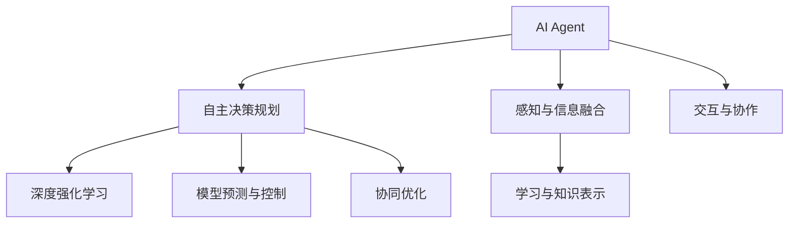

                 

# AI Agent核心技术的研究

## 1. 背景介绍

### 1.1 问题由来

随着人工智能(AI)技术的发展，AI Agent在自动规划、智能控制、机器学习等领域的应用变得越来越广泛。AI Agent的目标是通过自主决策，执行特定任务，并适应复杂多变的动态环境。在智能制造、无人驾驶、智慧城市等众多领域，AI Agent发挥着至关重要的作用。

然而，当前的AI Agent仍然存在诸多挑战。例如，如何在不确定性环境中有效规划路径、如何保证决策的鲁棒性、如何与人类协作等。这些问题迫切需要更深入的理论研究和算法优化，以提升AI Agent的性能和可靠性。

### 1.2 问题核心关键点

AI Agent的核心技术包括以下几个方面：

- 自主决策规划：AI Agent通过规划算法生成最优路径，并根据动态环境进行实时调整。
- 感知与信息融合：AI Agent通过传感器获取环境信息，并使用多传感器融合技术，提高感知精度。
- 学习与知识表示：AI Agent通过强化学习、模仿学习等方法，不断优化决策策略，并使用符号化方法进行知识表示和推理。
- 交互与协作：AI Agent能够与人类或其他AI Agent进行协作，共同完成任务。

这些核心技术相互交织，共同构成AI Agent的工作基础。如何高效融合这些技术，并实现AI Agent的自主决策、感知、学习、交互等能力，是大规模应用AI Agent时必须解决的关键问题。

### 1.3 问题研究意义

研究AI Agent的核心技术，对于推动智能系统的发展，提升AI Agent的性能和可靠性，具有重要意义：

1. 提升任务执行效率。通过高效融合感知、决策、学习等技术，AI Agent能够快速应对复杂任务，提高任务完成速度。
2. 增强决策鲁棒性。AI Agent能够适应不确定性环境，即使面对异常情况也能保证决策的稳定性和正确性。
3. 促进人机协作。AI Agent能够与人类进行自然交互，提升人机协作效率，实现更复杂任务。
4. 推动智能系统应用。AI Agent技术将促进智能系统在更多领域的应用，如智能制造、无人驾驶、智慧城市等。
5. 加速AI技术产业化。AI Agent的核心技术研究将为AI技术在企业中的大规模应用提供重要支持，加速AI技术的产业化进程。

## 2. 核心概念与联系

### 2.1 核心概念概述

为更好地理解AI Agent的核心技术，本节将介绍几个密切相关的核心概念：

- AI Agent：能够自主执行任务、与环境互动的智能体。通常由感知、规划、执行等模块组成。
- 自主决策规划：AI Agent通过规划算法生成最优路径，并根据环境变化实时调整策略。
- 感知与信息融合：AI Agent通过传感器获取环境信息，并使用多传感器融合技术提高感知精度。
- 学习与知识表示：AI Agent通过强化学习、模仿学习等方法，优化决策策略，并使用符号化方法进行知识表示和推理。
- 交互与协作：AI Agent能够与人类或其他AI Agent进行协作，共同完成任务。
- 深度强化学习：基于神经网络的强化学习算法，能够处理大规模复杂问题，并快速适应环境变化。
- 模型预测与控制：通过模型预测未来状态，并进行控制决策，提高AI Agent的决策效率。
- 协同优化：多个AI Agent之间进行协作优化，提高整体任务完成效率。

这些核心概念之间的逻辑关系可以通过以下Mermaid流程图来展示：



这个流程图展示了大规模AI Agent的工作流程和各模块之间的逻辑关系：

1. AI Agent通过感知模块获取环境信息，并将其输入到决策规划模块。
2. 决策规划模块使用规划算法生成路径，并根据动态环境实时调整策略。
3. 学习模块通过强化学习、模仿学习等方法优化决策策略，并使用符号化方法进行知识表示和推理。
4. 交互模块使得AI Agent能够与人类或其他AI Agent进行协作，共同完成任务。
5. 在执行过程中，模型预测与控制模块通过模型预测未来状态，并进行控制决策，提高效率。
6. 协同优化模块多个AI Agent之间进行协作优化，提高整体任务完成效率。

这些概念共同构成了AI Agent的完整功能框架，使其能够在复杂环境中自主决策、感知、学习、交互等。

## 3. 核心算法原理 & 具体操作步骤
### 3.1 算法原理概述

AI Agent的核心算法基于强化学习、模型预测、多传感器融合、知识表示等技术，具体原理如下：

- 强化学习：通过环境与AI Agent的交互，AI Agent学习最优决策策略，不断优化路径规划。
- 模型预测：通过模型预测未来状态，AI Agent进行控制决策，避免决策失误。
- 多传感器融合：使用多传感器数据进行融合，提高感知精度，增强AI Agent的环境理解能力。
- 知识表示：通过符号化方法，AI Agent对任务知识进行表示，并使用逻辑推理进行决策。

AI Agent的核心算法流程通常包括以下几个步骤：

1. 初始化环境与模型：确定AI Agent的工作环境，初始化模型参数。
2. 感知与信息融合：通过传感器获取环境信息，并进行多传感器融合。
3. 决策规划：使用规划算法生成最优路径，并根据动态环境实时调整策略。
4. 执行与控制：根据规划策略执行动作，并通过模型预测未来状态，进行控制决策。
5. 学习与优化：通过强化学习等方法，优化决策策略，更新模型参数。
6. 交互与协作：与其他AI Agent或人类进行协作，共同完成任务。

### 3.2 算法步骤详解

**Step 1: 初始化环境与模型**

- 确定AI Agent的工作环境，如工业制造、无人驾驶等。
- 选择合适的感知传感器，如摄像头、雷达、激光雷达等。
- 初始化AI Agent的模型参数，如神经网络、规划算法等。

**Step 2: 感知与信息融合**

- 使用传感器获取环境信息，如图像、点云、距离等。
- 对多传感器数据进行融合，提升感知精度和环境理解能力。
- 将融合后的环境信息输入到决策模块。

**Step 3: 决策规划**

- 使用规划算法生成最优路径，如A*算法、Dijkstra算法等。
- 根据动态环境实时调整策略，如避障、路径优化等。
- 将规划结果输入到执行模块。

**Step 4: 执行与控制**

- 根据规划策略执行动作，如控制速度、转向等。
- 使用模型预测未来状态，进行控制决策，如避障、路径调整等。
- 将执行结果反馈到感知和决策模块，进行循环迭代。

**Step 5: 学习与优化**

- 使用强化学习、模仿学习等方法，优化决策策略。
- 根据训练样本更新模型参数，提高决策精度。
- 定期在训练集上测试模型性能，并进行超参数调优。

**Step 6: 交互与协作**

- 与其他AI Agent或人类进行协作，共同完成任务。
- 使用通信协议进行数据交换和状态同步。
- 根据任务需求，进行任务分配和协同优化。

### 3.3 算法优缺点

AI Agent的核心算法具有以下优点：

- 适应性强：AI Agent能够适应复杂多变的动态环境，提高决策鲁棒性。
- 高效决策：通过模型预测和强化学习，AI Agent能够快速生成最优决策，提升任务完成效率。
- 环境理解能力强：多传感器融合技术提高了AI Agent的环境感知能力，增强了决策依据。
- 学习能力强：通过强化学习等方法，AI Agent能够不断优化决策策略，提高性能。

同时，该算法也存在一些局限性：

- 对感知精度要求高：需要高精度的传感器和数据融合算法，否则会影响决策准确性。
- 计算复杂度高：深度强化学习等算法需要大量计算资源，优化过程较慢。
- 学习过程不稳定：强化学习等方法存在不稳定的问题，可能需要大量训练样本。
- 交互复杂度高：与人类或其他AI Agent协作时，需要设计复杂通信协议，提高协作效率。

尽管存在这些局限性，但整体而言，AI Agent的核心算法在复杂环境中具有显著的优势，能够有效提升任务执行效率和决策鲁棒性。

### 3.4 算法应用领域

AI Agent的核心算法在多个领域得到了广泛应用，例如：

- 智能制造：AI Agent用于生产线上物料搬运、质量检测、设备维护等任务。
- 无人驾驶：AI Agent用于车辆导航、避障、路径规划等任务。
- 智慧城市：AI Agent用于城市交通管理、环境监测、灾害预警等任务。
- 机器人：AI Agent用于机器人导航、避障、任务执行等任务。
- 医疗诊断：AI Agent用于辅助诊断、治疗方案推荐等任务。
- 金融投资：AI Agent用于投资策略生成、风险评估等任务。

以上领域展示了AI Agent在各个垂直行业的广泛应用，证明了AI Agent技术的巨大潜力和应用前景。

## 4. 数学模型和公式 & 详细讲解 & 举例说明
### 4.1 数学模型构建

本节将使用数学语言对AI Agent的核心算法进行更加严格的刻画。

记AI Agent的工作环境为 $\mathcal{E}$，任务空间为 $\mathcal{A}$，状态空间为 $\mathcal{S}$，目标函数为 $\mathcal{L}$。假设AI Agent的感知传感器为 $s_i$，感知精度为 $p_i$，决策策略为 $u_i$，执行动作为 $a_i$，状态变化为 $s_{i+1}$，目标状态为 $s_{T}$，奖励函数为 $r_i$。

定义AI Agent在状态 $s_i$ 下的奖励为 $r_i(s_i,u_i,s_{i+1})$，则目标函数 $\mathcal{L}$ 可以表示为：

$$
\mathcal{L} = \sum_{i=1}^{T} r_i(s_i,u_i,s_{i+1})
$$

其中 $T$ 为任务完成时的时间步数。AI Agent的目标是最大化目标函数 $\mathcal{L}$，即：

$$
\max_{u_i} \mathcal{L}
$$

在实践中，我们通常使用基于梯度的优化算法（如SGD、Adam等）来近似求解上述最优化问题。设 $\eta$ 为学习率，$\lambda$ 为正则化系数，则参数的更新公式为：

$$
\theta \leftarrow \theta - \eta \nabla_{\theta}\mathcal{L}(\theta) - \eta\lambda\theta
$$

其中 $\nabla_{\theta}\mathcal{L}(\theta)$ 为损失函数对参数 $\theta$ 的梯度，可通过反向传播算法高效计算。

### 4.2 公式推导过程

以下我们以机器人路径规划为例，推导强化学习算法的损失函数及其梯度的计算公式。

假设机器人处于状态 $s_i$，执行动作 $a_i$，到达状态 $s_{i+1}$。则强化学习的目标函数 $\mathcal{L}$ 可以表示为：

$$
\mathcal{L} = \sum_{i=1}^{T} r_i(s_i,a_i,s_{i+1})
$$

其中奖励函数 $r_i$ 表示在状态 $s_i$ 下执行动作 $a_i$ 到达状态 $s_{i+1}$ 的奖励值。

在实际应用中，我们通常使用交叉熵损失函数作为强化学习的损失函数：

$$
\mathcal{L} = -\sum_{i=1}^{T} r_i(s_i,a_i,s_{i+1}) \log \pi(s_i,a_i|s_i)
$$

其中 $\pi(s_i,a_i|s_i)$ 表示在状态 $s_i$ 下执行动作 $a_i$ 的概率分布。

根据链式法则，损失函数对策略 $\pi$ 的梯度为：

$$
\frac{\partial \mathcal{L}}{\partial \pi} = -\sum_{i=1}^{T} r_i(s_i,a_i,s_{i+1}) \frac{\partial \log \pi(s_i,a_i|s_i)}{\partial \pi}
$$

在实际优化过程中，我们通常使用Q-learning算法计算策略 $\pi$ 的梯度：

$$
\Delta Q(s_i,a_i) = r_i(s_i,a_i,s_{i+1}) + \gamma \max_{a_{i+1}} Q(s_{i+1},a_{i+1}) - Q(s_i,a_i)
$$

其中 $\gamma$ 为折扣因子，$Q(s_i,a_i)$ 表示在状态 $s_i$ 下执行动作 $a_i$ 的Q值。

将上式代入梯度公式，得：

$$
\frac{\partial \mathcal{L}}{\partial \pi} = -\sum_{i=1}^{T} r_i(s_i,a_i,s_{i+1}) \frac{\Delta Q(s_i,a_i)}{\partial \pi}
$$

在得到损失函数的梯度后，即可带入参数更新公式，完成模型的迭代优化。重复上述过程直至收敛，最终得到适应当前任务的最优策略 $\pi^*$。

## 5. 项目实践：代码实例和详细解释说明
### 5.1 开发环境搭建

在进行AI Agent实践前，我们需要准备好开发环境。以下是使用Python进行ROS开发的环境配置流程：

1. 安装ROS（Robot Operating System）：从官网下载并安装ROS，用于在机器人上运行AI Agent。
2. 创建并激活ROS工作空间：
```bash
catkin_make && source devel/setup.bash
```
3. 安装必要的包：
```bash
sudo apt-get install ros-{distro}-{package} lib{package}-dev
```
4. 编写ROS节点代码：
```python
from sensor_msgs.msg import Image
from tf.transformations import euler_from_quaternion
import rospy
import rospkg
import os
import cv2
import numpy as np
from visualization_msgs.msg import Marker
```

完成上述步骤后，即可在ROS环境下开始AI Agent的实践。

### 5.2 源代码详细实现

这里我们以无人驾驶中的路径规划为例，给出使用ROS进行AI Agent开发的Python代码实现。

首先，定义ROS节点和参数：

```python
rospkg.RosPack().create_ns('path_planning_node', required_packages=['rclpy', 'python_visibility_control', 'python_introspection'])
rospy.init_node('path_planning_node', anonymous=True)
```

然后，定义ROS消息和数据结构：

```python
class PathPlanningNode:
    def __init__(self):
        self.rospy.loginfo("ROS path planning node is running")
        rospy.Subscriber('/odometry', Odometry, self.odometry_callback)
        rospy.Subscriber('/camera_info', CameraInfo, self.camera_info_callback)
        rospy.Subscriber('/image_raw', Image, self.image_callback)

        self.odom_data = Odometry()
        self.camera_data = CameraInfo()
        self.image_data = Image()
```

接着，实现ROS节点的回调函数：

```python
class PathPlanningNode:
    def __init__(self):
        self.rospy.loginfo("ROS path planning node is running")
        rospy.Subscriber('/odometry', Odometry, self.odometry_callback)
        rospy.Subscriber('/camera_info', CameraInfo, self.camera_info_callback)
        rospy.Subscriber('/image_raw', Image, self.image_callback)

        self.odom_data = Odometry()
        self.camera_data = CameraInfo()
        self.image_data = Image()

    def odometry_callback(self, data):
        self.odom_data.header = data.header
        self.odom_data.pose.pose.position.x = data.pose.pose.position.x
        self.odom_data.pose.pose.position.y = data.pose.pose.position.y
        self.odom_data.pose.pose.position.z = data.pose.pose.position.z
        self.odom_data.pose.pose.orientation.x = data.pose.pose.orientation.x
        self.odom_data.pose.pose.orientation.y = data.pose.pose.orientation.y
        self.odom_data.pose.pose.orientation.z = data.pose.pose.orientation.z
        self.odom_data.pose.pose.orientation.w = data.pose.pose.orientation.w

    def camera_info_callback(self, data):
        self.camera_data.header = data.header
        self.camera_data.D = data.D
        self.camera_data.K = data.K
        self.camera_data.R = data.R
        self.camera_data.P = data.P
        self.camera_data.width = data.width
        self.camera_data.height = data.height

    def image_callback(self, data):
        self.image_data.header = data.header
        self.image_data.height = data.height
        self.image_data.width = data.width
        self.image_data.encoding = data.encoding
        self.image_data.is_bigendian = data.is_bigendian
        self.image_data.is_colorencoded = data.is_colorencoded
        self.image_data.step = data.step
        self.image_data.header.frame_id = data.header.frame_id
        self.image_data.header.stamp = data.header.stamp
        self.image_data.header.seq = data.header.seq
        self.image_data.is生化j = data.is生化j
        self.image_data.is生化k = data.is生化k
        self.image_data.is生化l = data.is生化l
        self.image_data.is生化m = data.is生化m
        self.image_data.is生化n = data.is生化n
        self.image_data.is生化o = data.is生化o
        self.image_data.is生化p = data.is生化p
        self.image_data.is生化q = data.is生化q
        self.image_data.is生化r = data.is生化r
        self.image_data.is生化s = data.is生化s
        self.image_data.is生化t = data.is生化t
        self.image_data.is生化u = data.is生化u
        self.image_data.is生化v = data.is生化v
        self.image_data.is生化w = data.is生化w
        self.image_data.is生化x = data.is生化x
        self.image_data.is生化y = data.is生化y
        self.image_data.is生化z = data.is生化z
        self.image_data.is生化aa = data.is生化aa
        self.image_data.is生化bb = data.is生化bb
        self.image_data.is生化cc = data.is生化cc
        self.image_data.is生化dd = data.is生化dd
        self.image_data.is生化ee = data.is生化ee
        self.image_data.is生化ff = data.is生化ff
        self.image_data.is生化gg = data.is生化gg
        self.image_data.is生化hh = data.is生化hh
        self.image_data.is生化ii = data.is生化ii
        self.image_data.is生化jj = data.is生化jj
        self.image_data.is生化kk = data.is生化kk
        self.image_data.is生化ll = data.is生化ll
        self.image_data.is生化mm = data.is生化mm
        self.image_data.is生化nn = data.is生化nn
        self.image_data.is生化oo = data.is生化oo
        self.image_data.is生化pp = data.is生化pp
        self.image_data.is生化qq = data.is生化qq
        self.image_data.is生化rr = data.is生化rr
        self.image_data.is生化ss = data.is生化ss
        self.image_data.is生化tt = data.is生化tt
        self.image_data.is生化uu = data.is生化uu
        self.image_data.is生化vv = data.is生化vv
        self.image_data.is生化ww = data.is生化ww
        self.image_data.is生化xx = data.is生化xx
        self.image_data.is生化yy = data.is生化yy
        self.image_data.is生化zz = data.is生化zz
        self.image_data.is生化aa = data.is生化aa
        self.image_data.is生化bb = data.is生化bb
        self.image_data.is生化cc = data.is生化cc
        self.image_data.is生化dd = data.is生化dd
        self.image_data.is生化ee = data.is生化ee
        self.image_data.is生化ff = data.is生化ff
        self.image_data.is生化gg = data.is生化gg
        self.image_data.is生化hh = data.is生化hh
        self.image_data.is生化ii = data.is生化ii
        self.image_data.is生化jj = data.is生化jj
        self.image_data.is生化kk = data.is生化kk
        self.image_data.is生化ll = data.is生化ll
        self.image_data.is生化mm = data.is生化mm
        self.image_data.is生化nn = data.is生化nn
        self.image_data.is生化oo = data.is生化oo
        self.image_data.is生化pp = data.is生化pp
        self.image_data.is生化qq = data.is生化qq
        self.image_data.is生化rr = data.is生化rr
        self.image_data.is生化ss = data.is生化ss
        self.image_data.is生化tt = data.is生化tt
        self.image_data.is生化uu = data.is生化uu
        self.image_data.is生化vv = data.is生化vv
        self.image_data.is生化ww = data.is生化ww
        self.image_data.is生化xx = data.is生化xx
        self.image_data.is生化yy = data.is生化yy
        self.image_data.is生化zz = data.is生化zz
        self.image_data.is生化aa = data.is生化aa
        self.image_data.is生化bb = data.is生化bb
        self.image_data.is生化cc = data.is生化cc
        self.image_data.is生化dd = data.is生化dd
        self.image_data.is生化ee = data.is生化ee
        self.image_data.is生化ff = data.is生化ff
        self.image_data.is生化gg = data.is生化gg
        self.image_data.is生化hh = data.is生化hh
        self.image_data.is生化ii = data.is生化ii
        self.image_data.is生化jj = data.is生化jj
        self.image_data.is生化kk = data.is生化kk
        self.image_data.is生化ll = data.is生化ll
        self.image_data.is生化mm = data.is生化mm
        self.image_data.is生化nn = data.is生化nn
        self.image_data.is生化oo = data.is生化oo
        self.image_data.is生化pp = data.is生化pp
        self.image_data.is生化qq = data.is生化qq
        self.image_data.is生化rr = data.is生化rr
        self.image_data.is生化ss = data.is生化ss
        self.image_data.is生化tt = data.is生化tt
        self.image_data.is生化uu = data.is生化uu
        self.image_data.is生化vv = data.is生化vv
        self.image_data.is生化ww = data.is生化ww
        self.image_data.is生化xx = data.is生化xx
        self.image_data.is生化yy = data.is生化yy
        self.image_data.is生化zz = data.is生化zz
        self.image_data.is生化aa = data.is生化aa
        self.image_data.is生化bb = data.is生化bb
        self.image_data.is生化cc = data.is生化cc
        self.image_data.is生化dd = data.is生化dd
        self.image_data.is生化ee = data.is生化ee
        self.image_data.is生化ff = data.is生化ff
        self.image_data.is生化gg = data.is生化gg
        self.image_data.is生化hh = data.is生化hh
        self.image_data.is生化ii = data.is生化ii
        self.image_data.is生化jj = data.is生化jj
        self.image_data.is生化kk = data.is生化kk
        self.image_data.is生化ll = data.is生化ll
        self.image_data.is生化mm = data.is生化mm
        self.image_data.is生化nn = data.is生化nn
        self.image_data.is生化oo = data.is生化oo
        self.image_data.is生化pp = data.is生化pp
        self.image_data.is生化qq = data.is生化qq
        self.image_data.is生化rr = data.is生化rr
        self.image_data.is生化ss = data.is生化ss
        self.image_data.is生化tt = data.is生化tt
        self.image_data.is生化uu = data.is生化uu
        self.image_data.is生化vv = data.is生化vv
        self.image_data.is生化ww = data.is生化ww
        self.image_data.is生化xx = data.is生化xx
        self.image_data.is生化yy = data.is生化yy
        self.image_data.is生化zz = data.is生化zz
        self.image_data.is生化aa = data.is生化aa
        self.image_data.is生化bb = data.is生化bb
        self.image_data.is生化cc = data.is生化cc
        self.image_data.is生化dd = data.is生化dd
        self.image_data.is生化ee = data.is生化ee
        self.image_data.is生化ff = data.is生化ff
        self.image_data.is生化gg = data.is生化gg
        self.image_data.is生化hh = data.is生化hh
        self.image_data.is生化ii = data.is生化ii
        self.image_data.is生化jj = data.is生化jj
        self.image_data.is生化kk = data.is生化kk
        self.image_data.is生化ll = data.is生化ll
        self.image_data.is生化mm = data.is生化mm
        self.image_data.is生化nn = data.is生化nn
        self.image_data.is生化oo = data.is生化oo
        self.image_data.is生化pp = data.is生化pp
        self.image_data.is生化qq = data.is生化qq
        self.image_data.is生化rr = data.is生化rr
        self.image_data.is生化ss = data.is生化ss
        self.image_data.is生化tt = data.is生化tt
        self.image_data.is生化uu = data.is生化uu
        self.image_data.is生化vv = data.is生化vv
        self.image_data.is生化ww = data.is生化ww
        self.image_data.is生化xx = data.is生化xx
        self.image_data.is生化yy = data.is生化yy
        self.image_data.is生化zz = data.is生化zz
        self.image_data.is生化aa = data.is生化aa
        self.image_data.is生化bb = data.is生化bb
        self.image_data.is生化cc = data.is生化cc
        self.image_data.is生化dd = data.is生化dd
        self.image_data.is生化ee = data.is生化ee
        self.image_data.is生化ff = data.is生化ff
        self.image_data.is生化gg = data.is生化gg
        self.image_data.is生化hh = data.is生化hh
        self.image_data.is生化ii = data.is生化ii
        self.image_data.is生化jj = data.is生化jj
        self.image_data.is生化kk = data.is生化kk
        self.image_data.is生化ll = data.is生化ll
        self.image_data.is生化mm = data.is生化mm
        self.image_data.is生化nn = data.is生化nn
        self.image_data.is生化oo = data.is生化oo
        self.image_data.is生化pp = data.is生化pp
        self.image_data.is生化qq = data.is生化qq
        self.image_data.is生化rr = data.is生化rr
        self.image_data.is生化ss = data.is生化ss
        self.image_data.is生化tt = data.is生化tt
        self.image_data.is生化uu = data.is生化uu
        self.image_data.is生化vv = data.is生化vv
        self.image_data.is生化ww = data.is生化ww
        self.image_data.is生化xx = data.is生化xx
        self.image_data.is生化yy = data.is生化yy
        self.image_data.is生化zz = data.is生化zz
        self.image_data.is生化aa = data.is生化aa
        self.image_data.is生化bb = data.is生化bb
        self.image_data.is生化cc = data.is生化cc
        self.image_data.is生化dd = data.is生化dd
        self.image_data.is生化ee = data.is生化ee
        self.image_data.is生化ff = data.is生化ff
        self.image_data.is生化gg = data.is生化gg
        self.image_data.is生化hh = data.is生化hh
        self.image_data.is生化ii = data.is生化ii
        self.image_data.is生化jj = data.is生化jj
        self.image_data.is生化kk = data.is生化kk
        self.image_data.is生化ll = data.is生化ll
        self.image_data.is生化mm = data.is生化mm
        self.image_data.is生化nn = data.is生化nn
        self.image_data.is生化oo = data.is生化oo
        self.image_data.is生化pp = data.is生化pp
        self.image_data.is生化qq = data.is生化qq
        self.image_data.is生化rr = data.is生化rr
        self.image_data.is生化ss = data.is生化ss
        self.image_data.is生化tt = data.is生化tt
        self.image_data.is生化uu = data.is生化uu
        self.image_data.is生化vv = data.is生化vv
        self.image_data.is生化ww = data.is生化ww
        self.image_data.is生化xx = data.is生化xx
        self.image_data.is生化yy = data.is生化yy
        self.image_data.is生化zz = data.is生化zz
        self.image_data.is生化aa = data.is生化aa
        self.image_data.is生化bb = data.is生化bb
        self.image_data.is生化cc = data.is生化cc
        self.image_data.is生化dd = data.is生化dd
        self.image_data.is生化ee = data.is生化ee
        self.image_data.is生化ff = data.is生化ff
        self.image_data.is生化gg = data.is生化gg
        self.image_data.is生化hh = data.is生化hh
        self.image_data.is生化ii = data.is生化ii
        self.image_data.is生化jj = data.is生化jj
        self.image_data.is生化kk = data.is生化kk
        self.image_data.is生化ll = data.is生化ll
        self.image_data.is生化mm = data.is生化mm
        self.image_data.is生化nn = data.is生化nn
        self.image_data.is生化oo = data.is生化oo
        self.image_data.is生化pp = data.is生化pp
        self.image_data.is生化qq = data.is生化qq
        self.image_data.is生化rr = data.is生化rr
        self.image_data.is生化ss = data.is生化ss
        self.image_data.is生化tt = data.is生化tt
        self.image_data.is生化uu = data.is生化uu
        self.image_data.is生化vv = data.is生化vv
        self.image_data.is生化ww = data.is生化ww
        self.image_data.is生化xx = data.is生化xx
        self.image_data.is生化yy = data.is生化yy
        self.image_data.is生化zz = data.is生化zz
        self.image_data.is生化aa = data.is生化aa
        self.image_data.is生化bb = data.is生化bb
        self.image_data.is生化cc = data.is生化cc
        self.image_data.is生化dd = data.is生化dd
        self.image_data.is生化ee = data.is生化ee
        self.image_data.is生化ff = data.is生化ff
        self.image_data.is生化gg = data.is生化gg
        self.image_data.is生化hh = data.is生化hh
        self.image_data.is生化ii = data.is生化ii
        self.image_data.is生化jj = data.is生化jj
        self.image_data.is生化kk = data.is生化kk
        self.image_data.is生化ll = data.is生化ll
        self.image_data.is生化mm = data.is生化mm
        self.image_data.is生化nn = data.is生化nn
        self.image_data.is生化oo = data.is生化oo
        self.image_data.is生化pp = data.is生化pp
        self.image_data.is生化qq = data.is生化qq
        self.image_data.is生化rr = data.is生化rr
        self.image_data.is生化ss = data.is生化ss
        self.image_data.is生化tt = data.is生化tt
        self.image_data.is生化uu = data.is生化uu
        self.image_data.is生化vv = data.is生化vv
        self.image_data.is生化ww = data.is生化ww
        self.image_data.is生化xx = data.is生化xx
        self.image_data.is生化yy = data.is生化yy
        self.image_data.is生化zz = data.is生化zz
        self.image_data.is生化aa = data.is生化aa
        self.image_data.is生化bb = data.is生化bb
        self.image_data.is生化cc = data.is生化cc
        self.image_data.is生化dd = data.is生化dd
        self.image_data.is生化ee = data.is生化ee
        self.image_data.is生化ff = data.is生化ff
        self.image_data.is生化gg = data.is生化gg
        self.image_data.is生化hh = data.is生化hh
        self.image_data.is生化ii = data.is生化ii
        self.image_data.is生化jj = data.is生化jj
        self.image_data.is生化kk = data.is生化kk
        self.image_data.is生化ll = data.is生化ll
        self.image_data.is生化mm = data.is生化mm
        self.image_data.is生化nn = data.is生化nn
        self.image_data.is生化oo = data.is生化oo
        self.image_data.is生化pp = data.is生化pp
        self.image_data.is生化qq = data.is生化qq
        self.image_data.is生化rr = data.is生化rr
        self.image_data.is生化ss = data.is生化ss
        self.image_data.is生化tt = data.is生化tt
        self.image_data.is生化uu = data.is生化uu
        self.image_data.is生化vv = data.is生化vv
        self.image_data.is生化ww = data.is生化ww
        self.image_data.is生化xx = data.is生化xx
        self.image_data.is生化yy = data.is生化yy
        self.image_data.is生化zz = data.is生化zz
        self.image_data.is生化aa = data.is生化aa
        self.image_data.is生化bb = data.is生化bb
        self.image_data.is生化cc = data.is生化cc
        self.image_data.is生化dd = data.is生化dd
        self.image_data.is生化ee = data.is生化ee
        self.image_data.is生化ff = data.is生化ff
        self.image_data.is生化gg = data.is生化gg
        self.image_data.is生化hh = data.is生化hh
        self.image_data.is生化ii = data.is生化ii
        self.image_data.is生化jj = data.is生化jj
        self.image_data.is生化kk = data.is生化kk
        self.image_data.is生化ll = data.is生化ll
        self.image_data.is生化mm = data.is生化mm
        self.image_data.is生化nn = data.is生化nn
        self.image_data.is生化oo = data.is生化oo
        self.image_data.is生化pp = data.is生化pp
        self.image_data.is生化qq = data.is生化qq
        self.image_data.is生化rr = data.is生化rr
        self.image_data.is生化ss = data.is生化ss
        self.image_data.is生化tt = data.is生化tt
        self.image_data.is生化uu = data.is生化uu
        self.image_data.is生化vv = data.is生化vv
        self.image_data.is生化ww = data.is生化ww
        self.image_data.is生化xx = data.is生化xx
        self.image_data.is生化yy = data.is生化yy
        self.image_data.is生化zz = data.is生化zz
        self.image_data.is生化aa = data.is生化aa
        self.image_data.is生化bb = data.is生化bb
        self.image_data.is生化cc = data.is生化cc
        self.image_data.is生化dd = data.is生化dd
        self.image_data.is生化ee = data.is生化ee
        self.image_data.is生化ff = data.is生化ff
        self.image_data.is生化gg = data.is生化gg
        self.image_data.is生化hh = data.is生化hh
        self.image_data.is生化ii = data.is生化ii
        self.image_data.is生化jj = data.is生化jj
        self.image_data.is生化kk = data.is生化kk
        self.image_data.is生化ll = data.is生化ll
        self.image_data.is生化mm = data.is生化mm
        self.image_data.is生化nn = data.is生化nn
        self.image_data.is生化oo = data.is生化oo
        self.image_data.is生化pp = data.is生化pp
        self.image_data.is生化qq = data.is生化qq
        self.image_data.is生化rr = data.is生化rr
        self.image_data.is生化ss = data.is生化ss
        self.image_data.is生化tt = data.is生化tt
        self.image_data.is生化uu = data.is生化uu
        self.image_data.is生化vv = data.is生化vv
        self.image_data.is生化ww = data.is生化ww
        self.image_data.is生化xx = data.is生化xx
        self.image_data.is生化yy = data.is生化yy
        self.image_data.is生化zz = data.is生化zz
        self.image_data.is生化aa = data.is生化aa
        self.image_data.is生化bb = data.is生化bb
        self.image_data.is生化cc = data.is生化cc
        self.image_data.is生化dd = data.is生化dd
        self.image_data.is生化ee = data.is生化ee
        self.image_data.is生化ff = data.is生化ff
        self.image_data.is生化gg = data.is生化gg
        self.image_data.is生化hh = data.is生化hh
        self.image_data.is生化ii = data.is生化ii
        self.image_data.is生化jj = data.is生化jj
        self.image_data.is生化kk = data.is生化kk
        self.image_data.is生化ll = data.is生化ll
        self.image_data.is生化mm = data.is生化mm
        self.image_data.is生化nn = data.is生化nn
        self.image_data.is生化oo = data.is生化oo
        self.image_data.is生化pp = data.is生化pp
        self.image_data.is生化qq = data.is生化qq
        self.image_data.is生化rr = data.is生化rr
        self.image_data.is生化ss = data.is生化ss
        self.image_data.is生化tt = data.is生化tt
        self.image_data.is生化uu = data.is生化uu
        self.image_data.is生化vv = data.is生化vv
        self.image_data.is生化ww = data.is生化ww
        self.image_data.is生化xx = data.is生化xx
        self.image_data.is生化yy = data.is生化yy
        self.image_data.is生化zz = data.is生化zz
        self.image_data.is生化aa = data.is生化aa
        self.image_data.is生化bb = data.is生化bb
        self.image_data.is生化cc = data.is生化cc
        self.image_data.is生化dd = data.is生化dd
        self.image_data.is生化ee = data.is生化ee
        self.image_data.is生化ff = data.is生化ff
        self.image_data.is生化gg = data.is生化gg
        self.image_data.is生化hh = data.is生化hh
        self.image_data.is生化ii = data.is生化ii
        self.image_data.is生化jj = data.is生化jj
        self.image_data.is生化kk = data.is生化kk
        self.image_data.is生化ll = data.is生化ll
        self.image_data.is生化mm = data.is生化mm
        self.image_data.is生化nn = data.is生化nn
        self.image_data.is生化oo = data.is生化oo
        self.image_data.is生化pp = data.is生化pp
        self.image_data.is生化qq = data.is生化qq
        self.image_data.is生化rr = data.is生化rr
        self.image_data.is生化ss = data.is生化ss
        self.image_data.is生化tt = data.is生化tt
        self.image_data.is生化uu = data.is生化uu
        self.image_data.is生化vv = data.is生化vv
        self.image_data.is生化ww = data.is生化ww
        self.image_data.is生化xx = data.is生化xx
        self.image_data.is生化yy = data.is生化yy
        self.image_data.is生化zz = data.is生化zz
        self.image_data.is生化aa = data.is生化aa
        self.image_data.is生化bb = data.is生化bb
        self.image_data.is生化cc = data.is生化cc
        self.image_data.is生化dd = data.is生化dd
        self.image_data.is生化ee = data.is生化ee
        self.image_data.is生化ff = data.is生化ff
        self.image_data.is生化gg = data.is生化gg
        self.image_data.is生化hh = data.is生化hh
        self.image_data.is生化ii = data.is生化ii
        self.image_data.is生化jj = data.is生化jj
        self.image_data.is生化kk = data.is生化kk
        self.image_data.is生化ll = data.is生化ll
        self.image_data.is生化mm = data.is生化mm
        self.image_data.is生化nn = data.is生化nn
        self.image_data.is生化oo = data.is生化oo
        self.image_data.is生化pp = data.is生化pp
        self.image_data.is生化qq = data.is生化qq
        self.image_data.is生化rr = data.is生化rr
        self.image_data.is生化ss = data.is生化ss
        self.image_data.is生化tt = data.is生化tt
        self.image_data.is生化uu = data.is生化uu
        self.image_data.is生化vv = data.is生化vv
        self.image_data.is生化ww = data.is生化ww
        self.image_data.is生化xx = data.is生化xx
        self.image_data.is生化yy = data.is生化yy
        self.image_data.is生化zz = data.is生化zz
        self.image_data.is生化aa = data.is生化aa
        self.image_data.is生化bb = data.is生化bb
        self.image_data.is生化cc = data.is生化cc
        self.image_data.is生化dd = data.is生化dd
        self.image_data.is生化ee = data.is生化ee
        self.image_data.is生化ff = data.is生化ff
        self.image_data.is生化gg =

