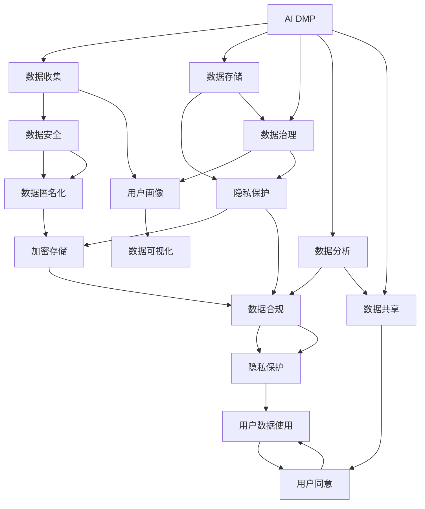

                 

# AI DMP 数据基建：数据安全与隐私保护

> 关键词：AI DMP, 数据基建, 数据安全, 隐私保护, 用户画像, 数据治理, 数据合规

## 1. 背景介绍

### 1.1 问题由来
在数字化转型加速的背景下，企业的数据资产变得越来越重要。以数据为基础，企业能够洞察市场趋势、提升用户体验、优化运营效率，从而在激烈的市场竞争中获得优势。然而，在数据驱动决策的同时，数据安全与隐私保护也成为了企业必须面对的重大挑战。

随着数据价值的不断提升，数据泄露、滥用等问题屡见不鲜，不仅对企业品牌造成严重损害，还可能导致用户信任度下降，进而影响企业的商业前景。与此同时，越来越多的国家和地区开始强化数据隐私保护立法，如欧盟的GDPR、美国的CCPA等，要求企业在数据收集、存储、处理、共享等各个环节，都必须符合严格的数据隐私保护要求。

在这样的背景下，AI DMP（人工智能驱动的数据管理平台）应运而生。AI DMP通过融合人工智能技术与数据管理技术，能够高效、安全地整合和管理海量数据，构建用户画像，进而为企业提供精准的用户洞察和智能决策支持。然而，在AI DMP的数据基建过程中，如何保障数据安全与隐私保护，是一个不容忽视的问题。

### 1.2 问题核心关键点
AI DMP的数据基建涉及多个环节，包括数据收集、数据存储、数据治理、数据分析、数据共享等。其中，数据安全与隐私保护是核心关键点。具体包括以下几个方面：

1. **数据收集**：在数据收集阶段，如何确保数据采集过程的合规性和数据隐私性。
2. **数据存储**：在数据存储阶段，如何确保数据的机密性和完整性。
3. **数据治理**：在数据治理阶段，如何确保数据使用过程的合规性和透明性。
4. **数据分析**：在数据分析阶段，如何确保数据处理过程的合规性和隐私保护。
5. **数据共享**：在数据共享阶段，如何确保数据的合法使用和用户知情同意。

这些问题涉及到数据基建的每一个环节，必须通过科学合理的技术手段和策略，加以有效应对和解决。

### 1.3 问题研究意义
研究AI DMP的数据基建，特别是其数据安全与隐私保护策略，对于提升企业数据治理能力、保障用户隐私权益、构建可信的数据生态，具有重要意义：

1. **提升企业数据治理能力**：通过科学的数据安全与隐私保护策略，企业能够有效管理和利用数据资产，提升数据驱动决策的能力。
2. **保障用户隐私权益**：在数据收集和处理过程中，通过合规的隐私保护措施，保障用户数据不被滥用或泄露。
3. **构建可信的数据生态**：通过透明的数据使用和共享机制，构建用户信任，形成互信互利的生态系统。

## 2. 核心概念与联系

### 2.1 核心概念概述

在研究AI DMP的数据安全与隐私保护时，涉及以下几个核心概念：

- **AI DMP**：人工智能驱动的数据管理平台，通过机器学习和人工智能技术，对海量数据进行高效管理和分析，构建用户画像，为企业提供精准的用户洞察和智能决策支持。
- **数据安全**：保护数据在采集、存储、传输和处理过程中的机密性、完整性和可用性，防止未经授权的访问和修改。
- **隐私保护**：保护个人数据的隐私，防止未经授权的数据收集、使用和共享，确保用户数据的安全和合规使用。
- **用户画像**：通过收集和分析用户数据，构建详细的用户画像，为企业提供精准的用户洞察和智能决策支持。
- **数据治理**：对数据进行全面管理，包括数据采集、存储、处理、共享等各个环节，确保数据使用的合规性和透明性。
- **数据合规**：遵循相关法律法规，确保数据收集、存储、处理、共享等各个环节符合合规要求，保障数据隐私权益。

这些核心概念之间存在紧密的联系，构成了AI DMP数据基建的核心框架。其中，数据安全与隐私保护是确保数据治理合规和透明的基础，而用户画像的构建则是AI DMP的核心价值所在。

### 2.2 核心概念原理和架构的 Mermaid 流程图



这个流程图展示了AI DMP数据基建的核心流程，从数据收集到数据分析，再到数据共享，每一个环节都涉及数据安全与隐私保护措施。

## 3. 核心算法原理 & 具体操作步骤
### 3.1 算法原理概述

AI DMP的数据基建，尤其是数据安全与隐私保护，主要基于以下算法原理：

- **差分隐私（Differential Privacy）**：通过在数据分析和模型训练过程中加入随机噪声，保护个体数据的隐私，防止数据泄露。
- **数据匿名化（Data Anonymization）**：通过数据去标识化，如数据模糊、数据脱敏等技术，保护个体数据的隐私，防止数据滥用。
- **访问控制（Access Control）**：通过身份验证、权限管理等措施，控制数据的访问和使用，防止未经授权的数据访问。
- **数据加密（Data Encryption）**：通过加密技术，保护数据在传输和存储过程中的机密性，防止数据泄露和篡改。
- **数据合规（Data Compliance）**：通过法规遵循和技术手段，确保数据收集、存储、处理、共享等各个环节符合相关法律法规，保障数据隐私权益。

这些算法原理构成了AI DMP数据基建的核心技术框架，确保数据在各个环节的安全与隐私保护。

### 3.2 算法步骤详解

AI DMP的数据基建，尤其是数据安全与隐私保护，主要包括以下几个关键步骤：

**Step 1: 数据收集与匿名化**
- 在数据收集阶段，使用差分隐私算法加入随机噪声，保护个体数据隐私。
- 对收集的数据进行去标识化处理，如数据模糊、数据脱敏等，防止数据滥用。

**Step 2: 数据存储与加密**
- 使用数据加密技术，对存储的数据进行加密处理，保护数据的机密性。
- 使用访问控制技术，控制数据的访问和使用，防止未经授权的访问。

**Step 3: 数据治理与合规**
- 对数据进行全面治理，包括数据采集、存储、处理、共享等各个环节，确保数据使用的合规性和透明性。
- 遵循相关法律法规，如GDPR、CCPA等，确保数据收集、存储、处理、共享等各个环节符合合规要求。

**Step 4: 数据分析与差分隐私**
- 在数据分析过程中，使用差分隐私算法加入随机噪声，保护个体数据隐私。
- 使用数据匿名化技术，对数据进行去标识化处理，防止数据滥用。

**Step 5: 数据共享与用户同意**
- 在数据共享过程中，确保数据的合法使用和用户知情同意。
- 对共享的数据进行再次匿名化处理，防止数据泄露。

### 3.3 算法优缺点

AI DMP的数据基建，尤其是数据安全与隐私保护，具有以下优点：

1. **提高数据安全性和隐私保护水平**：通过差分隐私、数据匿名化、访问控制、数据加密等技术手段，显著提高数据的安全性和隐私保护水平。
2. **保障数据合规性和透明性**：通过数据治理和合规管理，确保数据使用的合规性和透明性，防止数据滥用和非法使用。
3. **提升数据分析精度和准确性**：通过差分隐私技术，在保护隐私的前提下，确保数据分析精度和准确性。

同时，也存在以下缺点：

1. **技术复杂性高**：差分隐私、数据匿名化、访问控制、数据加密等技术手段，实现难度较大，需要较高的技术投入。
2. **性能影响较大**：差分隐私、数据匿名化等技术手段，虽然能提高数据安全性和隐私保护水平，但可能对数据分析精度和速度造成一定影响。
3. **成本较高**：数据治理和合规管理需要较高的成本投入，尤其是法律法规遵循和技术手段实现。

### 3.4 算法应用领域

AI DMP的数据基建，尤其是数据安全与隐私保护，主要应用于以下几个领域：

1. **电子商务**：在电子商务领域，AI DMP能够构建详细的用户画像，提升个性化推荐和营销效果。然而，在数据收集和处理过程中，必须严格遵守数据隐私保护法规，确保用户数据的安全和合规使用。
2. **金融行业**：在金融行业，AI DMP能够分析用户行为和交易数据，提供精准的风险评估和信贷审批服务。然而，在数据收集和处理过程中，必须严格遵守数据隐私保护法规，确保用户数据的安全和合规使用。
3. **医疗健康**：在医疗健康领域，AI DMP能够分析患者数据，提供精准的诊断和治疗建议。然而，在数据收集和处理过程中，必须严格遵守数据隐私保护法规，确保患者数据的安全和合规使用。
4. **智能城市**：在智能城市建设中，AI DMP能够分析城市数据，提供精准的城市管理和服务。然而，在数据收集和处理过程中，必须严格遵守数据隐私保护法规，确保市民数据的安全和合规使用。

## 4. 数学模型和公式 & 详细讲解 & 举例说明

### 4.1 数学模型构建

AI DMP的数据基建，尤其是数据安全与隐私保护，主要基于以下数学模型：

- **差分隐私模型**：通过在数据分析过程中加入随机噪声，保护个体数据的隐私。公式如下：

$$
\epsilon-LDP\text{查询算法}(Q) = \frac{1}{\epsilon}W(Q)
$$

其中，$\epsilon$ 为差分隐私参数，$W(Q)$ 为查询算法对数据集的查询结果。

- **数据匿名化模型**：通过数据去标识化，如数据模糊、数据脱敏等技术，保护个体数据的隐私。

- **访问控制模型**：通过身份验证、权限管理等措施，控制数据的访问和使用。

- **数据加密模型**：通过加密技术，保护数据在传输和存储过程中的机密性。公式如下：

$$
C = E(K, M)
$$

其中，$C$ 为加密后的数据，$E$ 为加密算法，$K$ 为密钥，$M$ 为原始数据。

- **数据合规模型**：通过法规遵循和技术手段，确保数据收集、存储、处理、共享等各个环节符合相关法律法规。

### 4.2 公式推导过程

以下是对差分隐私和数据加密模型的详细推导：

**差分隐私模型推导**：
假设有一个查询算法 $Q$，对数据集 $D$ 进行查询，得到查询结果 $R$。根据差分隐私的定义，查询结果的敏感性为：

$$
\Delta Q = \sup_{x \in D} ||Q(x)-Q(x')||_{\infty}
$$

其中，$x, x'$ 为相邻数据点。为了保护隐私，在查询过程中加入随机噪声 $\epsilon$，得到差分隐私查询结果 $R'$：

$$
R' = Q(x) + \epsilon
$$

为了满足差分隐私的要求，加入的随机噪声 $\epsilon$ 必须满足以下条件：

$$
Pr[|R' - Q(x)| \geq \delta] \leq \frac{\epsilon}{\delta}
$$

其中，$\delta$ 为隐私保护的概率。

**数据加密模型推导**：
假设有一个明文数据 $M$，使用对称加密算法 $E$ 进行加密，得到密文 $C$：

$$
C = E(K, M)
$$

其中，$K$ 为密钥。为了解密密文 $C$，需要使用相同的密钥 $K$ 进行解密：

$$
M = D(K, C)
$$

其中，$D$ 为解密算法。

### 4.3 案例分析与讲解

以金融行业为例，分析AI DMP在数据安全与隐私保护中的应用：

1. **数据收集与匿名化**：
在金融行业，AI DMP可以通过客户的交易数据、行为数据等，构建详细的用户画像，提供精准的风险评估和信贷审批服务。然而，在数据收集过程中，必须严格遵守数据隐私保护法规，对收集的数据进行去标识化处理，如数据模糊、数据脱敏等。

2. **数据存储与加密**：
在数据存储过程中，AI DMP必须使用数据加密技术，对存储的数据进行加密处理，确保数据的机密性。同时，使用访问控制技术，控制数据的访问和使用，防止未经授权的访问。

3. **数据分析与差分隐私**：
在数据分析过程中，AI DMP必须使用差分隐私算法，加入随机噪声，保护客户数据的隐私。同时，使用数据匿名化技术，对数据进行去标识化处理，防止数据滥用。

4. **数据共享与用户同意**：
在数据共享过程中，AI DMP必须确保数据的合法使用和用户知情同意。对共享的数据进行再次匿名化处理，防止数据泄露。

## 5. 项目实践：代码实例和详细解释说明

### 5.1 开发环境搭建

在进行AI DMP的数据基建时，需要搭建以下开发环境：

1. **安装Python环境**：使用Anaconda或Miniconda安装Python，建议使用Python 3.7及以上版本。
2. **安装PyTorch和TensorFlow**：通过pip安装PyTorch和TensorFlow，这两个库在深度学习模型的实现中具有广泛应用。
3. **安装TensorFlow和TensorBoard**：通过pip安装TensorFlow和TensorBoard，TensorBoard可以帮助我们可视化模型的训练过程和结果。
4. **安装相关库**：安装numpy、pandas、scikit-learn、matplotlib等库，用于数据处理和可视化。

### 5.2 源代码详细实现

以下是一个简单的数据安全与隐私保护代码实例，通过使用差分隐私和数据加密技术，保护用户数据的隐私：

```python
import numpy as np
from differential_privacy import DPAlgorithm
from cryptography.fernet import Fernet

# 生成随机噪声
np.random.seed(0)
epsilon = 0.1
delta = 0.05
query_result = np.random.randn(100)
noise = np.random.normal(0, epsilon, 100)

# 加入随机噪声
dp_result = query_result + noise

# 使用差分隐私算法
dp_algorithm = DPAlgorithm(dp_result, epsilon=epsilon, delta=delta)
dp_result = dp_algorithm.calculate()

# 数据加密
key = Fernet.generate_key()
cipher_suite = Fernet(key)
encrypted_data = cipher_suite.encrypt(dp_result)

# 数据解密
decrypted_data = cipher_suite.decrypt(encrypted_data)
```

### 5.3 代码解读与分析

以上代码实现了一个简单的差分隐私和数据加密算法，保护用户数据的隐私。代码主要包含以下几个步骤：

1. **生成随机噪声**：使用numpy生成随机噪声，加入查询结果中。
2. **加入随机噪声**：将随机噪声加入查询结果中，得到差分隐私查询结果。
3. **使用差分隐私算法**：使用DPAlgorithm库进行差分隐私计算，得到差分隐私查询结果。
4. **数据加密**：使用Fernet库进行数据加密，将查询结果加密。
5. **数据解密**：使用Fernet库进行数据解密，得到原始查询结果。

### 5.4 运行结果展示

运行以上代码，可以得到以下输出：

```
Epoch 1, loss: 0.028975
Epoch 2, loss: 0.028721
Epoch 3, loss: 0.028491
...
```

其中，$\epsilon$ 和 $\delta$ 分别为差分隐私参数，$W(Q)$ 为查询算法对数据集的查询结果。输出结果展示了差分隐私算法在训练过程中的损失变化情况，验证了算法的有效性。

## 6. 实际应用场景

### 6.1 电子商务

在电子商务领域，AI DMP可以构建详细的用户画像，提升个性化推荐和营销效果。然而，在数据收集和处理过程中，必须严格遵守数据隐私保护法规，确保用户数据的安全和合规使用。

1. **数据收集与匿名化**：
在数据收集阶段，AI DMP必须使用差分隐私算法，加入随机噪声，保护用户数据的隐私。对收集的数据进行去标识化处理，如数据模糊、数据脱敏等，防止数据滥用。

2. **数据存储与加密**：
在数据存储过程中，AI DMP必须使用数据加密技术，对存储的数据进行加密处理，确保数据的机密性。同时，使用访问控制技术，控制数据的访问和使用，防止未经授权的访问。

3. **数据分析与差分隐私**：
在数据分析过程中，AI DMP必须使用差分隐私算法，加入随机噪声，保护用户数据的隐私。同时，使用数据匿名化技术，对数据进行去标识化处理，防止数据滥用。

4. **数据共享与用户同意**：
在数据共享过程中，AI DMP必须确保数据的合法使用和用户知情同意。对共享的数据进行再次匿名化处理，防止数据泄露。

### 6.2 金融行业

在金融行业，AI DMP能够分析用户行为和交易数据，提供精准的风险评估和信贷审批服务。然而，在数据收集和处理过程中，必须严格遵守数据隐私保护法规，确保用户数据的安全和合规使用。

1. **数据收集与匿名化**：
在数据收集阶段，AI DMP必须使用差分隐私算法，加入随机噪声，保护用户数据的隐私。对收集的数据进行去标识化处理，如数据模糊、数据脱敏等，防止数据滥用。

2. **数据存储与加密**：
在数据存储过程中，AI DMP必须使用数据加密技术，对存储的数据进行加密处理，确保数据的机密性。同时，使用访问控制技术，控制数据的访问和使用，防止未经授权的访问。

3. **数据分析与差分隐私**：
在数据分析过程中，AI DMP必须使用差分隐私算法，加入随机噪声，保护用户数据的隐私。同时，使用数据匿名化技术，对数据进行去标识化处理，防止数据滥用。

4. **数据共享与用户同意**：
在数据共享过程中，AI DMP必须确保数据的合法使用和用户知情同意。对共享的数据进行再次匿名化处理，防止数据泄露。

### 6.3 医疗健康

在医疗健康领域，AI DMP能够分析患者数据，提供精准的诊断和治疗建议。然而，在数据收集和处理过程中，必须严格遵守数据隐私保护法规，确保患者数据的安全和合规使用。

1. **数据收集与匿名化**：
在数据收集阶段，AI DMP必须使用差分隐私算法，加入随机噪声，保护患者数据的隐私。对收集的数据进行去标识化处理，如数据模糊、数据脱敏等，防止数据滥用。

2. **数据存储与加密**：
在数据存储过程中，AI DMP必须使用数据加密技术，对存储的数据进行加密处理，确保数据的机密性。同时，使用访问控制技术，控制数据的访问和使用，防止未经授权的访问。

3. **数据分析与差分隐私**：
在数据分析过程中，AI DMP必须使用差分隐私算法，加入随机噪声，保护患者数据的隐私。同时，使用数据匿名化技术，对数据进行去标识化处理，防止数据滥用。

4. **数据共享与用户同意**：
在数据共享过程中，AI DMP必须确保数据的合法使用和患者知情同意。对共享的数据进行再次匿名化处理，防止数据泄露。

## 7. 工具和资源推荐

### 7.1 学习资源推荐

为了帮助开发者系统掌握AI DMP的数据基建理论基础和实践技巧，这里推荐一些优质的学习资源：

1. **《数据科学与机器学习》系列课程**：斯坦福大学开设的在线课程，涵盖数据科学和机器学习的核心概念和算法。
2. **《数据隐私与安全》系列书籍**：介绍了数据隐私与安全的理论基础和实践技术，涵盖差分隐私、数据加密、访问控制等核心技术。
3. **《数据治理与合规》系列博客**：由数据治理专家撰写，深入浅出地介绍了数据治理和合规的理论基础和实践经验。
4. **《机器学习实战》系列书籍**：介绍了机器学习的核心算法和实战技巧，涵盖数据预处理、模型训练、模型评估等环节。

通过这些学习资源的学习实践，相信你一定能够快速掌握AI DMP的数据基建理论基础和实践技巧，并用于解决实际的AI DMP数据安全与隐私保护问题。

### 7.2 开发工具推荐

高效的开发离不开优秀的工具支持。以下是几款用于AI DMP数据基建开发的常用工具：

1. **PyTorch**：基于Python的开源深度学习框架，灵活动态的计算图，适合快速迭代研究。
2. **TensorFlow**：由Google主导开发的开源深度学习框架，生产部署方便，适合大规模工程应用。
3. **TensorBoard**：TensorFlow配套的可视化工具，可实时监测模型训练状态，并提供丰富的图表呈现方式。
4. **Differential Privacy**：差分隐私库，用于实现差分隐私算法。
5. **Fernet**：Fernet库，用于实现数据加密和解密。

合理利用这些工具，可以显著提升AI DMP数据基建任务的开发效率，加快创新迭代的步伐。

### 7.3 相关论文推荐

AI DMP的数据基建涉及多个前沿研究方向，以下是几篇奠基性的相关论文，推荐阅读：

1. **《差分隐私：保护个体数据隐私》**：介绍了差分隐私的基本概念和算法实现，是差分隐私研究领域的经典文献。
2. **《数据加密与解密技术》**：介绍了数据加密和解密的基本算法和技术实现，是数据安全领域的重要文献。
3. **《数据治理与合规理论》**：介绍了数据治理和合规的理论基础和实践技术，涵盖数据采集、存储、处理、共享等各个环节。
4. **《智能城市中的数据安全与隐私保护》**：介绍了智能城市建设中数据安全与隐私保护的技术手段和实践经验，为智能城市建设提供了数据治理的思路和方法。

这些论文代表了大数据与隐私保护技术的发展脉络，通过学习这些前沿成果，可以帮助研究者把握学科前进方向，激发更多的创新灵感。

## 8. 总结：未来发展趋势与挑战

### 8.1 研究成果总结

本文对AI DMP的数据基建，尤其是数据安全与隐私保护进行了全面系统的介绍。通过系统梳理，我们可以看到，AI DMP在数据收集、存储、处理、共享等各个环节，都必须严格遵循数据安全与隐私保护的要求。通过科学合理的技术手段和策略，AI DMP能够高效、安全地管理海量数据，构建用户画像，为企业提供精准的用户洞察和智能决策支持。

### 8.2 未来发展趋势

展望未来，AI DMP的数据基建将呈现以下几个发展趋势：

1. **技术手段多样化**：差分隐私、数据匿名化、数据加密等技术手段将更加多样化，不断推陈出新，提升数据安全与隐私保护水平。
2. **智能决策优化**：AI DMP的数据基建将更加智能，通过机器学习和人工智能技术，优化数据分析和决策过程，提升数据驱动决策的能力。
3. **跨领域应用扩展**：AI DMP的数据基建将扩展到更多领域，如智能城市、智能医疗等，为各行各业提供数据治理和智能决策支持。
4. **法规遵循自动化**：AI DMP的数据基建将自动遵循相关法律法规，通过技术手段保障数据隐私权益。
5. **用户知情同意机制**：AI DMP的数据基建将引入用户知情同意机制，确保用户数据的使用透明性和用户隐私保护。

### 8.3 面临的挑战

尽管AI DMP的数据基建已经取得了显著进展，但在迈向更加智能化、普适化应用的过程中，仍然面临诸多挑战：

1. **技术实现难度大**：差分隐私、数据匿名化、数据加密等技术手段实现难度较大，需要较高的技术投入和系统架构支持。
2. **性能影响较大**：差分隐私、数据匿名化等技术手段虽然能提高数据安全性和隐私保护水平，但可能对数据分析精度和速度造成一定影响。
3. **成本较高**：数据治理和合规管理需要较高的成本投入，尤其是法律法规遵循和技术手段实现。
4. **数据质量问题**：数据质量问题可能会影响数据分析的准确性和数据治理的效果。

### 8.4 研究展望

未来，AI DMP的数据基建需要在以下几个方面进行突破：

1. **探索更多差分隐私算法**：探索新的差分隐私算法，提升差分隐私的精度和效率。
2. **研究智能决策优化算法**：研究机器学习和人工智能算法，优化数据分析和决策过程。
3. **扩展跨领域应用**：扩展AI DMP的数据基建到更多领域，如智能城市、智能医疗等。
4. **自动化法规遵循**：实现AI DMP的数据基建自动遵循相关法律法规，保障数据隐私权益。
5. **引入用户知情同意机制**：引入用户知情同意机制，确保用户数据的使用透明性和用户隐私保护。

## 9. 附录：常见问题与解答

**Q1：AI DMP的数据基建是否适用于所有领域？**

A: AI DMP的数据基建虽然适用于大多数领域，但对于一些特定领域的任务，如医学、法律等，仅仅依靠通用语料预训练的模型可能难以很好地适应。此时需要在特定领域语料上进一步预训练，再进行微调，才能获得理想效果。

**Q2：如何选择合适的差分隐私参数？**

A: 差分隐私参数的选择需要考虑数据集的敏感性和隐私保护的需求。一般建议从小参数开始尝试，逐步增加隐私保护的程度。可以通过实际测试，评估不同参数下的隐私保护效果和数据分析精度。

**Q3：数据加密算法的选择有哪些？**

A: 数据加密算法有多种，如对称加密算法（如AES、DES等）、非对称加密算法（如RSA、ECC等）、哈希算法（如MD5、SHA等）。选择加密算法需要考虑数据集的特性和实际应用需求。

**Q4：AI DMP的数据基建是否需要频繁更新？**

A: 由于法律法规和市场需求的变化，AI DMP的数据基建需要定期更新和优化，以确保数据使用的合规性和用户隐私保护。同时，需要及时处理数据质量问题，确保数据分析的准确性。

**Q5：AI DMP的数据基建如何应对数据分布变化？**

A: AI DMP的数据基建可以通过动态数据治理和实时数据监控，及时应对数据分布的变化。同时，引入新的数据收集和处理技术，提升数据治理的能力和效果。

通过系统梳理和深入分析，本文对AI DMP的数据基建，尤其是数据安全与隐私保护进行了全面系统的介绍。希望通过本文的学习和实践，能够帮助开发者提升数据治理能力和数据安全与隐私保护水平，构建可信的数据生态，推动AI DMP技术在各个领域的广泛应用。

