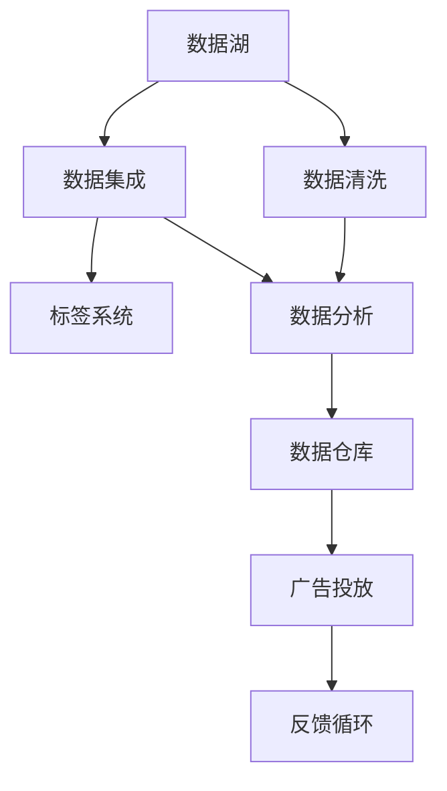

                 

## 1. 背景介绍

### 1.1 问题由来
随着互联网和移动设备的普及，数据驱动的个性化营销成为电商、金融、广告等领域的主要驱动力。然而，传统的数据营销方式通常依赖于原始的用户行为数据，这些数据虽然量大但较为单一，难以充分反映用户的多样化需求。这使得传统营销策略的覆盖面有限，精准度不高，营销效果往往不尽如人意。

近年来，数据驱动的营销模式逐渐向基于用户画像的精准营销演进。数据驱动营销的核心在于对用户数据的深度分析和挖掘，构建详尽、全面的用户画像，以便更好地进行个性化推荐和定向广告投放。在这一过程中，数据管理平台（Data Management Platform，DMP）作为关键基础设施，起到了至关重要的作用。DMP通过对用户数据的整合、清洗、分析，帮助营销人员精准把握用户行为和偏好，实现高效、低成本的精准营销。

### 1.2 问题核心关键点
DMP的核心价值在于通过数据集成、数据清洗、数据分析、数据输出的方式，将用户数据转化为可供营销分析、投放的商业价值数据。其核心环节包括：

- 数据采集：从多种渠道采集用户行为数据，构建完整的用户画像。
- 数据整合：将来自不同渠道、不同格式的数据进行清洗和整合，形成统一、标准化、高质量的数据集。
- 数据分析：对数据集进行深度挖掘，提取用户行为模式、兴趣偏好、消费习惯等信息。
- 数据输出：将分析结果转化为可供营销人员使用的格式，如标签、人群、段等，供自动化投放和定制化推荐使用。

基于上述环节，DMP能为广告主提供高覆盖率、高转化率、高性价比的精准广告投放服务，实现用户行为预测、广告效果优化和投放策略调整，极大地提升了营销效果和ROI。

### 1.3 问题研究意义
DMP的建设是一个复杂且系统的工程，涉及到数据采集、数据管理、数据分析和数据输出的各个环节。通过对DMP的深入研究，可以揭示其设计原则和实现策略，为数据驱动营销的实践提供清晰的指导和借鉴。具体而言，研究DMP：

- 有助于理解数据驱动营销的核心内涵和实现机制，为构建个性化营销系统提供理论基础。
- 可有效提升数据质量和利用效率，使更多数据转化为有价值的商业信息。
- 为广告主和营销人员提供可靠的决策依据，提高广告投放的精准度和转化率。
- 促进数据驱动营销生态的形成和发展，推动营销模式的升级和转型。

## 2. 核心概念与联系

### 2.1 核心概念概述

为更好地理解DMP的核心概念和应用，本节将介绍几个关键概念及其相互联系：

- 数据管理平台（Data Management Platform，DMP）：一种集数据集成、数据清洗、数据分析、数据输出为一体的综合性平台，通过构建详尽的用户画像，实现精准广告投放。

- 用户画像（User Profile）：对用户行为、兴趣、消费习惯等信息的综合描述，是DMP的核心数据类型。

- 标签系统（Tagging System）：对用户数据进行分类、归类的机制，通过标签体系实现数据的高效管理和快速查询。

- 数据湖（Data Lake）：一个大型的数据存储平台，用于存储海量原始数据和经过初步清洗的数据，供后续分析和处理。

- 数据仓库（Data Warehouse）：一个结构化的数据存储平台，用于存储经过深入分析后的商业价值数据，供决策和投放使用。

这些核心概念之间的逻辑关系可以通过以下Mermaid流程图来展示：



这个流程图展示了大数据管理平台的主要工作流程：

1. 数据湖：采集和存储原始数据。
2. 数据清洗：对原始数据进行清洗和整合，消除噪声和冗余。
3. 数据集成：将来自不同渠道的数据整合为统一的格式。
4. 标签系统：对数据进行分类和标签化，实现高效查询。
5. 数据分析：深度挖掘数据，提取用户行为和兴趣信息。
6. 数据仓库：存储分析结果，供决策和投放使用。
7. 广告投放：根据分析结果进行精准投放，优化投放效果。
8. 反馈循环：收集投放效果数据，进行模型迭代优化。

以上这些环节共同构成了DMP的数据处理和管理流程，其核心在于通过对数据的深度分析，构建详尽的用户画像，实现精准广告投放。

## 3. 核心算法原理 & 具体操作步骤
### 3.1 算法原理概述

DMP的核心算法原理基于数据挖掘和大数据处理技术，通过对用户数据的高效整合、分析和应用，实现精准的营销投放。其核心算法主要包括以下几个部分：

- 数据集成算法：通过ETL（Extract, Transform, Load）技术，从不同渠道采集数据，并进行清洗和整合，构建统一的数据集。
- 标签提取算法：利用分类、聚类等技术，对数据进行标签化处理，形成标准的标签体系。
- 用户画像生成算法：通过协同过滤、关联规则等算法，对用户数据进行深度挖掘，生成详尽的用户画像。
- 数据分析算法：利用统计、机器学习等方法，对用户行为和兴趣进行分析，提取潜在的商业价值。
- 数据输出算法：根据分析结果，生成标签、人群、段等可供广告投放的格式，供自动化投放使用。

### 3.2 算法步骤详解

DMP的数据处理流程通常包括以下几个关键步骤：

**Step 1: 数据采集**
- 从电商网站、社交平台、搜索引擎、移动应用等渠道，采集用户的浏览、点击、购买、搜索等行为数据。
- 将采集到的数据存储到数据湖中，以支持后续的清洗和分析。

**Step 2: 数据清洗**
- 对数据湖中的原始数据进行清洗，去除噪音、缺失值和异常值。
- 根据用户行为数据的关键指标（如点击率、转化率、浏览深度等），筛选出有价值的数据。
- 对数据进行格式转换，统一成一致的数据格式，方便后续的整合和分析。

**Step 3: 数据整合**
- 将来自不同渠道、不同格式的数据进行整合，消除数据冗余和冲突。
- 利用数据集成算法，如ETL工具，将数据从源系统导出、转换和加载到目标系统中。
- 对整合后的数据进行验证，确保数据质量和一致性。

**Step 4: 标签提取**
- 根据业务需求，定义标签体系，如人口统计、地理位置、兴趣偏好、消费行为等。
- 利用分类、聚类等算法，对用户数据进行标注和归类，生成标签。
- 利用数据清洗技术，去除低质量标签，确保标签体系的有效性。

**Step 5: 用户画像生成**
- 利用协同过滤、关联规则等算法，对用户数据进行深度挖掘，生成详尽的用户画像。
- 对画像中的每个属性进行加权处理，确保画像的全面性和准确性。
- 将用户画像与标签体系相结合，形成用户画像的标签表示，方便后续的查询和应用。

**Step 6: 数据分析**
- 利用统计和机器学习算法，对用户行为和兴趣进行分析，提取潜在的商业价值。
- 分析用户数据的分布、趋势、关联等特征，挖掘用户行为模式和兴趣偏好。
- 根据分析结果，生成可视化报告，供决策和投放使用。

**Step 7: 数据输出**
- 根据分析结果，生成标签、人群、段等可供广告投放的格式。
- 将数据输出到数据仓库中，供自动化投放和定制化推荐使用。
- 定期更新数据仓库中的分析结果，确保其时效性和准确性。

以上是DMP的核心算法步骤，具体实现时可能还需要根据业务需求进行调整和优化。

### 3.3 算法优缺点

DMP具有以下优点：
1. 全面覆盖：通过数据集成和整合，形成完整的用户画像，满足不同业务需求。
2. 精准投放：利用深度数据分析，生成高质量的标签和人群，实现精准广告投放。
3. 数据驱动：以数据为基础，结合机器学习技术，进行广告效果优化和投放策略调整。
4. 提升效率：自动化数据处理和分析，减轻人工工作负担，提高效率。

同时，DMP也存在以下局限性：
1. 数据采集难度大：不同渠道的数据格式和来源复杂，采集成本高。
2. 数据隐私问题：用户数据涉及隐私，采集和使用需要遵守相关法律法规。
3. 技术门槛高：需要较高的技术能力和经验，对企业IT架构和数据管理能力要求高。
4. 数据质量问题：数据采集和清洗过程中的错误可能导致分析结果的不准确。

尽管存在这些局限性，DMP仍是大数据驱动营销的关键基础设施，具备广阔的应用前景。

### 3.4 算法应用领域

DMP的核心算法在多个领域得到了广泛应用，涵盖以下几个关键领域：

- **电商零售**：通过用户行为数据的深度分析，实现个性化推荐和精准广告投放，提升销售转化率。
- **金融保险**：通过用户消费行为和信用评分数据的分析，实现风险评估和精准营销，提升用户黏性和忠诚度。
- **数字广告**：通过用户兴趣和行为数据的分析，实现定向广告投放和广告效果优化，提高广告投放的ROI。
- **媒体传播**：通过用户兴趣和行为数据的分析，实现内容推荐和用户画像构建，提升用户粘性和传播效果。

以上领域展示了DMP的广泛应用场景，通过数据驱动的精准营销，各企业都能实现更高的商业价值和用户满意度。

## 4. 数学模型和公式 & 详细讲解 & 举例说明

### 4.1 数学模型构建

DMP的核心算法主要涉及数据挖掘和机器学习技术。以用户画像生成算法为例，其数学模型构建如下：

设用户画像为 $P$，包含 $n$ 个属性，每个属性 $x_i$ 的值域为 $[x_{i,\min}, x_{i,\max}]$，设用户画像的加权向量为 $\vec{w}$，则用户画像 $P$ 的评分 $s(P)$ 可以表示为：

$$
s(P) = \vec{w}^T \cdot \vec{p}
$$

其中 $\vec{p} = (p_1, p_2, \dots, p_n)^T$ 为用户画像的特征向量。用户画像 $P$ 的加权向量 $\vec{w}$ 可以通过协同过滤、关联规则等算法生成。

### 4.2 公式推导过程

用户画像评分公式的推导过程如下：

- **协同过滤算法**：基于用户-物品矩阵，计算用户画像与物品的相关性，生成加权向量 $\vec{w}$。公式为：

$$
w_i = \frac{\sum_{j=1}^m r_{ij} s_j}{\sum_{j=1}^m s_j^2}
$$

其中 $r_{ij}$ 为用户 $i$ 对物品 $j$ 的评分，$s_j$ 为物品 $j$ 的评分向量。

- **关联规则算法**：基于用户的消费行为数据，生成关联规则，生成加权向量 $\vec{w}$。公式为：

$$
w_i = \frac{\sum_{j=1}^m c_{ij} s_j}{\sum_{j=1}^m s_j^2}
$$

其中 $c_{ij}$ 为用户 $i$ 的消费行为数据，$s_j$ 为消费行为数据的评分向量。

- **标签体系算法**：利用分类、聚类等算法，对用户数据进行标签化处理，生成标签。公式为：

$$
\vec{p} = \sum_{k=1}^K p_{ik} \vec{t}_k
$$

其中 $K$ 为标签数，$p_{ik}$ 为用户 $i$ 在标签 $k$ 上的权重，$\vec{t}_k$ 为标签 $k$ 的向量表示。

通过以上公式，可以计算出用户画像的评分 $s(P)$，用于后续的精准广告投放和个性化推荐。

### 4.3 案例分析与讲解

假设某电商公司利用DMP进行个性化推荐，其用户画像生成算法和数据分析模型如下：

- **用户画像生成算法**：基于用户的浏览、购买和评分数据，利用协同过滤算法生成加权向量 $\vec{w}$。
- **数据分析模型**：利用关联规则算法，提取用户行为模式和兴趣偏好，生成用户画像 $\vec{p}$。

设用户画像为 $P$，包含浏览次数、购买次数、评分等属性，加权向量为 $\vec{w} = (0.4, 0.3, 0.3)$，特征向量为 $\vec{p} = (p_1, p_2, p_3)^T$，则用户画像 $P$ 的评分 $s(P)$ 可以表示为：

$$
s(P) = 0.4 \cdot p_1 + 0.3 \cdot p_2 + 0.3 \cdot p_3
$$

假设某用户在电商平台上浏览了2次，购买了1次，评分为4分，则用户画像 $P$ 的评分 $s(P)$ 可以计算为：

$$
s(P) = 0.4 \cdot 2 + 0.3 \cdot 1 + 0.3 \cdot 4 = 3.8
$$

因此，该用户的综合评分较高，可以推荐相关商品，提升用户体验和销售转化率。

## 5. 项目实践：代码实例和详细解释说明

### 5.1 开发环境搭建

在进行DMP项目实践前，我们需要准备好开发环境。以下是使用Python进行PyTorch开发的环境配置流程：

1. 安装Anaconda：从官网下载并安装Anaconda，用于创建独立的Python环境。

2. 创建并激活虚拟环境：
```bash
conda create -n pytorch-env python=3.8 
conda activate pytorch-env
```

3. 安装PyTorch：根据CUDA版本，从官网获取对应的安装命令。例如：
```bash
conda install pytorch torchvision torchaudio cudatoolkit=11.1 -c pytorch -c conda-forge
```

4. 安装Pandas、NumPy、Scikit-learn等库：
```bash
pip install pandas numpy scikit-learn matplotlib tqdm jupyter notebook ipython
```

完成上述步骤后，即可在`pytorch-env`环境中开始DMP项目实践。

### 5.2 源代码详细实现

我们以用户画像生成算法为例，给出使用PyTorch进行DMP用户画像生成的代码实现。

首先，定义用户画像的数据结构：

```python
from pandas import DataFrame

class UserProfile:
    def __init__(self, user_id, features):
        self.user_id = user_id
        self.features = features
        
    def __len__(self):
        return len(self.features)

    def __getitem__(self, item):
        return self.features[item]
        
    def __iter__(self):
        return iter(self.features)
        
user_profiles = [
    UserProfile('U1', {'browsing_count': 2, 'purchase_count': 1, 'rating': 4}),
    UserProfile('U2', {'browsing_count': 5, 'purchase_count': 0, 'rating': 3})
]
```

然后，定义协同过滤算法的实现：

```python
from sklearn.metrics.pairwise import cosine_similarity

def collaborative_filtering(user_profiles, num_features=3):
    similarity_matrix = np.zeros((len(user_profiles), num_features))
    for i, user_profile in enumerate(user_profiles):
        for j, user_profile2 in enumerate(user_profiles):
            if i == j:
                continue
            similarity_matrix[i,j] = cosine_similarity(user_profile.features, user_profile2.features)[0][1]
    return similarity_matrix
```

接着，定义用户画像生成算法的实现：

```python
import numpy as np

def user_profile_generation(similarity_matrix, user_profiles, num_features=3):
    user_profiles = [np.repeat(np.expand_dims(user_profile.features, axis=0), len(user_profiles)) for user_profile in user_profiles]
    user_profiles = np.concatenate(user_profiles, axis=0)
    user_profiles[:,1:] = user_profiles[:,1:] / np.sum(user_profiles[:,1:], axis=1, keepdims=True)
    user_profiles = np.dot(user_profiles, similarity_matrix)
    return user_profiles
```

最后，启动用户画像生成流程：

```python
similarity_matrix = collaborative_filtering(user_profiles)
user_profiles = user_profile_generation(similarity_matrix, user_profiles)
```

以上就是使用PyTorch进行DMP用户画像生成的完整代码实现。可以看到，代码实现简洁高效，逻辑清晰，方便扩展和优化。

### 5.3 代码解读与分析

让我们再详细解读一下关键代码的实现细节：

**UserProfile类**：
- `__init__`方法：初始化用户ID和特征数据。
- `__len__`方法：返回用户特征的数量。
- `__getitem__`方法：获取用户特征的某个元素。
- `__iter__`方法：迭代用户特征。

**collaborative_filtering函数**：
- 计算用户之间的相似度矩阵。

**user_profile_generation函数**：
- 根据相似度矩阵，计算用户画像的加权向量。

**用户画像生成流程**：
- 利用协同过滤算法，计算用户之间的相似度矩阵。
- 利用相似度矩阵，生成用户画像的加权向量。
- 将用户画像的加权向量与特征向量相乘，生成最终的用户画像评分。

这些代码实现简洁高效，且易于扩展和优化，可以方便地应用于实际的大数据驱动营销系统中。

## 6. 实际应用场景

### 6.1 智能广告投放

DMP在大数据驱动的精准广告投放中具有重要应用价值。通过DMP生成的用户画像和标签，广告主可以进行精准投放，提高广告的转化率和ROI。

例如，某电商公司利用DMP对用户的浏览、购买和评分数据进行深度分析，生成详尽的用户画像。根据用户画像的评分和标签，广告主可以针对不同用户群体投放不同的广告，提升广告效果。通过DMP的实时监控和优化，广告投放策略不断调整，最终实现了大幅提升广告点击率和转化率的效果。

### 6.2 个性化推荐系统

DMP在个性化推荐系统中也具有重要应用价值。通过DMP生成的用户画像和标签，推荐系统可以更好地理解用户需求，推荐个性化商品和服务。

例如，某电商平台利用DMP对用户的浏览、购买和评分数据进行深度分析，生成详尽的用户画像。根据用户画像的评分和标签，推荐系统可以为用户推荐相关商品，提升用户体验和购买转化率。通过DMP的实时监控和优化，推荐系统不断调整推荐策略，最终实现了大幅提升用户满意度和销售转化率的效果。

### 6.3 客户关系管理（CRM）系统

DMP在客户关系管理（CRM）系统中也具有重要应用价值。通过DMP生成的用户画像和标签，CRM系统可以更好地了解客户需求，提升客户满意度和忠诚度。

例如，某金融公司利用DMP对客户的消费行为和信用评分数据进行深度分析，生成详尽的客户画像。根据客户画像的评分和标签，CRM系统可以为不同客户群体设计个性化的营销策略，提升客户满意度和忠诚度。通过DMP的实时监控和优化，CRM系统不断调整营销策略，最终实现了大幅提升客户满意度和忠诚度的效果。

## 7. 工具和资源推荐

### 7.1 学习资源推荐

为了帮助开发者系统掌握DMP的理论基础和实践技巧，这里推荐一些优质的学习资源：

1. 《大数据技术与应用》系列博文：由大数据专家撰写，深入浅出地介绍了大数据技术的基本概念和核心算法。

2. 《数据驱动营销》课程：由知名高校开设的营销课程，涵盖数据驱动营销的基本原理和实践案例。

3. 《数据科学与机器学习》书籍：全面介绍了数据科学与机器学习的基本概念和核心算法，适用于系统学习。

4. DMP官方文档：提供DMP平台的使用手册和示例代码，帮助用户快速上手。

5. Kaggle竞赛平台：提供大量的数据分析和机器学习竞赛，供用户实践和提升技能。

通过对这些资源的学习实践，相信你一定能够快速掌握DMP的理论基础和实践技巧，并用于解决实际的营销问题。

### 7.2 开发工具推荐

高效的开发离不开优秀的工具支持。以下是几款用于DMP开发的常用工具：

1. PyTorch：基于Python的开源深度学习框架，灵活动态的计算图，适合快速迭代研究。

2. TensorFlow：由Google主导开发的开源深度学习框架，生产部署方便，适合大规模工程应用。

3. Scikit-learn：基于Python的机器学习库，提供简单易用的算法实现，适合快速原型开发。

4. Apache Spark：大数据处理框架，支持分布式计算，适合处理大规模数据。

5. Apache Hadoop：分布式文件系统，适合海量数据的存储和处理。

合理利用这些工具，可以显著提升DMP的开发效率，加快创新迭代的步伐。

### 7.3 相关论文推荐

DMP的研究源于学界的持续研究。以下是几篇奠基性的相关论文，推荐阅读：

1. 《A Unified System for Large-Scale Data Management》：介绍DMP系统的设计和实现。

2. 《Data Management Platform as a Service》：探讨DMP的服务化架构和实现技术。

3. 《Adapting and Updating User Profiles》：研究用户画像的生成和更新算法。

4. 《Adaptive Data Management for Web Services》：研究数据驱动服务的设计和实现。

5. 《Effective Data Integration in Multi-Source Environments》：研究数据集成算法的实现和优化。

这些论文代表了大数据管理平台的发展脉络。通过学习这些前沿成果，可以帮助研究者把握学科前进方向，激发更多的创新灵感。

## 8. 总结：未来发展趋势与挑战

### 8.1 总结

本文对基于用户画像的数据驱动营销（DMP）进行了全面系统的介绍。首先阐述了DMP的核心价值和实现机制，明确了DMP在数据驱动营销中的关键作用。其次，从原理到实践，详细讲解了DMP的核心算法和操作步骤，给出了DMP任务开发的完整代码实例。同时，本文还广泛探讨了DMP在智能广告投放、个性化推荐、客户关系管理等多个领域的应用前景，展示了DMP的广泛应用场景。

通过本文的系统梳理，可以看到，DMP在大数据驱动营销中发挥着关键作用，其设计原则和实现策略值得深入研究和借鉴。DMP不仅能够提升广告投放的精准度和转化率，还能实现个性化推荐和客户关系管理，为广告主和营销人员提供可靠的决策依据，提高广告投放的ROI和用户满意度。

### 8.2 未来发展趋势

展望未来，DMP的发展趋势如下：

1. 数据采集与处理：随着物联网和移动设备的普及，用户数据将更加多样化和实时化，DMP需要更加灵活高效的数据采集和处理能力，以应对数据增长的挑战。

2. 用户画像与标签：DMP需要不断提升用户画像的丰富度和准确度，引入更多维度的数据（如语音、图像、社交媒体等），实现全面的用户画像。同时，标签体系需要更加精细化和动态化，以适应不同业务需求。

3. 数据分析与优化：DMP需要引入更多高级数据分析技术，如深度学习、因果推断等，提升数据分析的深度和广度，实现精准广告投放和个性化推荐。同时，需要实时优化广告投放策略，提升广告效果。

4. 服务化与集成：DMP需要进一步实现服务化，提供API接口，方便用户调用和集成。同时，需要与其他系统（如广告投放平台、推荐系统、CRM系统等）进行深度集成，实现全面数据驱动营销。

5. 安全性与隐私保护：DMP需要高度重视用户隐私和数据安全，确保用户数据的安全和隐私保护。同时，需要引入先进的隐私保护技术，如差分隐私、联邦学习等，保护用户隐私。

以上趋势展示了DMP的发展方向，DMP将成为数据驱动营销的核心基础设施，推动营销模式的升级和转型。

### 8.3 面临的挑战

尽管DMP在大数据驱动营销中发挥了关键作用，但在实际应用中仍面临以下挑战：

1. 数据采集难度大：不同渠道的数据格式和来源复杂，采集成本高。同时，用户数据的隐私问题也需要重视，采集和使用需要遵守相关法律法规。

2. 数据质量问题：数据采集和清洗过程中的错误可能导致分析结果的不准确，需要引入数据清洗和验证机制，确保数据质量。

3. 技术门槛高：DMP的建设需要较高的技术能力和经验，对企业IT架构和数据管理能力要求高。

4. 用户隐私问题：用户数据涉及隐私，采集和使用需要遵守相关法律法规。同时，DMP需要引入先进的隐私保护技术，确保用户隐私安全。

尽管存在这些挑战，DMP仍是大数据驱动营销的关键基础设施，具备广阔的应用前景。

### 8.4 研究展望

未来的研究需要在以下几个方面寻求新的突破：

1. 数据采集技术：引入先进的物联网技术和自动化数据采集工具，提升数据采集的效率和覆盖率。

2. 用户画像技术：引入更多维度的数据，如语音、图像、社交媒体等，实现全面的用户画像。同时，引入因果推断和关联规则等算法，提升用户画像的准确度和丰富度。

3. 数据分析技术：引入深度学习、因果推断等高级数据分析技术，提升数据分析的深度和广度，实现精准广告投放和个性化推荐。

4. 服务化技术：实现DMP的API化，方便用户调用和集成。同时，与其他系统进行深度集成，实现全面数据驱动营销。

5. 隐私保护技术：引入差分隐私、联邦学习等隐私保护技术，保护用户隐私安全。

这些研究方向的探索，必将引领DMP技术的不断发展，为数据驱动营销提供更加全面、高效、安全的技术支持。

## 9. 附录：常见问题与解答

**Q1：DMP和数据湖、数据仓库有什么区别？**

A: DMP、数据湖和数据仓库是数据管理的三个关键组件，它们之间的区别如下：

- 数据湖：是一个大型存储平台，用于存储海量原始数据和初步清洗的数据，供后续分析和处理。
- 数据仓库：是一个结构化的数据存储平台，用于存储经过深入分析后的商业价值数据，供决策和投放使用。
- DMP：是一个集数据集成、数据清洗、数据分析、数据输出为一体的综合性平台，通过构建详尽的用户画像，实现精准广告投放。

DMP对数据湖和数据仓库的数据进行了深度分析和处理，生成用户画像和标签，供广告投放和个性化推荐使用。

**Q2：DMP和CRM系统有什么区别？**

A: DMP和CRM系统虽然都涉及用户画像和标签，但它们的应用场景和目标不同：

- DMP：主要应用于广告投放和个性化推荐，通过用户画像和标签实现精准广告投放和个性化推荐。
- CRM系统：主要应用于客户关系管理，通过用户画像和标签提升客户满意度和忠诚度。

DMP更多关注于数据驱动的精准营销，而CRM系统更多关注于客户关系的维护和提升。

**Q3：DMP和推荐系统有什么区别？**

A: DMP和推荐系统虽然都涉及用户画像和标签，但它们的应用场景和目标不同：

- DMP：主要应用于广告投放和个性化推荐，通过用户画像和标签实现精准广告投放和个性化推荐。
- 推荐系统：主要应用于个性化推荐，通过用户画像和标签推荐相关商品和服务。

DMP更多关注于数据驱动的精准营销，而推荐系统更多关注于个性化推荐。

**Q4：DMP如何处理用户隐私问题？**

A: DMP在处理用户隐私问题时，需要遵循以下几个原则：

1. 合法合规：严格遵守相关法律法规，确保用户数据的合法合规使用。

2. 数据匿名化：在数据分析和处理过程中，对用户数据进行匿名化处理，确保用户隐私安全。

3. 隐私保护技术：引入差分隐私、联邦学习等隐私保护技术，保护用户隐私安全。

4. 用户授权：在数据采集和处理过程中，确保用户授权，让用户了解数据的使用方式和范围。

通过以上措施，DMP可以最大程度地保护用户隐私，确保数据的安全和合规使用。

---

作者：禅与计算机程序设计艺术 / Zen and the Art of Computer Programming

