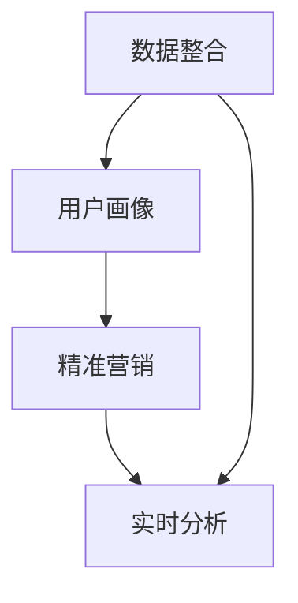

                 

# AI DMP 数据基建：构建数据驱动的营销生态

## 1. 背景介绍

### 1.1 问题由来
近年来，随着互联网和移动设备的普及，海量的用户行为数据不断涌现。这些数据不仅仅是数字化时代的“金矿”，更蕴含着巨大的商业价值。如何有效利用这些数据，驱动营销决策，提升用户体验，已经成为企业和数据科学家面临的重大挑战。

数字营销从业者开始引入数据分析、人工智能技术，推动营销从粗放式的流量运营向精细化的客户洞察转变。然而，如何高效整合和应用用户数据，构建一个统一、安全的营销数据平台，成为业界亟需解决的问题。AI DMP（人工智能驱动的数据管理平台）应运而生，它能够自动化地整合和分析用户数据，构建详细的用户画像，驱动精准营销和个性化推荐。

### 1.2 问题核心关键点
AI DMP的核心在于数据整合、分析和应用的闭环体系。该平台集成了用户行为数据、交易数据、社交媒体数据等，通过深度学习、数据挖掘等技术，对用户进行全面刻画，构建详细的用户画像。基于这些画像，AI DMP可以驱动更精准的广告投放、更个性化的产品推荐，从而提升用户体验和营销效果。

AI DMP与传统的CRM系统、DMP（数据管理平台）不同，它采用数据驱动的方式，融合人工智能技术，提升了数据整合和分析的效率，实现了营销决策的智能化。以下是AI DMP的主要特点：

- 数据融合：能够整合多渠道、多格式的数据，如网站访问数据、交易数据、社交媒体数据等。
- 用户画像：基于数据融合结果，自动构建详细的用户画像，包括兴趣、行为、消费习惯等信息。
- 精准营销：利用用户画像，实现更精准的广告投放和个性化推荐。
- 实时分析：实时分析用户行为数据，提供实时的营销洞察，支撑快速决策。

AI DMP的优势在于能够实现数据整合、用户画像构建和营销决策的闭环，通过数据驱动的方式提升营销效果，为用户带来更好的体验。

## 2. 核心概念与联系

### 2.1 核心概念概述

AI DMP的核心概念主要包括数据整合、用户画像、精准营销和实时分析。这些概念之间通过数据流和算法模型相互关联，共同构成了AI DMP的核心体系。

- **数据整合**：指从多个渠道（如网站、社交媒体、电商平台等）收集用户行为数据，通过统一的数据规范和格式，整合成为一体化的数据集。
- **用户画像**：基于整合后的数据集，通过机器学习算法对用户进行全面刻画，生成详细的用户画像，包括兴趣、行为、消费习惯等信息。
- **精准营销**：利用用户画像，实现更精准的广告投放和个性化推荐，提升营销效果和用户体验。
- **实时分析**：实时分析用户行为数据，提供实时的营销洞察，支撑快速决策。

这些核心概念之间的逻辑关系可以通过以下Mermaid流程图来展示：



该流程图展示了AI DMP各核心概念之间的逻辑关系：数据整合是基础，用户画像基于整合后的数据构建，精准营销和实时分析则分别驱动具体的营销决策和实时分析。

## 3. 核心算法原理 & 具体操作步骤
### 3.1 算法原理概述

AI DMP的算法原理主要基于机器学习和数据挖掘技术，通过构建数据模型，对用户进行全面刻画。其核心算法包括但不限于：

- 用户聚类算法：将用户按照兴趣、行为等特征进行分类，形成不同用户群体。
- 协同过滤算法：利用用户的历史行为数据，推荐用户可能感兴趣的产品或内容。
- 深度学习算法：通过深度神经网络，提取用户数据的隐含特征，构建更精确的用户画像。

AI DMP的算法步骤通常包括以下几个关键步骤：

1. 数据预处理：对原始数据进行清洗、格式化、去重等处理，确保数据的质量。
2. 数据整合：将不同来源的数据整合到一起，形成统一的数据集。
3. 特征工程：对整合后的数据进行特征提取，如用户兴趣、行为、消费习惯等。
4. 用户画像构建：基于特征工程的结果，通过机器学习算法对用户进行全面刻画，构建详细的用户画像。
5. 精准营销：利用用户画像，实现更精准的广告投放和个性化推荐。
6. 实时分析：实时分析用户行为数据，提供实时的营销洞察，支撑快速决策。

### 3.2 算法步骤详解

以下以协同过滤算法为例，详细讲解其具体操作步骤。

#### 3.2.1 协同过滤算法步骤

1. **数据准备**：收集用户的行为数据，如浏览记录、购买记录等。
2. **特征工程**：对行为数据进行特征提取，如用户ID、商品ID、浏览时间等。
3. **数据整合**：将不同来源的行为数据整合到一起，形成统一的数据集。
4. **模型训练**：利用协同过滤算法，对用户的行为数据进行建模，形成推荐模型。
5. **预测推荐**：利用训练好的模型，对新用户的行为进行预测，推荐可能感兴趣的商品或内容。
6. **效果评估**：对推荐结果进行效果评估，如点击率、转化率等指标，不断优化推荐算法。

#### 3.2.2 算法优缺点

协同过滤算法的优点在于：

- 简单易用：不需要复杂的数据处理，可以处理大规模数据集。
- 准确性高：能够根据用户的历史行为，准确预测其未来的行为。

然而，协同过滤算法也存在以下缺点：

- 数据稀疏性：当用户的历史行为数据较少时，推荐效果可能较差。
- 冷启动问题：对于新用户，难以快速建立推荐模型。

### 3.3 算法应用领域

AI DMP的算法广泛应用于多种场景，如电商、广告、社交媒体等，通过数据驱动的方式，提升营销效果和用户体验。以下是几个典型的应用场景：

1. **电商推荐系统**：基于用户的行为数据，推荐用户可能感兴趣的商品。
2. **广告投放优化**：根据用户画像，实现更精准的广告投放，提升广告效果。
3. **社交媒体个性化推荐**：根据用户的兴趣和行为，推荐可能感兴趣的内容，提升用户粘性。
4. **在线教育推荐系统**：推荐符合用户兴趣的课程和内容，提升学习效果。

## 4. 数学模型和公式 & 详细讲解 & 举例说明

### 4.1 数学模型构建

AI DMP的数学模型构建通常包括以下几个步骤：

1. **数据表示**：将用户行为数据表示为向量形式，如用户的浏览记录、购买记录等。
2. **相似度计算**：计算不同用户行为数据的相似度，如余弦相似度、欧式距离等。
3. **用户聚类**：利用聚类算法，将相似用户分为同一类，形成用户群体。
4. **推荐算法**：基于用户聚类结果，推荐用户可能感兴趣的商品或内容。

#### 4.1.1 用户聚类模型

用户聚类模型通常采用K-means算法，将用户按照兴趣、行为等特征进行分类。具体步骤如下：

1. **初始化聚类中心**：随机选择K个初始聚类中心。
2. **分配用户到簇**：根据每个用户的行为数据，计算其与每个聚类中心的相似度，分配到最近的簇。
3. **更新聚类中心**：根据分配后的簇内的用户行为数据，重新计算每个聚类中心的坐标。
4. **迭代更新**：重复步骤2和3，直到聚类中心不再变化或达到预设的迭代次数。

数学公式如下：

$$
\text{聚类中心} = \mathop{\arg\min}_{c} \sum_{i=1}^N ||\text{user}_i - c_k||^2
$$

其中，$\text{user}_i$表示用户行为数据，$c_k$表示第k个聚类中心，$N$表示用户数量，$K$表示聚类数量。

### 4.2 公式推导过程

以协同过滤算法为例，推导推荐模型的公式：

设用户集合为$U$，商品集合为$I$，用户对商品的评分矩阵为$R \in \mathbb{R}^{m \times n}$，其中$m$表示用户数，$n$表示商品数。

推荐模型$P \in \mathbb{R}^{m \times n}$定义为：

$$
P_{i,j} = \alpha \cdot R_{i,j} + (1-\alpha) \cdot \sum_{k \in \text{nei}(i)} \frac{R_{k,j}}{\sqrt{\sum_{l \in \text{nei}(k)} R_{k,l}} \cdot \frac{R_{i,k}}{\sqrt{\sum_{l \in \text{nei}(i)} R_{i,l}} + \epsilon
$$

其中，$\alpha$为调节参数，$\text{nei}(i)$表示用户$i$的邻居集，$\epsilon$为平滑项，用于处理评分矩阵中的0值。

该公式表示，对于用户$i$和商品$j$，推荐模型$P_{i,j}$由两部分组成：用户$i$和商品$j$之间的直接评分$R_{i,j}$和用户$i$的邻居$k$对商品$j$的评分$R_{k,j}$。

### 4.3 案例分析与讲解

#### 4.3.1 电商推荐系统案例

以亚马逊推荐系统为例，展示如何利用AI DMP的协同过滤算法进行推荐。

1. **数据收集**：收集用户在亚马逊平台上的浏览记录、购买记录等行为数据。
2. **数据预处理**：对数据进行清洗、去重等处理，确保数据的质量。
3. **数据整合**：将不同来源的数据整合到一起，形成统一的数据集。
4. **模型训练**：利用协同过滤算法，对用户的行为数据进行建模，形成推荐模型。
5. **预测推荐**：利用训练好的模型，对新用户的行为进行预测，推荐可能感兴趣的商品。
6. **效果评估**：对推荐结果进行效果评估，如点击率、转化率等指标，不断优化推荐算法。

通过AI DMP构建的亚马逊推荐系统，能够在用户浏览商品时，实时推荐相关商品，提升用户体验和销售转化率。

## 5. 项目实践：代码实例和详细解释说明
### 5.1 开发环境搭建

在进行AI DMP的实践开发前，需要准备好开发环境。以下是使用Python进行PyTorch开发的环境配置流程：

1. 安装Anaconda：从官网下载并安装Anaconda，用于创建独立的Python环境。
2. 创建并激活虚拟环境：
```bash
conda create -n ai-dmp-env python=3.8 
conda activate ai-dmp-env
```
3. 安装PyTorch：根据CUDA版本，从官网获取对应的安装命令。例如：
```bash
conda install pytorch torchvision torchaudio cudatoolkit=11.1 -c pytorch -c conda-forge
```
4. 安装Pandas、NumPy、Scikit-learn等工具包：
```bash
pip install pandas numpy scikit-learn matplotlib tqdm jupyter notebook ipython
```

完成上述步骤后，即可在`ai-dmp-env`环境中开始AI DMP的实践开发。

### 5.2 源代码详细实现

以下是一个简单的协同过滤算法的实现，用于电商推荐系统：

```python
import pandas as pd
import numpy as np
import torch
from sklearn.decomposition import TruncatedSVD

# 数据准备
df = pd.read_csv('user_behavior.csv')

# 特征工程
user_ids = df['user_id'].unique().tolist()
item_ids = df['item_id'].unique().tolist()

user_item_matrix = df.pivot_table(values='rating', index='user_id', columns='item_id', fillna=0).to_numpy()
user_item_matrix = np.where(user_item_matrix != 0, user_item_matrix, 0)

# 模型训练
svd = TruncatedSVD(n_components=100, random_state=42)
svd.fit(user_item_matrix)

# 预测推荐
user_item_matrix_transformed = svd.transform(user_item_matrix)

def predict(user_id, top_n=10):
    user_vector = user_item_matrix_transformed[user_id]
    similarities = np.dot(user_vector, user_item_matrix_transformed)
    top_indices = similarities.argsort()[-top_n][::-1]
    return df.iloc[user_ids.index(user_id)]['item_id'].iloc[top_indices]

# 测试
user_id = 1
recommended_items = predict(user_id)
print(recommended_items)
```

在这个例子中，我们首先加载用户行为数据，进行特征工程，构建用户-商品评分矩阵。然后使用SVD算法对评分矩阵进行降维，得到用户向量表示。最后，根据用户向量，计算相似度，推荐出可能感兴趣的商品。

### 5.3 代码解读与分析

以下是代码中各部分的详细解读：

**特征工程**：
- 首先，我们需要将用户行为数据加载到Pandas DataFrame中，并进行清洗、去重等处理。
- 然后，从数据中提取用户ID和商品ID，构建用户-商品评分矩阵。

**模型训练**：
- 使用TruncatedSVD算法对评分矩阵进行降维，得到用户向量表示。
- 设置SVD的维度为100，随机种子为42，确保结果可复现。

**预测推荐**：
- 定义一个`predict`函数，接收用户ID，返回推荐商品列表。
- 在函数中，首先计算用户向量与评分矩阵的相似度，排序后获取最相似的物品ID。
- 最后，根据用户ID，从数据中获取对应用户的商品ID列表，并返回推荐商品列表。

**测试**：
- 在测试部分，我们调用`predict`函数，传入用户ID，获取推荐商品列表。
- 打印推荐商品列表，以验证结果。

## 6. 实际应用场景

### 6.1 电商推荐系统

AI DMP在电商推荐系统中的应用非常广泛。通过整合用户行为数据和商品数据，AI DMP能够构建详细的用户画像，实现更精准的推荐，提升用户购物体验和销售转化率。

具体而言，AI DMP可以通过以下步骤实现电商推荐：

1. **数据收集**：收集用户在电商平台上的浏览记录、购买记录等行为数据。
2. **数据预处理**：对数据进行清洗、去重等处理，确保数据的质量。
3. **数据整合**：将不同来源的数据整合到一起，形成统一的数据集。
4. **用户画像构建**：利用机器学习算法对用户进行全面刻画，构建详细的用户画像。
5. **推荐算法**：基于用户画像，推荐用户可能感兴趣的商品。
6. **效果评估**：对推荐结果进行效果评估，如点击率、转化率等指标，不断优化推荐算法。

通过AI DMP构建的电商推荐系统，能够实时推荐相关商品，提升用户购物体验和销售转化率，推动电商业务的发展。

### 6.2 广告投放优化

AI DMP在广告投放优化中的应用也非常广泛。通过整合用户行为数据和广告数据，AI DMP能够构建详细的用户画像，实现更精准的广告投放，提升广告效果。

具体而言，AI DMP可以通过以下步骤实现广告投放优化：

1. **数据收集**：收集用户在平台上的行为数据，如浏览记录、点击记录等。
2. **数据预处理**：对数据进行清洗、去重等处理，确保数据的质量。
3. **数据整合**：将不同来源的数据整合到一起，形成统一的数据集。
4. **用户画像构建**：利用机器学习算法对用户进行全面刻画，构建详细的用户画像。
5. **广告投放优化**：基于用户画像，实现更精准的广告投放。
6. **效果评估**：对广告投放效果进行评估，如点击率、转化率等指标，不断优化广告投放策略。

通过AI DMP构建的广告投放优化系统，能够实时调整广告投放策略，提升广告效果，驱动广告业务的发展。

## 7. 工具和资源推荐
### 7.1 学习资源推荐

为了帮助开发者系统掌握AI DMP的理论基础和实践技巧，这里推荐一些优质的学习资源：

1. 《Deep Learning for Business》一书：由Coursera专家撰写，涵盖深度学习在商业中的应用，包括AI DMP在内的多个前沿话题。
2. CS229《机器学习》课程：斯坦福大学开设的机器学习明星课程，涵盖机器学习的基本概念和算法，适合深入学习。
3. Kaggle竞赛平台：提供大量数据集和竞赛任务，帮助开发者实践AI DMP相关的算法和模型。
4. PyTorch官方文档：PyTorch的官方文档，提供丰富的代码示例和API接口，是学习PyTorch的最佳资料。
5. Hugging Face官方文档：提供丰富的预训练语言模型和NLP工具库，适合进行AI DMP相关的实验和研究。

通过对这些资源的学习实践，相信你一定能够快速掌握AI DMP的核心概念和算法，并用于解决实际的NLP问题。

### 7.2 开发工具推荐

高效的开发离不开优秀的工具支持。以下是几款用于AI DMP开发的常用工具：

1. PyTorch：基于Python的开源深度学习框架，灵活动态的计算图，适合快速迭代研究。PyTorch提供了丰富的深度学习模型和算法库，适合进行AI DMP相关的实验和研究。
2. TensorFlow：由Google主导开发的开源深度学习框架，生产部署方便，适合大规模工程应用。TensorFlow提供了丰富的深度学习模型和算法库，适合进行AI DMP相关的实验和研究。
3. Scikit-learn：基于Python的机器学习库，提供了丰富的数据处理和模型评估工具，适合进行特征工程和模型评估。
4. Jupyter Notebook：Python开发者的必备工具，支持实时展示代码执行结果，适合进行数据处理和模型实验。
5. Weights & Biases：模型训练的实验跟踪工具，可以记录和可视化模型训练过程中的各项指标，方便对比和调优。

合理利用这些工具，可以显著提升AI DMP开发的效率，加快创新迭代的步伐。

### 7.3 相关论文推荐

AI DMP技术的发展源于学界的持续研究。以下是几篇奠基性的相关论文，推荐阅读：

1. Hierarchical Matrix Methods for SVD-based Recommender Systems（即SVD算法）：提出了一种基于矩阵分解的推荐算法，用于电商推荐系统。
2. TensorFlow Recommenders：谷歌开发的推荐系统工具库，提供了丰富的推荐算法和模型，适合进行AI DMP相关的研究和开发。
3. Scalable Matrix Factorization Techniques for Recommender Systems（即SVD算法）：提出了一种基于矩阵分解的推荐算法，用于大规模推荐系统。
4. Deep Learning Recommender Systems：提出了一种基于深度学习的推荐算法，用于构建精准的用户画像和推荐模型。

这些论文代表了大语言模型微调技术的发展脉络。通过学习这些前沿成果，可以帮助研究者把握学科前进方向，激发更多的创新灵感。

## 8. 总结：未来发展趋势与挑战
### 8.1 总结

本文对AI DMP数据基建的原理和应用进行了全面系统的介绍。首先阐述了AI DMP在数据整合、用户画像、精准营销和实时分析方面的核心概念，明确了AI DMP在构建数据驱动营销生态中的独特价值。其次，从原理到实践，详细讲解了AI DMP的算法步骤和核心算法，给出了AI DMP任务开发的完整代码实例。同时，本文还广泛探讨了AI DMP在电商推荐、广告投放等多个领域的应用前景，展示了AI DMP范式的巨大潜力。

通过本文的系统梳理，可以看到，AI DMP作为数据驱动的营销生态的构建者，能够整合多渠道数据，构建详细的用户画像，驱动精准营销和个性化推荐，为数字营销带来深远的影响。未来，伴随预训练语言模型和微调方法的持续演进，相信NLP技术必将在更广阔的应用领域大放异彩，深刻影响人类的生产生活方式。

### 8.2 未来发展趋势

展望未来，AI DMP技术将呈现以下几个发展趋势：

1. 数据融合技术的发展：随着数据来源的多样化，AI DMP需要更加高效地整合来自不同渠道的数据，实现数据的统一和标准化。
2. 用户画像的深度挖掘：AI DMP需要利用机器学习、深度学习等技术，进一步挖掘用户画像中的隐含特征，提升用户画像的准确性。
3. 推荐算法的创新：AI DMP需要不断探索新的推荐算法，如协同过滤、深度学习推荐等，提升推荐效果。
4. 实时分析能力的提升：AI DMP需要实现实时分析，提供实时的营销洞察，支撑快速决策。
5. 智能决策系统的构建：AI DMP需要与智能决策系统进行深度融合，驱动更智能的营销决策。

以上趋势凸显了AI DMP技术的发展方向，这些方向的探索发展，必将进一步提升AI DMP系统的性能和应用范围，为数字营销带来深远的影响。

### 8.3 面临的挑战

尽管AI DMP技术已经取得了显著成果，但在迈向更加智能化、普适化应用的过程中，它仍面临着诸多挑战：

1. 数据隐私和安全问题：AI DMP需要整合大量的用户数据，如何保护用户隐私和数据安全，防止数据泄露，是亟需解决的问题。
2. 数据质量问题：AI DMP需要高品质的数据进行训练和推理，数据缺失、噪声等问题可能会影响模型的效果。
3. 算法复杂性问题：AI DMP中的推荐算法和实时分析算法较为复杂，如何实现高效、可解释的算法模型，是未来需要解决的问题。
4. 模型公平性问题：AI DMP中的推荐算法和实时分析算法需要考虑公平性问题，避免对某些用户或群体的歧视。
5. 跨领域适应性问题：AI DMP中的推荐算法和实时分析算法需要在不同领域中实现良好的适应性。

以上挑战需要研究者深入研究，提出有效的解决方案，才能确保AI DMP技术的应用效果和可接受性。

### 8.4 研究展望

面对AI DMP技术所面临的挑战，未来的研究需要在以下几个方面寻求新的突破：

1. 引入更多先验知识：AI DMP需要引入更多的先验知识，如知识图谱、逻辑规则等，与深度学习模型进行融合，提升推荐效果。
2. 融合更多模态数据：AI DMP需要融合视觉、语音等多模态数据，实现多模态信息与文本信息的协同建模。
3. 优化实时分析算法：AI DMP需要优化实时分析算法，提高分析速度和精度，满足实时分析需求。
4. 实现跨领域适应性：AI DMP需要实现跨领域的适应性，提升算法在不同领域中的性能。
5. 引入因果推断和博弈论工具：AI DMP需要引入因果推断和博弈论工具，提升推荐算法的稳定性和鲁棒性。

这些研究方向的探索，必将引领AI DMP技术迈向更高的台阶，为构建安全、可靠、可解释、可控的智能系统铺平道路。面向未来，AI DMP技术还需要与其他人工智能技术进行更深入的融合，如知识表示、因果推理、强化学习等，多路径协同发力，共同推动智能决策系统的进步。只有勇于创新、敢于突破，才能不断拓展AI DMP技术的边界，让智能技术更好地造福人类社会。

## 9. 附录：常见问题与解答

**Q1: 如何构建高质量的用户画像？**

A: 构建高质量的用户画像需要从数据收集、特征工程、模型训练等多个环节进行优化。以下是几个关键步骤：

1. **数据收集**：收集用户行为数据、交易数据、社交媒体数据等，确保数据的全面性和代表性。
2. **特征工程**：对数据进行特征提取，如用户兴趣、行为、消费习惯等，选择有代表性的特征进行建模。
3. **模型训练**：利用机器学习算法对用户进行全面刻画，构建详细的用户画像，如协同过滤、深度学习等。
4. **效果评估**：对用户画像进行效果评估，如用户留存率、推荐效果等指标，不断优化用户画像构建过程。

**Q2: 如何提升AI DMP的实时分析能力？**

A: 提升AI DMP的实时分析能力需要从数据流、模型、算法等多个环节进行优化。以下是几个关键步骤：

1. **数据流优化**：优化数据采集和处理流程，确保数据实时、准确地进入分析系统。
2. **模型优化**：利用分布式计算、GPU加速等技术，提升模型的计算速度和精度。
3. **算法优化**：优化实时分析算法，如基于滑动窗口的滑动平均算法、基于流数据的在线学习算法等，提高实时分析效果。
4. **存储优化**：优化数据的存储和检索，确保数据的快速访问和处理。

**Q3: 如何确保AI DMP的数据隐私和安全？**

A: 确保AI DMP的数据隐私和安全需要从数据采集、存储、传输等多个环节进行优化。以下是几个关键步骤：

1. **数据匿名化**：对数据进行匿名化处理，如脱敏、扰动等，确保数据隐私。
2. **数据加密**：对数据进行加密处理，确保数据传输的安全性。
3. **访问控制**：对数据进行严格的访问控制，确保只有授权人员才能访问数据。
4. **安全审计**：对数据处理和传输过程进行安全审计，确保数据处理的合规性。

**Q4: 如何评估AI DMP的效果？**

A: 评估AI DMP的效果需要从多个指标进行综合评估。以下是几个关键指标：

1. **精准度**：评估推荐算法的准确性和效果，如点击率、转化率等。
2. **覆盖度**：评估推荐算法对用户覆盖的范围，如用户覆盖率、商品覆盖率等。
3. **用户满意度**：评估用户对推荐结果的满意度，如用户满意度调查等。
4. **广告效果**：评估广告投放的效果，如广告点击率、广告转化率等。

**Q5: 如何优化AI DMP的推荐算法？**

A: 优化AI DMP的推荐算法需要从数据处理、模型选择、参数调整等多个环节进行优化。以下是几个关键步骤：

1. **数据处理**：优化数据清洗、去重等处理流程，确保数据的质量和完整性。
2. **模型选择**：选择适合的推荐算法，如协同过滤、深度学习推荐等。
3. **参数调整**：根据实际效果，不断调整推荐算法的参数，提升推荐效果。
4. **特征工程**：选择有代表性的特征进行建模，提高推荐算法的准确性。

---

作者：禅与计算机程序设计艺术 / Zen and the Art of Computer Programming

