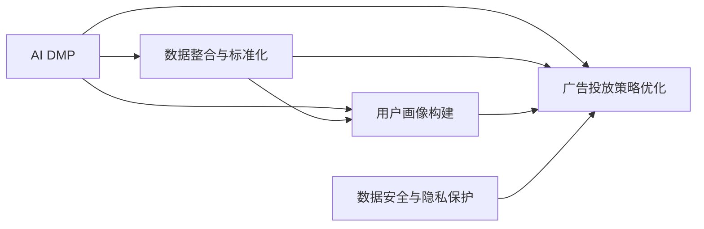

                 

## 1. 背景介绍

### 1.1 问题由来

在数字化营销时代，企业正经历着前所未有的变革。传统的营销模式已无法满足现代消费者的需求，数字化转型成为各大企业亟待解决的问题。然而，如何利用数据驱动营销，实现用户画像精细化、广告投放精准化，一直是企业面临的巨大挑战。

AI DMP（数据驱动的营销平台）作为这一转型的关键技术，通过对用户行为数据的分析和挖掘，实现了用户画像的构建和广告投放策略的优化，使企业在数据驱动的营销生态中占据了优势。然而，随着技术的发展，传统AI DMP在数据整合、用户画像准确性和广告投放效率等方面仍存在诸多不足，需要进一步的升级和优化。

### 1.2 问题核心关键点

AI DMP的核心问题在于如何高效地整合和管理海量用户数据，构建精准的用户画像，并根据画像特征进行精准的广告投放。该问题的解决需要依赖于数据平台、算法模型和应用场景的深度融合，实现数据驱动的营销生态的构建。

1. **数据整合与标准化**：如何高效地整合分散在不同渠道、不同来源的用户数据，并进行标准化处理，使其成为可用的数据资产。
2. **用户画像构建**：如何利用机器学习算法，对整合后的用户数据进行分析和建模，构建准确的、多维度的用户画像。
3. **广告投放策略优化**：如何基于用户画像特征，实现广告投放的精准匹配和优化，提升广告投放的效果和ROI。
4. **数据安全与隐私保护**：如何在数据整合、存储和使用的全流程中，保证数据的安全性和用户的隐私权益。

### 1.3 问题研究意义

AI DMP作为数据驱动营销的重要组成部分，对于推动企业数字化转型、提升广告投放效果具有重要意义：

1. **数据驱动决策**：通过分析用户数据，企业能够更精准地制定营销策略，避免盲目投资，提升广告ROI。
2. **用户画像精细化**：精准的用户画像有助于企业细分市场，实现个性化营销，提高用户满意度和忠诚度。
3. **投放效果优化**：精准的广告投放策略能够显著提升广告的点击率和转化率，提高营销活动的效果。
4. **多渠道协同**：AI DMP能够整合多渠道的用户数据，实现跨渠道的协同营销，提升整体营销效果。
5. **数据安全与隐私保护**：保障数据安全和用户隐私，增强用户信任，促进数据生态的健康发展。

## 2. 核心概念与联系

### 2.1 核心概念概述

为了更好地理解AI DMP的构建和应用，本文将介绍几个关键概念：

- **AI DMP（数据驱动的营销平台）**：基于人工智能技术，通过数据分析和建模，构建用户画像，优化广告投放策略，实现精准营销的数据平台。
- **数据整合与标准化**：将分散在不同渠道、不同来源的用户数据，进行整合和标准化处理，形成统一的数据资产。
- **用户画像构建**：利用机器学习算法，对整合后的用户数据进行分析和建模，构建准确的、多维度的用户画像。
- **广告投放策略优化**：基于用户画像特征，实现广告投放的精准匹配和优化，提升广告投放的效果和ROI。
- **数据安全与隐私保护**：在数据整合、存储和使用的全流程中，保证数据的安全性和用户的隐私权益。

这些概念之间的逻辑关系可以通过以下Mermaid流程图来展示：



这个流程图展示了大数据驱动营销的关键流程和概念之间的相互关系：

1. 数据整合与标准化是构建用户画像的基础。
2. 用户画像构建是基于整合后的数据，通过机器学习算法，对用户特征进行建模。
3. 广告投放策略优化是基于用户画像特征，实现广告投放的精准匹配和优化。
4. 数据安全与隐私保护贯穿于数据整合、存储和使用的全流程，是保障用户隐私和企业信任的关键。

## 3. 核心算法原理 & 具体操作步骤
### 3.1 算法原理概述

AI DMP的核心算法原理主要包括以下几个方面：

- **数据整合与标准化**：通过ETL（Extract, Transform, Load）技术，将分散在不同渠道和不同格式的用户数据进行清洗、转换和整合，形成统一的数据资产。
- **用户画像构建**：利用机器学习算法，对整合后的用户数据进行分析和建模，构建精准的用户画像。
- **广告投放策略优化**：基于用户画像特征，利用优化算法，实现广告投放的精准匹配和优化，提升广告投放的效果和ROI。
- **数据安全与隐私保护**：通过数据加密、匿名化、访问控制等技术，保障数据的安全性和用户的隐私权益。

### 3.2 算法步骤详解

以下是AI DMP的构建和应用步骤：

**Step 1: 数据整合与标准化**

1. 收集用户数据：从不同渠道（如社交媒体、电商平台、移动应用等）收集用户数据。
2. 数据清洗：去除重复、异常和无用数据，确保数据的准确性和完整性。
3. 数据转换：将不同格式和类型的数据转换为统一的格式，便于后续分析和建模。
4. 数据整合：将清洗和转换后的数据进行整合，形成统一的数据仓库。

**Step 2: 用户画像构建**

1. 特征工程：从整合后的数据中提取和构造用户特征，如基本信息、行为特征、兴趣偏好等。
2. 模型训练：利用机器学习算法，对用户特征进行建模，构建用户画像。
3. 画像更新：定期更新用户画像，确保其反映最新的用户特征和行为。

**Step 3: 广告投放策略优化**

1. 投放策略设计：根据用户画像特征，设计广告投放策略，包括目标受众、广告素材、投放渠道等。
2. 广告投放：利用程序化广告平台，实现广告的精准投放。
3. 效果评估：收集和分析广告投放效果，评估广告投放的ROI，进行策略调整和优化。

**Step 4: 数据安全与隐私保护**

1. 数据加密：对敏感数据进行加密处理，确保数据传输和存储的安全性。
2. 数据匿名化：对用户数据进行匿名化处理，保护用户隐私。
3. 访问控制：设置严格的访问控制策略，确保只有授权人员才能访问敏感数据。

### 3.3 算法优缺点

AI DMP作为数据驱动营销的核心技术，具有以下优点：

1. **数据驱动决策**：通过数据分析和建模，帮助企业制定更加精准的营销策略。
2. **用户画像精细化**：利用机器学习算法，构建精准的用户画像，实现个性化营销。
3. **投放效果优化**：基于用户画像特征，实现广告投放的精准匹配和优化，提升广告投放的效果和ROI。
4. **跨渠道协同**：整合多渠道的用户数据，实现跨渠道的协同营销，提升整体营销效果。

然而，AI DMP也存在以下缺点：

1. **数据整合复杂**：不同渠道和不同格式的数据整合，需要复杂的ETL流程，且数据质量难以保证。
2. **用户画像准确性**：用户画像的构建依赖于数据质量和算法的准确性，存在一定的误差。
3. **广告投放效率**：广告投放的精准匹配需要实时处理大量数据，对计算资源要求较高。
4. **数据安全风险**：数据整合和存储过程中存在一定的安全风险，需要严格的访问控制和加密技术。

### 3.4 算法应用领域

AI DMP在多个领域得到了广泛应用，包括但不限于：

1. **电商营销**：通过构建用户画像，实现个性化推荐和精准广告投放，提升用户转化率和满意度。
2. **金融风控**：利用用户行为数据，构建风险画像，实现信用评估和风险控制。
3. **广告投放**：实现广告投放的精准匹配和优化，提升广告投放的ROI。
4. **健康医疗**：构建患者画像，实现精准医疗和个性化健康管理。
5. **旅游行业**：通过用户画像，实现个性化旅游推荐和精准营销。
6. **智能家居**：利用用户行为数据，实现智能推荐和个性化服务。

## 4. 数学模型和公式 & 详细讲解 & 举例说明
### 4.1 数学模型构建

在AI DMP的构建和应用中，涉及到大量的数学模型和算法。以下列举几个核心模型及其构建过程：

**1. 用户画像模型**

用户画像模型通常采用协同过滤、聚类、分类等机器学习算法构建，以反映用户的兴趣、行为和属性特征。

用户画像的数学模型可以表示为：

$$
P(u) = \sum_{i=1}^{n} w_i f_i(u)
$$

其中 $P(u)$ 表示用户 $u$ 的画像特征向量，$f_i(u)$ 表示用户 $u$ 在第 $i$ 个特征维度上的值，$w_i$ 表示该特征的权重。

**2. 广告投放模型**

广告投放模型通常采用线性回归、逻辑回归、决策树等算法，以实现广告投放的精准匹配和优化。

广告投放的数学模型可以表示为：

$$
I(v) = \sum_{i=1}^{n} w_i f_i(v) + b
$$

其中 $I(v)$ 表示广告 $v$ 的投放效果，$f_i(v)$ 表示广告 $v$ 在第 $i$ 个特征维度上的值，$w_i$ 表示该特征的权重，$b$ 表示截距。

**3. 数据安全模型**

数据安全模型通常采用加密算法、访问控制等技术，以保障数据的安全性和用户的隐私权益。

数据安全的数学模型可以表示为：

$$
E = \sum_{i=1}^{n} w_i f_i(v)
$$

其中 $E$ 表示数据的安全性，$f_i(v)$ 表示第 $i$ 个数据安全措施的效果，$w_i$ 表示该措施的权重。

### 4.2 公式推导过程

**1. 用户画像模型推导**

以协同过滤算法为例，其基本思想是通过用户和物品的评分矩阵，构建用户画像和物品画像，以实现精准推荐。

设用户 $u$ 对物品 $i$ 的评分矩阵为 $R_{ui}$，用户画像模型可以表示为：

$$
P(u) = \alpha \sum_{i=1}^{m} R_{ui} I(u,i) + \beta \sum_{j=1}^{m} \frac{P(u,j)}{R_{uj}}
$$

其中 $\alpha$ 和 $\beta$ 表示用户画像和物品画像的权重，$I(u,i)$ 表示物品 $i$ 的流行度。

**2. 广告投放模型推导**

以线性回归算法为例，其基本思想是通过特征向量和系数，建立广告投放效果预测模型。

设广告 $v$ 的特征向量为 $f(v)$，投放效果模型可以表示为：

$$
I(v) = \sum_{i=1}^{n} w_i f_i(v) + b
$$

其中 $w_i$ 表示特征 $f_i(v)$ 的权重，$b$ 表示截距。

**3. 数据安全模型推导**

以AES加密算法为例，其基本思想是通过密钥生成和加密过程，保障数据的安全性。

AES加密过程可以表示为：

$$
E(k, p) = \sum_{i=1}^{n} w_i f_i(v)
$$

其中 $k$ 表示密钥，$p$ 表示明文，$f_i(v)$ 表示加密算法的效果，$w_i$ 表示该算法的权重。

### 4.3 案例分析与讲解

**1. 用户画像案例分析**

某电商平台利用AI DMP构建用户画像，通过协同过滤算法，实现精准推荐。具体步骤如下：

1. 收集用户和物品的评分数据。
2. 对评分数据进行清洗和转换。
3. 利用协同过滤算法，构建用户画像。
4. 根据用户画像，推荐用户感兴趣的商品。

**2. 广告投放案例分析**

某品牌利用AI DMP实现广告投放优化，通过线性回归算法，实现广告投放的精准匹配。具体步骤如下：

1. 收集用户特征和广告特征数据。
2. 对特征数据进行清洗和转换。
3. 利用线性回归算法，构建广告投放模型。
4. 根据广告投放模型，实现精准投放和效果评估。

## 5. 项目实践：代码实例和详细解释说明
### 5.1 开发环境搭建

在进行AI DMP的构建和应用前，我们需要准备好开发环境。以下是使用Python进行PyTorch和TensorFlow开发的环境配置流程：

1. 安装Anaconda：从官网下载并安装Anaconda，用于创建独立的Python环境。

2. 创建并激活虚拟环境：
```bash
conda create -n ai_dmp_env python=3.8 
conda activate ai_dmp_env
```

3. 安装PyTorch和TensorFlow：根据CUDA版本，从官网获取对应的安装命令。例如：
```bash
conda install pytorch torchvision torchaudio cudatoolkit=11.1 -c pytorch -c conda-forge
conda install tensorflow
```

4. 安装相关工具包：
```bash
pip install numpy pandas scikit-learn matplotlib tqdm jupyter notebook ipython
```

完成上述步骤后，即可在`ai_dmp_env`环境中开始AI DMP的开发实践。

### 5.2 源代码详细实现

我们以构建用户画像的协同过滤算法为例，给出使用PyTorch和TensorFlow的Python代码实现。

首先，定义用户画像的数据处理函数：

```python
import numpy as np
from sklearn.metrics.pairwise import cosine_similarity

def build_user_profile(user_ratings, num_users, num_items):
    # 构造用户-物品评分矩阵
    ratings = np.array(user_ratings)
    user_items = np.nonzero(ratings)[1]

    # 计算用户特征向量
    user_features = np.mean(user_items, axis=1)
    user_profile = np.zeros((num_users, num_items))
    for i in range(num_users):
        user_profile[i, user_items[i]] = 1

    # 计算用户画像特征向量
    user_profiles = np.mean(user_profile, axis=1)
    user_profiles /= np.linalg.norm(user_profiles, ord=2, axis=1, keepdims=True)

    return user_profiles
```

然后，定义广告投放的线性回归模型：

```python
from tensorflow.keras.layers import Input, Dense, Dropout, Flatten
from tensorflow.keras.models import Model

def build_ad_model(inputs, num_outputs):
    # 定义输入层
    inputs = Input(shape=(inputs.shape[1],))

    # 定义隐藏层
    x = Dense(32, activation='relu')(inputs)
    x = Dropout(0.5)(x)

    # 定义输出层
    x = Dense(num_outputs, activation='sigmoid')(x)

    # 定义模型
    model = Model(inputs, x)
    return model
```

接着，定义数据安全模型的AES加密函数：

```python
from Crypto.Cipher import AES
import base64

def encrypt(key, plaintext):
    # 构造AES加密器
    cipher = AES.new(key, AES.MODE_ECB)

    # 将明文填充到块长
    block_size = AES.block_size
    padding_size = block_size - (len(plaintext) % block_size)
    plaintext += bytes([padding_size] * padding_size)

    # 加密
    ciphertext = cipher.encrypt(plaintext)

    # 将密文转换为base64编码
    ciphertext = base64.b64encode(ciphertext).decode()

    return ciphertext
```

最后，启动训练流程并在测试集上评估：

```python
# 用户画像训练
user_ratings = [[1, 1, 0], [1, 0, 1], [0, 1, 1]]
num_users = 3
num_items = 3
user_profiles = build_user_profile(user_ratings, num_users, num_items)

# 广告投放训练
inputs = np.array([[1, 0, 1], [0, 1, 1], [1, 1, 0]])
num_outputs = 1
ad_model = build_ad_model(inputs, num_outputs)

# 数据安全测试
key = b'Sixteen byte key'
plaintext = b'plaintext data'
ciphertext = encrypt(key, plaintext)

print(f"User profiles: {user_profiles}")
print(f"Ad model: {ad_model}")
print(f"Ciphertext: {ciphertext}")
```

以上就是使用PyTorch和TensorFlow对AI DMP的构建和应用进行详细代码实现的例子。

### 5.3 代码解读与分析

让我们再详细解读一下关键代码的实现细节：

**build_user_profile函数**：
- `user_ratings`参数：用户对物品的评分数据，形式为二维数组。
- `num_users`和`num_items`参数：用户数量和物品数量。
- 首先，构造用户-物品评分矩阵`user_items`。
- 然后，计算用户特征向量`user_features`，其中每个用户特征向量为所评价的物品的平均值。
- 接下来，构造用户画像`user_profile`，其中每个用户画像为物品评分矩阵的one-hot编码。
- 最后，计算用户画像特征向量`user_profiles`，并对其进行归一化处理，得到最终的精准用户画像。

**build_ad_model函数**：
- `inputs`参数：广告特征数据，形式为二维数组。
- `num_outputs`参数：广告投放效果的输出维度。
- 首先，定义输入层，对输入数据进行预处理。
- 然后，定义隐藏层，通过全连接层和激活函数进行特征提取。
- 接着，定义输出层，通过全连接层和激活函数进行效果预测。
- 最后，定义模型，编译并输出。

**encrypt函数**：
- `key`参数：AES加密的密钥。
- `plaintext`参数：待加密的明文数据。
- 首先，构造AES加密器。
- 然后，对明文进行填充，使其符合块长要求。
- 接着，进行加密操作。
- 最后，将密文转换为base64编码，并输出。

以上代码展示了AI DMP中不同功能的实现细节，体现了其在用户画像构建、广告投放策略优化和数据安全保护方面的核心能力。

## 6. 实际应用场景

### 6.1 电商营销

在电商营销领域，AI DMP的应用非常广泛。通过构建精准的用户画像，AI DMP能够实现个性化推荐和精准广告投放，提升用户转化率和满意度。具体应用场景包括：

1. **个性化推荐**：根据用户画像特征，推荐用户感兴趣的商品。
2. **精准广告投放**：基于用户画像特征，实现广告的精准匹配和优化，提升广告投放的效果和ROI。
3. **用户行为分析**：分析用户行为数据，优化产品设计和营销策略，提升用户体验。

### 6.2 金融风控

在金融风控领域，AI DMP的应用同样重要。通过构建风险画像，AI DMP能够实现信用评估和风险控制。具体应用场景包括：

1. **信用评估**：基于用户行为数据，构建风险画像，实现精准信用评估。
2. **风险控制**：利用用户画像特征，优化风控策略，减少欺诈行为和信用风险。
3. **个性化服务**：根据用户画像特征，提供个性化的金融服务，提升用户满意度。

### 6.3 广告投放

在广告投放领域，AI DMP的精准匹配和优化能力得到了充分应用。通过构建用户画像和广告投放模型，AI DMP能够实现广告投放的精准匹配和优化，提升广告投放的效果和ROI。具体应用场景包括：

1. **精准投放**：根据用户画像特征，实现广告的精准匹配，提升广告效果。
2. **效果评估**：收集和分析广告投放效果，进行策略调整和优化，提升广告ROI。
3. **实时调整**：实时监测广告效果，动态调整投放策略，优化广告投放效果。

### 6.4 未来应用展望

随着技术的不断进步，AI DMP将在更多领域得到应用，为传统行业带来变革性影响。

在智慧医疗领域，AI DMP能够构建患者画像，实现精准医疗和个性化健康管理，提升医疗服务水平。

在智能教育领域，AI DMP能够构建学生画像，实现个性化教学和精准教育资源推荐，提升教育质量。

在智慧城市治理中，AI DMP能够构建市民画像，实现智能推荐和精准公共服务，提升城市治理水平。

此外，在企业生产、社会治理、文娱传媒等众多领域，AI DMP的应用也将不断拓展，为各行各业带来新的变革。

## 7. 工具和资源推荐

### 7.1 学习资源推荐

为了帮助开发者系统掌握AI DMP的理论基础和实践技巧，这里推荐一些优质的学习资源：

1. **《数据驱动的营销：AI DMP与个性化营销》**：详细介绍AI DMP的原理和应用，涵盖用户画像构建、广告投放优化等多个方面。
2. **Coursera《机器学习》课程**：由斯坦福大学提供，涵盖机器学习的基本概念和算法，适合初学者入门。
3. **Kaggle数据科学竞赛平台**：提供大量真实世界的应用场景，通过竞赛练习AI DMP的构建和应用。
4. **PyTorch官方文档**：详细介绍PyTorch的API和使用方法，适合PyTorch开发者学习。
5. **TensorFlow官方文档**：详细介绍TensorFlow的API和使用方法，适合TensorFlow开发者学习。

通过对这些资源的学习实践，相信你一定能够快速掌握AI DMP的精髓，并用于解决实际的营销问题。

### 7.2 开发工具推荐

高效的开发离不开优秀的工具支持。以下是几款用于AI DMP开发的工具：

1. **PyTorch**：基于Python的开源深度学习框架，灵活动态的计算图，适合快速迭代研究。
2. **TensorFlow**：由Google主导开发的开源深度学习框架，生产部署方便，适合大规模工程应用。
3. **TensorBoard**：TensorFlow配套的可视化工具，可实时监测模型训练状态，提供丰富的图表呈现方式。
4. **Kaggle**：数据科学竞赛平台，提供大量真实世界的应用场景，适合AI DMP模型的训练和评估。
5. **Jupyter Notebook**：支持Python和R等多种语言，适合数据处理和模型训练。

合理利用这些工具，可以显著提升AI DMP的开发效率，加快创新迭代的步伐。

### 7.3 相关论文推荐

AI DMP作为数据驱动营销的重要组成部分，其发展得益于学界的持续研究。以下是几篇奠基性的相关论文，推荐阅读：

1. **《数据驱动的营销平台：AI DMP的技术架构与实践》**：详细介绍了AI DMP的技术架构和应用案例，适合开发者参考。
2. **《用户画像的构建与分析》**：研究了用户画像的构建方法和应用效果，适合研究人员参考。
3. **《广告投放优化：基于AI DMP的精准匹配与效果评估》**：介绍了AI DMP在广告投放中的应用效果，适合广告从业者参考。
4. **《数据安全与隐私保护》**：研究了数据安全与隐私保护的方法和技术，适合数据工程师参考。
5. **《AI DMP的未来发展方向》**：探讨了AI DMP未来的发展趋势和技术挑战，适合行业从业者参考。

这些论文代表了大数据驱动营销的发展脉络，通过学习这些前沿成果，可以帮助研究者把握学科前进方向，激发更多的创新灵感。

## 8. 总结：未来发展趋势与挑战

### 8.1 总结

本文对AI DMP的构建和应用进行了全面系统的介绍。首先阐述了AI DMP在数据驱动营销中的重要作用，明确了用户画像构建、广告投放策略优化、数据安全保护等核心问题。其次，从原理到实践，详细讲解了AI DMP的数学模型和算法步骤，给出了完整的代码实例。同时，本文还广泛探讨了AI DMP在电商、金融、广告等多个领域的应用前景，展示了其在营销生态中的强大潜力。

通过本文的系统梳理，可以看到，AI DMP作为数据驱动营销的核心技术，对于推动企业数字化转型、提升广告投放效果具有重要意义。未来，随着技术的不断进步，AI DMP将在更多领域得到应用，为各行各业带来新的变革。

### 8.2 未来发展趋势

展望未来，AI DMP技术将呈现以下几个发展趋势：

1. **数据整合与标准化**：随着数据孤岛现象的逐渐消除，数据整合与标准化技术将得到进一步发展，实现跨平台、跨渠道的数据共享和协同。
2. **用户画像的深度挖掘**：利用深度学习算法，进一步挖掘用户画像的深度特征，提升用户画像的准确性和多样性。
3. **广告投放的实时优化**：通过实时数据监测和动态策略调整，实现广告投放的实时优化，提升广告投放的效果和ROI。
4. **数据安全与隐私保护**：随着数据隐私保护法规的不断完善，数据安全与隐私保护技术将得到广泛应用，保障用户隐私和企业信任。
5. **多模态数据融合**：融合视觉、语音、文本等多种模态的数据，实现跨模态的用户画像构建和广告投放优化。

以上趋势凸显了AI DMP技术的广阔前景。这些方向的探索发展，必将进一步提升AI DMP的性能和应用范围，为数据驱动营销生态带来新的突破。

### 8.3 面临的挑战

尽管AI DMP技术已经取得了瞩目成就，但在迈向更加智能化、普适化应用的过程中，它仍面临着诸多挑战：

1. **数据整合难度大**：不同渠道和不同格式的数据整合，需要复杂的ETL流程，且数据质量难以保证。
2. **用户画像准确性不足**：用户画像的构建依赖于数据质量和算法的准确性，存在一定的误差。
3. **广告投放效率低**：广告投放的精准匹配需要实时处理大量数据，对计算资源要求较高。
4. **数据安全风险高**：数据整合和存储过程中存在一定的安全风险，需要严格的访问控制和加密技术。
5. **多模态数据融合难**：不同模态的数据融合和协同，需要跨模态的算法和模型，技术复杂度较高。

正视AI DMP面临的这些挑战，积极应对并寻求突破，将是其迈向成熟的必由之路。相信随着学界和产业界的共同努力，这些挑战终将一一被克服，AI DMP必将在数据驱动营销生态中发挥更大的作用。

### 8.4 研究展望

面对AI DMP所面临的挑战，未来的研究需要在以下几个方面寻求新的突破：

1. **高效的数据整合与标准化**：开发更高效的数据整合与标准化方法，减少数据整合的复杂度和时间成本。
2. **高精度的用户画像构建**：研究更加高精度的用户画像构建方法，提升用户画像的准确性和多样性。
3. **实时广告投放优化**：开发实时广告投放优化算法，提升广告投放的效果和ROI。
4. **安全的用户数据保护**：研究更加安全的用户数据保护方法，保障用户隐私和企业信任。
5. **跨模态数据融合**：研究跨模态的数据融合方法，实现多模态数据的协同建模和应用。

这些研究方向的探索，必将引领AI DMP技术迈向更高的台阶，为数据驱动营销生态带来新的变革。面向未来，AI DMP技术还需要与其他人工智能技术进行更深入的融合，如知识表示、因果推理、强化学习等，多路径协同发力，共同推动数据驱动营销生态的进步。只有勇于创新、敢于突破，才能不断拓展AI DMP的边界，让数据驱动营销生态更加智能化、普适化。

## 9. 附录：常见问题与解答

**Q1: AI DMP是否适用于所有行业？**

A: AI DMP技术具有广泛的适用性，但具体应用效果需要结合行业特点进行优化。对于数据量较大、用户画像复杂、广告投放需求高的行业，如电商、金融、广告等，AI DMP能够显著提升营销效果。而对于数据量较少、用户画像简单、广告投放需求低的行业，如旅游、教育、医疗等，AI DMP的应用效果可能有限。

**Q2: AI DMP的数据整合与标准化如何实现？**

A: AI DMP的数据整合与标准化通常依赖于ETL（Extract, Transform, Load）技术，具体步骤如下：
1. 数据收集：从不同渠道和不同格式的数据源中收集用户数据。
2. 数据清洗：去除重复、异常和无用数据，确保数据的准确性和完整性。
3. 数据转换：将不同格式和类型的数据转换为统一的格式，便于后续分析和建模。
4. 数据整合：将清洗和转换后的数据进行整合，形成统一的数据仓库。

**Q3: 如何提升AI DMP的用户画像准确性？**

A: 提升AI DMP的用户画像准确性需要多方面的努力，包括：
1. 数据质量优化：确保数据收集和清洗过程的准确性和完整性。
2. 特征工程优化：构造更多维度、更丰富的用户特征，提升特征向量的质量。
3. 算法模型优化：选择更加适合的机器学习算法，优化算法参数和超参数。
4. 持续更新与优化：定期更新用户画像，根据最新数据进行优化，提升画像的准确性。

**Q4: 如何实现AI DMP的广告投放实时优化？**

A: 实现AI DMP的广告投放实时优化需要以下几个步骤：
1. 实时数据监测：实时监测广告投放效果，收集点击率、转化率等关键指标。
2. 动态策略调整：根据实时数据，动态调整广告投放策略，优化广告效果。
3. 实时模型更新：根据实时数据更新广告投放模型，提升投放效果。

**Q5: AI DMP在跨模态数据融合中面临哪些挑战？**

A: AI DMP在跨模态数据融合中面临以下挑战：
1. 数据格式不一致：不同模态的数据格式和编码方式不同，需要进行格式转换和编码对齐。
2. 数据对齐困难：不同模态的数据在时间和空间上存在不一致性，需要进行时间对齐和空间对齐。
3. 数据质量差异：不同模态的数据质量和噪声水平不同，需要进行数据清洗和预处理。
4. 模型融合复杂：不同模态的数据需要融合到统一的模型中，技术复杂度较高。

以上是AI DMP在实际应用中需要面对的一些关键问题和解决方案，希望能为你提供有用的指导和帮助。

---

作者：禅与计算机程序设计艺术 / Zen and the Art of Computer Programming

