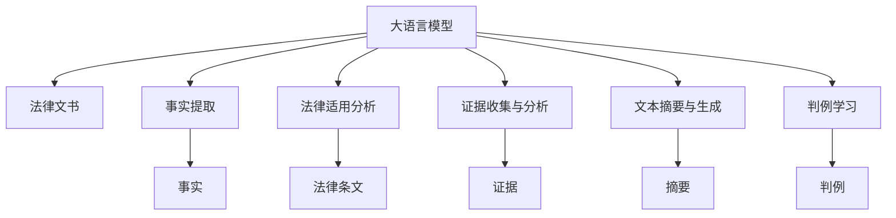

                 

## 1. 背景介绍

### 1.1 问题由来
随着人工智能技术的发展，法律文书分析（Legal Document Analysis, LDA）作为法律领域的创新应用，正在逐渐改变传统律师的工作方式。法律文书分析涉及案件的事实认定、法律适用、证据提取等多个环节，而传统的纸质文书分析往往耗时耗力、准确性难以保证。利用人工智能技术对法律文书进行结构化、智能化分析，可以大大提升工作效率，减少人为错误，降低法律风险。

近年来，大语言模型（Large Language Model, LLM）如GPT、BERT等，通过预训练大规模无标签文本数据，具备了强大的语言理解和生成能力。这些模型在自然语言处理（NLP）领域的诸多任务上取得了优异的表现，例如文本分类、命名实体识别、关系抽取等。基于这些优势，大语言模型也被引入到法律文书分析中，成为提升该领域智能化水平的重要工具。

### 1.2 问题核心关键点
大语言模型在法律文书分析中的应用主要集中在以下几个关键点：

- **事实提取**：自动提取文书中的关键事实信息，如案件背景、争议焦点、判决结果等。
- **法律适用分析**：对文书中涉及的法律条文、法规进行自动解读，判断适用性。
- **证据收集与分析**：识别文书中相关证据，并进行自动分类和分析。
- **文本摘要与生成**：对文书中冗长内容进行摘要，或者生成判决书摘要。
- **判例学习**：从已有的判例中学习法律推理模式，辅助法官判案。

这些关键点揭示了法律文书分析的复杂性和多样性，需要大语言模型具备强大的语言理解能力和跨领域迁移能力。

### 1.3 问题研究意义
法律文书分析的智能化应用具有重要意义：

1. **提高工作效率**：自动化分析可以替代大量重复的文书阅读和手工标注，节省律师和法官的时间。
2. **提升准确性**：智能化的分析系统可以更客观、准确地处理信息，减少人为错误。
3. **支持决策制定**：通过大数据和机器学习，辅助法官和律师做出更科学的决策。
4. **促进公平正义**：确保法律文书处理过程的公正性，避免人为偏见的影响。
5. **推动行业升级**：推动传统法律行业的数字化转型，促进法律技术的普惠应用。

## 2. 核心概念与联系

### 2.1 核心概念概述

为更好地理解AI LLM在法律文书分析中的应用，本节将介绍几个密切相关的核心概念：

- **大语言模型**：以自回归（如GPT）或自编码（如BERT）模型为代表的大规模预训练语言模型。通过在大规模无标签文本数据上进行预训练，学习通用的语言表示，具备强大的语言理解和生成能力。
- **法律文书**：指法院、仲裁机构等法律机构处理案件的文书，包括诉状、答辩状、判决书、裁定书等。文书内容丰富、结构复杂，通常包含事实、理由、判决等内容。
- **法律适用**：法律条文在具体案件中的适用性分析，包括事实与法律的匹配，法律之间的优先级和效力分析等。
- **证据收集与分析**：识别文书中相关证据，并进行自动分类和分析，帮助律师和法官整理案件证据，辅助判决。
- **判例学习**：从已有的判例中学习法律推理模式，辅助法官判案，提升判决的准确性和一致性。
- **文本摘要与生成**：对文书中冗长内容进行摘要，或者生成判决书摘要，减少阅读和理解文书的时间。

这些核心概念之间的逻辑关系可以通过以下Mermaid流程图来展示：



这个流程图展示了大语言模型在法律文书分析中的主要应用方向，包括事实提取、法律适用、证据分析、摘要生成和判例学习等。

## 3. 核心算法原理 & 具体操作步骤

### 3.1 算法原理概述

大语言模型在法律文书分析中的应用，本质上是一个基于文本的语义理解和推理过程。其核心思想是：将预训练的大语言模型作为文本分析工具，通过微调或细粒度迁移学习，使其具备对法律文书的理解能力，并能在特定任务上实现高效、准确的数据处理。

具体而言，可以将法律文书视为一个大型自然语言文本，其中包含各种事实、法律条文、证据等结构化信息。大语言模型通过以下步骤实现对法律文书的分析和处理：

1. **预训练**：在大规模无标签法律文本数据上进行预训练，学习通用的语言表示。
2. **微调**：在法律文书数据集上进行微调，训练模型对法律文书的理解能力。
3. **推理**：使用微调后的模型，对新的法律文书进行事实提取、法律适用分析、证据收集与分析等任务。

### 3.2 算法步骤详解

基于大语言模型在法律文书分析中的应用，以下详细介绍其主要步骤：

**Step 1: 数据准备**
- 收集和整理法律文书数据集，包括各种案件的诉状、答辩状、判决书等。
- 对文书进行预处理，包括去除噪声、分词、标准化等。
- 将文书内容转换为模型所需的格式，如标记化、分页等。

**Step 2: 模型选择与预训练**
- 选择合适的预训练语言模型，如GPT、BERT等。
- 在预训练阶段，使用大规模无标签法律文本数据进行预训练，学习通用的语言表示。
- 可以使用自监督学习任务，如语言建模、掩码语言模型等，提高模型的泛化能力。

**Step 3: 微调与任务适配**
- 将预训练模型作为初始化参数，使用标注好的法律文书数据集进行微调。
- 设计适合法律文书分析的任务适配层，如分类器、实体识别器等。
- 选择合适的优化算法，如AdamW、SGD等，设置学习率、批大小等参数。
- 应用正则化技术，如L2正则、Dropout等，防止过拟合。

**Step 4: 推理与分析**
- 使用微调后的模型对新的法律文书进行推理，自动提取事实、法律条文、证据等信息。
- 结合法律知识库和专家规则，对模型推理结果进行后处理，确保准确性和可解释性。
- 生成法律文书摘要或结论，辅助法官和律师进行决策。

**Step 5: 评估与优化**
- 在测试集上评估模型性能，对比微调前后的效果。
- 根据评估结果调整超参数，优化模型结构和训练策略。
- 定期更新模型，保持其在法律领域内的最新性和适应性。

### 3.3 算法优缺点

基于大语言模型的法律文书分析具有以下优点：

1. **高效性**：大语言模型可以快速处理大量法律文书，节省时间。
2. **准确性**：通过微调和任务适配，模型在特定任务上能够获得较高的准确性。
3. **泛化能力**：大语言模型能够从预训练中学习通用的语言表示，具有一定的泛化能力。
4. **可解释性**：大语言模型输出的推理过程和结果具有一定的可解释性，便于人工理解和审查。

然而，该方法也存在一些局限性：

1. **数据依赖**：法律文书的标注数据质量对模型性能有很大影响。标注数据不足可能导致模型泛化性能下降。
2. **法律复杂性**：法律文书涉及复杂的法律条文和推理，模型的准确性取决于对法律知识的理解和适用。
3. **解释性不足**：大语言模型推理过程较复杂，难以完全解释其决策逻辑，存在一定的黑箱问题。
4. **资源消耗**：大模型推理和微调需要大量计算资源，对硬件要求较高。

### 3.4 算法应用领域

基于大语言模型的法律文书分析，已经在多个领域得到了应用，例如：

- **法律文书分类**：将法律文书分为民事、刑事、行政等不同类型。
- **法律事实提取**：从法律文书中自动提取案件事实、争议焦点等关键信息。
- **法律适用分析**：分析法律文书中的法律条文，判断适用性。
- **证据收集与分析**：自动分类和分析文书中涉及的证据材料，辅助律师和法官。
- **文本摘要与生成**：对法律文书进行摘要生成，节省阅读时间。
- **判例学习**：从已有的判例中学习法律推理模式，辅助法官判案。

## 4. 数学模型和公式 & 详细讲解 & 举例说明

### 4.1 数学模型构建

大语言模型在法律文书分析中的主要应用涉及文本分类、命名实体识别、关系抽取等任务。以下是几个典型的数学模型：

**文本分类**：
- **目标函数**：$L = \frac{1}{N}\sum_{i=1}^N l(f(x_i),y_i)$，其中$f(x_i)$为模型预测结果，$y_i$为真实标签。
- **交叉熵损失**：$l(f(x_i),y_i) = -(y_i \log f(x_i) + (1-y_i)\log(1-f(x_i))$。

**命名实体识别**：
- **目标函数**：$L = \frac{1}{N}\sum_{i=1}^N l(f(x_i),y_i)$。
- **F1-score损失**：$l(f(x_i),y_i) = -(y_i \log f(x_i) + (1-y_i)\log(1-f(x_i)))$。

**关系抽取**：
- **目标函数**：$L = \frac{1}{N}\sum_{i=1}^N l(f(x_i),y_i)$。
- **MRR损失**：$l(f(x_i),y_i) = -\log f(x_i,y_i)$。

### 4.2 公式推导过程

以下是文本分类任务的公式推导过程：

**目标函数**：
$$
L = \frac{1}{N}\sum_{i=1}^N l(f(x_i),y_i)
$$

**交叉熵损失**：
$$
l(f(x_i),y_i) = -(y_i \log f(x_i) + (1-y_i)\log(1-f(x_i)))
$$

**微调优化**：
- **梯度更新**：$\theta \leftarrow \theta - \eta \nabla_{\theta}\mathcal{L}(\theta)$。
- **优化算法**：AdamW、SGD等。

### 4.3 案例分析与讲解

以法律文书分类为例，假设模型预测文书为民事案件的概率为$f(x_i)$，真实标签为$y_i$。根据交叉熵损失公式，计算损失为：
$$
l(f(x_i),y_i) = -(y_i \log f(x_i) + (1-y_i)\log(1-f(x_i)))
$$

模型通过反向传播更新参数$\theta$，以最小化损失函数$\mathcal{L}(\theta)$。训练过程中，逐步减小学习率$\eta$，以避免破坏预训练权重。

## 5. 项目实践：代码实例和详细解释说明

### 5.1 开发环境搭建

在进行法律文书分析的大语言模型微调实践前，我们需要准备好开发环境。以下是使用Python进行PyTorch开发的环境配置流程：

1. 安装Anaconda：从官网下载并安装Anaconda，用于创建独立的Python环境。

2. 创建并激活虚拟环境：
```bash
conda create -n legal-env python=3.8 
conda activate legal-env
```

3. 安装PyTorch：根据CUDA版本，从官网获取对应的安装命令。例如：
```bash
conda install pytorch torchvision torchaudio cudatoolkit=11.1 -c pytorch -c conda-forge
```

4. 安装Transformers库：
```bash
pip install transformers
```

5. 安装各类工具包：
```bash
pip install numpy pandas scikit-learn matplotlib tqdm jupyter notebook ipython
```

完成上述步骤后，即可在`legal-env`环境中开始微调实践。

### 5.2 源代码详细实现

下面我们以法律文书分类任务为例，给出使用Transformers库对BERT模型进行微调的PyTorch代码实现。

首先，定义文本处理函数：

```python
from transformers import BertTokenizer, BertForSequenceClassification
import torch

class LegalDocumentProcessor:
    def __init__(self, model_name='bert-base-cased'):
        self.tokenizer = BertTokenizer.from_pretrained(model_name)
        self.model = BertForSequenceClassification.from_pretrained(model_name, num_labels=4)  # 法律文书分类有四个标签
```

然后，定义训练和评估函数：

```python
from torch.utils.data import DataLoader
from tqdm import tqdm
from sklearn.metrics import accuracy_score, precision_score, recall_score, f1_score

device = torch.device('cuda') if torch.cuda.is_available() else torch.device('cpu')
model.to(device)

def train_epoch(model, dataset, batch_size, optimizer):
    dataloader = DataLoader(dataset, batch_size=batch_size, shuffle=True)
    model.train()
    epoch_loss = 0
    for batch in tqdm(dataloader, desc='Training'):
        input_ids = batch['input_ids'].to(device)
        attention_mask = batch['attention_mask'].to(device)
        labels = batch['labels'].to(device)
        model.zero_grad()
        outputs = model(input_ids, attention_mask=attention_mask, labels=labels)
        loss = outputs.loss
        epoch_loss += loss.item()
        loss.backward()
        optimizer.step()
    return epoch_loss / len(dataloader)

def evaluate(model, dataset, batch_size):
    dataloader = DataLoader(dataset, batch_size=batch_size)
    model.eval()
    preds, labels = [], []
    with torch.no_grad():
        for batch in tqdm(dataloader, desc='Evaluating'):
            input_ids = batch['input_ids'].to(device)
            attention_mask = batch['attention_mask'].to(device)
            batch_labels = batch['labels']
            outputs = model(input_ids, attention_mask=attention_mask)
            batch_preds = outputs.logits.argmax(dim=2).to('cpu').tolist()
            batch_labels = batch_labels.to('cpu').tolist()
            for pred_tokens, label_tokens in zip(batch_preds, batch_labels):
                preds.append(pred_tokens[:len(label_tokens)])
                labels.append(label_tokens)
                
    print(f'Accuracy: {accuracy_score(labels, preds):.2f}')
    print(f'Precision: {precision_score(labels, preds, average='macro'):.2f}')
    print(f'Recall: {recall_score(labels, preds, average='macro'):.2f}')
    print(f'F1 Score: {f1_score(labels, preds, average='macro'): .2f}')

```

最后，启动训练流程并在验证集上评估：

```python
epochs = 5
batch_size = 16

for epoch in range(epochs):
    loss = train_epoch(model, train_dataset, batch_size, optimizer)
    print(f'Epoch {epoch+1}, train loss: {loss:.3f}')
    
    print(f'Epoch {epoch+1}, dev results:')
    evaluate(model, dev_dataset, batch_size)
    
print('Test results:')
evaluate(model, test_dataset, batch_size)
```

以上就是使用PyTorch对BERT进行法律文书分类任务的完整代码实现。可以看到，得益于Transformers库的强大封装，我们可以用相对简洁的代码完成BERT模型的加载和微调。

### 5.3 代码解读与分析

让我们再详细解读一下关键代码的实现细节：

**LegalDocumentProcessor类**：
- `__init__`方法：初始化分词器和模型，指定法律文书分类任务的标签数。
- `train_epoch`方法：对数据集以批为单位进行迭代，在每个批次上前向传播计算loss并反向传播更新模型参数，最后返回该epoch的平均loss。
- `evaluate`方法：与训练类似，不同点在于不更新模型参数，并在每个batch结束后将预测和标签结果存储下来，最后使用sklearn的评估指标对整个评估集的预测结果进行打印输出。

**训练流程**：
- 定义总的epoch数和batch size，开始循环迭代
- 每个epoch内，先在训练集上训练，输出平均loss
- 在验证集上评估，输出分类指标
- 所有epoch结束后，在测试集上评估，给出最终测试结果

可以看到，PyTorch配合Transformers库使得BERT微调的代码实现变得简洁高效。开发者可以将更多精力放在数据处理、模型改进等高层逻辑上，而不必过多关注底层的实现细节。

当然，工业级的系统实现还需考虑更多因素，如模型的保存和部署、超参数的自动搜索、更灵活的任务适配层等。但核心的微调范式基本与此类似。

## 6. 实际应用场景

### 6.1 智能司法系统

基于大语言模型的法律文书分析，可以广泛应用于智能司法系统的构建。传统司法系统依赖大量人工审查和处理，耗时长、成本高、准确性难以保证。而使用法律文书分析技术，可以自动化处理案件信息，减少人为误差，提升审判效率和公正性。

在技术实现上，可以收集和整理法院、仲裁机构等机构的法律文书数据，使用预训练大语言模型进行微调，使其具备对法律文书的理解能力。微调后的模型能够自动提取案件事实、法律条文、证据等信息，辅助法官和律师进行案件处理和判决。

### 6.2 法律风险评估

法律文书分析技术可以用于企业法律风险评估，帮助企业规避潜在的法律风险。通过收集和分析企业的法律文书和合同，可以自动提取法律条款、风险点等信息，进行风险评估和预警。

在实践中，可以使用预训练大语言模型进行微调，使其具备对法律条款的解读能力。微调后的模型能够自动分析合同中的风险条款，评估其对企业可能造成的影响，及时预警风险。

### 6.3 法律咨询服务

法律文书分析技术还可以用于提供法律咨询服务，帮助企业和个人快速获取法律知识。通过自然语言理解和生成技术，用户可以输入简单的法律问题，得到详细的解答和建议。

在技术实现上，可以使用预训练大语言模型进行微调，使其具备法律知识查询和问答的能力。微调后的模型能够自动解析用户的问题，提取关键信息，并从知识库中检索相关法律条文和案例，生成详细解答。

## 7. 工具和资源推荐

### 7.1 学习资源推荐

为了帮助开发者系统掌握法律文书分析的理论与实践，这里推荐一些优质的学习资源：

1. 《Transformer from Principle to Practice》系列博文：由大模型技术专家撰写，深入浅出地介绍了Transformer原理、BERT模型、法律文书分析等前沿话题。

2. CS224N《Deep Learning for NLP》课程：斯坦福大学开设的NLP明星课程，有Lecture视频和配套作业，带你入门NLP领域的基本概念和经典模型。

3. 《Natural Language Processing with Transformers》书籍：Transformers库的作者所著，全面介绍了如何使用Transformers库进行NLP任务开发，包括法律文书分析在内的诸多范式。

4. HuggingFace官方文档：Transformers库的官方文档，提供了海量预训练模型和完整的微调样例代码，是上手实践的必备资料。

5. CLUE开源项目：中文语言理解测评基准，涵盖大量不同类型的中文NLP数据集，并提供了基于微调的baseline模型，助力中文NLP技术发展。

通过对这些资源的学习实践，相信你一定能够快速掌握法律文书分析的精髓，并用于解决实际的NLP问题。

### 7.2 开发工具推荐

高效的开发离不开优秀的工具支持。以下是几款用于法律文书分析开发的常用工具：

1. PyTorch：基于Python的开源深度学习框架，灵活动态的计算图，适合快速迭代研究。大部分预训练语言模型都有PyTorch版本的实现。

2. TensorFlow：由Google主导开发的开源深度学习框架，生产部署方便，适合大规模工程应用。同样有丰富的预训练语言模型资源。

3. Transformers库：HuggingFace开发的NLP工具库，集成了众多SOTA语言模型，支持PyTorch和TensorFlow，是进行法律文书分析开发的利器。

4. Weights & Biases：模型训练的实验跟踪工具，可以记录和可视化模型训练过程中的各项指标，方便对比和调优。与主流深度学习框架无缝集成。

5. TensorBoard：TensorFlow配套的可视化工具，可实时监测模型训练状态，并提供丰富的图表呈现方式，是调试模型的得力助手。

6. Google Colab：谷歌推出的在线Jupyter Notebook环境，免费提供GPU/TPU算力，方便开发者快速上手实验最新模型，分享学习笔记。

合理利用这些工具，可以显著提升法律文书分析的开发效率，加快创新迭代的步伐。

### 7.3 相关论文推荐

法律文书分析的快速发展离不开学界的持续研究。以下是几篇奠基性的相关论文，推荐阅读：

1. Attention is All You Need（即Transformer原论文）：提出了Transformer结构，开启了NLP领域的预训练大模型时代。

2. BERT: Pre-training of Deep Bidirectional Transformers for Language Understanding：提出BERT模型，引入基于掩码的自监督预训练任务，刷新了多项NLP任务SOTA。

3. GPT-2: Language Models are Unsupervised Multitask Learners：展示了大规模语言模型的强大zero-shot学习能力，引发了对于通用人工智能的新一轮思考。

4. Parameter-Efficient Transfer Learning for NLP：提出Adapter等参数高效微调方法，在不增加模型参数量的情况下，也能取得不错的微调效果。

5. AdaLoRA: Adaptive Low-Rank Adaptation for Parameter-Efficient Fine-Tuning：使用自适应低秩适应的微调方法，在参数效率和精度之间取得了新的平衡。

这些论文代表了大语言模型微调技术的发展脉络。通过学习这些前沿成果，可以帮助研究者把握学科前进方向，激发更多的创新灵感。

## 8. 总结：未来发展趋势与挑战

### 8.1 总结

本文对基于大语言模型的法律文书分析进行了全面系统的介绍。首先阐述了法律文书分析的智能化应用背景和重要意义，明确了大语言模型在法律文书分析中的关键应用点。其次，从原理到实践，详细讲解了法律文书分析的数学模型和关键步骤，给出了法律文书分类的完整代码实例。同时，本文还广泛探讨了法律文书分析在智能司法系统、法律风险评估、法律咨询服务等实际场景中的应用前景，展示了法律文书分析技术的广阔潜力。

通过本文的系统梳理，可以看到，基于大语言模型的法律文书分析方法在提升法律文书处理效率、提高司法公正性和促进法律咨询服务等方面具有重要价值。未来，伴随大语言模型和微调方法的不断进步，法律文书分析技术必将在司法领域大放异彩，为构建高效、智能、公正的司法系统提供有力支撑。

### 8.2 未来发展趋势

展望未来，法律文书分析技术将呈现以下几个发展趋势：

1. **模型规模持续增大**：随着算力成本的下降和数据规模的扩张，预训练语言模型的参数量还将持续增长。超大规模语言模型蕴含的丰富语言知识，有望支撑更加复杂多变的法律文书分析任务。

2. **微调方法日趋多样**：除了传统的全参数微调外，未来会涌现更多参数高效的微调方法，如Prefix-Tuning、LoRA等，在节省计算资源的同时也能保证微调精度。

3. **持续学习成为常态**：随着数据分布的不断变化，微调模型也需要持续学习新知识以保持性能。如何在不遗忘原有知识的同时，高效吸收新样本信息，将成为重要的研究课题。

4. **数据依赖降低**：受启发于提示学习(Prompt-based Learning)的思路，未来的微调方法将更好地利用大模型的语言理解能力，通过更加巧妙的任务描述，在更少的标注样本上也能实现理想的微调效果。

5. **多模态微调崛起**：当前的法律文书分析主要聚焦于文本数据，未来会进一步拓展到图像、视频、语音等多模态数据微调。多模态信息的融合，将显著提升模型对现实世界的理解和建模能力。

6. **知识整合能力提升**：现有的法律文书分析模型往往局限于文本数据，未来会引入符号化的先验知识，如知识图谱、逻辑规则等，与神经网络模型进行巧妙融合，引导微调过程学习更准确、合理的法律文书表示。

以上趋势凸显了法律文书分析技术的广阔前景。这些方向的探索发展，必将进一步提升法律文书分析的智能化水平，为司法领域带来变革性影响。

### 8.3 面临的挑战

尽管法律文书分析技术已经取得了瞩目成就，但在迈向更加智能化、普适化应用的过程中，它仍面临着诸多挑战：

1. **数据依赖**：法律文书的标注数据质量对模型性能有很大影响。标注数据不足可能导致模型泛化性能下降。
2. **法律复杂性**：法律文书涉及复杂的法律条文和推理，模型的准确性取决于对法律知识的理解和适用。
3. **解释性不足**：大语言模型推理过程较复杂，难以完全解释其决策逻辑，存在一定的黑箱问题。
4. **资源消耗**：大模型推理和微调需要大量计算资源，对硬件要求较高。

### 8.4 未来突破

面对法律文书分析所面临的挑战，未来的研究需要在以下几个方面寻求新的突破：

1. **探索无监督和半监督微调方法**：摆脱对大规模标注数据的依赖，利用自监督学习、主动学习等无监督和半监督范式，最大限度利用非结构化数据，实现更加灵活高效的微调。

2. **研究参数高效和计算高效的微调范式**：开发更加参数高效的微调方法，在固定大部分预训练参数的同时，只更新极少量的任务相关参数。同时优化微调模型的计算图，减少前向传播和反向传播的资源消耗，实现更加轻量级、实时性的部署。

3. **引入因果分析和博弈论工具**：将因果分析方法引入法律文书分析模型，识别出模型决策的关键特征，增强输出解释的因果性和逻辑性。借助博弈论工具刻画人机交互过程，主动探索并规避模型的脆弱点，提高系统稳定性。

4. **纳入伦理道德约束**：在模型训练目标中引入伦理导向的评估指标，过滤和惩罚有偏见、有害的输出倾向。同时加强人工干预和审核，建立模型行为的监管机制，确保输出符合人类价值观和伦理道德。

这些研究方向的探索，必将引领法律文书分析技术迈向更高的台阶，为构建高效、智能、公正的司法系统提供有力支撑。面向未来，法律文书分析技术还需要与其他人工智能技术进行更深入的融合，如知识表示、因果推理、强化学习等，多路径协同发力，共同推动司法技术的进步。只有勇于创新、敢于突破，才能不断拓展法律文书分析的边界，让智能技术更好地服务于司法事业。

## 9. 附录：常见问题与解答

**Q1：法律文书分析是否可以完全替代人工审查？**

A: 法律文书分析可以在一定程度上辅助人工审查，提升审查效率，但完全替代人工审查仍有困难。法律文书涉及复杂的法律条文和推理，模型的准确性取决于对法律知识的理解和适用。此外，法律文书审查还涉及伦理道德判断、人机交互等方面，这些是当前技术难以完全替代的。

**Q2：微调过程中如何选择合适的学习率？**

A: 微调的学习率一般要比预训练时小1-2个数量级，如果使用过大的学习率，容易破坏预训练权重，导致过拟合。一般建议从1e-5开始调参，逐步减小学习率，直至收敛。也可以使用warmup策略，在开始阶段使用较小的学习率，再逐渐过渡到预设值。需要注意的是，不同的优化器(如AdamW、Adafactor等)以及不同的学习率调度策略，可能需要设置不同的学习率阈值。

**Q3：法律文书分析技术在实际应用中需要注意哪些问题？**

A: 将法律文书分析技术转化为实际应用，还需要考虑以下因素：
1. 模型裁剪：去除不必要的层和参数，减小模型尺寸，加快推理速度。
2. 量化加速：将浮点模型转为定点模型，压缩存储空间，提高计算效率。
3. 服务化封装：将模型封装为标准化服务接口，便于集成调用。
4. 弹性伸缩：根据请求流量动态调整资源配置，平衡服务质量和成本。
5. 监控告警：实时采集系统指标，设置异常告警阈值，确保服务稳定性。
6. 安全防护：采用访问鉴权、数据脱敏等措施，保障数据和模型安全。

## 作者：禅与计算机程序设计艺术 / Zen and the Art of Computer Programming

