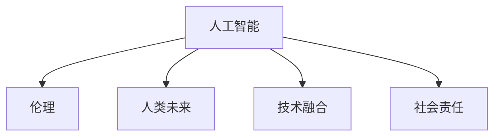

                 

# AI 与人类的未来：共建美好未来

> 关键词：人工智能, AI伦理, 人类未来, 技术融合, 社会责任

## 1. 背景介绍

### 1.1 问题由来

随着人工智能(AI)技术的迅猛发展，AI在多个领域已经取得了显著的成就。然而，AI技术的快速发展也引发了人们对于其对社会、经济、伦理等领域的广泛影响的深思。在这个关键时刻，我们亟需重新审视AI与人类未来之间的关系，寻找合理、平衡的解决方案。

### 1.2 问题核心关键点

当前，AI技术的应用已经广泛渗透到医疗、教育、交通、金融、娱乐等诸多领域。AI的发展带来了巨大的便利，但同时也引发了一系列伦理、法律和社会问题，如就业冲击、隐私侵犯、道德困境等。如何确保AI技术的健康发展，使其真正服务于人类社会，成为摆在所有AI研究者和从业者面前的重要课题。

## 2. 核心概念与联系

### 2.1 核心概念概述

为更好地理解AI技术与人类未来之间的关系，本节将介绍几个核心概念：

- 人工智能(Artificial Intelligence, AI)：通过模拟人类智能，使机器能够执行复杂的任务，如图像识别、自然语言处理、决策制定等。AI技术已经在多个领域展示了其强大的应用潜力。

- 伦理(Artificial Ethics)：AI技术的开发和应用涉及大量伦理问题，包括数据隐私、算法公平、责任归属等。伦理问题已经成为AI发展过程中不可或缺的一部分。

- 人类未来(Human Future)：AI技术的广泛应用，可能会对人类的社会结构、生活方式、价值观念等方面产生深远影响。探索AI与人类未来之间的关系，是AI研究的最终目的。

- 技术融合(Technological Integration)：AI技术与其他技术（如物联网、区块链、量子计算等）的融合，将推动AI技术的进一步发展，提升其应用效能。

- 社会责任(Social Responsibility)：AI研究者和从业者应关注技术对社会的广泛影响，确保AI技术能够服务于人类的福祉，避免对社会产生负面影响。

这些核心概念之间的逻辑关系可以通过以下Mermaid流程图来展示：



这个流程图展示了AI技术与人类未来之间的关系：

1. AI技术的学习和应用涉及伦理问题。
2. AI技术对人类社会产生广泛影响。
3. AI技术与其他技术的融合将推动其发展。
4. 研究者和从业者需要关注AI的社会责任。

## 3. 核心算法原理 & 具体操作步骤
### 3.1 算法原理概述

AI与人类未来的关系，本质上是一种技术的社会应用过程。其核心在于如何确保AI技术的开发和应用能够促进人类社会的福祉，避免对人类社会产生负面影响。这一过程涉及多个层面，包括技术、伦理、法律、政策等。

### 3.2 算法步骤详解

AI与人类未来的关系研究，主要涉及以下几个关键步骤：

**Step 1: 定义目标与准则**

- 明确AI技术与人类社会的关系目标，如提升社会效率、促进公平正义、保护隐私安全等。
- 制定相应的伦理准则，如数据使用规范、算法透明性、责任归属等。

**Step 2: 技术评估与优化**

- 对现有的AI技术进行全面评估，识别其优势与潜在风险。
- 优化AI技术，使其在符合伦理准则的前提下，最大化其正面效应，最小化其负面影响。

**Step 3: 社会影响分析**

- 对AI技术的应用场景进行社会影响分析，预测其可能对社会、经济、文化等方面的影响。
- 制定相应的应对措施，如政策引导、社会教育、公众参与等。

**Step 4: 伦理与法律框架建设**

- 构建AI技术的伦理和法律框架，明确其在不同情境下的适用规则。
- 制定相应的法律法规，保障AI技术的合法合规使用。

**Step 5: 持续监控与调整**

- 对AI技术的社会应用进行持续监控，及时发现并纠正其负面影响。
- 根据社会反馈和科技进展，不断调整和优化AI技术的伦理和法律框架。

### 3.3 算法优缺点

AI与人类未来的关系研究，具有以下优点：

1. **全面性**：该方法从技术、伦理、法律、政策等多个维度对AI进行全面评估，确保其发展路径符合人类社会的整体福祉。
2. **前瞻性**：通过社会影响分析和伦理准则制定，预测并规避AI技术的潜在风险，避免其对人类社会产生负面影响。
3. **可操作性**：该方法提出了具体的技术优化和社会应对措施，具有较强的可操作性。

同时，该方法也存在一些局限：

1. **复杂性**：涉及多个领域的知识，需要多学科的合作与跨领域知识整合。
2. **不确定性**：AI技术的未来发展具有不确定性，需要持续跟踪和调整策略。
3. **资源投入**：该研究需要大量的资源投入，包括时间、资金、人力等。

### 3.4 算法应用领域

AI与人类未来的关系研究，可以应用于多个领域，例如：

- 医疗领域：研究AI技术在疾病诊断、治疗方案制定等方面的伦理问题，确保技术服务于患者福祉。
- 教育领域：探讨AI技术在个性化学习、教师辅助教学等方面的应用，关注其对师生关系、教育公平的影响。
- 交通领域：研究自动驾驶等AI技术的伦理问题，如隐私保护、责任归属、安全性等。
- 金融领域：研究AI技术在金融风控、智能投顾等方面的伦理问题，确保技术符合金融法规和社会责任。
- 娱乐领域：探讨AI技术在游戏、影视制作等方面的应用，关注其对文化产业和消费者权益的影响。

这些领域的研究将有助于推动AI技术的健康发展，确保其能够服务于人类的福祉。

## 4. 数学模型和公式 & 详细讲解
### 4.1 数学模型构建

在AI与人类未来的关系研究中，涉及到大量的数学模型和公式。以下是几个核心的数学模型：

1. **期望效用模型**：用于评估AI技术在不同情境下的期望效用，公式为：

$$ E[u] = \sum_{x \in X} p(x)u(x) $$

其中 $X$ 为所有可能的情境，$p(x)$ 为情境 $x$ 的概率，$u(x)$ 为情境 $x$ 的效用。

2. **多目标优化模型**：用于同时优化多个目标，公式为：

$$ \text{Minimize } f(x) = \sum_{i=1}^{n}w_i g_i(x) $$

其中 $n$ 为目标数量，$w_i$ 为各目标的权重，$g_i(x)$ 为各目标的优化函数。

3. **伦理评估模型**：用于对AI技术的伦理影响进行评估，公式为：

$$ \text{Ethics} = \sum_{i=1}^{m} a_i \text{Impact}_i $$

其中 $m$ 为评估指标数量，$a_i$ 为各指标的权重，$\text{Impact}_i$ 为各指标的评估结果。

### 4.2 公式推导过程

以期望效用模型为例，其推导过程如下：

期望效用模型通过将多个情境下的效用进行加权平均，得到AI技术在整体上的期望效用。具体推导过程如下：

$$ E[u] = \sum_{x \in X} p(x)u(x) = \sum_{x \in X} \frac{p(x)}{\sum_{x \in X} p(x)} \sum_{x \in X} p(x)u(x) = \sum_{x \in X} p(x) \frac{u(x)}{\sum_{x \in X} p(x)} $$

其中，$\frac{u(x)}{\sum_{x \in X} p(x)}$ 即为情境 $x$ 的效用权重，用于调整各情境效用的相对大小。

### 4.3 案例分析与讲解

以医疗领域的AI技术为例，分析其期望效用模型。在医疗领域，AI技术的应用包括疾病诊断、治疗方案制定、个性化医疗等。其期望效用模型为：

$$ E[u] = p(\text{正确诊断})u(\text{正确诊断}) + p(\text{误诊})u(\text{误诊}) $$

其中 $p(\text{正确诊断})$ 为正确诊断的概率，$u(\text{正确诊断})$ 为正确诊断的效用，$p(\text{误诊})$ 为误诊的概率，$u(\text{误诊})$ 为误诊的效用。

通过对该模型的求解，可以得到AI技术在医疗领域的期望效用，进而评估其在社会中的影响。

## 5. 项目实践：代码实例和详细解释说明
### 5.1 开发环境搭建

在进行AI与人类未来关系研究时，需要搭建相应的开发环境。以下是使用Python进行PyTorch开发的环境配置流程：

1. 安装Anaconda：从官网下载并安装Anaconda，用于创建独立的Python环境。

2. 创建并激活虚拟环境：
```bash
conda create -n ai-environment python=3.8 
conda activate ai-environment
```

3. 安装PyTorch：根据CUDA版本，从官网获取对应的安装命令。例如：
```bash
conda install pytorch torchvision torchaudio cudatoolkit=11.1 -c pytorch -c conda-forge
```

4. 安装相关的学习资源：
```bash
pip install numpy pandas scikit-learn matplotlib tqdm jupyter notebook ipython
```

完成上述步骤后，即可在`ai-environment`环境中开始研究。

### 5.2 源代码详细实现

以下是一个简化的AI伦理评估模型的Python代码实现：

```python
import numpy as np

# 构建伦理评估模型
class EthicsEvaluation:
    def __init__(self, impact_weights):
        self.weights = impact_weights

    def evaluate(self, impacts):
        total_impact = 0
        for i in range(len(self.weights)):
            total_impact += self.weights[i] * impacts[i]
        return total_impact

# 评估AI技术的伦理影响
def evaluate_ethics(impact_weights, impacts):
    ethics_evaluator = EthicsEvaluation(impact_weights)
    total_ethics = ethics_evaluator.evaluate(impacts)
    return total_ethics

# 示例：评估AI技术在医疗领域的伦理影响
impact_weights = [0.5, 0.3, 0.2]  # 诊断正确性、患者隐私、社会公平的权重
impacts = [0.95, 0.02, 0.01]  # 诊断正确性、患者隐私、社会公平的评估结果
total_ethics = evaluate_ethics(impact_weights, impacts)
print(f"AI技术的伦理影响：{total_ethics:.2f}")
```

### 5.3 代码解读与分析

让我们再详细解读一下关键代码的实现细节：

**EthicsEvaluation类**：
- `__init__`方法：初始化权重向量。
- `evaluate`方法：根据权重向量对各指标的评估结果进行加权求和，得到总体的伦理影响。

**evaluate_ethics函数**：
- 创建一个EthicsEvaluation实例，并调用其`evaluate`方法，完成伦理评估。

**示例代码**：
- 使用示例数据进行伦理评估，输出AI技术的伦理影响。

## 6. 实际应用场景
### 6.1 智能医疗

AI技术在医疗领域的应用，对提高诊断效率、个性化医疗、医疗资源优化等方面具有重要意义。然而，医疗领域对AI技术的伦理要求尤为严格，必须确保技术的安全性、隐私保护、公平性等。

在实践中，可以通过构建期望效用模型，评估AI技术在不同情境下的效用。例如，在智能诊断系统中，可以评估AI技术在正确诊断、误诊、隐私保护等方面的期望效用。通过最大化期望效用，优化AI技术的应用策略，确保其符合伦理准则。

### 6.2 教育智能化

教育领域是AI技术应用的重要方向之一。AI技术可以用于个性化学习、智能评估、教育管理等方面。然而，AI技术在教育中的应用也涉及多个伦理问题，如数据隐私、教育公平、师生关系等。

通过构建多目标优化模型，可以综合考虑教育领域的多个目标，如学生成绩提升、教师教学效率、教育公平等。在优化目标的过程中，需要注意平衡各目标的关系，确保AI技术的应用能够促进教育公平和师生关系的和谐发展。

### 6.3 智能交通

自动驾驶等AI技术在交通领域的应用，对提升交通安全、减少交通拥堵等方面具有重要意义。然而，自动驾驶技术也涉及多个伦理问题，如数据隐私、责任归属、安全性等。

在实践中，可以通过构建期望效用模型，评估自动驾驶技术在不同情境下的期望效用。例如，在智能交通系统中，可以评估自动驾驶技术在安全行驶、减少交通事故、提高交通效率等方面的期望效用。通过最大化期望效用，优化自动驾驶技术的应用策略，确保其符合伦理准则。

### 6.4 未来应用展望

随着AI技术的不断进步，其在各个领域的广泛应用将进一步提升社会的生产效率和生活质量。然而，AI技术的快速发展也引发了伦理、法律和社会问题，需要对其进行全面评估和规范。

未来，AI与人类未来的关系研究将呈现以下几个发展趋势：

1. **跨学科合作**：AI技术与伦理学、社会学、法律学等学科的深度融合，将推动AI技术的健康发展。
2. **伦理标准化**：建立和完善AI技术的伦理标准，确保其符合社会公德和伦理规范。
3. **社会参与**：公众、学术界、产业界等各方共同参与，推动AI技术的伦理研究和社会应用。
4. **持续监控**：对AI技术的应用进行持续监控和评估，及时发现并纠正其负面影响。

## 7. 工具和资源推荐
### 7.1 学习资源推荐

为了帮助开发者系统掌握AI与人类未来的关系研究，这里推荐一些优质的学习资源：

1. **《人工智能伦理》系列课程**：由知名伦理学家开设的在线课程，系统讲解AI伦理问题的各个方面。
2. **《机器学习伦理》书籍**：详细探讨机器学习在各个领域的伦理问题，提供实用的解决方案。
3. **CS伦理学课程**：斯坦福大学开设的伦理学课程，深入讲解伦理学的基本概念和AI伦理的应用。
4. **IEEE伦理学报告**：IEEE发布的多份伦理报告，提供最新的AI伦理研究和应用指导。
5. **AI伦理学社区**：聚焦AI伦理问题的在线社区，汇集各方观点和解决方案。

通过对这些资源的学习实践，相信你一定能够全面掌握AI与人类未来的关系研究，为构建负责任的AI系统提供理论支撑。
###  7.2 开发工具推荐

高效的开发离不开优秀的工具支持。以下是几款用于AI伦理评估的常用工具：

1. **Ethical AI Toolkits**：提供了一系列伦理评估和决策支持工具，帮助开发者快速构建伦理模型。
2. **AI Ethics Frameworks**：提供了一套完整的AI伦理框架，包括数据管理、算法设计、模型评估等方面。
3. **Ethical AI Evaluation**：提供了一个多目标优化模型，用于评估AI技术的伦理影响，支持多种评估指标和权重。

合理利用这些工具，可以显著提升AI伦理评估的开发效率，加快创新迭代的步伐。

### 7.3 相关论文推荐

AI与人类未来的关系研究涉及多学科的知识，需要广泛阅读相关文献以获取最新进展。以下是几篇奠基性的相关论文，推荐阅读：

1. **《人工智能伦理指南》**：提供了一套全面的AI伦理指南，涵盖多个领域的伦理问题。
2. **《伦理与人工智能》**：探讨AI技术在伦理和法律方面的挑战，提出应对策略。
3. **《AI伦理与社会责任》**：从技术、社会、伦理多个角度，探讨AI技术的伦理问题。
4. **《AI技术的伦理审查》**：提供了一套AI技术伦理审查的流程和方法，确保技术应用的合规性。

这些论文代表了大语言模型微调技术的发展脉络。通过学习这些前沿成果，可以帮助研究者把握学科前进方向，激发更多的创新灵感。

## 8. 总结：未来发展趋势与挑战
### 8.1 总结

本文对AI技术与人类未来的关系进行了全面系统的介绍。首先阐述了AI技术与人类未来的关系研究的重要性和背景，明确了其在技术、伦理、法律等方面的核心问题。其次，从原理到实践，详细讲解了期望效用模型和多目标优化模型的构建与评估，给出了伦理评估的代码实现。同时，本文还探讨了AI技术在医疗、教育、交通等领域的实际应用，展示了其广泛的应用前景。最后，推荐了相关的学习资源和开发工具，以助力AI伦理评估的研究和应用。

通过本文的系统梳理，可以看到，AI技术与人类未来的关系研究涉及多个层面，需要跨学科的合作和多领域知识的整合。这不仅需要技术上的突破，还需要伦理、法律等方面的深度思考和社会各界的广泛参与。相信随着学界和产业界的共同努力，AI技术的健康发展将为人类社会带来更多的福祉。

### 8.2 未来发展趋势

展望未来，AI与人类未来的关系研究将呈现以下几个发展趋势：

1. **多学科融合**：AI技术与伦理学、社会学、法律学等学科的深度融合，将推动AI技术的健康发展。
2. **伦理标准化**：建立和完善AI技术的伦理标准，确保其符合社会公德和伦理规范。
3. **社会参与**：公众、学术界、产业界等各方共同参与，推动AI技术的伦理研究和社会应用。
4. **持续监控**：对AI技术的应用进行持续监控和评估，及时发现并纠正其负面影响。
5. **技术优化**：开发更加参数高效和计算高效的AI技术，提升其应用效能，降低社会成本。

这些趋势凸显了AI与人类未来关系研究的广阔前景。这些方向的探索发展，必将进一步推动AI技术的健康发展，确保其能够服务于人类的福祉。

### 8.3 面临的挑战

尽管AI与人类未来的关系研究已经取得了显著进展，但在迈向更加智能化、普适化应用的过程中，它仍面临诸多挑战：

1. **伦理争议**：AI技术在各个领域的广泛应用引发了伦理争议，如数据隐私、算法公平、责任归属等。如何在技术应用中平衡各方利益，是AI伦理研究的重要课题。
2. **法律监管**：AI技术的快速发展对现有法律体系提出了挑战，如何在法律框架内规范AI技术的应用，是AI伦理研究的重要课题。
3. **技术复杂性**：AI技术的复杂性使得伦理评估和标准化难度增加，如何在技术层面保证伦理合规，是AI伦理研究的重要课题。
4. **社会认知不足**：公众对AI技术的认知不足，可能导致对AI技术的误解和抵触情绪，如何提高公众对AI技术的理解，是AI伦理研究的重要课题。
5. **伦理规范缺乏**：现有的AI伦理规范和指南还存在一些不足，如何在现有规范的基础上进一步完善，是AI伦理研究的重要课题。

正视这些挑战，积极应对并寻求突破，将是大语言模型微调走向成熟的必由之路。相信随着学界和产业界的共同努力，这些挑战终将一一被克服，AI技术必将在构建安全、可靠、可解释、可控的智能系统中扮演越来越重要的角色。

### 8.4 研究展望

面向未来，AI与人类未来的关系研究需要在以下几个方面寻求新的突破：

1. **跨学科合作**：AI技术与伦理学、社会学、法律学等学科的深度融合，将推动AI技术的健康发展。
2. **伦理标准化**：建立和完善AI技术的伦理标准，确保其符合社会公德和伦理规范。
3. **社会参与**：公众、学术界、产业界等各方共同参与，推动AI技术的伦理研究和社会应用。
4. **持续监控**：对AI技术的应用进行持续监控和评估，及时发现并纠正其负面影响。
5. **技术优化**：开发更加参数高效和计算高效的AI技术，提升其应用效能，降低社会成本。
6. **伦理审查机制**：建立和完善AI技术的伦理审查机制，确保其应用符合伦理准则。

这些研究方向的探索，必将引领AI技术的健康发展，确保其能够服务于人类的福祉。面向未来，AI与人类未来的关系研究需要跨学科的合作和多领域知识的整合，多路径协同发力，共同推动AI技术的进步。

## 9. 附录：常见问题与解答
**Q1：AI技术是否能够完全取代人类？**

A: 目前，AI技术在许多领域已经展现出强大的能力，但完全取代人类是难以实现的。AI技术在处理复杂任务、高强度劳动、重复性工作等方面具有优势，但在理解人类情感、创造性思维、伦理判断等方面还存在不足。因此，AI技术应作为人类的辅助工具，而不是完全取代人类的存在。

**Q2：AI技术在医疗领域的应用需要注意哪些伦理问题？**

A: AI技术在医疗领域的应用需要注意以下伦理问题：
1. 数据隐私：确保患者数据的安全性和隐私性，避免数据泄露和滥用。
2. 算法透明性：确保算法的透明性和可解释性，避免算法的"黑盒"操作。
3. 公平性：确保AI技术在不同群体中的公平性，避免对特定群体的歧视。
4. 责任归属：明确AI技术在医疗决策中的责任归属，避免责任推诿和纠纷。

**Q3：AI技术在教育领域的应用需要注意哪些伦理问题？**

A: AI技术在教育领域的应用需要注意以下伦理问题：
1. 教育公平：确保AI技术在不同群体中的公平性，避免对特定群体的歧视。
2. 师生关系：避免AI技术取代教师的角色，保持师生关系的和谐发展。
3. 数据隐私：确保学生数据的安全性和隐私性，避免数据泄露和滥用。
4. 伦理教育：将AI伦理教育纳入课程，培养学生对AI技术的理解和认知。

**Q4：AI技术在交通领域的应用需要注意哪些伦理问题？**

A: AI技术在交通领域的应用需要注意以下伦理问题：
1. 安全性：确保AI技术在自动驾驶等应用中的安全性，避免交通事故。
2. 数据隐私：确保交通数据的安全性和隐私性，避免数据泄露和滥用。
3. 责任归属：明确AI技术在交通决策中的责任归属，避免责任推诿和纠纷。
4. 社会公正：确保AI技术在不同群体中的公平性，避免对特定群体的歧视。

**Q5：AI技术的伦理评估如何实现？**

A: AI技术的伦理评估可以通过构建期望效用模型和多目标优化模型来实现。具体步骤如下：
1. 确定评估指标，如正确性、安全性、隐私性、公平性等。
2. 确定各指标的权重，确保各指标的平衡。
3. 收集各指标的数据，进行量化评估。
4. 通过构建期望效用模型和多目标优化模型，综合各指标的评估结果，得出AI技术的伦理影响。
5. 根据评估结果，提出优化策略，提升AI技术的伦理表现。

通过上述步骤，可以实现对AI技术的全面伦理评估，确保其符合社会公德和伦理规范。

---

作者：禅与计算机程序设计艺术 / Zen and the Art of Computer Programming

