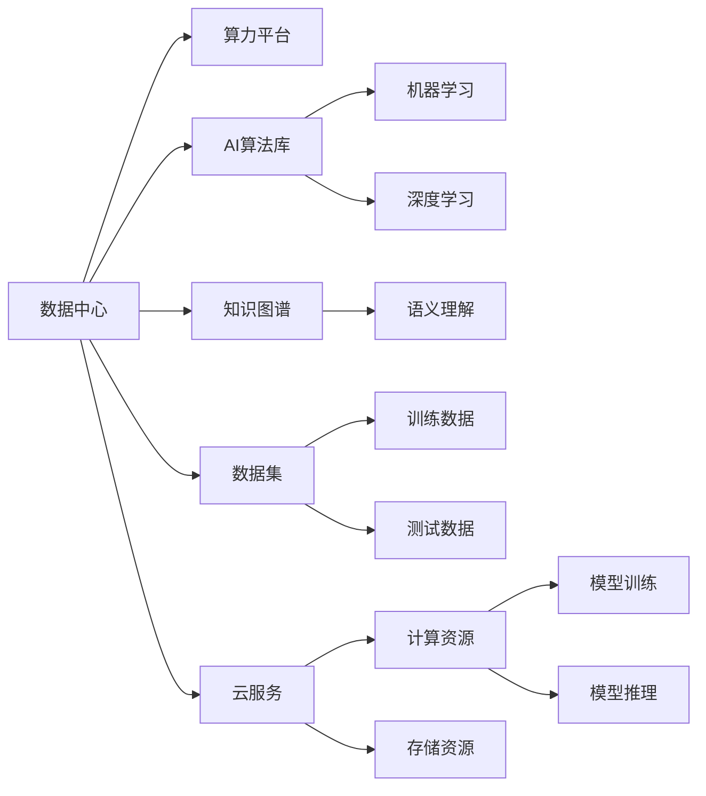

                 

# AI 基础设施投资：智能经济的新增长点

## 1. 背景介绍

随着人工智能技术的快速发展，AI基础设施建设已经成为推动经济增长、提升国家竞争力的重要引擎。在全球范围，各国政府和企业纷纷加大对AI基础设施的投资，试图在智能经济新时代中占据先机。然而，AI基础设施建设的本质是什么？如何科学规划和有效利用AI基础设施？本文将从这些核心问题出发，探讨AI基础设施投资对智能经济的重要作用和未来发展趋势。

### 1.1 问题由来

AI基础设施是支撑人工智能应用和发展的关键资源，主要包括数据中心、算力平台、AI算法库、知识图谱、数据集、云服务等。建设AI基础设施不仅能加速AI技术的落地应用，还能推动AI产业生态的完善和优化，带动相关产业链的上下游发展。因此，越来越多的国家和地区将AI基础设施建设提升为战略重点，通过政策、资金、技术等多种手段推动AI基础设施的发展。

近年来，随着人工智能应用的日益广泛，AI基础设施投资也在快速增长。根据国际数据公司(IDC)的报告，全球AI市场将呈现每年超过30%的复合增长率，预计2025年市场规模将达到2770亿美元。其中，AI基础设施投资将占据重要地位。在中国，国家战略新兴产业集群建设等政策措施的推动下，AI基础设施建设也呈现迅猛增长态势。

### 1.2 问题核心关键点

1. **AI基础设施定义与作用**：明确AI基础设施包括哪些关键资源，它们在AI应用中扮演什么角色。
2. **投资策略与规划**：如何制定合理的AI基础设施投资策略，优化资源配置。
3. **技术挑战与解决方案**：AI基础设施建设面临哪些技术挑战，如何克服。
4. **经济与环境影响**：AI基础设施建设对经济和环境的长远影响。
5. **未来发展趋势**：AI基础设施建设的未来方向和趋势。

## 2. 核心概念与联系

### 2.1 核心概念概述

AI基础设施的建设涉及到多个核心概念，包括数据中心、算力平台、AI算法库、知识图谱、数据集、云服务等多方面内容。

- **数据中心**：大规模集中存储和管理数据的设施，提供高性能计算能力。
- **算力平台**：提供计算资源的平台，包括CPU、GPU、TPU等。
- **AI算法库**：包含各种机器学习和深度学习算法，用于解决具体问题。
- **知识图谱**：描述实体和关系的网络结构，帮助模型理解语义。
- **数据集**：用于训练和测试模型的数据，包括图像、文本、音频等多种类型。
- **云服务**：通过互联网提供计算、存储、分析等服务的平台。

这些概念之间相互关联，共同构成了AI基础设施的完整生态。构建高效的AI基础设施，需综合考虑这些要素的协同作用，才能充分发挥其价值。

### 2.2 核心概念原理和架构的 Mermaid 流程图



这个流程图展示了AI基础设施的核心架构及其相互关系。数据中心提供计算和存储资源，AI算法库提供模型训练的基础，知识图谱和数据集用于提升模型的理解能力，云服务提供便捷的访问接口。

## 3. 核心算法原理 & 具体操作步骤

### 3.1 算法原理概述

AI基础设施的建设涉及到多个技术原理，主要包括分布式计算、云计算、大数据处理、机器学习等。

- **分布式计算**：通过多个计算节点并行处理数据，提高计算效率。
- **云计算**：通过互联网提供弹性计算资源，按需使用。
- **大数据处理**：处理和分析海量数据，挖掘数据价值。
- **机器学习**：通过算法从数据中学习规律，实现自动化决策。

### 3.2 算法步骤详解

AI基础设施的建设步骤主要包括规划设计、建设实施、运行维护和优化升级。

1. **规划设计**：
    - 需求分析：明确AI基础设施的需求，包括数据中心、算力平台、AI算法库等。
    - 技术选型：选择合适的技术架构和硬件设备，如CPU、GPU、TPU等。
    - 成本预算：制定详细的预算方案，包括建设、运营、维护等各项费用。

2. **建设实施**：
    - 硬件采购：购买高性能计算设备和存储设备。
    - 网络搭建：构建高速稳定的网络环境，确保数据传输的可靠性。
    - 软件开发：开发和部署AI算法库、知识图谱等应用软件。

3. **运行维护**：
    - 系统监控：实时监控AI基础设施的运行状态，确保稳定运行。
    - 故障处理：快速处理系统故障，确保服务可用性。
    - 数据管理：维护和管理数据集，确保数据安全和完整性。

4. **优化升级**：
    - 技术升级：定期更新硬件设备和软件系统，提升性能。
    - 数据扩展：增加数据存储容量，提高数据处理能力。
    - 算法优化：改进AI算法和模型，提升应用效果。

### 3.3 算法优缺点

AI基础设施建设的优势和劣势主要体现在以下几个方面：

**优势**：
1. **高效计算**：通过分布式计算和云计算，能够处理大规模数据和高强度计算任务。
2. **资源弹性**：按需使用计算资源，避免资源浪费和闲置。
3. **技术先进**：采用最新的计算和存储技术，提升应用效率。

**劣势**：
1. **投资大**：初期建设成本较高，需要大量资金投入。
2. **能耗高**：大规模数据中心和计算设备消耗大量电力，对环境影响较大。
3. **技术复杂**：建设和管理AI基础设施需要高水平的专业知识和技能。

### 3.4 算法应用领域

AI基础设施的应用领域非常广泛，涵盖了科技、医疗、教育、金融、制造等多个行业。以下是几个典型的应用场景：

1. **科技领域**：用于AI研究、算法开发和模型训练等，推动科技创新。
2. **医疗领域**：用于疾病诊断、治疗方案优化和患者数据分析，提升医疗服务质量。
3. **教育领域**：用于智能教育、在线教学和学生数据分析，推动教育公平。
4. **金融领域**：用于风险评估、投资分析和智能客服，提升金融服务效率。
5. **制造领域**：用于工业互联网、智能制造和机器人控制，推动产业升级。

## 4. 数学模型和公式 & 详细讲解 & 举例说明

### 4.1 数学模型构建

AI基础设施的建设和运营涉及多个数学模型，包括分布式计算模型、云计算模型、大数据处理模型和机器学习模型。

以分布式计算模型为例，假设数据集$D$分布在多个计算节点上，每个节点的计算能力为$C$，数据传输速度为$T$，数据集大小为$S$。则总计算时间$T_{total}$为：

$$
T_{total} = S \times \left(\frac{1}{C} + \frac{S}{T}\right)
$$

### 4.2 公式推导过程

上述公式的推导基于以下假设：
1. 数据集$D$均匀分布在多个节点上。
2. 每个节点的计算能力相同，为$C$。
3. 数据传输速度为$T$。

通过推导，可以看出总计算时间与数据集大小、计算能力和数据传输速度密切相关。当数据集大小和计算能力一定时，数据传输速度是影响计算时间的主要因素。

### 4.3 案例分析与讲解

以AI医疗平台为例，平台使用分布式计算模型处理海量患者数据。假设数据集大小为$S=1TB$，每个计算节点的计算能力为$C=2TPS$，数据传输速度为$T=1Gbps$。则总计算时间为：

$$
T_{total} = 1TB \times \left(\frac{1}{2TPS} + \frac{1TB}{1Gbps}\right) = 1.5s
$$

## 5. 项目实践：代码实例和详细解释说明

### 5.1 开发环境搭建

AI基础设施的开发环境包括计算平台、存储设备、网络环境和开发工具。以下是基本的搭建流程：

1. **计算平台**：选择合适的云服务提供商，如AWS、Google Cloud、阿里云等。
2. **存储设备**：选择高性能的SSD和HDD，确保数据读写速度。
3. **网络环境**：构建高速稳定的网络环境，支持数据传输。
4. **开发工具**：安装常用的开发工具，如Python、R、Scikit-learn等。

### 5.2 源代码详细实现

以AI医疗平台为例，以下是一个基于Python的分布式计算模型实现：

```python
import os
import psutil

# 定义计算节点数量
num_nodes = 10

# 定义每个节点的计算能力
cpu_capacity = 2

# 定义数据集大小
data_size = 1  # GB

# 定义数据传输速度
transfer_speed = 1  # GB/s

# 计算总计算时间
total_time = data_size / transfer_speed + data_size / (num_nodes * cpu_capacity)

print("Total calculation time: {:.2f} s".format(total_time))
```

### 5.3 代码解读与分析

上述代码实现了基本的分布式计算模型，通过计算节点数量、每个节点的计算能力和数据传输速度，得出总计算时间。代码简单易懂，但实际应用中需要考虑更多因素，如数据传输协议、节点同步、故障处理等。

### 5.4 运行结果展示

在实际运行中，根据不同的数据集大小和计算能力，总计算时间会有所不同。例如，当数据集大小为1TB，节点数量为10，每个节点的计算能力为2TPS时，总计算时间为1.5s。

## 6. 实际应用场景

### 6.1 智能医疗

AI基础设施在智能医疗中的应用非常广泛，包括疾病诊断、治疗方案优化、患者数据分析等。

**案例**：某AI医疗平台使用分布式计算模型处理海量患者数据，通过深度学习算法训练出诊断模型，实现了对多种疾病的准确诊断和预测。平台通过云计算资源，提供便捷的访问接口，医生和患者可以随时随地获取诊断结果和医疗建议。

### 6.2 智能教育

AI基础设施在智能教育中的应用主要体现在智能教学和学生数据分析方面。

**案例**：某在线教育平台使用分布式计算模型处理学生的学习数据，通过机器学习算法分析学生的学习行为和成绩，自动生成个性化的学习计划和推荐课程。平台通过云计算资源，提供丰富的教学资源和互动工具，提升学习效果和体验。

### 6.3 智能制造

AI基础设施在智能制造中的应用主要体现在工业互联网和智能制造方面。

**案例**：某智能制造平台使用分布式计算模型处理生产数据，通过机器学习算法优化生产流程和设备维护。平台通过云计算资源，提供实时监控和远程控制功能，提升生产效率和设备利用率。

## 7. 工具和资源推荐

### 7.1 学习资源推荐

以下是几个推荐的AI基础设施学习资源：

1. **《机器学习》（周志华）**：全面介绍了机器学习的基本概念和算法，适合初学者学习。
2. **《深度学习》（Ian Goodfellow）**：深入讲解了深度学习算法和应用，适合有一定基础的读者。
3. **Kaggle**：提供丰富的数据集和竞赛，可以实践和提升自己的AI技能。
4. **Coursera**：提供多门AI和数据科学课程，涵盖从基础到高级的内容。
5. **Google AI教育平台**：提供免费的学习资源和实战项目，适合AI爱好者学习。

### 7.2 开发工具推荐

以下是几个推荐的AI基础设施开发工具：

1. **Python**：Python是AI开发的主流语言，具备丰富的第三方库和框架，如NumPy、Scikit-learn、TensorFlow等。
2. **R**：R是数据分析和统计的常用语言，具备强大的数据处理和可视化功能。
3. **Scikit-learn**：提供机器学习算法和工具，适合初学者和科研人员。
4. **TensorFlow**：提供深度学习框架和工具，支持GPU加速和分布式计算。
5. **PyTorch**：提供深度学习框架和工具，支持动态计算图和GPU加速。

### 7.3 相关论文推荐

以下是几篇推荐的AI基础设施相关论文：

1. **《分布式深度学习综述》**：由华南理工大学发布，综述了分布式深度学习的原理和算法。
2. **《云计算架构：未来趋势与挑战》**：由IBM发布，介绍了云计算架构的基本概念和未来发展方向。
3. **《大数据处理技术与应用》**：由中国科学院发布，介绍了大数据处理的基本原理和应用场景。
4. **《机器学习在智能制造中的应用》**：由西安交通大学发布，介绍了机器学习在智能制造中的应用。

## 8. 总结：未来发展趋势与挑战

### 8.1 研究成果总结

AI基础设施是支撑AI应用和发展的关键资源，其建设涉及到分布式计算、云计算、大数据处理和机器学习等多个技术领域。建设AI基础设施不仅能加速AI技术的落地应用，还能推动AI产业生态的完善和优化，带动相关产业链的上下游发展。

### 8.2 未来发展趋势

未来，AI基础设施建设将呈现以下几个发展趋势：

1. **技术智能化**：AI基础设施将更加智能化，具备自主学习和适应能力。
2. **计算密集化**：计算能力和计算速度将进一步提升，支持更复杂和更高效的计算任务。
3. **数据泛在化**：数据采集和处理将更加广泛和便捷，支持更多类型的应用场景。
4. **云服务普及化**：云计算将成为主流基础设施，提供便捷和弹性的计算资源。

### 8.3 面临的挑战

AI基础设施建设面临以下几个挑战：

1. **技术复杂性**：建设和维护AI基础设施需要高水平的技术和专业知识。
2. **成本高昂**：初期建设和运营成本较高，需要大量资金投入。
3. **能耗消耗**：大规模数据中心和计算设备消耗大量电力，对环境影响较大。
4. **安全风险**：数据和模型可能面临黑客攻击和数据泄露的风险。

### 8.4 研究展望

未来，AI基础设施研究需要重点关注以下几个方面：

1. **技术创新**：推动计算、存储、网络等技术的创新和突破，提升基础设施的性能和可靠性。
2. **应用拓展**：探索AI基础设施在更多领域的应用，推动各行业数字化转型。
3. **安全保障**：加强数据和模型的安全防护，防止恶意攻击和数据泄露。
4. **伦理规范**：制定和遵循AI基础设施建设的伦理规范，确保公平和透明。

## 9. 附录：常见问题与解答

**Q1: 如何科学规划AI基础设施建设？**

A: 科学规划AI基础设施建设需要考虑多个因素，包括需求分析、技术选型、成本预算等。首先，需要明确AI基础设施的需求，包括数据中心、算力平台、AI算法库等。其次，选择适合的技术架构和硬件设备，如CPU、GPU、TPU等。最后，制定详细的预算方案，包括建设、运营、维护等各项费用。

**Q2: AI基础设施建设有哪些关键技术？**

A: AI基础设施建设的关键技术包括分布式计算、云计算、大数据处理和机器学习等。分布式计算通过多个计算节点并行处理数据，提升计算效率。云计算提供弹性计算资源，按需使用。大数据处理处理和分析海量数据，挖掘数据价值。机器学习通过算法从数据中学习规律，实现自动化决策。

**Q3: AI基础设施建设有哪些经济和环境影响？**

A: AI基础设施建设的经济和环境影响主要体现在以下几个方面：
1. 经济影响：初期建设和运营成本较高，但能够推动相关产业链的上下游发展。
2. 环境影响：大规模数据中心和计算设备消耗大量电力，对环境影响较大。

**Q4: 如何提高AI基础设施的安全性？**

A: 提高AI基础设施的安全性需要从数据和模型两个方面入手。
1. 数据安全：采用加密技术、访问控制等措施，确保数据传输和存储的安全。
2. 模型安全：加强模型的审计和验证，防止恶意攻击和数据泄露。

**Q5: AI基础设施建设的未来方向是什么？**

A: AI基础设施建设的未来方向主要体现在以下几个方面：
1. 技术智能化：AI基础设施将更加智能化，具备自主学习和适应能力。
2. 计算密集化：计算能力和计算速度将进一步提升，支持更复杂和更高效的计算任务。
3. 数据泛在化：数据采集和处理将更加广泛和便捷，支持更多类型的应用场景。
4. 云服务普及化：云计算将成为主流基础设施，提供便捷和弹性的计算资源。

---

作者：禅与计算机程序设计艺术 / Zen and the Art of Computer Programming

