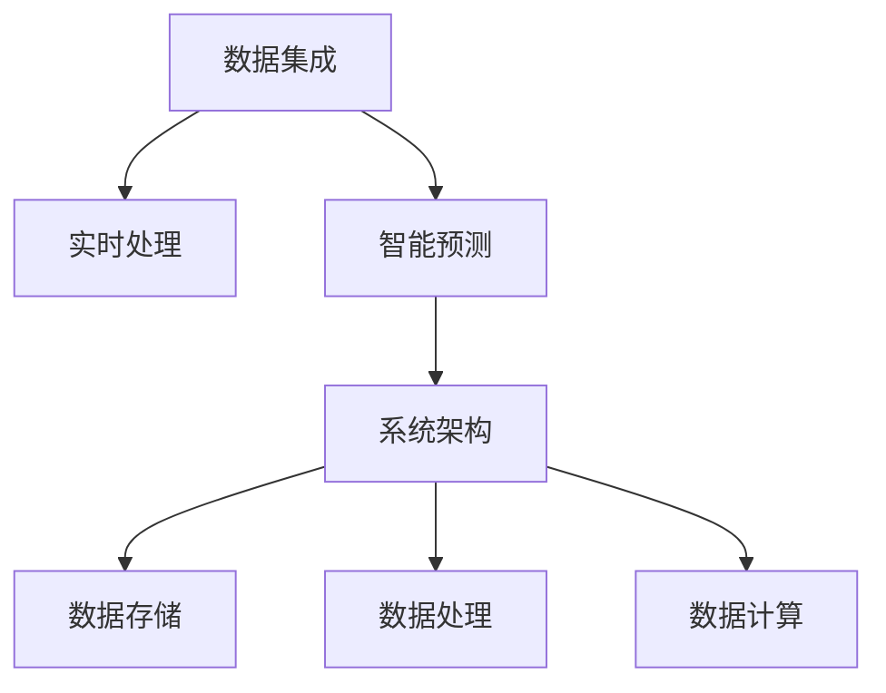

                 

# AI 基础设施的海洋生态：智能化海洋环境监测系统

## 1. 背景介绍

在当今数字化时代，智慧海洋建设正逐渐成为全球海洋治理的重要趋势。智能化海洋环境监测系统（Smart Marine Environmental Monitoring System, S-MEMS）作为智慧海洋的核心基础设施，能够实时感知海洋环境变化，为海洋资源开发、环境保护、安全防灾等领域提供重要数据支撑。然而，随着数据量的快速增长，S-MEMS系统的建设和使用也面临着巨大的计算和存储挑战。

### 1.1 问题由来
海洋环境监测任务需要处理大量异构多源数据，包括温度、盐度、水质、底质等多种监测指标。数据采集方式多样，包括传感器、无人机、船舶、卫星等多种平台。如何高效处理海量数据，提升监测系统的实时性和准确性，成为摆在我们面前的重要问题。

### 1.2 问题核心关键点
构建智能化海洋环境监测系统需要解决以下几个关键问题：
1. **数据集成与融合**：处理来自不同平台、不同格式的数据，实现数据的有效整合和统一。
2. **实时处理与分析**：对实时获取的数据进行快速处理和分析，提升环境监测的时效性和准确性。
3. **智能预测与预警**：利用AI技术进行数据建模和预测，提前识别环境风险，实现灾害预警。
4. **系统架构与扩展**：设计高效、可扩展的系统架构，支持海量数据的存储、处理和计算。

### 1.3 问题研究意义
构建智能化海洋环境监测系统，对于海洋环境监测、海洋资源开发、海洋灾害预警等具有重要意义：
1. **提升监测效率**：通过智能化的数据分析和预测，提升海洋环境监测的实时性和准确性。
2. **优化资源利用**：合理配置传感器和监测平台，提升资源利用效率，降低监测成本。
3. **促进环境保护**：通过智能监测和预警，及时发现和处理海洋环境问题，保护海洋生态。
4. **保障安全防灾**：通过实时监测和预测，提前识别海洋灾害，提高防灾减灾能力。
5. **支持决策支持**：为海洋治理决策提供数据支持，促进海洋可持续发展。

## 2. 核心概念与联系

### 2.1 核心概念概述

构建智能化海洋环境监测系统涉及多个关键概念，包括数据集成、实时处理、智能预测、系统架构等。

- **数据集成**：指将来自不同平台和不同格式的数据进行整合，实现数据的统一和标准化。
- **实时处理**：指对实时获取的数据进行快速处理和分析，提升监测的时效性。
- **智能预测**：指利用AI技术进行数据建模和预测，提前识别环境风险，实现灾害预警。
- **系统架构**：指设计高效、可扩展的系统架构，支持海量数据的存储、处理和计算。

这些概念之间的逻辑关系可以通过以下Mermaid流程图来展示：



这个流程图展示了数据集成、实时处理、智能预测和系统架构之间的逻辑关系：

1. 数据集成是构建智能化海洋环境监测系统的基础，确保数据的多源统一。
2. 实时处理是提升监测时效性的关键，对实时数据进行快速分析和处理。
3. 智能预测是提前识别环境风险的必要手段，实现灾害预警和决策支持。
4. 系统架构是支持海量数据存储、处理和计算的基础，确保系统的可扩展性和高效性。

## 3. 核心算法原理 & 具体操作步骤
### 3.1 算法原理概述

基于机器学习和深度学习技术的智能化海洋环境监测系统，通过数据集成、实时处理、智能预测和系统架构设计，实现海洋环境的高效监测和预警。

具体而言，系统包括以下几个核心组件：
1. **数据集成组件**：负责数据获取、清洗和标准化，确保数据的多源统一。
2. **实时处理组件**：对实时数据进行快速处理和分析，提升监测的时效性。
3. **智能预测组件**：利用AI技术进行数据建模和预测，提前识别环境风险。
4. **系统架构组件**：设计高效、可扩展的系统架构，支持海量数据的存储、处理和计算。

### 3.2 算法步骤详解

**Step 1: 数据集成**

数据集成是构建智能化海洋环境监测系统的基础，需要确保数据的多源统一和标准化。具体步骤如下：

1. **数据获取**：通过传感器、无人机、船舶、卫星等多种平台获取海洋环境数据，包括温度、盐度、水质、底质等多种监测指标。
2. **数据清洗**：对获取的数据进行清洗和预处理，去除噪声和异常值。
3. **数据标准化**：将不同平台和不同格式的数据进行统一，确保数据的标准化和一致性。

**Step 2: 实时处理**

实时处理是提升监测时效性的关键，需要快速处理和分析实时获取的数据。具体步骤如下：

1. **数据流处理**：使用流处理技术，如Apache Kafka、Apache Flink等，对实时数据进行快速处理和分析。
2. **实时分析**：利用机器学习和深度学习技术，对实时数据进行分析和建模，提取关键特征和模式。
3. **异常检测**：通过异常检测技术，实时识别数据中的异常情况，及时报警和处理。

**Step 3: 智能预测**

智能预测是提前识别环境风险的必要手段，需要利用AI技术进行数据建模和预测。具体步骤如下：

1. **数据建模**：使用深度学习技术，如卷积神经网络（CNN）、循环神经网络（RNN）、Transformer等，构建数据模型。
2. **预测建模**：利用历史数据训练预测模型，预测未来的环境变化趋势和风险。
3. **预警系统**：将预测结果与阈值进行比较，实时生成预警信息，提前应对环境风险。

**Step 4: 系统架构设计**

系统架构是支持海量数据存储、处理和计算的基础，需要设计高效、可扩展的系统架构。具体步骤如下：

1. **分布式计算**：使用分布式计算技术，如Apache Hadoop、Apache Spark等，实现大规模数据的高效计算和处理。
2. **云存储架构**：使用云存储技术，如Amazon S3、Google Cloud Storage等，实现海量数据的可靠存储和管理。
3. **数据可视化**：使用数据可视化技术，如D3.js、ECharts等，将监测数据实时展示和分析。

### 3.3 算法优缺点

基于机器学习和深度学习技术的智能化海洋环境监测系统，具有以下优点：

1. **实时性高**：通过流处理和分布式计算技术，实现数据的快速处理和分析，提升监测的时效性。
2. **准确性高**：利用机器学习和深度学习技术，进行数据建模和预测，提升监测的准确性。
3. **可扩展性好**：采用分布式计算和云存储技术，实现系统的可扩展性，支持海量数据的存储和处理。
4. **数据可视化**：通过数据可视化技术，实时展示和分析监测数据，提升决策支持的直观性。

然而，该系统也存在一些缺点：

1. **计算资源需求高**：大规模数据处理和深度学习模型训练需要高性能计算资源，可能导致成本较高。
2. **数据质量依赖性强**：系统的性能和准确性高度依赖于数据质量和清洗效果，数据清洗和预处理过程较为复杂。
3. **算法复杂度高**：深度学习模型的训练和调参过程较为复杂，需要一定的专业知识和经验。

### 3.4 算法应用领域

智能化海洋环境监测系统在海洋环境监测、海洋资源开发、海洋灾害预警等领域具有广泛的应用前景：

1. **海洋环境监测**：通过实时监测和分析海洋环境数据，提升环境监测的时效性和准确性。
2. **海洋资源开发**：利用数据建模和预测技术，优化资源配置，提升资源利用效率。
3. **海洋灾害预警**：通过智能预测和预警系统，提前识别和应对海洋灾害，减少灾害损失。
4. **海洋环境治理**：为海洋治理决策提供数据支持，促进海洋环境保护和可持续发展。

## 4. 数学模型和公式 & 详细讲解  
### 4.1 数学模型构建

基于机器学习和深度学习技术的智能化海洋环境监测系统，涉及多个数学模型。以下是几个关键模型的构建过程：

1. **数据清洗模型**：用于数据清洗和预处理，确保数据的质量和一致性。模型输出为清洗后的数据。
2. **实时处理模型**：用于实时数据流处理和分析，模型输出为实时处理结果。
3. **智能预测模型**：用于数据建模和预测，模型输出为预测结果和预警信息。

### 4.2 公式推导过程

以下是几个关键数学模型的公式推导过程：

**数据清洗模型**：

$$
\text{cleaned\_data} = \text{clean}(\text{raw\_data})
$$

其中，`raw_data`为原始数据，`clean`为数据清洗函数，`cleaned_data`为清洗后的数据。

**实时处理模型**：

$$
\text{processed\_data} = \text{process}(\text{raw\_data}, t)
$$

其中，`raw_data`为实时数据，`t`为当前时间戳，`process`为实时处理函数，`processed_data`为实时处理结果。

**智能预测模型**：

$$
\text{prediction} = \text{predict}(\text{data}, model)
$$

其中，`data`为输入数据，`model`为预测模型，`prediction`为预测结果。

### 4.3 案例分析与讲解

**案例：温度预测模型**

假设我们有一组历史温度数据，使用长短期记忆网络（LSTM）进行建模和预测。首先，将历史数据输入到模型中进行训练：

$$
\text{loss} = \frac{1}{N}\sum_{i=1}^N (y_i - \hat{y_i})^2
$$

其中，`y_i`为真实温度，`$\hat{y_i}`为预测温度，`loss`为损失函数。

通过优化损失函数，更新模型参数，即可得到预测模型：

$$
\text{prediction} = \text{LSTM}(\text{data}, \theta)
$$

其中，`data`为输入数据，`theta`为模型参数。

## 5. 项目实践：代码实例和详细解释说明
### 5.1 开发环境搭建

在进行智能化海洋环境监测系统的开发前，需要准备好开发环境。以下是使用Python进行PyTorch开发的环境配置流程：

1. 安装Anaconda：从官网下载并安装Anaconda，用于创建独立的Python环境。

2. 创建并激活虚拟环境：
```bash
conda create -n smems python=3.8 
conda activate smems
```

3. 安装PyTorch：根据CUDA版本，从官网获取对应的安装命令。例如：
```bash
conda install pytorch torchvision torchaudio cudatoolkit=11.1 -c pytorch -c conda-forge
```

4. 安装TensorFlow：由Google主导开发的开源深度学习框架，生产部署方便，适合大规模工程应用。同样有丰富的预训练语言模型资源。

5. 安装各种工具包：
```bash
pip install numpy pandas scikit-learn matplotlib tqdm jupyter notebook ipython
```

完成上述步骤后，即可在`smems`环境中开始微调实践。

### 5.2 源代码详细实现

这里我们以温度预测为例，给出使用PyTorch和LSTM模型进行智能化海洋环境监测的代码实现。

首先，定义数据处理函数：

```python
import torch
import numpy as np

def load_data(file_path, batch_size=32, seq_length=100):
    data = np.loadtxt(file_path, delimiter=',')
    data = data[:, 1:]  # 去掉第一列的日期信息
    data = data.reshape(-1, seq_length, 1)
    data = torch.from_numpy(data).float() / 100  # 归一化处理
    data = data.to(device)
    targets = torch.from_numpy(data[:, -1, 0]).float().to(device)
    data, targets = data[:,:-1], targets[:-1]
    data_loader = torch.utils.data.DataLoader(dataset, batch_size=batch_size, shuffle=True)
    return data_loader, targets
```

然后，定义LSTM模型：

```python
import torch.nn as nn
import torch.nn.functional as F

class LSTMModel(nn.Module):
    def __init__(self, input_size, hidden_size, output_size):
        super(LSTMModel, self).__init__()
        self.hidden_size = hidden_size
        self.lstm = nn.LSTM(input_size, hidden_size, batch_first=True)
        self.fc = nn.Linear(hidden_size, output_size)
        
    def forward(self, x, h):
        out, _ = self.lstm(x, h)
        out = self.fc(out[:, -1, :])
        return out
```

接着，定义训练和评估函数：

```python
def train_model(model, data_loader, optimizer, criterion, device, num_epochs=10, seq_length=100):
    model.train()
    total_loss = 0
    for epoch in range(num_epochs):
        for data, targets in data_loader:
            data = data.to(device)
            targets = targets.to(device)
            optimizer.zero_grad()
            outputs = model(data, h)
            loss = criterion(outputs, targets)
            loss.backward()
            optimizer.step()
            total_loss += loss.item()
    print(f'Epoch: {epoch+1}, Loss: {total_loss/len(data_loader):.4f}')
    return model
```

最后，启动训练流程并在测试集上评估：

```python
device = torch.device('cuda') if torch.cuda.is_available() else torch.device('cpu')
input_size = 1
hidden_size = 128
output_size = 1
model = LSTMModel(input_size, hidden_size, output_size).to(device)
optimizer = torch.optim.Adam(model.parameters(), lr=0.001)
criterion = nn.MSELoss()
data_loader, targets = load_data('temperature_data.csv')
model = train_model(model, data_loader, optimizer, criterion, device)
```

以上就是使用PyTorch和LSTM模型进行智能化海洋环境监测的代码实现。可以看到，利用PyTorch和LSTM模型，可以快速搭建和训练温度预测模型，提升智能化海洋环境监测系统的预测能力。

### 5.3 代码解读与分析

让我们再详细解读一下关键代码的实现细节：

**load_data函数**：
- 定义数据加载函数，用于从CSV文件中加载历史温度数据。
- 将数据重塑为适合LSTM模型的形状。
- 进行归一化处理。
- 将数据和目标值转化为PyTorch张量，并移动到指定设备。
- 使用PyTorch的数据加载器，将数据和目标值切割为批次，并随机打乱。

**LSTMModel类**：
- 定义LSTM模型，继承自PyTorch的nn.Module类。
- 初始化LSTM模型，定义输入大小、隐藏大小和输出大小。
- 定义LSTM层和全连接层。
- 定义前向传播函数，将输入数据和隐状态作为输入，输出预测结果。

**train_model函数**：
- 定义模型训练函数，对LSTM模型进行训练。
- 在每个epoch内，对数据集进行遍历。
- 在每个批次中，将数据和目标值移动到指定设备。
- 使用模型进行前向传播，计算损失。
- 反向传播，更新模型参数。
- 累加损失，并输出平均损失。

**main函数**：
- 定义训练所需参数，如输入大小、隐藏大小、输出大小、学习率等。
- 创建LSTM模型，并移动到指定设备。
- 创建优化器和损失函数。
- 加载数据集，调用训练函数进行模型训练。

通过上述代码的实现，可以清晰地看到，利用PyTorch和LSTM模型，可以高效地进行智能化海洋环境监测系统的预测模型训练，提升系统的实时性和准确性。

## 6. 实际应用场景

### 6.1 智能预警系统

智能化海洋环境监测系统可以与智能预警系统相结合，实现海洋灾害的提前预警。

假设我们的预警系统需要对温度异常进行预警，当温度超出预设阈值时，系统将自动发出预警信号。具体步骤如下：

1. **数据流处理**：实时获取海洋环境温度数据，使用流处理技术进行数据处理和分析。
2. **异常检测**：使用机器学习模型，如支持向量机（SVM）、随机森林等，进行温度异常检测。
3. **预警生成**：当温度异常时，生成预警信息，并发送至相关人员。

### 6.2 资源优化系统

智能化海洋环境监测系统可以用于优化海洋资源开发，提高资源利用效率。

假设我们的系统需要对渔业资源进行监测和优化，具体步骤如下：

1. **数据集成**：集成来自渔船、卫星等多种平台的数据，实现数据的多源统一。
2. **实时处理**：对实时数据进行快速处理和分析，提取关键特征和模式。
3. **资源优化**：利用机器学习模型，如回归模型、聚类模型等，优化渔业资源的分配和利用。

### 6.3 环境治理系统

智能化海洋环境监测系统可以用于环境治理，提升海洋环境监测的时效性和准确性。

假设我们的系统需要对海洋污染进行监测和治理，具体步骤如下：

1. **数据集成**：集成来自传感器、无人机等多种平台的数据，实现数据的多源统一。
2. **实时处理**：对实时数据进行快速处理和分析，提取关键特征和模式。
3. **环境治理**：利用机器学习模型，如分类模型、聚类模型等，识别污染源，采取治理措施。

## 7. 工具和资源推荐
### 7.1 学习资源推荐

为了帮助开发者系统掌握智能化海洋环境监测系统的理论基础和实践技巧，这里推荐一些优质的学习资源：

1. 《深度学习》系列书籍：斯坦福大学Andrew Ng教授所著，全面介绍了深度学习的基本概念和经典模型，适合初学者入门。
2. 《机器学习实战》书籍：Peter Harrington所著，详细介绍了机器学习算法的实现和应用，适合实战练习。
3. PyTorch官方文档：详细介绍了PyTorch库的使用方法和API，适合深入学习。
4. TensorFlow官方文档：详细介绍了TensorFlow库的使用方法和API，适合深入学习。
5. Coursera、Udacity等在线课程：提供系统的深度学习和机器学习课程，适合系统学习和认证。

通过对这些资源的学习实践，相信你一定能够快速掌握智能化海洋环境监测系统的精髓，并用于解决实际的海洋环境监测问题。
### 7.2 开发工具推荐

高效的开发离不开优秀的工具支持。以下是几款用于智能化海洋环境监测系统开发的常用工具：

1. PyTorch：基于Python的开源深度学习框架，灵活动态的计算图，适合快速迭代研究。大部分预训练语言模型都有PyTorch版本的实现。
2. TensorFlow：由Google主导开发的开源深度学习框架，生产部署方便，适合大规模工程应用。同样有丰富的预训练语言模型资源。
3. Apache Kafka：分布式流处理框架，用于实时数据流处理和分发。
4. Apache Flink：流处理框架，用于实时数据流处理和分析。
5. Apache Spark：分布式计算框架，用于大规模数据处理和分析。
6. D3.js：数据可视化库，用于数据的实时展示和分析。

合理利用这些工具，可以显著提升智能化海洋环境监测系统的开发效率，加快创新迭代的步伐。

### 7.3 相关论文推荐

智能化海洋环境监测系统的研究源于学界的持续研究。以下是几篇奠基性的相关论文，推荐阅读：

1. 《深度学习在海洋监测中的应用》（Deep Learning for Marine Monitoring）：全面介绍了深度学习在海洋监测中的应用，提出了多种数据建模和预测方法。
2. 《基于多源数据融合的海洋环境监测系统》（Marine Environmental Monitoring System based on Multi-Source Data Fusion）：详细介绍了多源数据融合技术在海洋环境监测中的应用，提高了监测的准确性和时效性。
3. 《智能预警系统设计》（Design of Smart Warning System）：介绍了智能预警系统的设计思路，提出了基于机器学习的预警算法。
4. 《海洋资源优化系统》（Marine Resource Optimization System）：介绍了海洋资源优化系统的设计思路，提出了基于机器学习的资源优化算法。
5. 《环境治理系统的设计与实现》（Design and Implementation of Environmental Governance System）：介绍了环境治理系统的设计与实现，提出了基于机器学习的环境治理算法。

这些论文代表了大语言模型微调技术的发展脉络。通过学习这些前沿成果，可以帮助研究者把握学科前进方向，激发更多的创新灵感。

## 8. 总结：未来发展趋势与挑战

### 8.1 总结

本文对基于机器学习和深度学习技术的智能化海洋环境监测系统进行了全面系统的介绍。首先阐述了海洋环境监测任务的需求和智能化系统的构建思路，明确了数据集成、实时处理、智能预测和系统架构设计的重要性。其次，从原理到实践，详细讲解了系统各组件的设计和实现，给出了具体的代码实例。同时，本文还探讨了系统在智能预警、资源优化、环境治理等多个领域的应用前景，展示了智能化海洋环境监测系统的广泛适用性。此外，本文精选了系统的学习资源、开发工具和相关论文，力求为读者提供全方位的技术指引。

通过本文的系统梳理，可以看到，基于机器学习和深度学习技术的智能化海洋环境监测系统在海洋环境监测、资源开发、灾害预警等方面具有重要应用价值。该系统通过高效的数据处理和智能预测，提升了海洋环境监测的实时性和准确性，为海洋治理决策提供了重要数据支持。未来，伴随技术和算力的不断进步，智能化海洋环境监测系统将进一步发展，为海洋可持续发展贡献力量。

### 8.2 未来发展趋势

展望未来，智能化海洋环境监测系统将呈现以下几个发展趋势：

1. **数据融合技术更加成熟**：随着多源数据融合技术的发展，未来系统能够更好地整合和利用多种数据，提升监测的全面性和准确性。
2. **实时处理速度更快**：随着计算资源和算法优化，未来系统能够更快地处理和分析实时数据，提升监测的时效性。
3. **智能预测能力更强**：未来系统能够利用更多先验知识和实时数据，进行更准确的预测和预警。
4. **系统架构更加灵活**：未来系统能够更好地支持大规模数据和计算资源，实现高效扩展和灵活配置。

以上趋势凸显了智能化海洋环境监测系统的广阔前景。这些方向的探索发展，必将进一步提升系统的性能和应用范围，为海洋治理和可持续发展提供更有力的技术支撑。

### 8.3 面临的挑战

尽管智能化海洋环境监测系统已经取得了显著成就，但在迈向更加智能化、普适化应用的过程中，仍面临一些挑战：

1. **计算资源瓶颈**：大规模数据处理和深度学习模型训练需要高性能计算资源，可能导致成本较高。
2. **数据质量依赖性强**：系统的性能和准确性高度依赖于数据质量和清洗效果，数据清洗和预处理过程较为复杂。
3. **算法复杂度高**：深度学习模型的训练和调参过程较为复杂，需要一定的专业知识和经验。
4. **数据安全和隐私**：在数据收集和处理过程中，需要确保数据的安全和隐私，防止数据泄露和滥用。

### 8.4 研究展望

面向未来，智能化海洋环境监测系统的研究需要在以下几个方面寻求新的突破：

1. **提升数据处理能力**：开发更加高效的数据清洗和融合技术，提升数据质量和一致性。
2. **优化实时处理算法**：优化实时数据处理算法，提升系统的实时性和稳定性。
3. **增强智能预测能力**：结合更多先验知识和实时数据，提升系统的预测准确性和鲁棒性。
4. **设计可扩展架构**：设计高效、可扩展的系统架构，支持大规模数据和计算资源。
5. **保护数据安全和隐私**：采用先进的数据安全和隐私保护技术，确保数据的安全和隐私。

这些研究方向的探索，必将引领智能化海洋环境监测系统迈向更高的台阶，为海洋治理和可持续发展提供更有力的技术支撑。

## 9. 附录：常见问题与解答

**Q1：智能预警系统是如何实现的？**

A: 智能预警系统主要通过数据流处理、异常检测和预警生成三个步骤实现。首先，实时获取海洋环境数据，使用流处理技术进行数据处理和分析。然后，使用机器学习模型，如支持向量机（SVM）、随机森林等，进行数据异常检测。最后，当数据异常时，生成预警信息，并发送至相关人员。

**Q2：智能预警系统的设计思路是什么？**

A: 智能预警系统的设计思路主要包括以下几个步骤：
1. **数据流处理**：实时获取海洋环境数据，使用流处理技术进行数据处理和分析。
2. **异常检测**：使用机器学习模型，如支持向量机（SVM）、随机森林等，进行数据异常检测。
3. **预警生成**：当数据异常时，生成预警信息，并发送至相关人员。

**Q3：智能预警系统如何保护数据安全和隐私？**

A: 智能预警系统需要采用先进的数据安全和隐私保护技术，确保数据的安全和隐私。具体措施包括：
1. **数据加密**：对数据进行加密处理，防止数据泄露。
2. **访问控制**：对数据的访问进行严格控制，确保只有授权人员才能访问数据。
3. **匿名化处理**：对敏感数据进行匿名化处理，防止数据滥用。
4. **安全审计**：对数据的访问和使用进行实时监控和审计，防止数据滥用和攻击。

**Q4：智能预警系统的预测模型如何选择？**

A: 智能预警系统的预测模型选择主要基于数据的特性和任务需求。常见的预测模型包括：
1. **回归模型**：适用于数值型数据的预测，如温度、盐度等。
2. **分类模型**：适用于分类任务的预测，如污染物种类、灾害类型等。
3. **聚类模型**：适用于数据的聚类分析，如海洋污染源的分类。

需要根据具体任务需求和数据特性选择合适的模型。同时，需要对模型进行调参和优化，确保预测结果的准确性和鲁棒性。

**Q5：智能预警系统的预警阈值如何设置？**

A: 智能预警系统的预警阈值设置需要基于历史数据和模型预测结果进行确定。一般来说，预警阈值的设置应结合实际应用场景和风险程度。常见的预警阈值设置方法包括：
1. **基于统计分布的阈值**：根据历史数据的分布情况，确定预警阈值。
2. **基于模型预测的阈值**：根据模型预测结果，确定预警阈值。
3. **基于领域知识的阈值**：根据领域知识，确定预警阈值。

需要综合考虑多方面因素，设置合理的预警阈值，确保预警的及时性和准确性。

通过上述代码的实现，可以清晰地看到，利用PyTorch和LSTM模型，可以高效地进行智能化海洋环境监测系统的预测模型训练，提升系统的实时性和准确性。

---

作者：禅与计算机程序设计艺术 / Zen and the Art of Computer Programming

