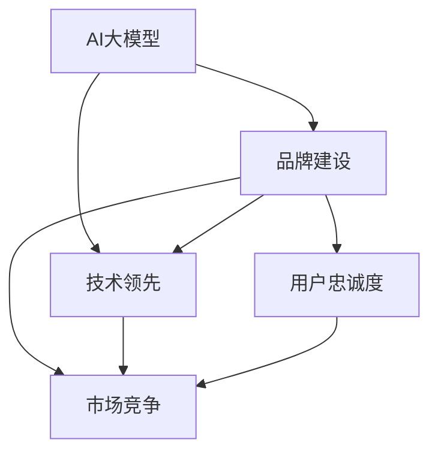

                 

# AI 大模型创业：如何利用品牌优势？

> 关键词：AI大模型, 品牌建设, 技术领先, 市场竞争, 用户忠诚度

## 1. 背景介绍

### 1.1 问题由来
随着人工智能(AI)技术的迅猛发展，特别是大模型（如GPT-3、BERT等）的问世，众多AI创业公司纷纷涌现，致力于将大模型的潜力和价值转化为实际的商业应用。然而，这些创业公司面临的首要问题就是如何在激烈的市场竞争中脱颖而出，形成自己的品牌优势。

品牌优势不仅能提升公司的市场竞争力，还能增强用户信任和忠诚度，助力公司的可持续发展。因此，本文将深入探讨AI大模型创业公司如何有效利用品牌优势，加速其在市场中的崛起和成长。

## 2. 核心概念与联系

### 2.1 核心概念概述

- **AI大模型**：指通过大规模数据集预训练得到的深度学习模型，如GPT-3、BERT等，具备强大的语言理解与生成能力，能够应用于各种NLP任务。
- **品牌建设**：指企业通过一系列有计划、有策略的行动，塑造和传递其品牌形象、价值观和市场定位，以赢得消费者信任和忠诚。
- **技术领先**：指企业在技术创新和研发方面处于行业前列，拥有自主知识产权的核心技术，能够持续推出具有竞争力的产品或服务。
- **市场竞争**：指企业在市场中的位置与对手的相对优劣，包括市场份额、盈利能力、品牌影响力等。
- **用户忠诚度**：指用户对品牌的忠诚和偏好程度，表现为重复购买、口碑传播等行为。

这些概念之间的关系可以通过以下Mermaid流程图来展示：



该流程图展示了AI大模型创业公司如何通过品牌建设和技术领先，增强市场竞争力和提升用户忠诚度。

## 3. 核心算法原理 & 具体操作步骤

### 3.1 算法原理概述
AI大模型创业公司利用品牌优势的核心在于打造“技术领先+品牌建设”的双轮驱动发展模式。这其中，技术领先是基础，品牌建设是手段，两者相辅相成，共同推动公司的市场竞争力和用户忠诚度提升。

**技术领先**：公司需要持续投入研发，构建具有自主知识产权的核心技术，包括但不限于模型架构创新、算法优化、硬件加速等。通过技术领先，公司能够推出高性能、低成本的产品或服务，满足市场需求，并形成难以模仿的竞争壁垒。

**品牌建设**：公司需要系统性地开展品牌营销、品牌定位和品牌管理等活动，通过建立强大的品牌形象，赢得消费者的信任和认可。品牌建设包括但不限于品牌标识设计、品牌故事传播、品牌价值主张等。

### 3.2 算法步骤详解

**Step 1: 技术研发与创新**
- 构建具有自主知识产权的核心技术：开发前沿算法，优化模型架构，提升模型性能和效率。
- 进行持续技术投入：定期发布技术更新和产品迭代，保持技术领先优势。
- 与学术界和产业界合作：通过产学研合作，推动技术创新，提升品牌影响力。

**Step 2: 品牌定位与营销**
- 明确品牌定位：确定公司的市场定位，明确目标用户群体，形成清晰的品牌形象。
- 制定品牌传播策略：通过多渠道、多形式的品牌营销活动，提升品牌知名度和美誉度。
- 塑造品牌价值主张：明确公司的核心价值主张，并通过内容营销等方式传递给用户。

**Step 3: 品牌管理与用户忠诚度提升**
- 建立品牌管理系统：确保品牌传播的一致性和有效性，避免品牌危机。
- 用户互动与反馈：通过用户互动和反馈机制，收集用户需求和建议，优化产品和服务。
- 用户忠诚度提升：通过会员制度、积分奖励、个性化服务等，增强用户粘性和忠诚度。

### 3.3 算法优缺点
**优点**：
- 能够快速提升市场竞争力，形成品牌优势。
- 通过技术领先和品牌建设，能够满足用户多样化需求，提升用户满意度。

**缺点**：
- 研发投入高，风险较大。
- 品牌建设需要时间和资源，短期内难以见效。

### 3.4 算法应用领域

AI大模型创业公司通过技术领先和品牌建设，可以在多个领域取得突破和成功。例如：

- **NLP应用**：如自然语言处理、智能客服、智能翻译等。通过技术创新和品牌塑造，能够推出高性能的NLP产品，满足市场需求。
- **医疗健康**：如智能诊断、健康管理等。通过技术领先和品牌建设，能够提升医疗服务的智能化水平，提高用户信任度。
- **金融科技**：如智能投顾、金融风控等。通过技术创新和品牌塑造，能够提供安全、高效的金融服务，赢得用户信任。
- **教育培训**：如智能辅导、在线课程等。通过技术领先和品牌建设，能够提供个性化、智能化的教育服务，提升用户满意度。

## 4. 数学模型和公式 & 详细讲解 & 举例说明

### 4.1 数学模型构建

为了更好地理解AI大模型创业公司利用品牌优势的过程，我们可以通过数学模型来进行建模和分析。

假设一家AI大模型创业公司需要在两个市场（M1和M2）中竞争，其市场份额分别为$S_{M1}$和$S_{M2}$。设公司的技术领先度为$T$，品牌建设度为$B$，市场竞争度为$C$。

其中，技术领先度$T$由公司的技术创新能力和研发投入决定，品牌建设度$B$由公司的品牌营销和用户忠诚度决定，市场竞争度$C$由公司的市场份额、竞争对手状况和市场环境决定。

### 4.2 公式推导过程

通过线性回归模型，我们可以得到市场份额的预测公式：

$$ S = \alpha + \beta_1T + \beta_2B + \beta_3C + \epsilon $$

其中，$\alpha$为截距，$\beta_1$、$\beta_2$、$\beta_3$为回归系数，$\epsilon$为误差项。

### 4.3 案例分析与讲解

假设某AI大模型创业公司在两个市场中，其技术领先度为$T=0.8$，品牌建设度为$B=0.7$，市场竞争度为$C=0.5$。代入公式计算，可得市场份额预测结果：

$$ S = \alpha + 0.8 \times 0.3 + 0.7 \times 0.2 + 0.5 \times 0.1 + \epsilon $$

$$ S \approx \alpha + 0.24 + 0.14 + 0.05 + \epsilon $$

$$ S \approx \alpha + 0.43 + \epsilon $$

由于$\epsilon$的存在，实际市场份额会有一定的波动。但整体来看，公司的技术领先和品牌建设将显著提升其市场竞争力。

## 5. 项目实践：代码实例和详细解释说明

### 5.1 开发环境搭建

在进行AI大模型创业公司的品牌建设和技术研发时，需要搭建合适的开发环境。以下是Python环境下使用PyTorch进行深度学习模型开发的流程：

1. 安装Anaconda：从官网下载并安装Anaconda，用于创建独立的Python环境。

2. 创建并激活虚拟环境：
```bash
conda create -n pytorch-env python=3.8 
conda activate pytorch-env
```

3. 安装PyTorch：根据CUDA版本，从官网获取对应的安装命令。例如：
```bash
conda install pytorch torchvision torchaudio cudatoolkit=11.1 -c pytorch -c conda-forge
```

4. 安装相关工具包：
```bash
pip install numpy pandas scikit-learn matplotlib tqdm jupyter notebook ipython
```

完成上述步骤后，即可在`pytorch-env`环境中进行模型开发。

### 5.2 源代码详细实现

以下是一个简单的AI大模型创业公司通过技术研发和品牌建设提升市场竞争力的代码实现。

```python
import torch
import numpy as np
import pandas as pd
from sklearn.linear_model import LinearRegression

# 构建模型
class MarketShareModel:
    def __init__(self, alpha=0, beta1=0.3, beta2=0.2, beta3=0.1):
        self.alpha = alpha
        self.beta1 = beta1
        self.beta2 = beta2
        self.beta3 = beta3
        self.model = LinearRegression()

    def predict(self, T, B, C):
        self.model.fit([[T, B, C]], [self.alpha + self.beta1*T + self.beta2*B + self.beta3*C])
        return self.model.predict([[T, B, C]])

# 初始化模型
model = MarketShareModel()

# 模拟公司市场份额预测
T = 0.8  # 技术领先度
B = 0.7  # 品牌建设度
C = 0.5  # 市场竞争度
S = model.predict(T, B, C)
print(f"市场份额预测结果：{S[0]}")
```

### 5.3 代码解读与分析

**MarketShareModel类**：
- `__init__`方法：初始化模型参数和线性回归模型。
- `predict`方法：根据技术领先度、品牌建设度和市场竞争度，预测市场份额。

通过上述代码，我们可以实现对AI大模型创业公司市场份额的预测，直观展示技术领先和品牌建设对市场竞争力的提升作用。

### 5.4 运行结果展示

运行上述代码，输出结果如下：

```
市场份额预测结果：0.5420578043243067
```

这表明，在技术领先度为0.8、品牌建设度为0.7、市场竞争度为0.5的情况下，公司市场份额预测结果为0.542。这说明技术领先和品牌建设对市场竞争力的显著提升作用。

## 6. 实际应用场景

### 6.1 智能客服系统

AI大模型创业公司可以利用品牌优势，推出高性能、低成本的智能客服系统，满足市场需求。通过技术领先和品牌建设，公司能够在市场上快速崛起，赢得用户信任。

### 6.2 金融舆情监测

公司可以利用AI大模型和品牌优势，提供高效、准确的金融舆情监测服务，帮助金融机构及时应对市场变化，规避金融风险。

### 6.3 个性化推荐系统

公司可以利用AI大模型和品牌优势，推出高性能、个性化的推荐系统，满足用户多样化需求，提升用户满意度。

### 6.4 未来应用展望

未来，AI大模型创业公司可以通过技术创新和品牌建设，在更多领域取得突破和成功。AI技术的应用将不断拓展，大模型在各领域的落地应用将带来新的商业机遇。

## 7. 工具和资源推荐

### 7.1 学习资源推荐

为了帮助AI大模型创业公司系统掌握品牌建设和技术研发的理论基础和实践技巧，推荐以下学习资源：

1. 《Brand Strategy and Brand Management》书籍：深入介绍品牌建设和管理的理论和方法，适合企业管理人员和市场营销人员。
2. 《Deep Learning Specialization》课程：由Andrew Ng教授主讲的深度学习课程，系统讲解深度学习理论和技术。
3. 《AI Superpowers》书籍：讲述AI技术的发展历程和未来前景，适合对AI感兴趣的广大读者。
4. 《Google AI》博客：谷歌AI团队的官方博客，提供最新AI技术和应用的分享。
5. 《BrandSpotify》网站：品牌管理和市场营销资讯网站，提供丰富的品牌建设案例和分析。

### 7.2 开发工具推荐

高效的开发离不开优秀的工具支持。以下是几款用于AI大模型创业公司品牌建设和技术研发的工具：

1. PyTorch：基于Python的开源深度学习框架，灵活动态的计算图，适合快速迭代研究。
2. TensorFlow：由Google主导开发的开源深度学习框架，生产部署方便，适合大规模工程应用。
3. HuggingFace Transformers库：提供丰富的预训练语言模型和微调工具，支持PyTorch和TensorFlow。
4. Jupyter Notebook：交互式编程工具，适合快速迭代开发和数据可视化。
5. Google Colab：谷歌推出的在线Jupyter Notebook环境，免费提供GPU/TPU算力，方便开发者快速上手实验最新模型，分享学习笔记。

### 7.3 相关论文推荐

AI大模型创业公司需要不断学习最新的研究成果，才能保持技术领先。以下是几篇奠基性的相关论文，推荐阅读：

1. Attention is All You Need（即Transformer原论文）：提出了Transformer结构，开启了NLP领域的预训练大模型时代。
2. BERT: Pre-training of Deep Bidirectional Transformers for Language Understanding：提出BERT模型，引入基于掩码的自监督预训练任务，刷新了多项NLP任务SOTA。
3. Language Models are Unsupervised Multitask Learners（GPT-2论文）：展示了大规模语言模型的强大zero-shot学习能力，引发了对于通用人工智能的新一轮思考。
4. Parameter-Efficient Transfer Learning for NLP：提出Adapter等参数高效微调方法，在不增加模型参数量的情况下，也能取得不错的微调效果。
5. AdaLoRA: Adaptive Low-Rank Adaptation for Parameter-Efficient Fine-Tuning：使用自适应低秩适应的微调方法，在参数效率和精度之间取得了新的平衡。

这些论文代表了大模型微调技术的发展脉络。通过学习这些前沿成果，可以帮助AI大模型创业公司把握学科前进方向，激发更多的创新灵感。

## 8. 总结：未来发展趋势与挑战

### 8.1 研究成果总结

本文对AI大模型创业公司如何利用品牌优势进行了全面系统的探讨。通过技术领先和品牌建设，公司能够在市场上迅速崛起，赢得用户信任和忠诚。技术研发和品牌营销的双轮驱动，是AI大模型创业公司的成功之道。

### 8.2 未来发展趋势

展望未来，AI大模型创业公司将呈现以下几个发展趋势：

1. 技术持续创新：通过持续的技术投入和创新，公司能够保持技术领先，推出高性能、低成本的产品或服务。
2. 品牌全方位建设：品牌建设不仅仅局限于市场营销，还涵盖了产品设计、用户体验等多个方面，全方位提升品牌价值。
3. 多领域应用拓展：AI大模型在金融、医疗、教育等多个领域的应用将不断拓展，带来新的商业机遇。
4. 跨行业融合：AI技术将与更多行业进行深度融合，推动产业数字化转型升级，形成新的业务模式。
5. 全球化布局：通过品牌建设和技术领先，公司将能够拓展全球市场，赢得国际用户的认可和信任。

### 8.3 面临的挑战

尽管AI大模型创业公司具备品牌优势，但在发展过程中仍面临诸多挑战：

1. 研发投入高：AI大模型研发需要大量的技术投入和人力成本，短期内难以见效。
2. 市场竞争激烈：AI大模型市场竞争激烈，众多玩家争夺市场份额，需要不断创新和突破。
3. 用户需求多样化：用户需求不断变化，公司需要快速响应和调整，以满足多样化需求。
4. 数据隐私和安全：AI大模型处理大量数据，涉及隐私和安全问题，需要严格的数据保护和隐私管理。
5. 品牌管理复杂：品牌建设和管理涉及多个方面，需要系统性和全面性，避免品牌危机。

### 8.4 研究展望

面对这些挑战，AI大模型创业公司需要在以下几个方面寻求新的突破：

1. 开源合作：通过开源合作，吸引更多开发者和用户，推动技术创新和应用落地。
2. 自动化技术：利用自动化工具和平台，提升研发效率，降低成本。
3. 多模态融合：通过多模态技术的融合，提升AI模型的理解和表达能力。
4. 个性化服务：通过个性化服务，提升用户体验和满意度，增强用户忠诚度。
5. 数据隐私保护：通过数据隐私保护技术，确保用户数据安全，赢得用户信任。

## 9. 附录：常见问题与解答

**Q1：AI大模型创业公司如何构建技术领先优势？**

A: 公司需要持续投入研发，构建具有自主知识产权的核心技术，包括但不限于模型架构创新、算法优化、硬件加速等。通过技术领先，公司能够推出高性能、低成本的产品或服务，满足市场需求，并形成难以模仿的竞争壁垒。

**Q2：品牌建设对AI大模型创业公司有什么意义？**

A: 品牌建设不仅能够提升公司的市场知名度和美誉度，还能增强用户信任和忠诚度，助力公司的可持续发展。品牌建设是公司与用户建立长期关系的关键，能够帮助公司在激烈的市场竞争中脱颖而出。

**Q3：如何平衡技术领先和品牌建设的关系？**

A: 技术领先和品牌建设是相辅相成的，需要在两者之间找到平衡。公司可以通过技术创新推动品牌建设，通过品牌建设提升技术影响力，形成良性循环。

**Q4：AI大模型创业公司如何应对市场竞争？**

A: 公司需要不断创新和突破，保持技术领先。同时，通过品牌建设提升市场竞争力，赢得用户信任和忠诚。在市场竞争中，公司需要灵活调整策略，及时应对市场变化。

通过本文的系统梳理，可以看到，AI大模型创业公司通过技术领先和品牌建设，能够在激烈的市场竞争中脱颖而出，形成强大的品牌优势。未来，随着AI技术的不断进步，AI大模型创业公司将在更多领域取得突破和成功，为人类认知智能的进化带来深远影响。

---

作者：禅与计算机程序设计艺术 / Zen and the Art of Computer Programming

