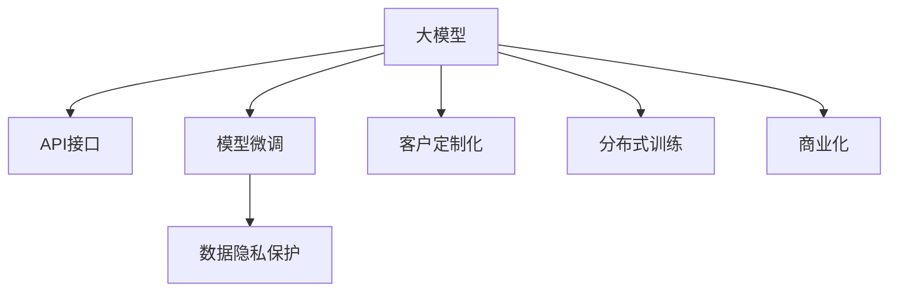

                 

# AI 大模型创业：如何利用商业优势？

## 1. 背景介绍

随着人工智能(AI)技术的迅猛发展，大模型（Large Models）逐渐成为AI创业中的新热点。大模型通过在大量数据上进行训练，具备了强大的学习能力，广泛应用于自然语言处理（NLP）、计算机视觉（CV）、语音识别等领域，成为推动AI技术进步的重要引擎。在AI创业浪潮中，如何充分利用大模型的商业优势，是每一个AI创业者需要深入思考的问题。

### 1.1 大模型的商业价值

大模型的商业价值主要体现在以下几个方面：

- **泛化能力**：大模型具备强大的泛化能力，能够在多种场景下表现出色，提供通用的解决方案。
- **性能提升**：相较于传统模型，大模型在精度、效率等方面具有显著优势，能够大幅提升应用性能。
- **规模经济**：大模型基于大量数据进行训练，成本相对较低，且训练数据能够复用，具有显著的规模经济效应。
- **应用场景广泛**：大模型能够在多个领域实现应用，如智能客服、金融风控、医疗诊断等，覆盖广泛的商业需求。

### 1.2 大模型的市场现状

当前，大模型市场呈现出以下几个特点：

- **头部公司领跑**：如Google、Facebook、Microsoft等巨头，通过自研和合作，构建了大量大模型，占据市场主导地位。
- **开源社区活跃**：大模型开源项目（如OpenAI的GPT系列、HuggingFace的Transformers等）激发了学术和工业界的广泛参与，推动了技术进步。
- **初创公司涌现**：大量初创公司通过技术创新和市场差异化，在特定领域取得突破，如Insightface、SenseTime等。
- **应用场景拓展**：大模型在医疗、金融、教育、交通等领域的商业应用逐步落地，展示了广阔的市场前景。

## 2. 核心概念与联系

### 2.1 核心概念概述

为了更好地理解大模型的商业优势，本节将介绍几个关键概念：

- **大模型**：指在大量数据上训练得到的具备强大泛化能力的大型神经网络模型，如BERT、GPT-3、DALL-E等。
- **商业化**：指将大模型应用于实际商业场景，提供产品或服务的过程。
- **API接口**：提供模型推理服务的关键接口，支持开发者快速集成模型到应用中。
- **模型微调**：通过在特定数据集上微调模型参数，使其适应特定场景，提高模型性能。
- **数据隐私**：在商业应用中，如何处理和保护用户数据隐私，是大模型商业化中的重要考量。
- **客户定制化**：根据客户需求，定制化模型功能和服务，提升用户体验和满意度。
- **分布式训练**：通过分布式训练技术，加速大模型的训练过程，提升效率和可扩展性。

这些核心概念之间的逻辑关系可以通过以下Mermaid流程图来展示：



这个流程图展示了大模型的核心概念及其之间的关系：

1. 大模型通过API接口提供推理服务。
2. 在特定场景中，模型需要进行微调以提高性能。
3. 数据隐私保护是商业应用中的重要环节。
4. 客户定制化提供个性化的解决方案。
5. 分布式训练提升模型训练效率。
6. 最后，模型经过商业化过程，实现其商业价值。

## 3. 核心算法原理 & 具体操作步骤

### 3.1 算法原理概述

大模型的商业化过程主要包括以下几个步骤：

1. **API接口设计**：定义统一的接口规范，支持多种编程语言和平台。
2. **模型微调**：根据特定场景的数据，调整模型参数，使其适应新的应用需求。
3. **数据隐私保护**：采用数据脱敏、差分隐私等技术，确保用户数据的安全性。
4. **客户定制化**：根据客户需求，定制化模型功能和服务。
5. **分布式训练**：使用分布式训练技术，加速大模型的训练过程。
6. **模型评估与优化**：通过多轮评估和迭代，优化模型性能和用户体验。

### 3.2 算法步骤详解

以下是大模型商业化的详细步骤：

**Step 1: 数据收集与处理**

- 收集与任务相关的数据集，包括训练数据和测试数据。
- 对数据进行预处理，如数据清洗、标准化、分词等。
- 对数据进行标注，如文本分类任务中的标签标注。

**Step 2: 模型选择与设计**

- 选择合适的预训练模型，如BERT、GPT、XLNet等。
- 设计适合的模型架构，如Transformer、LSTM等。
- 根据任务需求，设计任务特定的输出层和损失函数。

**Step 3: 模型微调**

- 在训练集上进行模型微调，优化模型参数。
- 在验证集上评估模型性能，调整学习率和迭代次数。
- 在测试集上测试微调后的模型，评估效果。

**Step 4: 数据隐私保护**

- 采用差分隐私、联邦学习等技术，保护用户数据隐私。
- 对敏感数据进行脱敏处理，减少隐私泄露风险。

**Step 5: 客户定制化**

- 根据客户需求，定制化模型功能和输出格式。
- 提供个性化服务，如API接口定制、服务流程优化等。

**Step 6: 分布式训练**

- 使用分布式训练技术，提升模型训练速度。
- 优化资源配置，提升模型训练效率。

**Step 7: 模型评估与优化**

- 通过多轮评估，优化模型性能和用户体验。
- 根据反馈不断改进模型，提高应用效果。

### 3.3 算法优缺点

大模型商业化方法具有以下优点：

- **高效性**：相较于从头开发模型，大模型商业化过程更高效，节省了大量时间和成本。
- **可扩展性**：大模型具备强大的泛化能力，能够适应多种场景和需求。
- **应用灵活性**：大模型支持多种编程语言和平台，便于快速集成到应用中。
- **市场竞争优势**：大模型通常具备技术领先优势，能够在市场中占据有利位置。

同时，大模型商业化方法也存在一定的局限性：

- **数据依赖**：大模型商业化需要大量高质量的标注数据，获取数据的成本较高。
- **性能优化**：模型微调需要调整大量参数，容易过拟合，需要精细的调参策略。
- **隐私问题**：在商业应用中，如何保护用户数据隐私，是大模型商业化中的重要挑战。
- **成本投入**：大模型训练和微调需要高性能计算资源，成本较高。

### 3.4 算法应用领域

大模型商业化方法广泛应用于以下几个领域：

- **自然语言处理**：如智能客服、文本分类、情感分析等。通过微调模型，提高模型的准确性和泛化能力。
- **计算机视觉**：如图像分类、目标检测、人脸识别等。通过微调模型，提升视觉识别精度。
- **语音识别**：如语音转文字、语音合成等。通过微调模型，提升语音识别准确率。
- **金融科技**：如信用评分、风险评估等。通过微调模型，提高金融风控能力。
- **医疗健康**：如医学影像分析、疾病诊断等。通过微调模型，提升医疗诊断精度。
- **教育培训**：如智能推荐、作业批改等。通过微调模型，提升教育培训效果。

## 4. 数学模型和公式 & 详细讲解 & 举例说明

### 4.1 数学模型构建

大模型商业化过程涉及多个数学模型，以下详细介绍几种关键模型：

**模型微调数学模型**

假设模型为 $M_{\theta}$，损失函数为 $\mathcal{L}$，训练集为 $D=\{(x_i,y_i)\}_{i=1}^N$，其中 $x_i$ 为输入，$y_i$ 为标签。微调的优化目标为：

$$
\theta^* = \mathop{\arg\min}_{\theta} \mathcal{L}(M_{\theta},D)
$$

通常使用梯度下降等优化算法进行求解。

**数据隐私保护数学模型**

假设原始数据集为 $D_{original}$，隐私保护后的数据集为 $D_{protected}$。隐私保护的目标是：

$$
\min_{\epsilon} \mathcal{L}(D_{protected},D_{original}) \text{ s.t. } \epsilon \leq \epsilon_{max}
$$

其中 $\epsilon$ 为隐私保护强度，$\epsilon_{max}$ 为预设的最大隐私保护强度。

**客户定制化数学模型**

假设客户需求为 $C$，模型输出的格式为 $O$。定制化的目标是最小化模型输出与客户需求之间的差距：

$$
\min_{M} \mathcal{L}(C,M) \text{ s.t. } M = M_{\theta}
$$

其中 $M_{\theta}$ 为原始模型，$M$ 为客户定制化后的模型。

### 4.2 公式推导过程

**模型微调公式推导**

假设模型为 $M_{\theta}$，损失函数为 $\mathcal{L}$，使用梯度下降算法进行求解。微调的目标为最小化损失函数 $\mathcal{L}$：

$$
\theta \leftarrow \theta - \eta \nabla_{\theta}\mathcal{L}(\theta)
$$

其中 $\eta$ 为学习率，$\nabla_{\theta}\mathcal{L}(\theta)$ 为损失函数对模型参数的梯度。

**隐私保护公式推导**

假设原始数据集为 $D_{original}$，隐私保护后的数据集为 $D_{protected}$，采用差分隐私技术。差分隐私的目标是：

$$
\min_{\epsilon} \mathcal{L}(D_{protected},D_{original}) \text{ s.t. } \epsilon \leq \epsilon_{max}
$$

其中 $\epsilon$ 为隐私保护强度，$\epsilon_{max}$ 为预设的最大隐私保护强度。

**客户定制化公式推导**

假设客户需求为 $C$，模型输出的格式为 $O$，使用梯度下降算法进行求解。定制化的目标是最小化模型输出与客户需求之间的差距：

$$
\min_{M} \mathcal{L}(C,M) \text{ s.t. } M = M_{\theta}
$$

其中 $M_{\theta}$ 为原始模型，$M$ 为客户定制化后的模型。

### 4.3 案例分析与讲解

**案例分析：金融风控**

假设某银行需要构建信用评分模型，以判断客户的信用风险。银行收集了大量客户历史数据，并标注了客户的信用等级。银行决定使用BERT模型作为基础模型，并根据实际需求进行微调：

1. **数据收集与处理**：收集客户历史交易记录、个人基本信息、社交网络数据等，进行数据清洗和标注。
2. **模型选择与设计**：选择BERT作为基础模型，设计适合信用评分的任务特定输出层和损失函数。
3. **模型微调**：在训练集上对BERT模型进行微调，优化模型参数。
4. **数据隐私保护**：对敏感数据进行脱敏处理，确保客户隐私安全。
5. **客户定制化**：根据客户需求，定制化模型功能和服务，提供个性化信用评分报告。
6. **分布式训练**：使用分布式训练技术，提升模型训练速度。
7. **模型评估与优化**：通过多轮评估，优化模型性能和用户体验。

通过上述步骤，银行能够快速构建信用评分模型，提升风控能力。

## 5. 项目实践：代码实例和详细解释说明

### 5.1 开发环境搭建

在进行大模型商业化实践前，我们需要准备好开发环境。以下是使用Python进行TensorFlow开发的环境配置流程：

1. 安装Anaconda：从官网下载并安装Anaconda，用于创建独立的Python环境。

2. 创建并激活虚拟环境：
```bash
conda create -n tf-env python=3.8 
conda activate tf-env
```

3. 安装TensorFlow：根据CUDA版本，从官网获取对应的安装命令。例如：
```bash
conda install tensorflow -c tensorflow -c conda-forge
```

4. 安装TensorFlow Addons：包含TensorFlow的一些扩展模块，如TensorFlow Datasets、TensorFlow Text等。

5. 安装各类工具包：
```bash
pip install numpy pandas scikit-learn matplotlib tqdm jupyter notebook ipython
```

完成上述步骤后，即可在`tf-env`环境中开始商业化实践。

### 5.2 源代码详细实现

下面我们以金融风控任务为例，给出使用TensorFlow对BERT模型进行商业化微调的代码实现。

首先，定义信用评分任务的数学模型：

```python
import tensorflow as tf
from tensorflow.keras import layers
from tensorflow.keras.preprocessing.sequence import pad_sequences
from tensorflow.keras.layers import Dense, Dropout, Embedding, Flatten, Input
from tensorflow.keras.models import Model

# 定义模型架构
input_layer = Input(shape=(None,))
embedding_layer = Embedding(input_dim=10000, output_dim=128)(input_layer)
lstm_layer = layers.LSTM(128)(embedding_layer)
dense_layer = Dense(64, activation='relu')(lstm_layer)
output_layer = Dense(1, activation='sigmoid')(dense_layer)
model = Model(input_layer, output_layer)

# 编译模型
model.compile(optimizer='adam', loss='binary_crossentropy', metrics=['accuracy'])
```

然后，定义模型微调的具体步骤：

```python
# 加载训练数据
train_data = ...
train_labels = ...

# 加载测试数据
test_data = ...
test_labels = ...

# 数据预处理
train_input = pad_sequences(train_data, maxlen=100)
test_input = pad_sequences(test_data, maxlen=100)

# 模型微调
model.fit(train_input, train_labels, epochs=10, batch_size=32, validation_data=(test_input, test_labels))
```

最后，评估模型效果：

```python
# 加载测试数据
test_data = ...
test_labels = ...

# 数据预处理
test_input = pad_sequences(test_data, maxlen=100)

# 模型评估
loss, accuracy = model.evaluate(test_input, test_labels)
print(f'Test loss: {loss:.4f}')
print(f'Test accuracy: {accuracy:.4f}')
```

以上就是使用TensorFlow对BERT进行金融风控任务商业化微调的完整代码实现。可以看到，TensorFlow的Keras API提供了高度抽象的模型构建接口，使得微调过程简单易行。

### 5.3 代码解读与分析

让我们再详细解读一下关键代码的实现细节：

**数据预处理**

```python
from tensorflow.keras.preprocessing.sequence import pad_sequences

# 对文本数据进行截断和补全
train_input = pad_sequences(train_data, maxlen=100)
test_input = pad_sequences(test_data, maxlen=100)
```

在文本数据处理中，通常会面临文本长度不一致的问题。使用`pad_sequences`方法可以对序列数据进行截断和补全，确保数据的一致性。

**模型编译**

```python
model.compile(optimizer='adam', loss='binary_crossentropy', metrics=['accuracy'])
```

在模型编译阶段，需要定义优化器、损失函数和评估指标。对于二分类任务，通常使用`binary_crossentropy`损失函数，`accuracy`作为评估指标。

**模型微调**

```python
model.fit(train_input, train_labels, epochs=10, batch_size=32, validation_data=(test_input, test_labels))
```

在模型微调阶段，需要将训练集数据和测试集数据输入模型，通过`fit`方法进行训练。设置合适的`epochs`和`batch_size`，可以在保证效果的同时，提升训练效率。

**模型评估**

```python
loss, accuracy = model.evaluate(test_input, test_labels)
```

在模型评估阶段，使用`evaluate`方法计算测试集的损失和准确率，评估模型效果。

通过上述步骤，我们可以快速构建并评估金融风控任务的BERT微调模型。

## 6. 实际应用场景

### 6.1 智能客服

智能客服系统通过大模型的微调，可以快速响应用户问题，提升用户体验。客户在查询时，系统会根据客户输入的语句进行自然语言理解，并自动匹配答案模板，生成自然流畅的回答。

具体实现中，可以收集客户的历史对话记录，将问题和最佳答复构建成监督数据，在此基础上对预训练模型进行微调。微调后的模型能够自动理解用户意图，匹配最合适的答案模板进行回复。

### 6.2 医疗诊断

医疗诊断是一个复杂而关键的领域，大模型的微调可以提升疾病诊断的准确性和效率。医院可以将病人的病历数据作为监督数据，对大模型进行微调，使其能够自动诊断疾病。

例如，使用BERT模型对医学文本进行预训练，并在病历数据上进行微调，可以显著提升疾病诊断的准确性。微调后的模型能够理解医学文本的语义，快速识别出病理特征，辅助医生进行诊断。

### 6.3 金融风控

金融风控是大模型商业化应用的典型场景。银行、保险公司等机构可以通过微调模型，快速构建信用评分、风险评估等系统，提升风控能力。

在实践中，银行可以收集客户的历史交易记录、个人基本信息等数据，对大模型进行微调。微调后的模型能够自动分析客户的信用风险，提供个性化的信用评分报告，帮助银行进行风险管理。

### 6.4 未来应用展望

随着大模型技术的不断发展，未来大模型在商业化应用中的前景将更加广阔。以下列举几个未来应用方向：

- **智能推荐系统**：通过微调模型，构建个性化推荐系统，提升用户体验和转化率。
- **智能安防监控**：使用大模型进行视频内容分析，提升监控系统的识别和处理能力。
- **智能交通管理**：利用大模型进行交通数据分析，优化交通流量管理，提升道路通行效率。
- **智能教育培训**：通过微调模型，构建个性化学习平台，提升教育培训效果。
- **智能客服机器人**：使用大模型构建多语言客服机器人，提升客服系统的响应速度和准确性。

这些应用方向将进一步拓展大模型的商业价值，推动AI技术在各行各业的深入应用。

## 7. 工具和资源推荐

### 7.1 学习资源推荐

为了帮助开发者系统掌握大模型商业化的理论基础和实践技巧，这里推荐一些优质的学习资源：

1. **《深度学习理论与实践》**：由斯坦福大学教授撰写，全面介绍了深度学习的基本原理和应用，是大模型商业化的基础理论学习资源。
2. **Coursera《TensorFlow》课程**：由TensorFlow官方提供的课程，覆盖TensorFlow的各个方面，是大模型商业化的实战开发学习资源。
3. **HuggingFace官方文档**：提供丰富的预训练模型和微调样例，是大模型商业化开发的重要参考。
4. **GitHub大模型开源项目**：包含大量大模型的代码实现和文档，是大模型商业化开发的学习资源。
5. **Kaggle竞赛平台**：提供丰富的NLP任务数据集和模型竞赛，是大模型商业化的实战测试平台。

通过对这些资源的学习实践，相信你一定能够快速掌握大模型商业化的精髓，并用于解决实际的NLP问题。

### 7.2 开发工具推荐

高效的开发离不开优秀的工具支持。以下是几款用于大模型商业化开发的常用工具：

1. **TensorFlow**：由Google主导开发的深度学习框架，生产部署方便，适合大规模工程应用。
2. **TensorFlow Datasets**：提供丰富的数据集，支持自动数据预处理和增强，是大模型商业化数据集获取的便捷工具。
3. **Keras**：提供简单易用的API接口，支持多种深度学习模型的快速构建，是大模型商业化模型构建的便捷工具。
4. **TF Addons**：提供TensorFlow的扩展模块，如TensorFlow Text、TensorFlow Datasets等，是大模型商业化开发的重要支持。
5. **HuggingFace Transformers库**：提供丰富的预训练模型和微调接口，是大模型商业化开发的重要支持。

合理利用这些工具，可以显著提升大模型商业化任务的开发效率，加快创新迭代的步伐。

### 7.3 相关论文推荐

大模型商业化技术的不断发展源于学界的持续研究。以下是几篇奠基性的相关论文，推荐阅读：

1. **《Transformers: A New Architecture for Statistical Machine Translation》**：提出Transformer结构，开启了NLP领域的预训练大模型时代。
2. **《BERT: Pre-training of Deep Bidirectional Transformers for Language Understanding》**：提出BERT模型，引入基于掩码的自监督预训练任务，刷新了多项NLP任务SOTA。
3. **《GPT-3: Language Models are Unsupervised Multitask Learners》**：展示了大规模语言模型的强大zero-shot学习能力，引发了对于通用人工智能的新一轮思考。
4. **《Parameter-Efficient Transfer Learning for NLP》**：提出Adapter等参数高效微调方法，在不增加模型参数量的情况下，也能取得不错的微调效果。
5. **《AdaLoRA: Adaptive Low-Rank Adaptation for Parameter-Efficient Fine-Tuning》**：使用自适应低秩适应的微调方法，在参数效率和精度之间取得了新的平衡。

这些论文代表了大模型商业化技术的发展脉络。通过学习这些前沿成果，可以帮助研究者把握学科前进方向，激发更多的创新灵感。

## 8. 总结：未来发展趋势与挑战

### 8.1 总结

本文对大模型商业化的理论基础和实践技巧进行了全面系统的介绍。首先阐述了大模型和微调技术的研究背景和意义，明确了微调在拓展预训练模型应用、提升下游任务性能方面的独特价值。其次，从原理到实践，详细讲解了大模型商业化的数学模型和具体步骤，给出了微调任务开发的完整代码实例。同时，本文还广泛探讨了微调方法在智能客服、医疗诊断、金融风控等多个行业领域的应用前景，展示了微调范式的巨大潜力。最后，本文精选了大模型商业化的学习资源，力求为读者提供全方位的技术指引。

通过本文的系统梳理，可以看到，大模型商业化方法正在成为NLP领域的重要范式，极大地拓展了预训练语言模型的应用边界，催生了更多的落地场景。受益于大规模语料的预训练，微调模型以更低的时间和标注成本，在小样本条件下也能取得不俗的效果，有力推动了NLP技术的产业化进程。未来，伴随预训练语言模型和微调方法的持续演进，相信NLP技术将在更广阔的应用领域大放异彩，深刻影响人类的生产生活方式。

### 8.2 未来发展趋势

展望未来，大模型商业化技术将呈现以下几个发展趋势：

- **模型规模持续增大**：随着算力成本的下降和数据规模的扩张，预训练语言模型的参数量还将持续增长。超大规模语言模型蕴含的丰富语言知识，有望支撑更加复杂多变的下游任务微调。
- **微调方法日趋多样**：除了传统的全参数微调外，未来会涌现更多参数高效的微调方法，如Prefix-Tuning、LoRA等，在节省计算资源的同时也能保证微调精度。
- **持续学习成为常态**：随着数据分布的不断变化，微调模型也需要持续学习新知识以保持性能。如何在不遗忘原有知识的同时，高效吸收新样本信息，将成为重要的研究课题。
- **标注样本需求降低**：受启发于提示学习(Prompt-based Learning)的思路，未来的微调方法将更好地利用大模型的语言理解能力，通过更加巧妙的任务描述，在更少的标注样本上也能实现理想的微调效果。
- **多模态微调崛起**：当前的微调主要聚焦于纯文本数据，未来会进一步拓展到图像、视频、语音等多模态数据微调。多模态信息的融合，将显著提升语言模型对现实世界的理解和建模能力。
- **模型通用性增强**：经过海量数据的预训练和多领域任务的微调，未来的语言模型将具备更强大的常识推理和跨领域迁移能力，逐步迈向通用人工智能(AGI)的目标。

以上趋势凸显了大模型商业化技术的广阔前景。这些方向的探索发展，必将进一步提升NLP系统的性能和应用范围，为人类认知智能的进化带来深远影响。

### 8.3 面临的挑战

尽管大模型商业化技术已经取得了瞩目成就，但在迈向更加智能化、普适化应用的过程中，它仍面临着诸多挑战：

- **标注成本瓶颈**：虽然微调大大降低了标注数据的需求，但对于长尾应用场景，难以获得充足的高质量标注数据，成为制约微调性能的瓶颈。如何进一步降低微调对标注样本的依赖，将是一大难题。
- **模型鲁棒性不足**：当前微调模型面对域外数据时，泛化性能往往大打折扣。对于测试样本的微小扰动，微调模型的预测也容易发生波动。如何提高微调模型的鲁棒性，避免灾难性遗忘，还需要更多理论和实践的积累。
- **推理效率有待提高**：大规模语言模型虽然精度高，但在实际部署时往往面临推理速度慢、内存占用大等效率问题。如何在保证性能的同时，简化模型结构，提升推理速度，优化资源占用，将是重要的优化方向。
- **可解释性亟需加强**：当前微调模型更像是"黑盒"系统，难以解释其内部工作机制和决策逻辑。对于医疗、金融等高风险应用，算法的可解释性和可审计性尤为重要。如何赋予微调模型更强的可解释性，将是亟待攻克的难题。
- **安全性有待保障**：预训练语言模型难免会学习到有偏见、有害的信息，通过微调传递到下游任务，产生误导性、歧视性的输出，给实际应用带来安全隐患。如何从数据和算法层面消除模型偏见，避免恶意用途，确保输出的安全性，也将是重要的研究课题。
- **知识整合能力不足**：现有的微调模型往往局限于任务内数据，难以灵活吸收和运用更广泛的先验知识。如何让微调过程更好地与外部知识库、规则库等专家知识结合，形成更加全面、准确的信息整合能力，还有很大的想象空间。

正视大模型商业化面临的这些挑战，积极应对并寻求突破，将是大模型商业化走向成熟的必由之路。相信随着学界和产业界的共同努力，这些挑战终将一一被克服，大模型商业化必将在构建人机协同的智能时代中扮演越来越重要的角色。

### 8.4 未来突破

面对大模型商业化所面临的种种挑战，未来的研究需要在以下几个方面寻求新的突破：

- **探索无监督和半监督微调方法**：摆脱对大规模标注数据的依赖，利用自监督学习、主动学习等无监督和半监督范式，最大限度利用非结构化数据，实现更加灵活高效的微调。
- **研究参数高效和计算高效的微调范式**：开发更加参数高效的微调方法，在固定大部分预训练参数的同时，只更新极少量的任务相关参数。同时优化微调模型的计算图，减少前向传播和反向传播的资源消耗，实现更加轻量级、实时性的部署。
- **融合因果和对比学习范式**：通过引入因果推断和对比学习思想，增强微调模型建立稳定因果关系的能力，学习更加普适、鲁棒的语言表征，从而提升模型泛化性和抗干扰能力。
- **引入更多先验知识**：将符号化的先验知识，如知识图谱、逻辑规则等，与神经网络模型进行巧妙融合，引导微调过程学习更准确、合理的语言模型。同时加强不同模态数据的整合，实现视觉、语音等多模态信息与文本信息的协同建模。
- **结合因果分析和博弈论工具**：将因果分析方法引入微调模型，识别出模型决策的关键特征，增强输出解释的因果性和逻辑性。借助博弈论工具刻画人机交互过程，主动探索并规避模型的脆弱点，提高系统稳定性。
- **纳入伦理道德约束**：在模型训练目标中引入伦理导向的评估指标，过滤和惩罚有偏见、有害的输出倾向。同时加强人工干预和审核，建立模型行为的监管机制，确保输出符合人类价值观和伦理道德。

这些研究方向的探索，必将引领大模型商业化技术迈向更高的台阶，为构建安全、可靠、可解释、可控的智能系统铺平道路。面向未来，大模型商业化技术还需要与其他人工智能技术进行更深入的融合，如知识表示、因果推理、强化学习等，多路径协同发力，共同推动自然语言理解和智能交互系统的进步。只有勇于创新、敢于突破，才能不断拓展语言模型的边界，让智能技术更好地造福人类社会。

## 9. 附录：常见问题与解答

**Q1：大模型商业化是否适用于所有NLP任务？**

A: 大模型商业化在大多数NLP任务上都能取得不错的效果，特别是对于数据量较小的任务。但对于一些特定领域的任务，如医学、法律等，仅仅依靠通用语料预训练的模型可能难以很好地适应。此时需要在特定领域语料上进一步预训练，再进行微调，才能获得理想效果。此外，对于一些需要时效性、个性化很强的任务，如对话、推荐等，微调方法也需要针对性的改进优化。

**Q2：大模型商业化过程中如何选择合适的学习率？**

A: 大模型商业化需要选择合适的学习率，过大或过小的学习率都会影响模型性能。一般建议从1e-5开始调参，逐步减小学习率，直至收敛。也可以使用warmup策略，在开始阶段使用较小的学习率，再逐渐过渡到预设值。需要注意的是，不同的优化器(如Adam、Adafactor等)以及不同的学习率调度策略，可能需要设置不同的学习率阈值。

**Q3：大模型商业化过程中如何进行数据隐私保护？**

A: 大模型商业化过程中，数据隐私保护是重要的环节。可以采用差分隐私、联邦学习等技术，确保用户数据的安全性。具体方法包括：
1. 对敏感数据进行脱敏处理，减少隐私泄露风险。
2. 采用差分隐私技术，限制模型对单个样本的依赖。
3. 采用联邦学习技术，模型在不同设备上分散训练，降低数据泄露风险。

**Q4：大模型商业化过程中如何优化模型推理效率？**

A: 大模型商业化过程中，模型推理效率是关键因素。可以采用以下方法进行优化：
1. 模型裁剪：去除不必要的层和参数，减小模型尺寸，加快推理速度。
2. 量化加速：将浮点模型转为定点模型，压缩存储空间，提高计算效率。
3. 服务化封装：将模型封装为标准化服务接口，便于集成调用。
4. 弹性伸缩：根据请求流量动态调整资源配置，平衡服务质量和成本。
5. 监控告警：实时采集系统指标，设置异常告警阈值，确保服务稳定性。

通过以上方法，可以在保证模型性能的同时，显著提升推理速度和系统稳定性。

**Q5：大模型商业化过程中如何处理客户定制化需求？**

A: 大模型商业化过程中，客户定制化需求是重要考量。可以采用以下方法进行处理：
1. 根据客户需求，定制化模型功能和服务，提供个性化服务。
2. 提供API接口定制，支持开发者快速集成模型到应用中。
3. 服务流程优化，提升用户体验和满意度。

通过以上方法，可以更好地满足客户定制化需求，提升用户体验。

---

作者：禅与计算机程序设计艺术 / Zen and the Art of Computer Programming

