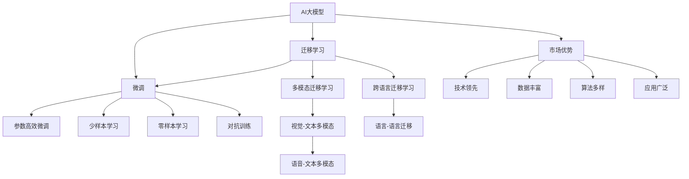

                 

# AI 大模型创业：如何利用市场优势？

在过去的几年中，人工智能（AI）大模型如GPT-3、BERT、T5等取得了巨大成功，不仅在学术界引发了巨大关注，更在商业界引发了热烈讨论。AI大模型不仅是技术创新的体现，更是市场竞争的关键要素。本文将深入探讨AI大模型在创业中的市场优势，并详细分析如何最大化这些优势。

## 1. 背景介绍

### 1.1 市场竞争态势
随着人工智能技术的迅速发展，AI大模型成为各大科技巨头和创业公司竞相争夺的焦点。这些大模型具有强大的数据处理能力和泛化能力，能够大幅提升应用的效率和效果。如何在激烈的竞争中脱颖而出，利用AI大模型的市场优势，是创业者必须面对的重要问题。

### 1.2 核心技术原理
AI大模型是基于深度学习的大型神经网络，通过大量数据预训练获得通用语言知识和特定任务能力。核心技术包括自监督学习、迁移学习、微调等。这些技术使得大模型能够快速适应不同任务，并展现出出色的性能。

### 1.3 市场需求分析
AI大模型广泛应用于自然语言处理（NLP）、计算机视觉（CV）、语音识别等领域，市场需求强劲。特别是在医疗、金融、教育等垂直领域，AI大模型具有显著应用前景。

## 2. 核心概念与联系

### 2.1 核心概念概述
为更好地理解AI大模型的市场优势，本节将介绍几个关键概念：

- AI大模型：基于深度学习的通用神经网络，通过大规模数据预训练获得广泛的语言知识和特定任务能力。
- 迁移学习：通过将大模型在某个领域的预训练知识迁移到另一领域，提升模型的泛化能力。
- 微调：在特定任务上对大模型进行有监督学习，进一步优化模型的性能。
- 迁移学习与微调的关系：迁移学习是大模型微调的前提，微调则是迁移学习的具体实现。
- 模型市场优势：包括技术领先、数据丰富、算法多样、应用广泛等。

### 2.2 核心概念原理和架构的 Mermaid 流程图


这个流程图展示了AI大模型的核心概念及其之间的关系：

1. AI大模型通过迁移学习获得泛化能力。
2. 微调是大模型应用的具体形式，提升模型在特定任务上的性能。
3. 迁移学习与微调紧密关联，前者提供泛化知识，后者将其具体化。
4. 模型市场优势来自技术、数据、算法和应用等多方面。

## 3. 核心算法原理 & 具体操作步骤
### 3.1 算法原理概述
AI大模型的核心算法原理是深度学习中的自监督学习和迁移学习。自监督学习通过在大量无标签数据上训练模型，使其学习到通用的语言知识和表示；迁移学习则将大模型在某个领域的预训练知识迁移到另一领域，提升模型在新任务上的表现。

AI大模型的微调过程一般包括以下步骤：

1. 准备预训练模型和大规模标注数据。
2. 添加任务适配层，如分类器、解码器等。
3. 选择优化算法和正则化技术。
4. 执行梯度训练，更新模型参数。
5. 测试和部署微调后的模型。

### 3.2 算法步骤详解
**Step 1: 准备预训练模型和数据集**

- 选择适合的预训练大模型，如GPT-3、BERT等。
- 准备目标任务的大规模标注数据集，分为训练集、验证集和测试集。

**Step 2: 添加任务适配层**

- 根据任务类型设计适配层，如分类任务的线性分类器、生成任务的解码器等。
- 定义损失函数，如交叉熵、均方误差等。

**Step 3: 设置微调超参数**

- 选择合适的优化算法，如AdamW、SGD等。
- 设置学习率、批大小、迭代轮数等超参数。
- 选择正则化技术，如L2正则、Dropout等。

**Step 4: 执行梯度训练**

- 将训练集数据分批次输入模型，计算损失函数。
- 反向传播计算梯度，更新模型参数。
- 周期性在验证集上评估模型性能，防止过拟合。

**Step 5: 测试和部署**

- 在测试集上评估微调后模型的性能。
- 部署模型到实际应用中，进行实时推理预测。

### 3.3 算法优缺点

AI大模型的微调具有以下优点：

- 高效：使用预训练模型，大大减少了从头训练的时间和成本。
- 泛化能力强：预训练模型在多个任务上表现出色，微调后仍能保持良好性能。
- 灵活：适应性强，可轻松应用到不同领域和任务中。

同时，也存在一些缺点：

- 依赖标注数据：微调效果受数据质量和数量影响，标注成本较高。
- 计算资源需求大：大模型参数量庞大，训练和推理需要大量计算资源。
- 泛化性能有限：当新任务与预训练数据分布差异较大时，微调效果可能不佳。

### 3.4 算法应用领域

AI大模型在多个领域都有广泛应用，主要包括：

- 自然语言处理（NLP）：如文本分类、机器翻译、问答系统等。
- 计算机视觉（CV）：如图像分类、目标检测、图像生成等。
- 语音识别：如语音转换、语音合成、语音命令识别等。
- 医疗：如疾病诊断、医疗影像分析等。
- 金融：如市场预测、风险评估等。

这些领域的大模型应用展示了AI大模型的强大潜力和广泛应用前景。

## 4. 数学模型和公式 & 详细讲解 & 举例说明

### 4.1 数学模型构建

以文本分类任务为例，构建基于AI大模型的数学模型。假设预训练模型为 $M_{\theta}$，训练集为 $D=\{(x_i,y_i)\}_{i=1}^N$，其中 $x_i$ 为文本输入，$y_i$ 为标签。微调的目标是找到最优参数 $\hat{\theta}$，使得模型在训练集上的损失最小：

$$
\hat{\theta}=\mathop{\arg\min}_{\theta} \frac{1}{N} \sum_{i=1}^N \ell(M_{\theta}(x_i),y_i)
$$

其中 $\ell$ 为损失函数，如交叉熵损失。

### 4.2 公式推导过程

以二分类任务为例，交叉熵损失函数的推导如下：

$$
\ell(M_{\theta}(x),y) = -[y\log M_{\theta}(x) + (1-y)\log(1-M_{\theta}(x))]
$$

在训练集 $D$ 上，经验风险为：

$$
\mathcal{L}(\theta) = -\frac{1}{N} \sum_{i=1}^N [y_i\log M_{\theta}(x_i)+(1-y_i)\log(1-M_{\theta}(x_i))]
$$

根据链式法则，损失函数对参数 $\theta_k$ 的梯度为：

$$
\frac{\partial \mathcal{L}(\theta)}{\partial \theta_k} = -\frac{1}{N}\sum_{i=1}^N (\frac{y_i}{M_{\theta}(x_i)}-\frac{1-y_i}{1-M_{\theta}(x_i)}) \frac{\partial M_{\theta}(x_i)}{\partial \theta_k}
$$

其中 $\frac{\partial M_{\theta}(x_i)}{\partial \theta_k}$ 可通过自动微分技术高效计算。

### 4.3 案例分析与讲解

以文本分类任务为例，假设使用BERT作为预训练模型，在IMDb电影评论数据集上进行微调。步骤如下：

1. 准备数据集，将电影评论分为正面和负面两类，并将每条评论转换为BERT模型所需的格式。
2. 加载BERT模型，并添加线性分类器作为任务适配层。
3. 设置优化器和学习率，进行梯度下降训练。
4. 在验证集上评估模型性能，调整学习率等超参数。
5. 在测试集上测试模型性能。

## 5. 项目实践：代码实例和详细解释说明

### 5.1 开发环境搭建

以下是使用Python和PyTorch搭建开发环境的步骤：

1. 安装Anaconda，创建虚拟环境。
2. 安装PyTorch、TensorFlow等深度学习框架。
3. 安装预训练模型和相关库，如HuggingFace的Transformers库。
4. 配置数据集，如IMDb电影评论数据集。
5. 配置模型，如加载BERT模型和添加任务适配层。

### 5.2 源代码详细实现

以下是使用PyTorch和Transformers库进行BERT模型微调的代码实现：

```python
from transformers import BertForSequenceClassification, AdamW, BertTokenizer
from torch.utils.data import DataLoader, random_split
from torch.utils.data.dataset import Dataset

# 定义数据集类
class ImdbDataset(Dataset):
    def __init__(self, texts, labels):
        self.texts = texts
        self.labels = labels
        self.tokenizer = BertTokenizer.from_pretrained('bert-base-uncased')
        self.max_len = 512

    def __len__(self):
        return len(self.texts)

    def __getitem__(self, idx):
        text = self.texts[idx]
        label = self.labels[idx]
        
        encoding = self.tokenizer(text, truncation=True, padding='max_length', max_length=self.max_len)
        input_ids = encoding['input_ids']
        attention_mask = encoding['attention_mask']
        
        label = label if label != -100 else 0
        return {
            'input_ids': input_ids,
            'attention_mask': attention_mask,
            'labels': torch.tensor(label, dtype=torch.long)
        }

# 准备数据集
train_texts, dev_texts, test_texts, train_labels, dev_labels, test_labels = random_split(
    IMDbDataset.train(tokenizer=tokenizer, max_len=max_len, padding='max_length', truncation=True), 
    [70%, 15%, 15%], random_state=42)

# 加载BERT模型
model = BertForSequenceClassification.from_pretrained('bert-base-uncased', num_labels=2)

# 定义优化器和损失函数
optimizer = AdamW(model.parameters(), lr=2e-5)
loss_fn = nn.CrossEntropyLoss()

# 训练模型
for epoch in range(epochs):
    for batch in DataLoader(train_dataset, batch_size=batch_size, shuffle=True):
        input_ids = batch['input_ids'].to(device)
        attention_mask = batch['attention_mask'].to(device)
        labels = batch['labels'].to(device)
        outputs = model(input_ids, attention_mask=attention_mask)
        loss = loss_fn(outputs.logits, labels)
        loss.backward()
        optimizer.step()

# 评估模型
dev_dataset = ImdbDataset(dev_texts, dev_labels)
test_dataset = ImdbDataset(test_texts, test_labels)

dev_results = model.eval(dev_dataset)
test_results = model.eval(test_dataset)

print('Dev results:', dev_results)
print('Test results:', test_results)
```

### 5.3 代码解读与分析

上述代码中，我们使用了PyTorch和HuggingFace的Transformers库进行BERT模型的微调。主要步骤如下：

1. 定义数据集类，将文本数据转换为BERT模型所需的格式。
2. 加载BERT模型，并定义优化器和损失函数。
3. 在训练集上进行梯度训练，逐步优化模型参数。
4. 在验证集和测试集上评估模型性能，输出结果。

## 6. 实际应用场景

### 6.1 智能客服系统

智能客服系统利用AI大模型进行微调，能够快速响应客户咨询，提供24/7的自动化服务。通过微调，模型可以理解自然语言输入，根据上下文生成符合客户期望的回复，提升客户满意度和响应速度。

### 6.2 金融舆情监测

金融机构利用AI大模型进行微调，可以实时监测金融市场的舆情动态。通过微调，模型能够识别新闻、评论中的正面或负面情绪，预测市场趋势，及时采取措施，规避风险。

### 6.3 个性化推荐系统

个性化推荐系统利用AI大模型进行微调，可以根据用户的浏览和点击行为，生成符合其兴趣的推荐内容。通过微调，模型能够学习用户对物品的评分，优化推荐算法，提升推荐效果。

### 6.4 未来应用展望

随着AI大模型的不断发展，其在更多领域的创新应用将成为可能。未来，AI大模型将在智慧医疗、智能教育、智慧城市等领域发挥重要作用，推动社会的全面进步。

## 7. 工具和资源推荐

### 7.1 学习资源推荐

1. 《深度学习》课程：斯坦福大学提供，介绍深度学习的基础理论和算法。
2. 《自然语言处理》课程：麻省理工学院提供，涵盖NLP的各个方面。
3. 《PyTorch深度学习》书籍：深入介绍PyTorch的使用方法和应用场景。
4. HuggingFace官方文档：提供丰富的预训练模型和微调示例。
5. GitHub上的AI大模型项目：查看最新的研究进展和代码实现。

### 7.2 开发工具推荐

1. PyTorch：深度学习的主流框架，支持动态计算图。
2. TensorFlow：深度学习的重要框架，支持分布式计算。
3. Weights & Biases：模型训练的实验跟踪工具，支持可视化输出。
4. TensorBoard：深度学习模型的可视化工具，方便调试和分析。

### 7.3 相关论文推荐

1. Attention is All You Need（Transformer论文）：提出Transformer结构，开创大模型时代。
2. BERT: Pre-training of Deep Bidirectional Transformers for Language Understanding：提出BERT模型，推动大模型的应用。
3. Parameter-Efficient Transfer Learning for NLP：提出 Adapter 等参数高效微调方法。
4. Adaptive Low-Rank Adaptation for Parameter-Efficient Fine-Tuning：使用自适应低秩适应的微调方法。
5. Knowledge-Aware Pre-Training for Language Modeling：提出预训练时加入外部知识库的方法。

## 8. 总结：未来发展趋势与挑战

### 8.1 研究成果总结

本文详细介绍了AI大模型在创业中的应用，探讨了其市场优势和实际操作流程。通过理论分析和案例演示，展示了AI大模型的强大潜力和应用前景。

### 8.2 未来发展趋势

未来，AI大模型将继续发展，推动NLP、CV、语音识别等领域的创新应用。主要趋势包括：

1. 模型规模更大：模型参数量将持续增加，提升模型的表现力。
2. 微调方法更多样化：引入少样本学习和无监督学习等方法，降低对标注数据的依赖。
3. 应用场景更广泛：AI大模型将在更多垂直领域发挥作用，如医疗、金融、教育等。

### 8.3 面临的挑战

AI大模型在发展过程中也面临诸多挑战：

1. 计算资源需求大：大模型需要大量计算资源进行训练和推理。
2. 数据质量和标注成本高：高质量标注数据的获取和处理难度较大。
3. 模型泛化性能有限：大模型在不同领域和任务上的泛化能力仍需提升。

### 8.4 研究展望

未来，AI大模型的研究应从以下几个方向进行：

1. 无监督学习：探索更多无监督学习范式，降低标注数据需求。
2. 参数高效微调：开发更多参数高效的微调方法，提升模型泛化能力。
3. 跨领域迁移：研究跨领域迁移学习，提升模型的通用性和适应性。
4. 多模态融合：将视觉、语音等多模态数据与文本数据结合，提升模型的综合能力。
5. 伦理与安全：研究如何构建公平、可解释、安全的AI大模型。

总之，AI大模型在未来将发挥越来越重要的作用，推动AI技术在各个领域的应用。但同时也需要克服技术和应用中的诸多挑战，才能实现其巨大的市场潜力。

## 9. 附录：常见问题与解答

**Q1: AI大模型在创业中有哪些优势？**

A: AI大模型在创业中的优势包括技术领先、数据丰富、算法多样和应用广泛等。它们具有强大的数据处理能力和泛化能力，可以快速适应不同任务，并展现出出色的性能。

**Q2: 如何评估AI大模型的性能？**

A: 评估AI大模型的性能主要通过在测试集上的表现来衡量。可以计算准确率、精确率、召回率、F1值等指标，并结合可视化工具如TensorBoard进行模型分析和调试。

**Q3: AI大模型在实际应用中需要注意哪些问题？**

A: 在实际应用中，AI大模型需要注意数据标注、模型训练、部署优化、模型监控等各个环节的问题。确保数据质量、选择合适的超参数、优化计算资源、设置监控指标，才能获得最佳的模型表现。

**Q4: AI大模型在落地应用中如何避免过拟合？**

A: 避免过拟合的方法包括数据增强、正则化、Dropout等。可以使用对抗样本训练提高模型的鲁棒性，也可以引入参数高效微调方法，只更新少量参数。

**Q5: AI大模型在落地应用中如何优化推理速度？**

A: 优化推理速度的方法包括模型裁剪、量化加速、模型并行等。可以通过剪枝和量化减少模型参数，优化模型结构和计算图，提高推理效率。

综上所述，AI大模型在创业中具有广泛的市场应用前景，但同时也面临诸多技术和管理挑战。通过深入理解和不断优化，相信AI大模型将在未来发挥更大的作用，推动社会进步。

---

作者：禅与计算机程序设计艺术 / Zen and the Art of Computer Programming

