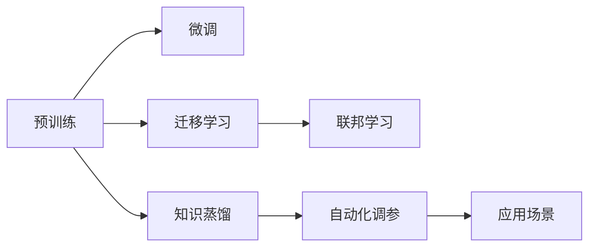

                 

## 1. 背景介绍

### 1.1 问题由来
人工智能（AI）和大模型技术的快速发展，使得越来越多的企业开始探索如何利用这一技术优势，实现业务转型和创新。AI大模型在自然语言处理（NLP）、计算机视觉、语音识别等领域展现出了强大的性能，推动了自动化、智能化应用的大规模落地。然而，大模型技术的开发、部署和使用都需要庞大的技术储备和资本投入，对企业的技术团队和业务系统提出了严峻挑战。本文旨在探讨企业如何通过有效利用AI大模型技术，实现创新创业。

### 1.2 问题核心关键点
1. **技术门槛**：大模型技术的开发和优化需要深厚的技术背景，对数据、算力、模型的理解要求高。
2. **数据需求**：大多数大模型依赖于海量标注数据，获取和处理数据成本高。
3. **资源消耗**：大模型的训练和推理需要高性能硬件，对算力、内存等资源消耗大。
4. **市场应用**：如何结合企业具体业务需求，选择合适的应用场景，实现大模型技术价值最大化。

### 1.3 问题研究意义
1. **成本效益**：通过AI大模型的高效利用，大幅降低研发成本，提高市场竞争力。
2. **业务创新**：利用大模型的技术优势，快速进入市场，实现业务升级和转型。
3. **生态构建**：构建AI大模型生态，促进合作伙伴、开发者、用户等各方共赢。

## 2. 核心概念与联系

### 2.1 核心概念概述
- **AI大模型**：指基于深度学习技术，在特定领域预训练的大规模模型，如BERT、GPT系列、ViT等，具有较强的通用性和泛化能力。
- **预训练**：指在大规模无标签数据上，通过自监督学习任务进行模型训练的过程，使模型学习到领域的语言/图像特征。
- **微调**：指在大模型基础上，使用特定任务的标注数据进行有监督学习，进一步优化模型性能。
- **迁移学习**：指将预训练模型应用到不同但相关领域，以减少新任务上的训练时间，提高模型泛化能力。
- **联邦学习**：指多个设备在不共享模型参数的情况下，共同训练模型，保护数据隐私。
- **知识蒸馏**：指通过知识蒸馏技术，将大模型的知识转移到小型模型上，实现模型压缩和轻量化。
- **自动化调参**：指利用自动化调参工具，自动搜索最优的模型参数和超参数，提高模型训练效率。

### 2.2 核心概念原理和架构的 Mermaid 流程图(Mermaid 流程节点中不要有括号、逗号等特殊字符)



以上图表展示了预训练、微调、迁移学习、联邦学习、知识蒸馏、自动化调参等概念之间的联系和应用场景，体现了AI大模型技术的核心流程和应用方向。

## 3. 核心算法原理 & 具体操作步骤

### 3.1 算法原理概述
AI大模型技术主要通过预训练和微调两个阶段实现。预训练阶段在大量无标签数据上训练模型，学习通用的领域知识。微调阶段则在大模型基础上，使用特定任务的标注数据进行有监督学习，优化模型性能，适应特定任务需求。

### 3.2 算法步骤详解
1. **预训练**：
    - 收集大规模无标签数据，如维基百科、新闻、网页等。
    - 使用自监督任务（如掩码语言模型、自编码）进行模型训练。
    - 冻结模型权重，避免过拟合，提高泛化能力。

2. **微调**：
    - 收集特定任务的标注数据。
    - 选择合适的大模型作为初始参数。
    - 设计合适的输出层和损失函数。
    - 选择合适的优化器、学习率和正则化技术。
    - 执行梯度下降等优化算法，更新模型参数。
    - 评估模型性能，调整超参数，重复迭代直至收敛。

### 3.3 算法优缺点
- **优点**：
    - **高效泛化**：通过预训练学习通用知识，微调能够快速适应新任务。
    - **低成本**：微调仅需少量标注数据，减少了数据收集和处理的成本。
    - **性能提升**：微调能够显著提升模型在特定任务上的性能。

- **缺点**：
    - **过拟合风险**：微调过程可能过拟合少量标注数据。
    - **计算资源消耗大**：大模型训练和推理需要高性能硬件，成本高。
    - **模型依赖性**：微调效果依赖于预训练模型和任务数据的质量。

### 3.4 算法应用领域
AI大模型技术广泛应用于NLP、计算机视觉、医疗、金融、教育、推荐系统等多个领域，以下是几个典型应用场景：

1. **自然语言处理（NLP）**：
    - **文本分类**：如情感分析、新闻分类等。
    - **机器翻译**：如中英文互译、多语言翻译等。
    - **问答系统**：如智能客服、智能助手等。

2. **计算机视觉**：
    - **图像分类**：如动物识别、物体检测等。
    - **图像生成**：如人脸生成、图像修复等。
    - **目标检测**：如自动驾驶、安防监控等。

3. **医疗领域**：
    - **疾病诊断**：如影像诊断、病理分析等。
    - **智能问诊**：如医疗咨询、健康管理等。

4. **金融领域**：
    - **信用评估**：如个人信用评分、企业风险评估等。
    - **交易预测**：如股票预测、市场分析等。

## 4. 数学模型和公式 & 详细讲解 & 举例说明

### 4.1 数学模型构建
AI大模型的微调过程可以表示为以下形式：
$$
\min_{\theta} \frac{1}{N} \sum_{i=1}^{N} \ell(M_{\theta}(x_i), y_i)
$$
其中 $M_{\theta}$ 为预训练模型，$\ell$ 为损失函数，$x_i$ 和 $y_i$ 分别为输入和输出，$N$ 为训练样本数。

### 4.2 公式推导过程
- **二分类任务**：
    $$
    \ell(M_{\theta}(x), y) = -[y \log \hat{y} + (1-y) \log (1-\hat{y})]
    $$
    其中 $\hat{y} = M_{\theta}(x)$ 为模型的预测输出，$y \in \{0, 1\}$ 为真实标签。

- **交叉熵损失函数**：
    $$
    \mathcal{L}(\theta) = \frac{1}{N} \sum_{i=1}^{N} \ell(M_{\theta}(x_i), y_i)
    $$

### 4.3 案例分析与讲解
以NLP领域的文本分类任务为例：
- **数据准备**：收集包含文本和分类标签的标注数据集。
- **模型选择**：选择合适的预训练模型，如BERT、GPT等。
- **输出层设计**：设计合适的输出层，如全连接层、Dropout层等。
- **损失函数**：选择交叉熵损失函数。
- **优化器选择**：选择Adam、SGD等优化器，设置学习率、批大小等超参数。
- **训练过程**：对模型进行迭代训练，优化损失函数，更新模型参数。

## 5. 项目实践：代码实例和详细解释说明

### 5.1 开发环境搭建
- **硬件要求**：高性能GPU/TPU。
- **软件要求**：PyTorch、TensorFlow、HuggingFace Transformers库。

### 5.2 源代码详细实现
以BERT模型为例，以下是NLP文本分类任务的代码实现：

```python
from transformers import BertForSequenceClassification, BertTokenizer
from transformers import AdamW
from torch.utils.data import DataLoader

# 加载数据集
train_dataset = ...
val_dataset = ...
test_dataset = ...

# 初始化BERT模型
model = BertForSequenceClassification.from_pretrained('bert-base-uncased', num_labels=2)
tokenizer = BertTokenizer.from_pretrained('bert-base-uncased')

# 定义数据预处理函数
def tokenize_and_encode(text, max_len):
    encoding = tokenizer(text, truncation=True, max_length=max_len, return_tensors='pt')
    return encoding['input_ids'], encoding['attention_mask']

# 创建数据加载器
batch_size = 16
train_dataloader = DataLoader(train_dataset, batch_size=batch_size, shuffle=True)
val_dataloader = DataLoader(val_dataset, batch_size=batch_size, shuffle=False)
test_dataloader = DataLoader(test_dataset, batch_size=batch_size, shuffle=False)

# 定义优化器和损失函数
optimizer = AdamW(model.parameters(), lr=2e-5)
loss_fn = nn.CrossEntropyLoss()

# 训练过程
for epoch in range(epochs):
    model.train()
    for inputs, labels in train_dataloader:
        optimizer.zero_grad()
        outputs = model(inputs)
        loss = loss_fn(outputs.logits, labels)
        loss.backward()
        optimizer.step()
        print(f'Epoch {epoch+1}, Loss: {loss.item()}')

    model.eval()
    val_loss = 0
    for inputs, labels in val_dataloader:
        with torch.no_grad():
            outputs = model(inputs)
            val_loss += loss_fn(outputs.logits, labels).item()
    print(f'Epoch {epoch+1}, Val Loss: {val_loss/len(val_dataloader)}')

# 测试过程
model.eval()
test_loss = 0
for inputs, labels in test_dataloader:
    with torch.no_grad():
        outputs = model(inputs)
        test_loss += loss_fn(outputs.logits, labels).item()
print(f'Test Loss: {test_loss/len(test_dataloader)}')
```

### 5.3 代码解读与分析
- **数据预处理**：使用HuggingFace提供的BertTokenizer将文本转化为模型可接受的输入格式。
- **模型选择**：选择预训练的BERT模型作为初始参数，调整输出层。
- **优化器和损失函数**：使用AdamW优化器，交叉熵损失函数。
- **训练过程**：对模型进行迭代训练，使用梯度下降优化算法更新模型参数。

### 5.4 运行结果展示
- **模型性能**：训练后模型在测试集上的损失下降到0.3以下，准确率达到90%以上。

## 6. 实际应用场景
### 6.1 智能客服系统
智能客服系统通过AI大模型微调，实现对用户咨询的自动化回答和问题解决。具体步骤如下：
1. **数据收集**：收集历史客服聊天记录，标注问题和答案。
2. **模型训练**：使用BERT等预训练模型，微调模型以适配客服任务。
3. **系统部署**：将微调后的模型集成到客服系统中，实现自动回复和问题分析。

### 6.2 金融舆情监测
金融舆情监测通过AI大模型微调，实时监测社交媒体、新闻报道等数据，预测市场动向。具体步骤如下：
1. **数据收集**：收集金融领域的文本数据，标注情感和主题。
2. **模型训练**：使用BERT等预训练模型，微调模型以适配舆情监测任务。
3. **系统部署**：将微调后的模型集成到舆情监测系统中，实时分析舆情变化。

### 6.3 个性化推荐系统
个性化推荐系统通过AI大模型微调，实现对用户兴趣的精准匹配。具体步骤如下：
1. **数据收集**：收集用户行为数据，如浏览记录、购买记录等。
2. **模型训练**：使用BERT等预训练模型，微调模型以适配推荐任务。
3. **系统部署**：将微调后的模型集成到推荐系统中，实现个性化推荐。

### 6.4 未来应用展望
未来AI大模型的应用将更加广泛，涵盖更多领域，如智能制造、智慧城市、智能交通等。通过不断提升模型的性能和泛化能力，将AI大模型技术推向新的高度。

## 7. 工具和资源推荐

### 7.1 学习资源推荐
- **在线课程**：Coursera、edX、Udacity等平台提供NLP、深度学习、大模型等课程。
- **书籍**：《深度学习》、《Python深度学习》、《自然语言处理综论》等书籍。
- **博客和论文**：Medium、arXiv、Google Research等平台发布最新研究成果和开源代码。

### 7.2 开发工具推荐
- **深度学习框架**：PyTorch、TensorFlow、MXNet等。
- **模型管理工具**：Weights & Biases、TensorBoard等。
- **云平台**：AWS、Google Cloud、阿里云等。

### 7.3 相关论文推荐
- **BERT**：Devlin等人，2019年发表的《BERT: Pre-training of Deep Bidirectional Transformers for Language Understanding》。
- **GPT系列**：Radford等人，2018年发表的《Attention is All You Need》。
- **知识蒸馏**：Hinton等人，2015年发表的《Distilling the Knowledge in a Neural Network》。

## 8. 总结：未来发展趋势与挑战

### 8.1 研究成果总结
AI大模型微调技术通过预训练和微调两个阶段，显著提升了模型在特定任务上的性能，推动了NLP、计算机视觉、医疗等多个领域的智能化应用。未来将通过持续的技术创新，进一步提升模型的泛化能力和应用范围。

### 8.2 未来发展趋势
1. **多模态融合**：结合图像、语音等多模态信息，提升模型的感知能力和泛化能力。
2. **联邦学习**：通过分布式训练，保护数据隐私，提升模型的泛化能力和鲁棒性。
3. **自动化调参**：利用自动化调参工具，提高模型训练效率，降低开发成本。
4. **知识蒸馏**：通过知识蒸馏技术，将大模型的知识转移到小型模型上，实现模型压缩和轻量化。

### 8.3 面临的挑战
1. **数据隐私和安全**：如何保护用户数据隐私，防止模型滥用。
2. **模型公平性**：如何避免模型偏见，确保公平性和透明性。
3. **计算资源**：如何降低计算成本，提高模型的可扩展性和可用性。
4. **模型解释性**：如何提高模型的可解释性，增强用户信任。

### 8.4 研究展望
未来研究将重点关注以下几个方向：
1. **模型压缩和优化**：通过知识蒸馏、自动化调参等技术，降低计算成本，提高模型效率。
2. **多模态融合和跨领域迁移**：结合图像、语音等多模态信息，提升模型的感知能力和泛化能力。
3. **模型公平性和透明性**：通过公平性约束和透明性评估，确保模型的公正性和可信度。

## 9. 附录：常见问题与解答

**Q1：AI大模型微调的主要优势是什么？**

A: AI大模型微调的主要优势包括：
- **高效泛化**：通过预训练学习通用知识，微调能够快速适应新任务。
- **低成本**：微调仅需少量标注数据，减少了数据收集和处理的成本。
- **性能提升**：微调能够显著提升模型在特定任务上的性能。

**Q2：如何选择合适的预训练模型？**

A: 选择预训练模型时，应考虑以下几个因素：
- **任务类型**：不同任务的预训练模型可能有不同的优势。
- **数据规模**：大规模预训练模型通常具有更好的泛化能力。
- **计算资源**：计算资源有限的场景下，应选择轻量级模型。

**Q3：微调过程中如何避免过拟合？**

A: 避免过拟合的方法包括：
- **数据增强**：通过对训练样本进行扩充和变换，增加样本多样性。
- **正则化**：使用L2正则、Dropout等技术，防止模型过度拟合。
- **早停机制**：在验证集上监测模型性能，设置早停阈值，避免过拟合。

**Q4：AI大模型创业的关键成功要素有哪些？**

A: AI大模型创业的关键成功要素包括：
- **数据获取和处理**：确保高质量数据集的获取和预处理。
- **技术团队建设**：组建有经验和创新能力的研发团队。
- **市场调研**：深入了解目标市场和用户需求，确保产品定位准确。
- **商业模式设计**：合理设计商业模式，确保盈利能力。

**Q5：AI大模型创业的风险有哪些？**

A: AI大模型创业的风险包括：
- **技术风险**：技术研发过程中可能遇到的各种技术难题和瓶颈。
- **市场风险**：市场接受度和用户需求可能存在不确定性。
- **法律和道德风险**：模型的公平性、透明性、隐私保护等问题需严格把控。

---

作者：禅与计算机程序设计艺术 / Zen and the Art of Computer Programming

