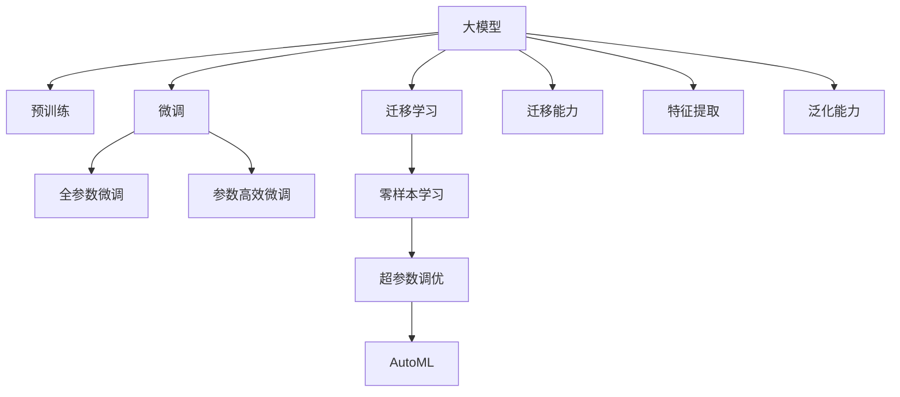

                 

# AI 大模型创业：如何利用竞争优势？

## 1. 背景介绍

在人工智能(AI)领域，大模型近年来成为了热点，以OpenAI的GPT系列、Google的BERT等为代表的预训练模型，在自然语言处理(NLP)、计算机视觉(CV)、语音识别(SR)等领域取得了突破性进展。大模型的竞争力主要来自于其庞大的参数规模和丰富的知识储备，能够对大规模数据进行深度学习，从而在特定任务上表现出优异的表现。

在大模型创业的浪潮中，如何利用这些竞争优势，打造具有市场竞争力的AI产品，成为当前企业关注的焦点。本文将从大模型的原理、算法步骤、实际应用场景以及未来发展趋势等方面，探讨大模型创业的竞争策略。

## 2. 核心概念与联系

### 2.1 核心概念概述

为了更好地理解大模型创业的竞争优势，本节将介绍几个关键概念及其之间的关系。

- 大模型(Large Model)：指拥有大规模参数的预训练模型，如GPT-3、BERT等。这些模型通常包含数十亿个参数，能够对大量数据进行深度学习，具备强大的特征提取和生成能力。

- 预训练(Pre-training)：指在大规模无标签数据上，通过自监督学习任务训练大模型的过程。常见的预训练任务包括掩码语言模型、自回归语言模型等，使得模型具备泛化能力强、特征提取性能优异的特点。

- 迁移学习(Transfer Learning)：指将在大规模数据上预训练得到的知识，应用到小规模数据上特定的下游任务中，提升模型在特定任务上的表现。大模型通常在迁移学习中扮演着重要的角色。

- 微调(Fine-tuning)：指在预训练模型的基础上，使用下游任务的少量标注数据，通过有监督学习优化模型在该任务上的性能。微调可以进一步提升大模型在特定任务上的精度。

- 零样本学习(Zero-shot Learning)：指模型在没有看到特定任务的训练样本情况下，仅通过任务描述就能够执行新任务的能力。大模型的泛化能力使其能够在多种任务中实现零样本学习。

- 超参数调优(Hyperparameter Tuning)：指在训练模型之前，根据经验或实验结果，调整模型训练的超参数，以优化模型性能。在大模型训练中，超参数调优是提升模型效果的重要手段。

- 自动机器学习(AutoML)：指通过自动化手段进行模型和超参数的调优，减少人工干预，提高模型开发的效率和效果。在大模型应用中，AutoML成为一种高效的工具。

这些概念之间的逻辑关系可以通过以下Mermaid流程图来展示：



这个流程图展示了大模型的核心概念及其之间的关系：

1. 大模型通过预训练获得基础能力。
2. 微调在大模型的基础上，进一步优化模型在特定任务上的性能。
3. 迁移学习利用大模型的泛化能力，适应不同的任务场景。
4. 超参数调优和AutoML技术进一步提升模型效果。
5. 零样本学习使大模型能够在没有训练样本的情况下执行新任务。

## 3. 核心算法原理 & 具体操作步骤

### 3.1 算法原理概述

在大模型创业中，利用竞争优势的关键在于如何设计高效的模型架构，选择恰当的算法和优化策略，并在特定任务上进行微调。

大模型创业的核心算法原理包括以下几个方面：

1. **模型选择**：选择适合业务的预训练大模型，如BERT、GPT-3、T5等。不同模型具备不同的特征提取能力和生成能力。

2. **迁移学习**：在大模型基础上进行迁移学习，将预训练得到的知识应用于特定的下游任务中。通常使用微调方法，通过标注数据训练，提升模型在特定任务上的表现。

3. **微调策略**：选择合适的微调策略，如全参数微调、参数高效微调等，避免过拟合，同时利用预训练模型的优势。

4. **超参数调优**：通过超参数调优技术，寻找最优的超参数组合，进一步提升模型性能。

5. **AutoML技术**：利用AutoML技术进行模型和超参数的自动化调优，提高模型开发的效率和效果。

6. **零样本学习**：在模型训练过程中，引入零样本学习的方法，提升模型对新任务的适应能力。

### 3.2 算法步骤详解

在大模型创业中，算法步骤主要包括以下几个方面：

**Step 1: 数据准备**
- 收集和预处理标注数据，确保数据集的多样性和质量。
- 根据具体任务，选择合适的数据增强方法，如文本替换、回译等。
- 将数据集划分为训练集、验证集和测试集。

**Step 2: 模型选择**
- 选择合适的预训练模型，如BERT、GPT-3、T5等，作为初始化参数。
- 根据任务类型，确定是否冻结预训练模型的某些层，以减少微调参数。

**Step 3: 迁移学习**
- 在预训练模型的基础上，添加任务适配层，如线性分类器、解码器等。
- 定义任务损失函数，如交叉熵损失、均方误差损失等。
- 设置微调超参数，如学习率、批大小、迭代轮数等。

**Step 4: 微调过程**
- 使用训练集数据，进行前向传播和反向传播，计算损失函数。
- 根据损失函数，更新模型参数，优化模型性能。
- 在验证集上评估模型性能，设置Early Stopping。
- 在测试集上评估最终模型性能。

**Step 5: 应用部署**
- 将微调后的模型部署到实际应用系统中。
- 持续收集新数据，定期重新微调模型，保持模型的时效性。

### 3.3 算法优缺点

大模型创业中，利用竞争优势的算法主要具有以下优点：

1. **高效性**：大模型具备高效的特征提取和生成能力，能够在较短的时间内完成模型训练。
2. **泛化能力**：大模型经过大规模预训练，具备较强的泛化能力，能够在各种场景中表现出色。
3. **可扩展性**：大模型可以轻松扩展到不同的任务，通过微调进行任务适配。
4. **适应性**：大模型能够适应不同的数据分布，具有较强的鲁棒性。
5. **可解释性**：大模型的参数和结构相对简单，容易进行解释和调试。

同时，也存在一些缺点：

1. **高昂成本**：大模型需要大量的计算资源和标注数据，成本较高。
2. **依赖数据**：模型的性能依赖于数据的质量和数量，获取高质量数据较为困难。
3. **隐私风险**：大模型需要大量数据进行训练，存在数据隐私和安全风险。
4. **复杂性**：大模型的设计和实现较为复杂，需要具备一定的技术储备。

### 3.4 算法应用领域

大模型创业的应用领域非常广泛，以下是几个典型的应用场景：

- **自然语言处理(NLP)**：利用大模型进行文本分类、命名实体识别、机器翻译、问答系统等任务。
- **计算机视觉(CV)**：利用大模型进行图像分类、目标检测、图像生成等任务。
- **语音识别(SR)**：利用大模型进行语音识别、情感分析、自动字幕生成等任务。
- **推荐系统**：利用大模型进行商品推荐、新闻推荐等任务。
- **金融风控**：利用大模型进行信用评估、欺诈检测、舆情分析等任务。

## 4. 数学模型和公式 & 详细讲解 & 举例说明

### 4.1 数学模型构建

在大模型创业中，数学模型构建主要包括以下几个方面：

1. **损失函数**：定义适合任务的损失函数，如交叉熵损失、均方误差损失等。
2. **模型参数更新**：定义模型参数的更新公式，如梯度下降、Adam等优化算法。
3. **超参数调优**：定义超参数的搜索范围和调优方法，如网格搜索、随机搜索等。
4. **AutoML**：定义AutoML的自动化调优流程，如模型选择、超参数搜索、性能评估等。

**案例分析与讲解**：

假设任务是文本分类，使用BERT模型进行微调。定义模型为：

$$
M_{\theta}(x) = \text{BERT}(x;\theta)
$$

其中 $x$ 表示输入文本，$\theta$ 表示模型参数。

任务损失函数为：

$$
\ell(M_{\theta}(x),y) = -y\log M_{\theta}(x) + (1-y)\log(1-M_{\theta}(x))
$$

定义模型参数的更新公式为：

$$
\theta \leftarrow \theta - \eta \nabla_{\theta}\mathcal{L}(\theta) - \eta\lambda\theta
$$

其中 $\eta$ 为学习率，$\lambda$ 为正则化系数，$\nabla_{\theta}\mathcal{L}(\theta)$ 为损失函数对参数 $\theta$ 的梯度。

### 4.2 公式推导过程

以文本分类任务为例，推导模型参数的更新公式：

假设模型 $M_{\theta}$ 在输入 $x$ 上的输出为 $\hat{y}=M_{\theta}(x) \in [0,1]$，表示样本属于正类的概率。真实标签 $y \in \{0,1\}$。

二分类交叉熵损失函数定义为：

$$
\ell(M_{\theta}(x),y) = -[y\log \hat{y} + (1-y)\log (1-\hat{y})]
$$

损失函数对参数 $\theta$ 的梯度为：

$$
\frac{\partial \mathcal{L}(\theta)}{\partial \theta_k} = -\frac{\partial}{\partial \theta_k} \left[\sum_{i=1}^N \ell(M_{\theta}(x_i),y_i) \right]
$$

其中 $N$ 为样本数量。

### 4.3 案例分析与讲解

假设使用BERT模型进行微调，将模型表示为：

$$
M_{\theta}(x) = \text{BERT}(x;\theta)
$$

其中 $\theta$ 为BERT模型参数。

定义任务损失函数为交叉熵损失：

$$
\mathcal{L}(\theta) = -\frac{1}{N}\sum_{i=1}^N \ell(M_{\theta}(x_i),y_i)
$$

使用梯度下降算法进行模型训练，更新参数：

$$
\theta \leftarrow \theta - \eta \nabla_{\theta}\mathcal{L}(\theta) - \eta\lambda\theta
$$

其中 $\eta$ 为学习率，$\lambda$ 为正则化系数。

## 5. 项目实践：代码实例和详细解释说明

### 5.1 开发环境搭建

在进行大模型创业时，需要准备好开发环境。以下是使用Python进行PyTorch开发的环境配置流程：

1. 安装Anaconda：从官网下载并安装Anaconda，用于创建独立的Python环境。

2. 创建并激活虚拟环境：
```bash
conda create -n pytorch-env python=3.8 
conda activate pytorch-env
```

3. 安装PyTorch：根据CUDA版本，从官网获取对应的安装命令。例如：
```bash
conda install pytorch torchvision torchaudio cudatoolkit=11.1 -c pytorch -c conda-forge
```

4. 安装Transformers库：
```bash
pip install transformers
```

5. 安装各类工具包：
```bash
pip install numpy pandas scikit-learn matplotlib tqdm jupyter notebook ipython
```

完成上述步骤后，即可在`pytorch-env`环境中开始大模型创业实践。

### 5.2 源代码详细实现

这里以BERT模型进行文本分类任务为例，给出使用Transformers库进行大模型创业的PyTorch代码实现。

首先，定义数据处理函数：

```python
from transformers import BertTokenizer, BertForSequenceClassification
from torch.utils.data import Dataset
import torch

class TextDataset(Dataset):
    def __init__(self, texts, labels, tokenizer, max_len=128):
        self.texts = texts
        self.labels = labels
        self.tokenizer = tokenizer
        self.max_len = max_len
        
    def __len__(self):
        return len(self.texts)
    
    def __getitem__(self, item):
        text = self.texts[item]
        label = self.labels[item]
        
        encoding = self.tokenizer(text, return_tensors='pt', max_length=self.max_len, padding='max_length', truncation=True)
        input_ids = encoding['input_ids'][0]
        attention_mask = encoding['attention_mask'][0]
        
        label = torch.tensor(label, dtype=torch.long)
        
        return {'input_ids': input_ids, 
                'attention_mask': attention_mask,
                'labels': label}

# 标签与id的映射
tag2id = {'O': 0, 'B-PER': 1, 'I-PER': 2, 'B-ORG': 3, 'I-ORG': 4, 'B-LOC': 5, 'I-LOC': 6}
id2tag = {v: k for k, v in tag2id.items()}

# 创建dataset
tokenizer = BertTokenizer.from_pretrained('bert-base-cased')

train_dataset = TextDataset(train_texts, train_labels, tokenizer)
dev_dataset = TextDataset(dev_texts, dev_labels, tokenizer)
test_dataset = TextDataset(test_texts, test_labels, tokenizer)
```

然后，定义模型和优化器：

```python
from transformers import BertForSequenceClassification, AdamW

model = BertForSequenceClassification.from_pretrained('bert-base-cased', num_labels=len(tag2id))

optimizer = AdamW(model.parameters(), lr=2e-5)
```

接着，定义训练和评估函数：

```python
from torch.utils.data import DataLoader
from tqdm import tqdm
from sklearn.metrics import classification_report

device = torch.device('cuda') if torch.cuda.is_available() else torch.device('cpu')
model.to(device)

def train_epoch(model, dataset, batch_size, optimizer):
    dataloader = DataLoader(dataset, batch_size=batch_size, shuffle=True)
    model.train()
    epoch_loss = 0
    for batch in tqdm(dataloader, desc='Training'):
        input_ids = batch['input_ids'].to(device)
        attention_mask = batch['attention_mask'].to(device)
        labels = batch['labels'].to(device)
        model.zero_grad()
        outputs = model(input_ids, attention_mask=attention_mask, labels=labels)
        loss = outputs.loss
        epoch_loss += loss.item()
        loss.backward()
        optimizer.step()
    return epoch_loss / len(dataloader)

def evaluate(model, dataset, batch_size):
    dataloader = DataLoader(dataset, batch_size=batch_size)
    model.eval()
    preds, labels = [], []
    with torch.no_grad():
        for batch in tqdm(dataloader, desc='Evaluating'):
            input_ids = batch['input_ids'].to(device)
            attention_mask = batch['attention_mask'].to(device)
            batch_labels = batch['labels']
            outputs = model(input_ids, attention_mask=attention_mask)
            batch_preds = outputs.logits.argmax(dim=2).to('cpu').tolist()
            batch_labels = batch_labels.to('cpu').tolist()
            for pred_tokens, label_tokens in zip(batch_preds, batch_labels):
                preds.append(pred_tokens)
                labels.append(label_tokens)
                
    print(classification_report(labels, preds))
```

最后，启动训练流程并在测试集上评估：

```python
epochs = 5
batch_size = 16

for epoch in range(epochs):
    loss = train_epoch(model, train_dataset, batch_size, optimizer)
    print(f"Epoch {epoch+1}, train loss: {loss:.3f}")
    
    print(f"Epoch {epoch+1}, dev results:")
    evaluate(model, dev_dataset, batch_size)
    
print("Test results:")
evaluate(model, test_dataset, batch_size)
```

以上就是使用PyTorch对BERT进行文本分类任务微调的大模型创业实践。可以看到，借助Transformers库的封装，大模型的微调过程变得简单高效。

### 5.3 代码解读与分析

让我们再详细解读一下关键代码的实现细节：

**TextDataset类**：
- `__init__`方法：初始化文本、标签、分词器等关键组件。
- `__len__`方法：返回数据集的样本数量。
- `__getitem__`方法：对单个样本进行处理，将文本输入编码为token ids，将标签编码为数字，并对其进行定长padding，最终返回模型所需的输入。

**tag2id和id2tag字典**：
- 定义了标签与数字id之间的映射关系，用于将token-wise的预测结果解码回真实的标签。

**训练和评估函数**：
- 使用PyTorch的DataLoader对数据集进行批次化加载，供模型训练和推理使用。
- 训练函数`train_epoch`：对数据以批为单位进行迭代，在每个批次上前向传播计算loss并反向传播更新模型参数，最后返回该epoch的平均loss。
- 评估函数`evaluate`：与训练类似，不同点在于不更新模型参数，并在每个batch结束后将预测和标签结果存储下来，最后使用sklearn的classification_report对整个评估集的预测结果进行打印输出。

**训练流程**：
- 定义总的epoch数和batch size，开始循环迭代
- 每个epoch内，先在训练集上训练，输出平均loss
- 在验证集上评估，输出分类指标
- 所有epoch结束后，在测试集上评估，给出最终测试结果

可以看到，PyTorch配合Transformers库使得BERT微调的代码实现变得简洁高效。开发者可以将更多精力放在数据处理、模型改进等高层逻辑上，而不必过多关注底层的实现细节。

当然，工业级的系统实现还需考虑更多因素，如模型的保存和部署、超参数的自动搜索、更灵活的任务适配层等。但核心的微调范式基本与此类似。

## 6. 实际应用场景

### 6.1 智能客服系统

大模型的微调技术可以广泛应用于智能客服系统的构建。传统客服往往需要配备大量人力，高峰期响应缓慢，且一致性和专业性难以保证。而使用微调后的对话模型，可以7x24小时不间断服务，快速响应客户咨询，用自然流畅的语言解答各类常见问题。

在技术实现上，可以收集企业内部的历史客服对话记录，将问题和最佳答复构建成监督数据，在此基础上对预训练对话模型进行微调。微调后的对话模型能够自动理解用户意图，匹配最合适的答案模板进行回复。对于客户提出的新问题，还可以接入检索系统实时搜索相关内容，动态组织生成回答。如此构建的智能客服系统，能大幅提升客户咨询体验和问题解决效率。

### 6.2 金融舆情监测

金融机构需要实时监测市场舆论动向，以便及时应对负面信息传播，规避金融风险。传统的人工监测方式成本高、效率低，难以应对网络时代海量信息爆发的挑战。基于大语言模型微调的文本分类和情感分析技术，为金融舆情监测提供了新的解决方案。

具体而言，可以收集金融领域相关的新闻、报道、评论等文本数据，并对其进行主题标注和情感标注。在此基础上对预训练语言模型进行微调，使其能够自动判断文本属于何种主题，情感倾向是正面、中性还是负面。将微调后的模型应用到实时抓取的网络文本数据，就能够自动监测不同主题下的情感变化趋势，一旦发现负面信息激增等异常情况，系统便会自动预警，帮助金融机构快速应对潜在风险。

### 6.3 个性化推荐系统

当前的推荐系统往往只依赖用户的历史行为数据进行物品推荐，无法深入理解用户的真实兴趣偏好。基于大语言模型微调技术，个性化推荐系统可以更好地挖掘用户行为背后的语义信息，从而提供更精准、多样的推荐内容。

在实践中，可以收集用户浏览、点击、评论、分享等行为数据，提取和用户交互的物品标题、描述、标签等文本内容。将文本内容作为模型输入，用户的后续行为（如是否点击、购买等）作为监督信号，在此基础上微调预训练语言模型。微调后的模型能够从文本内容中准确把握用户的兴趣点。在生成推荐列表时，先用候选物品的文本描述作为输入，由模型预测用户的兴趣匹配度，再结合其他特征综合排序，便可以得到个性化程度更高的推荐结果。

### 6.4 未来应用展望

随着大语言模型微调技术的发展，未来在更多领域将得到应用，为传统行业带来变革性影响。

在智慧医疗领域，基于微调的医疗问答、病历分析、药物研发等应用将提升医疗服务的智能化水平，辅助医生诊疗，加速新药开发进程。

在智能教育领域，微调技术可应用于作业批改、学情分析、知识推荐等方面，因材施教，促进教育公平，提高教学质量。

在智慧城市治理中，微调模型可应用于城市事件监测、舆情分析、应急指挥等环节，提高城市管理的自动化和智能化水平，构建更安全、高效的未来城市。

此外，在企业生产、社会治理、文娱传媒等众多领域，基于大模型微调的人工智能应用也将不断涌现，为经济社会发展注入新的动力。相信随着技术的日益成熟，微调方法将成为人工智能落地应用的重要范式，推动人工智能技术在各个行业的应用。

## 7. 工具和资源推荐

### 7.1 学习资源推荐

为了帮助开发者系统掌握大模型创业的原理和实践，这里推荐一些优质的学习资源：

1. 《Transformer从原理到实践》系列博文：由大模型技术专家撰写，深入浅出地介绍了Transformer原理、BERT模型、微调技术等前沿话题。

2. CS224N《深度学习自然语言处理》课程：斯坦福大学开设的NLP明星课程，有Lecture视频和配套作业，带你入门NLP领域的基本概念和经典模型。

3. 《Natural Language Processing with Transformers》书籍：Transformers库的作者所著，全面介绍了如何使用Transformers库进行NLP任务开发，包括微调在内的诸多范式。

4. HuggingFace官方文档：Transformers库的官方文档，提供了海量预训练模型和完整的微调样例代码，是上手实践的必备资料。

5. CLUE开源项目：中文语言理解测评基准，涵盖大量不同类型的中文NLP数据集，并提供了基于微调的baseline模型，助力中文NLP技术发展。

通过对这些资源的学习实践，相信你一定能够快速掌握大模型创业的精髓，并用于解决实际的AI问题。

### 7.2 开发工具推荐

高效的开发离不开优秀的工具支持。以下是几款用于大模型创业开发的常用工具：

1. PyTorch：基于Python的开源深度学习框架，灵活动态的计算图，适合快速迭代研究。大部分预训练语言模型都有PyTorch版本的实现。

2. TensorFlow：由Google主导开发的开源深度学习框架，生产部署方便，适合大规模工程应用。同样有丰富的预训练语言模型资源。

3. Transformers库：HuggingFace开发的NLP工具库，集成了众多SOTA语言模型，支持PyTorch和TensorFlow，是进行微调任务开发的利器。

4. Weights & Biases：模型训练的实验跟踪工具，可以记录和可视化模型训练过程中的各项指标，方便对比和调优。与主流深度学习框架无缝集成。

5. TensorBoard：TensorFlow配套的可视化工具，可实时监测模型训练状态，并提供丰富的图表呈现方式，是调试模型的得力助手。

6. Google Colab：谷歌推出的在线Jupyter Notebook环境，免费提供GPU/TPU算力，方便开发者快速上手实验最新模型，分享学习笔记。

合理利用这些工具，可以显著提升大模型创业的开发效率，加快创新迭代的步伐。

### 7.3 相关论文推荐

大模型创业的研究源于学界的持续研究。以下是几篇奠基性的相关论文，推荐阅读：

1. Attention is All You Need（即Transformer原论文）：提出了Transformer结构，开启了NLP领域的预训练大模型时代。

2. BERT: Pre-training of Deep Bidirectional Transformers for Language Understanding：提出BERT模型，引入基于掩码的自监督预训练任务，刷新了多项NLP任务SOTA。

3. Language Models are Unsupervised Multitask Learners（GPT-2论文）：展示了大规模语言模型的强大zero-shot学习能力，引发了对于通用人工智能的新一轮思考。

4. Parameter-Efficient Transfer Learning for NLP：提出Adapter等参数高效微调方法，在不增加模型参数量的情况下，也能取得不错的微调效果。

5. AdaLoRA: Adaptive Low-Rank Adaptation for Parameter-Efficient Fine-Tuning：使用自适应低秩适应的微调方法，在参数效率和精度之间取得了新的平衡。

这些论文代表了大模型创业技术的发展脉络。通过学习这些前沿成果，可以帮助研究者把握学科前进方向，激发更多的创新灵感。

## 8. 总结：未来发展趋势与挑战

### 8.1 总结

本文对大模型创业的原理、算法步骤、实际应用场景以及未来发展趋势等方面进行了全面系统的介绍。首先阐述了大模型创业的优势，明确了利用大模型在NLP任务中的强大泛化能力、特征提取能力等竞争优势。其次，从模型选择、迁移学习、微调策略、超参数调优等多个维度，详细讲解了大模型创业的算法步骤。同时，探讨了微调技术在大模型创业中的广泛应用场景，展示了微调范式的巨大潜力。最后，通过分析未来发展趋势和面临的挑战，提出了大模型创业的未来展望。

通过本文的系统梳理，可以看到，大模型创业正成为AI领域的重要趋势，利用大模型的强大能力，可以构建高效、智能、普适的AI系统，提升各行各业的智能化水平。

### 8.2 未来发展趋势

展望未来，大模型创业将呈现以下几个发展趋势：

1. **模型规模持续增大**：随着算力成本的下降和数据规模的扩张，预训练语言模型的参数量还将持续增长。超大规模语言模型蕴含的丰富语言知识，有望支撑更加复杂多变的下游任务微调。

2. **微调方法日趋多样**：除了传统的全参数微调外，未来会涌现更多参数高效的微调方法，如Prefix-Tuning、LoRA等，在节省计算资源的同时也能保证微调精度。

3. **持续学习成为常态**：随着数据分布的不断变化，微调模型也需要持续学习新知识以保持性能。如何在不遗忘原有知识的同时，高效吸收新样本信息，将成为重要的研究课题。

4. **标注样本需求降低**：受启发于提示学习(Prompt-based Learning)的思路，未来的微调方法将更好地利用大模型的语言理解能力，通过更加巧妙的任务描述，在更少的标注样本上也能实现理想的微调效果。

5. **多模态微调崛起**：当前的微调主要聚焦于纯文本数据，未来会进一步拓展到图像、视频、语音等多模态数据微调。多模态信息的融合，将显著提升语言模型对现实世界的理解和建模能力。

6. **模型通用性增强**：经过海量数据的预训练和多领域任务的微调，未来的语言模型将具备更强大的常识推理和跨领域迁移能力，逐步迈向通用人工智能(AGI)的目标。

以上趋势凸显了大模型创业技术的广阔前景。这些方向的探索发展，必将进一步提升AI系统的性能和应用范围，为各行各业带来深远影响。

### 8.3 面临的挑战

尽管大模型创业技术已经取得了瞩目成就，但在迈向更加智能化、普适化应用的过程中，它仍面临着诸多挑战：

1. **高昂成本**：大模型需要大量的计算资源和标注数据，成本较高。如何降低成本，提高资源利用率，是未来需要解决的重要问题。

2. **数据隐私和安全**：大模型需要大量数据进行训练，存在数据隐私和安全风险。如何在数据收集和存储过程中保护用户隐私，防止数据泄露，是必须重视的问题。

3. **算法复杂性和可解释性**：大模型结构复杂，难以解释其内部工作机制和决策逻辑。如何赋予模型更强的可解释性，确保其决策透明和可控，是重要的研究课题。

4. **模型鲁棒性和泛化能力**：模型面对域外数据时，泛化性能往往大打折扣。如何提高模型的鲁棒性，避免灾难性遗忘，还需要更多理论和实践的积累。

5. **高效推理和部署**：大规模语言模型虽然精度高，但在实际部署时往往面临推理速度慢、内存占用大等效率问题。如何提高模型推理效率，优化资源占用，是重要的优化方向。

6. **算法公平性和道德问题**：预训练模型难免会学习到有偏见、有害的信息，通过微调传递到下游任务，产生误导性、歧视性的输出，给实际应用带来安全隐患。如何消除模型偏见，避免恶意用途，确保输出符合人类价值观和伦理道德，是重要的研究方向。

### 8.4 研究展望

面对大模型创业所面临的种种挑战，未来的研究需要在以下几个方面寻求新的突破：

1. **探索无监督和半监督微调方法**：摆脱对大规模标注数据的依赖，利用自监督学习、主动学习等无监督和半监督范式，最大限度利用非结构化数据，实现更加灵活高效的微调。

2. **研究参数高效和计算高效的微调范式**：开发更加参数高效的微调方法，在固定大部分预训练参数的同时，只更新极少量的任务相关参数。同时优化微调模型的计算图，减少前向传播和反向传播的资源消耗，实现更加轻量级、实时性的部署。

3. **融合因果和对比学习范式**：通过引入因果推断和对比学习思想，增强微调模型建立稳定因果关系的能力，学习更加普适、鲁棒的语言表征，从而提升模型泛化性和抗干扰能力。

4. **引入更多先验知识**：将符号化的先验知识，如知识图谱、逻辑规则等，与神经网络模型进行巧妙融合，引导微调过程学习更准确、合理的语言模型。同时加强不同模态数据的整合，实现视觉、语音等多模态信息与文本信息的协同建模。

5. **结合因果分析和博弈论工具**：将因果分析方法引入微调模型，识别出模型决策的关键特征，增强输出解释的因果性和逻辑性。借助博弈论工具刻画人机交互过程，主动探索并规避模型的脆弱点，提高系统稳定性。

6. **纳入伦理道德约束**：在模型训练目标中引入伦理导向的评估指标，过滤和惩罚有偏见、有害的输出倾向。同时加强人工干预和审核，建立模型行为的监管机制，确保输出符合人类价值观和伦理道德。

这些研究方向的探索，必将引领大模型创业技术迈向更高的台阶，为构建安全、可靠、可解释、可控的智能系统铺平道路。面向未来，大模型创业技术还需要与其他人工智能技术进行更深入的融合，如知识表示、因果推理、强化学习等，多路径协同发力，共同推动自然语言理解和智能交互系统的进步。只有勇于创新、敢于突破，才能不断拓展语言模型的边界，让智能技术更好地造福人类社会。

## 9. 附录：常见问题与解答

**Q1：大模型创业的优势有哪些？**

A: 大模型创业的优势主要体现在以下几个方面：

1. **泛化能力**：大模型具备强大的泛化能力，能够在不同的任务和数据分布上表现出色。

2. **特征提取能力**：大模型能够从大规模数据中学习到丰富的特征表示，提升下游任务的精度。

3. **可扩展性**：大模型可以轻松扩展到不同的任务，通过微调进行任务适配，提升模型的应用范围。

4. **算法高效**：大模型通常使用高效的算法进行训练和推理，能够快速实现模型效果。

**Q2：大模型创业需要考虑哪些成本？**

A: 大模型创业需要考虑以下成本：

1. **计算成本**：大模型需要大量的计算资源进行训练和推理，成本较高。

2. **数据成本**：大模型需要大量的标注数据进行微调，成本较高。

3. **硬件成本**：大模型通常需要高性能的硬件设备，如GPU、TPU等，成本较高。

4. **人力成本**：大模型的开发、维护和优化需要大量的人力投入，成本较高。

**Q3：如何降低大模型创业的标注成本？**

A: 降低大模型创业的标注成本可以从以下几个方面入手：

1. **数据增强**：通过数据增强技术，利用少量的标注数据生成更多的训练数据。

2. **半监督学习**：利用半监督学习方法，结合少量标注数据和大量未标注数据进行训练。

3. **无监督学习**：利用无监督学习方法，通过自监督任务进行预训练，减少对标注数据的依赖。

4. **零样本学习**：利用大模型的泛化能力，通过任务描述进行零样本学习，减少标注数据的需求。

**Q4：大模型创业如何保证数据隐私和安全？**

A: 大模型创业保证数据隐私和安全可以采取以下措施：

1. **数据匿名化**：在数据收集和处理过程中，对敏感信息进行匿名化处理，保护用户隐私。

2. **数据加密**：在数据传输和存储过程中，对数据进行加密处理，防止数据泄露。

3. **访问控制**：通过严格的访问控制机制，确保只有授权人员能够访问和操作数据。

4. **审计和监控**：建立数据访问和使用审计机制，对数据使用情况进行监控，及时发现和处理异常情况。

**Q5：如何提高大模型的推理效率？**

A: 提高大模型的推理效率可以从以下几个方面入手：

1. **模型压缩**：通过模型压缩技术，减小模型参数量和计算量，提高推理效率。

2. **量化加速**：将浮点模型转为定点模型，压缩存储空间，提高计算效率。

3. **模型并行**：通过模型并行技术，将大模型拆分成多个子模型，并行计算，提高推理效率。

4. **推理优化**：优化推理算法，减少推理过程中的计算和内存消耗，提高效率。

**Q6：大模型创业如何提高模型的鲁棒性和泛化能力？**

A: 提高大模型创业的模型的鲁棒性和泛化能力可以从以下几个方面入手：

1. **数据增强**：通过数据增强技术，扩充训练集的多样性，提高模型的泛化能力。

2. **正则化技术**：利用正则化技术，如L2正则、Dropout等，防止模型过拟合，提高鲁棒性。

3. **对抗训练**：引入对抗样本，提高模型对噪声和攻击的鲁棒性。

4. **迁移学习**：通过迁移学习，将大模型在不同任务和数据分布上的知识进行迁移，提高泛化能力。

**Q7：大模型创业如何保证模型的公平性和道德问题？**

A: 大模型创业保证模型的公平性和道德问题可以从以下几个方面入手：

1. **公平性评估**：建立公平性评估指标，对模型输出进行公平性检测，确保模型不会产生偏见。

2. **模型解释**：对模型的决策过程进行解释，确保模型的决策透明和可控。

3. **伦理约束**：在模型训练目标中引入伦理导向的评估指标，过滤和惩罚有偏见、有害的输出倾向。

4. **人工审核**：建立人工审核机制，对模型的输出进行审核，确保输出符合人类价值观和伦理道德。

---

作者：禅与计算机程序设计艺术 / Zen and the Art of Computer Programming

