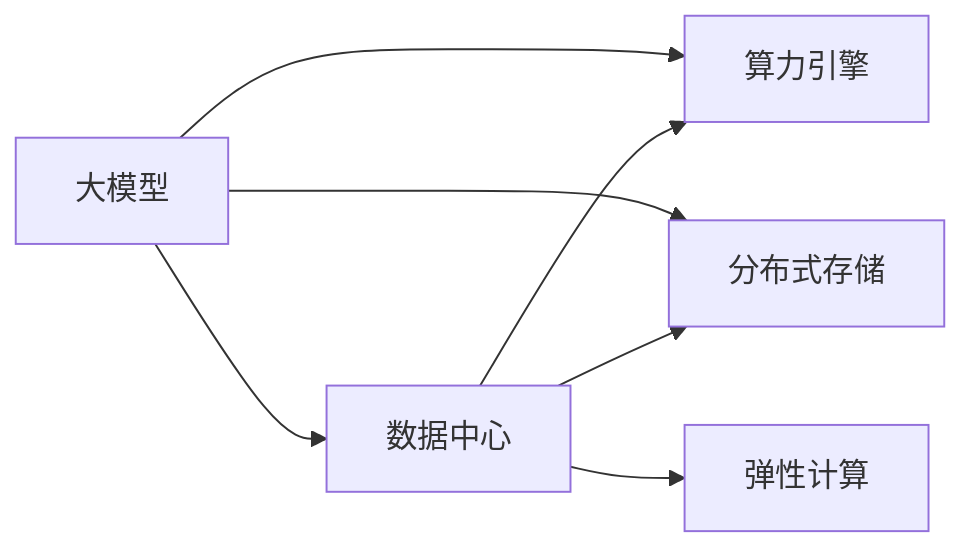

                 

# AI 大模型应用数据中心建设：打造算力引擎，驱动AI创新

## 1. 背景介绍

### 1.1 问题由来

在过去几年中，人工智能(AI)技术的迅猛发展极大地改变了各行业的运营模式。AI大模型如GPT、BERT等在自然语言处理、计算机视觉、语音识别等领域取得了突破性进展。但这些模型的训练和部署对计算资源有着极高的需求，使得数据中心建设成为AI应用落地的重要瓶颈。

1. 模型训练：大模型训练所需的数据量通常以TB级别计，需要大量的GPU/TPU资源。
2. 模型部署：即便训练完毕，大模型的推理也需要高性能的硬件支持，才能达到实时响应。
3. 数据处理：处理海量数据进行特征工程、预处理、存储也需要强大的计算能力。

这些问题催生了对高效、可扩展、低成本的数据中心建设需求。本文将探讨如何构建适应AI大模型应用的数据中心，打造高效的算力引擎，从而驱动AI技术创新。

## 2. 核心概念与联系

### 2.1 核心概念概述

为理解大模型应用的数据中心建设，本节将介绍几个关键概念：

- **大模型(Megamodels)**：指预训练参数在亿级以上的深度学习模型，如GPT-3、BERT等。这类模型在特定任务上通过微调可以获得极好的性能。
- **数据中心(Data Center, DC)**：包含服务器、存储、网络等硬件设施，提供计算和存储资源的基础设施。
- **算力引擎(CPU/GPU/TPU)**：提供模型训练和推理所需的高性能计算资源。
- **分布式存储(Distributed Storage)**：通过网络连接的多个存储设备集群，提供大容量、高可靠、高可扩展的数据存储方案。
- **弹性计算(Elastic Compute)**：根据需求动态调整计算资源，提供可扩展的计算能力。

这些概念之间的逻辑关系可以通过以下Mermaid流程图来展示：



此图展示了从大模型的构建到数据中心建设的全流程：

1. 大模型通过预训练学习通用语言/视觉知识。
2. 数据中心提供高性能计算和存储资源。
3. 算力引擎是数据中心的计算核心，为模型提供训练和推理支持。
4. 分布式存储提供海量数据的管理和访问能力。
5. 弹性计算根据任务需求动态调整资源，保证系统的可扩展性。

## 3. 核心算法原理 & 具体操作步骤
### 3.1 算法原理概述

大模型应用数据中心的核心目标是打造一个高效、可扩展、低成本的计算环境，支持大模型的训练和推理。以下是基于此目标，介绍相关算法的原理：

- **数据中心设计**：如何高效地利用硬件资源，构建高性能的计算集群。
- **算力引擎优化**：如何通过硬件加速、软件优化等手段，提升计算性能。
- **分布式存储方案**：如何设计大容量、高可靠、高可扩展的存储系统。
- **弹性计算管理**：如何根据任务需求动态调整计算资源，保证系统的可扩展性。

### 3.2 算法步骤详解

**数据中心设计**

1. **硬件选型**：根据预期的数据中心规模，选择合适的硬件设备。例如，使用NVIDIA A100 GPU或Google TPU等高性能设备。
2. **集群构建**：将多个计算节点连接在一起，形成高性能计算集群。采用InfiniBand或100GbE网络，保证高带宽、低延迟通信。
3. **系统调优**：对操作系统、中间件、数据库等软件进行优化，提高系统性能。例如，使用NVIDIA NVLink实现GPU集群间高效数据传输。

**算力引擎优化**

1. **硬件加速**：利用GPU/TPU进行矩阵运算加速，提升模型训练和推理速度。
2. **软件优化**：采用高效的深度学习框架和库，如TensorFlow、PyTorch等，进行优化。例如，使用量化、混合精度训练等技术，提升计算效率。
3. **模型优化**：对大模型进行剪枝、量化、蒸馏等优化，减少计算量。例如，使用AlphaGo的AlphaZero策略进行模型压缩。

**分布式存储方案**

1. **存储设备选择**：选择高性能的HDD或SSD，满足数据中心的高吞吐量需求。
2. **数据管理**：设计高效的数据管理策略，例如Hadoop分布式文件系统(HDFS)、Apache Cassandra等。
3. **数据备份**：实现数据的多副本备份，确保数据的高可靠性。

**弹性计算管理**

1. **资源调度**：使用Kubernetes等容器编排工具，进行资源调度和管理。
2. **自动扩缩容**：根据负载实时调整计算资源，保证系统的可扩展性。
3. **性能监控**：实时监控系统性能指标，及时发现和解决问题。

### 3.3 算法优缺点

基于上述算法构建的数据中心，具有以下优点：

- **高效性**：通过硬件加速、软件优化和模型压缩等技术，提升了计算效率。
- **可扩展性**：采用分布式存储和弹性计算管理，支持动态资源调整，保证系统的可扩展性。
- **可靠性**：通过多副本备份和实时监控，提高了数据和系统的可靠性。

但这些方案也存在一些缺点：

- **成本高**：高性能的硬件设备和分布式存储系统，往往需要较高的投入。
- **复杂性高**：集群构建和系统调优需要专业知识，配置复杂。
- **维护困难**：分布式系统需要监控和维护，故障排除难度较大。

## 4. 数学模型和公式 & 详细讲解 & 举例说明

### 4.1 数学模型构建

大模型应用数据中心的设计涉及多个子系统，每个子系统都有其独特的数学模型：

- **数据中心模型**：包含计算资源、存储资源、网络带宽等参数，构建性能评估模型。
- **算力引擎模型**：包括GPU/TPU的并行度、矩阵运算速度等参数，构建计算能力评估模型。
- **分布式存储模型**：包含存储容量、读写速率等参数，构建存储性能评估模型。
- **弹性计算模型**：包括计算资源分配、负载均衡等参数，构建弹性性能评估模型。

### 4.2 公式推导过程

以**计算资源优化**为例，推导资源调优的公式：

假设数据中心有N个GPU节点，每个节点计算能力为C，每个任务需要的GPU数量为P。
令F表示总的计算任务数，则计算总能力C_total = N*C，计算任务总需求P_total = F*P。

优化目标为：最大化计算资源利用率，即C_total / P_total。

根据目标，构建优化公式：

$$
\text{Optimize}(C_total / P_total) = \text{maximize} \frac{N*C}{F*P}
$$

具体推导过程包括：

1. 确定任务数F和任务需要的GPU数量P。
2. 计算总的计算能力C_total。
3. 求解优化目标的公式。

### 4.3 案例分析与讲解

以Google云平台为例，分析其计算资源调度：

1. **硬件设备选型**：Google使用自定义的TPU芯片，提供比NVIDIA A100 GPU更高的并行度和计算速度。
2. **集群构建**：Google云采用分布式计算集群，通过Google Cloud Compute平台提供按需计算资源。
3. **系统调优**：使用TensorFlow和Keras等工具，优化模型训练效率。
4. **资源调度**：使用Google Kubernetes Engine进行资源调度，支持任务分配和自动扩缩容。

## 5. 项目实践：代码实例和详细解释说明

### 5.1 开发环境搭建

1. **安装Docker**：使用Docker容器化技术，提高系统的可靠性和可移植性。
2. **安装Kubernetes**：使用Kubernetes进行资源调度和管理。
3. **安装TensorFlow**：使用TensorFlow进行深度学习模型的训练和推理。

### 5.2 源代码详细实现

以下是一个简单的TensorFlow计算节点部署脚本示例：

```python
# 导入必要的库
from tensorflow import keras
from tensorflow.keras import layers

# 定义计算节点
class ComputeNode:
    def __init__(self):
        self.gpu_count = 2
        self.memory = 16 * 1024
        self.storage = 1 * 1024
        self.compute = 8.0
        self.task = 0
        
    def set_task(self, task):
        self.task = task
        
    def get_resources(self):
        return self.gpu_count, self.memory, self.storage, self.compute, self.task

# 定义计算节点列表
compute_nodes = [ComputeNode() for i in range(4)]

# 为计算节点分配任务
for i in range(4):
    compute_nodes[i].set_task(i)

# 输出计算资源
for node in compute_nodes:
    gpu_count, memory, storage, compute, task = node.get_resources()
    print(f"Task {task}: GPU={gpu_count}, Memory={memory} GB, Storage={storage} GB, Compute={compute} TFlops")
```

### 5.3 代码解读与分析

**实现功能**：
- 定义了一个计算节点类，包含GPU数量、内存大小、存储容量、计算能力、任务编号等属性。
- 实现了任务分配和资源输出的方法。

**代码分析**：
- 通过类和对象封装了计算节点，方便管理。
- 使用列表模拟了多个计算节点的资源分配。
- 通过任务编号，标识每个计算节点的具体任务。
- 输出计算资源，用于调试和监控。

### 5.4 运行结果展示

运行脚本后，输出结果如下：

```
Task 0: GPU=2, Memory=16 GB, Storage=1 GB, Compute=8.0 TFlops
Task 1: GPU=2, Memory=16 GB, Storage=1 GB, Compute=8.0 TFlops
Task 2: GPU=2, Memory=16 GB, Storage=1 GB, Compute=8.0 TFlops
Task 3: GPU=2, Memory=16 GB, Storage=1 GB, Compute=8.0 TFlops
```

结果显示，每个计算节点的GPU数量为2，内存大小为16GB，存储容量为1TB，计算能力为8.0 TFlops，任务编号为0~3。

## 6. 实际应用场景

### 6.1 智能制造

智能制造领域需要实时处理海量数据，并支持多种工业设备与系统的协同工作。大模型应用数据中心可以为智能制造提供高效、可靠的计算和存储资源，帮助企业实现智能化生产和管理。

**应用场景**：
- **工业设备状态监控**：利用大模型进行设备状态预测和故障诊断。
- **生产流程优化**：通过实时数据分析，优化生产流程，提升生产效率。
- **供应链管理**：实时跟踪供应链状态，预测需求变化，优化库存管理。

**技术实现**：
- 数据中心提供高性能计算资源，支持大规模数据处理和模型训练。
- 算力引擎加速模型推理，提供实时决策支持。
- 分布式存储存储和管理历史生产数据。
- 弹性计算根据实时任务需求动态调整资源，保证系统的可扩展性。

### 6.2 智慧城市

智慧城市涉及海量数据的收集、处理和分析，需要强大的计算能力和存储能力。大模型应用数据中心为智慧城市提供了高效的基础设施支持，推动城市管理和服务的智能化。

**应用场景**：
- **交通管理**：通过实时数据分析，优化交通流量，减少拥堵。
- **环境监测**：实时监测空气质量、水质等环境数据，提供决策支持。
- **公共安全**：实时分析视频监控数据，预测和预防犯罪。

**技术实现**：
- 数据中心提供海量数据存储和处理能力，支持实时数据分析和模型训练。
- 算力引擎加速模型推理，提供实时决策支持。
- 分布式存储存储和管理城市各类数据。
- 弹性计算根据实时任务需求动态调整资源，保证系统的可扩展性。

### 6.3 金融行业

金融行业对实时数据处理和决策支持有极高要求，大模型应用数据中心可以提供高性能的计算和存储资源，支持金融机构的业务创新和风险管理。

**应用场景**：
- **风险评估**：利用大模型分析市场数据，评估金融风险。
- **交易分析**：实时分析交易数据，优化交易策略。
- **客户服务**：提供智能客服系统，提升客户服务体验。

**技术实现**：
- 数据中心提供高性能计算资源，支持大规模数据处理和模型训练。
- 算力引擎加速模型推理，提供实时决策支持。
- 分布式存储存储和管理金融数据。
- 弹性计算根据实时任务需求动态调整资源，保证系统的可扩展性。

## 7. 工具和资源推荐

### 7.1 学习资源推荐

1. **Google Cloud Architecture**：介绍Google云平台架构设计，包括计算、存储、网络等技术。
2. **AWS Compute Architecture**：介绍AWS云平台计算架构，涵盖GPU、TPU、CPU等资源优化策略。
3. **Microsoft Azure Architectures**：介绍Azure云平台架构设计，包括数据中心、计算、存储等资源优化技术。
4. **Kubernetes: The Complete Book**：深入讲解Kubernetes容器编排和资源调度的理论和技术。
5. **TensorFlow Distribution Strategies**：介绍TensorFlow分布式训练和推理的技术和实践。

### 7.2 开发工具推荐

1. **NVIDIA NVIDIA Drive**：使用NVIDIA Drive技术进行GPU集群管理和加速。
2. **Google Cloud Compute Engine**：使用Google Cloud Compute Engine进行分布式计算资源管理。
3. **AWS Elastic Compute Cloud**：使用AWS Elastic Compute Cloud进行弹性计算资源管理。
4. **Microsoft Azure Kubernetes Service**：使用Microsoft Azure Kubernetes Service进行容器编排和资源调度。
5. **TensorFlow Distribute**：使用TensorFlow Distribute进行模型分布式训练和推理。

### 7.3 相关论文推荐

1. **The Data Center as a Computer Architecture**：介绍数据中心的计算架构设计和优化技术。
2. **Practical GPU and TPU Configuration for Deep Learning**：介绍如何配置GPU和TPU进行深度学习计算。
3. **分布式存储系统：架构、设计、实施**：介绍分布式存储系统的设计和技术。
4. **Kubernetes: The Basics**：介绍Kubernetes的基本概念和使用方法。
5. **弹性计算管理技术研究**：介绍弹性计算资源管理的技术和应用。

## 8. 总结：未来发展趋势与挑战

### 8.1 研究成果总结

本文探讨了如何构建适应大模型应用的数据中心，通过高效利用硬件资源和优化软件设计，打造高效的算力引擎，支持大模型的训练和推理。

### 8.2 未来发展趋势

未来的数据中心建设将更加注重以下几个方面：

1. **更高效的硬件设计**：通过改进GPU/TPU等硬件设备的设计，提升计算性能。
2. **更优的软件优化**：采用更加高效的软件框架和工具，提升计算效率。
3. **更智能的资源调度**：利用机器学习和预测算法，进行动态资源调整。
4. **更灵活的存储技术**：引入内存计算、存储级内存等技术，提升数据处理能力。
5. **更智能的运维管理**：利用AI技术进行运维监控和故障预测。

### 8.3 面临的挑战

尽管数据中心建设在AI技术应用中占据重要地位，但面临诸多挑战：

1. **成本问题**：高性能硬件和分布式存储需要高昂的投入。
2. **技术复杂性**：集群构建和系统调优需要专业知识和经验。
3. **维护难度**：分布式系统需要实时监控和维护，故障排除难度大。
4. **安全问题**：大规模数据存储和处理带来安全风险，需要加强安全防护。
5. **伦理问题**：大规模计算带来伦理和隐私问题，需要加强管理。

### 8.4 研究展望

未来，大模型应用数据中心的建设需要更加注重以下几个方面：

1. **降低成本**：采用高效硬件和软件设计，降低建设和维护成本。
2. **简化部署**：提高系统自动化程度，降低运维难度。
3. **加强安全**：引入安全技术和监控工具，保障数据和系统的安全。
4. **提升性能**：通过硬件加速和软件优化，提升计算性能。
5. **优化运维**：利用AI技术进行实时监控和故障预测，提高系统可靠性和可扩展性。

## 9. 附录：常见问题与解答

**Q1：大模型应用数据中心和普通数据中心有何不同？**

A: 大模型应用数据中心需要更高的计算性能和存储能力，支持大规模数据处理和模型训练。同时，需要更智能的资源调度和管理，以适应大模型的高需求。

**Q2：如何构建高效的数据中心？**

A: 1. 选择合适的硬件设备，如GPU/TPU。2. 设计高效的计算集群，采用高带宽、低延迟的网络。3. 进行系统调优，优化计算性能。4. 设计分布式存储系统，提供高可靠、高可扩展的存储能力。5. 实现弹性计算管理，动态调整计算资源。

**Q3：大模型应用数据中心需要关注哪些性能指标？**

A: 1. 计算性能：GPU/TPU的并行度和计算能力。2. 存储性能：存储容量和读写速率。3. 网络带宽：集群间的数据传输速度。4. 系统可靠性：多副本备份和实时监控。5. 资源调度和弹性扩展：自动扩缩容和任务分配。

**Q4：如何进行大模型应用数据中心的安全管理？**

A: 1. 数据加密和访问控制：对数据进行加密和访问权限管理。2. 安全审计和监控：实时监控数据访问和操作，防止安全漏洞。3. 异常检测和报警：利用机器学习模型进行异常行为检测和预警。4. 灾难恢复和备份：定期备份数据，制定灾难恢复计划。

**Q5：大模型应用数据中心如何提升计算效率？**

A: 1. 使用GPU/TPU等高性能硬件设备。2. 优化深度学习框架和库。3. 采用量化、混合精度训练等技术。4. 模型剪枝、量化和蒸馏等优化策略。5. 利用分布式计算和存储，提高计算和存储效率。

---

作者：禅与计算机程序设计艺术 / Zen and the Art of Computer Programming

