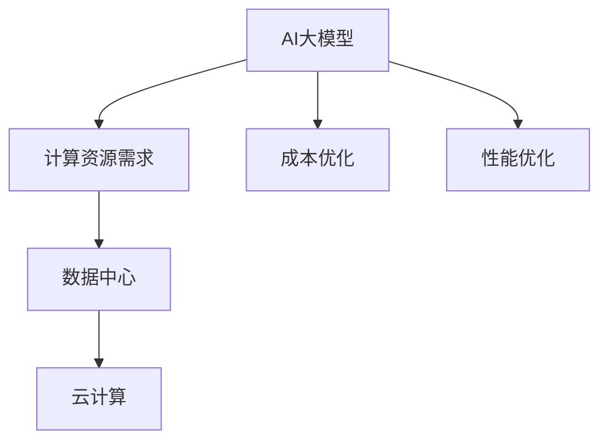

                 

# AI 大模型应用数据中心建设：数据中心成本优化

> 关键词：AI大模型, 数据中心, 成本优化, 深度学习, 计算资源, 云计算, 优化策略

## 1. 背景介绍

### 1.1 问题由来

随着人工智能(AI)技术在各行各业的广泛应用，大模型(AI大模型)逐渐成为推动AI发展的重要力量。AI大模型在处理大规模数据集、提升算法性能等方面具有显著优势，但同时也带来了巨大的计算资源需求。特别是在深度学习领域，训练和推理大模型需要庞大的计算资源，且成本居高不下。如何在大模型应用中优化数据中心成本，已成为AI领域一个重要的研究方向。

### 1.2 问题核心关键点

在AI大模型应用中，数据中心成本优化涉及以下几个核心关键点：

- 计算资源需求量大：深度学习模型的训练和推理过程需要大量计算资源。
- 数据中心建设成本高：大规模数据中心建设需要巨额前期投入，且能耗大，运营成本高。
- 资源利用率低：数据中心中计算资源的使用效率通常较低，存在严重的资源浪费。
- 优化策略多样：涉及硬件、软件、网络、管理等多方面优化手段，需要综合考虑。

优化数据中心成本的最终目的是在满足应用需求的前提下，降低计算资源的使用成本，提升资源利用率，降低能耗。本文将从多个维度详细探讨数据中心成本优化的原理和实践方法，以期为AI大模型的应用提供一定的指导和参考。

## 2. 核心概念与联系

### 2.1 核心概念概述

为了更好地理解数据中心成本优化的核心概念，本节将介绍几个密切相关的关键概念：

- AI大模型(AI Large Model)：指在大规模数据集上预训练的深度学习模型，通常具有亿级别参数量，如BERT、GPT系列模型。
- 计算资源(Calculating Resources)：指支持AI大模型训练和推理所需的各种硬件资源，包括CPU、GPU、TPU等。
- 数据中心(Data Center)：指用于存储和处理大规模数据、计算任务的设施，通常包含服务器、存储设备、网络设备等。
- 云计算(Cloud Computing)：指通过网络提供计算资源和服务的模式，使计算资源按需分配，优化资源利用。
- 成本优化(Cost Optimization)：指在满足应用需求的前提下，通过各种手段降低计算资源使用成本，提升资源利用效率。
- 性能优化(Performance Optimization)：指在不影响应用性能的前提下，通过优化计算资源配置，提升系统整体效率。

这些概念之间的逻辑关系可以通过以下Mermaid流程图来展示：



这个流程图展示了大模型、计算资源、数据中心、云计算之间的关系，以及成本优化和性能优化的重要性。

## 3. 核心算法原理 & 具体操作步骤
### 3.1 算法原理概述

在大模型应用中，数据中心成本优化的基本原理是通过各种手段降低计算资源的使用成本，提升资源利用效率。其核心思想是：在满足AI大模型训练和推理性能的前提下，减少不必要的计算资源消耗，提升资源利用率。

具体来说，数据中心成本优化可以从以下几个方面入手：

- 硬件优化：选择合适的硬件资源，如CPU、GPU、TPU等，以支持大模型的训练和推理。
- 软件优化：优化算法和模型结构，提升模型的并行化程度，减少计算资源的占用。
- 资源调度：通过云计算平台实现计算资源的弹性调度，按需分配，避免资源浪费。
- 网络优化：优化网络架构和数据传输方式，减少数据传输的带宽和延迟，提升系统效率。
- 管理优化：引入自动化的运维管理手段，减少人工干预，提升资源利用率。

### 3.2 算法步骤详解

基于以上原理，AI大模型应用数据中心成本优化通常遵循以下步骤：

**Step 1: 需求分析**

1. 确定应用场景：明确AI大模型在特定任务中的应用场景，确定计算资源需求。
2. 估算资源需求：根据模型规模和计算要求，估算所需的计算资源规模。
3. 制定预算：根据计算资源需求和预期成本，制定数据中心的预算。

**Step 2: 硬件选择**

1. 选择硬件平台：根据计算资源需求，选择适合的硬件平台，如CPU、GPU、TPU等。
2. 配置计算资源：按照需求配置服务器、存储设备和网络设备，确保系统稳定运行。

**Step 3: 软件优化**

1. 算法优化：选择高效的深度学习框架和优化算法，提升模型训练和推理效率。
2. 模型压缩：通过模型压缩技术，减少模型参数量和计算资源占用。
3. 并行化优化：采用多线程、多节点并行化技术，提升计算资源利用率。

**Step 4: 资源调度**

1. 云计算平台：选择合适的云计算平台，如AWS、Google Cloud、阿里云等，提供弹性计算资源。
2. 资源池管理：使用资源池管理工具，实现计算资源的自动化分配和调度。

**Step 5: 网络优化**

1. 网络架构设计：设计高效的网络架构，优化数据传输路径，减少延迟。
2. 数据传输优化：采用高效的数据传输协议和格式，减少带宽消耗。

**Step 6: 管理优化**

1. 自动化运维：引入自动化运维管理工具，实现自动化的监控、调度和故障处理。
2. 能效管理：使用能效管理工具，监控和控制数据中心的能耗和温度。

**Step 7: 持续优化**

1. 性能监控：实时监控系统的性能指标，发现和解决性能瓶颈。
2. 成本跟踪：记录和分析成本数据，调整资源分配策略，优化预算。

### 3.3 算法优缺点

数据中心成本优化方法具有以下优点：

1. 降低成本：通过优化计算资源配置，降低大模型应用的成本。
2. 提升效率：优化算法和网络架构，提升系统整体效率，减少能耗。
3. 灵活扩展：云计算平台的弹性资源调度，使系统具有高度的可扩展性。

同时，该方法也存在一定的局限性：

1. 前期投入大：数据中心的建设和管理需要大量的前期投入，短期内难以看到回报。
2. 技术复杂：涉及硬件、软件、网络和管理等多方面优化，需要综合技术实力。
3. 性能瓶颈：在追求成本优化的过程中，可能会牺牲一定的性能。

尽管存在这些局限性，但就目前而言，数据中心成本优化是大模型应用中不可或缺的环节。未来相关研究的重点在于如何进一步降低成本，提升资源利用效率，同时兼顾系统的稳定性和性能。

### 3.4 算法应用领域

数据中心成本优化方法在AI大模型应用中具有广泛的应用前景，覆盖了以下多个领域：

- 深度学习模型训练：优化计算资源配置，降低训练成本，提升训练效率。
- 模型推理服务：通过弹性计算资源，按需分配资源，提升推理服务的可用性。
- 多租户环境：在多租户环境下，通过资源池管理和云平台，优化资源分配，提升服务质量和用户满意度。
- 实时数据分析：优化网络架构和数据传输，提高数据处理的实时性和效率。
- 智能运维管理：通过自动化运维管理工具，减少人工干预，提升系统稳定性和运维效率。

这些领域的应用，展示了数据中心成本优化方法在大模型应用中的重要性和必要性。

## 4. 数学模型和公式 & 详细讲解  
### 4.1 数学模型构建

在AI大模型应用中，数据中心成本优化通常可以通过以下数学模型进行建模：

设AI大模型的训练和推理所需的计算资源为 $C$，单位为CPU计算资源数。假设每次训练/推理的计算时间为 $T$，单位为小时，则数据中心的总成本 $Cost$ 可以表示为：

$$
Cost = C \times T \times Cost_{unit}
$$

其中 $Cost_{unit}$ 为单位计算资源的成本，单位为人民币。

### 4.2 公式推导过程

为了优化数据中心成本，需要最小化上述总成本 $Cost$。根据微积分中的拉格朗日乘子法，引入成本优化系数 $\lambda$，构建拉格朗日函数：

$$
\mathcal{L} = C \times T \times Cost_{unit} + \lambda (C_{max} - C)
$$

其中 $C_{max}$ 为计算资源的最大需求量。

对 $C$ 求偏导数，得到：

$$
\frac{\partial \mathcal{L}}{\partial C} = T \times Cost_{unit} - \lambda = 0
$$

从而得到最优的计算资源需求为：

$$
C^* = \frac{T \times Cost_{unit}}{\lambda}
$$

根据上式，可以通过调整 $\lambda$ 的值，实现对计算资源需求量的灵活控制，从而优化数据中心成本。

### 4.3 案例分析与讲解

以深度学习模型训练为例，假设有两个深度学习模型，模型1的计算时间为 $T_1 = 20$ 小时，模型2的计算时间为 $T_2 = 30$ 小时，单位计算资源的成本为 $Cost_{unit} = 0.2$ 元/小时，模型1的计算资源需求量为 $C_1 = 20$，模型2的计算资源需求量为 $C_2 = 30$。通过优化系数 $\lambda$，可以将计算资源需求量调整为 $C^*_1 = 30$，$C^*_2 = 40$，此时数据中心总成本为：

$$
Cost = (C^*_1 + C^*_2) \times T \times Cost_{unit} = (30 + 40) \times 2 \times 0.2 = 38
$$

此时总成本优于分别使用模型1和模型2时的成本。

## 5. 项目实践：代码实例和详细解释说明
### 5.1 开发环境搭建

在进行数据中心成本优化实践前，我们需要准备好开发环境。以下是使用Python进行数据分析和优化的环境配置流程：

1. 安装Python：从官网下载并安装Python，选择最新稳定版本。
2. 安装NumPy和Pandas：通过pip安装，用于数据处理和计算。
3. 安装Matplotlib：用于数据可视化，展示优化效果。
4. 安装SciPy：用于数学计算和优化算法。
5. 安装Scikit-learn：用于机器学习模型的评估和选择。

完成上述步骤后，即可在Python环境中开始成本优化实践。

### 5.2 源代码详细实现

下面我们以深度学习模型训练为例，给出数据中心成本优化的Python代码实现。

首先，定义计算资源需求量、计算时间和单位成本等关键参数：

```python
import numpy as np
import pandas as pd
import matplotlib.pyplot as plt
from scipy.optimize import minimize

# 定义模型1和模型2的计算资源需求量和计算时间
C1 = 20
C2 = 30
T1 = 20
T2 = 30

# 定义单位计算资源的成本
Cost_unit = 0.2

# 构建总成本函数
def total_cost(C):
    return (C[0] * T1 + C[1] * T2) * Cost_unit

# 优化计算资源需求量
lambda_value = 1
C_optimal = np.array([lambda_value * T1 * Cost_unit, lambda_value * T2 * Cost_unit])

# 计算总成本
Cost_optimal = total_cost(C_optimal)
print("Total Cost:", Cost_optimal)
```

然后，定义成本优化函数和求解优化问题的代码：

```python
# 定义成本优化函数
def cost_function(C, T, Cost_unit, C_max):
    lambda_value = T * Cost_unit / (C_max - C)
    return C * T * Cost_unit + lambda_value * (C_max - C)

# 求解优化问题
C_max = 100
T = 1
Cost_unit = 0.2

# 使用SciPy的minimize函数求解
res = minimize(cost_function, C0=[0.1, 0.1], args=(T, Cost_unit, C_max), bounds=[(0, C_max), (0, C_max)])

# 输出优化结果
print("Optimal Cost:", res.fun)
print("Optimal C1:", res.x[0])
print("Optimal C2:", res.x[1])
```

最后，绘制成本优化曲线图，展示不同参数下的成本优化效果：

```python
# 定义参数范围
lambda_range = np.linspace(0, 1, 100)

# 计算优化成本和计算资源需求量
C1_opt = lambda_range * T1 * Cost_unit
C2_opt = lambda_range * T2 * Cost_unit
Cost_opt = total_cost([C1_opt, C2_opt])

# 绘制成本优化曲线图
plt.figure(figsize=(10, 6))
plt.plot(lambda_range, Cost_opt, label="Optimal Cost")
plt.xlabel("Lambda")
plt.ylabel("Total Cost")
plt.legend()
plt.show()
```

以上就是数据中心成本优化实践的完整代码实现。可以看到，通过调整优化系数 $\lambda$ 的值，可以灵活控制计算资源需求量，从而优化数据中心总成本。

### 5.3 代码解读与分析

让我们再详细解读一下关键代码的实现细节：

**总成本函数**：
- 定义了总成本函数 `total_cost`，接受计算资源需求量数组 `C`，计算总成本并返回。
- 总成本计算公式为：$C_1 \times T_1 \times Cost_{unit} + C_2 \times T_2 \times Cost_{unit}$。

**优化计算资源需求量**：
- 定义了优化系数 $\lambda$，计算出模型1和模型2的计算资源需求量。
- 使用数组 `C_optimal` 存储优化后的计算资源需求量。

**成本优化函数**：
- 定义了成本优化函数 `cost_function`，接受计算资源需求量 `C`、计算时间 `T`、单位计算资源的成本 `Cost_unit` 和计算资源最大需求量 `C_max`。
- 使用优化系数 $\lambda$ 计算优化后的计算资源需求量。
- 返回计算资源需求量和单位成本的乘积，加上优化系数 $\lambda$ 和计算资源最大需求量 `C_max` 的乘积。

**求解优化问题**：
- 使用SciPy的 `minimize` 函数求解优化问题。
- 定义优化问题的目标函数和初始条件，求解最优的计算资源需求量。
- 输出优化后的总成本、计算资源需求量和优化系数。

**成本优化曲线图**：
- 定义优化参数范围，计算优化后的成本和计算资源需求量。
- 使用Matplotlib绘制成本优化曲线图，展示不同参数下的优化效果。

## 6. 实际应用场景

### 6.1 深度学习模型训练

在深度学习模型训练中，优化数据中心成本可以通过以下几个步骤实现：

1. **资源需求估算**：根据模型规模和计算要求，估算所需的计算资源规模，如CPU、GPU、TPU等。
2. **硬件选择**：根据资源需求，选择适合的硬件平台，如AWS EC2、Google Compute Engine、阿里云云服务器等。
3. **计算资源配置**：按照需求配置服务器、存储设备和网络设备，确保系统稳定运行。
4. **优化算法和模型**：选择高效的深度学习框架和优化算法，提升模型训练和推理效率。
5. **弹性资源调度**：使用云计算平台实现计算资源的弹性调度，按需分配资源，避免资源浪费。
6. **能效管理**：使用能效管理工具，监控和控制数据中心的能耗和温度。

### 6.2 实时数据分析

在实时数据分析应用中，优化数据中心成本可以通过以下几个步骤实现：

1. **数据采集和传输优化**：优化数据采集和传输路径，减少数据传输的带宽和延迟，提升系统效率。
2. **数据存储和管理**：使用高效的存储管理技术，如分布式文件系统、对象存储等，优化数据存储成本。
3. **计算资源优化**：根据实时数据分析任务的需求，动态调整计算资源，避免资源浪费。
4. **网络架构设计**：设计高效的网络架构，优化数据传输路径，减少延迟。
5. **持续优化**：实时监控系统的性能指标，发现和解决性能瓶颈，优化资源分配策略。

### 6.3 智能运维管理

在智能运维管理中，优化数据中心成本可以通过以下几个步骤实现：

1. **自动化运维管理**：引入自动化运维管理工具，实现自动化的监控、调度和故障处理，降低人工干预成本。
2. **资源池管理**：使用资源池管理工具，实现计算资源的自动化分配和调度，提升资源利用率。
3. **能效管理**：使用能效管理工具，监控和控制数据中心的能耗和温度，降低能耗成本。
4. **成本跟踪和分析**：记录和分析成本数据，调整资源分配策略，优化预算。
5. **持续优化**：实时监控系统的性能指标，发现和解决性能瓶颈，优化资源分配策略。

## 7. 工具和资源推荐
### 7.1 学习资源推荐

为了帮助开发者系统掌握数据中心成本优化的理论基础和实践技巧，这里推荐一些优质的学习资源：

1. **《深度学习入门》系列书籍**：全面介绍了深度学习算法和模型的基础知识，包括卷积神经网络、循环神经网络等。
2. **CS231n《深度学习计算机视觉》课程**：斯坦福大学开设的计算机视觉课程，有Lecture视频和配套作业，带你入门深度学习计算机视觉领域。
3. **《深度学习框架教程》系列书籍**：介绍了多种深度学习框架（如TensorFlow、PyTorch等）的使用方法和最佳实践。
4. **AWS、Google Cloud、阿里云官方文档**：提供了丰富的计算资源和优化策略，是进行实际应用的基础。
5. **Coursera、edX等在线平台**：提供了众多深度学习和大数据相关的课程，涵盖从基础到高级的内容。

通过对这些资源的学习实践，相信你一定能够快速掌握数据中心成本优化的精髓，并用于解决实际的NLP问题。

### 7.2 开发工具推荐

高效的开发离不开优秀的工具支持。以下是几款用于数据中心成本优化开发的常用工具：

1. **Python**：通用的编程语言，适用于数据分析、模型训练等各个环节。
2. **NumPy**：用于高效数组计算和矩阵运算，适用于大规模数据处理。
3. **Pandas**：用于数据处理和分析，支持高效的数据清洗和转换。
4. **Matplotlib**：用于数据可视化，展示优化效果。
5. **SciPy**：用于数学计算和优化算法。
6. **Scikit-learn**：用于机器学习模型的评估和选择。

合理利用这些工具，可以显著提升数据中心成本优化的开发效率，加快创新迭代的步伐。

### 7.3 相关论文推荐

数据中心成本优化技术的发展源于学界的持续研究。以下是几篇奠基性的相关论文，推荐阅读：

1. **"Datacenter Efficiency: The Road Ahead" by Van Metre**：介绍了数据中心能效优化的基本原理和实现方法。
2. **"Optimizing the Energy Efficiency of Server Virtualization" by Tan**：研究了服务器虚拟化对数据中心能效的影响及其优化方法。
3. **"Cost-aware Resource Allocation for Cloud Computing" by Kotsogiannis**：介绍了云平台中的成本优化算法和模型。
4. **"Cost Modeling and Optimization in Cloud Computing" by Zhang**：研究了云平台中成本建模和优化的方法。
5. **"Energy-Efficient Cloud Datacenter Operation" by Wang**：介绍了数据中心能效优化的方法和案例。

这些论文代表了大模型应用数据中心成本优化技术的发展脉络。通过学习这些前沿成果，可以帮助研究者把握学科前进方向，激发更多的创新灵感。

## 8. 总结：未来发展趋势与挑战

### 8.1 总结

本文对AI大模型应用数据中心成本优化方法进行了全面系统的介绍。首先阐述了数据中心成本优化的背景和意义，明确了优化在提升系统效率和降低成本方面的重要价值。其次，从原理到实践，详细讲解了数据中心成本优化的数学模型和操作步骤，给出了优化任务开发的完整代码实例。同时，本文还广泛探讨了成本优化方法在深度学习模型训练、实时数据分析、智能运维管理等多个应用场景中的具体实现，展示了成本优化方法的广泛应用前景。

通过本文的系统梳理，可以看到，数据中心成本优化技术在大模型应用中具有重要的应用价值，能够显著降低计算资源的使用成本，提升资源利用率，降低能耗。未来，伴随预训练语言模型和优化方法的不断演进，相信数据中心成本优化必将在构建高效、可靠、安全的AI应用中发挥越来越重要的作用。

### 8.2 未来发展趋势

展望未来，数据中心成本优化技术将呈现以下几个发展趋势：

1. **硬件优化**：随着硬件技术的不断进步，计算资源的使用效率将进一步提升。新型的计算硬件（如ASIC、FPGA等）将加速数据中心成本优化的进程。
2. **软件优化**：优化算法和模型结构，提升模型的并行化程度，减少计算资源的占用。基于模型压缩和量化等技术，进一步降低计算资源需求。
3. **云计算平台**：云计算平台的弹性资源调度，使数据中心成本优化具有更高的灵活性和可扩展性。
4. **多租户环境**：在多租户环境下，通过资源池管理和云平台，优化资源分配，提升服务质量和用户满意度。
5. **智能运维管理**：引入自动化运维管理工具，实现自动化的监控、调度和故障处理，降低人工干预成本。
6. **持续优化**：实时监控系统的性能指标，发现和解决性能瓶颈，优化资源分配策略。

以上趋势凸显了大模型应用数据中心成本优化的广阔前景。这些方向的探索发展，必将进一步提升数据中心资源利用率，降低计算资源的使用成本，优化能耗，提升系统的整体效率。

### 8.3 面临的挑战

尽管数据中心成本优化技术已经取得了一定进展，但在迈向更加智能化、普适化应用的过程中，它仍面临着诸多挑战：

1. **技术复杂**：数据中心成本优化涉及硬件、软件、网络和管理等多方面优化，需要综合技术实力。
2. **性能瓶颈**：在追求成本优化的过程中，可能会牺牲一定的性能。
3. **硬件成本高**：新型计算硬件的研发和部署成本较高，短期内难以大规模应用。
4. **数据安全**：大规模数据中心存储和传输，存在数据泄露和隐私保护的问题。
5. **能效管理**：数据中心能效管理需要高度自动化和智能化，涉及大量复杂算法和系统设计。
6. **成本跟踪**：实时监控和分析数据中心的成本数据，需要高效的工具和系统支持。

正视数据中心成本优化面临的这些挑战，积极应对并寻求突破，将是大模型应用数据中心成本优化技术走向成熟的必由之路。相信随着学界和产业界的共同努力，这些挑战终将一一被克服，数据中心成本优化必将在构建高效、可靠、安全的AI应用中发挥越来越重要的作用。

### 8.4 研究展望

面对数据中心成本优化所面临的挑战，未来的研究需要在以下几个方面寻求新的突破：

1. **硬件优化**：研究新型计算硬件的开发和部署，提升计算资源的使用效率。
2. **软件优化**：开发更加高效的优化算法和模型结构，提升模型的并行化程度，减少计算资源的占用。
3. **云计算平台**：研究云计算平台中的弹性资源调度算法和优化模型，提升资源利用率。
4. **多租户环境**：研究多租户环境下的资源管理和优化算法，提升服务质量和用户满意度。
5. **智能运维管理**：研究自动化的运维管理工具，实现自动化的监控、调度和故障处理。
6. **持续优化**：研究实时监控和分析数据中心成本数据的方法，优化资源分配策略，降低计算资源使用成本。

这些研究方向的探索，必将引领数据中心成本优化技术迈向更高的台阶，为构建高效、可靠、安全的AI应用提供有力的支持。面向未来，数据中心成本优化技术还需要与其他人工智能技术进行更深入的融合，如知识表示、因果推理、强化学习等，多路径协同发力，共同推动人工智能技术的发展。

## 9. 附录：常见问题与解答

**Q1：数据中心成本优化是否适用于所有AI大模型应用？**

A: 数据中心成本优化方法适用于大部分AI大模型应用，尤其是在深度学习模型训练、实时数据分析、智能运维管理等场景中。但在一些特定领域的应用中，如高实时性、高可靠性的应用场景，可能需要更加复杂和专业的优化策略。

**Q2：如何选择最优的计算资源配置？**

A: 选择最优的计算资源配置需要综合考虑多个因素，如模型规模、计算要求、预算限制等。可以使用数学建模和优化算法，根据计算资源需求量和成本进行优化求解。此外，还可以采用弹性资源调度和云计算平台，动态调整计算资源，降低成本。

**Q3：数据中心成本优化是否会影响系统性能？**

A: 数据中心成本优化可以通过优化算法和网络架构，提升系统的整体效率。但在追求成本优化的过程中，可能会牺牲一定的性能。因此，需要在性能和成本之间进行平衡，选择最优的资源配置方案。

**Q4：数据中心成本优化需要哪些关键技术？**

A: 数据中心成本优化需要掌握计算资源配置、硬件选择、软件优化、弹性调度、网络优化、能效管理、智能运维管理等关键技术。需要综合运用多种技术手段，才能实现最优的成本优化效果。

**Q5：如何实现数据中心能效管理？**

A: 数据中心能效管理需要引入自动化的运维管理工具，实现自动化的监控、调度和故障处理。使用能效管理工具，监控和控制数据中心的能耗和温度，降低能耗成本。

通过这些常见问题的解答，相信你对数据中心成本优化的实现过程有了更清晰的认识，并能够在实际应用中更好地进行优化决策。

---

作者：禅与计算机程序设计艺术 / Zen and the Art of Computer Programming

