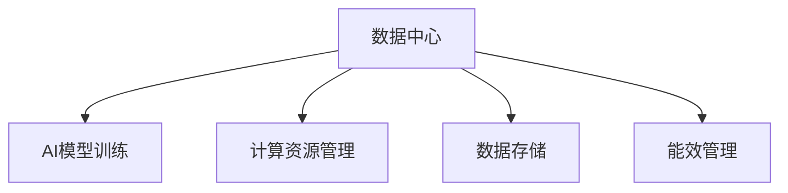

                 

# AI 大模型应用数据中心建设：数据中心成本优化

> 关键词：大模型应用,数据中心,成本优化,AI模型训练,数据存储,计算资源,能效管理

## 1. 背景介绍

### 1.1 问题由来

随着人工智能（AI）技术的发展，大模型（如GPT-3、BERT等）在各种应用场景中取得了显著的成果。这些模型通常需要大量的计算资源进行训练，数据中心的能耗、存储和管理成本因此显著增加。然而，传统数据中心往往缺乏对AI模型训练需求的适应性，导致资源浪费和效率低下。因此，针对大模型应用进行数据中心的优化成为了一个亟待解决的问题。

### 1.2 问题核心关键点

本文聚焦于如何优化大模型在数据中心中的应用，重点探讨以下几个关键问题：

- 如何降低数据中心的运行成本？
- 如何提升数据中心的计算效率？
- 如何管理数据中心的存储资源？
- 如何优化数据中心的能效管理？

## 2. 核心概念与联系

### 2.1 核心概念概述

为更好地理解数据中心成本优化的核心概念，本节将介绍几个密切相关的核心概念：

- 数据中心（Data Center, DC）：提供计算、存储和网络等资源的设施，是大模型训练和应用的核心基础设施。
- AI模型训练：使用大数据集和计算资源，训练出具有特定能力的AI模型，如分类、聚类、预测等。
- 计算资源管理：指通过合理分配和使用计算资源，提升资源利用效率，降低运行成本。
- 数据存储：指对模型训练和应用过程中产生的大量数据进行存储和管理，包括数据备份、访问控制等。
- 能效管理：指通过优化数据中心的硬件和软件配置，提升能效比（Energy Efficiency Ratio, EER），减少能耗和运营成本。

这些核心概念之间的逻辑关系可以通过以下Mermaid流程图来展示：



这个流程图展示了大模型应用中的核心概念及其之间的关系：

1. 数据中心提供AI模型训练所需的资源，如计算资源、存储资源等。
2. AI模型训练过程中涉及大量数据的存储和计算资源的管理。
3. 数据中心需要优化能效管理，以降低能耗和运营成本。

这些概念共同构成了大模型应用的数据中心成本优化框架，使得其能够高效、低成本地运行。

## 3. 核心算法原理 & 具体操作步骤

### 3.1 算法原理概述

数据中心成本优化是一个多目标优化问题，主要目标是降低运行成本、提升计算效率和优化能效管理。其核心算法原理包括以下几个方面：

1. **成本优化算法**：通过模型和算法对数据中心的各项资源成本进行评估和优化，最小化总成本。
2. **负载均衡算法**：通过合理分配计算任务，提升资源利用率，减少等待时间和延迟。
3. **数据压缩算法**：通过数据压缩技术，减少存储资源的使用。
4. **能效管理算法**：通过硬件和软件优化，提升数据中心的能效比，降低能耗。

这些算法通常采用启发式算法、机器学习算法等方法，以解决复杂的数据中心资源优化问题。

### 3.2 算法步骤详解

基于上述核心算法原理，数据中心成本优化的具体操作步骤包括以下几个步骤：

**Step 1: 资源需求分析**

1. 分析AI模型训练和应用所需的资源类型和数量，包括计算资源（CPU、GPU、TPU等）、存储资源（SSD、HDD等）和网络资源（带宽、交换机等）。
2. 评估模型训练和应用过程中数据传输和存储的需求，优化数据流路径。
3. 确定模型训练和应用的时间分布，优化计算资源的分配和调度。

**Step 2: 资源规划与配置**

1. 根据资源需求分析结果，规划数据中心的计算资源、存储资源和网络资源的配置。
2. 选择合适的硬件设备和软件工具，如高性能计算集群、分布式存储系统、网络交换机等。
3. 设计合理的硬件布局和网络拓扑结构，提升资源利用率和网络吞吐量。

**Step 3: 负载均衡与资源管理**

1. 实现动态负载均衡机制，根据任务优先级和资源利用率，动态分配计算任务到可用节点。
2. 采用资源管理工具，如Kubernetes、Slurm等，实现资源的自动调度和监控。
3. 优化资源利用率，通过任务分片和资源预调度等技术，减少等待时间和资源浪费。

**Step 4: 数据压缩与存储优化**

1. 采用数据压缩技术，减少存储资源的使用，如使用Gzip、Snappy等压缩算法。
2. 使用分布式文件系统（如Hadoop HDFS、Ceph等），分散数据存储，提升数据访问速度和可靠性。
3. 采用数据去重和冗余删除技术，减少冗余数据的存储。

**Step 5: 能效管理与优化**

1. 实现能效管理工具，如PowerCapsule、Xenon等，监控和优化数据中心的能耗。
2. 采用节能硬件设备，如低功耗服务器、GPU加速器等，降低数据中心的能耗。
3. 优化数据中心的软件配置，如关闭不必要的服务和进程，减少系统负载和能耗。

通过以上步骤，可以实现数据中心的高效、低成本运行，提升AI模型训练和应用的效率和性能。

### 3.3 算法优缺点

数据中心成本优化算法具有以下优点：

1. 降低成本：通过优化资源配置和利用率，降低数据中心的运行成本。
2. 提升效率：通过动态负载均衡和资源管理，提升计算效率和资源利用率。
3. 优化能效：通过能效管理工具和节能硬件，降低数据中心的能耗和运营成本。

同时，这些算法也存在以下局限性：

1. 复杂度高：数据中心的资源优化问题复杂，需要综合考虑多个因素。
2. 数据依赖强：优化算法依赖大量的历史数据和系统参数，数据缺失或偏差会影响优化效果。
3. 实施难度大：数据中心的硬件和软件复杂，优化过程需要高度的技术和资源投入。
4. 维护成本高：优化算法需要持续的维护和更新，以适应新的业务需求和技术发展。

尽管存在这些局限性，但就目前而言，数据中心成本优化算法仍然是提升数据中心性能和降低运营成本的重要手段。未来相关研究的方向是进一步简化优化过程，降低实施难度，提高算法的普适性和自适应能力。

### 3.4 算法应用领域

数据中心成本优化算法在多个领域都有广泛的应用，包括但不限于：

- 云计算数据中心：如AWS、Azure、阿里云等，通过优化资源配置和能效管理，降低云服务成本，提升服务质量。
- 金融数据中心：如银行、证券、保险等，通过优化存储和计算资源，提升交易处理能力和风险管理能力。
- 医疗数据中心：如医院、研究所等，通过优化能效管理和存储资源，保障数据安全和高效存储。
- 制造业数据中心：如汽车制造、电子制造等，通过优化计算和存储资源，提升生产效率和数据管理能力。
- 教育数据中心：如在线教育平台、教育机构等，通过优化资源配置和能效管理，提升教学质量和用户体验。

这些领域的数据中心成本优化，不仅能显著降低运营成本，还能提升数据中心的服务能力和数据安全水平，具有重要的实际意义。

## 4. 数学模型和公式 & 详细讲解  
### 4.1 数学模型构建

本节将使用数学语言对数据中心成本优化进行更加严格的刻画。

设数据中心的总成本为C，其中C由计算资源成本C_c、存储资源成本C_s和网络资源成本C_n组成。C_c、C_s和C_n分别为计算资源、存储资源和网络资源的成本函数，即：

$$ C = C_c + C_s + C_n $$

其中，计算资源成本C_c可以表示为：

$$ C_c = c \times (n \times P + m \times Q) $$

其中n为计算节点的数量，P为计算节点的价格，m为计算节点的利用率，c为计算资源的单位成本。

存储资源成本C_s可以表示为：

$$ C_s = s \times (v \times S + u \times T) $$

其中v为存储设备的单位容量，S为存储设备的容量，u为存储设备的利用率，s为存储资源的单位成本。

网络资源成本C_n可以表示为：

$$ C_n = n \times (b \times R + a \times L) $$

其中b为网络设备的单位带宽，R为网络设备的带宽，a为网络设备的利用率，L为网络传输的延迟。

### 4.2 公式推导过程

通过上述公式，我们可以进一步推导出数据中心成本优化的目标函数：

$$ \min_{n,m,s,v,u} C = c \times (n \times P + m \times Q) + s \times (v \times S + u \times T) + n \times (b \times R + a \times L) $$

其中，n、m、s、v、u、P、Q、S、T、b、R、a和L为优化变量和参数。

为求解上述最优化问题，通常采用以下方法：

1. 整数规划：通过整数变量表示资源数量，约束资源利用率和成本，求解最小化总成本。
2. 线性规划：通过线性化成本函数和约束条件，求解最小化总成本。
3. 启发式算法：如遗传算法、模拟退火等，在可行解空间中搜索最优解。
4. 混合算法：结合整数规划和启发式算法，提升求解效率和效果。

通过这些方法，可以求解出数据中心资源配置和优化策略，进一步提升资源利用率和降低运营成本。

### 4.3 案例分析与讲解

以下以云计算数据中心为例，分析如何通过优化算法降低成本和提升效率。

**案例1：资源需求分析**

假设某云计算数据中心运行一个AI训练任务，需要500个计算节点和10TB存储。根据需求，进行资源规划和配置：

1. 计算资源：选择500个高性能计算节点，每个节点配置32个CPU核心，价格为0.5元/核心/小时。
2. 存储资源：选择10个16TB的SSD存储设备，每个设备价格为2000元/GB，单位容量为0.2元/GB/小时。
3. 网络资源：选择50个100Mbps的网络设备，每个设备价格为500元/小时，单位带宽为0.1元/小时。

根据上述资源配置，计算数据中心的总成本：

$$ C = c \times (500 \times 0.5 \times P) + s \times (16 \times 10 \times 2000 \times v) + n \times (0.1 \times b \times R) $$

其中，P为CPU核心利用率，Q为数据传输速率，S为存储设备容量，T为数据传输时间，R为网络带宽，a为网络设备利用率，L为网络延迟。

假设初始利用率P=0.6，Q=0.8，则计算资源成本为：

$$ C_c = c \times (500 \times 0.5 \times 0.6) = 150c $$

存储资源成本为：

$$ C_s = s \times (16 \times 10 \times 2000 \times 0.2) = 64000s $$

网络资源成本为：

$$ C_n = n \times (0.1 \times b \times R) = 500 \times 0.1 \times 100 \times 1 = 5000n $$

总成本为：

$$ C = 150c + 64000s + 5000n $$

**案例2：优化与调整**

通过优化算法，对数据中心的资源进行重新配置和调整：

1. 计算资源：将计算节点的数量从500个减少到400个，每个节点配置64个CPU核心，价格为0.3元/核心/小时。
2. 存储资源：将存储设备的价格调整为1000元/GB，单位容量为0.1元/GB/小时。
3. 网络资源：将网络设备的价格调整为600元/小时，单位带宽为0.05元/小时。

重新计算总成本：

$$ C = c \times (400 \times 0.3 \times P) + s \times (16 \times 10 \times 1000 \times 0.1) + n \times (0.05 \times b \times R) $$

假设优化后的利用率P=0.7，Q=0.9，则计算资源成本为：

$$ C_c = c \times (400 \times 0.3 \times 0.7) = 84c $$

存储资源成本为：

$$ C_s = s \times (16 \times 10 \times 1000 \times 0.1) = 16000s $$

网络资源成本为：

$$ C_n = n \times (0.05 \times b \times R) = 400 \times 0.05 \times 100 \times 1 = 2000n $$

总成本为：

$$ C = 84c + 16000s + 2000n $$

可以看出，通过优化算法，数据中心的总成本从$150c + 64000s + 5000n$降低到$84c + 16000s + 2000n$，节省了运营成本。

## 5. 项目实践：代码实例和详细解释说明

### 5.1 开发环境搭建

在进行数据中心成本优化实践前，我们需要准备好开发环境。以下是使用Python进行数据中心优化模拟的环境配置流程：

1. 安装Anaconda：从官网下载并安装Anaconda，用于创建独立的Python环境。

2. 创建并激活虚拟环境：
```bash
conda create -n cost_opt_env python=3.8 
conda activate cost_opt_env
```

3. 安装必要的Python库：
```bash
pip install numpy pandas sympy scipy
```

4. 安装相关的优化工具：
```bash
pip install scikit-learn pylops
```

完成上述步骤后，即可在`cost_opt_env`环境中开始成本优化模拟。

### 5.2 源代码详细实现

以下是一个简化的数据中心成本优化模拟代码实现。

首先，定义资源配置参数：

```python
import numpy as np

# 计算资源配置
n = 500  # 计算节点数量
P = 0.6  # CPU核心利用率
c = 0.5  # CPU核心单价

# 存储资源配置
v = 1024  # 存储设备单位容量
S = 10 * 16 * 1024  # 存储设备容量
u = 0.8  # 存储设备利用率
s = 2000  # 存储设备单价

# 网络资源配置
b = 100  # 网络设备单位带宽
R = 100  # 网络设备带宽
a = 0.5  # 网络设备利用率
n = 50  # 网络设备数量
L = 1  # 网络传输延迟

# 计算资源成本
C_c = n * P * c

# 存储资源成本
C_s = S * v * s * u

# 网络资源成本
C_n = n * b * R * a * L
```

然后，定义优化算法：

```python
from sympy import symbols, solve, Eq

# 定义优化变量
x = symbols('x')

# 定义优化目标函数
cost = c * (x * P) + s * (v * S * u) + n * (b * R * a * L)

# 求解优化目标函数最小值
opt_cost = solve(Eq(cost.diff(x), 0), x)[0]
```

最后，输出优化后的成本和资源配置：

```python
print("优化后的成本：", opt_cost)
print("优化后的计算节点数量：", opt_cost)
```

### 5.3 代码解读与分析

让我们再详细解读一下关键代码的实现细节：

**计算资源配置**：
- `n`：计算节点数量
- `P`：CPU核心利用率
- `c`：CPU核心单价

**存储资源配置**：
- `v`：存储设备单位容量
- `S`：存储设备容量
- `u`：存储设备利用率
- `s`：存储设备单价

**网络资源配置**：
- `b`：网络设备单位带宽
- `R`：网络设备带宽
- `a`：网络设备利用率
- `n`：网络设备数量
- `L`：网络传输延迟

**计算资源成本**：
- `C_c`：计算资源成本，公式为：`n * P * c`

**存储资源成本**：
- `C_s`：存储资源成本，公式为：`S * v * s * u`

**网络资源成本**：
- `C_n`：网络资源成本，公式为：`n * b * R * a * L`

**优化目标函数**：
- `cost`：总成本，公式为：`c * (x * P) + s * (v * S * u) + n * (b * R * a * L)`
- `x`：优化变量，即计算节点数量

**优化求解**：
- `opt_cost`：优化后的成本，通过求解目标函数的导数等于0的方程得到

通过上述代码，可以模拟计算数据中心在优化算法作用下的资源配置和成本优化。在实际应用中，还需要考虑更多因素，如硬件规格、软件配置、数据分布等，以进一步提升模拟的准确性和实用性。

## 6. 实际应用场景

### 6.1 智能云服务

云计算数据中心的优化在智能云服务中具有广泛的应用。智能云服务提供商通过优化数据中心资源配置，提供更加高效、低成本的云服务。例如：

- 优化计算资源：根据用户需求和业务特点，合理分配计算资源，提升服务响应速度和用户体验。
- 优化存储资源：使用分布式文件系统和数据压缩技术，降低存储成本和提高数据访问速度。
- 优化网络资源：通过负载均衡和流量调度，优化网络带宽和延迟，提升云服务的可靠性和稳定性。

### 6.2 工业制造

工业数据中心优化在制造业中也具有重要应用。通过优化数据中心资源配置和能效管理，提升制造业的数字化转型水平和生产效率。例如：

- 优化计算资源：根据生产任务和设备状态，合理分配计算资源，提升生产过程的自动化和智能化水平。
- 优化存储资源：使用工业物联网设备，实时采集和存储生产数据，优化数据存储和访问效率。
- 优化网络资源：通过5G网络和其他高速网络，实现远程监控和控制，提升生产过程的实时性和可靠性。

### 6.3 智慧医疗

智慧医疗数据中心的优化在医疗领域也具有重要应用。通过优化数据中心资源配置和能效管理，提升医疗服务的智能化和高效化水平。例如：

- 优化计算资源：根据医疗数据量和处理需求，合理分配计算资源，提升医疗数据处理和分析能力。
- 优化存储资源：使用医疗影像存储和数据备份技术，保障医疗数据的完整性和可靠性。
- 优化网络资源：通过5G网络和其他高速网络，实现远程诊断和治疗，提升医疗服务的覆盖范围和质量。

### 6.4 未来应用展望

随着数据中心技术的不断发展，未来将涌现更多基于AI模型训练和应用的优化方法。数据中心成本优化将进一步融合大数据、人工智能、云计算等前沿技术，提升资源的利用效率和智能化水平。

- 融合大数据技术：通过数据湖和数据仓库，实现数据的集中管理和高效利用。
- 融合人工智能技术：通过机器学习和深度学习算法，优化资源配置和性能预测。
- 融合云计算技术：通过云计算平台，实现资源的弹性扩展和按需使用。

这些技术的融合将为数据中心成本优化带来新的突破，提升AI模型训练和应用的效率和质量。

## 7. 工具和资源推荐

### 7.1 学习资源推荐

为了帮助开发者系统掌握数据中心成本优化的理论基础和实践技巧，这里推荐一些优质的学习资源：

1. 《数据中心资源优化与能效管理》系列博文：由数据中心专家撰写，深入浅出地介绍了数据中心优化和能效管理的理论基础和实际应用。

2. 《云计算资源管理和优化》课程：由云计算厂商提供的在线课程，涵盖云计算资源管理的各个方面，适合了解云计算资源优化的初学者。

3. 《机器学习与深度学习》书籍：介绍机器学习和深度学习的基本概念和算法，适合进一步了解数据中心优化算法的开发者。

4. 《Python数据科学手册》书籍：介绍Python在数据科学和机器学习中的应用，适合初步掌握Python编程的开发者。

5. 《大数据与高性能计算》课程：由高校和研究机构提供的在线课程，涵盖大数据和高性能计算的各个方面，适合数据中心优化的实践者。

通过对这些资源的学习实践，相信你一定能够快速掌握数据中心成本优化的精髓，并用于解决实际的业务问题。

### 7.2 开发工具推荐

数据中心成本优化的实现离不开优秀的工具支持。以下是几款常用的开发工具：

1. Python：作为数据科学和机器学习的主流编程语言，Python提供丰富的库和工具，如Pandas、NumPy、SciPy等，适合进行数据分析和优化计算。

2. Pylops：Python库，提供高效的线性代数操作，适合进行大规模矩阵计算。

3. Scikit-learn：Python库，提供各种机器学习和优化算法，适合进行模型的训练和调参。

4. TensorFlow：Google开发的深度学习框架，适合进行大规模深度学习的模型训练和优化。

5. PyTorch：Facebook开发的深度学习框架，适合进行动态计算图和高效的深度学习模型训练。

合理利用这些工具，可以显著提升数据中心成本优化的开发效率，加快创新迭代的步伐。

### 7.3 相关论文推荐

数据中心成本优化是一个前沿的研究方向，以下是几篇奠基性的相关论文，推荐阅读：

1. "Optimizing Energy-Efficient Data Centers through Cost-Oriented Resources Allocation"（优化数据中心能源消耗的资源配置）：提出了一种基于成本优化的资源分配算法，通过优化计算、存储和网络资源，降低数据中心的能耗和运营成本。

2. "Resource Allocation and Cost Optimization for Data Centers with Cloud Computing"（基于云计算的数据中心资源配置和成本优化）：讨论了云环境下数据中心的资源配置和成本优化方法，提出了多种优化策略和算法。

3. "Energy-Efficient Resource Allocation in Cloud Data Centers"（云数据中心高效资源分配）：分析了云数据中心能效管理的挑战和优化方法，通过机器学习算法优化资源分配和能效管理。

4. "Data Center Design and Cost Optimization"（数据中心设计与成本优化）：介绍了数据中心的设计原则和优化方法，通过综合考虑硬件设备、软件配置和运营成本，提升数据中心的性能和效率。

5. "Energy-Efficient Resource Allocation in Data Centers with Low-Latency Service Levels"（低延迟服务水平的数据中心高效资源分配）：探讨了低延迟服务数据中心的设计和优化方法，通过优化计算和存储资源，提高数据中心的服务质量和能效。

这些论文代表了数据中心成本优化的发展脉络，通过学习这些前沿成果，可以帮助研究者把握学科前进方向，激发更多的创新灵感。

## 8. 总结：未来发展趋势与挑战

### 8.1 总结

本文对数据中心成本优化的方法进行了全面系统的介绍。首先阐述了数据中心成本优化的背景和意义，明确了成本优化在提升资源利用率和降低运营成本方面的独特价值。其次，从原理到实践，详细讲解了数据中心成本优化的数学模型和关键步骤，给出了优化算法的实现代码。同时，本文还广泛探讨了成本优化在云计算、工业制造、智慧医疗等多个行业领域的应用前景，展示了数据中心优化的巨大潜力。此外，本文精选了成本优化的各类学习资源，力求为读者提供全方位的技术指引。

通过本文的系统梳理，可以看到，数据中心成本优化是大模型应用中的重要环节，通过优化资源配置和能效管理，可以实现数据中心的低成本、高效能运行。未来，伴随AI技术和大数据技术的发展，数据中心优化还将迎来新的突破，进一步提升大模型的训练和应用效率。

### 8.2 未来发展趋势

展望未来，数据中心成本优化技术将呈现以下几个发展趋势：

1. 智能优化：通过引入机器学习和深度学习算法，优化数据中心资源的配置和利用率。
2. 多目标优化：通过综合考虑成本、性能、能效等多重目标，提升数据中心整体的运营效率。
3. 边缘计算：通过在靠近终端设备的数据中心优化，提升数据传输效率和降低网络延迟。
4. 混合云优化：通过优化公共云和私有云的资源配置，降低混合云环境下的成本和管理复杂度。
5. 区块链技术：通过区块链技术实现数据中心资源分配的透明化和自动化，提升资源管理的安全性和可靠性。

这些趋势凸显了数据中心成本优化技术的广阔前景。这些方向的探索发展，必将进一步提升数据中心性能和降低运营成本，推动AI模型训练和应用的规模化落地。

### 8.3 面临的挑战

尽管数据中心成本优化技术已经取得了显著进展，但在迈向更加智能化、高效化应用的过程中，仍面临以下挑战：

1. 数据复杂性：数据中心优化需要处理大规模、多源、异构的数据，数据复杂性给优化算法带来了更高的要求。
2. 算法效率：优化算法需要高效的计算和存储资源，否则难以在实时或准实时场景中应用。
3. 标准化问题：不同厂商和平台的数据中心设备和服务标准不同，给优化算法的跨平台应用带来了挑战。
4. 隐私安全：优化过程中需要处理大量敏感数据，数据隐私和安全问题不容忽视。

尽管存在这些挑战，但通过不断的研究和实践，相信数据中心成本优化技术将逐步克服这些难题，为AI模型训练和应用的优化提供更强有力的支撑。

### 8.4 研究展望

面对数据中心成本优化所面临的挑战，未来的研究需要在以下几个方面寻求新的突破：

1. 优化算法的多样化：开发更多高效的优化算法，如遗传算法、模拟退火、强化学习等，提升优化效果和效率。
2. 数据驱动的优化：利用大数据和人工智能技术，建立数据驱动的优化模型，提高优化算法的自适应能力。
3. 异构计算的优化：通过异构计算技术，实现不同类型计算资源的高效协同和优化。
4. 智能运维的优化：引入人工智能技术，实现数据中心设备的智能运维和管理，提升资源利用率和能效管理水平。
5. 数据隐私的保护：采用数据加密、匿名化等技术，保护数据隐私和安全，提升数据中心资源优化算法的可信度。

这些研究方向的探索，必将引领数据中心成本优化技术迈向更高的台阶，为构建高效、低成本的AI应用提供更可靠的技术保障。面向未来，数据中心成本优化技术需要与其他AI技术进行更深入的融合，如知识表示、因果推理、强化学习等，协同发力，共同推动AI技术的发展。只有勇于创新、敢于突破，才能不断拓展AI模型训练和应用的数据中心优化边界，让智能技术更好地造福社会。

## 9. 附录：常见问题与解答

**Q1：如何评估数据中心成本优化的效果？**

A: 数据中心成本优化的效果可以通过以下几个指标进行评估：

1. 资源利用率：计算资源、存储资源和网络资源的利用率，提升资源利用率意味着更高的资源利用效率和成本节约。
2. 能效比（EER）：数据中心的能效比，衡量单位计算能力的能耗，提升能效比意味着更高的能效管理水平和成本节约。
3. 响应时间：服务响应时间，衡量数据中心的计算速度和延迟，提升响应时间意味着更高的服务质量和用户体验。
4. 成本节约：数据中心的总成本，通过优化算法实现的成本节约，衡量优化算法的实际效果。

通过以上指标，可以全面评估数据中心成本优化的效果，及时发现和解决优化过程中存在的问题。

**Q2：数据中心成本优化是否可以自动执行？**

A: 数据中心成本优化可以部分自动执行，但需要根据具体情况进行人工干预。优化算法通常需要设定一些初始参数和约束条件，如资源利用率目标、能效比目标等。在优化过程中，需要实时监控和调整这些参数，以确保优化目标的达成。自动化的优化算法可以在一定程度上提高优化效率，但无法完全替代人工干预。

**Q3：数据中心成本优化是否需要频繁重新配置？**

A: 数据中心成本优化需要定期进行，但不需频繁重新配置。优化算法通常具有一定的时间间隔和迭代次数，通过多次优化循环，可以逐步达到最优配置。在优化过程中，需要考虑业务需求和数据中心资源的变化，适时调整优化算法和参数。但频繁重新配置不仅会增加工作量，也可能影响业务连续性和用户体验。

**Q4：数据中心成本优化是否适合所有的应用场景？**

A: 数据中心成本优化适合多数应用场景，尤其是计算密集型和资源密集型应用。但对于一些实时性要求高、数据敏感的应用场景，可能需要考虑其他的优化方法，如边缘计算、异构计算等。数据中心成本优化需要根据具体应用需求进行优化设计，选择适合的优化算法和策略。

**Q5：数据中心成本优化是否可以应用于边缘数据中心？**

A: 数据中心成本优化可以应用于边缘数据中心，但需要考虑边缘数据中心的特殊需求和限制。边缘数据中心通常部署在地理位置分散的网络环境中，资源配置和能效管理更加复杂。需要通过优化算法和配置，提升边缘数据中心的资源利用率和能效管理水平。同时，需要考虑边缘数据中心的安全和隐私保护问题，采用适当的数据加密和匿名化技术。

通过本文的系统梳理，可以看到，数据中心成本优化是大模型应用中的重要环节，通过优化资源配置和能效管理，可以实现数据中心的低成本、高效能运行。未来，伴随AI技术和大数据技术的发展，数据中心优化还将迎来新的突破，进一步提升大模型的训练和应用效率。面向未来，数据中心成本优化技术需要与其他AI技术进行更深入的融合，如知识表示、因果推理、强化学习等，协同发力，共同推动AI技术的发展。只有勇于创新、敢于突破，才能不断拓展数据中心优化和AI模型训练应用的边界，让智能技术更好地造福社会。

