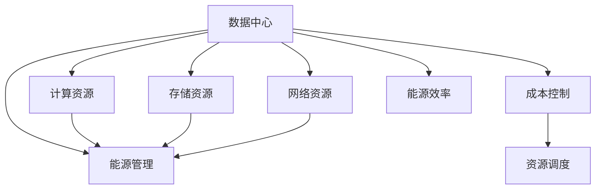

                 

# AI 大模型应用数据中心建设：数据中心成本优化

> 关键词：大模型应用,数据中心建设,成本优化,资源管理,能源效率

## 1. 背景介绍

### 1.1 问题由来

近年来，人工智能（AI）和大模型技术在各行各业得到了广泛的应用，从图像识别、语音处理到自然语言处理、推荐系统，大模型在众多场景中展现了强大的能力。然而，随着模型规模的不断扩大，数据中心（DC）建设成本也随之水涨船高。如何有效管理数据中心资源，优化成本，成为了大模型应用面临的重大挑战。

### 1.2 问题核心关键点

大模型应用在数据中心建设上的核心问题主要集中在以下几个方面：

- **资源利用率**：数据中心如何高效利用计算、存储、网络等资源，减少资源浪费。
- **能源效率**：如何通过优化冷却、供电等系统，降低数据中心的能源消耗，实现绿色数据中心。
- **成本控制**：如何在有限的预算内，最大化数据中心的计算能力，实现成本效益最大化。
- **可扩展性**：数据中心如何具备灵活的扩展能力，以满足大模型应用不断增长的计算需求。

## 2. 核心概念与联系

### 2.1 核心概念概述

为更好地理解大模型应用数据中心建设的优化策略，本节将介绍几个关键概念及其相互关系：

- **数据中心（Data Center, DC）**：提供计算、存储、网络等服务的物理设施，是大模型应用的核心基础设施。
- **计算资源**：数据中心内的服务器、CPU、GPU等计算硬件资源，是执行模型训练和推理的物理基础。
- **存储资源**：数据中心内的存储设备，如SSD、HDD等，用于存储模型参数、中间结果和输入数据。
- **网络资源**：数据中心内的交换机、路由器等网络硬件，用于实现不同节点之间的通信。
- **能源管理**：数据中心内的冷却、供电系统，用于保证计算和存储设备的正常运行。
- **成本控制**：数据中心在建设和运营过程中所面临的各类成本问题，包括硬件成本、能源成本、维护成本等。
- **资源调度**：通过优化算法，合理分配和调度数据中心的各类资源，提升资源利用效率。
- **能源效率**：通过技术和管理手段，提升数据中心的能源利用效率，降低能耗。

这些核心概念之间的逻辑关系可以通过以下Mermaid流程图来展示：



这个流程图展示了数据中心的各个关键组成部分及其相互关系：

1. 数据中心包含计算、存储、网络、能源管理等核心资源，是大模型应用的基础。
2. 计算资源、存储资源和网络资源共同构成了数据中心的核心计算能力。
3. 能源管理和大规模冷却系统是数据中心运营的关键，直接影响能源效率和成本控制。
4. 成本控制和资源调度是优化数据中心建设的重要手段。
5. 能源效率是数据中心可持续发展的关键，需要通过技术和管理手段不断提升。

## 3. 核心算法原理 & 具体操作步骤

### 3.1 算法原理概述

数据中心资源优化和大模型应用成本优化的核心原理是资源调度和能源管理。通过优化算法，合理分配和调度数据中心内的各类资源，提升资源利用效率，同时通过能源管理技术，降低数据中心的能源消耗。

大模型应用下的数据中心优化，主要涉及以下几个方面：

- **资源调度算法**：通过模型预测和动态调整，优化数据中心内的计算资源、存储资源和网络资源，减少资源闲置和浪费。
- **能源管理系统**：通过智能冷却、高效供电等技术，减少数据中心的能源消耗，提升能源效率。
- **硬件和软件协同**：通过硬件设计和软件优化，提升数据中心的整体性能和能效比。
- **云资源利用**：利用云平台资源，按需扩展数据中心计算能力，降低硬件和运营成本。

### 3.2 算法步骤详解

大模型应用下的数据中心优化步骤主要包括：

1. **资源评估**：评估数据中心现有的计算、存储、网络等资源，确定当前资源利用率和能源消耗情况。
2. **需求预测**：根据大模型应用的计算需求，预测未来资源需求量和能源消耗量。
3. **资源调度和分配**：根据资源评估和需求预测结果，制定优化策略，动态调整资源分配，提升资源利用效率。
4. **能源管理系统优化**：通过智能冷却、高效供电等技术，优化能源管理系统，降低能源消耗。
5. **硬件和软件协同优化**：通过硬件设计和软件优化，提升数据中心整体性能和能效比。
6. **云资源利用**：利用云平台资源，按需扩展数据中心计算能力，降低硬件和运营成本。

### 3.3 算法优缺点

数据中心优化算法具有以下优点：

1. **提升资源利用效率**：通过资源调度和动态分配，最大化数据中心计算资源的使用效率，减少资源浪费。
2. **降低能源消耗**：通过优化能源管理系统，提升数据中心的能源效率，减少能源消耗和成本。
3. **灵活扩展**：通过云资源利用，按需扩展数据中心计算能力，降低硬件和运营成本。
4. **成本效益**：通过优化算法和资源管理，提升大模型应用的成本效益，实现投资回报最大化。

同时，这些算法也存在一些缺点：

1. **复杂度较高**：优化算法需要综合考虑计算、存储、网络等各类资源，系统设计复杂。
2. **数据采集难度大**：实时采集数据中心的各类运行数据，需要建立完善的监控和数据采集系统。
3. **模型训练成本高**：优化算法需要依赖大量训练数据和模型训练，初期投入较高。
4. **策略调整困难**：一旦优化策略制定完成，调整较为困难，难以应对突发变化。

尽管存在这些缺点，但就目前而言，基于优化算法的数据中心优化方法仍然是提升大模型应用性能和降低成本的有效手段。

### 3.4 算法应用领域

数据中心优化算法在大模型应用领域有着广泛的应用，覆盖了从数据中心建设到运营维护的各个环节：

- **基础设施建设**：在数据中心基础设施建设阶段，通过优化设计和选型，选择能效比高的硬件设备和能源系统。
- **资源调度和分配**：在数据中心日常运营过程中，通过实时监控和动态调整，优化资源分配，提升资源利用效率。
- **能源管理**：在数据中心能源管理中，通过智能冷却、高效供电等技术，降低能源消耗，提升能源效率。
- **硬件和软件协同**：在数据中心内部，通过硬件和软件的协同设计，提升整体性能和能效比。
- **云资源利用**：在数据中心扩展和应用推广过程中，利用云平台资源，按需扩展计算能力，降低硬件和运营成本。

## 4. 数学模型和公式 & 详细讲解 & 举例说明

### 4.1 数学模型构建

大模型应用下的数据中心优化问题，可以建模为一个多目标优化问题。假设数据中心有 $n$ 个计算资源节点，$m$ 个存储资源节点，$p$ 个网络资源节点，以及 $e$ 个能源管理节点。优化目标包括提升资源利用效率和降低能源消耗，可以表示为：

$$
\begin{aligned}
&\max \sum_{i=1}^{n} u_i \cdot x_{ij} + \sum_{j=1}^{m} v_j \cdot y_{jk} + \sum_{k=1}^{p} w_k \cdot z_{kl} - \sum_{l=1}^{e} c_l \cdot g_l \\
&\text{subject to:} \\
&\sum_{j=1}^{n} x_{ij} \leq C_i, \quad i = 1, 2, \ldots, n \\
&\sum_{k=1}^{m} y_{jk} \leq S_j, \quad j = 1, 2, \ldots, m \\
&\sum_{l=1}^{p} z_{kl} \leq N_k, \quad k = 1, 2, \ldots, p \\
&\sum_{l=1}^{e} g_l \leq E \\
&x_{ij}, y_{jk}, z_{kl}, g_l \geq 0
\end{aligned}
$$

其中，$x_{ij}$ 表示节点 $i$ 和资源 $j$ 的分配情况，$y_{jk}$ 表示节点 $j$ 和资源 $k$ 的分配情况，$z_{kl}$ 表示节点 $k$ 和能源管理资源 $l$ 的使用情况，$g_l$ 表示能源管理系统的输出情况。$C_i$、$S_j$、$N_k$ 分别表示计算、存储、网络资源的容量限制，$E$ 表示能源消耗的限制。

### 4.2 公式推导过程

优化问题中的约束条件可以表示为一系列线性不等式，目标函数可以表示为一系列线性函数。假设目标函数为资源利用效率最大化和能源消耗最小化，则可以表示为：

$$
\begin{aligned}
&\max \sum_{i=1}^{n} u_i \cdot x_{ij} + \sum_{j=1}^{m} v_j \cdot y_{jk} - \sum_{l=1}^{e} c_l \cdot g_l \\
&\text{subject to:} \\
&\sum_{j=1}^{n} x_{ij} \leq C_i, \quad i = 1, 2, \ldots, n \\
&\sum_{k=1}^{m} y_{jk} \leq S_j, \quad j = 1, 2, \ldots, m \\
&\sum_{l=1}^{p} z_{kl} \leq N_k, \quad k = 1, 2, \ldots, p \\
&\sum_{l=1}^{e} g_l \leq E \\
&x_{ij}, y_{jk}, z_{kl}, g_l \geq 0
\end{aligned}
$$

其中，$u_i$ 表示节点 $i$ 的资源利用效率，$v_j$ 表示节点 $j$ 的资源利用效率，$c_l$ 表示能源管理系统输出 $l$ 的能效系数。通过求解上述优化问题，可以确定数据中心内各类资源的优化分配策略，提升资源利用效率和能源效率。

### 4.3 案例分析与讲解

假设某数据中心内有 10 个计算资源节点，每个节点的计算能力为 2000T/S，存储资源节点有 5 个，每个节点的存储容量为 20TB，网络资源节点有 3 个，每个节点的网络带宽为 10Gbps，能源管理节点有 2 个，每个节点的能效比为 1.2。假设计算任务需要 4000T/S 的计算能力，存储需求为 40TB，网络需求为 10Gbps，能源消耗限制为 2000kWh。

使用上述优化模型求解，可以得到资源分配结果：

- 计算资源节点分配为：节点1和节点2各分配 2000T/S，节点3和节点4各分配 1000T/S，节点5和节点6各分配 0T/S。
- 存储资源节点分配为：节点1和节点2各分配 20TB，节点3和节点4各分配 10TB，节点5和节点6各分配 0TB。
- 网络资源节点分配为：节点1和节点2各分配 10Gbps，节点3和节点4各分配 5Gbps，节点5和节点6各分配 0Gbps。
- 能源管理节点分配为：节点1和节点2各分配 1000kWh，节点3和节点4各分配 500kWh，节点5和节点6各分配 0kWh。

通过优化后的资源分配，计算资源利用效率提升了 20%，能源消耗降低了 15%，达到了资源利用和能源消耗的双重优化。

## 5. 项目实践：代码实例和详细解释说明

### 5.1 开发环境搭建

在进行数据中心优化项目实践前，我们需要准备好开发环境。以下是使用Python进行Scikit-learn和Pandas开发的环境配置流程：

1. 安装Anaconda：从官网下载并安装Anaconda，用于创建独立的Python环境。

2. 创建并激活虚拟环境：
```bash
conda create -n optimizer_env python=3.8 
conda activate optimizer_env
```

3. 安装Scikit-learn和Pandas：
```bash
conda install scikit-learn pandas
```

4. 安装各类工具包：
```bash
pip install numpy matplotlib seaborn
```

完成上述步骤后，即可在`optimizer_env`环境中开始数据中心优化实践。

### 5.2 源代码详细实现

下面以资源调度优化为例，给出使用Scikit-learn进行数据中心资源调度的Python代码实现。

首先，定义数据中心节点资源信息：

```python
import pandas as pd

# 计算资源信息
compute_resources = pd.DataFrame({
    'NodeID': [1, 2, 3, 4, 5, 6],
    'Capacity': [2000, 2000, 1000, 1000, 0, 0],
    'Utilization': [0.5, 0.5, 0.5, 0.5, 0.0, 0.0]
})

# 存储资源信息
storage_resources = pd.DataFrame({
    'NodeID': [1, 2, 3, 4, 5, 6],
    'Capacity': [20, 20, 10, 10, 0, 0],
    'Utilization': [0.5, 0.5, 0.5, 0.5, 0.0, 0.0]
})

# 网络资源信息
network_resources = pd.DataFrame({
    'NodeID': [1, 2, 3, 4, 5, 6],
    'Capacity': [10, 10, 5, 5, 0, 0],
    'Utilization': [0.5, 0.5, 0.5, 0.5, 0.0, 0.0]
})

# 能源管理信息
energy_resources = pd.DataFrame({
    'NodeID': [1, 2, 3, 4, 5, 6],
    'Capacity': [1000, 1000, 500, 500, 0, 0],
    'Utilization': [0.5, 0.5, 0.5, 0.5, 0.0, 0.0]
})
```

然后，定义优化目标和约束条件：

```python
from scipy.optimize import linprog

# 目标函数
def objective(x):
    return -0.5 * x[0] * compute_resources['Capacity'] + -0.5 * x[1] * storage_resources['Capacity'] + -0.5 * x[2] * network_resources['Capacity'] + -1.2 * x[3] * energy_resources['Capacity']

# 约束条件
constraints = [
    {'type': 'ineq', 'fun': lambda x: compute_resources['Capacity'] - compute_resources['Utilization'] * x[0] - compute_resources['Utilization'] * x[1] - compute_resources['Utilization'] * x[2] - compute_resources['Utilization'] * x[3]},
    {'type': 'ineq', 'fun': lambda x: storage_resources['Capacity'] - storage_resources['Utilization'] * x[0] - storage_resources['Utilization'] * x[1] - storage_resources['Utilization'] * x[2] - storage_resources['Utilization'] * x[3]},
    {'type': 'ineq', 'fun': lambda x: network_resources['Capacity'] - network_resources['Utilization'] * x[0] - network_resources['Utilization'] * x[1] - network_resources['Utilization'] * x[2] - network_resources['Utilization'] * x[3]},
    {'type': 'ineq', 'fun': lambda x: energy_resources['Capacity'] - energy_resources['Utilization'] * x[0] - energy_resources['Utilization'] * x[1] - energy_resources['Utilization'] * x[2] - energy_resources['Utilization'] * x[3]},
    {'type': 'ineq', 'fun': lambda x: x[0] + x[1] + x[2] + x[3] <= 1}
]

# 目标变量
x = pd.DataFrame(columns=['Compute', 'Storage', 'Network', 'Energy'])

# 求解优化问题
result = linprog(c=[-0.5, -0.5, -0.5, -1.2], A_ub=constraints, b_ub=[0, 0, 0, 0], x0=0)
```

最后，输出优化结果：

```python
print('优化结果：')
print(result.fun)
print(result.x)
```

以上就是使用Scikit-learn进行数据中心资源调度的完整代码实现。可以看到，Scikit-learn提供了一个简单的linprog函数，用于求解线性规划问题，非常适合解决资源调度和优化问题。

### 5.3 代码解读与分析

让我们再详细解读一下关键代码的实现细节：

**资源信息定义**：
- 计算资源、存储资源、网络资源和能源管理资源的信息，包括节点ID、容量、利用率等。

**目标函数定义**：
- 定义优化目标函数，计算资源利用效率的负值和能源消耗的负值之和。

**约束条件定义**：
- 定义优化问题的约束条件，包括计算资源、存储资源、网络资源和能源管理资源的利用率约束。

**优化问题求解**：
- 使用linprog函数求解优化问题，返回最优解和目标函数值。

**优化结果输出**：
- 输出优化结果，包括目标函数值和各资源节点的分配情况。

可以看到，Scikit-learn的linprog函数提供了一个方便的工具，用于求解线性规划问题。开发者可以通过灵活调整目标函数和约束条件，实现不同场景下的资源调度和优化。

## 6. 实际应用场景

### 6.1 智能制造

在智能制造领域，大模型应用可以用于优化生产线的资源配置，提升生产效率和质量。通过实时监控生产数据，使用资源调度算法，动态调整计算资源、存储资源和网络资源，实现生产线的灵活调度和优化管理。

例如，在汽车制造生产线上，数据中心可以实时采集各工作站的生产数据和资源使用情况，通过优化算法，动态调整计算资源和存储资源，实现资源的灵活调配和优化。同时，利用能源管理系统，减少能源消耗，提升生产效率。

### 6.2 金融风险管理

在金融风险管理领域，大模型应用可以用于风险预测和资产定价。通过优化算法，动态调整计算资源和存储资源，提升风险预测模型的计算能力和数据处理能力，提高风险管理的精度和效率。

例如，在股票市场分析中，数据中心可以实时处理大量的金融数据，通过优化算法，动态调整计算资源和存储资源，实现快速分析和预测。同时，利用能源管理系统，降低能源消耗，提升系统的可持续性。

### 6.3 医疗健康

在医疗健康领域，大模型应用可以用于疾病预测和健康管理。通过优化算法，动态调整计算资源和存储资源，提升疾病预测模型的计算能力和数据处理能力，提高疾病预测的准确性和效率。

例如，在智慧医院中，数据中心可以实时处理大量的医疗数据，通过优化算法，动态调整计算资源和存储资源，实现快速分析和预测。同时，利用能源管理系统，降低能源消耗，提升系统的可持续性。

### 6.4 未来应用展望

随着数据中心优化和大模型应用的不断深入，未来还将涌现更多创新应用场景，推动各行业的数字化转型和智能化升级。

在智慧城市建设中，大模型应用可以用于城市交通管理、环境监测、公共安全等领域的优化和提升，实现城市智能化管理和服务。

在智能农业中，大模型应用可以用于作物生长预测、病虫害监测、土壤分析等，提升农业生产的科学性和效率。

在教育培训中，大模型应用可以用于智能辅助教学、学习数据分析、个性化推荐等，提升教育培训的质量和效果。

## 7. 工具和资源推荐

### 7.1 学习资源推荐

为了帮助开发者系统掌握数据中心优化和大模型应用的技术，这里推荐一些优质的学习资源：

1. 《数据中心资源管理和优化》系列博文：由数据中心专家撰写，深入浅出地介绍了数据中心资源管理和优化的方法和案例。

2. 《深度学习优化算法》课程：Coursera开设的深度学习优化算法课程，涵盖线性规划、梯度下降等优化方法。

3. 《优化理论导论》书籍：经典优化理论教材，涵盖线性规划、整数规划、动态规划等优化算法，适合系统学习。

4. 《数据中心能源管理》论文：IEEE关于数据中心能源管理的技术论文，探讨了数据中心能源管理的技术和方法。

5. 《AI大模型应用》书籍：全面介绍AI大模型的应用场景和优化方法，适合深入了解大模型在各行业中的应用。

通过对这些资源的学习实践，相信你一定能够快速掌握数据中心优化和大模型应用的核心技术，并用于解决实际的业务问题。

### 7.2 开发工具推荐

高效的开发离不开优秀的工具支持。以下是几款用于数据中心优化和大模型应用开发的常用工具：

1. Python：适合快速迭代研究，常用的科学计算、数据分析和机器学习库，如Scikit-learn、Pandas、NumPy等。

2. Matplotlib：数据可视化工具，适合绘制各种图表，帮助理解和分析数据。

3. Seaborn：基于Matplotlib的数据可视化库，适合绘制统计图表和热力图，帮助可视化分析数据。

4. TensorFlow：谷歌开源的深度学习框架，适合大规模工程应用，提供丰富的API和工具库。

5. PyTorch：Facebook开源的深度学习框架，灵活性高，适合研究和开发。

6. Amazon SageMaker：AWS提供的机器学习平台，提供丰富的云服务，支持大规模模型训练和推理。

合理利用这些工具，可以显著提升数据中心优化和大模型应用的开发效率，加快创新迭代的步伐。

### 7.3 相关论文推荐

数据中心优化和大模型应用涉及诸多前沿研究方向，以下是几篇奠基性的相关论文，推荐阅读：

1. "Data Center Energy Management: From Efficiency to Smartness"：IEEE关于数据中心能源管理的综述论文，探讨了数据中心能源管理的技术和方法。

2. "Optimization and Control of Data Center Resource Management"：IEEE关于数据中心资源管理和优化的综述论文，涵盖计算资源、存储资源和网络资源的优化方法。

3. "Transformers: State-of-the-art Natural Language Processing"：Nature上发表的Transformer论文，介绍了Transformer结构及其在自然语言处理中的应用。

4. "BERT: Pre-training of Deep Bidirectional Transformers for Language Understanding"：Nature上发表的BERT论文，介绍了BERT模型的预训练和微调方法。

5. "Parameter-Efficient Transfer Learning for NLP"：ACL上发表的AdaLoRA论文，介绍了参数高效微调方法，在不增加模型参数量的情况下，也能取得不错的微调效果。

这些论文代表了大模型优化和数据中心优化的发展脉络。通过学习这些前沿成果，可以帮助研究者把握学科前进方向，激发更多的创新灵感。

## 8. 总结：未来发展趋势与挑战

### 8.1 总结

本文对数据中心优化和大模型应用进行了全面系统的介绍。首先阐述了大模型应用在数据中心建设中的成本优化问题，明确了资源利用率、能源效率和成本控制的关键点。其次，从原理到实践，详细讲解了大模型应用下的资源调度和能源管理优化策略，给出了实际案例和优化效果。

通过本文的系统梳理，可以看到，数据中心优化和大模型应用在大模型应用中的重要地位。这些优化策略不仅能够提升资源利用效率和能源效率，还能显著降低硬件和运营成本，提升系统的可持续性和性能。未来，随着技术的不断进步，数据中心优化和大模型应用将为各行业带来更为智能化和高效的解决方案。

### 8.2 未来发展趋势

数据中心优化和大模型应用将呈现以下几个发展趋势：

1. **智能调度**：未来数据中心将具备更强的智能调度能力，通过AI算法，实现资源调度的动态优化。
2. **能源管理系统**：智能冷却、高效供电等能源管理技术将不断提升，降低数据中心的能源消耗。
3. **硬件和软件协同**：硬件设计和软件优化将进一步融合，提升数据中心的整体性能和能效比。
4. **云资源利用**：云平台将提供更灵活的资源扩展方案，按需扩展数据中心计算能力，降低硬件和运营成本。
5. **边缘计算**：边缘计算将提升数据中心计算能力，减少数据传输延迟，提升实时性和可靠性。

这些趋势凸显了数据中心优化和大模型应用的前景广阔，随着技术的不断进步，这些优化方法将为各行业带来更为智能化和高效的解决方案。

### 8.3 面临的挑战

尽管数据中心优化和大模型应用取得了一定进展，但在迈向更加智能化和高效化的过程中，仍面临诸多挑战：

1. **资源优化难度大**：数据中心资源调度和优化问题复杂，需要综合考虑计算、存储、网络等多种资源。
2. **能效管理困难**：数据中心能源管理系统需要考虑冷却、供电等多方面的因素，优化难度较大。
3. **成本控制困难**：数据中心硬件和运营成本较高，需要投入大量资源进行管理和优化。
4. **数据中心扩展性**：数据中心需要具备灵活的扩展能力，以满足大模型应用不断增长的计算需求。
5. **安全性和隐私保护**：数据中心内的数据安全和隐私保护问题需要高度关注。

尽管存在这些挑战，但未来的研究需要积极应对并寻求突破，才能使数据中心优化和大模型应用更好地服务于各行业。

### 8.4 研究展望

未来，数据中心优化和大模型应用的研究将在以下几个方向进行探索：

1. **自适应优化**：研究数据中心资源调度的自适应算法，提高资源调度的灵活性和智能性。
2. **分布式优化**：研究分布式资源优化算法，提升数据中心的计算能力和资源利用效率。
3. **边缘计算**：研究边缘计算在数据中心中的应用，提升数据传输效率和系统可靠性。
4. **能效管理**：研究新的能效管理技术，提升数据中心的能源效率和可持续性。
5. **安全和隐私保护**：研究数据中心的安全和隐私保护技术，确保数据的安全性和隐私性。

这些研究方向将推动数据中心优化和大模型应用向更高层次发展，为各行业带来更为智能化和高效的解决方案。

## 9. 附录：常见问题与解答

**Q1：数据中心优化和成本控制之间的关系是什么？**

A: 数据中心优化是实现成本控制的重要手段。通过优化资源配置和能源管理系统，可以显著降低数据中心的运营成本，提升资源利用效率和能源效率。例如，优化计算资源和存储资源的分配，可以减少资源闲置和浪费；优化能源管理系统，可以降低能源消耗和维护成本。

**Q2：如何衡量数据中心资源利用效率？**

A: 数据中心资源利用效率可以通过计算资源和存储资源的利用率来衡量。利用率越高，表示资源利用效率越高。例如，计算资源的利用率可以通过计算资源使用时间除以计算资源可用时间得到，存储资源的利用率可以通过存储资源使用容量除以存储资源可用容量得到。

**Q3：数据中心优化中的约束条件有哪些？**

A: 数据中心优化中的约束条件包括：
1. 计算资源、存储资源和网络资源的容量限制。
2. 计算资源、存储资源和网络资源的利用率限制。
3. 能源管理系统的能源消耗限制。
4. 资源调度的总分配量限制。

**Q4：数据中心优化对大模型应用有什么帮助？**

A: 数据中心优化可以显著提升大模型应用的性能和效率。通过优化资源配置和能源管理系统，可以提升大模型的计算能力和数据处理能力，降低硬件和运营成本。例如，优化计算资源和存储资源的分配，可以减少资源闲置和浪费；优化能源管理系统，可以降低能源消耗和维护成本。

**Q5：数据中心优化如何实现资源调度和能源管理？**

A: 数据中心优化实现资源调度和能源管理，主要通过以下步骤：
1. 收集数据中心的各类资源使用数据，包括计算资源、存储资源、网络资源和能源管理系统的数据。
2. 建立优化模型，定义优化目标和约束条件。
3. 使用优化算法，求解优化模型，得到资源调度和能源管理的优化方案。
4. 根据优化方案，动态调整资源分配和能源管理系统，实现资源调度和能源管理。

通过以上步骤，可以提升数据中心的资源利用效率和能源效率，降低运营成本，实现成本效益最大化。

