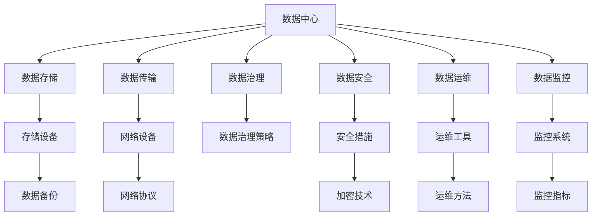

                 

# AI 大模型应用数据中心建设：数据中心技术与应用

> 关键词：数据中心, AI 大模型, 数据存储, 数据传输, 数据治理, 数据安全, 数据运维

## 1. 背景介绍

### 1.1 问题由来
随着人工智能(AI)技术的快速发展，大模型在语音识别、自然语言处理、计算机视觉等诸多领域取得了突破性进展。例如，深度学习模型GPT-3在语言生成、问答、文本理解等方面展现了强大的能力。然而，AI大模型的应用并非孤立存在，其背后是海量数据支持，对数据中心基础设施的需求日益增长。

数据中心是支撑AI大模型训练、推理和部署的关键设施。传统的IDC和云计算平台无法满足大模型对高吞吐、低延迟、高可靠性、高安全性的要求。为此，数据中心技术不断进步，AI大模型应用对数据中心的要求日益严格。数据中心技术与应用成为大模型成功部署的关键。

### 1.2 问题核心关键点
AI大模型应用对数据中心提出了高要求，具体包括：
1. 数据存储与传输：海量数据需要高效、可靠的数据存储和传输机制。
2. 数据治理与安全：数据隐私、安全和合规性管理。
3. 数据运维与监控：高效、实时的数据运维和监控系统。
4. 资源优化与弹性：高性能计算资源和网络资源的高效利用，支持按需扩展和灵活伸缩。

解决这些问题，不仅需要技术创新，还需要管理体系的支持。数据中心的建设和管理需兼顾硬件设施、软件系统和运营机制的协调。

## 2. 核心概念与联系

### 2.1 核心概念概述

要深入理解AI大模型数据中心建设，首先需要掌握相关核心概念：

1. **数据中心(Data Center, DC)**：存放和运行数据基础设施的场所，通常由物理设施、虚拟化平台、网络设备、存储设备等组成。
2. **AI大模型(AI Large Model)**：采用深度学习等算法训练出的超大规模模型，如BERT、GPT-3等，具有高度的参数量和计算需求。
3. **数据存储(Data Storage)**：将数据持久化存储到物理或虚拟磁盘中，以保证数据的可访问性和安全性。
4. **数据传输(Data Transfer)**：通过网络将数据在物理设备间或物理设备与应用程序间传递，是数据中心的核心功能之一。
5. **数据治理(Data Governance)**：管理数据的使用、存储、共享和保护，确保数据隐私和安全。
6. **数据运维(Data Operation & Maintenance, OM)**：监控和管理数据中心运行状态，包括性能监控、故障诊断、问题处理等。
7. **数据安全(Data Security)**：保护数据在存储、传输和应用过程中的机密性、完整性和可用性。
8. **数据运维与监控(Data Monitoring & Operation, M&O)**：通过系统监控和运维，确保数据中心的高效运行。

### 2.2 核心概念原理和架构的 Mermaid 流程图(Mermaid 流程节点中不要有括号、逗号等特殊字符)



此图展示了数据中心与相关核心概念的联系，说明了数据中心各组成部分如何协同工作，确保数据的安全、可靠和高效管理。

## 3. 核心算法原理 & 具体操作步骤
### 3.1 算法原理概述

AI大模型应用对数据中心的要求，涉及多个方面的技术，包括计算架构、网络架构、存储架构、安全架构和运维架构等。这些技术的核心在于算法和原理。

数据中心的核心算法主要包括以下几个方面：
1. **分布式计算**：多台计算服务器协同处理，提高计算能力。
2. **网络优化**：通过负载均衡、缓存、压缩等技术，提升数据传输效率。
3. **存储优化**：通过分布式文件系统、分布式数据库等，实现数据的可靠存储和快速访问。
4. **数据加密**：使用AES、RSA等算法对数据进行加密，保护数据安全。
5. **数据压缩**：使用无损压缩算法对数据进行压缩，减少存储和传输成本。
6. **数据备份与恢复**：通过定期备份和灾难恢复策略，保证数据的完整性和可用性。

### 3.2 算法步骤详解

基于核心算法，构建AI大模型数据中心的步骤如下：

**Step 1: 设计数据中心架构**

1. **确定计算需求**：根据AI大模型规模，确定所需的计算资源。
2. **选择硬件设施**：包括服务器、存储、网络设备等。
3. **设计网络拓扑**：确定网络设备如交换机、路由器等的布局和连接方式。
4. **部署分布式系统**：如Kubernetes、Docker等容器化平台，支持多台服务器协同工作。

**Step 2: 实现数据存储**

1. **选择合适的存储设备**：如Hadoop、Ceph等分布式存储系统。
2. **实现数据冗余**：通过数据备份、副本机制保障数据的可靠性。
3. **设计数据格式**：如使用Parquet、HDFS等格式，优化数据读写效率。

**Step 3: 实现数据传输**

1. **选择合适的网络协议**：如TCP/IP、HTTPS等，确保数据传输的可靠性和安全性。
2. **优化网络带宽**：使用负载均衡、缓存等技术，提高网络传输效率。
3. **使用网络虚拟化技术**：如SDN、NFV，实现网络的灵活配置和扩展。

**Step 4: 实现数据治理与安全**

1. **制定数据治理策略**：明确数据的使用、存储、共享和保护措施。
2. **实施数据加密**：使用AES、RSA等算法对数据进行加密，确保数据的安全性。
3. **设计访问控制**：通过ACL、RBAC等技术，控制数据的访问权限。

**Step 5: 实现数据运维与监控**

1. **部署运维工具**：如Nagios、Zabbix等，监控数据中心运行状态。
2. **设计运维流程**：包括系统监控、故障诊断、问题处理等。
3. **实现数据备份与恢复**：定期备份数据，实现灾难恢复。

**Step 6: 实现数据安全**

1. **实施网络安全措施**：如防火墙、VPN、IDS等。
2. **加强物理安全**：使用门禁系统、监控摄像头等保护物理设施。
3. **实施数据隐私保护**：如匿名化、脱敏等技术，保护用户隐私。

### 3.3 算法优缺点

AI大模型应用数据中心的优点包括：
1. **高性能计算能力**：分布式计算架构能够支持海量数据的高效处理。
2. **高可靠性与可用性**：数据冗余和备份机制保证数据的高可靠性。
3. **灵活扩展性**：基于虚拟化和容器化技术，支持按需扩展和资源优化。
4. **高效数据传输**：通过网络优化和虚拟化技术，保证数据传输的高效性。

同时，AI大模型应用数据中心也存在以下缺点：
1. **高成本投入**：大规模数据中心建设需要高额投资。
2. **复杂性高**：系统设计和运维复杂，需要专业团队支持。
3. **能耗高**：大规模计算和数据传输带来较高的能耗，需考虑节能措施。
4. **安全性问题**：数据中心设施和网络的安全性需特别注意。

### 3.4 算法应用领域

AI大模型应用数据中心涉及多个领域，包括但不限于：

1. **云计算平台**：如AWS、Google Cloud、Microsoft Azure等，提供高性能计算和数据存储服务。
2. **超算中心**：如国家超算中心，提供大模型训练所需的计算资源。
3. **边缘计算**：在靠近终端设备的计算节点上处理数据，减少延迟和带宽需求。
4. **智慧城市**：数据中心为城市管理和智慧应用提供数据存储和处理能力。
5. **科学研究**：如粒子物理、气象预报等领域，利用高性能计算资源支持大规模模拟实验。
6. **工业自动化**：数据中心为工业生产过程的优化和自动化提供计算支持。

## 4. 数学模型和公式 & 详细讲解 & 举例说明

### 4.1 数学模型构建

数据中心的核心算法涉及多个领域，包括计算架构、网络架构、存储架构、安全架构和运维架构等。以下是几个关键的数学模型：

1. **分布式计算模型**：通过MapReduce等算法，将计算任务分解为多个子任务，并行处理，提高计算效率。

2. **网络优化模型**：使用TCP/IP协议，通过负载均衡、缓存等技术，提升数据传输效率。

3. **存储优化模型**：使用分布式文件系统Hadoop，通过副本机制和压缩算法，提高数据的可靠性、可用性和存储效率。

4. **数据加密模型**：使用AES、RSA等算法，确保数据在存储和传输过程中的安全性。

5. **数据压缩模型**：使用无损压缩算法，减少数据的存储和传输成本。

6. **数据备份与恢复模型**：通过定期备份和灾难恢复策略，保证数据的完整性和可用性。

### 4.2 公式推导过程

以数据加密模型为例，介绍其中的数学原理：

**AES算法**：一种对称加密算法，密钥长度为128/192/256位。加密公式为：

$$
C = E_k(M)
$$

其中，$M$为明文，$C$为密文，$k$为密钥，$E_k$为加密函数。解密公式为：

$$
M' = D_k(C')
$$

其中，$M'$为解密后的明文，$C'$为解密后的密文，$D_k$为解密函数。

AES算法通过轮变换和S盒等步骤，实现数据的加密和解密，保障数据的安全性。

### 4.3 案例分析与讲解

**案例1：数据中心网络优化**

某企业需要在数据中心部署高性能计算集群，网络带宽和延迟要求极高。通过设计基于SDN的网络架构，实现网络虚拟化和流量控制，优化网络带宽和延迟，满足数据中心的计算需求。

具体实现步骤如下：
1. **部署SDN控制器**：如OpenDaylight、ONOS等，实现网络的集中管理。
2. **配置虚拟网络**：使用VLAN、VXLAN等技术，实现网络的灵活配置。
3. **实现负载均衡**：通过L4/L7负载均衡器，将流量均衡分配到各计算节点。
4. **优化流量控制**：使用主动队列管理(AQM)、动态拥塞控制(DCC)等技术，保证网络性能。

**案例2：数据中心存储优化**

某企业需要在数据中心存储海量数据，数据量大且访问频率高。通过部署分布式文件系统Hadoop，实现数据的可靠存储和快速访问，提高数据中心的存储效率。

具体实现步骤如下：
1. **部署Hadoop集群**：包括HDFS、HBase等组件，实现数据的分布式存储。
2. **优化数据格式**：使用Parquet格式，提升数据读写效率。
3. **实现数据备份**：通过数据副本和分布式文件系统，实现数据备份和冗余。
4. **优化数据访问**：通过Hadoop的访问接口，实现数据的快速访问。

## 5. 项目实践：代码实例和详细解释说明

### 5.1 开发环境搭建

开发AI大模型应用数据中心，需要以下开发环境和工具：

1. **Python编程环境**：如Anaconda、Jupyter Notebook等，支持Python编程和数据处理。
2. **分布式计算框架**：如Apache Spark、Hadoop等，实现分布式计算。
3. **数据存储系统**：如Hadoop、Ceph等，实现数据的分布式存储。
4. **网络优化工具**：如SDN控制器、负载均衡器等，优化数据传输。
5. **安全工具**：如防火墙、VPN、IDS等，保障数据安全。
6. **运维监控工具**：如Nagios、Zabbix等，实现数据中心的运维和监控。

### 5.2 源代码详细实现

以下是一个使用Python和Spark实现数据中心数据存储优化的示例代码：

```python
from pyspark.sql import SparkSession
from pyspark.sql.functions import col

# 创建SparkSession
spark = SparkSession.builder.appName("DataStorageOptimization").getOrCreate()

# 加载数据
df = spark.read.format("csv").option("header", "true").load("data.csv")

# 创建Parquet格式数据
df.write.parquet("hdfs:///user/data/output.parquet")

# 优化数据访问
df.select("id", "name").show()
```

上述代码演示了使用Spark进行数据存储和访问的实现过程。通过Spark的分布式计算和数据处理能力，实现数据的快速存储和访问。

### 5.3 代码解读与分析

**代码解读**：

1. **创建SparkSession**：通过SparkSession建立与数据中心的连接。
2. **加载数据**：使用CSV格式加载数据，并将其转换为Spark DataFrame。
3. **创建Parquet格式数据**：将数据转换为Parquet格式，并存储到HDFS中。
4. **优化数据访问**：通过选择部分列，展示数据处理结果。

**代码分析**：

1. **Spark的优势**：Spark提供了高效的数据处理和分布式计算能力，支持多种数据格式和存储系统。
2. **Parquet格式的优势**：Parquet格式支持高效的数据压缩和存储，提升数据访问速度。
3. **数据访问优化**：通过选择部分列展示数据，减少数据的传输和存储开销。

### 5.4 运行结果展示

通过上述代码，可以完成数据的加载、存储和访问优化，实现数据中心的高效数据存储和快速访问。

## 6. 实际应用场景

### 6.1 智慧医疗

在智慧医疗领域，AI大模型应用数据中心提供高性能计算和数据存储服务，支持医疗数据的存储、分析和处理。通过数据中心的高效计算能力，实现对海量医疗数据的快速处理，为医疗诊断、药物研发和健康管理等提供支持。

### 6.2 智慧城市

智慧城市建设需要高效、安全、可靠的数据中心设施。AI大模型应用数据中心为城市管理提供数据存储和处理能力，支持智慧交通、公共安全、环境监测等应用。

### 6.3 工业自动化

在工业自动化领域，AI大模型应用数据中心提供高性能计算资源和网络资源，支持工业生产过程的优化和自动化。通过数据中心的高效计算能力，实现工业生产的数字化、智能化转型。

### 6.4 未来应用展望

随着AI大模型的不断进步，数据中心的应用将更加广泛和深入。未来，数据中心将融合更多的先进技术，如AI、区块链、边缘计算等，提升数据中心的智能化和安全性。

## 7. 工具和资源推荐

### 7.1 学习资源推荐

1. **《分布式系统原理与设计》**：介绍分布式计算、网络、存储和运维等基本原理。
2. **《数据中心网络设计与优化》**：涵盖数据中心网络架构、设计和优化技术。
3. **《人工智能与数据科学》**：介绍AI大模型的训练、推理和应用。
4. **《数据治理与隐私保护》**：讲解数据治理、隐私保护和安全管理的理论和方法。
5. **《AI大模型应用实战》**：结合实际案例，讲解AI大模型在各行业的应用。

### 7.2 开发工具推荐

1. **Apache Spark**：高效的大规模数据处理引擎，支持多种数据格式和存储系统。
2. **Hadoop**：分布式文件系统和计算框架，实现海量数据的可靠存储和高效计算。
3. **SDN控制器**：如OpenDaylight、ONOS等，实现网络虚拟化和集中管理。
4. **Nagios**：监控工具，实现数据中心的运维和监控。
5. **AWS、Google Cloud、Microsoft Azure**：提供高性能计算和数据存储服务。

### 7.3 相关论文推荐

1. **《分布式计算：原理与算法》**：介绍分布式计算的原理和算法。
2. **《高性能网络设计与优化》**：涵盖数据中心网络架构、设计和优化技术。
3. **《数据存储系统设计与实现》**：介绍数据存储系统的设计与实现方法。
4. **《数据加密与隐私保护》**：讲解数据加密和隐私保护的理论和技术。
5. **《数据中心运维与监控》**：介绍数据中心运维和监控的理论和方法。

## 8. 总结：未来发展趋势与挑战

### 8.1 总结

本文对AI大模型应用数据中心的建设进行了全面系统的介绍，从核心概念、算法原理到具体操作步骤，深入浅出地讲解了数据中心建设的关键技术。AI大模型应用对数据中心提出了高要求，数据中心建设需兼顾计算能力、数据存储、网络传输、数据治理、安全运维等多个方面。未来，随着AI大模型的不断发展，数据中心建设也将随之进步，为AI大模型提供更可靠、更高效的基础设施支持。

### 8.2 未来发展趋势

未来，AI大模型应用数据中心将呈现以下几个发展趋势：

1. **绿色数据中心**：通过节能技术和可再生能源，减少数据中心的能耗，提升环保性。
2. **边缘计算**：通过在边缘设备上处理数据，减少数据传输延迟和带宽需求。
3. **多云协同**：在多个云平台间实现数据和计算资源的协同工作，提升数据中心的灵活性和扩展性。
4. **AI驱动运维**：通过AI技术实现数据中心的自动运维和监控，提升数据中心的智能化水平。
5. **数据隐私保护**：通过区块链、多方安全计算等技术，提升数据隐私保护能力。

### 8.3 面临的挑战

AI大模型应用数据中心在建设过程中，仍面临诸多挑战：

1. **高成本投入**：大规模数据中心建设需要高额投资。
2. **能耗问题**：大规模计算和数据传输带来较高的能耗，需考虑节能措施。
3. **安全问题**：数据中心设施和网络的安全性需特别注意。
4. **运维复杂性**：数据中心的运维和管理复杂，需专业团队支持。

### 8.4 研究展望

未来，需要在以下几个方面进行深入研究：

1. **计算架构优化**：通过异构计算、超算中心等技术，提升数据中心的计算能力。
2. **网络架构优化**：通过SDN、边缘计算等技术，提升数据中心的传输效率。
3. **存储架构优化**：通过分布式文件系统、对象存储等技术，提升数据中心的存储效率。
4. **安全架构优化**：通过区块链、多方安全计算等技术，提升数据中心的隐私保护能力。
5. **运维架构优化**：通过AI技术实现数据中心的自动运维和监控，提升数据中心的智能化水平。

## 9. 附录：常见问题与解答

**Q1: AI大模型应用数据中心与传统数据中心有何不同？**

A: AI大模型应用数据中心在计算能力、数据存储、网络传输、数据治理、安全运维等方面，有更高的要求。

**Q2: 数据中心如何实现高效的数据存储和传输？**

A: 通过分布式计算、网络虚拟化、数据压缩等技术，实现数据的高效存储和传输。

**Q3: 数据中心如何保障数据的安全性？**

A: 通过数据加密、访问控制、物理安全等措施，保障数据的安全性。

**Q4: 数据中心的运维和管理有哪些挑战？**

A: 数据中心的运维和管理复杂，需专业团队支持。

**Q5: 未来数据中心的发展方向有哪些？**

A: 绿色数据中心、边缘计算、多云协同、AI驱动运维、数据隐私保护等方向将不断发展。

---

作者：禅与计算机程序设计艺术 / Zen and the Art of Computer Programming

