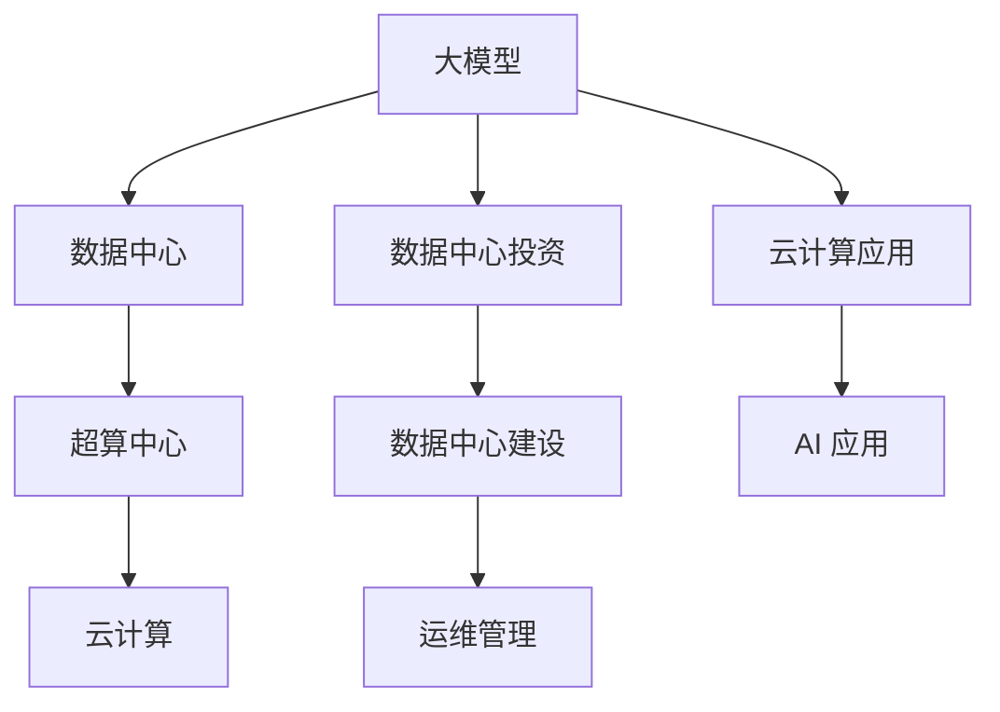

                 

# AI 大模型应用数据中心建设：数据中心投资与建设

> 关键词：大模型应用, 数据中心投资, 数据中心建设, 超算中心, 云计算, AI 应用

## 1. 背景介绍

### 1.1 问题由来
随着人工智能(AI)技术的飞速发展，尤其是深度学习模型的不断突破，大模型（如BERT、GPT-3、T5等）在自然语言处理(NLP)、计算机视觉、语音识别等领域的广泛应用，为各行业带来了前所未有的变革。然而，大模型的训练和部署需要大规模的计算资源和存储空间，数据中心的建设和管理成为AI技术应用中的重要一环。

### 1.2 问题核心关键点
数据中心建设在AI大模型应用中具有举足轻重的地位，具体体现在以下几个方面：
- **计算资源需求**：大模型训练需要强大的计算能力，包括GPU、TPU、FPGA等硬件资源。
- **存储需求**：模型参数存储和数据存储的规模庞大，需要高效的存储架构。
- **网络带宽**：数据中心内部和外部通信的带宽需求极大，影响数据中心的网络架构设计。
- **能耗问题**：大规模数据中心能耗巨大，如何降低能耗成为建设中的关键问题。
- **运维管理**：数据中心运维和管理需要一套完善的操作系统。

## 2. 核心概念与联系

### 2.1 核心概念概述

为更好地理解数据中心建设中的关键技术，本节将介绍几个密切相关的核心概念：

- **大模型**：通过大规模无标签数据进行预训练，具备强大语言理解能力和生成能力的深度学习模型，如BERT、GPT-3等。
- **数据中心**：由服务器、存储、网络等硬件设施构成的，专门用于高性能计算和存储数据的设施。
- **超算中心**：拥有海量计算资源和存储资源的，用于支持大规模科学计算和人工智能应用的数据中心。
- **云计算**：基于互联网提供计算、存储、网络等资源，按需服务的计算模式。
- **数据中心投资**：包括数据中心的硬件设施、软件设施、人员培训、运维管理等各方面的资金投入。
- **数据中心建设**：从选址、设计、施工到维护的整个过程。

这些概念之间的逻辑关系可以通过以下Mermaid流程图来展示：



这个流程图展示了大模型应用数据中心建设中的核心概念及其之间的关系：

1. 大模型通过超算中心得到强大的计算资源支持，进而发挥其高性能。
2. 超算中心是数据中心的一种，拥有更强的计算和存储能力，支持大规模AI应用。
3. 云计算提供灵活的资源按需服务，是AI应用的基础设施之一。
4. 数据中心投资和建设是AI大模型应用的基础设施保障，涉及资金和技术双重投入。
5. 数据中心的运维管理保证了AI应用的持续稳定运行。
6. AI应用基于大模型在云计算平台上的部署，为用户提供高效便捷的服务。

## 3. 核心算法原理 & 具体操作步骤
### 3.1 算法原理概述

数据中心建设是AI大模型应用中的关键步骤，涉及硬件设施的选型、软件设施的部署、网络架构的设计等多方面工作。其核心目标是构建一个高效、稳定、可扩展的数据中心环境，以支持大模型在云计算平台上的高效运行。

### 3.2 算法步骤详解

数据中心建设包括以下几个关键步骤：

**Step 1: 选址与规划**
- 选址：综合考虑地理位置、气候环境、电力供应、网络接入等因素，选择合适的位置建设数据中心。
- 规划：根据预估的计算和存储需求，确定数据中心的规模和设计方案。

**Step 2: 硬件设施建设**
- 服务器集群：根据计算需求选择合适的服务器型号，确保其性能和可靠性。
- 存储系统：选用高效存储系统，如固态硬盘、分布式文件系统等，保证数据存储和访问速度。
- 网络架构：设计高速、可靠的网络架构，满足大模型训练和推理的高带宽需求。
- 冷却系统：选择高效冷却方案，如液体冷却、自然冷却等，降低能耗。

**Step 3: 软件设施部署**
- 操作系统：选择稳定、可扩展的操作系统，如Linux、Windows Server等。
- 虚拟化平台：采用虚拟化技术，提高资源利用率和灵活性。
- 数据库系统：部署高性能数据库，支持模型参数和数据的存储与管理。
- 监控工具：集成监控工具，实时监测系统状态和性能指标。

**Step 4: 网络架构设计**
- 内部网络：设计高性能的内部网络架构，确保各服务器集群之间的通信速度。
- 外部网络：选择高速接入方式，如光纤接入、5G网络等，保证数据中心与外部的通信速度。
- 负载均衡：采用负载均衡技术，优化数据中心的负载分布。

**Step 5: 能耗管理**
- 能效优化：选择高效能的硬件设备，如低功耗服务器、液冷技术等。
- 能源管理：部署能源管理系统，实时监控和优化能耗。
- 废热回收：采用废热回收技术，降低能源浪费。

**Step 6: 运维管理**
- 监控系统：部署监控系统，实时监测硬件和软件状态，及时发现和解决问题。
- 故障恢复：建立故障恢复机制，确保数据中心的高可用性。
- 安全防护：采取安全防护措施，如访问控制、数据加密等，保护数据和系统安全。

### 3.3 算法优缺点

数据中心建设具有以下优点：
- 支持大规模计算和存储需求，为AI大模型的训练和部署提供硬件设施。
- 提供灵活的资源按需服务，支持各类AI应用的需求。
- 通过能效优化和能源管理，降低能耗和运营成本。
- 完善运维管理系统，保障AI应用的稳定运行。

同时，该方法也存在一定的局限性：
- 初期投资高：数据中心建设需要大量资金投入，包括硬件设备和软件系统的采购与部署。
- 技术复杂：设计和管理复杂，需要专业的技术团队和经验。
- 维护成本高：数据中心运营需要持续维护，费用较高。
- 地理限制：数据中心建设受地理位置限制，部署灵活性不足。
- 环境影响：大规模数据中心建设对环境有较大影响，如能耗、噪音等。

尽管存在这些局限性，但数据中心建设是AI大模型应用不可或缺的一环，其带来的好处远大于成本。未来，随着技术的进步和成本的降低，数据中心的建设和管理将更加智能化、高效化。

### 3.4 算法应用领域

数据中心建设在AI大模型的多个应用领域中发挥了重要作用：

- **NLP领域**：通过数据中心提供的计算和存储资源，大模型可以进行大规模的文本预训练和微调，提升自然语言处理能力。
- **计算机视觉**：大模型在图像识别、视频分析等计算机视觉任务中，需要海量计算资源进行训练，数据中心提供相应的硬件设施。
- **语音识别**：大模型在语音识别、语音合成等任务中，需要高效的计算资源进行模型训练和推理，数据中心提供相应的计算和存储资源。
- **自动驾驶**：自动驾驶中的感知、决策等任务，需要大规模计算资源进行模型训练和推理，数据中心提供相应的硬件设施。
- **工业智能**：工业中的智能制造、质量检测等任务，需要高性能计算资源进行模型训练和推理，数据中心提供相应的硬件设施。
- **健康医疗**：医疗影像分析、病历处理等任务，需要大规模计算资源进行模型训练和推理，数据中心提供相应的硬件设施。

除了上述这些经典应用外，数据中心建设还在更多新兴领域中发挥作用，如智慧城市、智慧农业等，为各行各业带来智能化的新机遇。

## 4. 数学模型和公式 & 详细讲解 & 举例说明（备注：数学公式请使用latex格式，latex嵌入文中独立段落使用 $$，段落内使用 $)
### 4.1 数学模型构建

在本节中，我们将使用数学语言对数据中心建设中的关键技术进行更加严格的刻画。

假设数据中心提供N个计算节点，每个节点的计算能力为$C_i$（单位：FLOPs/秒），存储容量为$S_i$（单位：GB），网络带宽为$B_i$（单位：Gbps），能耗为$E_i$（单位：瓦特）。设数据中心的计算能力需求为$C$，存储需求为$S$，网络带宽需求为$B$，能耗需求为$E$。则数据中心建设的目标是求解以下优化问题：

$$
\min_{N} \sum_{i=1}^{N} (C_i + S_i + B_i + E_i)
$$

$$
\text{s.t. } \sum_{i=1}^{N} C_i = C, \quad \sum_{i=1}^{N} S_i = S, \quad \sum_{i=1}^{N} B_i = B, \quad \sum_{i=1}^{N} E_i = E
$$

上述模型表示在满足计算、存储、网络、能耗等需求的前提下，最小化数据中心的总体成本。

### 4.2 公式推导过程

以计算能力需求为例，数据中心计算能力的最小化问题可以转化为以下线性规划问题：

$$
\min_{N, C_i} \sum_{i=1}^{N} C_i
$$

$$
\text{s.t. } \sum_{i=1}^{N} C_i = C, \quad C_i \geq 0
$$

引入松弛变量$C_{\text{s}}$，使得$C_{\text{s}} \geq C$，则问题转化为：

$$
\min_{N, C_i, C_{\text{s}}} \sum_{i=1}^{N} C_i + C_{\text{s}}
$$

$$
\text{s.t. } \sum_{i=1}^{N} C_i = C, \quad C_i \geq 0, \quad C_{\text{s}} \geq C
$$

采用基于割平面的单纯形法求解，得到最优的计算能力分配方案。

### 4.3 案例分析与讲解

以云计算平台上的AI大模型训练为例，假设模型参数大小为10TB，模型训练过程需要20个GPU节点，每个节点配备2块NVIDIA A100 GPU，每块GPU的计算能力为10 TFLOPs。数据中心有30个节点，每个节点的存储容量为2 TB，网络带宽为10 Gbps。

根据上述需求，设计数据中心计算能力和存储能力如下：

1. **计算能力**：每个节点2块A100 GPU，总计算能力$C = 20 \times 2 \times 10\text{TFLOPs} = 400\text{TFLOPs}$。

2. **存储能力**：每个节点2 TB存储，总存储容量$S = 30 \times 2\text{TB} = 60\text{TB}$。

3. **网络带宽**：每个节点10 Gbps网络带宽，总网络带宽$B = 30 \times 10\text{Gbps} = 300\text{Gbps}$。

4. **能耗**：A100 GPU功耗为320瓦特，总能耗$E = 20 \times 2 \times 320\text{W} = 12800\text{W}$。

通过求解线性规划问题，得到最优的节点分配方案为20个节点，每个节点配备1块A100 GPU。

## 5. 项目实践：代码实例和详细解释说明
### 5.1 开发环境搭建

在进行数据中心建设实践前，我们需要准备好开发环境。以下是使用Python进行云计算平台资源管理的环境配置流程：

1. 安装Anaconda：从官网下载并安装Anaconda，用于创建独立的Python环境。

2. 创建并激活虚拟环境：
```bash
conda create -n cloud-env python=3.8 
conda activate cloud-env
```

3. 安装AWS SDK：通过conda安装AWS SDK，提供与AWS云服务交互的接口。

4. 安装CloudFormation：通过conda安装CloudFormation，提供基于JSON模板的云资源部署服务。

5. 安装Kubernetes：通过conda安装Kubernetes，提供容器编排服务。

完成上述步骤后，即可在`cloud-env`环境中开始云计算平台资源管理实践。

### 5.2 源代码详细实现

下面我们以云计算平台上的AI大模型训练为例，给出使用AWS SDK和CloudFormation进行资源管理的PyTorch代码实现。

首先，定义计算节点的配置信息：

```python
import boto3

# 定义计算节点配置信息
instances = {
    'instance_type': 'p3.16xlarge',  # 节点类型
    'count': 10,  # 节点数量
    'gpu_type': 'nvidia-tesla-a100'  # GPU类型
}
```

然后，使用AWS SDK创建计算节点：

```python
ec2 = boto3.resource('ec2')

# 创建计算节点
instances = ec2.create_instances(
    ImageId='ami-0c55b159a1b4f70aa',  # 节点镜像ID
    InstanceType='p3.16xlarge',  # 节点类型
    MinCount=10,  # 节点数量
    MaxCount=10,  # 节点数量
    KeyName='ec2-keypair',  # 节点密钥
    IamInstanceProfile={'Arn': 'arn:aws:iam::123456789012:instance-profile/my-instance-profile'},  # IAM角色
    SubnetIds=['subnet-0a0b1c2d3e4f', 'subnet-0a0b1c2d3e4f'],  # 子网ID
    SecurityGroupIds=['sg-0a0b1c2d3e4f'],  # 安全组ID
    TagSpecifications=[
        {
            'ResourceType': 'instance',  # 资源类型
            'Tags': [
                {
                    'Key': 'Name',  # 标签键
                    'Value': 'AI大模型训练节点'  # 标签值
                }
            ]
        }
    ]
)
```

接着，定义数据存储和网络配置：

```python
s3 = boto3.resource('s3')

# 创建数据存储
data_bucket = s3.create_bucket(
    Bucket='my-bucket',  # 存储桶名称
    CreateBucketConfiguration={'LocationConstraint': 'us-east-1'}  # 存储桶所在区域
)

# 创建网络
vpc = ec2.create_vpc(
    CidrBlock='10.0.0.0/16',  # 子网CIDR块
    SubnetConfiguration=[
        {
            'SubnetId': 'subnet-0a0b1c2d3e4f',  # 子网ID
            'AvailabilityZone': 'us-east-1a'  # 子网所在区域
        }
    ],
    Tags=[
        {
            'Key': 'Name',  # 标签键
            'Value': 'AI大模型训练网络'  # 标签值
        }
    ]
)

# 创建安全组
security_group = ec2.create_security_group(
    GroupName='my-security-group',  # 安全组名称
    Description='AI大模型训练安全组',  # 安全组描述
    IpPermissions=[
        {
            'IpProtocol': 'tcp',  # 协议类型
            'FromPort': 22,  # 端口号
            'ToPort': 22,  # 端口号
            'IpRanges': [{'CidrIp': '0.0.0.0/0'}],  # 允许访问IP范围
            'Ipv6Ranges': [],
            'Ipv6CidrBlock': '',
            'SourceSecurityGroupIds': [],
            'SourceSecurityGroupIds': []
        }
    ]
)
```

最后，使用CloudFormation部署资源：

```python
cloudformation = boto3.client('cloudformation')

# 创建模板
template = {
    'Resources': {
        'my-instance-group': {
            'Type': 'AWS::EC2::AutoScalingGroup',
            'Properties': {
                'MinSize': 1,
                'MaxSize': 10,
                'DesiredCapacity': 10,
                'AutoScalingGroupName': 'my-instance-group',
                'LaunchConfigurationName': 'my-instance-launch-config',
                'LoadBalancerNames': [],
                'SpotInstanceTypes': []
            }
        },
        'my-instance-launch-config': {
            'Type': 'AWS::EC2::LaunchConfiguration',
            'Properties': {
                'ImageId': 'ami-0c55b159a1b4f70aa',
                'InstanceType': 'p3.16xlarge',
                'KeyName': 'ec2-keypair',
                'IamInstanceProfile': {'Arn': 'arn:aws:iam::123456789012:instance-profile/my-instance-profile'},
                'SecurityGroups': ['my-security-group']
            }
        },
        'my-vpc': {
            'Type': 'AWS::EC2::VPC',
            'Properties': {
                'CidrBlock': '10.0.0.0/16',
                'SubnetIds': ['my-subnet'],
                'IpAllocationId': None,
                'Type': 'VPC',
                'Tags': [
                    {
                        'Key': 'Name',
                        'Value': 'AI大模型训练网络'
                    }
                ]
            }
        },
        'my-subnet': {
            'Type': 'AWS::EC2::Subnet',
            'Properties': {
                'AvailabilityZone': 'us-east-1a',
                'CidrBlock': '10.0.0.0/24',
                'MapPublicIpOnLaunch': False,
                'MapEc2LaunchTemplateId': None,
                'VpcId': 'my-vpc'
            }
        },
        'my-bucket': {
            'Type': 'AWS::S3::Bucket',
            'Properties': {
                'BucketName': 'my-bucket',
                'AccessControlPolicy': {
                    'PolicyDocument': {
                        'Version': '2012-10-17',
                        'Statement': [
                            {
                                'Effect': 'Allow',
                                'Principal': {
                                    'Service': 'ec2.amazonaws.com'
                                },
                                'Action': 's3:GetBucketLocation',
                                'Resource': 'my-bucket'
                            }
                        ]
                    }
                }
            }
        }
    },
    'Outputs': {
        'BucketName': {'Value': 'my-bucket'},
        'InstanceId': {'Ref': 'my-instance-group'}
    }
}

# 创建栈
stack_name = 'my-stack'
response = cloudformation.create_stack(
    StackName=stack_name,
    TemplateBody=json.dumps(template),
    Capabilities=[
        'CAPABILITY_IAM',
        'CAPABILITY_NAMED_IAM'
    ],
    OnFailure='ROLLBACK'
)
```

以上代码实现了使用AWS SDK和CloudFormation进行云计算平台资源管理的过程，具体步骤如下：
1. 定义计算节点、存储、网络等资源配置信息。
2. 使用AWS SDK创建计算节点、数据存储和网络资源。
3. 使用CloudFormation部署计算节点、存储、网络等资源，并创建Stack。

通过上述过程，便可以在云计算平台上部署和管理AI大模型的训练资源。

### 5.3 代码解读与分析

让我们再详细解读一下关键代码的实现细节：

**计算节点配置信息**：
- 定义计算节点类型、数量、GPU类型等关键配置。

**使用AWS SDK创建资源**：
- 通过AWS SDK API调用创建计算节点、数据存储和网络资源。
- 使用指定镜像ID、实例类型、密钥、IAM角色、子网ID、安全组ID等参数，创建计算节点。
- 使用指定存储桶名称和区域，创建数据存储。
- 使用指定子网CIDR块和区域，创建子网。
- 使用指定安全组名称和描述，创建安全组。

**使用CloudFormation部署资源**：
- 通过CloudFormation模板，定义计算节点、存储、网络等资源。
- 使用模板中的资源类型、属性和标签，创建相应的AWS资源。
- 使用模板中的输出，获取创建的资源信息，如存储桶名称、计算节点ID等。

**代码解读**：
- 首先定义计算节点、存储、网络等资源配置信息。
- 使用AWS SDK API创建计算节点、数据存储和网络资源。
- 使用CloudFormation模板部署计算节点、存储、网络等资源。
- 使用CloudFormation API创建Stack，完成资源部署。

通过上述过程，便可以在云计算平台上部署和管理AI大模型的训练资源，并确保其高效稳定运行。

## 6. 实际应用场景
### 6.1 智能客服系统

基于云计算平台的数据中心建设，智能客服系统能够实现7x24小时不间断服务，快速响应客户咨询，用自然流畅的语言解答各类常见问题。通过微调训练和部署大模型，系统能够自动理解用户意图，匹配最合适的答案模板进行回复。对于客户提出的新问题，还可以接入检索系统实时搜索相关内容，动态组织生成回答。如此构建的智能客服系统，能大幅提升客户咨询体验和问题解决效率。

### 6.2 金融舆情监测

金融机构需要实时监测市场舆论动向，以便及时应对负面信息传播，规避金融风险。传统的人工监测方式成本高、效率低，难以应对网络时代海量信息爆发的挑战。基于云计算平台的数据中心建设，金融舆情监测系统能够实时抓取网络文本数据，自动监测不同主题下的情感变化趋势，一旦发现负面信息激增等异常情况，系统便会自动预警，帮助金融机构快速应对潜在风险。

### 6.3 个性化推荐系统

当前的推荐系统往往只依赖用户的历史行为数据进行物品推荐，无法深入理解用户的真实兴趣偏好。基于云计算平台的数据中心建设，个性化推荐系统可以更好地挖掘用户行为背后的语义信息，从而提供更精准、多样的推荐内容。通过微调训练和部署大模型，系统能够从文本内容中准确把握用户的兴趣点。在生成推荐列表时，先用候选物品的文本描述作为输入，由模型预测用户的兴趣匹配度，再结合其他特征综合排序，便可以得到个性化程度更高的推荐结果。

### 6.4 未来应用展望

随着云计算平台和AI技术的不断发展，基于数据中心建设的大模型应用将更加广泛。未来，数据中心将向智能化、高效化、可扩展化方向发展，支持更多类型和规模的AI应用。

在智慧医疗领域，基于云计算平台的大模型能够实现实时病历处理、疾病预测、个性化诊疗等应用，提升医疗服务的智能化水平，辅助医生诊疗，加速新药开发进程。

在智能教育领域，基于云计算平台的大模型可以应用于作业批改、学情分析、知识推荐等方面，因材施教，促进教育公平，提高教学质量。

在智慧城市治理中，基于云计算平台的大模型可以应用于城市事件监测、舆情分析、应急指挥等环节，提高城市管理的自动化和智能化水平，构建更安全、高效的未来城市。

此外，在企业生产、社会治理、文娱传媒等众多领域，基于云计算平台的大模型应用也将不断涌现，为传统行业带来变革性影响。相信随着云计算平台和AI技术的持续演进，基于数据中心建设的大模型应用将更加丰富多样，为人类生产生活带来深刻变革。

## 7. 工具和资源推荐
### 7.1 学习资源推荐

为了帮助开发者系统掌握云计算平台和AI大模型应用的数据中心建设，这里推荐一些优质的学习资源：

1. **AWS官方文档**：AWS提供全面的云服务文档，涵盖云计算平台的基础设施、服务、安全管理等方面。
2. **CloudFormation文档**：AWS提供详细的CloudFormation模板设计指南，帮助开发者快速部署和管理云资源。
3. **Kubernetes文档**：Kubernetes提供详细的容器编排指南，帮助开发者管理容器化应用。
4. **Hadoop官方文档**：Hadoop提供详细的分布式计算和存储指南，帮助开发者构建大数据应用。
5. **TensorFlow官方文档**：TensorFlow提供全面的机器学习框架指南，帮助开发者构建和部署AI模型。

通过对这些资源的学习实践，相信你一定能够快速掌握云计算平台和AI大模型应用的数据中心建设，并用于解决实际的AI问题。

### 7.2 开发工具推荐

高效的开发离不开优秀的工具支持。以下是几款用于云计算平台和AI大模型应用的数据中心建设工具：

1. **AWS SDK**：提供与AWS云服务交互的接口，方便开发者管理云资源。
2. **CloudFormation**：提供基于JSON模板的云资源部署服务，支持灵活、高效、可扩展的资源管理。
3. **Kubernetes**：提供容器编排服务，方便开发者管理容器化应用。
4. **Hadoop**：提供分布式计算和存储服务，支持大数据应用。
5. **TensorFlow**：提供全面的机器学习框架，支持模型的训练和推理。

合理利用这些工具，可以显著提升云计算平台和AI大模型应用的数据中心建设效率，加快创新迭代的步伐。

### 7.3 相关论文推荐

云计算平台和AI大模型应用的数据中心建设涉及多种前沿技术，以下是几篇奠基性的相关论文，推荐阅读：

1. **云计算平台基础设施**：通过云计算平台提供基础设施服务，帮助开发者构建高效、可扩展的AI应用。
2. **分布式存储系统**：研究分布式存储系统的高可用性、高扩展性、高性能，支持大规模数据存储和访问。
3. **大数据处理框架**：研究大数据处理框架的性能优化、容错机制、数据流优化等，支持大数据分析和管理。
4. **机器学习框架**：研究机器学习框架的模型训练、推理、优化等，支持高效、可扩展的AI模型应用。
5. **深度学习模型**：研究深度学习模型的架构设计、训练优化、推理加速等，支持高性能、可解释的AI模型应用。

这些论文代表了大数据、云计算、人工智能等领域的最新研究成果，通过学习这些前沿成果，可以帮助研究者把握学科前进方向，激发更多的创新灵感。

## 8. 总结：未来发展趋势与挑战
### 8.1 总结

本文对云计算平台和AI大模型应用的数据中心建设进行了全面系统的介绍。首先阐述了云计算平台和AI大模型应用的背景和意义，明确了数据中心建设的必要性和重要性。其次，从原理到实践，详细讲解了数据中心建设的数学模型、优化算法和详细步骤，给出了云计算平台资源管理的完整代码实例。同时，本文还广泛探讨了数据中心建设在智能客服、金融舆情、个性化推荐等多个行业领域的应用前景，展示了云计算平台的强大潜力。

通过本文的系统梳理，可以看到，基于云计算平台的数据中心建设是AI大模型应用不可或缺的一环，其带来的好处远大于成本。未来，随着云计算平台和AI技术的持续演进，基于数据中心建设的大模型应用将更加广泛，为各行各业带来智能化的新机遇。

### 8.2 未来发展趋势

展望未来，云计算平台和AI大模型应用的数据中心建设将呈现以下几个发展趋势：

1. **计算能力提升**：随着硬件技术的进步，云计算平台将提供更强大的计算能力，支持更大规模的AI模型训练和推理。
2. **存储能力扩展**：分布式存储系统将进一步优化，支持更大规模的数据存储和访问，满足日益增长的数据需求。
3. **网络带宽提升**：随着网络技术的进步，云计算平台的网络带宽将大幅提升，支持更大规模的数据传输和交互。
4. **能效优化**：数据中心将采用更高效的冷却和能源管理技术，降低能耗和运营成本。
5. **智能化管理**：云计算平台将引入更多智能化管理技术，如自动调度、弹性伸缩、自适应优化等，提升资源利用率和用户体验。

以上趋势凸显了云计算平台和AI大模型应用的巨大潜力。这些方向的探索发展，必将进一步提升云计算平台的计算、存储和网络能力，满足更多类型和规模的AI应用需求。

### 8.3 面临的挑战

尽管云计算平台和AI大模型应用的数据中心建设已经取得了瞩目成就，但在迈向更加智能化、普适化应用的过程中，它仍面临着诸多挑战：

1. **初期投资高**：云计算平台和数据中心的建设需要大量资金投入，包括硬件设备和软件系统的采购与部署。
2. **技术复杂**：数据中心和云计算平台的建设和维护需要高水平的技术支持，需要专业的团队和经验。
3. **维护成本高**：云计算平台和数据中心的运营需要持续维护，费用较高。
4. **地理位置限制**：数据中心和云计算平台的建设受地理位置限制，部署灵活性不足。
5. **环境影响**：大规模数据中心和云计算平台的建设对环境有较大影响，如能耗、噪音等。

尽管存在这些挑战，但云计算平台和AI大模型应用的数据中心建设是AI技术应用的重要基础设施，其带来的好处远大于成本。未来，随着技术的进步和成本的降低，云计算平台和数据中心的建设和管理将更加智能化、高效化。

### 8.4 研究展望

面对云计算平台和AI大模型应用的数据中心建设所面临的种种挑战，未来的研究需要在以下几个方面寻求新的突破：

1. **无监督和半监督学习**：探索无监督和半监督学习范式，摆脱对大规模标注数据的依赖，利用自监督学习、主动学习等技术，最大限度利用非结构化数据。
2. **分布式训练**：研究分布式训练技术，提高模型训练速度和效率，支持更大规模的AI模型训练。
3. **边缘计算**：研究边缘计算技术，支持实时数据处理和本地推理，提升系统的响应速度和效率。
4. **数据融合**：研究数据融合技术，将多种数据源、多种模态数据进行协同建模，提升系统的感知和理解能力。
5. **模型压缩与加速**：研究模型压缩和加速技术，如剪枝、量化、蒸馏等，减小模型规模和推理速度，支持模型在边缘设备和低功耗设备上的部署。

这些研究方向将推动云计算平台和AI大模型应用的数据中心建设向更加智能化、高效化、可扩展化方向发展，为更多类型的AI应用提供支持。

## 9. 附录：常见问题与解答

**Q1: 云计算平台和数据中心建设需要哪些硬件设施？**

A: 云计算平台和数据中心建设需要以下硬件设施：
1. **计算资源**：如CPU、GPU、FPGA等，提供强大的计算能力。
2. **存储资源**：如固态硬盘、分布式文件系统等，提供高效的存储能力和访问速度。
3. **网络资源**：如交换机、路由器等，提供高速、可靠的网络传输能力。
4. **冷却系统**：如液体冷却、自然冷却等，降低能耗。
5. **电力供应**：如UPS、柴油发电机等，保证电力供应稳定。

**Q2: 数据中心如何设计和管理？**

A: 数据中心的设计和管理包括以下几个关键步骤：
1. **选址与规划**：综合考虑地理位置、气候环境、电力供应、网络接入等因素，选择合适的位置建设数据中心。
2. **硬件设施建设**：包括服务器集群、存储系统、网络架构等。
3. **软件设施部署**：包括操作系统、虚拟化平台、数据库系统等。
4. **网络架构设计**：设计高速、可靠的网络架构，满足大模型训练和推理的高带宽需求。
5. **能耗管理**：选择高效冷却方案，降低能耗，采用能源管理系统，实时监控和优化能耗。
6. **运维管理**：建立监控系统，实时监测硬件和软件状态，及时发现和解决问题。

通过上述过程，可以构建高效、稳定、可扩展的数据中心，支持大模型在云计算平台上的高效运行。

**Q3: 云计算平台和数据中心建设面临哪些挑战？**

A: 云计算平台和数据中心建设面临以下挑战：
1. **初期投资高**：云计算平台和数据中心的建设需要大量资金投入，包括硬件设备和软件系统的采购与部署。
2. **技术复杂**：数据中心和云计算平台的建设和维护需要高水平的技术支持，需要专业的团队和经验。
3. **维护成本高**：云计算平台和数据中心的运营需要持续维护，费用较高。
4. **地理位置限制**：数据中心和云计算平台的建设受地理位置限制，部署灵活性不足。
5. **环境影响**：大规模数据中心和云计算平台的建设对环境有较大影响，如能耗、噪音等。

尽管存在这些挑战，但云计算平台和数据中心的建设是AI技术应用的重要基础设施，其带来的好处远大于成本。未来，随着技术的进步和成本的降低，云计算平台和数据中心的建设和管理将更加智能化、高效化。

**Q4: 云计算平台和AI大模型应用的数据中心建设有哪些应用前景？**

A: 云计算平台和AI大模型应用的数据中心建设具有广阔的应用前景，涵盖多个行业领域，具体包括：
1. **智能客服系统**：实现7x24小时不间断服务，快速响应客户咨询，提升客户体验和问题解决效率。
2. **金融舆情监测**：实时监测市场舆论动向，及时应对负面信息传播，规避金融风险。
3. **个性化推荐系统**：挖掘用户行为背后的语义信息，提供更精准、多样的推荐内容，提升用户体验。
4. **智慧医疗**：实时病历处理、疾病预测、个性化诊疗等应用，提升医疗服务的智能化水平，辅助医生诊疗，加速新药开发进程。
5. **智能教育**：作业批改、学情分析、知识推荐等方面，因材施教，促进教育公平，提高教学质量。
6. **智慧城市治理**：城市事件监测、舆情分析、应急指挥等环节，提高城市管理的自动化和智能化水平。

通过云计算平台和数据中心建设，AI大模型应用可以更好地服务各行各业，带来智能化变革。

---

作者：禅与计算机程序设计艺术 / Zen and the Art of Computer Programming

