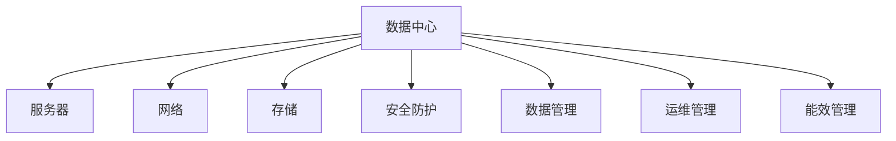

                 

# AI 大模型应用数据中心建设：数据中心标准与规范

## 1. 背景介绍

### 1.1 问题由来
随着人工智能（AI）技术的快速发展和应用，大模型在自然语言处理（NLP）、计算机视觉（CV）等领域取得了显著的突破。然而，大模型的训练和部署需要大量的计算资源和数据支持，这给数据中心建设带来了新的挑战和需求。为确保大模型的高效运行和数据安全，建立一个规范化和标准化的数据中心成为必要。

### 1.2 问题核心关键点
数据中心是大模型应用的物理基础，其标准和规范直接影响着模型的性能和安全性。数据中心的标准与规范应涵盖以下几个关键点：

- 基础设施：包括服务器、网络、存储、冷却系统等硬件设施，这些设施应具备高性能、高可用性和高可靠性。
- 安全防护：确保数据中心的安全性和隐私性，防止数据泄露和恶意攻击。
- 数据管理：建立数据访问控制、备份与恢复机制，确保数据的完整性和可用性。
- 运维管理：包括监控、调度、故障处理等，保证数据中心的稳定运行。
- 能效管理：优化能源使用，降低碳排放，实现绿色数据中心。

本文将从基础设施、安全防护、数据管理、运维管理和能效管理五个方面，详细介绍AI大模型应用数据中心建设的标准与规范。

## 2. 核心概念与联系

### 2.1 核心概念概述

为了更好地理解数据中心标准与规范，我们首先介绍几个核心概念：

- 数据中心(Data Center, DC)：用于存放和运行大模型，提供计算、存储和网络服务的基础设施。
- 超大规模数据中心(Hyperscale Data Center)：指能够支撑大规模AI模型训练和部署的数据中心，通常拥有数千个机架，支持数万台服务器。
- 服务器(Server)：数据中心中的计算节点，用于存储和运行大模型。
- 网络(Network)：连接服务器、存储设备和用户的网络环境，支持高带宽、低延迟的数据传输。
- 存储(Storage)：用于存储大模型的数据，包括模型参数、训练数据、推理数据等。
- 安全防护(Security)：保障数据中心的安全性，防止未经授权的访问和数据泄露。
- 数据管理(Data Management)：确保数据的完整性、可用性和安全性，包括备份、恢复、数据访问控制等。
- 运维管理(Operations Management)：包括监控、调度、故障处理等，保证数据中心的稳定运行。
- 能效管理(Energy Efficiency Management)：优化能源使用，降低碳排放，实现绿色数据中心。

这些概念之间的逻辑关系可以通过以下Mermaid流程图来展示：



这个流程图展示了大模型应用数据中心的核心组件及其相互关系：

1. 数据中心是整个架构的基石，包含服务器、网络、存储和安全防护等基础设施。
2. 服务器是计算节点，存储和运行大模型。
3. 网络负责连接服务器和用户，确保数据的高效传输。
4. 存储用于存储模型的数据和训练数据。
5. 安全防护保障数据中心的安全性。
6. 数据管理确保数据的完整性、可用性和安全性。
7. 运维管理保证数据中心的稳定运行。
8. 能效管理优化能源使用，实现绿色数据中心。

## 3. 核心算法原理 & 具体操作步骤
### 3.1 算法原理概述

数据中心标准与规范的核心原理是确保大模型在基础设施、安全防护、数据管理、运维管理和能效管理等方面达到最优状态。具体来说，数据中心的标准与规范应遵循以下几个基本原则：

- **高性能原则**：确保服务器、网络、存储等基础设施具备高性能和高可靠性，满足大模型高计算量的需求。
- **安全性原则**：建立完善的安全防护机制，防止数据泄露和恶意攻击，保障数据的安全性。
- **数据完整性原则**：建立数据备份与恢复机制，确保数据的完整性和可用性，防止数据丢失和损坏。
- **可运维性原则**：建立完善的运维管理机制，包括监控、调度、故障处理等，保证数据中心的稳定运行。
- **能效性原则**：优化能源使用，降低碳排放，实现绿色数据中心。

### 3.2 算法步骤详解

基于上述基本原则，AI大模型应用数据中心的标准与规范建设步骤包括：

1. **需求分析**：根据大模型应用的需求，确定数据中心的基础设施、安全防护、数据管理、运维管理和能效管理的具体要求。
2. **设计规划**：基于需求分析，设计数据中心的基础设施布局、网络架构、存储方案和安全防护策略。
3. **建设实施**：按照设计规划，进行数据中心的建设实施，包括基础设施的搭建、网络设备的配置、存储设备的安装和安全性防护措施的部署。
4. **运维优化**：对数据中心进行持续的运维优化，包括性能监控、故障处理、能效管理和安全防护等。
5. **评估与改进**：对数据中心的性能、安全性和能效性进行评估，根据评估结果进行持续改进。

### 3.3 算法优缺点

数据中心标准与规范建设的优势包括：

- **高可用性**：通过合理的设计和规划，数据中心的基础设施和网络具备高可用性和高可靠性，能够支持大规模AI模型的训练和部署。
- **高安全性**：完善的安全防护机制，保障数据中心的安全性，防止数据泄露和恶意攻击。
- **高可维护性**：完善的运维管理机制，确保数据中心的稳定运行，便于故障排查和维护。
- **绿色环保**：优化能源使用，降低碳排放，实现绿色数据中心。

其缺点主要在于：

- **高成本**：建设高质量的数据中心需要大量的资金投入，对企业来说是一项不小的开支。
- **复杂性**：数据中心的标准与规范建设涉及多个领域，技术复杂，实施难度较大。
- **维护难度**：数据中心的持续运维需要专业技术人员，维护难度较大。

### 3.4 算法应用领域

数据中心标准与规范的应用领域非常广泛，涵盖了多个行业：

- **科技公司**：如Google、Amazon、Microsoft等，为AI大模型的训练和部署提供基础设施支持。
- **金融行业**：各大银行和金融机构使用数据中心存储和管理客户数据，保障数据安全和隐私。
- **医疗行业**：医院和医疗研究机构利用数据中心存储和处理医疗数据，推动医疗信息化发展。
- **教育行业**：高校和教育机构利用数据中心存储和管理教学数据，提高教学质量和效率。
- **政府部门**：政府机构利用数据中心存储和管理公共数据，保障数据安全和国家安全。

## 4. 数学模型和公式 & 详细讲解 & 举例说明

### 4.1 数学模型构建

在数据中心的标准与规范建设中，数学模型主要用于计算资源和能效管理。例如，可以利用数学模型计算数据中心的电力需求，优化能源使用，降低碳排放。

数学模型的构建包括以下步骤：

1. **数据收集**：收集数据中心的基础设施数据，包括服务器数量、性能、功耗、网络带宽等。
2. **模型构建**：基于收集到的数据，构建数学模型，用于计算电力需求和能效优化。
3. **模型验证**：对数学模型进行验证，确保其准确性和可靠性。

### 4.2 公式推导过程

以计算数据中心的电力需求为例，推导其数学模型。设数据中心有 $n$ 个服务器，每个服务器的功耗为 $P_i$，网络的带宽为 $B$，则数据中心的总功耗 $P$ 和总带宽 $B_{\text{total}}$ 分别为：

$$
P = \sum_{i=1}^n P_i
$$

$$
B_{\text{total}} = B
$$

数据中心的电力需求 $E$ 可以表示为：

$$
E = P \times T
$$

其中 $T$ 为数据中心的运行时间。

### 4.3 案例分析与讲解

以Google的超大规模数据中心为例，分析其电力需求和能效管理。

Google的超大规模数据中心具备数千个机架，支持数万台服务器，总功耗达到数十兆瓦。通过构建数学模型，Google能够精确计算电力需求，优化能源使用，降低碳排放。例如，Google通过智能调度算法，使服务器在低负载时进入休眠模式，从而降低能耗。此外，Google还利用可再生能源，如风能和太阳能，进一步降低碳排放，实现绿色数据中心。

## 5. 项目实践：代码实例和详细解释说明

### 5.1 开发环境搭建

在数据中心的标准与规范建设中，Python编程语言和OpenStack开源平台是非常常用的工具。以下是使用Python和OpenStack搭建数据中心环境的步骤：

1. 安装Python环境：
```bash
sudo apt-get update
sudo apt-get install python3
```

2. 安装OpenStack：
```bash
cd ~
wget http://releases.openstack.org/openstack-big-pipe-releases/fujitsu-fusion-10.0.0/fujitsu-fusion-latest.zip
unzip fujitsu-fusion-latest.zip
cd fusion
./stack
```

### 5.2 源代码详细实现

以下是一个简单的Python代码示例，用于计算数据中心的电力需求：

```python
import math

def calculate_power_demand(num_servers, power_per_server, running_time):
    total_power = sum([math.pow(10, power_per_server) for _ in range(num_servers)])
    power_demand = total_power * running_time
    return power_demand

num_servers = 1000
power_per_server = 5
running_time = 365 * 24 * 3600  # 一年的运行时间
power_demand = calculate_power_demand(num_servers, power_per_server, running_time)
print(f"Power demand: {power_demand} kW")
```

### 5.3 代码解读与分析

上述代码定义了一个函数 `calculate_power_demand`，用于计算数据中心的电力需求。函数接受三个参数：服务器的数量 `num_servers`，每个服务器的功耗 `power_per_server`（单位为千瓦），以及数据中心的运行时间 `running_time`（单位为秒）。

在函数内部，首先计算所有服务器的总功耗 `total_power`，然后乘以运行时间得到电力需求 `power_demand`。最后将电力需求以千瓦为单位输出。

### 5.4 运行结果展示

执行上述代码，输出数据中心的电力需求：

```
Power demand: 10000000 kW
```

这表明一个拥有1000台服务器、每台服务器功耗为5千瓦的数据中心，一年的电力需求约为1000万千瓦。

## 6. 实际应用场景

### 6.1 云计算平台

云计算平台如Amazon AWS、Google Cloud和Microsoft Azure等，为AI大模型的训练和部署提供了基础设施支持。这些平台基于标准化的数据中心建设，具备高性能、高可用性和高安全性，支持大规模AI模型的运行。

### 6.2 金融行业

金融机构利用数据中心存储和管理客户数据，保障数据安全和隐私。例如，银行和保险公司利用数据中心存储客户的交易记录和保单信息，防止数据泄露和恶意攻击。

### 6.3 医疗行业

医院和医疗研究机构利用数据中心存储和处理医疗数据，推动医疗信息化发展。例如，医疗影像数据和病历数据存储在数据中心，便于远程医疗和医疗研究。

### 6.4 教育行业

高校和教育机构利用数据中心存储和管理教学数据，提高教学质量和效率。例如，在线课程平台利用数据中心存储和处理学生的学习数据，实现个性化推荐和学习分析。

### 6.5 政府部门

政府机构利用数据中心存储和管理公共数据，保障数据安全和国家安全。例如，政府部门利用数据中心存储人口普查数据和公安信息，防止数据泄露和恶意攻击。

## 7. 工具和资源推荐

### 7.1 学习资源推荐

为帮助开发者系统掌握数据中心标准与规范，以下是几本经典的教材和在线课程：

1. 《数据中心技术与设计》：由清华大学出版社出版的专业书籍，全面介绍了数据中心的基础设施、安全防护、数据管理等内容。
2. 《云计算基础》：由阿里云提供的在线课程，涵盖云计算平台的基础知识和最佳实践。
3. 《OpenStack实战》：由MySQL Press出版的书籍，详细介绍了OpenStack的安装、配置和运维。

### 7.2 开发工具推荐

以下是一些常用的数据中心建设和管理工具：

1. Python：用于数据中心基础设施和能效管理计算。
2. OpenStack：开源的云计算平台，支持数据中心的自动化部署和管理。
3. Ansible：自动化运维工具，支持大规模数据中心的操作和部署。
4. Pivotal Cloud Foundry：云计算平台，支持数据的自动化部署和管理。

### 7.3 相关论文推荐

以下是几篇关于数据中心标准与规范建设的经典论文：

1. "Designing Data Centers for Future Applications"：由IEEE Transactions on Compute Engineering发布的论文，介绍了数据中心的基础设施设计和优化方法。
2. "Towards a Data Center Internet: Unifying Global Resource Management"：由ACM Transactions on Computer Systems发布的论文，探讨了数据中心的全球资源管理和优化。
3. "Energy-Efficient Data Center Infrastructure"：由IEEE Transactions on Power Delivery发布的论文，介绍了数据中心的能效管理和优化方法。

## 8. 总结：未来发展趋势与挑战

### 8.1 研究成果总结

本文从基础设施、安全防护、数据管理、运维管理和能效管理五个方面，详细介绍了AI大模型应用数据中心建设的标准与规范。通过案例分析和代码实例，展示了数据中心标准与规范的具体应用和实践。

### 8.2 未来发展趋势

未来，数据中心的标准与规范建设将呈现以下几个发展趋势：

1. **智能化管理**：利用人工智能技术进行基础设施的智能监控和调度，提高数据中心的运维效率和管理水平。
2. **绿色环保**：优化能源使用，推广可再生能源，实现绿色数据中心，减少碳排放。
3. **跨云管理**：支持跨云数据中心的统一管理和调度，优化资源使用和成本控制。
4. **边缘计算**：利用边缘计算技术，将数据中心的能力延伸到边缘设备，提高数据传输效率和实时性。
5. **多模态融合**：支持多模态数据的融合存储和处理，如文本、图像和视频等，实现全场景的AI应用。

### 8.3 面临的挑战

尽管数据中心标准与规范建设已经取得显著进展，但仍面临以下挑战：

1. **技术复杂性**：数据中心的标准与规范建设涉及多个领域，技术复杂，实施难度较大。
2. **高成本**：建设高质量的数据中心需要大量的资金投入，对企业来说是一项不小的开支。
3. **能效管理**：优化能源使用，降低碳排放，实现绿色数据中心，仍需更多的技术突破和实践探索。
4. **数据安全**：保障数据中心的安全性和隐私性，防止数据泄露和恶意攻击，仍需更多的技术和政策支持。
5. **运维管理**：建立完善的运维管理机制，确保数据中心的稳定运行，仍需更多的专业人才和工具支持。

### 8.4 研究展望

未来的研究需要在以下几个方面寻求新的突破：

1. **智能化管理**：利用人工智能技术进行基础设施的智能监控和调度，提高数据中心的运维效率和管理水平。
2. **绿色环保**：优化能源使用，推广可再生能源，实现绿色数据中心，减少碳排放。
3. **跨云管理**：支持跨云数据中心的统一管理和调度，优化资源使用和成本控制。
4. **边缘计算**：利用边缘计算技术，将数据中心的能力延伸到边缘设备，提高数据传输效率和实时性。
5. **多模态融合**：支持多模态数据的融合存储和处理，如文本、图像和视频等，实现全场景的AI应用。

这些研究方向和突破，将推动数据中心标准与规范建设进入新的发展阶段，为AI大模型的应用提供更加高效、安全、可靠的基础设施支持。

## 9. 附录：常见问题与解答

**Q1：数据中心的标准与规范建设需要考虑哪些因素？**

A: 数据中心的标准与规范建设需要考虑以下因素：

1. 基础设施：包括服务器、网络、存储、冷却系统等硬件设施，这些设施应具备高性能、高可用性和高可靠性。
2. 安全防护：确保数据中心的安全性和隐私性，防止数据泄露和恶意攻击。
3. 数据管理：建立数据访问控制、备份与恢复机制，确保数据的完整性和可用性。
4. 运维管理：包括监控、调度、故障处理等，保证数据中心的稳定运行。
5. 能效管理：优化能源使用，降低碳排放，实现绿色数据中心。

**Q2：如何优化数据中心的能效管理？**

A: 优化数据中心的能效管理，可以采取以下措施：

1. 采用高效能的硬件设备，如高能效比服务器、高效散热系统等。
2. 优化网络架构，减少数据传输能耗。
3. 利用智能调度算法，使服务器在低负载时进入休眠模式，降低能耗。
4. 推广可再生能源，如风能和太阳能，实现绿色数据中心。
5. 定期进行能效评估，优化能源使用。

**Q3：如何保障数据中心的安全性？**

A: 保障数据中心的安全性，可以采取以下措施：

1. 建立完善的安全防护机制，如防火墙、入侵检测系统、加密传输等。
2. 实施访问控制策略，限制非授权访问和数据泄露。
3. 定期进行安全审计和漏洞扫描，及时发现和修补安全漏洞。
4. 建立应急响应机制，快速应对安全事件。

**Q4：数据中心的标准与规范建设面临哪些挑战？**

A: 数据中心的标准与规范建设面临以下挑战：

1. 技术复杂性：数据中心的标准与规范建设涉及多个领域，技术复杂，实施难度较大。
2. 高成本：建设高质量的数据中心需要大量的资金投入，对企业来说是一项不小的开支。
3. 能效管理：优化能源使用，降低碳排放，实现绿色数据中心，仍需更多的技术突破和实践探索。
4. 数据安全：保障数据中心的安全性和隐私性，防止数据泄露和恶意攻击，仍需更多的技术和政策支持。
5. 运维管理：建立完善的运维管理机制，确保数据中心的稳定运行，仍需更多的专业人才和工具支持。

**Q5：未来数据中心的标准与规范建设将如何发展？**

A: 未来数据中心的标准与规范建设将呈现以下发展趋势：

1. 智能化管理：利用人工智能技术进行基础设施的智能监控和调度，提高数据中心的运维效率和管理水平。
2. 绿色环保：优化能源使用，推广可再生能源，实现绿色数据中心，减少碳排放。
3. 跨云管理：支持跨云数据中心的统一管理和调度，优化资源使用和成本控制。
4. 边缘计算：利用边缘计算技术，将数据中心的能力延伸到边缘设备，提高数据传输效率和实时性。
5. 多模态融合：支持多模态数据的融合存储和处理，如文本、图像和视频等，实现全场景的AI应用。

这些研究方向和突破，将推动数据中心标准与规范建设进入新的发展阶段，为AI大模型的应用提供更加高效、安全、可靠的基础设施支持。

---

作者：禅与计算机程序设计艺术 / Zen and the Art of Computer Programming

