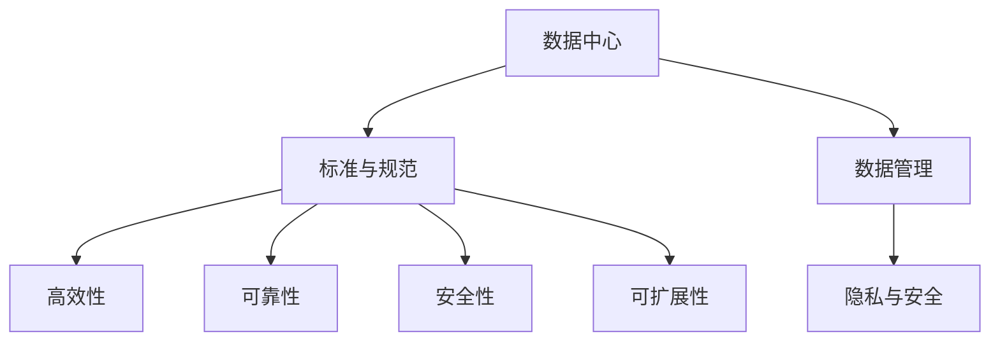

                 

# AI 大模型应用数据中心建设：数据中心标准与规范

> 关键词：AI大模型，数据中心，标准与规范，数据管理，安全与隐私

## 1. 背景介绍

### 1.1 问题由来

随着人工智能技术的快速发展，尤其是大模型的应用，数据中心建设的需求和复杂度日益增加。如何构建一个既满足当前AI应用需求，又具备长期可扩展性的数据中心，成为了当前AI研究和应用中的一个重要议题。同时，随着数据量的爆炸式增长，如何在数据存储、处理、传输等方面实现高效、安全、合规的管理，也成为了各大企业和研究机构共同关注的问题。

### 1.2 问题核心关键点

数据中心标准与规范的制定需要考虑以下几个核心关键点：

- 数据中心的设计原则：如何保证数据中心的高效性、可靠性和安全性。
- 数据管理规范：如何设计数据存储、访问和处理的标准流程，确保数据质量和一致性。
- 隐私与安全：如何保护数据的隐私和安全，避免数据泄露和滥用。
- 可持续发展：如何设计数据中心以支持AI应用的长期可持续发展。

这些核心关键点贯穿于数据中心标准与规范的制定过程，是确保数据中心高效运行和数据安全的重要保障。

### 1.3 问题研究意义

研究数据中心标准与规范，对于推动AI技术的广泛应用、保护用户隐私、保障数据安全具有重要意义：

1. 推动AI技术落地：合理的标准与规范能够促进AI技术在各行各业的应用，加速AI技术的产业化进程。
2. 保护用户隐私：规范数据处理流程，确保数据的隐私保护，减少用户对数据泄露的担忧。
3. 保障数据安全：通过标准与规范，加强数据中心的物理和网络安全，防止数据泄露和滥用。
4. 促进可持续发展：制定环保和节能的标准与规范，支持AI技术的绿色发展。

## 2. 核心概念与联系

### 2.1 核心概念概述

- **数据中心(Data Center, DC)**：一个或多个物理位置，用于容纳数据中心基础设施，包括计算、存储、网络、安全等组件。数据中心是AI模型训练和推理的基础设施，对于大模型的应用至关重要。
- **标准与规范(Standard and Norm)**：为实现特定目标（如安全性、性能、可扩展性等）而制定的一系列规则和指导方针。数据中心标准与规范为数据中心的建设和管理提供了统一的框架和依据。
- **数据管理(Data Management)**：涉及数据的收集、存储、访问、处理、传输等环节的管理，确保数据的完整性、准确性和一致性。
- **隐私与安全(Privacy and Security)**：保护数据隐私和数据安全，避免数据泄露和滥用。隐私与安全是大模型应用中必须严格遵守的原则。

这些核心概念之间通过以下Mermaid流程图进行联系：



这个流程图展示了数据中心标准与规范、数据管理、隐私与安全之间的逻辑关系：

1. 数据中心的设计和建设需要遵循标准与规范。
2. 数据管理流程需要在标准与规范的指导下进行。
3. 隐私与安全原则需要贯穿于数据管理的各个环节。
4. 标准与规范中包含了高效性、可靠性、安全性和可扩展性等目标。

## 3. 核心算法原理 & 具体操作步骤

### 3.1 算法原理概述

数据中心标准与规范的制定，本质上是对于数据中心的设计、建设和运营的一系列标准化管理流程。其核心算法原理主要包括：

- 数据中心的架构设计：合理布局计算、存储、网络等组件，确保高效性、可靠性和可扩展性。
- 数据管理的流程设计：定义数据的收集、存储、访问和处理的标准流程，确保数据的一致性和可靠性。
- 隐私与安全的策略设计：制定数据隐私和安全保护措施，防止数据泄露和滥用。

### 3.2 算法步骤详解

数据中心标准与规范的制定和实施，通常包括以下关键步骤：

**Step 1: 制定标准与规范框架**

- 收集行业内的最佳实践和经验。
- 与相关利益相关者（如AI应用开发者、数据管理专家、安全专家等）进行讨论和交流，获取意见和建议。
- 制定标准与规范的草案，并对外公布征求反馈。

**Step 2: 设计数据中心架构**

- 根据业务需求和预期的负载，设计数据中心的物理布局。
- 选择合适的硬件和软件组件，包括计算、存储、网络、安全等设备。
- 设计数据中心的冗余和备份策略，确保高可靠性和灾难恢复能力。

**Step 3: 设计数据管理流程**

- 定义数据的收集、存储、访问和处理的标准流程，确保数据的一致性和可靠性。
- 设计数据访问控制策略，确保只有授权人员可以访问敏感数据。
- 定义数据备份和恢复流程，确保数据在灾难发生时的快速恢复。

**Step 4: 制定隐私与安全策略**

- 定义数据隐私保护策略，确保数据在传输和存储过程中的加密和匿名化。
- 设计网络安全防护措施，防止外部攻击和内部滥用。
- 制定数据访问审计和监控策略，确保数据访问和操作的透明性和可追溯性。

**Step 5: 实施与优化**

- 根据标准与规范框架，实施数据中心的建设和管理。
- 定期评估和审查数据中心的运行状态，确保其符合标准与规范的要求。
- 根据反馈和业务需求的变化，持续优化数据中心的设计和运营策略。

### 3.3 算法优缺点

数据中心标准与规范的制定，具有以下优点：

1. 标准化：确保数据中心的建设和管理具有统一的标准，便于复制和扩展。
2. 可追溯性：规范的数据管理流程和隐私安全策略，便于追踪和审计数据操作。
3. 安全性：通过设计合理的架构和访问控制策略，提高数据中心的安全性。

同时，数据中心标准与规范的制定也存在一些缺点：

1. 灵活性不足：过度的标准化可能限制数据中心的灵活性和创新性。
2. 实施成本高：标准与规范的制定和实施可能需要较高的成本和技术投入。
3. 适应性差：标准与规范可能无法完全适应特定行业或应用的特殊需求。

### 3.4 算法应用领域

数据中心标准与规范主要应用于以下领域：

- **云计算和云服务**：确保云计算基础设施的可靠性和安全性。
- **AI模型训练和推理**：支持AI模型的高效训练和推理，提供必要的计算资源和数据支持。
- **大数据处理**：规范数据的存储、访问和处理流程，确保数据的质量和一致性。
- **企业数据中心**：优化企业数据中心的架构和管理，提升数据中心的高效性和可靠性。

## 4. 数学模型和公式 & 详细讲解 & 举例说明

### 4.1 数学模型构建

数据中心的标准与规范，通常涉及到以下几个方面的数学模型：

- 数据中心的性能模型：描述数据中心的计算、存储和网络性能。
- 数据管理的流程模型：描述数据的收集、存储、访问和处理流程。
- 隐私与安全的模型：描述数据的加密、匿名化和访问控制策略。

这些模型的构建需要基于具体的业务需求和场景，进行详细的定义和设计。

### 4.2 公式推导过程

以下以数据中心性能模型的构建为例，进行公式推导：

设数据中心的计算能力为 $C$，存储容量为 $S$，网络带宽为 $B$，则数据中心的性能模型可以表示为：

$$
P = f(C, S, B)
$$

其中 $P$ 表示数据中心的性能，$f$ 表示性能计算函数。具体公式可以根据业务需求进行设计，例如：

$$
P = \frac{C \times B}{S}
$$

表示数据中心的性能与计算能力、网络带宽和存储容量的关系。

### 4.3 案例分析与讲解

以一个典型的AI模型训练任务为例，分析数据中心标准与规范的应用：

- **需求分析**：一个AI模型训练任务需要大量的计算资源和数据支持，数据中心需要具备高效的计算能力和大量的存储空间。
- **性能建模**：根据任务需求，构建数据中心的性能模型，并进行性能评估。
- **管理流程设计**：设计数据管理的标准流程，确保数据的可靠性和一致性。
- **安全策略制定**：制定数据隐私和安全策略，确保数据在传输和存储过程中的安全。

## 5. 项目实践：代码实例和详细解释说明

### 5.1 开发环境搭建

开发环境搭建是数据中心标准与规范实施的重要环节，以下是搭建Python开发环境的步骤：

1. 安装Anaconda：从官网下载并安装Anaconda，用于创建独立的Python环境。
2. 创建并激活虚拟环境：
```bash
conda create -n pyenv python=3.8 
conda activate pyenv
```
3. 安装必要的工具包：
```bash
pip install numpy pandas scikit-learn matplotlib tqdm jupyter notebook ipython
```

完成以上步骤后，即可在虚拟环境中进行数据中心标准与规范的开发。

### 5.2 源代码详细实现

以下是一个简单的数据中心性能模型构建的代码实现：

```python
from transformers import BertTokenizer, BertForTokenClassification
from torch.utils.data import Dataset, DataLoader
import torch
import numpy as np

class DataCenter:
    def __init__(self, C, S, B):
        self.C = C
        self.S = S
        self.B = B

    def performance(self):
        return self.C * self.B / self.S

# 初始化数据中心实例
data_center = DataCenter(C=10, S=100, B=10)

# 计算数据中心性能
performance = data_center.performance()
print("数据中心性能：", performance)
```

### 5.3 代码解读与分析

**DataCenter类**：
- `__init__`方法：初始化数据中心的计算能力、存储容量和网络带宽。
- `performance`方法：计算数据中心的性能，公式为 $C \times B / S$。

**代码实现**：
- 创建DataCenter类实例，并计算数据中心的性能。
- 通过调用`performance`方法，输出数据中心性能的计算结果。

## 6. 实际应用场景

### 6.1 云计算和云服务

云计算平台如AWS、Azure、Google Cloud等，在构建数据中心时需要遵循标准与规范，确保基础设施的可靠性和安全性。

- **设计规范**：制定数据中心的物理布局和组件选型标准，确保计算、存储和网络的可靠性。
- **管理规范**：定义数据的收集、存储、访问和处理流程，确保数据的一致性和可靠性。
- **安全策略**：制定数据隐私和安全保护措施，防止数据泄露和滥用。

### 6.2 AI模型训练和推理

AI模型训练和推理是数据中心标准与规范的主要应用场景之一。

- **计算资源分配**：根据模型的训练需求，合理分配计算资源，确保训练效率和质量。
- **数据管理**：制定数据收集、存储和访问的标准流程，确保数据的一致性和安全性。
- **隐私保护**：制定数据隐私保护策略，确保数据在传输和存储过程中的加密和匿名化。

### 6.3 大数据处理

大数据处理需要遵循数据中心标准与规范，确保数据的可靠性和一致性。

- **数据存储**：制定数据存储的标准流程，确保数据的可靠性和一致性。
- **数据访问控制**：设计数据访问控制策略，确保只有授权人员可以访问敏感数据。
- **数据备份与恢复**：定义数据备份和恢复流程，确保数据在灾难发生时的快速恢复。

### 6.4 企业数据中心

企业数据中心的建设和管理需要遵循数据中心标准与规范，确保其高效性和可靠性。

- **架构设计**：根据业务需求和预期的负载，设计数据中心的物理布局。
- **管理流程**：制定数据收集、存储、访问和处理的标准流程，确保数据的一致性和可靠性。
- **安全策略**：制定数据隐私和安全保护措施，防止数据泄露和滥用。

## 7. 工具和资源推荐

### 7.1 学习资源推荐

为了帮助开发者系统掌握数据中心标准与规范的理论基础和实践技巧，这里推荐一些优质的学习资源：

1. **《数据中心设计与管理》**：介绍数据中心的基础知识和标准流程，适合数据中心建设的入门读者。
2. **《云计算基础》**：涵盖云计算基础设施的标准与规范，适合云计算平台的管理和运营人员。
3. **《人工智能伦理与安全》**：涉及AI伦理和数据隐私安全的原则和方法，适合AI应用的开发者和管理员。
4. **《数据中心运维指南》**：提供数据中心运维的标准流程和最佳实践，适合数据中心运维工程师。

### 7.2 开发工具推荐

数据中心标准与规范的开发离不开优秀的工具支持。以下是几款用于数据中心标准与规范开发的常用工具：

1. **Anaconda**：用于创建和管理Python虚拟环境，方便安装和管理依赖包。
2. **Jupyter Notebook**：提供交互式的Python开发环境，方便代码调试和版本控制。
3. **TensorBoard**：用于可视化数据中心性能和训练过程，方便监控和优化。
4. **Weights & Biases**：用于实验跟踪和模型训练的可视化，方便调优和部署。

### 7.3 相关论文推荐

数据中心标准与规范的发展源于学界的持续研究。以下是几篇奠基性的相关论文，推荐阅读：

1. **《云计算数据中心标准与规范》**：探讨云计算基础设施的标准与规范，指导云计算平台的建设和管理。
2. **《数据中心性能评估与优化》**：介绍数据中心性能的建模和优化方法，提高数据中心的效率和可靠性。
3. **《数据中心隐私与安全》**：讨论数据中心的隐私保护和安全策略，确保数据的安全性。

## 8. 总结：未来发展趋势与挑战

### 8.1 总结

本文对数据中心标准与规范进行了全面系统的介绍。首先阐述了数据中心标准与规范的研究背景和意义，明确了数据中心标准与规范在AI技术落地、数据隐私保护、数据安全等方面的重要价值。其次，从原理到实践，详细讲解了数据中心标准与规范的数学模型和实现步骤，给出了数据中心标准与规范的完整代码实例。同时，本文还广泛探讨了数据中心标准与规范在云计算、AI模型训练和推理、大数据处理、企业数据中心等多个领域的应用前景，展示了数据中心标准与规范的广泛应用场景。最后，本文精选了数据中心标准与规范的学习资源、开发工具和相关论文，力求为读者提供全方位的技术指引。

通过本文的系统梳理，可以看到，数据中心标准与规范是大模型应用不可或缺的基础设施，对保障AI技术的可靠性和安全性具有重要意义。未来，伴随AI技术的不断发展，数据中心标准与规范也将不断演进，成为推动AI技术向更广领域应用的重要保障。

### 8.2 未来发展趋势

展望未来，数据中心标准与规范将呈现以下几个发展趋势：

1. **高效性**：随着AI应用对计算和存储需求不断增长，数据中心的设计将更加注重高效性，采用更先进的硬件和软件技术。
2. **可扩展性**：数据中心需要具备更高的可扩展性，能够灵活应对业务需求的变化。
3. **安全性**：数据中心的物理和网络安全将更加严格，采用先进的加密技术和身份认证机制，确保数据的安全性。
4. **可持续发展**：数据中心的建设将更加注重环保和节能，采用更高效的能源管理和资源回收技术。

这些趋势凸显了数据中心标准与规范在AI技术落地和应用中的重要地位，推动数据中心向更高效率、更高安全性和更可持续发展方向发展。

### 8.3 面临的挑战

尽管数据中心标准与规范在AI应用中发挥了重要作用，但在迈向更加智能化、普适化应用的过程中，它仍面临诸多挑战：

1. **成本高**：大规模数据中心的建设和管理需要大量的资金投入，对于企业和组织是一大负担。
2. **复杂性高**：数据中心的设计和管理涉及多个领域，如硬件选择、网络架构、数据管理等，需要高度的专业知识和技能。
3. **标准化不足**：不同行业和组织对数据中心的需求不同，难以制定统一的规范和标准。
4. **灵活性不足**：标准与规范的制定可能导致数据中心设计和管理缺乏灵活性。

### 8.4 研究展望

面对数据中心标准与规范所面临的挑战，未来的研究需要在以下几个方面寻求新的突破：

1. **成本优化**：开发更高效、更节能的数据中心设计和运营技术，降低建设和运营成本。
2. **标准化建设**：推动跨行业和跨组织的数据中心标准与规范制定，确保数据中心的统一性和兼容性。
3. **自动化管理**：引入AI和自动化技术，实现数据中心的自动化管理和优化。
4. **安全性增强**：设计更加严格的数据隐私和安全保护策略，确保数据中心的高安全性。

这些研究方向的探索，必将引领数据中心标准与规范技术迈向更高的台阶，为AI技术的广泛应用提供坚实的基础设施保障。

## 9. 附录：常见问题与解答

**Q1: 数据中心标准与规范如何影响AI应用？**

A: 数据中心标准与规范为AI应用的落地提供了基础设施保障，确保AI模型的高效训练和推理。规范的数据管理和隐私保护策略，保障了数据的安全性和一致性，增强了AI应用的可靠性和可信赖性。

**Q2: 数据中心标准与规范的制定需要考虑哪些因素？**

A: 数据中心标准与规范的制定需要考虑以下因素：
1. 业务需求：根据AI应用的需求，设计数据中心的基础设施和组件。
2. 技术标准：选择合适的硬件和软件技术，确保数据中心的性能和可靠性。
3. 安全策略：制定数据隐私和安全保护措施，确保数据的安全性。
4. 成本控制：考虑数据中心的建设和运营成本，确保经济可行性。

**Q3: 数据中心标准与规范的实施过程中有哪些注意事项？**

A: 数据中心标准与规范的实施过程中需要注意以下事项：
1. 数据中心的建设和管理需要严格遵守标准与规范，确保高效性和可靠性。
2. 数据管理的流程需要标准化，确保数据的一致性和可靠性。
3. 数据隐私和安全策略需要严格执行，防止数据泄露和滥用。

**Q4: 如何确保数据中心的高效性和可扩展性？**

A: 数据中心的高效性和可扩展性需要考虑以下几个方面：
1. 采用先进的硬件和软件技术，提高数据中心的性能。
2. 设计合理的物理布局和冗余机制，确保数据中心的高可靠性。
3. 采用虚拟化和容器化技术，提高数据中心的资源利用率。

**Q5: 如何确保数据中心的安全性和隐私保护？**

A: 数据中心的安全性和隐私保护需要考虑以下几个方面：
1. 设计先进的网络安全防护措施，防止外部攻击和内部滥用。
2. 制定严格的数据访问控制策略，确保只有授权人员可以访问敏感数据。
3. 采用先进的加密和匿名化技术，保护数据的隐私和安全。

作者：禅与计算机程序设计艺术 / Zen and the Art of Computer Programming

