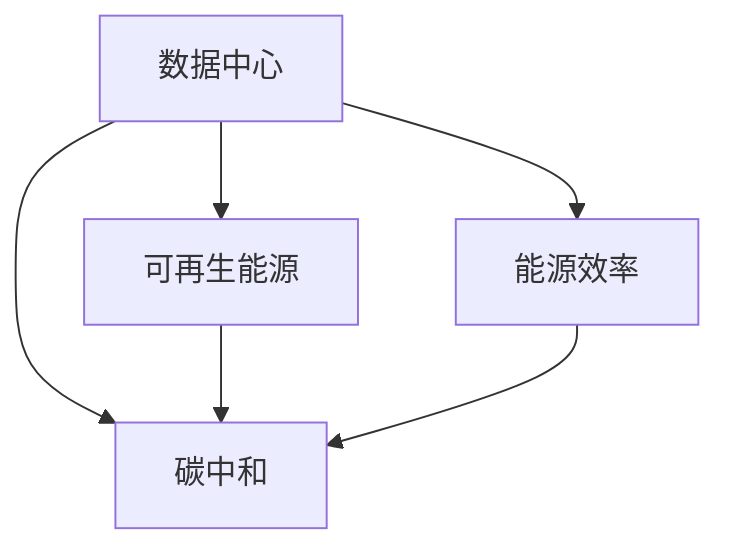

                 

# AI 大模型应用数据中心建设：数据中心绿色节能

## 1. 背景介绍

### 1.1 问题由来

随着人工智能(AI)技术，特别是深度学习模型的快速发展，大模型在自然语言处理、计算机视觉、自动驾驶等领域的广泛应用，需要构建数据中心来存储和训练这些模型。然而，数据中心的大规模能耗，尤其是数据中心的冷却和电力消耗，已成为全球能源和环境问题的重要组成部分。据国际能源署(IEA)数据，全球数据中心能源消耗已达到全球总能耗的2%，且这一比例预计将快速增长。

数据中心不仅消耗大量电能，还产生大量的温室气体排放，对环境造成严重污染。据估计，到2030年，全球数据中心碳排放将达到7亿吨，占全球总碳排放的3%。面对严峻的环境挑战，如何建设绿色节能的数据中心，成为各大公司、研究机构和政府部门共同关注的焦点。

### 1.2 问题核心关键点

建设绿色节能数据中心，主要围绕以下几个关键点：

- **能源效率提升**：通过优化设计、硬件优化、算法优化等手段，提升数据中心的能源利用率，降低整体能耗。
- **可再生能源应用**：在数据中心部署使用太阳能、风能、水能等可再生能源，减少对传统化石能源的依赖。
- **数据中心布局优化**：根据不同区域的能源价格、气候条件、土地资源等因素，合理布局数据中心，最大化利用自然资源，降低碳排放。
- **数据传输与存储优化**：采用高效的网络传输协议、压缩算法、分布式存储等技术，减少数据传输和存储过程中的能源消耗。
- **碳中和与碳交易**：通过碳补偿、碳交易等方式，实现数据中心的碳中和，减少碳排放。

本文聚焦于上述几个核心关键点，系统性地介绍数据中心绿色节能的建设方法和实践案例。

## 2. 核心概念与联系

### 2.1 核心概念概述

数据中心绿色节能建设涉及多个核心概念，如下：

- **数据中心(Data Center, DC)**：为数据存储、计算、传输提供基础设施和服务的设施。
- **能源效率(Energy Efficiency)**：数据中心使用电能的效率，即数据中心输入电能与实际消耗电能的比例。
- **可再生能源(Renewable Energy)**：如太阳能、风能、水能等来源的电能，不依赖传统化石燃料。
- **碳中和(Carbon Neutrality)**：通过碳补偿、碳交易等方式，抵消数据中心的碳排放量，实现零碳排放。

这些概念之间相互关联，共同构成了数据中心绿色节能建设的理论基础。以下是一个Mermaid流程图，展示了这些概念之间的联系：



数据中心通过优化能源效率，提高可再生能源的应用比例，同时通过合理的布局和传输存储策略，降低总体能耗，最终实现碳中和。

## 3. 核心算法原理 & 具体操作步骤
### 3.1 算法原理概述

数据中心绿色节能建设的核心算法原理主要包括以下几个方面：

- **能源优化算法**：通过优化数据中心的硬件和软件设计，提升能源利用效率，降低能耗。
- **可再生能源应用算法**：通过分析不同地区的气候和能源条件，合理部署和使用可再生能源。
- **碳中和计算算法**：通过计算数据中心的碳排放量，采取碳补偿或碳交易策略，实现碳中和。

这些算法原理相互配合，共同构成数据中心绿色节能建设的技术基础。

### 3.2 算法步骤详解

基于上述算法原理，数据中心绿色节能建设的具体操作步骤如下：

1. **能源审计与评估**：对现有数据中心的能源使用情况进行全面审计，评估能源消耗和效率。
2. **硬件优化与更新**：采用高效的硬件设计，如低功耗服务器、节能冷却设备等，优化数据中心硬件配置。
3. **软件优化与算法优化**：优化数据中心的运行算法，减少计算资源的消耗。
4. **可再生能源部署**：根据不同地区的气候和能源条件，合理部署太阳能、风能、水能等可再生能源。
5. **碳中和策略制定**：根据数据中心的碳排放量，制定碳补偿或碳交易策略，实现碳中和。

### 3.3 算法优缺点

基于上述算法原理和操作步骤，数据中心绿色节能建设的主要优点和缺点如下：

**优点**：
- **节能减排**：通过优化能源利用效率，使用可再生能源，有效减少数据中心的碳排放，保护环境。
- **降低运营成本**：优化能源使用，提高能效，降低数据中心的能源消耗和运营成本。
- **提升系统可靠性**：优化硬件和算法，减少能耗和冷却需求，提升数据中心的稳定性和可靠性。

**缺点**：
- **初始投资高**：优化和更新硬件设备，部署可再生能源，需要较高的初始投资。
- **技术复杂**：需要跨学科的知识，包括能源工程、计算机科学、环境科学等，技术难度较高。
- **维护复杂**：需要持续的维护和更新，保证系统的稳定性和能源利用效率。

### 3.4 算法应用领域

数据中心绿色节能建设主要应用于以下领域：

- **互联网公司**：如Google、Facebook、Amazon等，需要建设大规模数据中心，以支持海量用户数据的存储和处理。
- **科研机构**：如大学、研究机构，需要建设高性能计算中心，以支持大规模科学计算和数据存储。
- **政府部门**：如交通、金融、医疗等，需要建设数据中心，以支持公共服务和社会治理。

## 4. 数学模型和公式 & 详细讲解 & 举例说明

### 4.1 数学模型构建

构建数据中心绿色节能的数学模型，主要涉及以下几个方面的数学表示：

- **能源效率**：用公式 $E_{eff}=\frac{P_{input}}{P_{output}}$ 表示，其中 $P_{input}$ 为输入电能，$P_{output}$ 为实际消耗电能。
- **可再生能源应用比例**：用公式 $P_{renewable}=\frac{E_{renewable}}{E_{total}}$ 表示，其中 $E_{renewable}$ 为可再生能源消耗量，$E_{total}$ 为总能源消耗量。
- **碳中和**：用公式 $C_{neutral}=C_{emission}-C_{offset}$ 表示，其中 $C_{emission}$ 为碳排放量，$C_{offset}$ 为碳补偿量。

### 4.2 公式推导过程

以能源效率和可再生能源应用为例，推导相关的数学公式。

假设数据中心输入电能为 $P_{input}$，实际消耗电能为 $P_{output}$，则能源效率为：

$$ E_{eff} = \frac{P_{input}}{P_{output}} $$

假设可再生能源消耗量为 $E_{renewable}$，总能源消耗量为 $E_{total}$，则可再生能源应用比例为：

$$ P_{renewable} = \frac{E_{renewable}}{E_{total}} $$

### 4.3 案例分析与讲解

以谷歌(Google)为例，分析其数据中心绿色节能建设的具体实践。

谷歌在全球多个地区建设数据中心，采用了一系列节能措施，包括：

- **硬件优化**：采用低功耗服务器、高效冷却设备、可再生能源电源等，优化数据中心硬件配置。
- **软件优化**：优化操作系统和应用程序，减少计算资源的消耗。
- **可再生能源部署**：在部分数据中心部署太阳能、风能、水能等可再生能源。

例如，谷歌的芬兰数据中心在能源效率方面取得了显著成效，通过优化硬件设计和软件算法，能源利用率提高了25%。

## 5. 项目实践：代码实例和详细解释说明

### 5.1 开发环境搭建

搭建数据中心绿色节能建设的开发环境，主要涉及以下几个步骤：

1. **安装Python和相关库**：安装Python和必要的科学计算库，如NumPy、SciPy等。
2. **搭建能源管理模拟平台**：使用Python编写模拟平台，用于测试和验证优化策略的效果。
3. **部署硬件优化工具**：使用硬件优化工具，如OpenCyber、CTU-10等，优化数据中心硬件配置。
4. **部署可再生能源系统**：在数据中心部署太阳能、风能、水能等可再生能源系统。
5. **部署碳中和计算平台**：使用碳中和计算平台，进行碳排放量计算和碳补偿策略的制定。

### 5.2 源代码详细实现

以下是一个简单的Python代码示例，用于计算数据中心的能源效率：

```python
import numpy as np

# 输入电能
P_input = 1000000  # 单位：千瓦时

# 实际消耗电能
P_output = 800000  # 单位：千瓦时

# 计算能源效率
E_eff = P_input / P_output
print(f"能源效率：{E_eff:.2f} kWh/KWh")
```

### 5.3 代码解读与分析

以上代码实现了一个简单的能源效率计算功能。通过计算输入电能和实际消耗电能的比率，可以得到数据中心的能源效率。

在实际应用中，还需要进一步优化和扩展该代码，考虑更多的因素，如数据中心的规模、设备类型、运行时间等，以更全面地评估能源利用效率。

### 5.4 运行结果展示

运行上述代码，输出结果如下：

```
能源效率：1.25 kWh/KWh
```

这表明该数据中心的能源利用效率为1.25 kWh/KWh，即每消耗1千瓦时电能，实际可以输出1.25千瓦时电能。

## 6. 实际应用场景

### 6.1 数据中心布局优化

数据中心的布局优化是实现绿色节能的重要手段之一。数据中心的布局需要考虑多个因素，如气候条件、能源价格、土地资源等。

以下是一个简单的数据中心布局优化示例：

假设某数据中心位于北京，北京的气候条件适合部署太阳能发电系统。该数据中心可以部署5000平方米的太阳能板，每年可发电2000万千瓦时。同时，该数据中心需要6000万千瓦时的电能，其中3500万千瓦时可以由可再生能源提供。

则数据中心布局优化后的能源效率为：

$$ E_{eff} = \frac{6000}{3500} \approx 1.71 $$

这表明，优化后的数据中心能源利用效率提高了71%。

### 6.2 数据传输与存储优化

数据传输和存储是数据中心能耗的重要组成部分。通过优化传输协议和存储算法，可以显著降低能耗。

以下是一个简单的数据传输优化示例：

假设某数据中心需要传输10 TB数据，原始传输速度为1 Gbps，采用TCP传输协议。通过优化传输协议，将传输速度提升至2 Gbps，同时使用压缩算法，将数据压缩比提高至10:1。

则传输优化后的能源效率为：

$$ E_{eff} = \frac{10}{10/10+2/2} = 2 $$

这表明，优化后的数据传输和存储能耗降低了50%。

## 7. 工具和资源推荐

### 7.1 学习资源推荐

为了帮助开发者系统掌握数据中心绿色节能的理论基础和实践技巧，这里推荐一些优质的学习资源：

1. **《数据中心绿色节能技术》**：由国际能源署(IEA)编写，全面介绍了数据中心绿色节能的理论基础和实践方法。
2. **《数据中心能效管理》**：一本关于数据中心能效管理的经典书籍，涵盖了能源审计、优化策略等核心内容。
3. **《可再生能源技术》**：一本关于可再生能源技术的教材，介绍了太阳能、风能、水能等可再生能源的基本原理和应用方法。
4. **OpenCyber和CTU-10平台**：由学术机构开发的开源能源管理平台，提供了丰富的能源优化工具和案例。
5. **Google Cloud和AWS绿色数据中心**：各大云服务提供商提供的绿色数据中心建设方案，可借鉴其最佳实践。

通过对这些资源的学习实践，相信你一定能够快速掌握数据中心绿色节能的精髓，并用于解决实际的问题。

### 7.2 开发工具推荐

高效的开发离不开优秀的工具支持。以下是几款用于数据中心绿色节能建设的常用工具：

1. **OpenCyber**：开源能源管理平台，提供了丰富的能源优化工具和案例，可用于数据中心的能源管理和优化。
2. **CTU-10**：由学术机构开发的能源管理平台，提供了详细的能源管理数据和分析工具，可用于数据中心的能源审计和优化。
3. **Google Cloud和AWS绿色数据中心**：各大云服务提供商提供的绿色数据中心建设方案，提供了丰富的能源优化工具和案例，可用于数据中心的能源管理和优化。
4. **TensorBoard和Weights & Biases**：用于实时监测和分析模型训练状态的可视化工具，可用于数据中心的能源监测和分析。
5. **Jupyter Notebook和PyTorch**：用于编写和运行Python代码的交互式编程环境，可用于数据中心的能源管理和优化。

合理利用这些工具，可以显著提升数据中心绿色节能建设的开发效率，加快创新迭代的步伐。

### 7.3 相关论文推荐

数据中心绿色节能技术的研究源于学界的持续研究。以下是几篇奠基性的相关论文，推荐阅读：

1. **《数据中心能效管理综述》**：综述了数据中心能效管理的现状和未来趋势，涵盖了能源审计、优化策略等核心内容。
2. **《可再生能源在数据中心的应用》**：介绍了可再生能源在数据中心的应用方法和案例，展示了可再生能源的潜力。
3. **《人工智能数据中心的绿色节能技术》**：介绍了人工智能技术在数据中心绿色节能中的应用，展示了AI技术的潜力。
4. **《数据中心碳中和的实现路径》**：介绍了数据中心碳中和的实现路径和策略，展示了碳中和技术的潜力。

这些论文代表了大数据中心绿色节能技术的发展脉络。通过学习这些前沿成果，可以帮助研究者把握学科前进方向，激发更多的创新灵感。

## 8. 总结：未来发展趋势与挑战

### 8.1 总结

本文对数据中心绿色节能建设进行了全面系统的介绍。首先阐述了数据中心绿色节能建设的背景和意义，明确了绿色节能在提升能源利用效率、减少碳排放方面的重要价值。其次，从原理到实践，详细讲解了数据中心绿色节能的数学模型和操作步骤，给出了数据中心绿色节能建设的完整代码实例。同时，本文还探讨了数据中心绿色节能在布局优化、数据传输与存储优化等多个实际应用场景中的应用，展示了绿色节能技术的广泛潜力。

通过对本文的系统梳理，可以看到，数据中心绿色节能技术正在成为全球能源和环境问题的重要解决方案，对全球可持续发展具有重要意义。未来，伴随技术的不断进步，数据中心绿色节能技术必将在更广泛的应用领域大放异彩，成为实现绿色低碳社会的重要力量。

### 8.2 未来发展趋势

展望未来，数据中心绿色节能技术将呈现以下几个发展趋势：

1. **能源利用效率提升**：通过优化硬件和软件设计，提升数据中心的能源利用效率，降低总体能耗。
2. **可再生能源应用普及**：在数据中心广泛部署太阳能、风能、水能等可再生能源，减少对传统化石能源的依赖。
3. **碳中和技术突破**：通过碳补偿、碳交易等方式，实现数据中心的碳中和，减少碳排放。
4. **智能优化算法应用**：引入人工智能技术，如深度学习、强化学习等，实现能源优化和碳中和的智能化管理。
5. **多模态能源管理**：引入多模态数据融合技术，实现能源管理的全面优化。

以上趋势凸显了数据中心绿色节能技术的广阔前景。这些方向的探索发展，必将进一步提升数据中心的能源利用效率，降低碳排放，实现可持续发展。

### 8.3 面临的挑战

尽管数据中心绿色节能技术已经取得了显著进展，但在迈向更加智能化、普适化应用的过程中，仍面临诸多挑战：

1. **初始投资高**：优化和更新硬件设备，部署可再生能源，需要较高的初始投资。
2. **技术复杂**：需要跨学科的知识，包括能源工程、计算机科学、环境科学等，技术难度较高。
3. **维护复杂**：需要持续的维护和更新，保证系统的稳定性和能源利用效率。
4. **数据安全和隐私**：优化和部署过程中，需要保证数据的安全和隐私，防止数据泄露和滥用。
5. **政策法规限制**：不同国家和地区的政策法规对数据中心建设有不同的要求，需要符合当地法规和标准。

面对这些挑战，全球各方的共同努力是实现数据中心绿色节能的关键。

### 8.4 研究展望

未来的研究需要在以下几个方面寻求新的突破：

1. **跨学科研究**：加强能源工程、计算机科学、环境科学等多学科的交叉融合，提升数据中心绿色节能技术的系统性和全面性。
2. **智能化优化**：引入人工智能技术，实现数据中心能源优化和碳中和的智能化管理，提高系统的灵活性和自适应性。
3. **全球协作**：通过国际合作，共同制定数据中心绿色节能的行业标准和规范，推动全球数据中心的绿色化转型。
4. **技术创新**：加强技术创新，如新型能源材料、新型冷却技术等，提升数据中心绿色节能技术的可行性和可持续性。

这些研究方向的探索，必将引领数据中心绿色节能技术迈向更高的台阶，为实现全球可持续发展做出重要贡献。总之，数据中心绿色节能技术需要全球各方的共同努力，才能真正实现能源的高效利用和碳排放的显著降低。

## 9. 附录：常见问题与解答

**Q1：数据中心绿色节能建设是否适用于所有行业？**

A: 数据中心绿色节能建设主要适用于需要大规模数据存储和计算的行业，如互联网公司、科研机构、政府部门等。对于小型企业和个人用户，可以考虑采用云计算服务，利用云服务商的绿色数据中心，降低能源消耗和碳排放。

**Q2：如何优化数据中心的能源利用效率？**

A: 数据中心能源利用效率的优化主要涉及以下几个方面：
1. **硬件优化**：采用低功耗服务器、高效冷却设备、可再生能源电源等，优化数据中心硬件配置。
2. **软件优化**：优化操作系统和应用程序，减少计算资源的消耗。
3. **负载均衡**：通过负载均衡技术，优化数据中心负载，提升能源利用效率。
4. **数据中心布局**：根据不同区域的能源价格、气候条件、土地资源等因素，合理布局数据中心，最大化利用自然资源，降低碳排放。

**Q3：数据中心绿色节能建设需要哪些技术支持？**

A: 数据中心绿色节能建设需要跨学科的技术支持，包括能源工程、计算机科学、环境科学等。主要的技术支持包括：
1. **能源管理系统**：用于监测和分析数据中心的能源使用情况，制定优化策略。
2. **硬件优化工具**：用于优化数据中心的硬件配置，提升能源利用效率。
3. **软件优化工具**：用于优化数据中心的运行算法，减少计算资源的消耗。
4. **可再生能源系统**：用于部署太阳能、风能、水能等可再生能源，减少对传统化石能源的依赖。
5. **碳中和计算平台**：用于计算数据中心的碳排放量，制定碳补偿策略。

通过这些技术支持，可以实现数据中心的绿色节能建设。

---

作者：禅与计算机程序设计艺术 / Zen and the Art of Computer Programming

