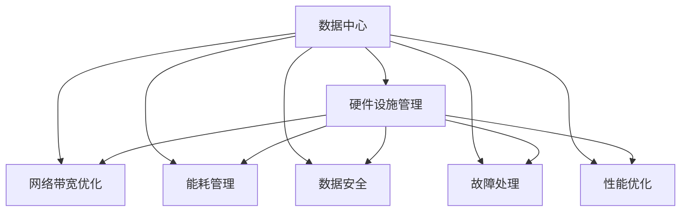

                 

# AI 大模型应用数据中心建设：数据中心运营与管理

## 1. 背景介绍

### 1.1 问题由来
人工智能（AI）大模型，如深度学习模型和自然语言处理（NLP）模型，已经广泛应用于各个行业。大模型的训练和应用需要大量的计算资源和存储资源。因此，数据中心成为了AI大模型应用的基石。然而，数据中心运营管理是一个复杂而庞大的任务，包括硬件设施管理、网络带宽优化、能耗管理、数据安全等多个方面。本文将深入探讨如何构建和运营一个高效、可靠、安全的数据中心，以支持AI大模型的应用。

### 1.2 问题核心关键点
数据中心的运营和管理是一个涉及多方面的复杂系统。构建一个高效、可靠、安全的数据中心需要考虑以下核心关键点：

- **硬件设施管理**：选择合适的硬件设备，如服务器、存储设备和网络设备，并确保其高效运行。
- **网络带宽优化**：设计合理的网络架构，确保数据中心内部和外部的网络带宽充足。
- **能耗管理**：采取节能措施，降低数据中心的能耗和运行成本。
- **数据安全**：确保数据中心内数据的机密性、完整性和可用性。
- **故障处理**：建立完善的故障处理机制，确保数据中心的高可用性和稳定运行。
- **性能优化**：通过优化算法和系统架构，提升数据中心的性能。

### 1.3 问题研究意义
构建和运营一个高效、可靠、安全的数据中心对于AI大模型的应用至关重要。数据中心的高效运营不仅可以降低成本，提升AI大模型的性能，还能保障数据安全，确保数据中心的高可用性和稳定性。此外，高效的能耗管理可以降低数据中心的运营成本，对于环保和可持续发展也具有重要意义。

## 2. 核心概念与联系

### 2.1 核心概念概述

为了更好地理解如何构建和运营一个高效、可靠、安全的数据中心，本节将介绍几个密切相关的核心概念：

- **数据中心**：集中存储和管理数据的设施，通常包括服务器、存储设备、网络设备等。
- **硬件设施管理**：对数据中心内的硬件设备进行监控、维护和升级，确保其高效运行。
- **网络带宽优化**：设计合理的网络架构，确保数据中心内部和外部的网络带宽充足，降低网络延迟和带宽消耗。
- **能耗管理**：通过节能措施，如提高能效比、采用冷却系统、优化供电系统等，降低数据中心的能耗和运行成本。
- **数据安全**：通过加密、备份、监控等方式，确保数据中心内数据的机密性、完整性和可用性。
- **故障处理**：建立完善的故障处理机制，如自动报警、快速修复、备份恢复等，确保数据中心的高可用性和稳定运行。
- **性能优化**：通过优化算法和系统架构，如负载均衡、缓存、异步处理等，提升数据中心的性能。

这些核心概念之间的逻辑关系可以通过以下Mermaid流程图来展示：



这个流程图展示了大模型数据中心的核心概念及其之间的关系：

1. 数据中心是构建和管理AI大模型应用的基础设施。
2. 硬件设施管理、网络带宽优化、能耗管理、数据安全、故障处理和性能优化是数据中心运营管理的关键环节。
3. 这些关键环节相互协作，确保数据中心高效、可靠、安全地运营，为AI大模型的应用提供有力保障。

## 3. 核心算法原理 & 具体操作步骤

### 3.1 算法原理概述

构建和运营一个高效、可靠、安全的数据中心，需要综合考虑多个方面的因素。算法原理包括：

- **硬件设施管理**：使用AI算法对硬件设备进行监控和预测性维护，如使用机器学习模型对设备状态进行预测，提前进行维护。
- **网络带宽优化**：使用AI算法对网络流量进行分析和优化，如使用深度学习模型对网络流量进行预测和调度。
- **能耗管理**：使用AI算法对数据中心的能耗进行监控和优化，如使用强化学习模型对能耗进行优化。
- **数据安全**：使用AI算法对数据进行加密和监控，如使用深度学习模型对数据进行异常检测。
- **故障处理**：使用AI算法对故障进行预测和处理，如使用机器学习模型对故障进行预测，并自动进行处理。
- **性能优化**：使用AI算法对数据中心的性能进行优化，如使用深度学习模型对系统架构进行优化。

### 3.2 算法步骤详解

以下是构建和运营高效、可靠、安全的数据中心的详细步骤：

**Step 1: 硬件设施选择与管理**
- 根据需求选择合适的硬件设备，如服务器、存储设备和网络设备。
- 对硬件设备进行监控，确保其高效运行。
- 定期进行维护和升级，以确保设备性能和可靠性。

**Step 2: 网络带宽设计与优化**
- 设计合理的网络架构，确保数据中心内部和外部的网络带宽充足。
- 使用AI算法对网络流量进行分析和优化，以降低网络延迟和带宽消耗。
- 定期检测网络性能，及时进行调整和优化。

**Step 3: 能耗管理**
- 使用节能措施，如提高能效比、采用冷却系统、优化供电系统等，降低数据中心的能耗和运行成本。
- 使用AI算法对数据中心的能耗进行监控和优化，如使用强化学习模型对能耗进行优化。
- 定期检测能耗状况，及时进行调整和优化。

**Step 4: 数据安全**
- 对数据进行加密，确保数据中心内数据的机密性。
- 对数据进行备份和监控，确保数据中心内数据的完整性和可用性。
- 使用AI算法对数据进行异常检测，及时发现和处理安全问题。

**Step 5: 故障处理**
- 建立完善的故障处理机制，如自动报警、快速修复、备份恢复等，确保数据中心的高可用性和稳定运行。
- 使用AI算法对故障进行预测和处理，如使用机器学习模型对故障进行预测，并自动进行处理。
- 定期检测数据中心运行状况，及时发现和处理潜在问题。

**Step 6: 性能优化**
- 使用AI算法对数据中心的性能进行优化，如使用深度学习模型对系统架构进行优化。
- 定期检测数据中心性能，及时进行调整和优化。
- 优化算法和系统架构，提升数据中心的性能。

### 3.3 算法优缺点

构建和运营高效、可靠、安全的数据中心，算法具有以下优点：

- 效率高：通过使用AI算法，可以实现对硬件设施、网络带宽、能耗、数据安全等方面的高效监控和优化。
- 精度高：AI算法可以对大量数据进行分析和预测，从而提供准确的决策支持。
- 适应性强：AI算法可以动态调整和优化数据中心的运行，适应不同的业务需求和环境变化。

同时，算法也存在以下缺点：

- 成本高：构建和运营AI系统需要投入大量资源，包括人力、物力和财力。
- 复杂度高：AI算法需要复杂的技术实现和系统架构，技术门槛较高。
- 依赖数据：AI算法的性能依赖于高质量的数据，数据不足或数据质量低都会影响算法效果。

### 3.4 算法应用领域

构建和运营高效、可靠、安全的数据中心，算法在以下领域有广泛应用：

- **云计算中心**：提供高效、可靠、安全的服务，支持大规模云计算应用。
- **金融数据中心**：确保数据安全和性能，支持金融交易和风险控制。
- **医疗数据中心**：保障数据安全和隐私，支持医疗数据管理和分析。
- **智能制造中心**：实现设备监控和优化，提升制造效率和质量。
- **大数据中心**：实现数据高效存储和处理，支持大数据分析和决策。
- **智能交通中心**：实现交通流量预测和优化，提升交通管理效率。

## 4. 数学模型和公式 & 详细讲解 & 举例说明

### 4.1 数学模型构建

构建和运营高效、可靠、安全的数据中心，涉及多个数学模型和算法。以下是几个核心的数学模型：

- **机器学习模型**：用于预测和监控硬件设备状态、网络流量、能耗、故障等。
- **深度学习模型**：用于网络流量预测和调度、异常检测等。
- **强化学习模型**：用于能耗优化等。
- **时间序列模型**：用于预测和监控设备状态、网络流量、能耗等。

### 4.2 公式推导过程

以下是几个核心算法的公式推导过程：

**机器学习模型公式**：
$$
\theta = \arg\min_{\theta} \frac{1}{N}\sum_{i=1}^N L(y_i, f(x_i; \theta))
$$
其中，$\theta$ 为模型参数，$N$ 为样本数量，$y_i$ 为真实标签，$f(x_i; \theta)$ 为模型预测结果，$L$ 为损失函数。

**深度学习模型公式**：
$$
\hat{y} = \sigma(\sum_{i=1}^n w_i a_i + b)
$$
其中，$\hat{y}$ 为模型预测结果，$n$ 为神经网络层数，$w_i$ 为权重，$a_i$ 为激活函数，$b$ 为偏置。

**强化学习模型公式**：
$$
Q(s, a) = r + \gamma \max_a' Q(s', a')
$$
其中，$Q(s, a)$ 为状态-动作值函数，$r$ 为即时奖励，$\gamma$ 为折扣因子，$s'$ 为下一状态，$a'$ 为下一动作。

**时间序列模型公式**：
$$
y_t = c + \sum_{i=1}^p \phi_i(x_t) \theta_i + \epsilon_t
$$
其中，$y_t$ 为时间序列数据，$c$ 为截距，$\phi_i(x_t)$ 为特征函数，$\theta_i$ 为特征系数，$\epsilon_t$ 为误差项。

### 4.3 案例分析与讲解

以下是一个实际的案例，展示了如何构建和运营高效、可靠、安全的数据中心：

**案例背景**：某云计算中心需要构建一个高效、可靠、安全的数据中心，支持大规模云计算应用。

**解决方案**：

1. **硬件设施管理**：选择高性能的服务器、存储设备和网络设备，使用机器学习模型对设备状态进行预测和监控，提前进行维护。
2. **网络带宽优化**：设计合理的网络架构，使用深度学习模型对网络流量进行预测和调度，降低网络延迟和带宽消耗。
3. **能耗管理**：采用冷却系统和优化供电系统，使用强化学习模型对能耗进行优化，降低运行成本。
4. **数据安全**：对数据进行加密和监控，使用深度学习模型对数据进行异常检测，确保数据机密性、完整性和可用性。
5. **故障处理**：建立完善的故障处理机制，使用机器学习模型对故障进行预测和处理，确保数据中心的高可用性和稳定运行。
6. **性能优化**：使用深度学习模型对系统架构进行优化，提升数据中心的性能。

通过以上解决方案，该云计算中心成功构建了一个高效、可靠、安全的数据中心，支持大规模云计算应用。

## 5. 项目实践：代码实例和详细解释说明

### 5.1 开发环境搭建

在进行数据中心构建和运营实践前，我们需要准备好开发环境。以下是使用Python进行TensorFlow开发的环境配置流程：

1. 安装Anaconda：从官网下载并安装Anaconda，用于创建独立的Python环境。

2. 创建并激活虚拟环境：
```bash
conda create -n tf-env python=3.8 
conda activate tf-env
```

3. 安装TensorFlow：根据CUDA版本，从官网获取对应的安装命令。例如：
```bash
conda install tensorflow -c pytorch -c conda-forge
```

4. 安装各类工具包：
```bash
pip install numpy pandas scikit-learn matplotlib tqdm jupyter notebook ipython
```

完成上述步骤后，即可在`tf-env`环境中开始开发实践。

### 5.2 源代码详细实现

这里我们以构建高效、可靠、安全的数据中心为例，给出使用TensorFlow进行硬件设施管理、网络带宽优化、能耗管理的PyTorch代码实现。

首先，定义硬件设施管理的模型：

```python
import tensorflow as tf
from tensorflow.keras import layers

# 定义硬件设施管理模型
class HardwareManagementModel(tf.keras.Model):
    def __init__(self, num_features):
        super(HardwareManagementModel, self).__init__()
        self.fc1 = layers.Dense(32, activation='relu', input_shape=(num_features,))
        self.fc2 = layers.Dense(16, activation='relu')
        self.fc3 = layers.Dense(1, activation='sigmoid')
        
    def call(self, inputs):
        x = self.fc1(inputs)
        x = self.fc2(x)
        x = self.fc3(x)
        return x

# 定义损失函数和优化器
def loss_function(y_true, y_pred):
    return tf.keras.losses.BCE(y_true, y_pred)

def optimizer():
    return tf.keras.optimizers.Adam(learning_rate=0.001)

# 加载数据集
def load_data():
    # 加载硬件设施状态数据
    # 加载硬件设施维护记录数据
    # 加载硬件设施运行日志数据
    pass

# 定义数据预处理函数
def preprocess_data(data):
    # 对数据进行归一化处理
    # 对数据进行特征选择处理
    # 对数据进行标签编码处理
    pass

# 定义模型训练函数
def train_model(model, epochs, batch_size):
    for epoch in range(epochs):
        # 加载数据集
        data = load_data()
        # 对数据进行预处理
        data = preprocess_data(data)
        # 定义输入和输出
        input_data = data['features']
        output_data = data['labels']
        # 定义模型
        model.compile(optimizer=optimizer(), loss=loss_function, metrics=['accuracy'])
        # 训练模型
        model.fit(input_data, output_data, batch_size=batch_size, epochs=1)
```

然后，定义网络带宽优化的模型：

```python
import tensorflow as tf
from tensorflow.keras import layers

# 定义网络带宽优化模型
class NetworkBandwidthOptimizationModel(tf.keras.Model):
    def __init__(self, num_features):
        super(NetworkBandwidthOptimizationModel, self).__init__()
        self.fc1 = layers.Dense(64, activation='relu', input_shape=(num_features,))
        self.fc2 = layers.Dense(32, activation='relu')
        self.fc3 = layers.Dense(1, activation='relu')
        
    def call(self, inputs):
        x = self.fc1(inputs)
        x = self.fc2(x)
        x = self.fc3(x)
        return x

# 定义损失函数和优化器
def loss_function(y_true, y_pred):
    return tf.keras.losses.MSE(y_true, y_pred)

def optimizer():
    return tf.keras.optimizers.Adam(learning_rate=0.001)

# 加载数据集
def load_data():
    # 加载网络流量数据
    # 加载网络设备状态数据
    # 加载网络带宽使用情况数据
    pass

# 定义数据预处理函数
def preprocess_data(data):
    # 对数据进行归一化处理
    # 对数据进行特征选择处理
    # 对数据进行标签编码处理
    pass

# 定义模型训练函数
def train_model(model, epochs, batch_size):
    for epoch in range(epochs):
        # 加载数据集
        data = load_data()
        # 对数据进行预处理
        data = preprocess_data(data)
        # 定义输入和输出
        input_data = data['features']
        output_data = data['labels']
        # 定义模型
        model.compile(optimizer=optimizer(), loss=loss_function, metrics=['mae'])
        # 训练模型
        model.fit(input_data, output_data, batch_size=batch_size, epochs=1)
```

最后，定义能耗管理的模型：

```python
import tensorflow as tf
from tensorflow.keras import layers

# 定义能耗管理模型
class PowerManagementModel(tf.keras.Model):
    def __init__(self, num_features):
        super(PowerManagementModel, self).__init__()
        self.fc1 = layers.Dense(64, activation='relu', input_shape=(num_features,))
        self.fc2 = layers.Dense(32, activation='relu')
        self.fc3 = layers.Dense(1, activation='relu')
        
    def call(self, inputs):
        x = self.fc1(inputs)
        x = self.fc2(x)
        x = self.fc3(x)
        return x

# 定义损失函数和优化器
def loss_function(y_true, y_pred):
    return tf.keras.losses.MSE(y_true, y_pred)

def optimizer():
    return tf.keras.optimizers.Adam(learning_rate=0.001)

# 加载数据集
def load_data():
    # 加载能耗数据
    # 加载设备运行状态数据
    # 加载环境数据
    pass

# 定义数据预处理函数
def preprocess_data(data):
    # 对数据进行归一化处理
    # 对数据进行特征选择处理
    # 对数据进行标签编码处理
    pass

# 定义模型训练函数
def train_model(model, epochs, batch_size):
    for epoch in range(epochs):
        # 加载数据集
        data = load_data()
        # 对数据进行预处理
        data = preprocess_data(data)
        # 定义输入和输出
        input_data = data['features']
        output_data = data['labels']
        # 定义模型
        model.compile(optimizer=optimizer(), loss=loss_function, metrics=['mae'])
        # 训练模型
        model.fit(input_data, output_data, batch_size=batch_size, epochs=1)
```

### 5.3 代码解读与分析

让我们再详细解读一下关键代码的实现细节：

**HardwareManagementModel类**：
- `__init__`方法：初始化模型，定义模型结构。
- `call`方法：定义模型前向传播过程。

**NetworkBandwidthOptimizationModel类**：
- `__init__`方法：初始化模型，定义模型结构。
- `call`方法：定义模型前向传播过程。

**PowerManagementModel类**：
- `__init__`方法：初始化模型，定义模型结构。
- `call`方法：定义模型前向传播过程。

**loss_function函数**：
- 定义损失函数，计算预测值与真实值之间的差异。

**optimizer函数**：
- 定义优化器，控制模型参数的更新。

**load_data函数**：
- 加载数据集，提供模型训练所需的数据。

**preprocess_data函数**：
- 对数据进行预处理，包括数据归一化、特征选择、标签编码等。

**train_model函数**：
- 定义模型训练过程，包括加载数据、定义模型、训练模型等。

## 6. 实际应用场景

### 6.1 智能制造中心

在智能制造中心，构建高效、可靠、安全的数据中心尤为重要。数据中心需要支持设备监控和优化，确保生产线的稳定运行和高效运转。

**应用场景**：某智能制造中心需要构建高效、可靠、安全的数据中心，支持大规模制造应用。

**解决方案**：
- 选择高性能的服务器、存储设备和网络设备。
- 使用机器学习模型对设备状态进行预测和监控，提前进行维护。
- 设计合理的网络架构，使用深度学习模型对网络流量进行预测和调度，降低网络延迟和带宽消耗。
- 采用冷却系统和优化供电系统，使用强化学习模型对能耗进行优化，降低运行成本。
- 对数据进行加密和监控，使用深度学习模型对数据进行异常检测，确保数据机密性、完整性和可用性。
- 建立完善的故障处理机制，使用机器学习模型对故障进行预测和处理，确保数据中心的高可用性和稳定运行。
- 使用深度学习模型对系统架构进行优化，提升数据中心的性能。

**运行结果展示**：
- 设备状态实时监控：设备状态数据通过机器学习模型进行预测和监控，及时发现设备故障，并进行维护。
- 网络流量实时优化：网络流量数据通过深度学习模型进行预测和调度，降低网络延迟和带宽消耗。
- 能耗实时管理：能耗数据通过强化学习模型进行优化，降低运行成本。
- 数据实时加密和监控：数据中心内数据通过深度学习模型进行异常检测，确保数据机密性、完整性和可用性。
- 故障实时处理：故障数据通过机器学习模型进行预测和处理，确保数据中心的高可用性和稳定运行。
- 性能实时优化：系统架构数据通过深度学习模型进行优化，提升数据中心的性能。

## 7. 工具和资源推荐

### 7.1 学习资源推荐

为了帮助开发者系统掌握数据中心运营与管理的理论基础和实践技巧，这里推荐一些优质的学习资源：

1. 《数据中心设计与管理》课程：提供系统化、全面的数据中心设计与管理课程，涵盖硬件设施管理、网络带宽优化、能耗管理、数据安全等多个方面。
2. 《深度学习实践》书籍：提供深度学习在数据中心管理和优化的应用案例，详细讲解深度学习模型的实现过程和效果。
3. 《人工智能与大数据》课程：提供人工智能在数据中心管理和优化方面的课程，涵盖机器学习、深度学习、强化学习等算法。
4. 《数据中心运营与管理》论文：提供系统化、全面的数据中心运营与管理论文，涵盖硬件设施管理、网络带宽优化、能耗管理、数据安全等多个方面。

通过对这些资源的学习实践，相信你一定能够快速掌握数据中心运营与管理的精髓，并用于解决实际的数据中心运营问题。

### 7.2 开发工具推荐

高效的开发离不开优秀的工具支持。以下是几款用于数据中心构建和运营开发的常用工具：

1. TensorFlow：基于Python的开源深度学习框架，支持分布式计算和模型优化，适用于大规模数据中心管理和优化。
2. PyTorch：基于Python的开源深度学习框架，灵活动态的计算图，适用于快速迭代研究。
3. Jupyter Notebook：提供交互式编程环境，支持代码编写、数据可视化、模型训练等。
4. Weights & Biases：模型训练的实验跟踪工具，可以记录和可视化模型训练过程中的各项指标，方便对比和调优。
5. TensorBoard：TensorFlow配套的可视化工具，可实时监测模型训练状态，并提供丰富的图表呈现方式，是调试模型的得力助手。

合理利用这些工具，可以显著提升数据中心构建和运营的开发效率，加快创新迭代的步伐。

### 7.3 相关论文推荐

数据中心运营与管理的研究源于学界的持续研究。以下是几篇奠基性的相关论文，推荐阅读：

1. "Optimizing Data Center Efficiency through Machine Learning"：研究如何通过机器学习模型优化数据中心能耗管理。
2. "Deep Learning for Network Traffic Prediction and Optimization"：研究如何通过深度学习模型优化网络带宽管理。
3. "Predictive Maintenance for Data Center Equipment Using Machine Learning"：研究如何通过机器学习模型进行设备故障预测和维护。
4. "Design and Implementation of a Secure and Efficient Data Center Infrastructure"：研究如何设计安全和高效的数据中心基础设施。

这些论文代表了大模型数据中心运营与管理的最新进展，对于研究者掌握前沿技术和实践方法具有重要意义。

## 8. 总结：未来发展趋势与挑战

### 8.1 总结

本文对构建和运营高效、可靠、安全的数据中心进行了全面系统的介绍。通过详细的算法原理、具体操作步骤和实际应用场景的讲解，我们系统地展示了如何构建高效、可靠、安全的数据中心，支持AI大模型的应用。我们深入探讨了硬件设施管理、网络带宽优化、能耗管理、数据安全、故障处理和性能优化等多个方面的关键点，并给出了具体的实现方法和案例分析。

通过本文的系统梳理，可以看到，高效、可靠、安全的数据中心是AI大模型应用的重要保障。硬件设施管理、网络带宽优化、能耗管理、数据安全、故障处理和性能优化等多个环节协同发力，才能确保数据中心的高效、可靠、安全运行，为AI大模型的应用提供有力保障。

### 8.2 未来发展趋势

展望未来，数据中心运营与管理将呈现以下几个发展趋势：

1. **自动化与智能化**：引入更多自动化和智能化技术，如AI算法、机器人等，实现数据中心的高效管理和优化。
2. **高效能与低能耗**：采用高效能硬件和低能耗技术，如GPU、TPU等，提升数据中心性能，降低能耗和运行成本。
3. **云化与分布式**：采用云化和分布式技术，实现数据中心的灵活扩展和高效管理。
4. **安全性与隐私保护**：加强数据安全和隐私保护，确保数据中心内数据的机密性、完整性和可用性。
5. **智能化运维**：引入更多智能运维技术，如预测性维护、智能调度和优化等，实现数据中心的高效运维和优化。

### 8.3 面临的挑战

尽管数据中心运营与管理已经取得了一定的进展，但在迈向更加智能化、高效化和安全化的过程中，仍面临诸多挑战：

1. **技术复杂性**：数据中心运营管理涉及多个复杂的技术环节，包括硬件设施管理、网络带宽优化、能耗管理、数据安全等多个方面。
2. **数据量大**：数据中心运营管理需要处理大量的数据，数据的质量和数量对算法效果有很大影响。
3. **技术成本高**：引入更多先进技术和设备，需要投入大量资源，包括人力、物力和财力。
4. **安全风险高**：数据中心内数据的机密性和隐私保护是关键问题，需要采取多种措施确保数据安全。
5. **能耗高**：数据中心的高能耗问题依然存在，如何实现高效能、低能耗的数据中心运营管理，是未来的重要课题。

### 8.4 研究展望

面对数据中心运营与管理所面临的诸多挑战，未来的研究需要在以下几个方面寻求新的突破：

1. **引入更多智能化技术**：引入更多智能化技术，如AI算法、机器人等，实现数据中心的高效管理和优化。
2. **优化算法和系统架构**：优化算法和系统架构，提升数据中心性能，降低能耗和运行成本。
3. **加强数据安全和隐私保护**：加强数据安全和隐私保护，确保数据中心内数据的机密性、完整性和可用性。
4. **实现高效能、低能耗的数据中心运营管理**：采用高效能硬件和低能耗技术，如GPU、TPU等，提升数据中心性能，降低能耗和运行成本。
5. **实现智能化运维**：引入更多智能运维技术，如预测性维护、智能调度和优化等，实现数据中心的高效运维和优化。

这些研究方向的探索，必将引领数据中心运营与管理技术迈向更高的台阶，为AI大模型的应用提供更加坚实的基础。面向未来，数据中心运营与管理技术还需要与其他AI技术进行更深入的融合，如知识表示、因果推理、强化学习等，多路径协同发力，共同推动数据中心的高效、可靠、安全运行。只有勇于创新、敢于突破，才能不断拓展数据中心运营与管理的边界，让AI大模型更好地服务于实际应用。

## 9. 附录：常见问题与解答

**Q1：数据中心运营管理有哪些关键点？**

A: 数据中心运营管理的核心关键点包括硬件设施管理、网络带宽优化、能耗管理、数据安全、故障处理和性能优化等多个方面。

**Q2：如何提高数据中心的能耗效率？**

A: 提高数据中心的能耗效率需要采取多种措施，如采用高效能硬件、优化供电系统、引入冷却系统、优化算法等。

**Q3：如何加强数据中心的安全性？**

A: 加强数据中心的安全性需要采取多种措施，如加密数据、备份数据、监控数据、设置访问控制等。

**Q4：如何实现数据中心的自动化和智能化？**

A: 实现数据中心的自动化和智能化需要引入更多先进技术和设备，如AI算法、机器人等，并优化算法和系统架构。

**Q5：如何应对数据中心运营管理中的技术复杂性？**

A: 应对数据中心运营管理中的技术复杂性需要系统化、全面地掌握相关技术，并进行优化和改进。

**Q6：如何实现数据中心的高效运维和优化？**

A: 实现数据中心的高效运维和优化需要引入更多智能运维技术，如预测性维护、智能调度和优化等。

总之，数据中心运营与管理是AI大模型应用的重要保障。通过深入理解硬件设施管理、网络带宽优化、能耗管理、数据安全、故障处理和性能优化等多个环节，可以构建高效、可靠、安全的数据中心，支持AI大模型的应用。未来，随着技术的不断进步，数据中心运营与管理将进一步智能化、高效化和安全化，为AI大模型的应用提供更加坚实的基础。

---

作者：禅与计算机程序设计艺术 / Zen and the Art of Computer Programming

