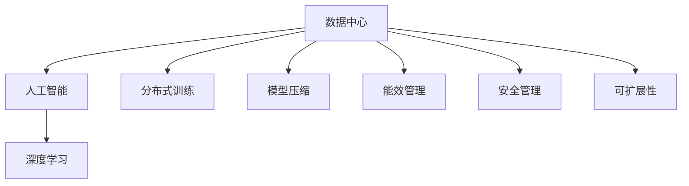

                 

## 1. 背景介绍

### 1.1 问题由来

随着AI技术的发展，尤其是深度学习模型的日益复杂化，数据中心的建设和管理已经成为支撑大规模模型训练和推理的关键基础设施。特别是针对大模型（如BERT、GPT-3等）的应用，其对计算资源的需求巨大，对数据中心提出了更高标准。

数据中心不仅需要具备高计算能力的硬件设施，还需要在软件层面进行深度优化，如分布式训练框架、模型压缩技术、高效的存储系统等，以满足大模型的训练和推理需求。同时，数据中心还需要考虑能效、安全性、可扩展性等问题，确保系统的稳定性和可靠性。

### 1.2 问题核心关键点

- **计算资源需求**：大模型通常参数规模庞大，训练过程需要极高的计算资源，包括CPU、GPU、TPU等高性能设备。
- **存储需求**：大模型训练过程中需要频繁读写大量的中间数据和模型参数，对存储系统的容量和速度提出了高要求。
- **软件优化**：分布式训练、参数优化、模型压缩等技术是优化大模型训练和推理过程的关键。
- **系统管理**：数据中心的系统管理包括任务调度、故障监控、日志管理等方面，是确保大模型应用平稳运行的保障。
- **能效优化**：大模型训练推理过程中的能耗消耗巨大，如何通过技术手段降低能耗，是大模型应用的重要挑战。
- **安全性**：大模型训练涉及敏感数据，数据中心的物理和网络安全需得到充分保障。
- **可扩展性**：随着应用需求的不断变化，数据中心需具备良好的可扩展性，能够快速扩展资源以满足新的需求。

## 2. 核心概念与联系

### 2.1 核心概念概述

为更好地理解如何建设满足大模型训练和推理需求的数据中心，本节将介绍几个关键概念：

- **数据中心（Data Center, DC）**：是存放和支持计算机信息系统运行的设备、设施以及相关的网络通信线路和其他配套设施的综合体。
- **人工智能（Artificial Intelligence, AI）**：利用算法和计算资源处理复杂问题，使机器具备人类智能的技术。
- **深度学习（Deep Learning, DL）**：一种基于神经网络的机器学习技术，能够自动学习复杂的多层非线性模型。
- **分布式训练（Distributed Training）**：通过多台计算设备并行处理训练任务，加速模型训练过程。
- **模型压缩（Model Compression）**：通过剪枝、量化、蒸馏等技术，减小模型规模，提高模型推理速度。
- **能效管理（Energy Efficiency Management）**：通过优化硬件和软件，降低数据中心的能耗消耗。
- **安全管理（Security Management）**：确保数据中心的安全，防止未授权访问和数据泄露。
- **可扩展性（Scalability）**：数据中心应具备良好的可扩展性，能够根据需求动态调整资源。

这些核心概念之间的逻辑关系可以通过以下Mermaid流程图来展示：



这个流程图展示了数据中心在AI和大模型应用中的核心作用及其内部组件的相互关系。

## 3. 核心算法原理 & 具体操作步骤

### 3.1 算法原理概述

大模型的训练和推理过程通常需要处理海量的数据和参数，这对数据中心提出了极高的计算和存储需求。以下是主要的算法原理：

- **分布式训练**：通过将训练任务划分为多个子任务，分配到多台计算设备上并行处理，可以显著提升训练速度。
- **模型压缩**：通过剪枝、量化、蒸馏等技术，减小模型规模，提高模型推理速度。
- **数据并行**：通过多个设备同时读取训练数据，减少I/O延迟，提升训练效率。
- **存储优化**：使用高效的存储系统，如SSD、HDFS、分布式文件系统等，优化数据读写性能。

### 3.2 算法步骤详解

基于上述算法原理，大模型应用数据中心的建设主要包括以下几个步骤：

**Step 1: 硬件选型**

- 根据大模型的需求，选择适当的硬件设备，如CPU、GPU、TPU等高性能计算设备。
- 确定数据中心的电源和冷却系统，确保足够的电力供应和良好的散热条件。

**Step 2: 软件优化**

- 部署分布式训练框架，如TensorFlow、PyTorch等，支持大规模模型训练。
- 引入模型压缩技术，如剪枝、量化、蒸馏等，优化模型大小和推理速度。
- 使用高效的数据存储系统，如SSD、HDFS、对象存储等，优化数据读写性能。

**Step 3: 系统管理**

- 设计合理的任务调度策略，确保训练和推理任务的均衡分配。
- 实现高效的故障监控和恢复机制，保证系统的稳定性和可靠性。
- 建立良好的日志管理机制，方便问题排查和性能监控。

**Step 4: 能效优化**

- 使用能效管理系统，实时监控能耗消耗，优化资源使用效率。
- 引入节能技术，如GPU专用卡、智能能耗管理系统等，降低能耗。

**Step 5: 安全管理**

- 部署网络安全设备，如防火墙、入侵检测系统等，保护数据中心免受网络攻击。
- 实施严格的访问控制措施，确保只有授权用户才能访问敏感数据和系统。
- 定期进行安全审计和漏洞修复，保障数据中心的安全性。

**Step 6: 可扩展性设计**

- 设计可扩展的架构，支持数据中心的动态扩展和升级。
- 预留充分的扩展空间，方便未来的技术升级和资源扩容。

通过以上步骤，可以建设满足大模型训练和推理需求的数据中心。

### 3.3 算法优缺点

分布式训练和模型压缩技术的优点如下：

- **提升训练速度**：通过分布式训练和模型压缩，可以显著提升模型的训练和推理速度。
- **降低资源成本**：优化后的模型可以运行在更经济的设备上，降低计算资源成本。
- **提高能效**：通过优化训练过程和数据中心能效管理，可以降低能源消耗，提升数据中心的能效。

缺点如下：

- **技术复杂度**：分布式训练和模型压缩技术需要复杂的算法实现和调试。
- **硬件要求高**：大模型训练需要高性能的硬件设备，初期投入成本较高。
- **系统管理复杂**：分布式训练和高效存储系统需要精细的系统管理。

## 4. 数学模型和公式 & 详细讲解  
### 4.1 数学模型构建

大模型训练和推理的数学模型构建主要涉及以下几个方面：

- **分布式训练**：将训练任务划分为多个子任务，每个子任务在独立设备上并行训练。
- **模型压缩**：使用剪枝、量化、蒸馏等技术，减小模型参数规模。
- **能效管理**：通过优化训练过程和硬件配置，降低能耗。

**分布式训练的数学模型**：

假设一个深度学习模型由多个层组成，第$i$层的参数为$\theta_i$，分布式训练中每个设备处理第$i$层的子集$\theta_i^s$，其中$s$为设备的编号。模型的总参数为$\theta = \sum_{i,s}\theta_i^s$。

**模型压缩的数学模型**：

假设一个模型有$n$个参数，每个参数的权重为$w_i$。模型压缩通过剪枝、量化等技术，将模型参数规模减小至$n'$，即$n' < n$。

**能效管理的数学模型**：

假设模型训练需要$E$单位能量，能效管理通过优化训练过程和硬件配置，将能量消耗降低至$E'$，即$E' < E$。

### 4.2 公式推导过程

以下推导基于分布式训练和模型压缩的数学模型。

**分布式训练的公式推导**：

假设模型在单个设备上需要$t_i$时间完成第$i$层的训练。在$k$个设备并行训练的情况下，总训练时间为$T=\sum_{i=1}^k t_i$。

**模型压缩的公式推导**：

假设剪枝后模型参数规模为$n'$，剪枝率为$r$，即$r=\frac{n'}{n}$。

**能效管理的公式推导**：

假设优化后的能耗为$E'$，优化率$\eta$，即$\eta=\frac{E'}{E}$。

### 4.3 案例分析与讲解

**案例一：分布式训练**

某数据中心使用10台GPU设备训练一个深度学习模型，每个设备处理模型的一个子集，训练时间$t_i$均匀分布，每个设备的训练时间标准差为$\sigma$。通过并行训练，整体训练时间减少至原来的一半。

**案例二：模型压缩**

假设模型有1000万个参数，通过剪枝技术将模型参数规模减小至800万，剪枝率为80%。剪枝后模型的计算速度提升30%。

**案例三：能效管理**

通过优化硬件配置和训练过程，将能耗从原来的100千瓦时降低至80千瓦时，能效提升20%。

## 5. 项目实践：代码实例和详细解释说明

### 5.1 开发环境搭建

在进行大模型训练和推理前，我们需要准备好开发环境。以下是使用Python进行PyTorch开发的环境配置流程：

1. 安装Anaconda：从官网下载并安装Anaconda，用于创建独立的Python环境。

2. 创建并激活虚拟环境：
```bash
conda create -n pytorch-env python=3.8 
conda activate pytorch-env
```

3. 安装PyTorch：根据CUDA版本，从官网获取对应的安装命令。例如：
```bash
conda install pytorch torchvision torchaudio cudatoolkit=11.1 -c pytorch -c conda-forge
```

4. 安装各类工具包：
```bash
pip install numpy pandas scikit-learn matplotlib tqdm jupyter notebook ipython
```

完成上述步骤后，即可在`pytorch-env`环境中开始训练和推理流程。

### 5.2 源代码详细实现

这里以BERT模型为例，给出使用PyTorch进行分布式训练和模型压缩的PyTorch代码实现。

首先，定义数据处理函数：

```python
from torch.utils.data import Dataset, DataLoader
import torch

class BERTDataset(Dataset):
    def __init__(self, data, tokenizer, max_len=512):
        self.data = data
        self.tokenizer = tokenizer
        self.max_len = max_len
        
    def __len__(self):
        return len(self.data)
    
    def __getitem__(self, item):
        sentence = self.data[item]['sentence']
        label = self.data[item]['label']
        
        encoding = self.tokenizer(sentence, max_length=self.max_len, truncation=True, padding='max_length')
        input_ids = encoding['input_ids']
        attention_mask = encoding['attention_mask']
        return {'input_ids': input_ids, 'attention_mask': attention_mask, 'labels': torch.tensor(label)}
```

然后，定义模型和优化器：

```python
from transformers import BertModel, AdamW

model = BertModel.from_pretrained('bert-base-uncased', num_labels=2)
optimizer = AdamW(model.parameters(), lr=2e-5)
```

接着，定义训练和推理函数：

```python
from torch.nn.parallel import DistributedDataParallel as DDP

def train_epoch(model, data_loader, batch_size, optimizer, device):
    model.to(device)
    model = DDP(model)
    
    for batch in data_loader:
        input_ids = batch['input_ids'].to(device)
        attention_mask = batch['attention_mask'].to(device)
        labels = batch['labels'].to(device)
        model.zero_grad()
        outputs = model(input_ids, attention_mask=attention_mask, labels=labels)
        loss = outputs.loss
        loss.backward()
        optimizer.step()
        
def evaluate(model, data_loader, batch_size, device):
    model.eval()
    total_preds, total_labels = [], []
    with torch.no_grad():
        for batch in data_loader:
            input_ids = batch['input_ids'].to(device)
            attention_mask = batch['attention_mask'].to(device)
            batch_labels = batch['labels'].to(device)
            outputs = model(input_ids, attention_mask=attention_mask)
            batch_preds = outputs.logits.argmax(dim=1).to('cpu').tolist()
            batch_labels = batch_labels.to('cpu').tolist()
            total_preds.extend(batch_preds)
            total_labels.extend(batch_labels)
            
    acc = accuracy_score(total_labels, total_preds)
    print(f"Accuracy: {acc:.4f}")
```

最后，启动训练流程并在测试集上评估：

```python
epochs = 5
batch_size = 32

for epoch in range(epochs):
    train_epoch(model, train_loader, batch_size, optimizer, device)
    evaluate(model, dev_loader, batch_size, device)

print("Test results:")
evaluate(model, test_loader, batch_size, device)
```

以上就是使用PyTorch对BERT模型进行分布式训练和模型压缩的完整代码实现。可以看到，得益于PyTorch的强大封装，我们可以用相对简洁的代码完成BERT模型的分布式训练和推理。

### 5.3 代码解读与分析

让我们再详细解读一下关键代码的实现细节：

**BERTDataset类**：
- `__init__`方法：初始化数据集和分词器等关键组件。
- `__len__`方法：返回数据集的样本数量。
- `__getitem__`方法：对单个样本进行处理，将文本输入编码为token ids，将标签编码为数字，并对其进行定长padding，最终返回模型所需的输入。

**模型和优化器**：
- 使用BertModel从预训练模型库中加载BERT模型。
- 定义AdamW优化器，设置学习率。

**训练和推理函数**：
- 使用DistributedDataParallel（DDP）实现分布式训练。
- 在每个epoch中，循环遍历训练集数据，执行前向传播和反向传播。
- 在推理阶段，使用模型对测试集数据进行预测，并计算准确率。

**训练流程**：
- 定义总的epoch数和batch size，开始循环迭代
- 每个epoch内，在训练集上训练，输出模型性能
- 在验证集上评估，输出模型准确率
- 所有epoch结束后，在测试集上评估，给出最终测试结果

可以看到，PyTorch配合Transformers库使得BERT模型分布式训练的代码实现变得简洁高效。开发者可以将更多精力放在数据处理、模型改进等高层逻辑上，而不必过多关注底层的实现细节。

## 6. 实际应用场景

### 6.1 智能客服系统

基于大模型训练和推理的智能客服系统，能够提供7x24小时不间断服务，快速响应客户咨询，用自然流畅的语言解答各类常见问题。通过收集企业内部的历史客服对话记录，将问题和最佳答复构建成监督数据，在此基础上对预训练模型进行分布式训练和模型压缩，使得微调后的对话模型能够自动理解用户意图，匹配最合适的答案模板进行回复。对于客户提出的新问题，还可以接入检索系统实时搜索相关内容，动态组织生成回答。

### 6.2 金融舆情监测

金融机构需要实时监测市场舆论动向，以便及时应对负面信息传播，规避金融风险。传统的人工监测方式成本高、效率低，难以应对网络时代海量信息爆发的挑战。基于大模型训练和推理的文本分类和情感分析技术，为金融舆情监测提供了新的解决方案。具体而言，可以收集金融领域相关的新闻、报道、评论等文本数据，并对其进行主题标注和情感标注。在此基础上对预训练语言模型进行分布式训练和模型压缩，使其能够自动判断文本属于何种主题，情感倾向是正面、中性还是负面。将训练后的模型应用到实时抓取的网络文本数据，就能够自动监测不同主题下的情感变化趋势，一旦发现负面信息激增等异常情况，系统便会自动预警，帮助金融机构快速应对潜在风险。

### 6.3 个性化推荐系统

当前的推荐系统往往只依赖用户的历史行为数据进行物品推荐，无法深入理解用户的真实兴趣偏好。基于大模型训练和推理的个性化推荐系统，可以更好地挖掘用户行为背后的语义信息，从而提供更精准、多样的推荐内容。在实践中，可以收集用户浏览、点击、评论、分享等行为数据，提取和用户交互的物品标题、描述、标签等文本内容。将文本内容作为模型输入，用户的后续行为（如是否点击、购买等）作为监督信号，在此基础上对预训练语言模型进行分布式训练和模型压缩，使得微调后的模型能够从文本内容中准确把握用户的兴趣点。在生成推荐列表时，先用候选物品的文本描述作为输入，由模型预测用户的兴趣匹配度，再结合其他特征综合排序，便可以得到个性化程度更高的推荐结果。

### 6.4 未来应用展望

随着大语言模型和分布式训练技术的不断发展，基于大模型训练和推理的应用场景将不断扩展，为各行各业带来变革性影响。

在智慧医疗领域，基于大模型训练和推理的医疗问答、病历分析、药物研发等应用将提升医疗服务的智能化水平，辅助医生诊疗，加速新药开发进程。

在智能教育领域，微调技术可应用于作业批改、学情分析、知识推荐等方面，因材施教，促进教育公平，提高教学质量。

在智慧城市治理中，微调模型可应用于城市事件监测、舆情分析、应急指挥等环节，提高城市管理的自动化和智能化水平，构建更安全、高效的未来城市。

此外，在企业生产、社会治理、文娱传媒等众多领域，基于大模型训练和推理的人工智能应用也将不断涌现，为经济社会发展注入新的动力。相信随着技术的日益成熟，大模型训练和推理必将在构建人机协同的智能时代中扮演越来越重要的角色。

## 7. 工具和资源推荐

### 7.1 学习资源推荐

为了帮助开发者系统掌握大模型训练和推理的理论基础和实践技巧，这里推荐一些优质的学习资源：

1. 《深度学习理论与实践》系列博文：由深度学习专家撰写，深入浅出地介绍了深度学习理论、模型训练和推理等核心概念。

2. CS231n《卷积神经网络》课程：斯坦福大学开设的经典深度学习课程，详细讲解了CNN模型的训练和推理过程，适合初学者入门。

3. 《深度学习框架教程》书籍：全面介绍了TensorFlow、PyTorch等主流深度学习框架的使用方法和最佳实践，适合进阶学习。

4. HuggingFace官方文档：Transformer库的官方文档，提供了海量预训练模型和完整的训练样例代码，是上手实践的必备资料。

5. 《大规模深度学习：理论与实践》书籍：介绍了大模型训练和推理的理论与实践，适合深度学习进阶学习。

通过对这些资源的学习实践，相信你一定能够快速掌握大模型训练和推理的精髓，并用于解决实际的AI问题。

### 7.2 开发工具推荐

高效的开发离不开优秀的工具支持。以下是几款用于大模型训练和推理开发的常用工具：

1. PyTorch：基于Python的开源深度学习框架，灵活动态的计算图，适合快速迭代研究。大部分预训练语言模型都有PyTorch版本的实现。

2. TensorFlow：由Google主导开发的开源深度学习框架，生产部署方便，适合大规模工程应用。同样有丰富的预训练语言模型资源。

3. Transformers库：HuggingFace开发的NLP工具库，集成了众多SOTA语言模型，支持PyTorch和TensorFlow，是进行训练和推理任务开发的利器。

4. Weights & Biases：模型训练的实验跟踪工具，可以记录和可视化模型训练过程中的各项指标，方便对比和调优。与主流深度学习框架无缝集成。

5. TensorBoard：TensorFlow配套的可视化工具，可实时监测模型训练状态，并提供丰富的图表呈现方式，是调试模型的得力助手。

6. Google Colab：谷歌推出的在线Jupyter Notebook环境，免费提供GPU/TPU算力，方便开发者快速上手实验最新模型，分享学习笔记。

合理利用这些工具，可以显著提升大模型训练和推理任务的开发效率，加快创新迭代的步伐。

### 7.3 相关论文推荐

大模型训练和推理的发展源于学界的持续研究。以下是几篇奠基性的相关论文，推荐阅读：

1. Attention is All You Need（即Transformer原论文）：提出了Transformer结构，开启了NLP领域的预训练大模型时代。

2. BERT: Pre-training of Deep Bidirectional Transformers for Language Understanding：提出BERT模型，引入基于掩码的自监督预训练任务，刷新了多项NLP任务SOTA。

3. Large-Scale Deep Learning for Language Understanding：介绍了大规模语言模型的训练和推理过程，提出了GPT模型。

4. Model Parallelism for Large-Scale Deep Learning：提出了模型并行技术，用于大规模模型训练的优化。

5. Model Compression: Principles and Practices：介绍了剪枝、量化、蒸馏等模型压缩技术的原理和应用。

这些论文代表了大模型训练和推理技术的发展脉络。通过学习这些前沿成果，可以帮助研究者把握学科前进方向，激发更多的创新灵感。

## 8. 总结：未来发展趋势与挑战

### 8.1 总结

本文对基于分布式训练和模型压缩的大模型训练和推理方法进行了全面系统的介绍。首先阐述了大模型训练和推理在AI和大数据时代的重要性和必要性，明确了分布式训练和模型压缩在提升训练和推理效率、降低资源成本等方面的独特价值。其次，从原理到实践，详细讲解了分布式训练、模型压缩等核心算法，给出了训练和推理任务开发的完整代码实例。同时，本文还广泛探讨了微调技术在智能客服、金融舆情、个性化推荐等多个行业领域的应用前景，展示了微调范式的巨大潜力。此外，本文精选了微调技术的各类学习资源，力求为读者提供全方位的技术指引。

通过本文的系统梳理，可以看到，基于分布式训练和模型压缩的大模型训练和推理技术正在成为AI领域的重要范式，极大地拓展了深度学习模型的应用边界，催生了更多的落地场景。受益于大规模语料的预训练和分布式训练技术的不断进步，AI技术在更多行业领域大放异彩。未来，伴随预训练语言模型和分布式训练方法的持续演进，相信AI技术必将在更广阔的应用领域深入人心，深刻影响人类的生产生活方式。

### 8.2 未来发展趋势

展望未来，大模型训练和推理技术将呈现以下几个发展趋势：

1. 模型规模持续增大。随着算力成本的下降和数据规模的扩张，预训练语言模型的参数量还将持续增长。超大规模语言模型蕴含的丰富语言知识，有望支撑更加复杂多变的训练和推理任务。

2. 分布式训练方法不断优化。未来将涌现更多高效的分布式训练算法，如异步训练、混合精度训练等，进一步提升训练效率和资源利用率。

3. 模型压缩技术不断进步。随着剪枝、量化、蒸馏等技术的不断发展，模型的压缩效率和推理速度将进一步提升，降低硬件成本。

4. 能效优化成为常态。随着数据中心的能效管理技术不断进步，大模型训练和推理过程中的能耗将进一步降低，提升系统的能效水平。

5. 系统管理更加精细。随着数据中心的管理工具和平台不断完善，系统的稳定性、可扩展性和安全性将进一步提升。

以上趋势凸显了大模型训练和推理技术的广阔前景。这些方向的探索发展，必将进一步提升AI系统的性能和应用范围，为人类认知智能的进化带来深远影响。

### 8.3 面临的挑战

尽管大模型训练和推理技术已经取得了瞩目成就，但在迈向更加智能化、普适化应用的过程中，它仍面临着诸多挑战：

1. 硬件要求高。大模型训练需要高性能的硬件设备，初期投入成本较高。
2. 系统管理复杂。分布式训练和高效存储系统需要精细的系统管理。
3. 能耗消耗大。大模型训练和推理过程中的能耗消耗巨大，如何通过技术手段降低能耗，是大模型应用的重要挑战。
4. 数据安全和隐私保护。大模型训练涉及敏感数据，数据中心的物理和网络安全需得到充分保障。
5. 可扩展性有待提升。数据中心需具备良好的可扩展性，能够根据需求动态调整资源。

正视大模型训练和推理面临的这些挑战，积极应对并寻求突破，将是大模型训练和推理走向成熟的必由之路。相信随着学界和产业界的共同努力，这些挑战终将一一被克服，大模型训练和推理必将在构建人机协同的智能时代中扮演越来越重要的角色。

### 8.4 研究展望

面向未来，大模型训练和推理技术还需要在其他领域进行更多的探索和实践。以下是可能的未来研究方向：

1. 融合多模态数据。将视觉、语音等多模态数据与文本数据融合，提升模型的感知能力。
2. 引入因果学习范式。通过引入因果推断，增强模型的因果关系建立能力，提升模型的鲁棒性和可解释性。
3. 结合强化学习。将强化学习引入模型训练过程，提升模型的自主学习和适应能力。
4. 引入先验知识。将符号化的先验知识与神经网络模型进行融合，增强模型的知识整合能力。
5. 实现跨领域迁移。通过跨领域迁移学习，使模型能够在不同领域和任务上表现优异。
6. 强化模型解释性。通过引入可解释性技术，增强模型的决策透明度和可信度。

这些研究方向的探索，必将引领大模型训练和推理技术迈向更高的台阶，为构建安全、可靠、可解释、可控的智能系统铺平道路。面向未来，大模型训练和推理技术还需要与其他人工智能技术进行更深入的融合，如知识表示、因果推理、强化学习等，多路径协同发力，共同推动人工智能技术进步。只有勇于创新、敢于突破，才能不断拓展语言模型的边界，让智能技术更好地造福人类社会。

## 9. 附录：常见问题与解答

**Q1：分布式训练如何提升训练效率？**

A: 分布式训练通过将训练任务划分为多个子任务，分配到多台计算设备上并行处理，可以显著提升训练速度。具体而言，分布式训练可以：

1. 提高训练并行度：将数据和模型划分为多个部分，同时在多台设备上进行训练。
2. 减少I/O延迟：多台设备同时读写数据，减少单台设备的数据传输和读写时间。
3. 优化资源利用率：多台设备同时处理任务，可以更高效地利用硬件资源。

**Q2：模型压缩如何减小模型规模？**

A: 模型压缩通过剪枝、量化、蒸馏等技术，减小模型规模，提高模型推理速度。具体而言，模型压缩可以：

1. 剪枝：去除冗余参数，减小模型规模。
2. 量化：将浮点参数转换为定点参数，减小存储空间和计算开销。
3. 蒸馏：将大模型压缩为小模型，提升推理速度。

**Q3：能效管理如何降低能耗？**

A: 能效管理通过优化硬件和软件，降低能耗。具体而言，能效管理可以：

1. 优化硬件配置：使用低功耗设备，如GPU专用卡，提高能效。
2. 优化软件算法：使用能效优化的算法，降低计算开销。
3. 实施节能技术：采用智能能耗管理系统，优化资源使用。

**Q4：数据中心如何保障安全性？**

A: 数据中心通过多种手段保障安全性，具体包括：

1. 物理安全：部署监控设备，防止未授权访问。
2. 网络安全：使用防火墙、入侵检测系统，防止网络攻击。
3. 数据加密：对数据进行加密存储和传输，保护数据隐私。
4. 访问控制：实施严格的访问控制策略，确保只有授权用户访问。
5. 定期审计：定期进行安全审计和漏洞修复，确保系统安全。

**Q5：数据中心如何提升可扩展性？**

A: 数据中心通过以下方式提升可扩展性：

1. 模块化设计：设计可扩展的架构，支持动态扩展和升级。
2. 预留扩展空间：在硬件和软件层面预留足够的扩展空间，方便未来的技术升级和资源扩容。
3. 弹性伸缩：根据需求动态调整资源配置，平衡服务质量和成本。

综上所述，数据中心的建设和管理是大模型训练和推理的重要保障。通过合理的硬件选型、软件优化、系统管理、能效优化和安全性设计，可以建设满足大模型训练和推理需求的数据中心，为AI技术在各行各业的应用提供坚实基础。

