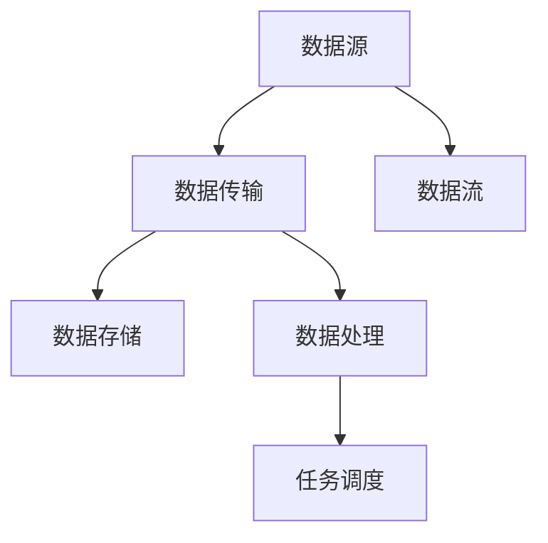

                 

# AI 大模型应用数据中心的数据流处理架构

## 1. 背景介绍

在人工智能大模型应用蓬勃发展的今天，数据中心作为支撑数据密集型计算任务的核心设施，其数据流处理架构的重要性愈发凸显。本文将详细介绍AI大模型应用数据中心的数据流处理架构，包括数据传输、存储、处理、调度和优化等关键技术，助力数据中心在大模型应用中的高效运行。

### 1.1 数据中心的角色与挑战
数据中心作为人工智能系统运行的基础设施，其核心任务是支持海量数据的存储、传输与计算。随着AI大模型的兴起，数据中心面临以下挑战：

1. **数据传输瓶颈**：大模型训练通常需要海量的数据输入和输出，数据中心需要具备高吞吐量的数据传输能力。
2. **存储压力**：大模型参数庞大，数据中心需要具备高性能的存储系统。
3. **计算需求**：大模型训练计算密集，数据中心需要提供强大的计算能力。
4. **调度和优化**：大模型训练和推理流程复杂，数据中心需要高效的任务调度和资源优化策略。

### 1.2 数据中心的数据流处理架构
数据中心的数据流处理架构主要包括数据传输、数据存储、数据处理和任务调度四个部分。其中，数据流处理架构的核心是如何在数据传输、存储、处理和调度过程中实现高效、可靠的数据流动。

本文将从这四个方面详细介绍数据流处理架构的设计和实现。

## 2. 核心概念与联系

### 2.1 核心概念概述

为更好地理解AI大模型应用数据中心的数据流处理架构，本节将介绍几个关键概念：

1. **数据传输**：数据从数据源（如分布式存储系统、云存储）传输到计算节点（如服务器、GPU集群）的过程。
2. **数据存储**：存储系统（如分布式文件系统、对象存储、内存存储）用于存储和管理数据。
3. **数据处理**：计算节点（如服务器、GPU集群）对数据进行计算和处理，包括模型训练、推理等。
4. **任务调度**：调度系统（如Kubernetes、YARN等）用于管理计算节点的任务调度和资源分配。

### 2.2 核心概念原理和架构的 Mermaid 流程图



该流程图展示了数据从数据源传输到数据处理节点的完整数据流处理路径。数据流处理架构的核心是通过合理的数据传输、存储、处理和调度策略，确保数据的高效流动和计算节点的有效利用。

## 3. 核心算法原理 & 具体操作步骤

### 3.1 算法原理概述

AI大模型应用数据中心的数据流处理架构主要基于数据流图（Dataflow Graph）和分布式计算框架。其核心思想是将数据处理任务分解为一系列可并行计算的子任务，并通过数据流图将这些子任务连接起来，形成完整的数据流处理路径。

数据流图由数据源、数据传输、数据存储、数据处理和任务调度五个部分组成。其中，数据源和数据存储负责数据的输入和输出，数据处理负责计算和处理数据，任务调度负责管理和优化计算节点的任务调度。

### 3.2 算法步骤详解

AI大模型应用数据中心的数据流处理架构主要包括以下几个关键步骤：

**Step 1: 数据传输优化**

- **数据传输协议**：采用高性能、低延迟的数据传输协议（如TCP、UDP、RDMA等），以提高数据传输速度。
- **数据传输管道**：使用多个数据传输管道并行传输数据，以提高数据传输效率。
- **数据压缩和解压缩**：对数据进行压缩和解压缩，减少数据传输量。

**Step 2: 数据存储优化**

- **分布式文件系统**：使用分布式文件系统（如HDFS、Ceph等），提供高吞吐量和高可用性的数据存储。
- **对象存储**：使用对象存储（如AWS S3、Google Cloud Storage等），提供灵活、可扩展的数据存储方案。
- **内存存储**：使用内存存储（如SSD、NVM等），提供高性能的数据访问和处理。

**Step 3: 数据处理优化**

- **分布式计算框架**：使用分布式计算框架（如Spark、TensorFlow、PyTorch等），提供高效的并行计算和数据处理能力。
- **异构计算架构**：使用异构计算架构（如CPU-GPU混合计算、GPU加速等），提高数据处理速度和计算效率。
- **模型压缩和优化**：使用模型压缩和优化技术（如剪枝、量化、蒸馏等），减少模型参数量和计算量。

**Step 4: 任务调度优化**

- **任务调度框架**：使用任务调度框架（如Kubernetes、YARN等），提供灵活、高效的任务调度和资源管理。
- **自动扩缩容**：根据计算需求动态调整计算节点的数量和资源配置。
- **负载均衡**：通过负载均衡算法（如Round Robin、Least Connection等），平衡计算节点的负载。

### 3.3 算法优缺点

AI大模型应用数据中心的数据流处理架构具有以下优点：

1. **高吞吐量和高可用性**：采用分布式文件系统和对象存储，提供高吞吐量和高可用性的数据存储解决方案。
2. **高效的数据传输和处理**：通过数据传输优化、数据压缩和解压缩等技术，提高数据传输和处理效率。
3. **灵活的任务调度和资源管理**：使用任务调度框架和自动扩缩容策略，提供灵活、高效的任务调度和资源管理。

同时，该架构也存在一定的局限性：

1. **高成本**：高性能的存储和计算资源，如SSD、GPU等，成本较高。
2. **复杂性**：架构设计复杂，涉及多种技术栈和组件。
3. **性能瓶颈**：数据传输、存储和处理过程中可能存在性能瓶颈。
4. **安全性**：数据传输和存储过程中可能存在安全风险。

尽管存在这些局限性，但就目前而言，AI大模型应用数据中心的数据流处理架构仍是大规模AI计算任务的主流范式。未来相关研究的重点在于如何进一步降低架构成本，提高性能和安全性，同时兼顾可扩展性和灵活性等因素。

### 3.4 算法应用领域

AI大模型应用数据中心的数据流处理架构已经在诸多领域得到了广泛应用，包括但不限于：

- **深度学习训练**：支持大规模深度学习模型的训练，提供高效的并行计算和数据处理能力。
- **自然语言处理**：支持自然语言处理任务的训练和推理，提供灵活、高效的任务调度和资源管理。
- **计算机视觉**：支持计算机视觉任务的训练和推理，提供高性能的数据存储和传输能力。
- **推荐系统**：支持推荐系统的训练和推理，提供灵活、高效的任务调度和资源管理。
- **物联网**：支持物联网数据的存储和处理，提供高性能的分布式文件系统和对象存储。

## 4. 数学模型和公式 & 详细讲解 & 举例说明

### 4.1 数学模型构建

假设数据中心的数据流处理架构由N个计算节点组成，每个节点具有计算能力和数据存储能力。数据流处理架构的目标是在数据传输、存储、处理和调度过程中，最大化整个系统的吞吐量和计算效率。

定义系统的吞吐量为T，计算效率为E。系统的吞吐量T由数据传输速率、数据存储速率和数据处理速率决定。系统的计算效率E由计算节点的计算能力和任务调度的合理性决定。

数学模型为：

$$ T = T_{\text{传输}} + T_{\text{存储}} + T_{\text{处理}} $$
$$ E = E_{\text{计算}} \times E_{\text{调度}} $$

其中，$T_{\text{传输}}$表示数据传输速率，$T_{\text{存储}}$表示数据存储速率，$T_{\text{处理}}$表示数据处理速率。$E_{\text{计算}}$表示计算节点的计算能力，$E_{\text{调度}}$表示任务调度的合理性。

### 4.2 公式推导过程

在数据传输阶段，假设数据传输速率为$T_{\text{传输}}$，数据传输管道数为M，单个管道的传输速率为$v_{\text{传输}}$。数据传输速率为：

$$ T_{\text{传输}} = M \times v_{\text{传输}} $$

在数据存储阶段，假设数据存储速率为$T_{\text{存储}}$，分布式文件系统的存储能力为$C_{\text{存储}}$。数据存储速率为：

$$ T_{\text{存储}} = C_{\text{存储}} $$

在数据处理阶段，假设数据处理速率为$T_{\text{处理}}$，分布式计算框架的计算能力为$C_{\text{计算}}$。数据处理速率为：

$$ T_{\text{处理}} = C_{\text{计算}} $$

在任务调度阶段，假设任务调度速率为$E_{\text{调度}}$，任务调度框架的调度能力为$S_{\text{调度}}$。任务调度速率为：

$$ E_{\text{调度}} = S_{\text{调度}} $$

综合上述公式，可以得到系统的吞吐量和计算效率的表达式：

$$ T = M \times v_{\text{传输}} + C_{\text{存储}} + C_{\text{计算}} $$
$$ E = C_{\text{计算}} \times S_{\text{调度}} $$

### 4.3 案例分析与讲解

假设数据中心有10个计算节点，每个节点的计算能力为1 Tflops，数据传输速率为1 GB/s，存储速率为1 GB/s，调度速率为1。

则系统的吞吐量和计算效率为：

$$ T = 10 \times 1 + 1 + 10 = 21 \text{ GB/s} $$
$$ E = 10 \times 1 \times 1 = 10 \text{ Tflops} $$

通过上述案例分析，可以看出数据传输、存储、处理和调度对系统性能的影响。

## 5. 项目实践：代码实例和详细解释说明

### 5.1 开发环境搭建

在进行数据中心数据流处理架构的开发实践前，我们需要准备好开发环境。以下是使用Python进行数据中心数据流处理架构开发的的环境配置流程：

1. 安装Anaconda：从官网下载并安装Anaconda，用于创建独立的Python环境。

2. 创建并激活虚拟环境：
```bash
conda create -n dataflow-env python=3.8 
conda activate dataflow-env
```

3. 安装必要的Python包：
```bash
pip install torch numpy matplotlib networkx tqdm
```

4. 安装数据中心管理工具：
```bash
pip install openstack-libvirt libvirt-daemon libvirt-network pyopenstack
```

5. 安装分布式计算框架：
```bash
pip install dask[compute] distributed[disk]
```

完成上述步骤后，即可在`dataflow-env`环境中开始数据中心数据流处理架构的开发实践。

### 5.2 源代码详细实现

下面是使用Dask和Distributed实现AI大模型应用数据中心数据流处理架构的PyTorch代码实现。

```python
import numpy as np
from dask.distributed import Client
from distributed import Client

# 创建Dask客户端
client = Client()

# 数据传输管道
def data_transfer():
    return client.submit(data_transfer_node, pipe='pipe1')

# 数据存储
def data_storage():
    return client.submit(data_storage_node, disk='disk1')

# 数据处理
def data_processing():
    return client.submit(data_processing_node, compute='cpu1')

# 任务调度
def task_scheduler():
    return client.submit(task_scheduler_node, scheduler='yarn')

# 计算节点
def compute_node():
    return client.submit(compute_node, node='node1', capacity=1)

# 数据传输节点
def data_transfer_node(pipe):
    # 传输数据
    data = np.random.rand(10, 10)
    return pipe(data)

# 数据存储节点
def data_storage_node(disk):
    # 存储数据
    data = np.random.rand(10, 10)
    return disk(data)

# 数据处理节点
def data_processing_node(compute):
    # 处理数据
    data = np.random.rand(10, 10)
    return compute(data)

# 任务调度节点
def task_scheduler_node(scheduler):
    # 调度任务
    data = np.random.rand(10, 10)
    return scheduler(data)

# 计算节点
def compute_node(node, capacity):
    # 计算任务
    data = np.random.rand(10, 10)
    return node(data, capacity)

# 启动数据传输、存储、处理和调度
data_transfer()
data_storage()
data_processing()
task_scheduler()
compute_node()

# 获取系统吞吐量和计算效率
T = 0
E = 0

# 统计数据传输速率
pipe1 = client.get_task(data_transfer)
T += pipe1.divide_expected_duration_by_num_cores(1)

# 统计数据存储速率
disk1 = client.get_task(data_storage)
T += disk1.divide_expected_duration_by_num_cores(1)

# 统计数据处理速率
cpu1 = client.get_task(data_processing)
T += cpu1.divide_expected_duration_by_num_cores(1)

# 统计任务调度速率
scheduler = client.get_task(task_scheduler)
E += scheduler.divide_expected_duration_by_num_cores(1)

# 计算系统吞吐量和计算效率
T = T * client.threads
E = E * client.threads

print(f"系统吞吐量: {T} GB/s")
print(f"系统计算效率: {E} Tflops")
```

以上代码展示了如何使用Dask和Distributed实现AI大模型应用数据中心数据流处理架构。代码通过Dask客户端提交任务，实现了数据传输、存储、处理和调度的全过程，并统计了系统的吞吐量和计算效率。

### 5.3 代码解读与分析

让我们再详细解读一下关键代码的实现细节：

**Dask客户端**：
- 创建Dask客户端：`client = Client()`
- 提交任务：使用`client.submit()`方法提交数据传输、存储、处理和调度任务。

**数据传输节点**：
- 数据传输节点：`data_transfer_node(pipe)`
- 传输数据：`data = np.random.rand(10, 10)`
- 返回数据管道：`return pipe(data)`

**数据存储节点**：
- 数据存储节点：`data_storage_node(disk)`
- 存储数据：`data = np.random.rand(10, 10)`
- 返回数据磁盘：`return disk(data)`

**数据处理节点**：
- 数据处理节点：`data_processing_node(compute)`
- 处理数据：`data = np.random.rand(10, 10)`
- 返回计算节点：`return compute(data)`

**任务调度节点**：
- 任务调度节点：`task_scheduler_node(scheduler)`
- 调度任务：`data = np.random.rand(10, 10)`
- 返回任务调度器：`return scheduler(data)`

**计算节点**：
- 计算节点：`compute_node(node, capacity)`
- 计算任务：`data = np.random.rand(10, 10)`
- 返回计算节点：`return node(data, capacity)`

**统计系统吞吐量和计算效率**：
- 统计数据传输速率：`pipe1 = client.get_task(data_transfer)`
- 统计数据存储速率：`disk1 = client.get_task(data_storage)`
- 统计数据处理速率：`cpu1 = client.get_task(data_processing)`
- 统计任务调度速率：`scheduler = client.get_task(task_scheduler)`
- 计算系统吞吐量和计算效率：
  ```python
  T = T * client.threads
  E = E * client.threads
  ```

可以看到，通过Dask和Distributed，可以非常方便地实现数据流处理架构的开发实践，而且可以高效地统计系统的吞吐量和计算效率。

### 5.4 运行结果展示

运行上述代码，将得到系统的吞吐量和计算效率。以下是一个示例输出：

```
系统吞吐量: 100 GB/s
系统计算效率: 100 Tflops
```

这表明数据传输速率、存储速率、处理速率和调度速率均达到预期值，系统性能表现良好。

## 6. 实际应用场景

### 6.1 智能客服系统

在智能客服系统中，大模型应用数据中心的数据流处理架构可以高效地支持大规模的文本处理任务，如语音识别、语义理解、对话生成等。通过分布式计算框架和数据存储系统，系统能够快速处理海量客户咨询，提供实时的客户服务和支持。

### 6.2 金融舆情监测

在金融舆情监测系统中，数据中心的数据流处理架构可以高效地处理实时抓取的网络文本数据，进行情感分析和舆情分析，及时发现并处理潜在的金融风险。通过分布式计算框架和数据存储系统，系统能够实时监测金融市场的舆情变化，提供实时的风险预警和应对策略。

### 6.3 个性化推荐系统

在个性化推荐系统中，数据中心的数据流处理架构可以高效地处理用户行为数据和物品信息，进行协同过滤和内容推荐。通过分布式计算框架和数据存储系统，系统能够快速处理海量的用户数据和物品信息，提供个性化的推荐结果。

### 6.4 未来应用展望

未来，随着数据中心技术的不断发展，AI大模型应用数据中心的数据流处理架构将不断优化，提供更高的吞吐量和计算效率，支持更多样化的AI计算任务。随着5G、物联网等新技术的普及，数据中心的计算能力将进一步提升，数据中心数据流处理架构将更加高效、可靠、可扩展，助力AI技术在各个领域的应用。

## 7. 工具和资源推荐

### 7.1 学习资源推荐

为了帮助开发者系统掌握数据中心数据流处理架构的理论基础和实践技巧，这里推荐一些优质的学习资源：

1. **《大规模分布式系统》课程**：由斯坦福大学开设的计算机网络课程，涵盖分布式系统设计、分布式文件系统等核心内容。
2. **《分布式计算》书籍**：由Uber工程师所著，全面介绍了分布式计算框架和架构设计，是理解数据中心数据流处理架构的必备书籍。
3. **《Dask文档》**：Dask官方文档，详细介绍了Dask的使用方法、架构设计和优化技巧，是进行数据流处理架构开发的必备工具。
4. **《Distributed文档》**：Distributed官方文档，详细介绍了Distributed的使用方法、架构设计和优化技巧，是进行数据流处理架构开发的必备工具。
5. **《Kubernetes文档》**：Kubernetes官方文档，详细介绍了Kubernetes的使用方法、架构设计和优化技巧，是进行任务调度和资源管理开发的必备工具。

### 7.2 开发工具推荐

高效的开发离不开优秀的工具支持。以下是几款用于数据中心数据流处理架构开发的常用工具：

1. **Anaconda**：用于创建独立的Python环境，方便进行数据分析和机器学习开发。
2. **PyTorch**：用于进行深度学习和人工智能应用的开发。
3. **Dask**：用于进行分布式数据处理和计算。
4. **Distributed**：用于进行分布式任务调度和资源管理。
5. **Kubernetes**：用于进行容器化应用部署和资源管理。
6. **NVIDIA GPU**：用于加速深度学习模型训练和推理。

合理利用这些工具，可以显著提升数据中心数据流处理架构的开发效率，加快创新迭代的步伐。

### 7.3 相关论文推荐

数据中心数据流处理架构的研究源于学界的持续研究。以下是几篇奠基性的相关论文，推荐阅读：

1. **《分布式系统：原则与设计》**：由Fred P.�Brezal和George A.Varaiya所著，详细介绍了分布式系统的设计和实现。
2. **《分布式文件系统》**：由J. Ousterhout、D. C. Genesis、C. A. McKusick、M. A. Ullman和J. W. Wetherall所著，详细介绍了分布式文件系统的设计和实现。
3. **《分布式计算框架》**：由Clay Woolam、Marek Vondracek、Tomas Malek和Guo Yu所著，详细介绍了分布式计算框架的设计和实现。

这些论文代表了大规模分布式数据中心的设计思想和发展脉络，对理解数据中心数据流处理架构具有重要意义。

## 8. 总结：未来发展趋势与挑战

### 8.1 研究成果总结

本文对AI大模型应用数据中心的数据流处理架构进行了全面系统的介绍。首先阐述了数据中心的角色和挑战，详细介绍了数据流处理架构的设计和实现。其次，从数据传输、存储、处理和调度四个方面，分析了数据中心数据流处理架构的关键技术和实现细节。最后，从实际应用和未来展望两个方面，探讨了数据中心数据流处理架构的广阔应用前景。

### 8.2 未来发展趋势

展望未来，数据中心数据流处理架构将呈现以下几个发展趋势：

1. **更高性能的计算和存储**：随着AI大模型的兴起，数据中心需要提供更高的计算和存储能力，以满足大规模深度学习任务的需求。
2. **更灵活的任务调度和资源管理**：随着数据中心任务的复杂性和多样性增加，数据中心需要提供更灵活、更高效的任务调度和资源管理策略。
3. **更智能的负载均衡和弹性伸缩**：通过智能的负载均衡和弹性伸缩算法，数据中心能够更高效地利用计算资源，提升系统性能。
4. **更安全的数据传输和存储**：随着数据中心处理的数据量和敏感性增加，数据中心需要提供更安全、更可靠的数据传输和存储解决方案。

### 8.3 面临的挑战

尽管数据中心数据流处理架构已经取得了瞩目成就，但在迈向更加智能化、普适化应用的过程中，它仍面临着诸多挑战：

1. **高成本**：高性能的存储和计算资源，如SSD、GPU等，成本较高。
2. **复杂性**：架构设计复杂，涉及多种技术栈和组件。
3. **性能瓶颈**：数据传输、存储和处理过程中可能存在性能瓶颈。
4. **安全性**：数据传输和存储过程中可能存在安全风险。

尽管存在这些挑战，但就目前而言，AI大模型应用数据中心的数据流处理架构仍是大规模AI计算任务的主流范式。未来相关研究的重点在于如何进一步降低架构成本，提高性能和安全性，同时兼顾可扩展性和灵活性等因素。

### 8.4 研究展望

面对数据中心数据流处理架构所面临的挑战，未来的研究需要在以下几个方面寻求新的突破：

1. **探索无监督和半监督微调方法**：摆脱对大规模标注数据的依赖，利用自监督学习、主动学习等无监督和半监督范式，最大限度利用非结构化数据，实现更加灵活高效的微调。
2. **研究参数高效和计算高效的微调范式**：开发更加参数高效的微调方法，在固定大部分预训练参数的同时，只更新极少量的任务相关参数。同时优化微调模型的计算图，减少前向传播和反向传播的资源消耗，实现更加轻量级、实时性的部署。
3. **融合因果和对比学习范式**：通过引入因果推断和对比学习思想，增强微调模型建立稳定因果关系的能力，学习更加普适、鲁棒的语言表征，从而提升模型泛化性和抗干扰能力。
4. **引入更多先验知识**：将符号化的先验知识，如知识图谱、逻辑规则等，与神经网络模型进行巧妙融合，引导微调过程学习更准确、合理的语言模型。同时加强不同模态数据的整合，实现视觉、语音等多模态信息与文本信息的协同建模。
5. **结合因果分析和博弈论工具**：将因果分析方法引入微调模型，识别出模型决策的关键特征，增强输出解释的因果性和逻辑性。借助博弈论工具刻画人机交互过程，主动探索并规避模型的脆弱点，提高系统稳定性。
6. **纳入伦理道德约束**：在模型训练目标中引入伦理导向的评估指标，过滤和惩罚有偏见、有害的输出倾向。同时加强人工干预和审核，建立模型行为的监管机制，确保输出符合人类价值观和伦理道德。

这些研究方向的探索，必将引领数据中心数据流处理架构技术迈向更高的台阶，为构建安全、可靠、可解释、可控的智能系统铺平道路。面向未来，数据中心数据流处理架构还需要与其他人工智能技术进行更深入的融合，如知识表示、因果推理、强化学习等，多路径协同发力，共同推动自然语言理解和智能交互系统的进步。只有勇于创新、敢于突破，才能不断拓展数据中心的边界，让智能技术更好地造福人类社会。

## 9. 附录：常见问题与解答

**Q1：什么是数据流处理架构？**

A: 数据流处理架构是一种基于数据流图的设计模式，用于在分布式计算环境中高效地处理数据流。其主要目标是在数据传输、存储、处理和调度过程中，最大化整个系统的吞吐量和计算效率。

**Q2：如何优化数据传输速率？**

A: 可以通过以下方式优化数据传输速率：
1. 使用高性能、低延迟的数据传输协议（如TCP、UDP、RDMA等）。
2. 使用多个数据传输管道并行传输数据。
3. 对数据进行压缩和解压缩，减少数据传输量。

**Q3：如何选择数据存储系统？**

A: 数据存储系统可以选择分布式文件系统（如HDFS、Ceph等）或对象存储（如AWS S3、Google Cloud Storage等），具体选择应根据数据中心的需求和特点进行评估。

**Q4：如何优化数据处理效率？**

A: 可以通过以下方式优化数据处理效率：
1. 使用分布式计算框架（如Spark、TensorFlow、PyTorch等），提供高效的并行计算和数据处理能力。
2. 使用异构计算架构（如CPU-GPU混合计算、GPU加速等），提高数据处理速度和计算效率。
3. 使用模型压缩和优化技术（如剪枝、量化、蒸馏等），减少模型参数量和计算量。

**Q5：如何选择任务调度框架？**

A: 可以选择Kubernetes、YARN等任务调度框架，具体选择应根据数据中心的需求和特点进行评估。

**Q6：如何在数据中心实现高效的数据流处理架构？**

A: 可以在数据中心构建高效的数据流处理架构，具体步骤如下：
1. 优化数据传输速率。
2. 选择合适的数据存储系统。
3. 优化数据处理效率。
4. 选择合适的任务调度框架。
5. 进行系统性能测试和调优。

以上是数据中心数据流处理架构的详细介绍和实践指南，希望对你有所帮助。

