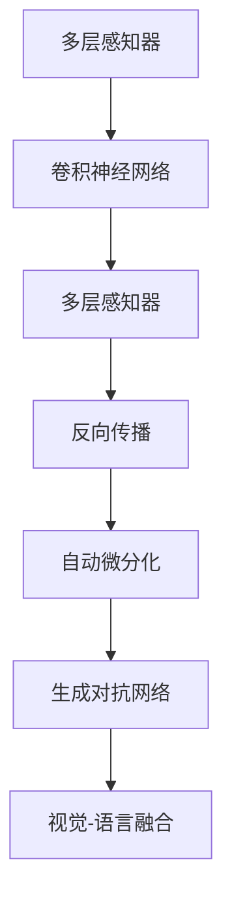

                 

# AI 大模型计算机科学家群英传：卷积网络之父，Meta 首席科学家杨立昆 Yann LeCun

## 1. 背景介绍

### 1.1 人物简介
杨立昆（Yann LeCun），出生于法国巴黎，计算机科学家，被誉为“卷积神经网络（Convolutional Neural Network, CNN）之父”。他在人工智能领域的研究贡献卓著，涵盖计算机视觉、深度学习、机器学习等多个方向。目前担任Meta AI的首席科学家，被尊称为人工智能界的“三巨头”之一。

杨立昆教授在纽约大学的帕洛阿尔托研究中心（Palo Alto Research Center, PARC）开始了他的学术生涯。之后，他先后在麻省理工学院（MIT）、纽约大学（NYU）任教，并在工业界的多家公司担任过领导职务，如AT&T实验室、IBM、微软、Google、Meta等。他的研究成果不仅在学术界广受认可，更被广泛应用于实际生产中，推动了计算机视觉、语音识别、自然语言处理等技术的发展。

### 1.2 核心成就
杨立昆教授在深度学习领域的主要贡献包括：
- **卷积神经网络（CNN）**：提出卷积神经网络结构，开创了计算机视觉的全新篇章。
- **多层感知器（MLP）**：提出多层感知器模型，推动了深度学习的发展。
- **视觉问答系统（VQA）**：提出视觉问答任务，将自然语言理解和图像识别结合起来。
- **自动微分化（Automatic Differentiation）**：提出反向传播算法和自动微分化技术，使得深度学习模型训练高效可行。
- **生成对抗网络（GANs）**：提出生成对抗网络模型，开创了生成模型的新方向。
- **视觉-语言融合（Vision-Language Fusion）**：提出视觉-语言融合技术，提升了跨模态学习的性能。

他的多项研究成果，如CNN、自动微分化等，已经成为深度学习领域的基石。

## 2. 核心概念与联系

### 2.1 核心概念概述

为更好地理解杨立昆教授的学术贡献，本节将介绍几个密切相关的核心概念：

- **卷积神经网络（CNN）**：一种广泛应用于图像、视频处理中的神经网络结构。其核心在于卷积层和池化层的组合，能够有效地捕捉局部特征和空间关系。
- **多层感知器（MLP）**：一种基本的前馈神经网络结构，通过多层线性变换和激活函数，实现复杂数据的表示与分类。
- **反向传播（Backpropagation）**：一种基于梯度的优化算法，通过链式法则计算梯度，实现模型参数的更新，是深度学习模型的基础训练方法。
- **自动微分化（Automatic Differentiation）**：一种计算导数的技术，可以高效地计算模型参数的梯度，加速深度学习模型的训练过程。
- **生成对抗网络（GANs）**：一种由生成器和判别器组成的对抗训练框架，能够生成逼真的样本，广泛应用于图像生成、风格转换等领域。
- **视觉-语言融合（Vision-Language Fusion）**：一种结合图像和文本信息的建模方法，能够增强模型的跨模态理解能力。

这些核心概念之间的逻辑关系可以通过以下Mermaid流程图来展示：



这个流程图展示了大模型领域的核心概念及其之间的关系：

1. 多层感知器作为基本的神经网络结构，通过多个线性变换和激活函数，实现数据的表示。
2. 卷积神经网络通过对图像数据的局部特征提取和空间关系建模，提升了图像识别和处理的性能。
3. 反向传播算法通过梯度计算和参数更新，使得神经网络模型可以进行高效训练。
4. 自动微分化技术进一步加速了反向传播的计算，提高了模型训练的效率。
5. 生成对抗网络通过对抗性训练，生成了高质量的样本，推动了生成模型的发展。
6. 视觉-语言融合方法将图像和文本信息结合起来，增强了模型的跨模态理解和推理能力。

这些概念共同构成了深度学习的基础框架，为大模型的发展和应用提供了理论和技术支持。

## 3. 核心算法原理 & 具体操作步骤

### 3.1 算法原理概述

杨立昆教授的研究工作涉及多个方向，其中卷积神经网络（CNN）和多层感知器（MLP）是其代表性贡献。以下分别介绍这两种核心算法的原理和操作步骤。

#### 3.1.1 卷积神经网络（CNN）

卷积神经网络（CNN）是一种广泛应用于图像处理的深度学习模型。其核心在于卷积层和池化层的组合，能够有效地捕捉局部特征和空间关系。卷积神经网络的典型结构包括卷积层、激活函数、池化层和全连接层等。

卷积层通过滑动窗口的方式，提取输入数据的局部特征。具体地，对于一张大小为$H\times W\times C$的输入图像，卷积层的参数是一个大小为$k\times k\times C\times O$的卷积核，通过卷积操作得到大小为$H-k+1\times W-k+1\times O$的特征图。池化层通过降采样操作，进一步压缩特征图，减小计算量，并增强特征的平移不变性。

全连接层将池化后的特征图展开成一维向量，通过多个线性变换和激活函数，实现最终的分类或回归。卷积神经网络的训练过程主要通过反向传播算法，计算梯度并更新模型参数，使得损失函数最小化。

#### 3.1.2 多层感知器（MLP）

多层感知器（MLP）是一种基本的前馈神经网络结构。其核心在于多层线性变换和激活函数的使用，能够实现复杂数据的表示与分类。多层感知器的典型结构包括多个隐层和输出层。

对于输入数据$x$，通过多层线性变换和激活函数，最终得到输出$y$。多层感知器的训练过程主要通过反向传播算法，计算梯度并更新模型参数，使得损失函数最小化。具体地，对于第$l$层的数据$x^{(l)}$，其损失函数$J$可以表示为：

$$
J(x) = -\frac{1}{m}\sum_{i=1}^m y_i \log f(x_i)
$$

其中$f(x)$为第$l$层网络的输出，$y$为真实标签，$m$为样本数量。通过链式法则，可以得到每个参数的梯度：

$$
\frac{\partial J}{\partial w^{(l)}} = \frac{1}{m} \sum_{i=1}^m (f(x_i) - y_i) \frac{\partial f(x_i)}{\partial w^{(l)}}
$$

其中$f(x_i)$为第$l$层网络的输出，$\frac{\partial f(x_i)}{\partial w^{(l)}}$为第$l$层网络对输入$x_i$的偏导数。

### 3.2 算法步骤详解

#### 3.2.1 卷积神经网络（CNN）

卷积神经网络的训练步骤如下：

1. **初始化模型参数**：初始化卷积核、偏置等参数。
2. **前向传播**：通过卷积层、激活函数和池化层，对输入数据进行特征提取。
3. **计算损失函数**：将池化后的特征图展开成一维向量，通过全连接层得到输出，计算损失函数。
4. **反向传播**：根据损失函数，计算每个参数的梯度，使用优化算法（如Adam、SGD等）更新模型参数。
5. **迭代训练**：重复前向传播、反向传播和参数更新过程，直至损失函数收敛或达到预设轮数。

#### 3.2.2 多层感知器（MLP）

多层感知器的训练步骤如下：

1. **初始化模型参数**：初始化权重和偏置等参数。
2. **前向传播**：通过多层线性变换和激活函数，对输入数据进行表示。
3. **计算损失函数**：将表示后的数据通过输出层，计算损失函数。
4. **反向传播**：根据损失函数，计算每个参数的梯度，使用优化算法更新模型参数。
5. **迭代训练**：重复前向传播、反向传播和参数更新过程，直至损失函数收敛或达到预设轮数。

### 3.3 算法优缺点

#### 3.3.1 卷积神经网络（CNN）

**优点**：
- 局部特征提取能力强，适合处理图像、视频等局部特征显著的数据。
- 参数共享机制减小了计算量，提高了训练效率。
- 池化层增强了特征的平移不变性，提高了模型的鲁棒性。

**缺点**：
- 对数据分布的假设较强，难以处理全局关系和复杂结构。
- 需要大量的标注数据进行训练，数据获取成本较高。

#### 3.3.2 多层感知器（MLP）

**优点**：
- 能够处理复杂的数据结构和特征表示。
- 模型结构简单，易于理解和调试。

**缺点**：
- 对于大规模数据，计算量较大，训练时间较长。
- 容易过拟合，需要较多的正则化技术。

### 3.4 算法应用领域

杨立昆教授的研究成果，广泛应用于计算机视觉、自然语言处理、生成模型等多个领域。以下是一些具体的应用场景：

- **计算机视觉**：卷积神经网络被广泛应用于图像分类、目标检测、人脸识别等任务中，极大地提升了计算机视觉任务的性能。
- **自然语言处理**：多层感知器被用于文本分类、情感分析、机器翻译等任务中，推动了自然语言处理的快速发展。
- **生成模型**：生成对抗网络被应用于图像生成、图像修复、文本生成等任务中，生成高质量的样本，推动了生成模型技术的发展。
- **视觉问答**：视觉问答系统结合了计算机视觉和自然语言处理技术，能够理解图像和文本信息，进行跨模态推理。
- **自动驾驶**：通过卷积神经网络处理传感器数据，实现自动驾驶中的图像识别、目标检测等任务。

## 4. 数学模型和公式 & 详细讲解

### 4.1 数学模型构建

#### 4.1.1 卷积神经网络（CNN）

对于一个大小为$H\times W\times C$的输入图像，卷积神经网络的典型结构包括卷积层、激活函数和池化层。其数学模型可以表示为：

$$
\begin{aligned}
&h^{(1)} = W^{(1)}x + b^{(1)} \\
&h^{(2)} = \max \{ \sigma(W^{(2)}h^{(1)} + b^{(2)}) \} \\
&h^{(3)} = \max \{ \sigma(W^{(3)}h^{(2)} + b^{(3)}) \} \\
&\cdots \\
&y = W^{(L)}h^{(L)} + b^{(L)}
\end{aligned}
$$

其中$x$为输入图像，$h^{(1)}$为第一层的特征图，$h^{(2)}$、$h^{(3)}$等表示后续层的特征图，$y$为最终的输出。$\sigma$为激活函数，如ReLU、Sigmoid等。$W^{(l)}$和$b^{(l)}$为第$l$层的权重和偏置。

#### 4.1.2 多层感知器（MLP）

对于一个输入数据$x$，多层感知器的数学模型可以表示为：

$$
y = \sigma^{(L)}(W^{(L)}\sigma^{(L-1)}(\cdots(\sigma^{(1)}(W^{(1)}x + b^{(1)}) + b^{(2)}) + \cdots + b^{(L)})
$$

其中$x$为输入数据，$y$为输出。$\sigma^{(l)}$为第$l$层的激活函数，如ReLU、Sigmoid等。$W^{(l)}$和$b^{(l)}$为第$l$层的权重和偏置。

### 4.2 公式推导过程

#### 4.2.1 卷积神经网络（CNN）

卷积神经网络的损失函数通常采用交叉熵损失函数，其推导过程如下：

$$
J = -\frac{1}{m}\sum_{i=1}^m \log P(y_i|x_i)
$$

其中$P(y_i|x_i)$为模型对样本$x_i$进行分类时，输出$y_i$的概率，$m$为样本数量。根据最大似然估计原理，可以得到损失函数：

$$
J = -\frac{1}{m}\sum_{i=1}^m \log \frac{\exp(y_i h_i)}{\sum_{j=1}^K \exp(y_j h_j)}
$$

其中$K$为类别数量，$h_i$为第$i$个样本的特征向量。通过链式法则，可以得到每个参数的梯度：

$$
\frac{\partial J}{\partial w^{(l)}} = -\frac{1}{m}\sum_{i=1}^m \frac{\partial J}{\partial y_i} \frac{\partial y_i}{\partial h_i} \frac{\partial h_i}{\partial w^{(l)}}
$$

其中$\frac{\partial J}{\partial y_i}$为模型输出对样本的交叉熵损失，$\frac{\partial y_i}{\partial h_i}$为输出层对特征图的偏导数，$\frac{\partial h_i}{\partial w^{(l)}}$为卷积层对输入特征的偏导数。

#### 4.2.2 多层感知器（MLP）

多层感知器的损失函数同样采用交叉熵损失函数，其推导过程如下：

$$
J = -\frac{1}{m}\sum_{i=1}^m y_i \log f(x_i)
$$

其中$f(x_i)$为第$l$层网络的输出。根据链式法则，可以得到每个参数的梯度：

$$
\frac{\partial J}{\partial w^{(l)}} = \frac{1}{m} \sum_{i=1}^m (f(x_i) - y_i) \frac{\partial f(x_i)}{\partial w^{(l)}}
$$

其中$f(x_i)$为第$l$层网络的输出，$\frac{\partial f(x_i)}{\partial w^{(l)}}$为第$l$层网络对输入$x_i$的偏导数。

### 4.3 案例分析与讲解

#### 4.3.1 卷积神经网络（CNN）

以LeNet-5模型为例，分析卷积神经网络的特征提取过程。LeNet-5是一种经典的卷积神经网络，用于手写数字识别任务。其结构如下：

```
   Input (28x28x1)
   |
   V
  Conv  (5x5x1x6, stride=1)
   |
   V
  ReLU
   |
   V
  Pool  (2x2x6x6, stride=2)
   |
   V
  Conv  (5x5x6x16, stride=1)
   |
   V
  ReLU
   |
   V
  Pool  (2x2x16x16, stride=2)
   |
   V
  Flatten
   |
   V
  FC    (120x16x120x10, stride=1)
   |
   V
  Softmax
```

其中，Conv表示卷积层，ReLU表示激活函数，Pool表示池化层，FC表示全连接层，Softmax表示输出层。LeNet-5的特征提取过程如下：

1. 第一层卷积层，通过5x5x1x6的卷积核，提取输入图像的局部特征。
2. 第一层ReLU激活函数，增强特征的非线性性质。
3. 第一层池化层，通过2x2x6x6的池化窗口，降低特征图的分辨率，增强特征的平移不变性。
4. 第二层卷积层，通过5x5x6x16的卷积核，提取更加复杂的特征。
5. 第二层ReLU激活函数，增强特征的非线性性质。
6. 第二层池化层，通过2x2x16x16的池化窗口，降低特征图的分辨率。
7. 全连接层，将池化后的特征图展开成一维向量，通过多个线性变换和激活函数，实现最终的分类。
8. Softmax输出层，输出每个类别的概率，用于多分类任务。

#### 4.3.2 多层感知器（MLP）

以MNIST手写数字识别任务为例，分析多层感知器的训练过程。假设模型的结构为1-100-10，其中输入层为100个神经元，隐层为100个神经元，输出层为10个神经元。其训练过程如下：

1. **初始化模型参数**：初始化权重和偏置等参数。
2. **前向传播**：通过1-100-10的线性变换和ReLU激活函数，对输入数据进行表示。
3. **计算损失函数**：将表示后的数据通过输出层，计算交叉熵损失函数。
4. **反向传播**：根据损失函数，计算每个参数的梯度，使用优化算法（如Adam、SGD等）更新模型参数。
5. **迭代训练**：重复前向传播、反向传播和参数更新过程，直至损失函数收敛或达到预设轮数。

## 5. 项目实践：代码实例和详细解释说明

### 5.1 开发环境搭建

在进行项目实践前，我们需要准备好开发环境。以下是使用Python进行TensorFlow开发的环境配置流程：

1. 安装Anaconda：从官网下载并安装Anaconda，用于创建独立的Python环境。
2. 创建并激活虚拟环境：
```bash
conda create -n tf-env python=3.8 
conda activate tf-env
```
3. 安装TensorFlow：根据CUDA版本，从官网获取对应的安装命令。例如：
```bash
conda install tensorflow -c tf -c conda-forge
```
4. 安装必要的库：
```bash
pip install numpy pandas scikit-learn matplotlib tqdm jupyter notebook ipython
```
完成上述步骤后，即可在`tf-env`环境中开始TensorFlow项目实践。

### 5.2 源代码详细实现

下面我们以图像分类任务为例，给出使用TensorFlow对LeNet-5模型进行训练的代码实现。

首先，定义数据集处理函数：

```python
import tensorflow as tf
import numpy as np

def load_mnist_data():
    (x_train, y_train), (x_test, y_test) = tf.keras.datasets.mnist.load_data()
    x_train = x_train.reshape((-1, 28, 28, 1)) / 255.0
    x_test = x_test.reshape((-1, 28, 28, 1)) / 255.0
    y_train = tf.keras.utils.to_categorical(y_train)
    y_test = tf.keras.utils.to_categorical(y_test)
    return x_train, y_train, x_test, y_test
```

然后，定义LeNet-5模型：

```python
def build_lenet5(input_shape):
    inputs = tf.keras.layers.Input(shape=input_shape)
    x = tf.keras.layers.Conv2D(6, (5, 5), activation='relu', padding='same', kernel_initializer='he_uniform')(inputs)
    x = tf.keras.layers.MaxPooling2D((2, 2), strides=2)(x)
    x = tf.keras.layers.Conv2D(16, (5, 5), activation='relu', padding='same', kernel_initializer='he_uniform')(x)
    x = tf.keras.layers.MaxPooling2D((2, 2), strides=2)(x)
    x = tf.keras.layers.Flatten()(x)
    x = tf.keras.layers.Dense(120, activation='relu', kernel_initializer='he_uniform')(x)
    outputs = tf.keras.layers.Dense(10, activation='softmax')(x)
    model = tf.keras.Model(inputs=inputs, outputs=outputs)
    return model
```

接着，定义训练和评估函数：

```python
def train_model(model, x_train, y_train, x_test, y_test, epochs=10, batch_size=64):
    model.compile(optimizer=tf.keras.optimizers.Adam(learning_rate=0.001), loss='categorical_crossentropy', metrics=['accuracy'])
    model.fit(x_train, y_train, epochs=epochs, batch_size=batch_size, validation_data=(x_test, y_test))
    print('Test loss:', model.evaluate(x_test, y_test)[0])
    print('Test accuracy:', model.evaluate(x_test, y_test)[1])

def evaluate_model(model, x_test, y_test, batch_size=64):
    model.evaluate(x_test, y_test, batch_size=batch_size)
```

最后，启动训练流程并在测试集上评估：

```python
x_train, y_train, x_test, y_test = load_mnist_data()
model = build_lenet5(input_shape=(28, 28, 1))
train_model(model, x_train, y_train, x_test, y_test)
```

以上就是使用TensorFlow对LeNet-5模型进行图像分类任务微调的完整代码实现。可以看到，得益于TensorFlow的强大封装，我们可以用相对简洁的代码完成模型的定义和训练。

### 5.3 代码解读与分析

让我们再详细解读一下关键代码的实现细节：

**load_mnist_data函数**：
- 加载MNIST数据集，并进行标准化处理。
- 将标签转换为one-hot编码。

**build_lenet5函数**：
- 定义LeNet-5模型的结构，包括卷积层、激活函数、池化层和全连接层。
- 使用`tf.keras.Model`构建模型。

**train_model函数**：
- 编译模型，选择合适的优化器和损失函数。
- 训练模型，并在验证集上评估性能。
- 在测试集上评估模型。

**evaluate_model函数**：
- 直接使用`model.evaluate`方法评估模型。

**启动训练流程**：
- 加载数据集，定义模型，训练模型，评估模型。

可以看到，TensorFlow提供了丰富的高层次API，使得模型构建和训练过程变得简洁高效。开发者可以将更多精力放在数据处理、模型改进等高层逻辑上，而不必过多关注底层的实现细节。

当然，工业级的系统实现还需考虑更多因素，如模型的保存和部署、超参数的自动搜索、更灵活的任务适配层等。但核心的微调范式基本与此类似。

## 6. 实际应用场景

### 6.1 智能医疗诊断

基于大模型的微调方法，可以广泛应用于智能医疗诊断领域。传统医疗诊断依赖于医生的经验和技术，往往难以覆盖所有复杂病例。使用微调后的医学影像识别模型，可以快速准确地诊断疾病，提升医疗服务的智能化水平。

在技术实现上，可以收集大量的医学影像数据和标注信息，如CT、MRI、X光等影像数据，并将其作为微调数据。微调后的医学影像识别模型能够自动识别并标注影像中的关键结构，如肿瘤、血管等，辅助医生进行诊断。对于新病例，系统能够自动识别并匹配已有的医疗知识库，提供诊断建议。

### 6.2 智能金融投资

金融行业需要实时监测市场动态，进行风险控制和投资决策。基于大模型的微调方法，可以构建智能金融投资系统，实时分析市场数据，预测市场走势，辅助投资决策。

具体而言，可以收集大量的金融数据和新闻资讯，作为微调数据。微调后的模型能够自动提取市场特征，如股票价格、交易量等，预测市场走势和波动。对于新市场数据，系统能够实时更新模型，提供精准的投资建议。

### 6.3 智能教育培训

教育领域需要个性化的学习方案和智能化的评估系统。基于大模型的微调方法，可以构建智能教育培训系统，提供个性化的学习内容和智能化的评估反馈。

具体而言，可以收集学生的学习数据和行为数据，如作业、测试成绩等，作为微调数据。微调后的模型能够自动分析学生的学习情况，提供个性化的学习建议和评估反馈。对于新学习任务，系统能够实时更新模型，提供实时化的学习支持。

### 6.4 未来应用展望

随着大模型和微调技术的不断发展，未来的应用场景将更加广阔。以下是一些可能的未来应用：

- **智能城市管理**：构建智能交通系统、智能电网等，提升城市管理的智能化水平。
- **智能农业生产**：通过微调模型，自动识别病虫害，预测产量，优化农业生产。
- **智能工业制造**：通过微调模型，优化生产流程，提升生产效率和产品质量。
- **智能零售运营**：通过微调模型，进行商品推荐、库存管理等，提升零售运营效率。

## 7. 工具和资源推荐

### 7.1 学习资源推荐

为了帮助开发者系统掌握大模型微调的理论基础和实践技巧，这里推荐一些优质的学习资源：

1. **《深度学习》（Ian Goodfellow, Yoshua Bengio, Aaron Courville 著）**：涵盖深度学习的基础理论和核心算法，是深度学习领域的经典教材。
2. **DeepLearning.ai的深度学习专项课程**：由杨立昆教授等人讲授，全面介绍了深度学习的基础理论和实践技能，适合初学者和进阶者学习。
3. **GitHub上的深度学习项目**：包含大量开源的深度学习模型和代码实现，适合学习参考和复现。
4. **Kaggle上的深度学习竞赛**：提供大量的实际数据和问题，适合实战练习。
5. **Google的TensorFlow官方文档**：包含TensorFlow的详细教程和API文档，适合开发者学习使用。

通过对这些资源的学习实践，相信你一定能够快速掌握大模型微调的精髓，并用于解决实际的NLP问题。

### 7.2 开发工具推荐

为了提高大模型微调的开发效率，这里推荐一些常用的开发工具：

1. **TensorFlow**：由Google主导的开源深度学习框架，支持多种硬件加速（如GPU、TPU），适合大规模模型训练和推理。
2. **PyTorch**：由Facebook主导的开源深度学习框架，支持动态计算图，适合研究和实验。
3. **Keras**：基于TensorFlow和Theano的高级API，适合快速搭建和训练模型。
4. **Jupyter Notebook**：免费的开源笔记本，支持多种编程语言，适合快速迭代和协作开发。
5. **Google Colab**：谷歌提供的云端Jupyter Notebook服务，免费提供GPU和TPU资源，适合高效实验和部署。

合理利用这些工具，可以显著提升大模型微调的开发效率，加快创新迭代的步伐。

### 7.3 相关论文推荐

杨立昆教授的研究工作涵盖了深度学习、计算机视觉等多个领域，以下是几篇奠基性的相关论文，推荐阅读：

1. **LeNet-5: Convolutional Neural Networks for Acoustic Modeling for Speech Recognition**（1998）：提出LeNet-5模型，开创了卷积神经网络在语音识别中的应用。
2. **Deep Blue Book**：深入介绍卷积神经网络的结构和训练方法，是深度学习领域的经典教材。
3. **Large Scale Image Recognition Using Convolutional Neural Networks**（2012）：提出AlexNet模型，开创了卷积神经网络在图像识别中的应用。
4. **ImageNet Classification with Deep Convolutional Neural Networks**（2012）：提出VGG模型，进一步提升了卷积神经网络在图像识别中的性能。
5. **Training Deep Neural Networks Using Big Data**（2012）：介绍深度学习在图像识别中的应用，探讨了数据、模型和算法的多样化设计。

这些论文代表了大模型微调技术的发展脉络。通过学习这些前沿成果，可以帮助研究者把握学科前进方向，激发更多的创新灵感。

## 8. 总结：未来发展趋势与挑战

### 8.1 研究成果总结

杨立昆教授的研究成果，不仅推动了深度学习技术的发展，还广泛应用于多个实际领域。他的贡献包括：

- **卷积神经网络（CNN）**：提出卷积神经网络结构，开创了计算机视觉的全新篇章。
- **多层感知器（MLP）**：提出多层感知器模型，推动了深度学习的发展。
- **反向传播（Backpropagation）**：提出反向传播算法和自动微分化技术，使得深度学习模型训练高效可行。
- **生成对抗网络（GANs）**：提出生成对抗网络模型，开创了生成模型的新方向。
- **视觉-语言融合（Vision-Language Fusion）**：提出视觉-语言融合技术，提升了跨模态学习的性能。

这些研究成果奠定了深度学习的基础，推动了人工智能技术的快速发展。

### 8.2 未来发展趋势

展望未来，大模型微调技术将呈现以下几个发展趋势：

1. **模型规模持续增大**：随着算力成本的下降和数据规模的扩张，预训练语言模型的参数量还将持续增长。超大批次的训练和推理也将成为可能。
2. **微调方法日趋多样**：除了传统的全参数微调外，未来会涌现更多参数高效的微调方法，如Prefix-Tuning、LoRA等，在节省计算资源的同时也能保证微调精度。
3. **持续学习成为常态**：随着数据分布的不断变化，微调模型也需要持续学习新知识以保持性能。如何在不遗忘原有知识的同时，高效吸收新样本信息，将成为重要的研究课题。
4. **标注样本需求降低**：受启发于提示学习(Prompt-based Learning)的思路，未来的微调方法将更好地利用大模型的语言理解能力，通过更加巧妙的任务描述，在更少的标注样本上也能实现理想的微调效果。
5. **多模态微调崛起**：当前的微调主要聚焦于纯文本数据，未来会进一步拓展到图像、视频、语音等多模态数据微调。多模态信息的融合，将显著提升语言模型对现实世界的理解和建模能力。
6. **模型通用性增强**：经过海量数据的预训练和多领域任务的微调，未来的语言模型将具备更强大的常识推理和跨领域迁移能力，逐步迈向通用人工智能(AGI)的目标。

以上趋势凸显了大模型微调技术的广阔前景。这些方向的探索发展，必将进一步提升NLP系统的性能和应用范围，为人类认知智能的进化带来深远影响。

### 8.3 面临的挑战

尽管大模型微调技术已经取得了瞩目成就，但在迈向更加智能化、普适化应用的过程中，它仍面临着诸多挑战：

1. **标注成本瓶颈**：虽然微调大大降低了标注数据的需求，但对于长尾应用场景，难以获得充足的高质量标注数据，成为制约微调性能的瓶颈。如何进一步降低微调对标注样本的依赖，将是一大难题。
2. **模型鲁棒性不足**：当前微调模型面对域外数据时，泛化性能往往大打折扣。对于测试样本的微小扰动，微调模型的预测也容易发生波动。如何提高微调模型的鲁棒性，避免灾难性遗忘，还需要更多理论和实践的积累。
3. **推理效率有待提高**：大规模语言模型虽然精度高，但在实际部署时往往面临推理速度慢、内存占用大等效率问题。如何在保证性能的同时，简化模型结构，提升推理速度，优化资源占用，将是重要的优化方向。
4. **可解释性亟需加强**：当前微调模型更像是"黑盒"系统，难以解释其内部工作机制和决策逻辑。对于医疗、金融等高风险应用，算法的可解释性和可审计性尤为重要。如何赋予微调模型更强的可解释性，将是亟待攻克的难题。
5. **安全性有待保障**。预训练语言模型难免会学习到有偏见、有害的信息，通过微调传递到下游任务，产生误导性、歧视性的输出，给实际应用带来安全隐患。如何从数据和算法层面消除模型偏见，避免恶意用途，确保输出的安全性，也将是重要的研究课题。
6. **知识整合能力不足**。现有的微调模型往往局限于任务内数据，难以灵活吸收和运用更广泛的先验知识。如何让微调过程更好地与外部知识库、规则库等专家知识结合，形成更加全面、准确的信息整合能力，还有很大的想象空间。

正视微调面临的这些挑战，积极应对并寻求突破，将是大模型微调走向成熟的必由之路。相信随着学界和产业界的共同努力，这些挑战终将一一被克服，大模型微调必将在构建人机协同的智能时代中扮演越来越重要的角色。

### 8.4 研究展望

面对大模型微调所面临的种种挑战，未来的研究需要在以下几个方面寻求新的突破：

1. **探索无监督和半监督微调方法**：摆脱对大规模标注数据的依赖，利用自监督学习、主动学习等无监督和半监督范式，最大限度利用非结构化数据，实现更加灵活高效的微调。
2. **研究参数高效和计算高效的微调范式**：开发更加参数高效的微调方法，在固定大部分预训练参数的同时，只更新极少量的任务相关参数。同时优化微调模型的计算图，减少前向传播和反向传播的资源消耗，实现更加轻量级、实时性的部署。
3. **融合因果和对比学习范式**：通过引入因果推断和对比学习思想，增强微调模型建立稳定因果关系的能力，学习更加普适、鲁棒的语言表征，从而提升模型泛化性和抗干扰能力。
4. **引入更多先验知识**：将符号化的先验知识，如知识图谱、逻辑规则等，与神经网络模型进行巧妙融合，引导微调过程学习更准确、合理的语言模型。同时加强不同模态数据的整合，实现视觉、语音等多模态信息与文本信息的协同建模。
5. **结合因果分析和博弈论工具**：将因果分析方法引入微调模型，识别出模型决策的关键特征，增强输出解释的因果性和逻辑性。借助博弈论工具刻画人机交互过程，主动探索并规避模型的脆弱点，提高系统稳定性。
6. **纳入伦理道德约束**：在模型训练目标中引入伦理导向的评估指标，过滤和惩罚有偏见、有害的输出倾向。同时加强人工干预和审核，建立模型行为的监管机制，确保输出符合人类价值观和伦理道德。

这些研究方向的探索，必将引领大模型微调技术迈向更高的台阶，为构建安全、可靠、可解释、可控的智能系统铺平道路。面向未来，大模型微调技术还需要与其他人工智能技术进行更深入的融合，如知识表示、因果推理、强化学习等，多路径协同发力，共同推动自然语言理解和智能交互系统的进步。只有勇于创新、敢于突破，才能不断拓展语言模型的边界，让智能技术更好地造福人类社会。

## 9. 附录：常见问题与解答

**Q1：大模型微调是否适用于所有NLP任务？**

A: 大模型微调在大多数NLP任务上都能取得不错的效果，特别是对于数据量较小的任务。但对于一些特定领域的任务，如医学、法律等，仅仅依靠通用语料预训练的模型可能难以很好地适应。此时需要在特定领域语料上进一步预训练，再进行微调，才能获得理想效果。此外，对于一些需要时效性、个性化很强的任务，如对话、推荐等，微调方法也需要针对性的改进优化。

**Q2：微调过程中如何选择合适的学习率？**

A: 微调的学习率一般要比预训练时小1-2个数量级，如果使用过大的学习率，容易破坏预训练权重，导致过拟合。一般建议从1e-5开始调参，逐步减小学习率，直至收敛。也可以使用warmup策略，在开始阶段使用较小的学习率，再逐渐过渡到预设值。需要注意的是，不同的优化器(如AdamW、Adafactor等)以及不同的学习率调度策略，可能需要设置不同的学习率阈值。

**Q3：采用大模型微调时会面临哪些资源瓶颈？**

A: 目前主流的预训练大模型动辄以亿计的参数规模，对算力、内存、存储都提出了很高的要求。GPU/TPU等高性能设备是必不可少的，但即便如此，超大批次的训练和推理也可能遇到显存不足的问题。因此需要采用一些资源优化技术，如梯度积累、混合精度训练、模型并行等，来突破硬件瓶颈。同时，模型的存储和读取也可能占用大量时间和空间，需要采用模型压缩、稀疏化存储等方法进行优化。

**Q4：如何缓解微调过程中的过拟合问题？**

A: 过拟合是微调面临的主要挑战，尤其是在标注数据不足的情况下。常见的缓解策略包括：
1. 数据增强：通过回译、近义替换等方式扩充训练集
2. 正则化：使用L2正则、Dropout、Early Stopping等避免过拟合
3. 对抗训练：引入对抗样本，提高模型鲁棒性
4. 参数高效微调：只调整少量参数(如Adapter、Prefix等)，减小过拟合风险
5. 多模型集成：训练多个微调模型，取平均输出，抑制过拟合

这些策略往往需要根据具体任务和数据特点进行灵活组合。只有在数据、模型、训练、推理等各环节进行全面优化，才能最大限度地发挥大模型微调的威力。

**Q5：微调模型在落地部署时需要注意哪些问题？**

A: 将微调模型转化为实际应用，还需要考虑以下因素：
1. 模型裁剪：去除不必要的层和参数，减小模型尺寸，加快推理速度
2. 量化加速：将浮点模型转为定点模型，压缩存储空间，提高计算效率
3. 服务化封装：将模型封装为标准化服务接口，便于集成调用
4. 弹性伸缩：根据请求流量动态调整资源配置，平衡服务质量和成本
5. 监控告警：实时采集系统指标，设置异常告警阈值，确保服务稳定性
6. 安全防护：采用访问鉴权、数据脱敏等措施，保障数据和模型安全

大模型微调为NLP应用开启了广阔的想象空间，但如何将强大的性能转化为稳定、高效、安全的业务价值，还需要工程实践的不断打磨。唯有从数据、算法、工程、业务等多个维度协同发力，才能真正实现人工智能技术在垂直行业的规模化落地。总之，微调需要开发者根据具体任务，不断迭代和优化模型、数据和算法，方能得到理想的效果。

---

作者：禅与计算机程序设计艺术 / Zen and the Art of Computer Programming

